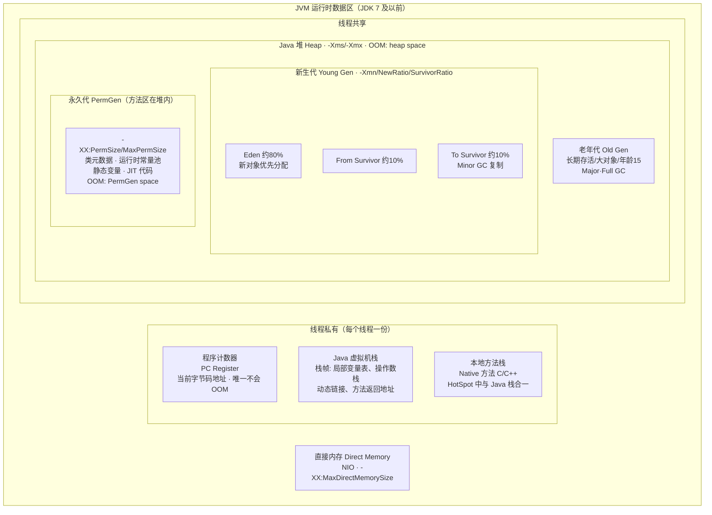
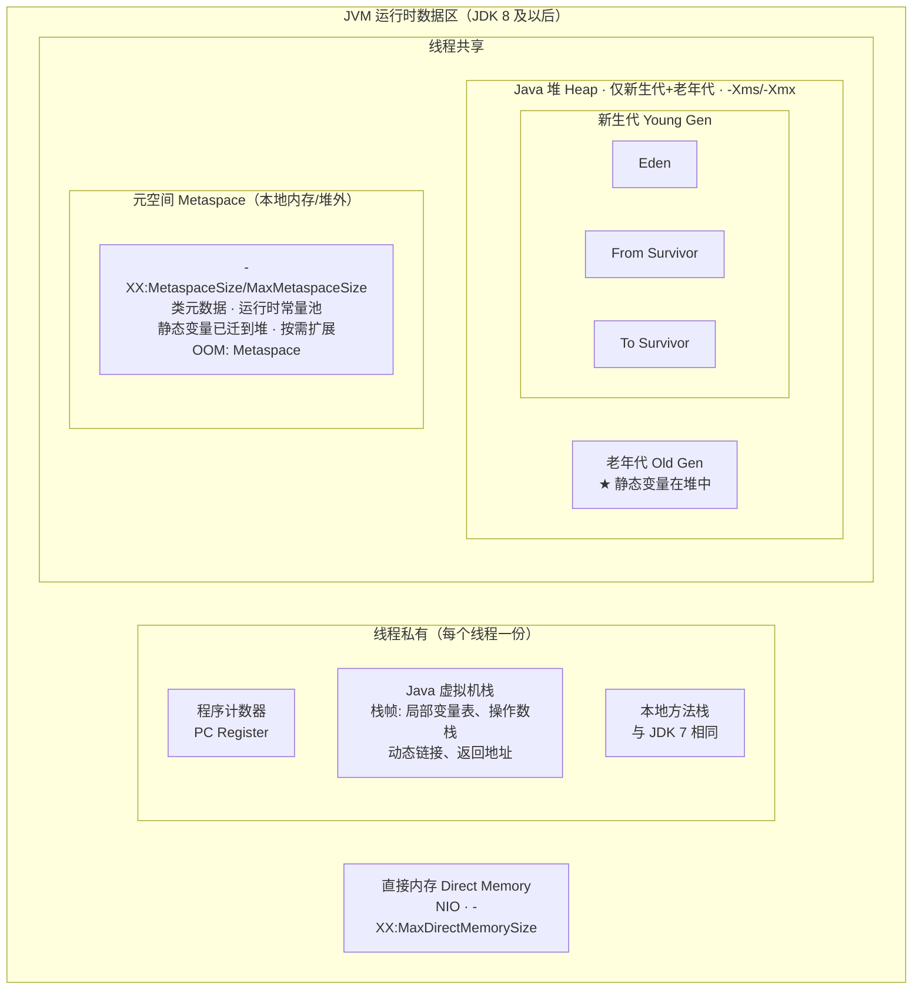
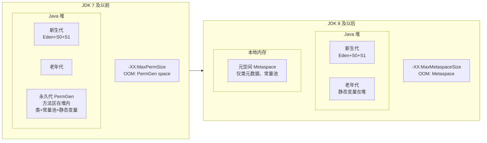
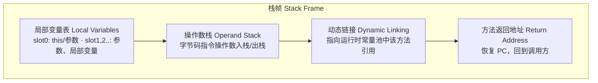
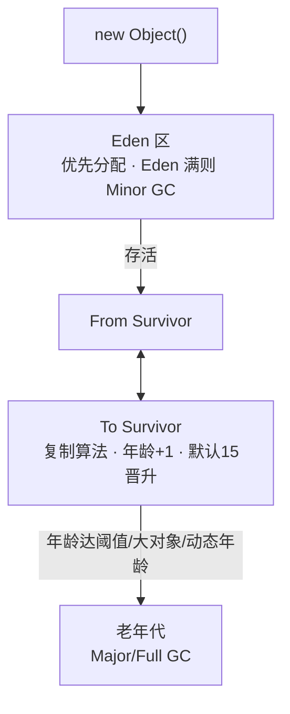

# JVM 内存模型详细对比图（JDK 7 及以前 vs JDK 8 及以后）

---

## 一、JDK 7 及以前（永久代时代）

---

## 二、JDK 8 及以后（元空间时代）

---

## 三、核心差异对照（一图看清）

---

## 四、栈帧结构（线程私有，两版本相同）

---

## 五、对象在堆中的走向（两版本相同）

---

## 六、参数速查

| 区域       | JDK 7 及以前              | JDK 8 及以后                 |
|------------|---------------------------|------------------------------|
| 堆         | -Xms, -Xmx, -Xmn         | 同左                          |
| 方法区实现 | -XX:PermSize, -XX:MaxPermSize | -XX:MetaspaceSize, -XX:MaxMetaspaceSize |
| 栈         | -Xss                      | 同左                          |
| 直接内存   | -XX:MaxDirectMemorySize   | 同左                          |

---

以上为更详细的 JVM 内存模型对比图，便于区分 JDK 8 前后差异。  
在支持 Mermaid 的编辑器（如 VS Code 装 Mermaid 插件、Typora、GitHub 等）中预览即可看到自动对齐的流程图。
