# JVM 原理完全详解

> 一份尽可能完整的 JVM 知识体系，涵盖架构、类加载、内存模型、对象生命周期、垃圾回收、执行引擎、JMM、调优工具与参数。

---

## 目录

1. [JVM 总览与架构](#1-jvm-总览与架构)
2. [类加载子系统](#2-类加载子系统)
3. [运行时数据区（内存模型）](#3-运行时数据区内存模型)
4. [对象的完整生命周期](#4-对象的完整生命周期)
5. [垃圾回收（GC）](#5-垃圾回收gc)
6. [执行引擎](#6-执行引擎)
7. [Java 内存模型（JMM）](#7-java-内存模型jmm)
8. [常用 JVM 调优工具](#8-常用-jvm-调优工具)
9. [JVM 参数速查大全](#9-jvm-参数速查大全)
10. [面试高频问题汇总](#10-面试高频问题汇总)

---

## 1. JVM 总览与架构

### 1.1 JDK、JRE、JVM 的关系

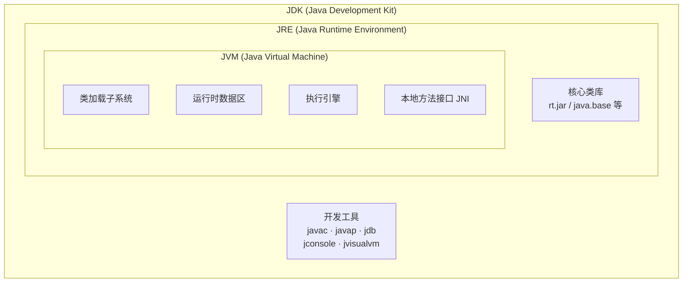

- **JVM**：只负责执行字节码，是最底层的虚拟机。
- **JRE**：JVM + 核心类库（如 `java.lang`、`java.util`），能运行 Java 程序。
- **JDK**：JRE + 开发工具（`javac`、`javap`、`jdb` 等），能编译 + 运行。

### 1.2 JVM 整体架构

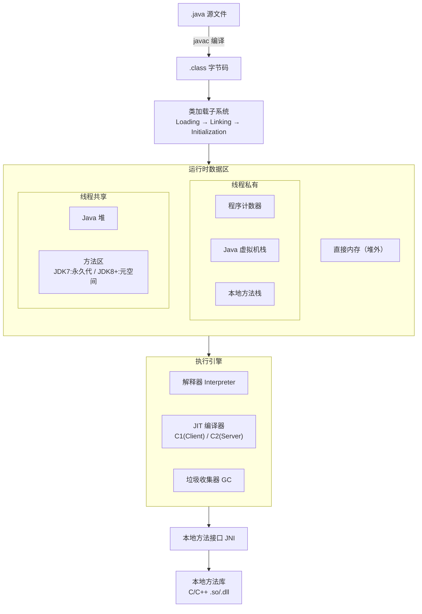

### 1.3 Java 程序执行流程

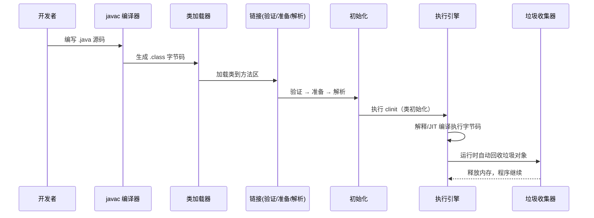

### 1.4 JVM 的生命周期

| 阶段 | 说明 |
|------|------|
| **启动** | 通过 `java` 命令（或嵌入式 API）创建 JVM 实例，引导类加载器加载核心类库 |
| **运行** | 执行 `main()` 方法，期间持续进行类加载、字节码执行、GC 等 |
| **退出** | `main()` 正常结束 / `System.exit()` / 未捕获异常 / `Runtime.halt()` / 外部 `kill` 信号 |

---

## 2. 类加载子系统

### 2.1 类的生命周期（7 个阶段）


其中「验证 → 准备 → 解析」统称 **链接（Linking）**。

### 2.2 各阶段详解

#### 2.2.1 加载（Loading）

| 步骤 | 做什么 |
|------|--------|
| 1 | 通过类的全限定名（如 `java.lang.String`）找到对应 `.class` 文件的二进制字节流 |
| 2 | 将字节流代表的静态存储结构转化为**方法区的运行时数据结构** |
| 3 | 在**堆**中生成一个 `java.lang.Class` 对象，作为方法区该类数据的访问入口 |

字节流来源可以是：
- 本地文件系统的 `.class` 文件
- JAR / WAR / ZIP 包
- 网络（如 Applet）
- 动态代理生成（`Proxy`）
- JSP 生成的 Class
- 数据库中的二进制流

#### 2.2.2 验证（Verification）

确保 `.class` 文件的字节流合法且安全，不会危害 JVM：

| 验证类型 | 内容 |
|----------|------|
| **文件格式验证** | 魔数 `0xCAFEBABE`、版本号、常量池合法性 |
| **元数据验证** | 是否有父类、是否继承了 `final` 类、抽象方法是否实现 |
| **字节码验证** | 操作数栈数据类型匹配、跳转指令合法、类型转换合法 |
| **符号引用验证** | 能否找到引用的类/方法/字段、访问权限是否满足 |

#### 2.2.3 准备（Preparation）

- 为**类变量（static）**分配内存，并设为**零值**（不是代码里的初始值）。
- 内存在**方法区**（JDK 7 永久代 / JDK 8 元空间）。
- 注意：`static final` 常量在准备阶段就会赋上代码里的值（ConstantValue 属性）。

```java
public static int value = 123;       // 准备阶段: value = 0, 初始化阶段才 = 123
public static final int CONST = 456; // 准备阶段就 = 456 (编译期常量)
```

#### 2.2.4 解析（Resolution）

- 将常量池中的**符号引用**替换为**直接引用**（内存地址/偏移量）。
- 包括：类/接口解析、字段解析、方法解析、接口方法解析。

#### 2.2.5 初始化（Initialization）

- 执行类构造器 `<clinit>()` 方法（编译器自动收集所有 `static` 变量的赋值语句和 `static {}` 块）。
- **JVM 保证 `<clinit>()` 在多线程环境下加锁同步**（所以单例用 `static` 天然线程安全）。
- 初始化时机（6 种"主动引用"）：
  1. `new` 实例、读写 `static` 字段、调用 `static` 方法
  2. 反射调用 `Class.forName()`
  3. 初始化子类时，发现父类还没初始化
  4. JVM 启动时的主类（包含 `main()` 的类）
  5. JDK 7+ `MethodHandle` 解析的类
  6. JDK 8+ 接口有 `default` 方法，实现类初始化时

#### 2.2.6 使用（Using）

- 正常在代码里使用该类创建对象、调用方法等。

#### 2.2.7 卸载（Unloading）

- 需要同时满足：该类的所有实例已被回收、加载它的 ClassLoader 已被回收、对应 `Class` 对象没有被引用。
- **由引导类加载器（Bootstrap）加载的类基本不会被卸载**。

### 2.3 类加载器层次

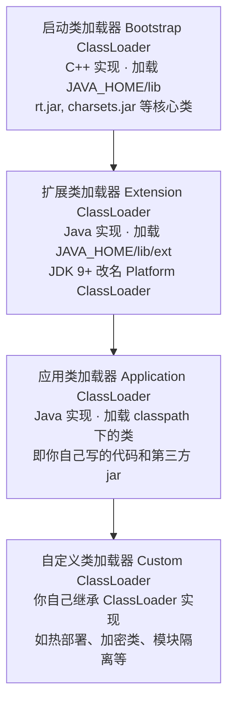

### 2.4 双亲委派模型

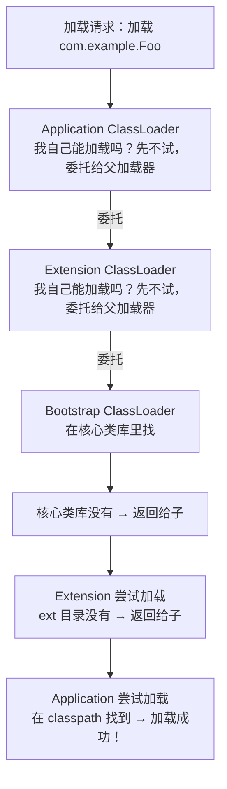

**核心逻辑**：先让父加载器尝试，父加载器搞不定再自己来。

**为什么要双亲委派？**
1. **安全性**：防止用户自定义一个 `java.lang.String` 覆盖核心类。
2. **避免重复加载**：同一个类只会被加载一次（由最上层能处理的加载器加载）。
3. **一致性**：保证核心 API 不被篡改。

**打破双亲委派的场景**：
- **SPI 机制**（如 JDBC）：Bootstrap 加载了接口，但实现类在 classpath，需要线程上下文类加载器。
- **OSGi / 模块热部署**：每个 Bundle 有自己的类加载器。
- **Tomcat**：每个 Web 应用有独立的类加载器，实现应用隔离。

---

## 3. 运行时数据区（内存模型）

### 3.1 全景图（JDK 8+）

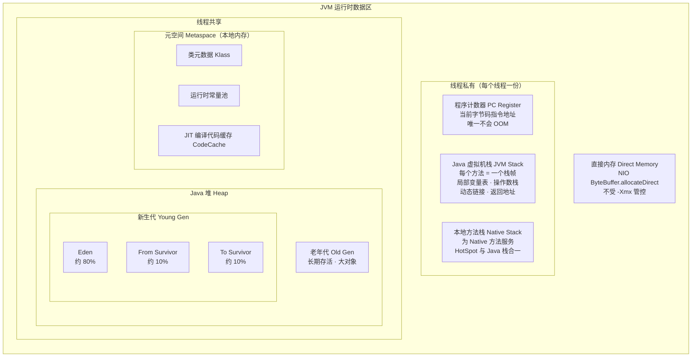

### 3.2 程序计数器（PC Register）

| 特性 | 说明 |
|------|------|
| 线程属性 | **线程私有**，每个线程各一个 |
| 存什么 | 当前线程正在执行的字节码指令的**地址** |
| 执行 Native 时 | 值为 **Undefined** |
| 异常 | **唯一不会 OOM 的区域**（大小固定，不需要动态分配） |
| 为什么需要 | CPU 时间片轮转，线程切换后需要知道从哪继续执行 |

### 3.3 Java 虚拟机栈（JVM Stack）

- **线程私有**，生命周期与线程相同。
- 每调用一个方法，就创建一个**栈帧（Stack Frame）**，方法结束就弹出。
- 默认大小 `-Xss`（通常 512K ~ 1M）。

#### 栈帧的 4 个组成部分

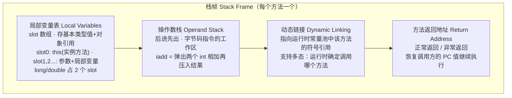

#### 异常

| 异常 | 触发条件 |
|------|----------|
| **StackOverflowError** | 栈深度超过允许的最大深度（如无限递归） |
| **OutOfMemoryError** | 栈扩展时无法申请到足够内存（如不断创建线程） |

### 3.4 本地方法栈（Native Method Stack）

- 与虚拟机栈类似，但为 **Native 方法（JNI 调用的 C/C++ 方法）** 服务。
- HotSpot 将本地方法栈和 Java 虚拟机栈**合二为一**。
- 同样可能抛出 StackOverflowError / OOM。

### 3.5 Java 堆（Heap）

**最大的一块内存，GC 的主战场，所有对象实例在这里分配。**

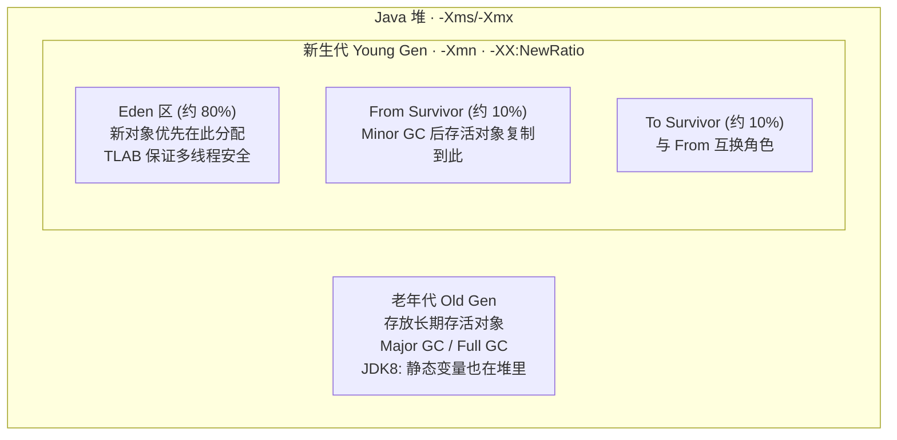

**核心特点**：
1. **线程共享**：所有线程共享同一块堆。
2. **可扩展**：`-Xms`（初始） 到 `-Xmx`（最大）之间按需扩展。
3. **物理上可不连续**：逻辑上连续即可。
4. **GC 主战场**：Minor GC（新生代）、Major/Full GC（老年代 + 可能整堆）。

### 3.6 方法区 / 永久代 / 元空间

**方法区是规范概念，永久代和元空间是两种实现。**

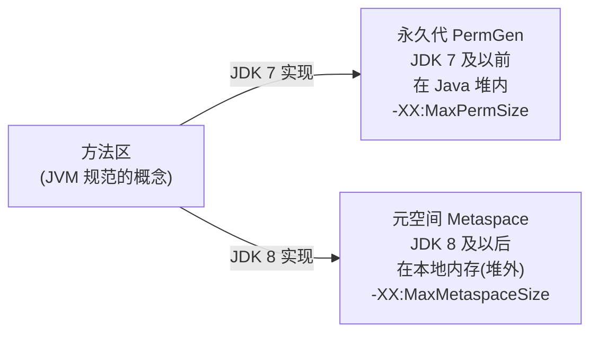

**方法区存储内容**：

| 内容 | 说明 |
|------|------|
| **类元数据** | 类名、访问修饰符、字段、方法、接口信息等 |
| **运行时常量池** | 编译期字面量 + 符号引用，运行期可动态添加（如 `String.intern()`） |
| **静态变量** | JDK 7: 在永久代；JDK 8+: 迁到堆中 |
| **JIT 编译代码** | 即时编译器编译后的本地机器码（CodeCache） |

**永久代 vs 元空间对比**：

| 特性 | 永久代 PermGen | 元空间 Metaspace |
|------|---------------|-----------------|
| 所在位置 | Java 堆内 | 本地内存（堆外） |
| 大小限制 | `-XX:MaxPermSize` 固定上限 | 默认受系统内存限制 |
| OOM 异常 | `PermGen space` | `Metaspace` |
| GC 行为 | Full GC 时回收 | 满时触发 Full GC |
| 为什么替换 | 调优困难、易溢出、与堆争空间 | 更灵活、不占堆、可按需增长 |

### 3.7 运行时常量池

- 是方法区的一部分。
- `.class` 文件中的常量池表（Constant Pool Table）在类加载后放入运行时常量池。
- **动态性**：不仅有编译期常量，运行期也可以加入新常量（如 `String.intern()`）。
- 溢出异常：`OutOfMemoryError: PermGen space`（JDK 7）/ `Metaspace`（JDK 8+）。

### 3.8 直接内存（Direct Memory）

- **不属于 JVM 运行时数据区**，但频繁使用。
- 通过 `ByteBuffer.allocateDirect()` 分配，NIO 的 Channel + Buffer 模型使用。
- 受系统可用内存限制，可用 `-XX:MaxDirectMemorySize` 设上限。
- 优势：避免 Java 堆与 Native 堆之间来回复制数据，I/O 性能更好。
- 溢出异常：`OutOfMemoryError`。

### 3.9 各区域异常总结

| 区域 | 异常 | 触发场景 |
|------|------|----------|
| 程序计数器 | **无** | 唯一不会 OOM |
| 虚拟机栈 | StackOverflowError | 无限递归 |
| 虚拟机栈 | OutOfMemoryError | 不断创建线程，栈空间耗尽 |
| 本地方法栈 | StackOverflow / OOM | 同上 |
| 堆 | OutOfMemoryError: Java heap space | 不断创建对象且 GC 回收不了 |
| 方法区 | OutOfMemoryError: PermGen / Metaspace | 加载类过多（如动态代理大量生成类） |
| 直接内存 | OutOfMemoryError | NIO 分配过多直接内存 |

---

## 4. 对象的完整生命周期

### 4.1 对象创建的 5 个步骤

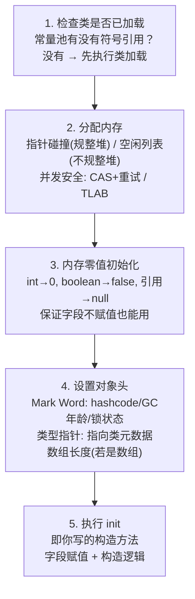

#### 内存分配的两种方式

| 方式 | 适用场景 | 原理 |
|------|----------|------|
| **指针碰撞** | 堆内存规整（如 Serial、ParNew + 压缩） | 一个指针分隔"已用 / 空闲"，分配时指针后移 |
| **空闲列表** | 堆内存不规整（如 CMS） | 维护一个列表记录空闲块，找到合适的分配 |

#### 并发分配安全

| 方式 | 说明 |
|------|------|
| **CAS + 失败重试** | 用原子操作竞争更新指针 |
| **TLAB** | 每个线程在 Eden 预分配一块小缓冲区，各线程先在自己的 TLAB 里分配，满了再 CAS |

### 4.2 对象在内存中的布局

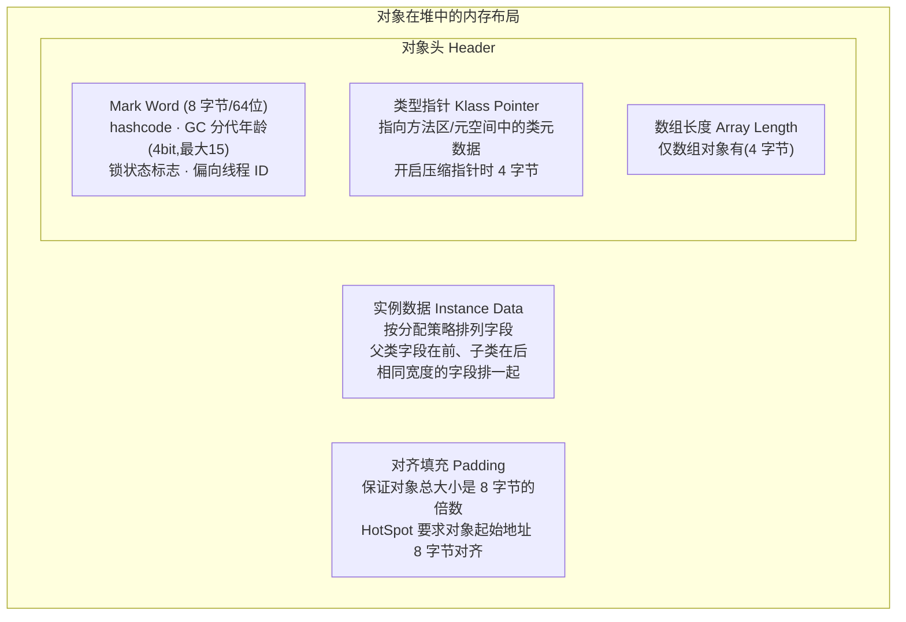

#### Mark Word 在不同锁状态下的结构（64 位）

| 锁状态 | 内容 | 锁标志位 |
|--------|------|---------|
| 无锁 | unused(25) + hashcode(31) + unused(1) + age(4) + biased(0) | 01 |
| 偏向锁 | threadID(54) + epoch(2) + unused(1) + age(4) + biased(1) | 01 |
| 轻量级锁 | 指向栈中锁记录的指针(62) | 00 |
| 重量级锁 | 指向 Monitor 的指针(62) | 10 |
| GC 标记 | 空 | 11 |

### 4.3 对象的访问定位

```mermaid
flowchart LR
  subgraph STACK["虚拟机栈"]
    REF["reference 引用变量"]
  end

  subgraph HEAP["堆"]
    OBJ_INST["对象实例数据"]
  end

  subgraph METHOD["方法区/元空间"]
    CLASS_META["类元数据"]
  end

  REF -->|直接指针(HotSpot 采用)| OBJ_INST
  OBJ_INST -->|类型指针| CLASS_META
```

两种访问方式：

| 方式 | 原理 | 优劣 |
|------|------|------|
| **句柄** | 堆中有句柄池，引用→句柄→实例+类型 | GC 移动对象时只改句柄，引用不变；多一次寻址 |
| **直接指针** | 引用直接指向对象实例（HotSpot 采用） | 访问快（少一次指针定位）；GC 移动时需要改引用 |

### 4.4 对象在堆中的流转

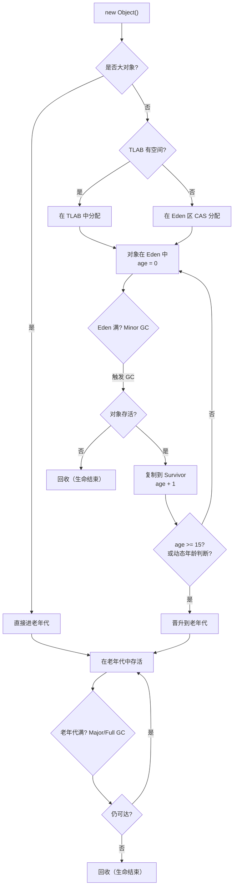

### 4.5 对象何时"死亡"：可达性分析

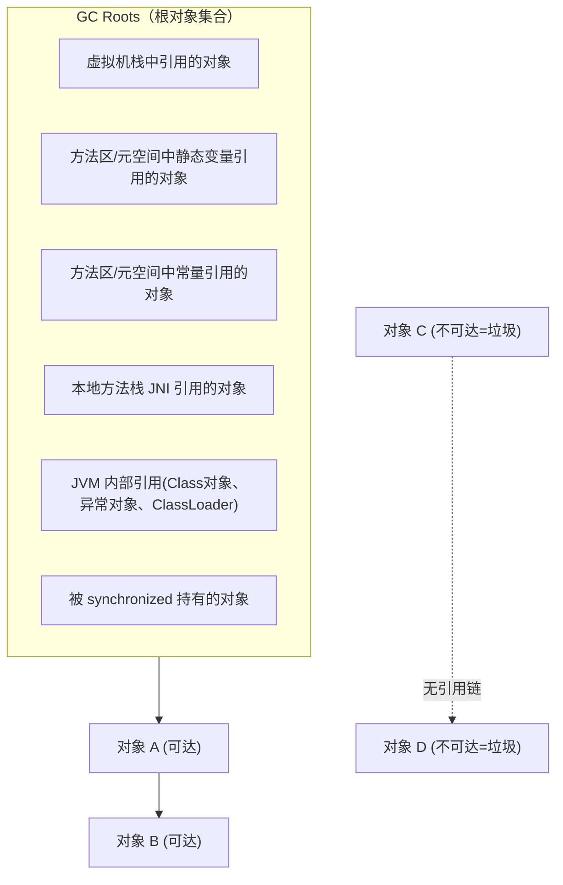

- **从 GC Roots 出发，沿引用链能到达的对象 = 存活**。
- **不可达的对象 = 垃圾，可被回收**。
- 不用引用计数法（无法解决循环引用），HotSpot 使用可达性分析。

#### 对象的"缓刑"：finalize()

不可达的对象不一定立即回收，如果重写了 `finalize()` 且从未执行过：
1. 第一次标记不可达 → 放入 **F-Queue**。
2. Finalizer 线程执行 `finalize()`（最后的自救机会，可以把 `this` 赋给某个引用重新可达）。
3. 第二次标记时如果仍不可达 → **真正回收**。

> `finalize()` 已被 JDK 9 标记为 @Deprecated，不建议使用。

### 4.6 引用类型（4 种）

| 引用类型 | 说明 | GC 行为 | 典型用途 |
|----------|------|---------|----------|
| **强引用** | `Object o = new Object()` | 有强引用就不回收，宁可 OOM | 普通代码 |
| **软引用** | `SoftReference<T>` | 内存不足时才回收 | 缓存（如图片缓存） |
| **弱引用** | `WeakReference<T>` | 下一次 GC 就回收 | `WeakHashMap`、ThreadLocal 清理 |
| **虚引用** | `PhantomReference<T>` | 无法通过虚引用获取对象 | 跟踪 GC 回收时机、管理堆外内存 |

---

## 5. 垃圾回收（GC）

### 5.1 判断对象是否存活

| 方法 | 原理 | HotSpot 是否使用 |
|------|------|-----------------|
| **引用计数法** | 每个对象维护引用计数，为 0 则可回收 | 不使用（无法解决循环引用） |
| **可达性分析** | 从 GC Roots 出发，不可达的对象为垃圾 | **使用** |

### 5.2 垃圾回收算法

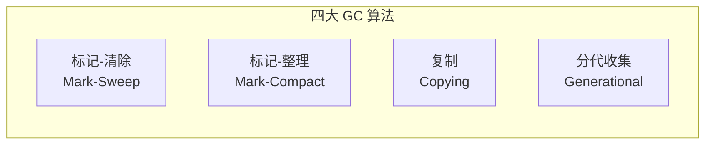

#### 5.2.1 标记-清除（Mark-Sweep）

| 步骤 | 说明 |
|------|------|
| 标记 | 从 GC Roots 遍历，标记所有存活对象 |
| 清除 | 遍历堆，回收未标记的对象 |

- **优点**：简单。
- **缺点**：产生大量**内存碎片**，分配大对象时可能找不到连续空间而提前触发 GC。

#### 5.2.2 复制算法（Copying）

| 步骤 | 说明 |
|------|------|
| 将内存分为两块 | 每次只用一块 |
| GC 时 | 把存活对象复制到另一块，原来那块整体清空 |

- **优点**：没有碎片、分配快（指针碰撞）。
- **缺点**：可用内存缩小一半（所以只用于新生代，Survivor 只占 10%+10%）。
- **新生代使用**：Eden + From/To Survivor 就是复制算法的优化版（IBM 研究: 98% 对象"朝生夕死"）。

#### 5.2.3 标记-整理（Mark-Compact）

| 步骤 | 说明 |
|------|------|
| 标记 | 同标记-清除 |
| 整理 | 将存活对象向内存一端移动，然后清理边界外的内存 |

- **优点**：没有碎片。
- **缺点**：移动对象需要更新引用，STW 时间较长。
- **老年代使用**：对象存活率高，复制算法不合适（要复制大量对象），标记-整理更适合。

#### 5.2.4 分代收集（Generational）

- 不是一种新算法，而是**策略**：不同代用不同算法。
- **新生代**：对象存活率低 → 复制算法。
- **老年代**：对象存活率高 → 标记-清除 或 标记-整理。

### 5.3 GC 类型

| 类型 | 范围 | 触发条件 |
|------|------|----------|
| **Minor GC** | 仅新生代 | Eden 区满 |
| **Major GC** | 仅老年代 | 老年代满（有些收集器会先尝试 Minor GC） |
| **Full GC** | 整个堆 + 方法区 | 老年代满 / 方法区满 / `System.gc()` / 担保失败 |

**Full GC 触发条件汇总**：
1. 老年代空间不足
2. 方法区/元空间不足
3. 调用 `System.gc()`（建议，不保证执行）
4. 老年代担保失败：Minor GC 前检查老年代连续空间是否够容纳新生代所有对象
5. CMS 并发失败（Concurrent Mode Failure）

### 5.4 垃圾收集器大全

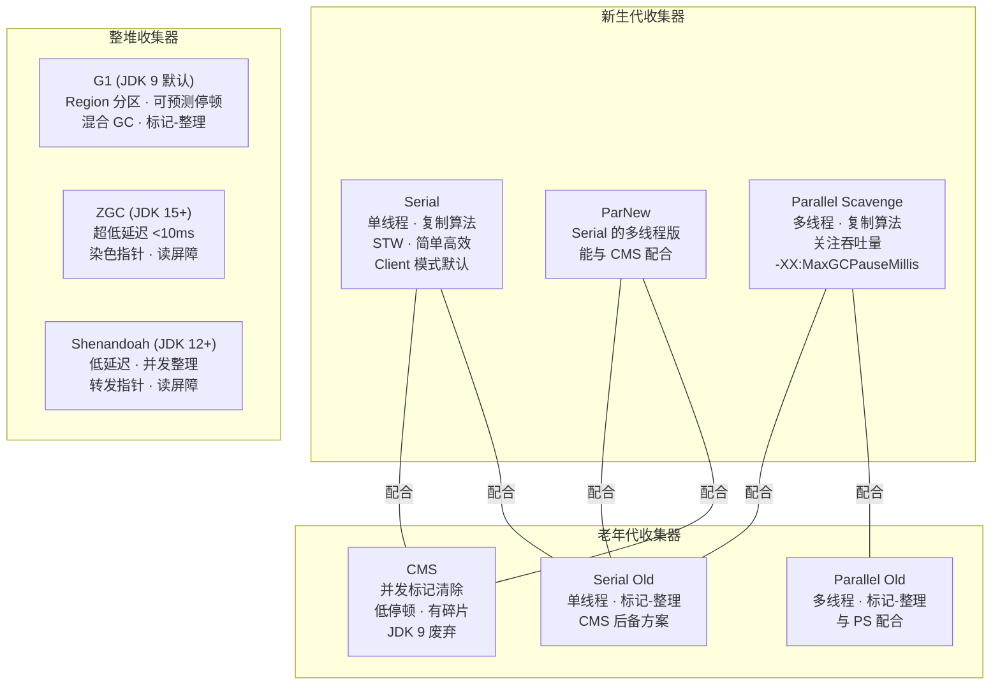

#### 各收集器详解

##### Serial / Serial Old

| 特性 | 说明 |
|------|------|
| 线程 | 单线程收集 |
| 算法 | 新生代: 复制 / 老年代: 标记-整理 |
| STW | 全程 Stop The World |
| 适用 | 客户端模式、小堆（几十到几百 MB） |
| 优点 | 简单高效，没有线程交互开销 |

##### ParNew

- Serial 的**多线程版本**，除了多线程外和 Serial 完全一样。
- 唯一能与 CMS 配合的新生代收集器。
- `-XX:ParallelGCThreads` 设置线程数。

##### Parallel Scavenge / Parallel Old

| 特性 | 说明 |
|------|------|
| 目标 | **吞吐量优先**（CPU 时间中运行用户代码的比例） |
| 参数 | `-XX:MaxGCPauseMillis`（最大停顿时间）、`-XX:GCTimeRatio`（吞吐量） |
| 自适应 | `-XX:+UseAdaptiveSizePolicy`：自动调节新生代大小、Eden/Survivor 比例、晋升阈值 |
| JDK 8 默认 | Parallel Scavenge + Parallel Old |

##### CMS（Concurrent Mark Sweep）

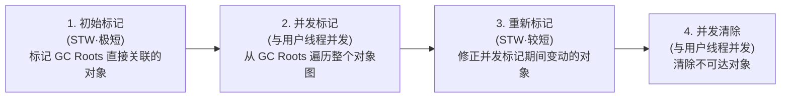

| 优点 | 缺点 |
|------|------|
| 低停顿（并发标记和清除） | 占用 CPU 资源（并发线程） |
| | 无法处理"浮动垃圾"（并发清除时新产生的垃圾） |
| | **内存碎片**（标记-清除算法） |
| | Concurrent Mode Failure → 退化为 Serial Old |

##### G1（Garbage First）

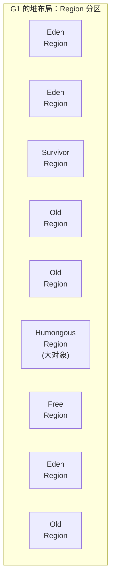

| 特性 | 说明 |
|------|------|
| Region | 把堆分成大小相等的 Region（1~32MB），每个 Region 可以是 Eden/Survivor/Old/Humongous |
| 可预测停顿 | `-XX:MaxGCPauseMillis`（默认 200ms），优先回收"垃圾最多"的 Region |
| Mixed GC | 新生代 + 部分老年代一起回收 |
| 算法 | 整体: 标记-整理, Region 间: 复制（无碎片） |
| JDK 9+ 默认 | 替代 Parallel Scavenge + Parallel Old |

**G1 回收过程**：
1. **初始标记**（STW）：标记 GC Roots 直接关联对象，修改 TAMS 指针。
2. **并发标记**（并发）：从 GC Roots 递归遍历对象图。
3. **最终标记**（STW）：处理并发标记遗留的 SATB 记录。
4. **筛选回收**（STW）：按回收价值排序 Region，复制存活对象到空 Region。

##### ZGC（Z Garbage Collector）

| 特性 | 说明 |
|------|------|
| 目标 | **超低延迟**：停顿 < 10ms，不随堆大小增长 |
| 技术 | 染色指针（Colored Pointers）+ 读屏障（Load Barrier） |
| 堆大小 | 支持 8MB ~ 16TB |
| 并发 | 几乎所有阶段都并发执行 |
| JDK 版本 | JDK 11 实验性, JDK 15 正式 |

##### Shenandoah

| 特性 | 说明 |
|------|------|
| 目标 | 低延迟，与 ZGC 类似 |
| 技术 | 转发指针（Brooks Pointer）+ 读屏障 |
| 特点 | 并发整理（并发阶段移动对象） |
| JDK 版本 | JDK 12+ (非 Oracle JDK 发行版) |

### 5.5 如何选择垃圾收集器

| 场景 | 推荐收集器 | 理由 |
|------|-----------|------|
| 客户端小应用 | Serial + Serial Old | 简单、开销小 |
| 吞吐量优先（批处理、后台计算） | Parallel Scavenge + Parallel Old | 最大化 CPU 利用率 |
| 低延迟 Web 应用（JDK 8） | ParNew + CMS | 停顿短 |
| 通用场景（JDK 9+） | **G1**（默认） | 平衡吞吐与延迟 |
| 超低延迟（JDK 15+） | **ZGC** | 停顿 < 10ms |
| 超大堆 | G1 / ZGC | Region 分区适合大堆 |

---

## 6. 执行引擎

### 6.1 执行引擎架构

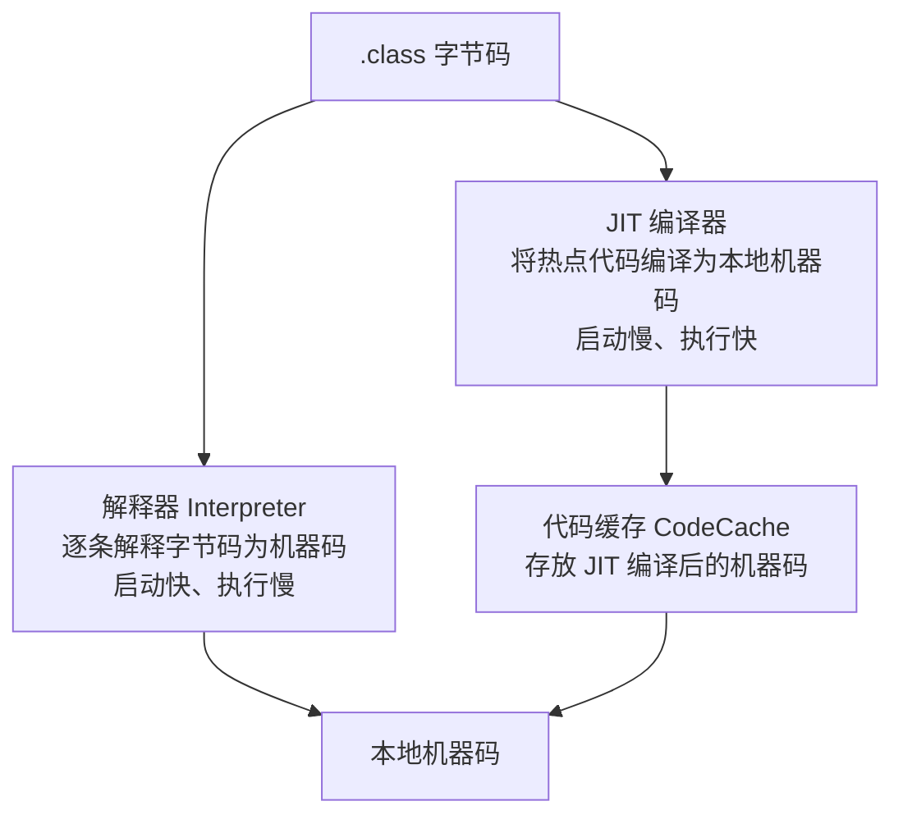

### 6.2 解释器 vs JIT 编译器

| 特性 | 解释器 | JIT 编译器 |
|------|--------|-----------|
| 执行方式 | 逐条翻译字节码 | 将整个方法编译为机器码 |
| 启动速度 | **快**（直接执行） | 慢（需要先编译） |
| 运行速度 | 慢 | **快**（运行本地机器码） |
| 内存 | 少 | 需要 CodeCache 存储编译结果 |

**HotSpot 策略**：混合使用。先用解释器快速启动，发现"热点代码"后用 JIT 编译提速。

### 6.3 热点代码检测

**什么是热点代码？**
- 被多次调用的方法
- 被多次执行的循环体

**检测方式：基于计数器**

| 计数器 | 作用 | 阈值 |
|--------|------|------|
| **方法调用计数器** | 统计方法被调用次数 | Client: 1500 / Server: 10000 |
| **回边计数器** | 统计循环体执行次数（"回边"= 循环跳转） | 与方法调用计数器配合 |

达到阈值 → 触发 JIT 编译 → 下次调用直接执行编译后的机器码。

### 6.4 C1 / C2 编译器与分层编译

```mermaid
flowchart TB
  subgraph TIERED["分层编译 Tiered Compilation (JDK 8+ 默认开启)"]
    L0["Level 0<br/>解释执行"]
    L1["Level 1<br/>C1 编译 · 无 Profiling"]
    L2["Level 2<br/>C1 编译 · 有限 Profiling"]
    L3["Level 3<br/>C1 编译 · 完整 Profiling"]
    L4["Level 4<br/>C2 编译 · 深度优化"]
  end

  L0 --> L3
  L3 --> L4
  L0 --> L1
```

| 编译器 | 别名 | 优化程度 | 编译速度 | 适用 |
|--------|------|---------|---------|------|
| **C1** | Client Compiler | 简单优化（方法内联、去虚拟化、冗余消除） | **快** | 启动阶段、GUI 应用 |
| **C2** | Server Compiler | 深度优化（逃逸分析、标量替换、循环展开） | 慢 | 长期运行的服务端应用 |

### 6.5 逃逸分析与优化

**逃逸分析**：分析对象的作用域，判断对象是否"逃出"方法或线程。

| 逃逸类型 | 含义 | 示例 |
|----------|------|------|
| 不逃逸 | 对象只在方法内使用 | 方法里 new 了一个对象，方法结束就没人用了 |
| 方法逃逸 | 对象被返回或传给其他方法 | `return new Object()` |
| 线程逃逸 | 对象被其他线程访问 | 赋值给共享变量 |

**基于逃逸分析的优化**（仅对"不逃逸"的对象）：

| 优化 | 说明 |
|------|------|
| **栈上分配** | 对象不在堆分配，在栈帧里分配，方法结束自动释放，不需要 GC |
| **标量替换** | 对象拆散为基本类型变量，直接存在局部变量表 |
| **锁消除** | 对象不会逃逸到其他线程，移除不必要的 `synchronized` |

> 注意：HotSpot 目前实际做的是**标量替换**（效果类似栈上分配），而非真正的栈上分配。

---

## 7. Java 内存模型（JMM）

> **注意**：JMM（Java Memory Model）和 JVM 内存结构（堆/栈/方法区）是**两个不同的概念**。  
> JMM 定义的是**多线程读写共享变量的规则**，属于并发编程范畴。

### 7.1 JMM 架构

```mermaid
flowchart TB
  subgraph THREADS["线程"]
    T1["线程 1"]
    T2["线程 2"]
    T3["线程 3"]
  end

  subgraph LOCAL["本地内存（工作内存）"]
    WM1["线程 1 的工作内存<br/>共享变量的副本"]
    WM2["线程 2 的工作内存<br/>共享变量的副本"]
    WM3["线程 3 的工作内存<br/>共享变量的副本"]
  end

  MAIN["主内存 Main Memory<br/>所有共享变量存储在此"]

  T1 --> WM1
  T2 --> WM2
  T3 --> WM3
  WM1 <--> MAIN
  WM2 <--> MAIN
  WM3 <--> MAIN
```

- **主内存**：所有线程共享的内存（概念上对应堆中的对象实例数据）。
- **工作内存**：每个线程私有的内存（概念上对应虚拟机栈中的部分区域）。
- 线程不能直接操作主内存，必须先拷贝到工作内存，操作后再写回。

### 7.2 JMM 的 8 种内存交互操作

```mermaid
flowchart LR
  subgraph MAIN_MEM["主内存"]
    VAR["变量 x"]
  end
  subgraph WORK_MEM["工作内存"]
    COPY["变量 x 的副本"]
  end

  VAR -->|"① lock 加锁"| VAR
  VAR -->|"② read 读取"| BETWEEN["传输"]
  BETWEEN -->|"③ load 载入"| COPY
  COPY -->|"④ use 使用"| EXEC["执行引擎"]
  EXEC -->|"⑤ assign 赋值"| COPY
  COPY -->|"⑥ store 存储"| BETWEEN2["传输"]
  BETWEEN2 -->|"⑦ write 写入"| VAR
  VAR -->|"⑧ unlock 解锁"| VAR
```

### 7.3 三大特性

| 特性 | 含义 | 如何保证 |
|------|------|----------|
| **原子性** | 操作不可分割 | `synchronized`、`Lock`、`AtomicXxx` |
| **可见性** | 一个线程修改后其他线程能立即看到 | `volatile`、`synchronized`、`Lock`、`final` |
| **有序性** | 程序执行顺序与代码顺序一致 | `volatile`(禁止重排序)、`synchronized`、`happens-before` |

### 7.4 volatile 关键字

| 特性 | 说明 |
|------|------|
| 可见性 | 写入 volatile 变量时，立即刷新到主内存；读取时，从主内存重新读取 |
| 有序性 | 禁止指令重排序（通过内存屏障 Memory Barrier 实现） |
| 原子性 | **不保证**（如 `i++` 不是原子的） |

**典型用途**：
- 状态标志位（`volatile boolean running = true`）
- DCL 单例模式中的 `instance` 变量

### 7.5 happens-before 原则

JMM 定义了以下天然的 happens-before 关系（无需额外同步就能保证有序性和可见性）：

| 规则 | 说明 |
|------|------|
| **程序次序** | 一个线程内，按代码顺序，前面的操作 happens-before 后面的 |
| **监视器锁** | `unlock` happens-before 后续对同一个锁的 `lock` |
| **volatile** | 对 volatile 变量的写 happens-before 后续对它的读 |
| **线程启动** | `Thread.start()` happens-before 该线程的所有操作 |
| **线程终止** | 线程的所有操作 happens-before 其他线程检测到它终止（`join()`/`isAlive()`） |
| **线程中断** | `interrupt()` happens-before 被中断线程检测到中断 |
| **对象终结** | 构造函数结束 happens-before `finalize()` 开始 |
| **传递性** | A happens-before B，B happens-before C → A happens-before C |

---

## 8. 常用 JVM 调优工具

### 8.1 命令行工具

| 工具 | 命令示例 | 功能 |
|------|----------|------|
| **jps** | `jps -lv` | 列出所有 Java 进程及主类/JVM 参数 |
| **jstat** | `jstat -gc <pid> 1000` | 每秒输出 GC 统计（Eden/S0/S1/Old 使用量、GC 次数和时间） |
| **jinfo** | `jinfo -flags <pid>` | 查看/动态修改 JVM 参数 |
| **jmap** | `jmap -heap <pid>` | 查看堆内存使用情况 |
| | `jmap -dump:format=b,file=heap.hprof <pid>` | 导出堆转储文件 |
| | `jmap -histo <pid>` | 查看堆中对象统计（类名、实例数、占用字节） |
| **jstack** | `jstack <pid>` | 导出线程栈快照（排查死锁、线程阻塞） |
| **jhat** | `jhat heap.hprof` | 分析堆转储（已被 jvisualvm 替代） |
| **jcmd** | `jcmd <pid> GC.heap_info` | 多合一诊断工具（JDK 7+） |

### 8.2 图形化工具

| 工具 | 说明 |
|------|------|
| **jconsole** | JDK 自带，监控内存/线程/类加载/MBean |
| **jvisualvm** | JDK 自带（JDK 9 后需单独下载），功能更强，支持 Profiling、堆分析 |
| **JMC (Java Mission Control)** | 低开销生产环境监控，配合 JFR (Java Flight Recorder) |
| **MAT (Memory Analyzer Tool)** | Eclipse 出品，分析 `.hprof` 堆转储，查找内存泄漏 |
| **Arthas** | 阿里开源，在线诊断工具，支持热替换、方法追踪、线程分析 |
| **GCeasy** | 在线 GC 日志分析工具，可视化 GC 行为 |

### 8.3 GC 日志分析

开启 GC 日志：

```bash
# JDK 8
-XX:+PrintGCDetails -XX:+PrintGCDateStamps -Xloggc:gc.log

# JDK 9+
-Xlog:gc*:file=gc.log:time,uptime,level,tags
```

---

## 9. JVM 参数速查大全

### 9.1 堆内存

| 参数 | 说明 | 示例 |
|------|------|------|
| `-Xms` | 初始堆大小 | `-Xms512m` |
| `-Xmx` | 最大堆大小 | `-Xmx2g` |
| `-Xmn` | 新生代大小 | `-Xmn256m` |
| `-XX:NewRatio` | 老年代:新生代 比值 | `-XX:NewRatio=2`（2:1） |
| `-XX:SurvivorRatio` | Eden:Survivor 比值 | `-XX:SurvivorRatio=8`（8:1:1） |
| `-XX:MaxTenuringThreshold` | 晋升老年代的年龄阈值 | `-XX:MaxTenuringThreshold=15` |
| `-XX:PretenureSizeThreshold` | 大对象直接进老年代的阈值 | `-XX:PretenureSizeThreshold=4m` |

### 9.2 方法区 / 元空间

| 参数 | 说明 | 版本 |
|------|------|------|
| `-XX:PermSize` | 永久代初始大小 | JDK 7 |
| `-XX:MaxPermSize` | 永久代最大大小 | JDK 7 |
| `-XX:MetaspaceSize` | 元空间初始大小（触发 Full GC 的阈值） | JDK 8+ |
| `-XX:MaxMetaspaceSize` | 元空间最大大小 | JDK 8+ |

### 9.3 栈

| 参数 | 说明 | 示例 |
|------|------|------|
| `-Xss` | 每个线程的栈大小 | `-Xss512k` |

### 9.4 直接内存

| 参数 | 说明 | 示例 |
|------|------|------|
| `-XX:MaxDirectMemorySize` | 直接内存最大值 | `-XX:MaxDirectMemorySize=256m` |

### 9.5 GC 收集器选择

| 参数 | 收集器 |
|------|--------|
| `-XX:+UseSerialGC` | Serial + Serial Old |
| `-XX:+UseParNewGC` | ParNew + Serial Old |
| `-XX:+UseParallelGC` | Parallel Scavenge + Parallel Old（JDK 8 默认） |
| `-XX:+UseConcMarkSweepGC` | ParNew + CMS + Serial Old(后备) |
| `-XX:+UseG1GC` | G1（JDK 9 默认） |
| `-XX:+UseZGC` | ZGC（JDK 15+） |
| `-XX:+UseShenandoahGC` | Shenandoah |

### 9.6 GC 调优

| 参数 | 说明 |
|------|------|
| `-XX:MaxGCPauseMillis` | 期望最大 GC 停顿时间（G1/PS） |
| `-XX:GCTimeRatio` | 吞吐量目标（PS） |
| `-XX:+UseAdaptiveSizePolicy` | 自适应策略（PS 自动调节 Eden/Survivor） |
| `-XX:ParallelGCThreads` | 并行 GC 线程数 |
| `-XX:ConcGCThreads` | 并发 GC 线程数 |
| `-XX:InitiatingHeapOccupancyPercent` | G1 触发并发标记的堆占用率（默认 45%） |
| `-XX:G1HeapRegionSize` | G1 Region 大小（1~32MB，2 的幂） |

### 9.7 OOM 诊断

| 参数 | 说明 |
|------|------|
| `-XX:+HeapDumpOnOutOfMemoryError` | OOM 时自动导出堆转储 |
| `-XX:HeapDumpPath=./dump.hprof` | 堆转储文件路径 |
| `-XX:OnOutOfMemoryError="kill -9 %p"` | OOM 时执行指定命令 |

### 9.8 推荐的生产环境参数模板

```bash
java \
  -Xms4g -Xmx4g \
  -Xmn1536m \
  -XX:MetaspaceSize=256m -XX:MaxMetaspaceSize=256m \
  -XX:+UseG1GC \
  -XX:MaxGCPauseMillis=200 \
  -XX:+HeapDumpOnOutOfMemoryError \
  -XX:HeapDumpPath=/tmp/heap_dump.hprof \
  -Xlog:gc*:file=/var/log/app/gc.log:time,uptime,level,tags \
  -jar app.jar
```

---

## 10. 面试高频问题汇总

### Q1: JVM 的运行时数据区有哪些？哪些线程私有？

- 线程私有：程序计数器、Java 虚拟机栈、本地方法栈
- 线程共享：Java 堆、方法区（永久代/元空间）
- 堆外：直接内存
- 唯一不会 OOM 的是程序计数器

### Q2: 永久代和元空间的区别？

- 方法区是规范，永久代（JDK 7 在堆内）和元空间（JDK 8 在本地内存）是两种实现
- 元空间默认受系统内存限制，不容易 PermGen 溢出

### Q3: 对象创建的过程？

检查类加载 → 分配内存（指针碰撞/空闲列表 + CAS/TLAB） → 零值初始化 → 设置对象头 → 执行构造方法

### Q4: 对象在堆中怎么流转？

Eden → (Minor GC) → Survivor(年龄+1) → (多次GC) → 老年代。大对象直接进老年代。全程在堆里，不会进方法区/元空间。

### Q5: 如何判断对象是否可以被回收？

可达性分析：从 GC Roots 出发，不可达的对象为垃圾。GC Roots 包括：栈中引用、静态变量、常量、JNI 引用等。

### Q6: 垃圾回收算法有哪些？

标记-清除（有碎片）、复制（新生代用）、标记-整理（老年代用）、分代收集（策略）。

### Q7: CMS 和 G1 的区别？

- CMS：老年代收集器，标记-清除，低停顿但有碎片，JDK 9 废弃。
- G1：整堆收集器，Region 分区，标记-整理+复制，可预测停顿，JDK 9 默认。

### Q8: 什么时候触发 Full GC？

老年代满、元空间满、System.gc()、担保失败、CMS Concurrent Mode Failure。

### Q9: JMM 是什么？volatile 的作用？

- JMM 定义多线程读写共享变量的规则（主内存 + 工作内存）。
- volatile 保证可见性（写立即刷回主内存）和有序性（禁止重排序），不保证原子性。

### Q10: 什么是双亲委派？为什么要打破？

- 类加载请求先委托父加载器，父搞不定才自己来。保证安全、避免重复加载。
- 打破场景：SPI（JDBC）、OSGi、Tomcat 应用隔离。

### Q11: 什么是逃逸分析？

分析对象是否逃出方法/线程。不逃逸的对象可以做栈上分配（标量替换）、锁消除等优化。

### Q12: 如何排查 OOM？

1. 加 `-XX:+HeapDumpOnOutOfMemoryError` 自动导出堆转储。
2. 用 MAT / jvisualvm 分析 `.hprof` 文件，找到占内存最多的对象。
3. 结合代码分析是内存泄漏（不该存活的对象有引用链）还是内存溢出（确实需要那么多内存）。

---

> 本文档涵盖了 JVM 从架构到调优的完整知识体系，适合系统学习和面试复习。
