# 📚 Day02 教学课件：GC 算法与垃圾收集器详解

> **导师定制课件** | 原创内容，图文并茂，深入浅出  
> 本课件承接 Day01 JVM 内存模型，深入讲解垃圾回收的核心机制与实战调优

---

## 📋 目录

1. [如何判断对象是否存活](#1-如何判断对象是否存活)
2. [四种引用类型](#2-四种引用类型)
3. [垃圾回收算法详解](#3-垃圾回收算法详解)
4. [GC 类型（Minor GC / Major GC / Full GC）](#4-gc-类型)
5. [七种经典垃圾收集器](#5-七种经典垃圾收集器)
6. [新一代收集器简介（ZGC、Shenandoah）](#6-新一代收集器简介)
7. [收集器选型指南](#7-收集器选型指南)
8. [GC 日志格式解析与实战](#8-gc-日志格式解析与实战)
9. [安全点与安全区域](#9-安全点与安全区域)
10. [面试高频问题汇总](#10-面试高频问题汇总)

---

## 1. 如何判断对象是否存活

> 垃圾回收的第一步：**找出哪些对象已经"死了"**。

### 1.1 引用计数法（Reference Counting）

**原理**：给每个对象添加一个引用计数器，每当有一个地方引用它时，计数器 +1；引用失效时，计数器 -1。计数器为 0 的对象即可回收。

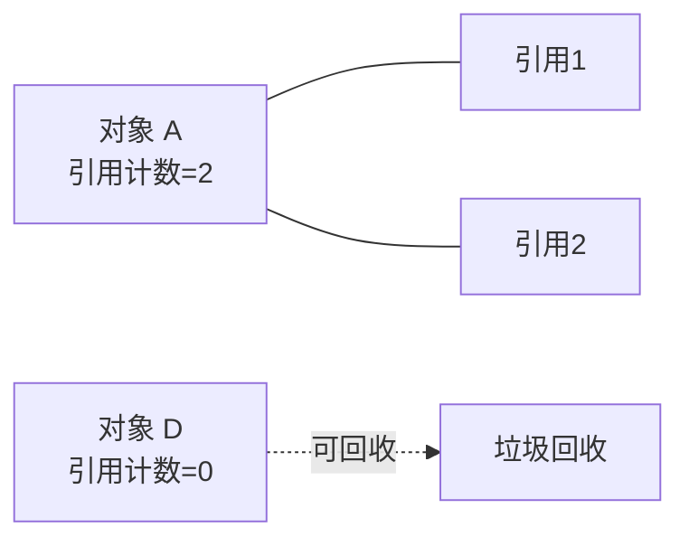

**优点**：
- 实现简单，判断效率高
- 回收及时，计数为 0 立即回收

**缺点（致命问题）—— 循环引用**：

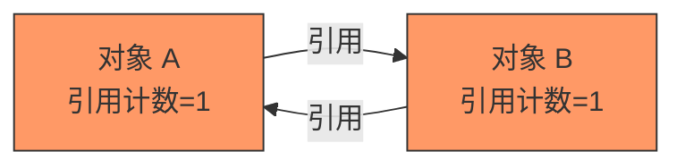

```java
// 循环引用示例
public class CircularReference {
    public Object partner;

    public static void main(String[] args) {
        CircularReference a = new CircularReference();
        CircularReference b = new CircularReference();
        a.partner = b;  // a 引用 b
        b.partner = a;  // b 引用 a

        a = null;  // 断开 a 的强引用
        b = null;  // 断开 b 的强引用

        // 此时 a 和 b 互相引用，引用计数都是 1
        // 引用计数法无法回收它们！
        System.gc();
    }
}
```

> **结论**：Java 没有采用引用计数法，而是采用可达性分析。Python 使用引用计数 + 循环检测来解决此问题。

---

### 1.2 可达性分析（Reachability Analysis）

**原理**：从一组称为 **GC Roots** 的根对象出发，沿着引用链向下搜索。如果某个对象到 GC Roots 没有任何引用链相连（不可达），则该对象可以被回收。

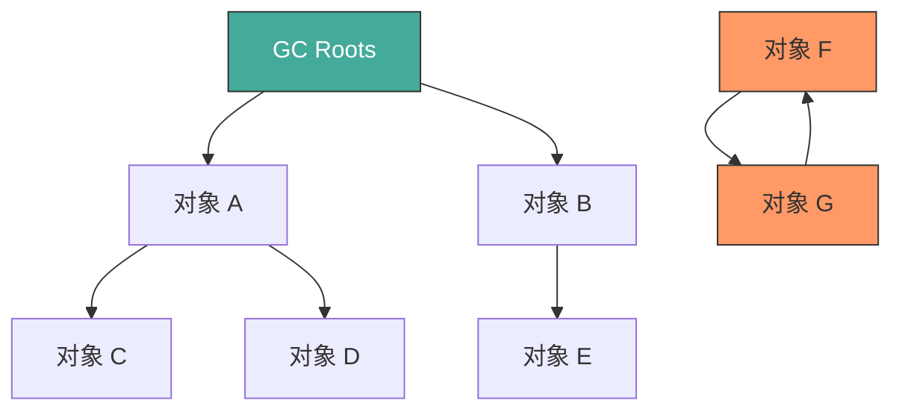

上图中，对象 F 和 G 虽然互相引用，但它们从 GC Roots 不可达，因此会被回收。

---

### 1.3 GC Roots 详解

**哪些对象可以作为 GC Roots？**

| GC Root 类型 | 说明 | 示例 |
|-------------|------|------|
| **虚拟机栈中的引用** | 栈帧中局部变量表引用的对象 | 方法中的局部变量 |
| **方法区中的静态属性** | 类的 `static` 引用的对象 | `static Object obj` |
| **方法区中的常量** | `static final` 引用的对象 | 字符串常量池中的引用 |
| **本地方法栈中的 JNI 引用** | Native 方法引用的对象 | JNI 全局引用 |
| **同步锁持有的对象** | 被 `synchronized` 锁定的对象 | `synchronized(obj)` |
| **JVM 内部引用** | 基本类型对应的 Class 对象、常驻异常对象等 | `NullPointerException` |

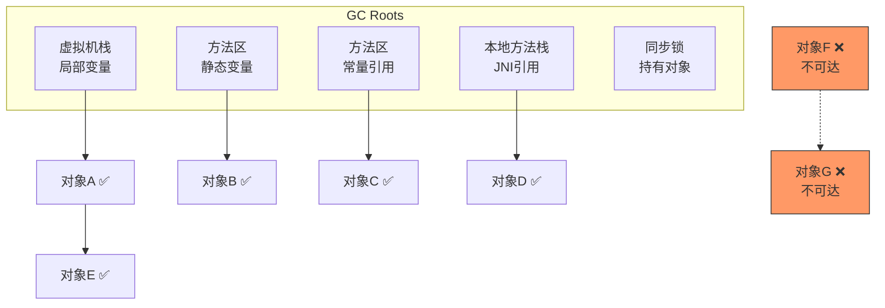

---

### 1.4 对象的"两次标记"与 finalize()

对象被判定为不可达后，并不是立即被回收，而是经历"两次标记"过程：

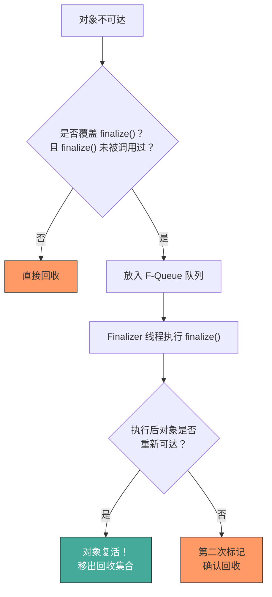

> **重要提示**：`finalize()` 方法已被标记为 `@Deprecated`（JDK 9+），不建议使用。推荐使用 `try-with-resources` 或 `Cleaner` 替代。

---

## 2. 四种引用类型

> Java 从 JDK 1.2 开始引入四种引用类型，用于更精细地控制对象的生命周期。

### 2.1 引用类型总览

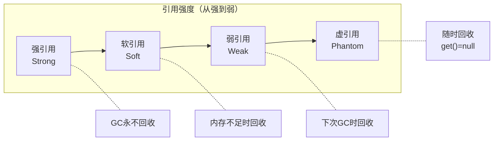

### 2.2 强引用（Strong Reference）

最常见的引用类型，只要强引用存在，GC 永远不会回收该对象。

```java
// 这就是强引用
Object obj = new Object();

// 只有当 obj = null 后，对象才可能被回收
obj = null;
```

**特点**：
- 默认引用类型，`new` 出来的对象都是强引用
- 即使 OOM，也不会回收强引用对象
- 需要手动置为 `null` 或超出作用域才能被回收

---

### 2.3 软引用（Soft Reference）

内存充足时不回收，**内存不足时回收**。非常适合做缓存。

```java
import java.lang.ref.SoftReference;

// 创建软引用
SoftReference<byte[]> softRef = new SoftReference<>(new byte[1024 * 1024]);

// 获取对象（内存充足时返回对象，内存不足已回收则返回 null）
byte[] data = softRef.get();
if (data != null) {
    // 缓存命中，使用数据
} else {
    // 缓存失效，重新加载
    data = loadFromDisk();
    softRef = new SoftReference<>(data);
}
```

**典型应用场景**：
- 图片缓存
- 网页缓存
- 数据库查询结果缓存

---

### 2.4 弱引用（Weak Reference）

无论内存是否充足，**下次 GC 时一定被回收**。

```java
import java.lang.ref.WeakReference;

WeakReference<Object> weakRef = new WeakReference<>(new Object());
System.out.println(weakRef.get()); // 对象存在

System.gc();
System.out.println(weakRef.get()); // null（已被回收）
```

**典型应用场景**：
- `WeakHashMap`：Key 是弱引用，GC 后自动清理
- `ThreadLocal` 的内部实现

```java
// WeakHashMap 示例
WeakHashMap<Object, String> map = new WeakHashMap<>();
Object key = new Object();
map.put(key, "value");

key = null; // 断开强引用
System.gc();
// GC 后，map 中的 entry 会自动被清理
```

---

### 2.5 虚引用（Phantom Reference）

最弱的引用，`get()` 方法永远返回 `null`。**必须搭配引用队列（ReferenceQueue）使用**。

```java
import java.lang.ref.PhantomReference;
import java.lang.ref.ReferenceQueue;

ReferenceQueue<Object> queue = new ReferenceQueue<>();
Object obj = new Object();
PhantomReference<Object> phantomRef = new PhantomReference<>(obj, queue);

System.out.println(phantomRef.get()); // 永远返回 null

obj = null;
System.gc();

// 对象被回收后，虚引用被放入引用队列
Reference<?> ref = queue.poll();
if (ref != null) {
    System.out.println("对象已被回收，可以执行清理操作");
}
```

**典型应用场景**：
- 跟踪对象被回收的时机
- 管理堆外内存（如 DirectByteBuffer）
- `Cleaner`（JDK 9+ 推荐的资源清理方式）

---

### 2.6 四种引用对比表

| 引用类型 | 对应类 | 回收时机 | get() 返回 | 典型用途 |
|---------|-------|---------|-----------|---------|
| **强引用** | 直接赋值 | 永不回收（只要可达） | 对象本身 | 普通对象引用 |
| **软引用** | `SoftReference` | 内存不足时回收 | 对象或 null | 内存敏感缓存 |
| **弱引用** | `WeakReference` | 下次 GC 时回收 | 对象或 null | WeakHashMap、ThreadLocal |
| **虚引用** | `PhantomReference` | 随时回收 | 永远 null | 跟踪回收时机、堆外内存 |

---

## 3. 垃圾回收算法详解

### 3.1 标记-清除算法（Mark-Sweep）

**最基础**的垃圾回收算法，分为"标记"和"清除"两个阶段。

#### 过程

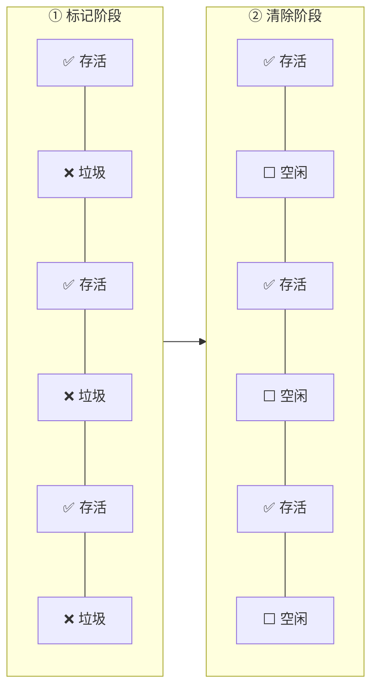

**详细过程**：
1. **标记**：从 GC Roots 出发，标记所有可达对象
2. **清除**：遍历堆内存，回收未被标记的对象

#### 内存状态变化

```
标记前：
┌──────┬──────┬──────┬──────┬──────┬──────┬──────┬──────┐
│  A   │  B   │  C   │  D   │  E   │  F   │  G   │  H   │
│ 存活 │ 垃圾 │ 存活 │ 垃圾 │ 垃圾 │ 存活 │ 垃圾 │ 存活 │
└──────┴──────┴──────┴──────┴──────┴──────┴──────┴──────┘

标记后清除：
┌──────┬──────┬──────┬──────┬──────┬──────┬──────┬──────┐
│  A   │ 空闲 │  C   │ 空闲 │ 空闲 │  F   │ 空闲 │  H   │
│ 存活 │      │ 存活 │      │      │ 存活 │      │ 存活 │
└──────┴──────┴──────┴──────┴──────┴──────┴──────┴──────┘
                ↑ 产生内存碎片！
```

#### 优缺点

| 优点 | 缺点 |
|------|------|
| 实现简单 | **产生内存碎片**：碎片化导致大对象无法分配 |
| 不需要移动对象 | **效率不稳定**：大量对象时标记和清除效率低 |
| | 需要 STW（Stop The World） |

---

### 3.2 复制算法（Copying）

将内存分为两块相等区域，每次只使用其中一块，GC 时将存活对象复制到另一块，然后清空当前块。

#### 过程

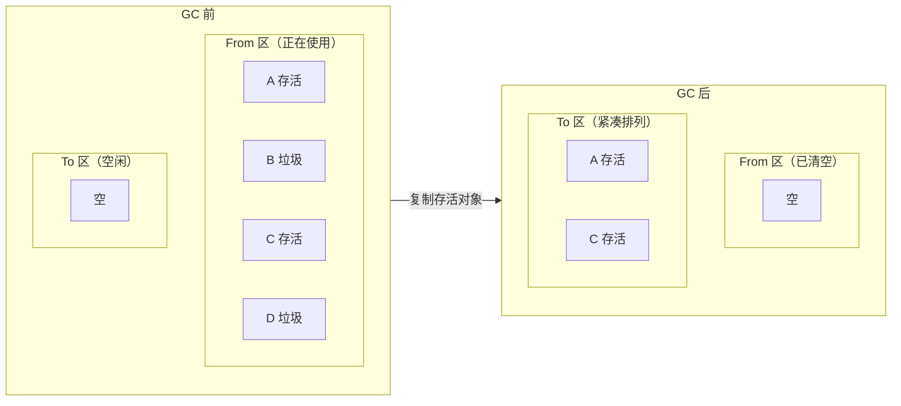

#### 内存状态变化

```
GC 前：
From 区：┌──────┬──────┬──────┬──────┬──────┐
         │  A   │  B   │  C   │  D   │  E   │
         │ 存活 │ 垃圾 │ 存活 │ 垃圾 │ 存活 │
         └──────┴──────┴──────┴──────┴──────┘
To   区：┌──────┬──────┬──────┬──────┬──────┐
         │      │      │      │      │      │  （空闲）
         └──────┴──────┴──────┴──────┴──────┘

GC 后（From 和 To 互换角色）：
From 区：┌──────┬──────┬──────┬──────┬──────┐
         │      │      │      │      │      │  （已清空）
         └──────┴──────┴──────┴──────┴──────┘
To   区：┌──────┬──────┬──────┬──────┬──────┐
         │  A   │  C   │  E   │      │      │  （紧凑排列）
         │ 存活 │ 存活 │ 存活 │      │      │
         └──────┴──────┴──────┴──────┴──────┘
```

#### 在新生代的应用（Eden + 2 Survivor）

HotSpot 不是简单地将内存一分为二（那样太浪费），而是将新生代分为 **Eden + From Survivor + To Survivor**（默认 8:1:1）：

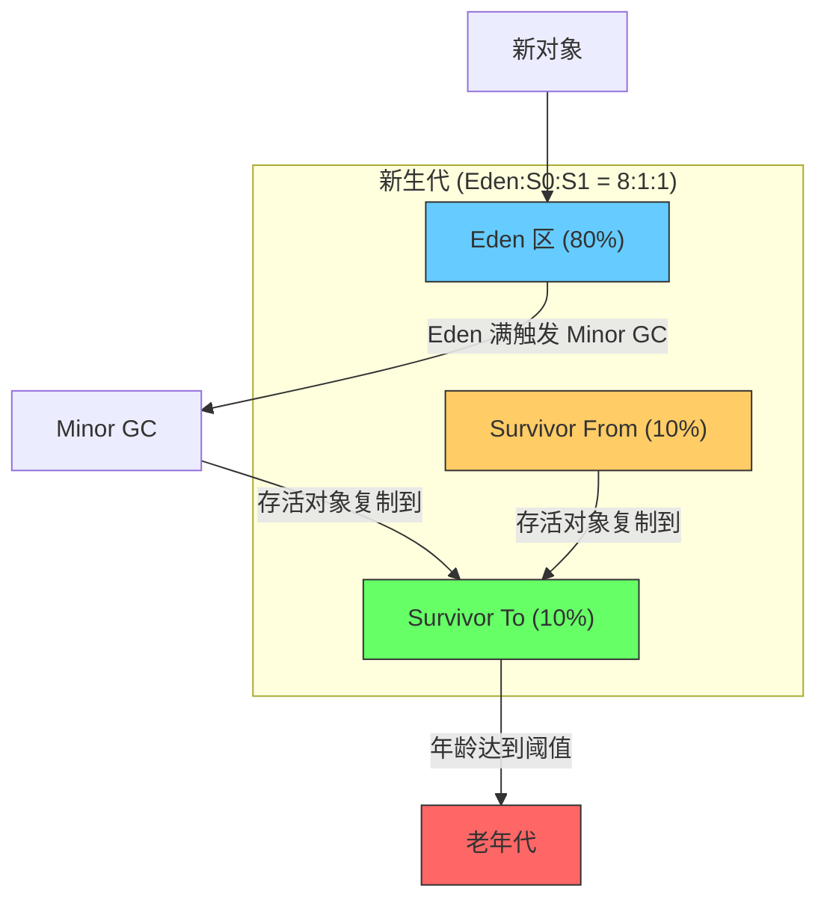

> **为什么 8:1:1？** 研究表明，新生代中 98% 的对象都是"朝生夕死"的，只需要 10% 的空间保存存活对象。这样空间利用率高达 90%。

#### 优缺点

| 优点 | 缺点 |
|------|------|
| **无内存碎片**：复制后紧凑排列 | **浪费空间**：始终有一块区域空闲 |
| **效率高**：只需复制存活对象 | **对象存活率高时效率低**：大量复制开销 |
| 分配内存时使用指针碰撞，速度快 | 不适合老年代（存活率高） |

---

### 3.3 标记-整理算法（Mark-Compact）

先标记存活对象，然后将所有存活对象向内存一端移动，最后清理边界以外的内存。

#### 过程

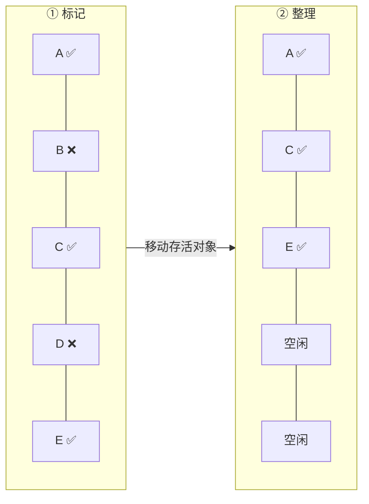

#### 内存状态变化

```
标记后：
┌──────┬──────┬──────┬──────┬──────┬──────┬──────┬──────┐
│  A   │  B   │  C   │  D   │  E   │  F   │  G   │  H   │
│ 存活 │ 垃圾 │ 存活 │ 垃圾 │ 垃圾 │ 存活 │ 垃圾 │ 存活 │
└──────┴──────┴──────┴──────┴──────┴──────┴──────┴──────┘

整理后：
┌──────┬──────┬──────┬──────┬──────┬──────┬──────┬──────┐
│  A   │  C   │  F   │  H   │      │      │      │      │
│ 存活 │ 存活 │ 存活 │ 存活 │ 空闲 │ 空闲 │ 空闲 │ 空闲 │
└──────┴──────┴──────┴──────┴──────┴──────┴──────┴──────┘
                              ↑ 整齐的空闲空间！
```

#### 优缺点

| 优点 | 缺点 |
|------|------|
| **无内存碎片** | **移动对象开销大**：需要更新所有引用 |
| **空间利用率高**：不像复制算法浪费一半空间 | **需要 STW**：移动期间必须暂停用户线程 |
| 适合老年代（存活率高） | 整理过程比清除更耗时 |

---

### 3.4 分代收集算法（Generational Collection）

**核心思想**：根据对象的存活周期将内存划分为不同的区域，对不同区域使用最合适的算法。

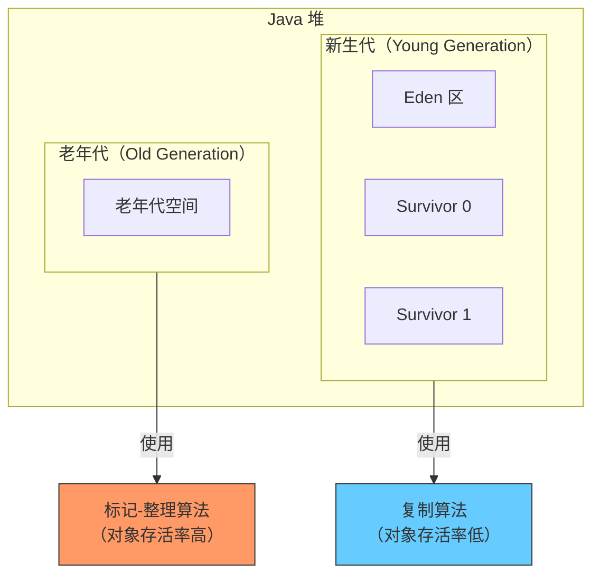

**分代依据——对象的死亡规律**：

| 对象类型 | 比例 | 特点 | 适用算法 |
|---------|------|------|---------|
| 朝生夕死的对象 | ~98% | 创建后很快不再使用 | **复制算法**（高效） |
| 长期存活的对象 | ~2% | 缓存、连接池等 | **标记-整理**（节省空间） |

---

### 3.5 四种算法对比总结

| 算法 | 内存碎片 | 空间利用率 | 效率 | 适用区域 | STW |
|------|---------|-----------|------|---------|-----|
| **标记-清除** | 有 | 高 | 中 | 老年代（CMS） | 是 |
| **复制** | 无 | 低（浪费一半） | 高（存活率低时） | 新生代 | 是 |
| **标记-整理** | 无 | 高 | 低（移动开销） | 老年代 | 是 |
| **分代收集** | 综合最优 | 综合最优 | 综合最优 | 整个堆 | 是 |

---

## 4. GC 类型

### 4.1 三种 GC 类型

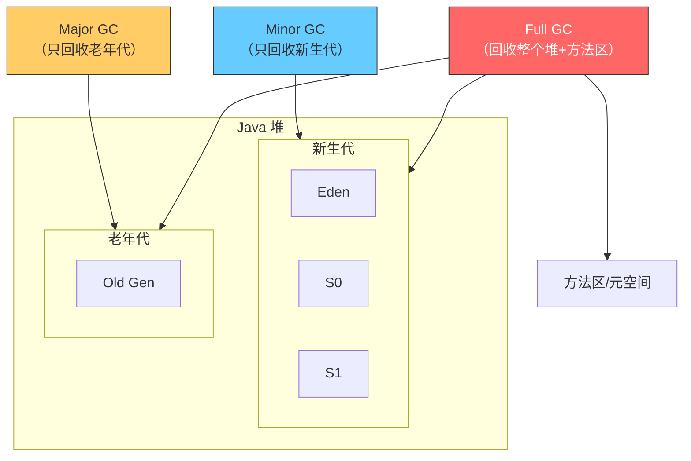

### 4.2 Minor GC（Young GC）

**回收范围**：仅新生代（Eden + Survivor）

**触发条件**：
- Eden 区空间不足时触发
- 是最频繁的 GC 类型

**特点**：
- 速度快（新生代大部分对象朝生夕死）
- 采用复制算法
- 会触发 STW（但暂停时间短）

```
Minor GC 流程：
1. Eden 区满 → 触发 Minor GC
2. 标记 Eden + From Survivor 中的存活对象
3. 将存活对象复制到 To Survivor
4. 清空 Eden + From Survivor
5. From 和 To 角色互换
```

### 4.3 Major GC

**回收范围**：仅老年代

**触发条件**：
- 老年代空间不足
- 通常伴随至少一次 Minor GC

**特点**：
- 比 Minor GC 慢 10 倍以上
- 采用标记-清除或标记-整理算法

> **注意**：很多时候 Major GC 和 Full GC 被混用。在某些收集器中（如 CMS），Major GC 特指仅回收老年代。

### 4.4 Full GC

**回收范围**：整个堆（新生代 + 老年代）+ 方法区/元空间

**触发条件**（需要重点记忆）：

| 触发条件 | 说明 |
|---------|------|
| **调用 System.gc()** | 建议 JVM 执行 Full GC（不保证执行） |
| **老年代空间不足** | 大对象直接进入老年代、晋升失败等 |
| **方法区/元空间不足** | 加载类过多 |
| **CMS 并发失败** | CMS 回收过程中老年代空间不足（Concurrent Mode Failure） |
| **晋升担保失败** | Minor GC 后存活对象放不下老年代 |
| **堆转储（Heap Dump）** | `-XX:+HeapDumpOnOutOfMemoryError` |

**特点**：
- **停顿时间最长**，应尽量避免
- 回收所有区域
- 生产环境中 Full GC 过于频繁是严重问题

### 4.5 GC 类型对比

| | Minor GC | Major GC | Full GC |
|--|---------|---------|---------|
| **回收范围** | 新生代 | 老年代 | 整个堆+方法区 |
| **触发频率** | 高 | 中 | 低（应尽量避免） |
| **暂停时间** | 短（毫秒级） | 较长 | 最长（秒级） |
| **算法** | 复制算法 | 标记-清除/标记-整理 | 综合 |

---

## 5. 七种经典垃圾收集器

### 5.0 收集器总览与搭配关系

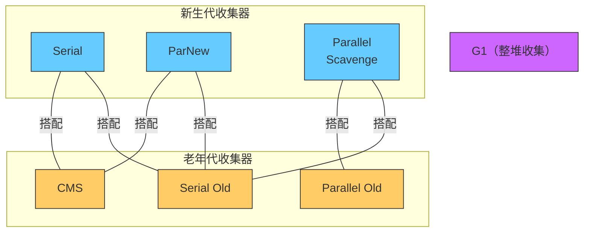

### 5.0.1 收集器演进时间线

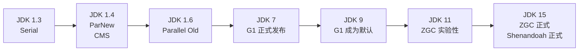

---

### 5.1 Serial 收集器

**单线程**收集器，GC 时必须暂停所有用户线程（STW）。

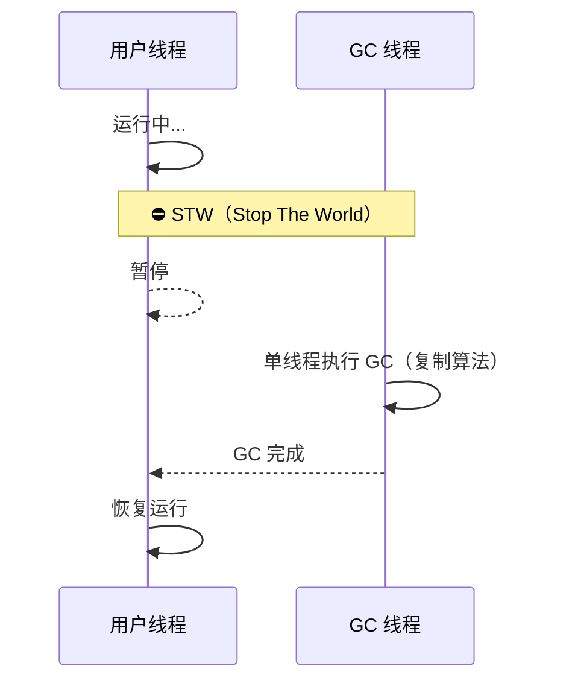

**参数**：`-XX:+UseSerialGC`

| 项目 | 说明 |
|------|------|
| **新生代算法** | 复制算法 |
| **线程** | 单线程 |
| **STW** | 是 |
| **适用场景** | Client 模式、小型应用、单核 CPU |
| **优点** | 简单高效、无线程切换开销、内存消耗小 |
| **缺点** | 暂停时间长、不适合大堆 |

---

### 5.2 ParNew 收集器

Serial 的**多线程版本**，本质是 Serial 的并行化。

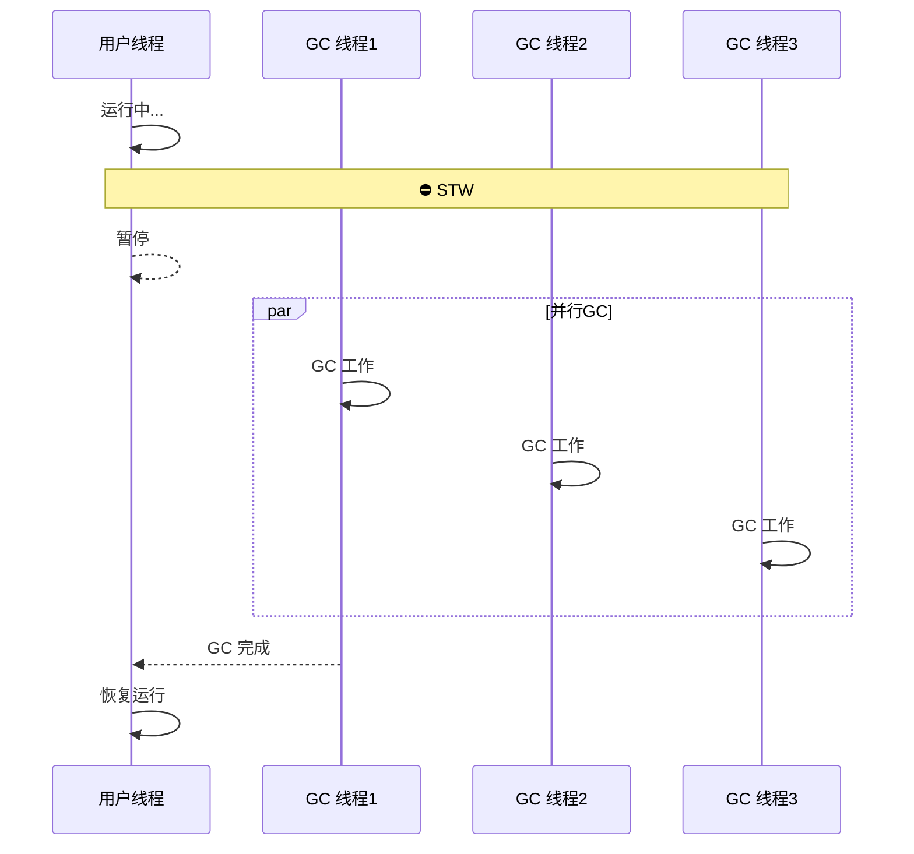

**参数**：`-XX:+UseParNewGC`

| 项目 | 说明 |
|------|------|
| **新生代算法** | 复制算法 |
| **线程** | 多线程并行 |
| **STW** | 是 |
| **适用场景** | 多核 CPU、**配合 CMS 使用** |
| **优点** | 多核环境下比 Serial 快 |
| **缺点** | 单核环境下不如 Serial（线程切换开销） |

> **重要**：ParNew 是能与 CMS 配合的唯一新生代收集器。

---

### 5.3 Parallel Scavenge 收集器

**吞吐量优先**的收集器，目标是达到可控的吞吐量。

```
吞吐量 = 运行用户代码的时间 / (运行用户代码的时间 + GC 时间)
```

**参数**：

```bash
-XX:+UseParallelGC              # 使用 Parallel Scavenge
-XX:MaxGCPauseMillis=200        # 最大 GC 暂停时间（毫秒）
-XX:GCTimeRatio=99              # 吞吐量 = 99/(99+1) = 99%
-XX:+UseAdaptiveSizePolicy      # 自适应调节策略（推荐开启）
```

| 项目 | 说明 |
|------|------|
| **新生代算法** | 复制算法 |
| **线程** | 多线程并行 |
| **STW** | 是 |
| **适用场景** | 后台计算型任务、批处理、不需要低延迟 |
| **优点** | 吞吐量高、可自适应调节 |
| **缺点** | 暂停时间不可预测、不适合交互式应用 |

> **特点**：Parallel Scavenge 不能与 CMS 配合，它有自己的老年代收集器 Parallel Old。

---

### 5.4 Serial Old 收集器

Serial 的**老年代版本**，单线程，使用标记-整理算法。

| 项目 | 说明 |
|------|------|
| **老年代算法** | 标记-整理 |
| **线程** | 单线程 |
| **STW** | 是 |
| **适用场景** | Client 模式、**CMS 失败时的后备方案** |

> **关键**：当 CMS 发生 Concurrent Mode Failure 时，会退化为 Serial Old 进行 Full GC。

---

### 5.5 Parallel Old 收集器

Parallel Scavenge 的**老年代版本**，多线程，使用标记-整理算法。

| 项目 | 说明 |
|------|------|
| **老年代算法** | 标记-整理 |
| **线程** | 多线程并行 |
| **STW** | 是 |
| **适用场景** | **Parallel Scavenge + Parallel Old** 黄金组合 |

> **推荐组合**：`-XX:+UseParallelGC`（自动激活 Parallel Old），JDK 8 的默认收集器。

---

### 5.6 CMS 收集器（Concurrent Mark Sweep）

以获取**最短回收停顿时间**为目标的收集器，基于标记-清除算法。

#### CMS 的 4 个阶段

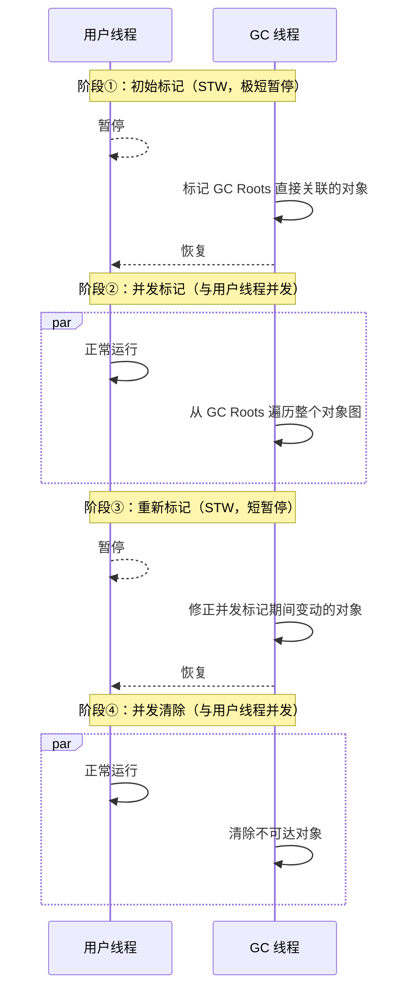

#### 4 个阶段详解

| 阶段 | 是否 STW | 耗时 | 说明 |
|------|---------|------|------|
| **① 初始标记** | ✅ STW | 极短 | 仅标记 GC Roots 直接关联的对象 |
| **② 并发标记** | ❌ 并发 | 较长 | 遍历对象图，与用户线程同时运行 |
| **③ 重新标记** | ✅ STW | 短 | 修正并发标记期间因用户操作导致的标记变动 |
| **④ 并发清除** | ❌ 并发 | 较长 | 清除已标记的垃圾对象，与用户线程同时运行 |

> **关键**：CMS 的 STW 只发生在初始标记和重新标记阶段，时间很短。最耗时的并发标记和并发清除都与用户线程并发执行。

#### CMS 的缺点

**1. CPU 资源敏感**：
- 并发阶段占用 CPU 资源，默认启动线程数 = (CPU 核数 + 3) / 4
- CPU 核数少时会显著影响用户线程吞吐量

**2. 无法处理"浮动垃圾"**：
- 并发清除阶段，用户线程还在运行，可能产生新的垃圾
- 这些垃圾只能等下一次 GC 才能回收

**3. 内存碎片问题**：
- 基于标记-清除算法，会产生内存碎片
- 碎片过多时，大对象无法分配，触发 Full GC
- 参数 `-XX:+UseCMSCompactAtFullCollection`（默认开启）在 Full GC 时整理碎片

**4. Concurrent Mode Failure**：

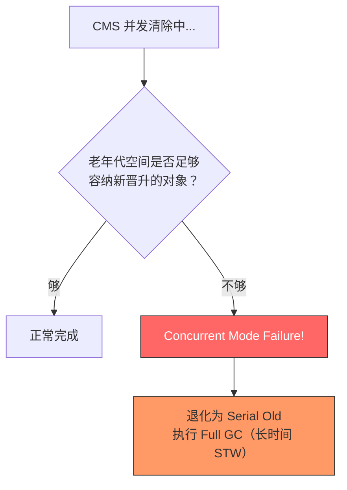

**参数**：

```bash
-XX:+UseConcMarkSweepGC                      # 使用 CMS
-XX:CMSInitiatingOccupancyFraction=75         # 老年代使用 75% 时触发 CMS
-XX:+UseCMSCompactAtFullCollection            # Full GC 时压缩整理
-XX:CMSFullGCsBeforeCompaction=0              # 每次 Full GC 都压缩
-XX:+CMSParallelRemarkEnabled                 # 并行重新标记
```

| 项目 | 说明 |
|------|------|
| **老年代算法** | 标记-清除 |
| **线程** | 并发（GC 线程与用户线程同时运行） |
| **STW** | 两次极短暂停（初始标记 + 重新标记） |
| **适用场景** | 交互式应用、Web 服务器、要求低延迟 |
| **优点** | 并发收集、低停顿 |
| **缺点** | CPU 敏感、浮动垃圾、内存碎片、可能退化 |

> **注意**：CMS 在 JDK 9 被标记为 `@Deprecated`，JDK 14 中被移除。

---

### 5.7 G1 收集器（Garbage-First）

面向**全堆**的收集器，将堆内存划分为多个大小相等的 **Region**，兼顾吞吐量和低延迟。

#### G1 的 Region 机制

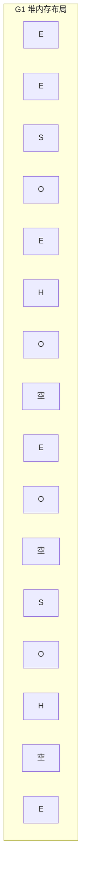

```
G1 堆内存示意图（每个格子是一个 Region）：
┌──────┬──────┬──────┬──────┬──────┬──────┬──────┬──────┐
│  E   │  E   │  S   │  O   │  E   │  H   │  H   │  O   │
│Eden  │Eden  │Surv  │ Old  │Eden  │Humong│Humong│ Old  │
├──────┼──────┼──────┼──────┼──────┼──────┼──────┼──────┤
│ 空闲 │  E   │  O   │ 空闲 │  S   │  O   │  H   │ 空闲 │
│      │Eden  │ Old  │      │Surv  │ Old  │Humong│      │
└──────┴──────┴──────┴──────┴──────┴──────┴──────┴──────┘

E = Eden    S = Survivor    O = Old    H = Humongous（大对象）
```

**Region 类型**：
- **Eden Region**：新对象分配区
- **Survivor Region**：存活对象暂存区
- **Old Region**：长期存活对象区
- **Humongous Region**：大对象区（超过 Region 大小 50% 的对象）

**关键参数**：

```bash
-XX:+UseG1GC                         # 使用 G1
-XX:G1HeapRegionSize=4m              # Region 大小（1MB ~ 32MB，必须是 2 的幂）
-XX:MaxGCPauseMillis=200             # 目标最大暂停时间（默认 200ms）
-XX:G1NewSizePercent=5               # 新生代最小占比
-XX:G1MaxNewSizePercent=60           # 新生代最大占比
-XX:InitiatingHeapOccupancyPercent=45 # 堆使用率达到 45% 时启动并发标记
```

#### G1 的回收过程

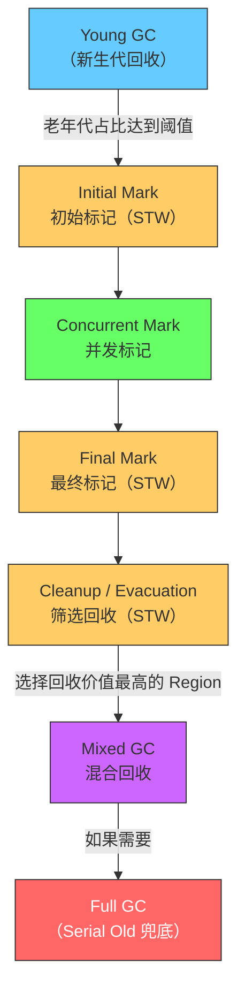

**回收过程详解**：

| 阶段 | 是否 STW | 说明 |
|------|---------|------|
| **Young GC** | STW | Eden 区满时触发，回收所有 Eden 和 Survivor Region |
| **初始标记** | STW（短暂） | 标记 GC Roots 直接关联的对象（借助 Young GC 完成） |
| **并发标记** | 并发 | 遍历对象图，标记存活对象 |
| **最终标记** | STW（短暂） | 处理并发标记阶段的变动（SATB 快照） |
| **筛选回收** | STW | 根据回收价值和时间成本排序，选择性回收 Region |

> **Garbage-First 的含义**：G1 会优先回收"垃圾最多"（回收价值最高）的 Region，这就是 "Garbage-First" 的由来。

#### G1 的核心优势

**1. 可预测的停顿模型**：
- 通过 `-XX:MaxGCPauseMillis` 设置目标暂停时间
- G1 根据目标时间选择合适数量的 Region 回收
- 不保证绝对不超时，但能做到"高概率"

**2. Region 化的内存管理**：
- 不再严格区分新生代和老年代
- Region 可以动态变化角色
- 大对象有专门的 Humongous Region

**3. 全局视角的回收策略**：
- 建立"回收价值"模型（回收获得的空间 / 回收所需时间）
- 优先回收价值高的 Region

| 项目 | 说明 |
|------|------|
| **算法** | 整体：标记-整理；局部（Region 间）：复制算法 |
| **线程** | 并行 + 并发 |
| **STW** | 可控的短暂停 |
| **适用场景** | 大堆（6GB+）、要求可控延迟、JDK 9+ 默认 |
| **优点** | 可预测停顿、无碎片、大堆表现好 |
| **缺点** | 内存占用高（Remember Set 开销）、小堆不如 CMS |

---

### 5.8 七种收集器对比总结

| 收集器 | 线程 | 算法 | 区域 | 特点 | 适用场景 |
|-------|------|------|------|------|---------|
| **Serial** | 单线程 | 复制 | 新生代 | 简单高效 | Client/小应用 |
| **ParNew** | 多线程 | 复制 | 新生代 | Serial 多线程版 | 配合 CMS |
| **Parallel Scavenge** | 多线程 | 复制 | 新生代 | 吞吐量优先 | 后台计算 |
| **Serial Old** | 单线程 | 标记-整理 | 老年代 | Serial 老年代版 | Client/CMS 后备 |
| **Parallel Old** | 多线程 | 标记-整理 | 老年代 | PS 老年代版 | 配合 PS |
| **CMS** | 并发 | 标记-清除 | 老年代 | 低停顿 | Web/交互式 |
| **G1** | 并发+并行 | 复制+标记-整理 | 整堆 | 可预测停顿 | 大堆/通用 |

---

## 6. 新一代收集器简介

### 6.1 ZGC（Z Garbage Collector）

> JDK 11 引入（实验性），JDK 15 正式发布。目标：**暂停时间不超过 10ms**。

```mermaid
flowchart LR
    subgraph ZGC特性["ZGC 核心特性"]
        A["暂停时间 < 10ms"]
        B["暂停时间不随堆增大而增长"]
        C["支持 TB 级堆内存"]
    end
```

**核心技术**：

| 技术 | 说明 |
|------|------|
| **着色指针（Colored Pointers）** | 在指针中嵌入 GC 信息（标记位、重映射位等） |
| **读屏障（Load Barrier）** | 读取对象引用时检查和修正指针 |
| **并发整理** | 几乎所有工作都与用户线程并发执行 |

**参数**：
```bash
-XX:+UseZGC                      # 使用 ZGC（JDK 11+）
-XX:ZCollectionInterval=5        # 每 5 秒触发一次 GC（可选）
-Xmx16g                          # ZGC 适合大堆
```

**适用场景**：
- 超大堆内存（数百 GB 甚至 TB 级）
- 对延迟极其敏感的应用（金融交易、实时系统）
- JDK 11+ 环境

---

### 6.2 Shenandoah

> JDK 12 引入（实验性），JDK 15 正式发布。由 Red Hat 主导开发。

**核心特性**：
- 与 ZGC 类似，追求超低暂停时间
- **并发压缩**：GC 过程中可以并发移动对象
- 使用"转发指针（Brooks Pointer）"实现并发移动

**与 ZGC 的对比**：

| 特性 | ZGC | Shenandoah |
|------|-----|------------|
| **实现方式** | 着色指针 + 读屏障 | 转发指针 + 读写屏障 |
| **最大暂停** | < 10ms | < 10ms |
| **堆大小支持** | TB 级 | TB 级 |
| **提供者** | Oracle | Red Hat |
| **JDK 版本** | JDK 11+ | JDK 12+（部分发行版 JDK 8+） |

**参数**：
```bash
-XX:+UseShenandoahGC              # 使用 Shenandoah
```

---

### 6.3 收集器发展趋势

```mermaid
flowchart LR
    Past["过去<br/>Serial/Parallel<br/>全程 STW"] --> Present["现在<br/>CMS/G1<br/>部分并发"]
    Present --> Future["未来<br/>ZGC/Shenandoah<br/>几乎全并发"]
    
    style Past fill:#f96,stroke:#333
    style Present fill:#fc6,stroke:#333
    style Future fill:#6f6,stroke:#333
```

**趋势**：暂停时间越来越短，并发程度越来越高，支持的堆越来越大。

---

## 7. 收集器选型指南

### 7.1 选型决策树

```mermaid
flowchart TD
    Start["选择 GC 收集器"] --> Q1{"堆内存大小？"}
    
    Q1 -->|"< 100MB"| Serial["Serial<br/>-XX:+UseSerialGC"]
    Q1 -->|"100MB ~ 6GB"| Q2{"优先考虑什么？"}
    Q1 -->|"> 6GB"| Q3{"JDK 版本？"}
    
    Q2 -->|"吞吐量"| Parallel["Parallel<br/>-XX:+UseParallelGC"]
    Q2 -->|"低延迟"| Q4{"JDK 版本？"}
    
    Q4 -->|"JDK 8"| CMS["CMS<br/>-XX:+UseConcMarkSweepGC"]
    Q4 -->|"JDK 9+"| G1_1["G1<br/>-XX:+UseG1GC"]
    
    Q3 -->|"JDK 8/9"| G1_2["G1<br/>-XX:+UseG1GC"]
    Q3 -->|"JDK 11+"| Q5{"对延迟要求？"}
    
    Q5 -->|"一般（< 200ms）"| G1_3["G1<br/>-XX:+UseG1GC"]
    Q5 -->|"极致（< 10ms）"| ZGC["ZGC<br/>-XX:+UseZGC"]
    
    style Serial fill:#6cf,stroke:#333
    style Parallel fill:#6cf,stroke:#333
    style CMS fill:#fc6,stroke:#333
    style G1_1 fill:#6f6,stroke:#333
    style G1_2 fill:#6f6,stroke:#333
    style G1_3 fill:#6f6,stroke:#333
    style ZGC fill:#c6f,stroke:#333
```

### 7.2 常见场景推荐

| 场景 | 推荐收集器 | 原因 |
|------|-----------|------|
| **小型桌面应用** | Serial | 简单高效，内存占用小 |
| **后台批处理** | Parallel Scavenge + Parallel Old | 吞吐量优先 |
| **Web 应用（JDK 8）** | ParNew + CMS | 低延迟，用户体验好 |
| **Web 应用（JDK 9+）** | G1 | 默认收集器，平衡吞吐量和延迟 |
| **大数据处理** | G1 或 Parallel | 大堆 + 高吞吐 |
| **微服务（容器化）** | G1 或 ZGC | 可控延迟，适配容器资源限制 |
| **金融交易系统** | ZGC 或 Shenandoah | 极低延迟要求 |
| **超大堆（> 32GB）** | ZGC | 暂停时间不随堆增大 |

### 7.3 JDK 版本默认收集器

| JDK 版本 | 默认收集器 |
|---------|-----------|
| JDK 7 | Parallel Scavenge + Parallel Old |
| JDK 8 | Parallel Scavenge + Parallel Old |
| JDK 9+ | G1 |

---

## 8. GC 日志格式解析与实战

### 8.1 开启 GC 日志

**JDK 8 及以前**：
```bash
-XX:+PrintGCDetails           # 打印 GC 详细信息
-XX:+PrintGCDateStamps        # 打印 GC 时间戳
-XX:+PrintGCTimeStamps        # 打印 JVM 启动后的秒数
-Xloggc:gc.log                # 输出到文件
-XX:+PrintHeapAtGC            # GC 前后打印堆信息
-XX:+PrintGCApplicationStoppedTime  # 打印应用暂停时间
```

**JDK 9+（统一日志框架 - JEP 158）**：
```bash
-Xlog:gc*:file=gc.log:time,uptime,level,tags
-Xlog:gc+heap=debug:file=gc.log    # 更详细的堆信息
```

### 8.2 Minor GC 日志解析

**Serial 收集器的 Minor GC 日志**：

```
2025-01-01T10:00:00.123+0800: 0.456: [GC (Allocation Failure) 
    [DefNew: 7680K->512K(9216K), 0.0034567 secs]
    7680K->1024K(19456K), 0.0035678 secs]
    [Times: user=0.00 sys=0.00, real=0.00 secs]
```

**逐字段解读**：

```
2025-01-01T10:00:00.123+0800   → GC 发生的时间（-XX:+PrintGCDateStamps）
0.456:                          → JVM 启动后的秒数
[GC                             → GC 类型（Minor GC）
(Allocation Failure)            → 触发原因（Eden 区分配失败）
[DefNew:                        → 收集器名称（Serial 的新生代叫 DefNew）
7680K->512K                     → 新生代：GC 前 7680KB → GC 后 512KB
(9216K)                         → 新生代总容量
0.0034567 secs]                 → 新生代 GC 耗时
7680K->1024K                    → 整个堆：GC 前 7680KB → GC 后 1024KB
(19456K)                        → 堆总容量
0.0035678 secs]                 → GC 总耗时
[Times: user=0.00 sys=0.00, real=0.00 secs]
                                → user: 用户态 CPU 时间
                                → sys:  内核态 CPU 时间
                                → real: 墙钟时间
```

### 8.3 不同收集器的日志标识

| 收集器 | 新生代标识 | 老年代标识 |
|-------|-----------|-----------|
| Serial | `DefNew` | `Tenured` |
| ParNew | `ParNew` | - |
| Parallel Scavenge | `PSYoungGen` | `ParOldGen` |
| CMS | - | `CMS` |
| G1 | `G1 Evacuation Pause` | `G1 Humongous Allocation` |

### 8.4 Full GC 日志解析

```
2025-01-01T10:00:05.789+0800: 5.123: [Full GC (Allocation Failure)
    [Tenured: 20480K->20480K(20480K), 0.0567890 secs]
    30208K->30000K(30208K),
    [Metaspace: 2655K->2655K(1056768K)],
    0.0569012 secs]
    [Times: user=0.05 sys=0.00, real=0.06 secs]
```

**关键信息**：
- `Full GC`：表示这是一次 Full GC（回收整个堆+方法区）
- `Allocation Failure`：触发原因——对象分配失败
- `Tenured: 20480K->20480K(20480K)`：老年代回收前后不变（说明对象无法回收！）
- `Metaspace`：元空间使用情况

### 8.5 G1 GC 日志解析

```
[GC pause (G1 Evacuation Pause) (young), 0.0015234 secs]
   [Parallel Time: 1.2 ms, GC Workers: 4]
      [GC Worker Start (ms): Min: 123.4, Avg: 123.4, Max: 123.5]
      [Ext Root Scanning (ms): Min: 0.1, Avg: 0.2, Max: 0.3]
      [Update RS (ms): Min: 0.0, Avg: 0.1, Max: 0.2]
      [Scan RS (ms): Min: 0.0, Avg: 0.0, Max: 0.1]
      [Code Root Scanning (ms): Min: 0.0, Avg: 0.0, Max: 0.0]
      [Object Copy (ms): Min: 0.5, Avg: 0.6, Max: 0.7]
   [Code Root Fixup: 0.0 ms]
   [Code Root Purge: 0.0 ms]
   [Clear CT: 0.1 ms]
   [Other: 0.2 ms]
   [Eden: 24.0M(24.0M)->0.0B(24.0M) Survivors: 0.0B->4096.0K Heap: 24.0M(64.0M)->4096.0K(64.0M)]
```

**关键信息**：
- `G1 Evacuation Pause (young)`：G1 的 Young GC
- `Parallel Time`：并行 GC 工作总时间
- `GC Workers: 4`：4 个 GC 工作线程
- `Eden: 24.0M->0.0B`：Eden 区被完全清空
- `Survivors: 0.0B->4096.0K`：存活对象进入 Survivor

### 8.6 常用 GC 日志分析工具

| 工具 | 类型 | 说明 |
|------|------|------|
| **GCViewer** | 桌面工具 | 开源，图形化展示 GC 日志 |
| **GCEasy** | 在线工具 | https://gceasy.io，上传日志即可分析 |
| **JVisualVM** | JDK 工具 | 实时监控 GC 活动 |
| **jstat** | 命令行 | `jstat -gc <pid> 1000` 实时查看 GC 统计 |

---

## 9. 安全点与安全区域

### 9.1 安全点（Safepoint）

**定义**：程序执行过程中的一些特定位置，在这些位置上线程可以安全地暂停以进行 GC。

**为什么需要安全点？**
- GC 需要暂停用户线程（STW），但不能在任意位置暂停
- 线程必须运行到安全点后才能暂停，确保对象引用关系一致

**安全点的位置**（通常在以下位置设置）：
- 方法调用
- 循环跳转
- 异常跳转

```mermaid
flowchart LR
    A["代码执行"] --> B["安全点 ①<br/>方法调用"]
    B --> C["代码执行"]
    C --> D["安全点 ②<br/>循环末尾"]
    D --> E["代码执行"]
    E --> F["安全点 ③<br/>异常跳转"]
    
    style B fill:#fc6,stroke:#333
    style D fill:#fc6,stroke:#333
    style F fill:#fc6,stroke:#333
```

**如何让线程到达安全点？**

| 方式 | 说明 | 使用情况 |
|------|------|---------|
| **抢先式中断** | GC 时直接中断所有线程，如果线程不在安全点则恢复让其跑到安全点 | 几乎不用 |
| **主动式中断** | 设置一个标志，线程运行到安全点时主动检查该标志，如果为 true 则暂停 | **主流方式** |

```mermaid
sequenceDiagram
    participant JVM as JVM（GC发起者）
    participant T1 as 线程1
    participant T2 as 线程2
    participant T3 as 线程3
    
    JVM->>JVM: 设置中断标志 = true
    
    T1->>T1: 运行到安全点，检查标志
    T1-->>T1: 暂停 ✅
    
    T2->>T2: 继续运行...
    T2->>T2: 运行到安全点，检查标志
    T2-->>T2: 暂停 ✅
    
    T3->>T3: 运行到安全点，检查标志
    T3-->>T3: 暂停 ✅
    
    Note over JVM,T3: 所有线程到达安全点，开始 GC
    JVM->>JVM: 执行 GC
    JVM->>JVM: 设置中断标志 = false
    
    T1->>T1: 恢复运行
    T2->>T2: 恢复运行
    T3->>T3: 恢复运行
```

---

### 9.2 安全区域（Safe Region）

**问题**：如果线程处于 Sleep 或 Blocked 状态，它无法"走"到安全点怎么办？

**定义**：安全区域是指在一段代码片段中，引用关系不会发生变化。在这个区域中的任何位置开始 GC 都是安全的。

```mermaid
flowchart TD
    A["线程进入安全区域<br/>（Sleep/Blocked）"] --> B["标记自己在安全区域"]
    B --> C{"GC 是否完成？"}
    C -->|"未完成"| D["等待 GC 完成"]
    D --> C
    C -->|"已完成"| E["离开安全区域<br/>继续运行"]
    
    style A fill:#6cf,stroke:#333
    style B fill:#fc6,stroke:#333
    style E fill:#6f6,stroke:#333
```

**工作流程**：
1. 线程进入安全区域时，标记自己已进入
2. JVM 发起 GC 时，不需要关心已在安全区域的线程
3. 线程要离开安全区域时，检查 GC 是否完成
4. 如果 GC 未完成，线程必须等待直到 GC 完成

---

### 9.3 安全点与安全区域的关系

| 概念 | 安全点（Safepoint） | 安全区域（Safe Region） |
|------|---------------------|------------------------|
| **适用线程** | 正在运行的线程 | Sleep/Blocked 的线程 |
| **触发方式** | 线程主动到达安全点 | 线程标记自己在安全区域 |
| **粒度** | 一个点（特定位置） | 一段区域（代码片段） |
| **目的** | 确保 GC 时线程处于一致状态 | 解决不运行线程无法到达安全点的问题 |

---

## 10. 面试高频问题汇总

### Q1: JVM 如何判断对象是否可以被回收？

**A**：JVM 使用**可达性分析**算法。从 GC Roots 出发，沿着引用链搜索，不可达的对象就是可以被回收的。GC Roots 包括：虚拟机栈中的引用、方法区中的静态属性和常量引用、本地方法栈中的 JNI 引用、同步锁持有的对象等。

---

### Q2: Java 有哪四种引用类型？分别什么时候被回收？

**A**：
- **强引用**：只要引用存在就不会被回收，即使 OOM
- **软引用**（SoftReference）：内存不足时被回收，适合做缓存
- **弱引用**（WeakReference）：下次 GC 时必定回收，如 WeakHashMap
- **虚引用**（PhantomReference）：get() 永远返回 null，配合引用队列跟踪回收时机

---

### Q3: 标记-清除、复制、标记-整理算法各自的优缺点？

**A**：
- **标记-清除**：简单，但产生内存碎片
- **复制算法**：无碎片、高效，但浪费一半空间（新生代用 Eden+Survivor 优化到只浪费 10%）
- **标记-整理**：无碎片、不浪费空间，但移动对象开销大

---

### Q4: Minor GC、Major GC、Full GC 的区别？什么时候触发 Full GC？

**A**：
- **Minor GC**：回收新生代，Eden 区满时触发，频率高，速度快
- **Major GC**：回收老年代
- **Full GC**：回收整个堆+方法区，触发条件包括：调用 System.gc()、老年代空间不足、方法区空间不足、CMS Concurrent Mode Failure、晋升担保失败

---

### Q5: CMS 的工作过程是什么？有哪些缺点？

**A**：CMS 分 4 个阶段：
1. **初始标记**（STW）：标记 GC Roots 直接关联的对象
2. **并发标记**（并发）：遍历对象图
3. **重新标记**（STW）：修正并发标记期间的变动
4. **并发清除**（并发）：清除垃圾对象

缺点：CPU 敏感、浮动垃圾、内存碎片、可能退化为 Serial Old（Concurrent Mode Failure）。

---

### Q6: G1 收集器的特点和工作原理？

**A**：G1 将堆分为多个大小相等的 Region，兼顾吞吐量和低延迟。特点：
- **可预测停顿模型**：通过 MaxGCPauseMillis 控制暂停时间
- **Region 化管理**：Eden、Survivor、Old、Humongous 四种 Region
- **优先回收价值最高的 Region**（Garbage-First）
- 整体标记-整理，局部（Region 间）复制算法

---

### Q7: G1 和 CMS 的区别？

**A**：

| | CMS | G1 |
|--|-----|-----|
| **算法** | 标记-清除 | 标记-整理 + 复制 |
| **碎片** | 有 | 无 |
| **停顿控制** | 不可预测 | 可通过参数控制 |
| **适用堆大小** | 中等 | 大堆（6GB+） |
| **JDK 状态** | JDK 14 移除 | JDK 9+ 默认 |

---

### Q8: 什么是安全点？为什么需要安全点？

**A**：安全点是程序执行中的特定位置（方法调用、循环末尾、异常跳转等），线程只有到达安全点才能暂停进行 GC。这是因为 GC 需要在引用关系一致的状态下进行，如果在任意位置暂停，可能导致引用信息不一致。

---

### Q9: ZGC 有什么特点？

**A**：ZGC 是 JDK 11 引入的低延迟收集器，核心特点：
- **暂停时间 < 10ms**，且不随堆增大而增长
- 支持 TB 级堆内存
- 使用着色指针和读屏障技术
- 几乎所有工作并发执行

---

### Q10: 如何选择合适的垃圾收集器？

**A**：根据应用场景选择：
- **小型应用/Client**：Serial
- **后台计算/批处理（吞吐量优先）**：Parallel Scavenge + Parallel Old
- **Web 应用（JDK 8，低延迟）**：ParNew + CMS
- **通用场景（JDK 9+）**：G1（默认）
- **超大堆/极低延迟**：ZGC 或 Shenandoah

---

### Q11: 对象从新生代晋升到老年代的条件有哪些？

**A**：
1. **年龄达到阈值**：经历多次 Minor GC 后年龄达到 `-XX:MaxTenuringThreshold`（默认 15）
2. **大对象直接进入老年代**：超过 `-XX:PretenureSizeThreshold`
3. **动态年龄判断**：Survivor 区中相同年龄对象大小之和超过 Survivor 空间的一半，年龄 >= 该年龄的对象直接晋升
4. **Survivor 区空间不足**：Minor GC 后存活对象放不下 Survivor，直接晋升

---

### Q12: 什么是 TLAB？为什么需要 TLAB？

**A**：TLAB（Thread Local Allocation Buffer）是 JVM 为每个线程在 Eden 区预分配的一小块内存。线程分配对象时先在自己的 TLAB 中分配，避免多线程竞争。当 TLAB 用完后才需要 CAS 操作分配新的 TLAB 或直接在堆上分配。

---

## 📋 学习检查清单

完成 Day02 学习后，请确认你能：

### 基础理解
- [ ] 能说出引用计数法的缺陷（循环引用）
- [ ] 能列出至少 4 种 GC Roots
- [ ] 能区分四种引用类型及其回收时机
- [ ] 能说出标记-清除、复制、标记-整理各自的过程和优缺点
- [ ] 能区分 Minor GC、Major GC、Full GC

### 深入理解
- [ ] 能画出 CMS 的 4 个阶段时序图
- [ ] 能解释 G1 的 Region 机制
- [ ] 能说出 G1 的回收过程
- [ ] 能说出 Full GC 的触发条件（至少 4 种）
- [ ] 能解释安全点和安全区域的作用

### 实战能力
- [ ] 能阅读和解析 GC 日志
- [ ] 能配置不同的 GC 收集器
- [ ] 能根据场景选择合适的收集器
- [ ] 能回答以上面试问题

---

## 📚 附录：常用 GC 参数速查

```bash
# 收集器选择
-XX:+UseSerialGC                  # Serial + Serial Old
-XX:+UseParNewGC                  # ParNew + Serial Old
-XX:+UseParallelGC                # Parallel Scavenge + Parallel Old（JDK 8 默认）
-XX:+UseConcMarkSweepGC           # ParNew + CMS（JDK 14 移除）
-XX:+UseG1GC                      # G1（JDK 9+ 默认）
-XX:+UseZGC                       # ZGC（JDK 11+）
-XX:+UseShenandoahGC              # Shenandoah（JDK 12+）

# GC 日志
# JDK 8:
-XX:+PrintGCDetails
-XX:+PrintGCDateStamps
-Xloggc:gc.log
# JDK 9+:
-Xlog:gc*:file=gc.log:time,uptime,level,tags

# 堆内存
-Xms512m                          # 初始堆大小
-Xmx1024m                         # 最大堆大小
-Xmn256m                          # 新生代大小
-XX:NewRatio=2                    # 老年代:新生代 = 2:1
-XX:SurvivorRatio=8               # Eden:Survivor = 8:1

# G1 参数
-XX:G1HeapRegionSize=4m           # Region 大小
-XX:MaxGCPauseMillis=200          # 目标最大暂停时间
-XX:InitiatingHeapOccupancyPercent=45  # 启动并发标记的堆占比

# CMS 参数
-XX:CMSInitiatingOccupancyFraction=75  # 老年代 75% 时触发
-XX:+UseCMSCompactAtFullCollection     # Full GC 时压缩

# 晋升策略
-XX:MaxTenuringThreshold=15       # 最大晋升年龄
-XX:PretenureSizeThreshold=1m     # 大对象直接进入老年代的阈值

# OOM 诊断
-XX:+HeapDumpOnOutOfMemoryError   # OOM 时自动 dump
-XX:HeapDumpPath=./heap.hprof     # dump 文件路径
```

---

**🎉 恭喜完成 Day02 学习！**

GC 是 JVM 调优的核心，也是面试的高频考点。掌握了 GC 算法和收集器，你就具备了 JVM 调优的基础能力。继续加油，向 30K 目标前进！
