# 📚 Day03 教学课件：JVM 调优实战详解

> **导师定制课件** | 原创内容，图文并茂，深入浅出  
> 本课件聚焦 JVM 调优实战，从参数配置到问题排查，从工具使用到生产实践  
> **前置知识**：Day01（JVM 内存模型）、Day02（GC 算法与垃圾收集器）

---

## 📋 目录

1. [JVM 参数体系](#1-jvm-参数体系)
2. [堆内存调优](#2-堆内存调优)
3. [GC 调优策略](#3-gc-调优策略)
4. [GC 日志详细解读](#4-gc-日志详细解读)
5. [JVM 监控工具详解](#5-jvm-监控工具详解)
6. [图形化工具使用教程](#6-图形化工具使用教程)
7. [常见 OOM 问题排查实战](#7-常见-oom-问题排查实战)
8. [线上问题排查流程](#8-线上问题排查流程)
9. [生产环境 JVM 参数模板与最佳实践](#9-生产环境-jvm-参数模板与最佳实践)
10. [调优案例分析](#10-调优案例分析)
11. [面试高频问题汇总](#11-面试高频问题汇总)

---

## 1. JVM 参数体系

### 1.1 参数分类全景

JVM 参数分为三大类，理解分类是调优的第一步：

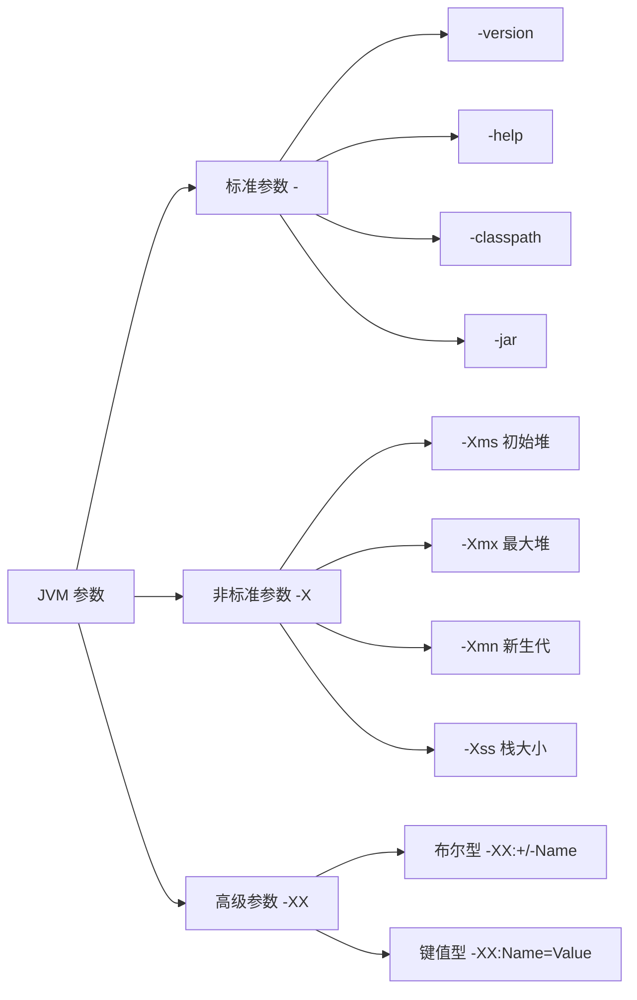

### 1.2 标准参数（-）

标准参数在所有 JVM 实现中都支持，**跨版本稳定**，不会轻易变更。

| 参数 | 说明 | 示例 |
|------|------|------|
| `-version` | 显示 JVM 版本信息 | `java -version` |
| `-help` | 显示帮助信息 | `java -help` |
| `-classpath` / `-cp` | 设置类搜索路径 | `java -cp lib/*:. Main` |
| `-jar` | 执行 JAR 文件 | `java -jar app.jar` |
| `-D<property>=<value>` | 设置系统属性 | `java -Denv=prod -jar app.jar` |
| `-verbose:gc` | 打印 GC 信息 | `java -verbose:gc Main` |
| `-verbose:class` | 打印类加载信息 | `java -verbose:class Main` |
| `-server` / `-client` | 选择 JVM 模式 | `java -server -jar app.jar` |

### 1.3 非标准参数（-X）

以 `-X` 开头，在不同 JVM 实现中**可能不同**，但 HotSpot 上基本稳定。

| 参数 | 说明 | 默认值 | 建议 |
|------|------|--------|------|
| `-Xms` | 初始堆大小 | 物理内存 1/64 | 与 -Xmx 相同 |
| `-Xmx` | 最大堆大小 | 物理内存 1/4 | 物理内存的 50%~75% |
| `-Xmn` | 新生代大小 | 堆的 1/3 | 堆的 1/3~1/2 |
| `-Xss` | 每个线程栈大小 | 512K~1M | 一般不需要调整 |
| `-Xloggc:<file>` | GC 日志输出文件 | 无 | 生产环境必须配置 |

```bash
# 查看所有 -X 参数
java -X
```

### 1.4 高级参数（-XX）

以 `-XX` 开头，是 **HotSpot 特有**的参数，也是调优的核心。分为两种格式：

#### 布尔型参数

```bash
# 启用某功能：-XX:+<name>
-XX:+UseG1GC                # 启用 G1 收集器
-XX:+HeapDumpOnOutOfMemoryError   # OOM 时自动导出堆转储
-XX:+PrintGCDetails          # 打印 GC 详细信息（JDK 8）

# 禁用某功能：-XX:-<name>
-XX:-UseCompressedOops       # 禁用压缩指针
-XX:-OmitStackTraceInFastThrow  # 禁用快速抛异常时省略堆栈
```

#### 键值型参数

```bash
-XX:NewRatio=2               # 老年代:新生代 = 2:1
-XX:SurvivorRatio=8          # Eden:S0:S1 = 8:1:1
-XX:MaxTenuringThreshold=15  # 晋升老年代的年龄阈值
-XX:MetaspaceSize=256m       # 元空间初始大小
-XX:MaxMetaspaceSize=256m    # 元空间最大大小
-XX:MaxGCPauseMillis=200     # 期望最大 GC 暂停时间（ms）
-XX:HeapDumpPath=/tmp/dump.hprof  # 堆转储文件路径
```

### 1.5 如何查看 JVM 参数

```bash
# 方法1：查看所有默认值
java -XX:+PrintFlagsInitial

# 方法2：查看所有最终生效值（包括你设置的和 JVM ergonomics 自动调整的）
java -XX:+PrintFlagsFinal -version

# 方法3：查看正在运行的 Java 进程的参数
jinfo -flags <pid>

# 方法4：使用 jcmd
jcmd <pid> VM.flags

# 方法5：查看命令行参数
jcmd <pid> VM.command_line
```

### 1.6 参数优先级

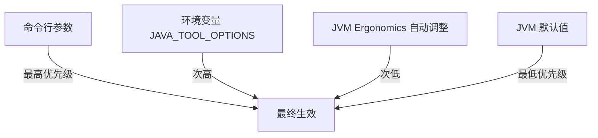

> **关键理解**：JVM 有一套 **Ergonomics**（自适应机制），会根据操作系统、硬件等自动选择合适的参数。命令行参数会覆盖自动选择的值。

---

## 2. 堆内存调优

### 2.1 堆内存结构回顾

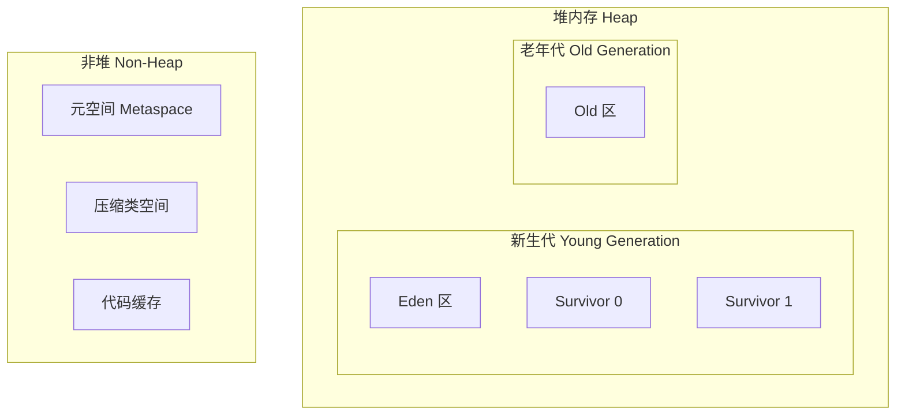

### 2.2 核心堆参数详解

| 参数 | 说明 | 默认值 | 推荐设置 |
|------|------|--------|---------|
| `-Xms` | 初始堆大小 | 物理内存 1/64 | **与 -Xmx 相同** |
| `-Xmx` | 最大堆大小 | 物理内存 1/4 | 物理内存 50%~75% |
| `-Xmn` | 新生代大小 | 由 NewRatio 决定 | 堆的 1/3~1/2 |
| `-XX:NewRatio` | 老年代与新生代的比值 | 2（即 Old:Young=2:1） | 一般保持默认 |
| `-XX:SurvivorRatio` | Eden 与 Survivor 的比值 | 8（即 Eden:S0:S1=8:1:1） | 一般保持默认 |
| `-XX:MaxTenuringThreshold` | 对象晋升老年代的年龄阈值 | 15（CMS 为 6） | 一般保持默认 |
| `-XX:PretenureSizeThreshold` | 大对象直接进入老年代的阈值 | 0（不启用） | 视业务而定 |

### 2.3 Xms 和 Xmx 为什么要设成一样？

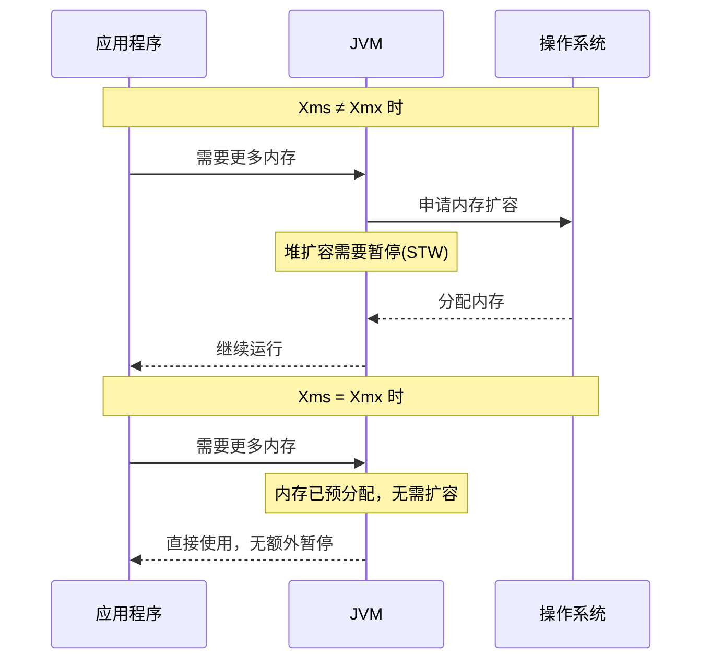

**设置相同的好处**：
1. **避免堆扩容/缩容带来的额外 STW**
2. **避免内存抖动**（频繁申请和释放系统内存）
3. **内存分配更稳定**，减少碎片
4. **GC 行为更可预测**

### 2.4 新生代大小如何确定

**原则**：新生代太小 → Minor GC 太频繁；新生代太大 → 老年代太小，Full GC 更频繁。

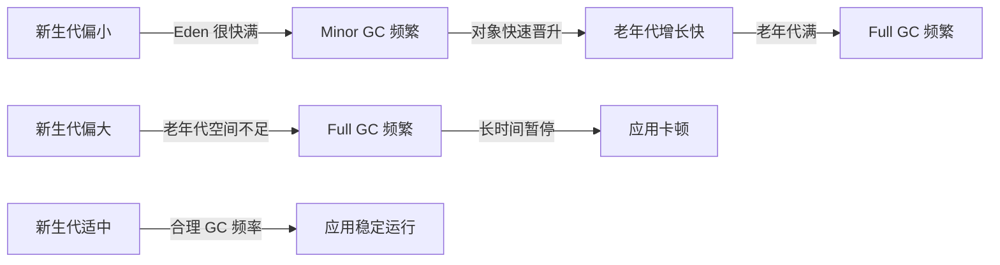

**推荐做法**：
- **一般场景**：新生代占堆的 **1/3**（即 `NewRatio=2`）
- **短生命周期对象多**：可以适当增大新生代（1/2 甚至更多）
- **长生命周期对象多**：保持默认或减小新生代

### 2.5 堆内存计算示例

假设服务器 8G 内存，分配给 JVM 4G：

```bash
-Xms4g -Xmx4g          # 堆大小 4G
-Xmn1536m               # 新生代约 1.5G（堆的 3/8）
# 老年代 = 4G - 1.5G = 2.5G

# 新生代内部分配（SurvivorRatio=8）：
# Eden = 1.5G * 8/10 = 1.2G
# S0 = S1 = 1.5G * 1/10 = 150M
```

---

## 3. GC 调优策略

### 3.1 调优目标

GC 调优的核心目标只有两个，而且**通常不可兼得**：

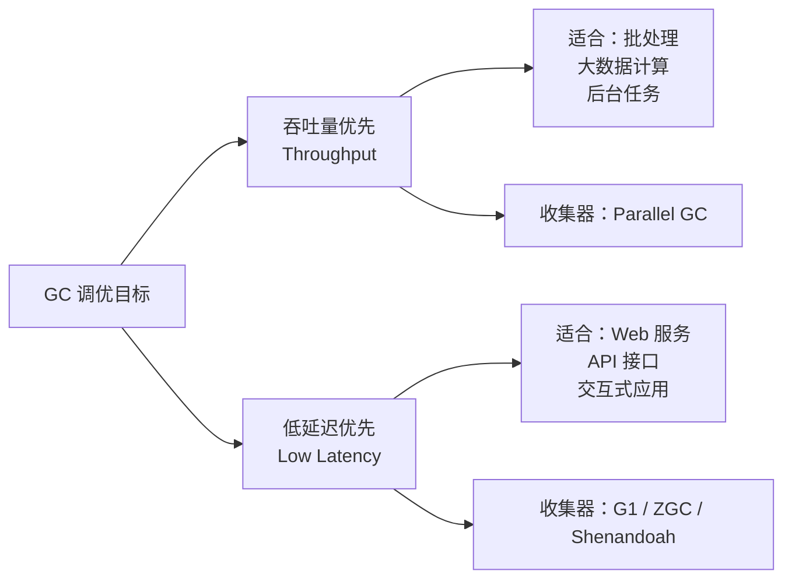

### 3.2 吞吐量优先策略

**目标**：最大化 CPU 用于运行应用代码的时间占比。

```
吞吐量 = 应用运行时间 / (应用运行时间 + GC 时间)
```

**适用场景**：批处理、科学计算、大数据处理等对延迟不敏感的场景。

**推荐配置**：

```bash
# 使用 Parallel GC（JDK 8 默认）
-XX:+UseParallelGC
-XX:+UseParallelOldGC

# 设置期望吞吐量（默认 99，即 GC 时间不超过 1%）
-XX:GCTimeRatio=99

# 设置最大暂停时间（可选，与吞吐量目标冲突时以暂停时间为准）
-XX:MaxGCPauseMillis=500

# 启用自适应调节策略
-XX:+UseAdaptiveSizePolicy
```

### 3.3 低延迟优先策略

**目标**：最小化 GC 暂停时间（STW 时间）。

**适用场景**：Web 应用、API 服务、交互式系统等对响应时间敏感的场景。

**推荐配置（G1）**：

```bash
# 使用 G1 GC（JDK 9+ 默认）
-XX:+UseG1GC

# 设置期望最大暂停时间
-XX:MaxGCPauseMillis=200

# G1 Region 大小（1MB~32MB，2 的幂）
-XX:G1HeapRegionSize=4m

# 触发并发标记的堆占用率阈值
-XX:InitiatingHeapOccupancyPercent=45
```

**推荐配置（ZGC，JDK 17+）**：

```bash
# 使用 ZGC（超低延迟，暂停时间 < 1ms）
-XX:+UseZGC

# ZGC 几乎不需要额外调优
# 主要关注堆大小即可
-Xms4g -Xmx4g
```

### 3.4 收集器选择决策树

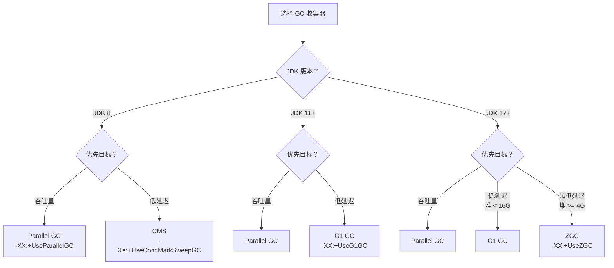

### 3.5 调优原则

1. **先确认问题，再调优**：不要过早优化，先用监控工具确认 GC 是否真的是瓶颈
2. **一次只改一个参数**：方便对比效果，避免参数之间的相互影响
3. **充分测试**：调优后必须经过压测验证，不能只看日志
4. **关注业务指标**：最终要看的是业务指标（RT、QPS、错误率），而非 GC 指标本身
5. **保持简单**：能用默认值就不改，绝大多数场景 G1 + 合理堆大小就够了

---

## 4. GC 日志详细解读

### 4.1 开启 GC 日志

```bash
# ===== JDK 8 =====
-XX:+PrintGCDetails            # 打印 GC 详细信息
-XX:+PrintGCDateStamps         # 打印 GC 时间戳
-XX:+PrintGCTimeStamps         # 打印 JVM 启动后的相对时间
-XX:+PrintGCApplicationStoppedTime  # 打印 STW 时间
-XX:+PrintHeapAtGC             # 每次 GC 前后打印堆信息
-Xloggc:gc.log                 # GC 日志输出到文件

# ===== JDK 9+ (统一日志框架) =====
-Xlog:gc*:file=gc.log:time,uptime,level,tags
# 更详细的格式：
-Xlog:gc*,gc+heap=debug,gc+age=trace:file=gc.log:time,uptime,level,tags:filecount=5,filesize=10m
```

### 4.2 Minor GC 日志解析（JDK 8 格式）

```
2024-01-15T10:30:45.123+0800: 12.456: [GC (Allocation Failure) [PSYoungGen: 524288K->34567K(611840K)] 674832K->185678K(2010112K), 0.0234567 secs] [Times: user=0.04 sys=0.01, real=0.02 secs]
```

**逐字段解析**：

| 字段 | 值 | 含义 |
|------|---|------|
| `2024-01-15T10:30:45.123+0800` | 日期时间 | GC 发生的绝对时间 |
| `12.456` | 相对时间 | JVM 启动后经过的秒数 |
| `GC` | GC 类型 | Minor GC（如果是 Full 则显示 `Full GC`） |
| `(Allocation Failure)` | 触发原因 | Eden 区分配失败 |
| `PSYoungGen` | 收集器名称 | Parallel Scavenge 新生代收集器 |
| `524288K->34567K` | 新生代变化 | 回收前 512MB → 回收后 33.7MB |
| `(611840K)` | 新生代总容量 | 新生代总大小 597.5MB |
| `674832K->185678K` | 堆变化 | 堆使用：回收前 659MB → 回收后 181MB |
| `(2010112K)` | 堆总容量 | 堆总大小 1963MB |
| `0.0234567 secs` | 暂停时间 | 本次 GC 暂停了 23.4ms |
| `user=0.04` | 用户态 CPU 时间 | 40ms |
| `sys=0.01` | 内核态 CPU 时间 | 10ms |
| `real=0.02` | 实际墙钟时间 | 20ms |

**计算关键指标**：
- **新生代回收量**：524288K - 34567K = **489721K ≈ 478MB**
- **晋升到老年代的量**：(674832K - 185678K) - (524288K - 34567K) = **489154K - 489721K** → 实际看堆变化与新生代变化的差值
- **本次 GC 效果**：回收了约 478MB，暂停 23ms，效果很好

### 4.3 Full GC 日志解析（JDK 8 格式）

```
2024-01-15T10:35:12.789+0800: 300.123: [Full GC (Ergonomics) [PSYoungGen: 34567K->0K(611840K)] [ParOldGen: 1345678K->567890K(1398272K)] 1380245K->567890K(2010112K), [Metaspace: 56789K->56789K(1101824K)], 1.2345678 secs] [Times: user=2.34 sys=0.12, real=1.23 secs]
```

**逐字段解析**：

| 字段 | 值 | 含义 |
|------|---|------|
| `Full GC` | GC 类型 | 全堆回收（STW 时间长） |
| `(Ergonomics)` | 触发原因 | JVM 自适应机制触发 |
| `PSYoungGen: 34567K->0K` | 新生代 | 全部清空 |
| `ParOldGen: 1345678K->567890K` | 老年代 | 回收前 1.28G → 回收后 554MB |
| `1380245K->567890K` | 总堆 | 堆使用大幅下降 |
| `Metaspace: 56789K->56789K` | 元空间 | 未变化（元空间对象未回收） |
| `1.2345678 secs` | 暂停时间 | **1.23 秒！这是很严重的暂停** |

> **警告信号**：Full GC 暂停超过 1 秒，需要立即排查原因！

### 4.4 JDK 9+ 统一日志格式

```
[2024-01-15T10:30:45.123+0800][12.456s][info][gc] GC(12) Pause Young (Normal) (G1 Evacuation Pause) 512M->34M(2048M) 23.456ms
[2024-01-15T10:30:45.123+0800][12.456s][info][gc,heap] GC(12) Eden regions: 256->0(256)
[2024-01-15T10:30:45.123+0800][12.456s][info][gc,heap] GC(12) Survivor regions: 12->15(32)
[2024-01-15T10:30:45.123+0800][12.456s][info][gc,heap] GC(12) Old regions: 45->45
[2024-01-15T10:30:45.123+0800][12.456s][info][gc,heap] GC(12) Humongous regions: 2->1
```

### 4.5 GC 日志分析工具

| 工具 | 类型 | 地址 |
|------|------|------|
| **GCEasy** | 在线 | https://gceasy.io/ |
| **GCViewer** | 本地 | https://github.com/chewiebug/GCViewer |
| **HPjmeter** | 本地 | HP 提供的 GC 日志分析工具 |

---

## 5. JVM 监控工具详解

### 5.1 工具全景

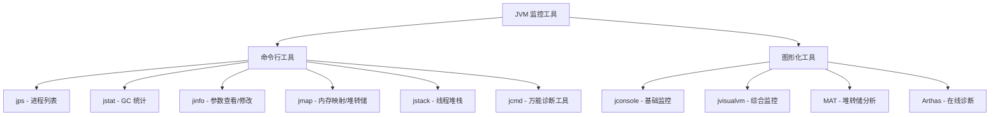

### 5.2 jps — 查看 Java 进程

**作用**：列出正在运行的 Java 进程及其 PID，是所有排查的**第一步**。

```bash
# 基本用法
jps
# 输出：
# 12345 Application
# 12346 Jps

# 显示完整主类名
jps -l
# 输出：
# 12345 com.example.Application
# 12346 jdk.jcmd/sun.tools.jps.Jps

# 显示 JVM 参数
jps -v
# 输出：
# 12345 Application -Xms512m -Xmx512m -XX:+UseG1GC

# 显示传递给 main 方法的参数
jps -m
```

### 5.3 jstat — GC 实时监控

**作用**：实时监控 JVM 的 GC 活动、类加载、编译等统计信息。**最常用的 GC 排查工具**。

#### 常用命令

```bash
# GC 详细统计（最常用）
jstat -gc <pid> 1000        # 每 1000ms 打印一次
jstat -gc <pid> 1000 10     # 每 1000ms 打印一次，共打印 10 次

# GC 使用率百分比（更直观）
jstat -gcutil <pid> 1000

# GC 原因
jstat -gccause <pid> 1000

# 新生代统计
jstat -gcnew <pid> 1000

# 老年代统计
jstat -gcold <pid> 1000

# 元空间统计
jstat -gcmetacapacity <pid> 1000
```

#### jstat -gcutil 输出解析

```
  S0     S1     E      O      M     CCS    YGC     YGCT    FGC    FGCT     GCT
  0.00  45.23  67.89  34.56  97.12  93.45    123    1.234     5    0.567   1.801
```

| 列 | 含义 | 上例值 | 分析 |
|---|------|--------|------|
| S0 | Survivor 0 使用率 | 0.00% | S0 空闲（正常） |
| S1 | Survivor 1 使用率 | 45.23% | S1 有数据（正常） |
| E | Eden 使用率 | 67.89% | Eden 快满了 |
| O | 老年代使用率 | 34.56% | 老年代使用 1/3（正常） |
| M | 元空间使用率 | 97.12% | ⚠️ 元空间快满了 |
| CCS | 压缩类空间使用率 | 93.45% | ⚠️ 接近上限 |
| YGC | Young GC 次数 | 123 | 123 次 Minor GC |
| YGCT | Young GC 总耗时(秒) | 1.234s | 平均每次 10ms（正常） |
| FGC | Full GC 次数 | 5 | 5 次 Full GC |
| FGCT | Full GC 总耗时(秒) | 0.567s | 平均每次 113ms（可接受） |
| GCT | GC 总耗时 | 1.801s | 总暂停 1.8s |

#### 关键判断标准

| 指标 | 正常 | 需要关注 | 需要排查 |
|------|------|---------|---------|
| YGC 频率 | < 10次/分钟 | 10~30次/分钟 | > 30次/分钟 |
| FGC 频率 | < 1次/小时 | 1~5次/小时 | > 5次/小时 |
| 单次 YGC 耗时 | < 50ms | 50~100ms | > 100ms |
| 单次 FGC 耗时 | < 500ms | 500ms~1s | > 1s |
| O（老年代使用率） | < 70% | 70%~85% | > 85% 且持续增长 |

### 5.4 jinfo — 查看/修改 JVM 参数

**作用**：查看和动态修改正在运行的 JVM 参数。

```bash
# 查看所有 JVM flags
jinfo -flags <pid>

# 查看特定参数
jinfo -flag UseG1GC <pid>
jinfo -flag MaxHeapSize <pid>
jinfo -flag NewRatio <pid>

# 动态修改参数（仅限 manageable 类型的参数）
jinfo -flag +PrintGCDetails <pid>     # 启用 GC 详细日志
jinfo -flag -PrintGCDetails <pid>     # 关闭 GC 详细日志
jinfo -flag HeapDumpPath=/tmp <pid>   # 修改堆转储路径

# 查看系统属性
jinfo -sysprops <pid>
```

> **注意**：只有标记为 `manageable` 的参数才能动态修改，大多数参数不支持运行时修改。

### 5.5 jmap — 内存映射与堆转储

**作用**：导出堆转储、查看堆内存统计信息。**内存泄漏排查利器**。

```bash
# 查看堆内存概况
jmap -heap <pid>

# 查看对象统计（按大小排序）
jmap -histo <pid> | head -20

# 只统计存活对象（会触发 Full GC！）
jmap -histo:live <pid> | head -20

# 导出堆转储文件（核心命令）
jmap -dump:format=b,file=heap.hprof <pid>

# 导出存活对象的堆转储（会触发 Full GC）
jmap -dump:live,format=b,file=heap_live.hprof <pid>
```

#### jmap -heap 输出示例

```
Heap Configuration:
   MinHeapFreeRatio         = 40
   MaxHeapFreeRatio         = 70
   MaxHeapSize              = 4294967296 (4096.0MB)
   NewSize                  = 1572864000 (1500.0MB)
   MaxNewSize               = 1572864000 (1500.0MB)
   OldSize                  = 2722103296 (2596.0MB)
   NewRatio                 = 2
   SurvivorRatio            = 8
   MetaspaceSize            = 268435456 (256.0MB)
   MaxMetaspaceSize         = 268435456 (256.0MB)

Heap Usage:
G1 Heap:
   regions  = 2048
   capacity = 4294967296 (4096.0MB)
   used     = 1073741824 (1024.0MB)
   free     = 3221225472 (3072.0MB)
   25.0% used
```

> **⚠️ 生产环境注意**：`jmap -dump` 和 `jmap -histo:live` 会导致较长的 STW，大堆（几十GB）可能暂停几十秒，**请谨慎操作**。推荐使用 `jcmd` 替代。

### 5.6 jstack — 线程堆栈分析

**作用**：打印 Java 线程堆栈信息，排查**死锁、线程阻塞、CPU 飙高**的核心工具。

```bash
# 基本用法
jstack <pid>

# 输出到文件
jstack <pid> > thread_dump.txt

# 强制打印（进程无响应时）
jstack -F <pid>

# 包含锁信息
jstack -l <pid>
```

#### jstack 输出解析

```
"main" #1 prio=5 os_prio=31 tid=0x00007f8a8c00a000 nid=0x1003 waiting on condition [0x000070000f123000]
   java.lang.Thread.State: TIMED_WAITING (sleeping)
        at java.lang.Thread.sleep(Native Method)
        at com.example.App.main(App.java:15)
```

| 字段 | 含义 |
|------|------|
| `"main"` | 线程名 |
| `#1` | 线程编号 |
| `prio=5` | Java 线程优先级 |
| `os_prio=31` | OS 线程优先级 |
| `tid=0x...` | Java 线程 ID |
| `nid=0x1003` | 原生线程 ID（**排查 CPU 高时用 16 进制匹配**） |
| `TIMED_WAITING` | 线程状态 |

#### 线程状态说明

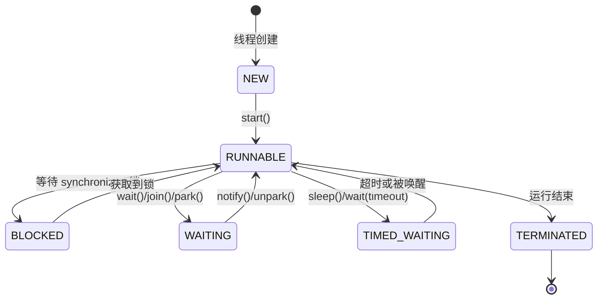

### 5.7 jcmd — 万能诊断工具

**作用**：JDK 7+ 引入的综合诊断工具，可以替代 jmap、jstack 等，是**官方推荐的一站式工具**。

```bash
# 列出可用命令
jcmd <pid> help

# 查看 JVM 信息
jcmd <pid> VM.version          # JVM 版本
jcmd <pid> VM.flags            # JVM 参数
jcmd <pid> VM.command_line     # 启动命令行
jcmd <pid> VM.system_properties  # 系统属性
jcmd <pid> VM.uptime           # 运行时间

# GC 相关
jcmd <pid> GC.heap_info        # 堆信息（替代 jmap -heap）
jcmd <pid> GC.heap_dump /tmp/heap.hprof  # 堆转储（替代 jmap -dump）
jcmd <pid> GC.class_histogram  # 对象统计（替代 jmap -histo）
jcmd <pid> GC.run              # 触发 Full GC

# 线程相关
jcmd <pid> Thread.print        # 线程堆栈（替代 jstack）

# 性能相关
jcmd <pid> VM.native_memory summary  # 原生内存追踪（需启用 NMT）
jcmd <pid> Compiler.directives_print # 编译指令
```

> **推荐**：在 JDK 9+ 中，优先使用 `jcmd` 替代 jmap、jstack 等命令。

---

## 6. 图形化工具使用教程

### 6.1 jconsole — JDK 自带基础监控

**启动方式**：

```bash
jconsole
# 或连接远程
jconsole <hostname>:<port>
```

**远程连接配置**（在目标 JVM 上添加）：

```bash
-Dcom.sun.management.jmxremote
-Dcom.sun.management.jmxremote.port=9999
-Dcom.sun.management.jmxremote.ssl=false
-Dcom.sun.management.jmxremote.authenticate=false
```

**功能**：
- **概览**：CPU、内存、线程、类加载的实时曲线
- **内存**：堆/非堆内存使用情况，可手动触发 GC
- **线程**：线程列表、状态、死锁检测
- **类**：已加载/已卸载类数量
- **MBean**：查看和操作 MBean

### 6.2 jvisualvm — 综合可视化监控

**启动方式**：

```bash
# JDK 8 自带
jvisualvm

# JDK 9+ 需要单独下载
# 下载地址：https://visualvm.github.io/
```

**核心功能**：

| 功能 | 说明 |
|------|------|
| **监视** | 实时 CPU、内存、线程、类加载曲线 |
| **线程** | 线程状态可视化，死锁检测 |
| **抽样器** | CPU 和内存热点分析（轻量级 Profiling） |
| **Profiler** | 方法级别的性能分析 |
| **堆转储** | 导入并分析 .hprof 文件 |
| **Visual GC** | （需安装插件）GC 活动可视化 |

**安装 Visual GC 插件**：
1. 工具 → 插件 → 可用插件
2. 搜索 "Visual GC"
3. 安装并重启

### 6.3 Arthas — 阿里巴巴开源在线诊断神器

**安装**：

```bash
# 方式1：一键安装
curl -O https://arthas.aliyun.com/arthas-boot.jar

# 方式2：使用 as.sh
curl -L https://arthas.aliyun.com/install.sh | sh
```

**启动并连接到目标进程**：

```bash
java -jar arthas-boot.jar
# 选择要 attach 的 Java 进程
```

**常用命令**：

```bash
# ===== 系统信息 =====
dashboard              # 实时面板（CPU、内存、线程、GC 一览）
jvm                    # JVM 详细信息
sysprop               # 系统属性
sysenv                # 环境变量

# ===== 线程相关 =====
thread                 # 查看所有线程
thread -n 3            # 查看 CPU 占用最高的 3 个线程
thread -b              # 查看阻塞其他线程的线程
thread <id>            # 查看指定线程堆栈

# ===== 类和方法 =====
sc com.example.*       # 搜索已加载的类
sm com.example.MyClass # 查看类的方法
jad com.example.MyClass  # 反编译类

# ===== 监控和追踪 =====
watch com.example.MyClass myMethod returnObj  # 观察方法返回值
trace com.example.MyClass myMethod            # 追踪方法调用耗时
monitor com.example.MyClass myMethod          # 方法调用统计

# ===== 热修复 =====
redefine /tmp/MyClass.class   # 热更新类（慎用！）

# ===== 内存 =====
heapdump /tmp/heap.hprof      # 导出堆转储
memory                         # 内存使用信息

# ===== 退出 =====
stop                   # 停止 Arthas
quit                   # 退出当前会话（Arthas 仍在运行）
```

**最实用的命令组合**：

```bash
# 排查 CPU 飙高
dashboard              # 看哪个线程 CPU 高
thread -n 1            # 看 CPU 最高的线程在做什么

# 排查方法慢
trace com.example.MyService processOrder  # 看哪一步最慢

# 排查方法参数和返回值
watch com.example.MyService processOrder '{params, returnObj, throwExp}' -x 3
```

### 6.4 MAT（Eclipse Memory Analyzer）

**下载**：https://eclipse.dev/mat/

**核心分析功能**：

| 功能 | 说明 | 用途 |
|------|------|------|
| **Leak Suspects** | 自动分析泄漏疑点 | 快速定位泄漏 |
| **Dominator Tree** | 对象支配树 | 找到占内存最大的对象 |
| **Top Consumers** | 最大内存消耗者 | 按类/包统计 |
| **Histogram** | 对象直方图 | 按类统计数量和大小 |
| **OQL** | 对象查询语言 | 高级查询 |
| **Path to GC Roots** | GC Root 路径 | 追溯为什么对象不被回收 |

**分析流程**：

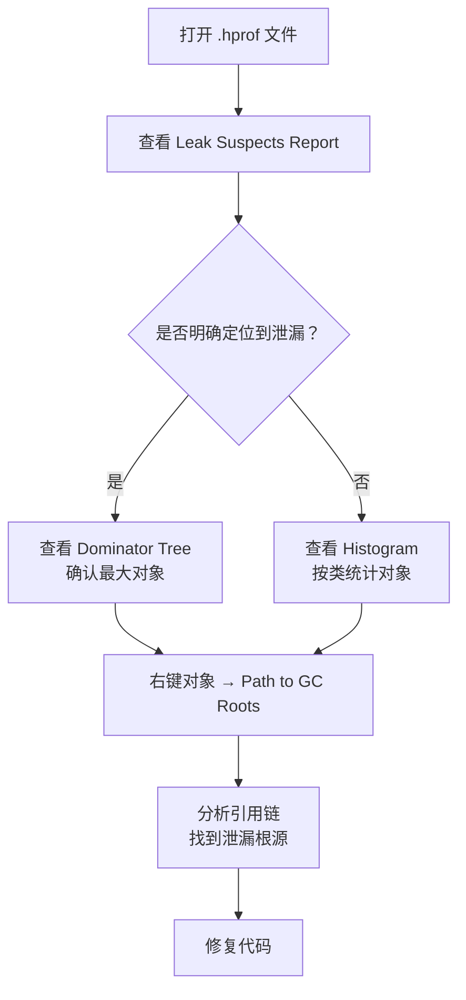

---

## 7. 常见 OOM 问题排查实战

### 7.1 OOM 类型全景

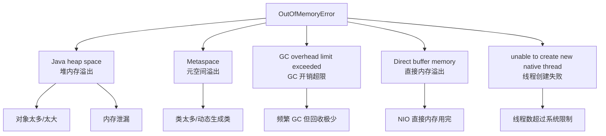

### 7.2 堆内存溢出（Java heap space）

**异常信息**：`java.lang.OutOfMemoryError: Java heap space`

**常见原因**：
1. 堆太小，业务数据量超出预期
2. 内存泄漏（对象被意外持有，无法回收）
3. 大对象分配（一次性加载大文件到内存）

**排查步骤**：

```bash
# 1. 确保开启了 OOM 时自动导出堆转储
-XX:+HeapDumpOnOutOfMemoryError
-XX:HeapDumpPath=/data/logs/

# 2. 使用 MAT 分析堆转储
#    打开 .hprof 文件 → Leak Suspects → Dominator Tree

# 3. 如果是内存泄漏，追溯 GC Root 路径
#    右键大对象 → Path to GC Roots → exclude weak/soft references

# 4. 如果是堆太小，增大堆内存
-Xms4g -Xmx4g
```

**代码层面常见原因**：

```java
// 1. 静态集合无限增长
private static List<Object> cache = new ArrayList<>();  // ❌ 没有上限

// 2. 未关闭的流/连接
InputStream is = new FileInputStream("bigfile.txt");
// 忘记 close → 底层缓冲区无法释放

// 3. 不合理的缓存
Map<String, byte[]> cache = new HashMap<>();  // ❌ 没有淘汰策略
// 改用 Caffeine/Guava Cache，设置最大大小和过期时间
```

### 7.3 栈溢出（StackOverflowError）

**异常信息**：`java.lang.StackOverflowError`

**常见原因**：
1. 递归调用没有正确的终止条件
2. 方法之间的循环调用
3. 栈帧太大（局部变量太多）

**排查方法**：

```bash
# 查看异常堆栈，找到重复出现的方法调用
# 栈溢出时异常堆栈中会有大量重复的方法名

# 调整栈大小（治标不治本）
-Xss512k   # 增大线程栈

# 正确做法：修复递归逻辑
# 1. 添加正确的递归终止条件
# 2. 将递归改为迭代
# 3. 使用尾递归优化（Java 不原生支持，需手动改写）
```

### 7.4 元空间溢出（Metaspace）

**异常信息**：`java.lang.OutOfMemoryError: Metaspace`

**常见原因**：
1. 动态生成大量类（如 CGLib、Javassist、大量 Lambda）
2. 类加载器泄漏（典型于热部署场景）
3. 元空间设置太小

**排查步骤**：

```bash
# 1. 查看元空间使用情况
jstat -gcmetacapacity <pid>

# 2. 查看已加载的类数量
jcmd <pid> GC.class_stats

# 3. 增大元空间（临时方案）
-XX:MetaspaceSize=256m
-XX:MaxMetaspaceSize=512m

# 4. 排查动态类生成
# 使用 Arthas: sc * 查看加载了哪些类
# 关注类名中包含 $$、CGLIB、Lambda 等关键字
```

### 7.5 直接内存溢出（Direct buffer memory）

**异常信息**：`java.lang.OutOfMemoryError: Direct buffer memory`

**常见原因**：
1. NIO 使用的 DirectByteBuffer 分配过多
2. Netty 等框架的直接内存未正确释放
3. 直接内存上限设置不合理

**排查步骤**：

```bash
# 1. 查看直接内存使用情况
jcmd <pid> VM.native_memory summary

# 2. 调整直接内存上限
-XX:MaxDirectMemorySize=512m

# 3. 启用 NMT（Native Memory Tracking）
-XX:NativeMemoryTracking=summary   # 或 detail

# 4. 代码层面：确保 DirectByteBuffer 被正确释放
# 手动释放：((DirectBuffer) buffer).cleaner().clean();
```

---

## 8. 线上问题排查流程

### 8.1 CPU 飙高排查流程

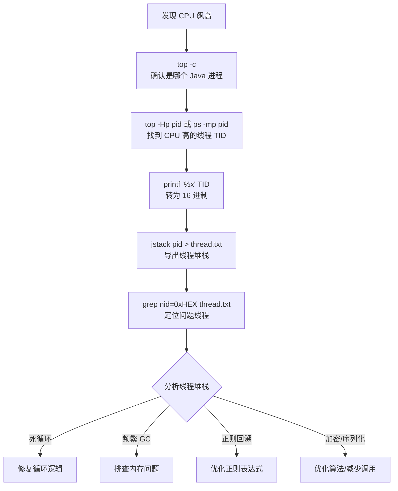

**完整排查命令**：

```bash
# Step 1: 找到 CPU 占用高的 Java 进程
top -c
# 记录 PID，例如 12345

# Step 2: 找到 CPU 占用高的线程（Linux）
top -Hp 12345
# 或
ps -mp 12345 -o THREAD,tid,time | sort -rn | head -10
# 记录 TID，例如 12367

# macOS 上：
ps -M -p 12345

# Step 3: 将线程 ID 转为 16 进制
printf "%x\n" 12367
# 输出: 304f

# Step 4: 导出线程堆栈
jstack 12345 > thread_dump.txt

# Step 5: 搜索问题线程
grep -A 30 "nid=0x304f" thread_dump.txt

# 或者使用 Arthas 一步到位
# dashboard → 看 CPU 最高的线程 → thread <id>
```

### 8.2 内存泄漏排查流程

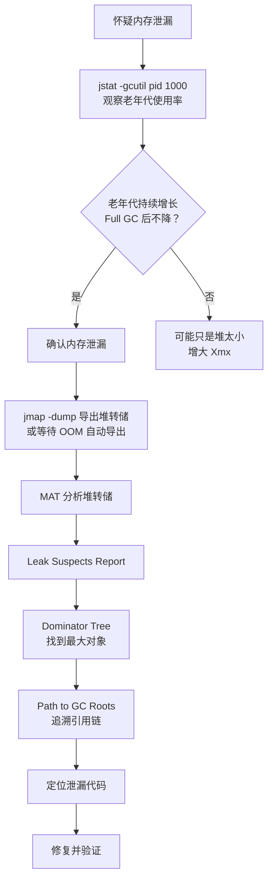

**关键判断指标**：

```bash
# 连续观察 jstat -gcutil 输出
# 如果老年代（O 列）在每次 Full GC 后的"谷底"越来越高，就是泄漏
# 示例（有泄漏）：
#   O: 45% → FGC → 30% → 55% → FGC → 40% → 65% → FGC → 55% → ...
#   谷底：30% → 40% → 55% ... 持续上升 = 泄漏！

# 示例（正常）：
#   O: 45% → FGC → 20% → 50% → FGC → 20% → 55% → FGC → 20% → ...
#   谷底：20% → 20% → 20% ... 保持稳定 = 正常
```

### 8.3 频繁 Full GC 排查流程

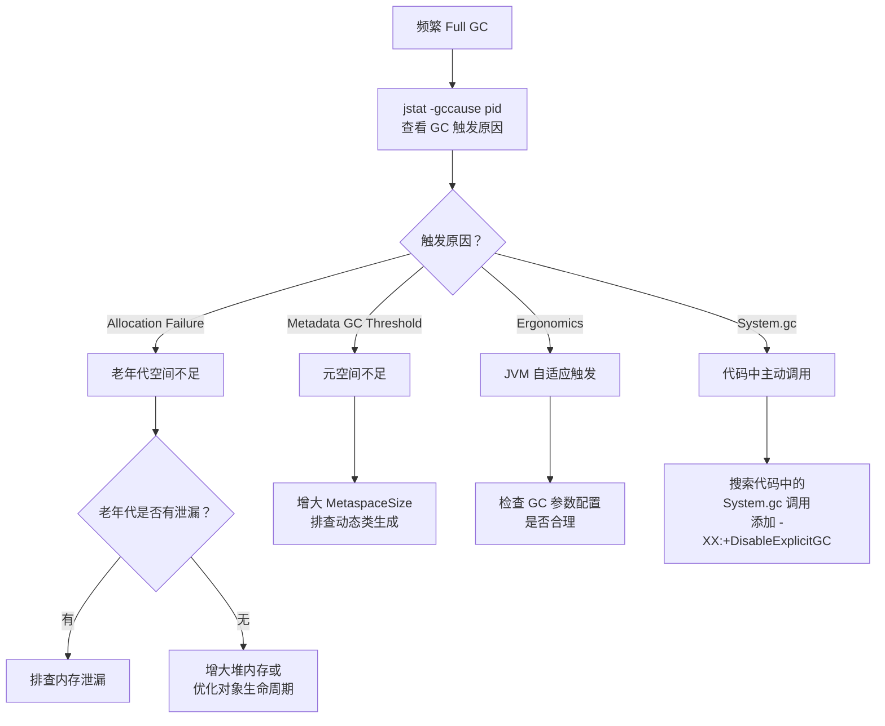

**常见触发原因及解决方案**：

| 原因 | 排查方法 | 解决方案 |
|------|---------|---------|
| 老年代满 | `jstat -gcutil` 看 O 列 | 增大堆/排查泄漏 |
| 元空间满 | `jstat -gcutil` 看 M 列 | 增大 MetaspaceSize |
| 内存碎片 | CMS 特有问题 | 换 G1/调整参数 |
| System.gc() | 搜索代码 | `-XX:+DisableExplicitGC` |
| 大对象分配 | 分析 GC 日志 | 预分配/对象池 |
| 晋升失败 | GC 日志 Promotion Failed | 增大老年代/Survivor |

---

## 9. 生产环境 JVM 参数模板与最佳实践

### 9.1 通用模板（4C8G 服务器，JDK 11+，G1 GC）

```bash
java \
  # ===== 堆内存 =====
  -Xms4g \                           # 初始堆=最大堆，避免扩缩容
  -Xmx4g \                           # 物理内存的 50%
  -Xmn1536m \                        # 新生代约 1.5G（堆的 3/8）

  # ===== 元空间 =====
  -XX:MetaspaceSize=256m \            # 元空间初始大小
  -XX:MaxMetaspaceSize=256m \         # 元空间最大大小（避免无限增长）

  # ===== GC 收集器 =====
  -XX:+UseG1GC \                      # 使用 G1 收集器
  -XX:MaxGCPauseMillis=200 \          # 期望最大暂停 200ms
  -XX:G1HeapRegionSize=4m \           # Region 大小（根据堆大小调整）
  -XX:InitiatingHeapOccupancyPercent=45 \  # 并发标记触发阈值

  # ===== OOM 保护 =====
  -XX:+HeapDumpOnOutOfMemoryError \   # OOM 时自动导出堆转储
  -XX:HeapDumpPath=/data/logs/heapdump/ \ # 堆转储文件路径
  -XX:ErrorFile=/data/logs/hs_err_%p.log \ # JVM 崩溃日志

  # ===== GC 日志 =====
  -Xlog:gc*:file=/data/logs/gc.log:time,uptime,level,tags:filecount=5,filesize=50m \

  # ===== 其他推荐 =====
  -XX:-OmitStackTraceInFastThrow \    # 不省略重复异常的堆栈
  -XX:+ExitOnOutOfMemoryError \       # OOM 时退出（让进程重启）
  -Djava.security.egd=file:/dev/./urandom \  # 加速 SecureRandom

  -jar your-application.jar
```

### 9.2 不同规格服务器参数参考

| 服务器规格 | Xms/Xmx | Xmn | MetaspaceSize | GC 收集器 |
|-----------|----------|-----|---------------|----------|
| 2C4G | 2g | 768m | 128m | G1 |
| 4C8G | 4g | 1536m | 256m | G1 |
| 8C16G | 8g~10g | 3g~4g | 256m | G1 或 ZGC |
| 16C32G | 16g~24g | 6g~8g | 512m | ZGC |

### 9.3 Spring Boot 项目特定优化

```bash
# Spring Boot 常用参数
java \
  -Xms4g -Xmx4g \
  -XX:+UseG1GC \
  -XX:MaxGCPauseMillis=200 \
  -XX:+HeapDumpOnOutOfMemoryError \
  -XX:HeapDumpPath=/data/logs/ \
  -Xlog:gc*:file=/data/logs/gc.log:time,uptime,level,tags \

  # Spring Boot 特有
  -Dspring.profiles.active=prod \     # 激活生产环境配置
  -Dserver.tomcat.max-threads=200 \   # Tomcat 线程池上限
  -Dserver.tomcat.min-spare-threads=20 \ # Tomcat 最小线程
  -Dspring.jmx.enabled=false \        # 关闭 JMX（减少开销）

  -jar your-spring-boot-app.jar
```

### 9.4 最佳实践清单

1. **-Xms 和 -Xmx 设置相同**：避免堆扩缩容带来的 STW
2. **MetaspaceSize 和 MaxMetaspaceSize 设置相同**：避免元空间扩容触发 Full GC
3. **必须开启 HeapDumpOnOutOfMemoryError**：OOM 时自动保存现场
4. **必须配置 GC 日志**：出问题时可以回溯分析
5. **堆大小不超过物理内存的 75%**：留给 OS、直接内存、线程栈等
6. **优先使用 G1 GC**（JDK 11+）：大多数场景都够用
7. **不要手动调用 System.gc()**：让 JVM 自己决定
8. **禁用 OmitStackTraceInFastThrow**：保留完整异常堆栈便于排查
9. **监控先行**：先通过监控发现问题，再进行调优
10. **灰度发布**：参数调整后先在一台机器上验证，再全量推广

---

## 10. 调优案例分析

### 10.1 案例一：电商大促频繁 Full GC

**背景**：电商平台大促期间，应用频繁出现 Full GC，每次暂停 2-3 秒，导致用户请求超时。

**环境**：4C8G，JDK 8，Parallel GC，`-Xms2g -Xmx2g`

**排查过程**：

```bash
# 1. 查看 GC 情况
jstat -gcutil <pid> 1000
#   S0     S1     E      O      M      YGC   YGCT    FGC   FGCT
#  0.00  100.0  99.8   95.2   98.1    4523  45.23    123  234.56
# 老年代 95.2%，FGC 123 次，总暂停 234 秒！

# 2. 查看 GC 原因
jstat -gccause <pid>
# LGCC: Allocation Failure   GCC: Ergonomics

# 3. 导出堆转储分析
jmap -dump:format=b,file=/tmp/heap.hprof <pid>
# MAT 分析发现：大量 Order 对象和关联的 Item 对象占用 80% 堆内存
```

**根因分析**：
- 大促期间订单量激增，每个请求查询大量订单数据并全部加载到内存
- 分页查询实际上查了所有数据，只在代码层面做了截取
- 老年代很快被填满，触发频繁 Full GC

**解决方案**：

```bash
# 短期：增大堆内存 + 换 G1
-Xms4g -Xmx4g -XX:+UseG1GC -XX:MaxGCPauseMillis=200

# 长期：
# 1. 修复分页查询，在 SQL 层面做 LIMIT
# 2. 使用缓存减少数据库查询
# 3. 对大结果集使用流式处理
```

**效果**：Full GC 频率从每分钟 2-3 次降到每小时不到 1 次，暂停时间从 2-3 秒降到 200ms 以内。

### 10.2 案例二：内存泄漏导致每天重启

**背景**：一个微服务每运行 24 小时左右就会 OOM，需要每天重启。

**环境**：2C4G，JDK 11，G1 GC，`-Xms2g -Xmx2g`

**排查过程**：

```bash
# 1. 连续监控老年代变化
jstat -gcutil <pid> 5000
# 每小时记录一次 O 列（老年代使用率）：
# 10:00 → 25%  | Full GC 后
# 11:00 → 32%  | Full GC 后
# 12:00 → 40%  | Full GC 后
# 13:00 → 48%  | Full GC 后
# ...
# Full GC 后的"谷底"持续上升 → 确认内存泄漏

# 2. 在 OOM 前导出堆转储
jmap -dump:format=b,file=/tmp/heap.hprof <pid>

# 3. MAT 分析
# Leak Suspects 报告指向：
#   Problem Suspect 1:
#   java.util.HashMap @ 0x7f8a80001234 占用 1.2GB (60% of heap)
#   由 com.example.service.SessionManager.sessionCache 持有
```

**根因分析**：
- `SessionManager` 使用 `HashMap` 缓存用户会话信息
- 用户退出后没有清理对应的会话缓存
- HashMap 只增不减，导致内存泄漏

**解决方案**：

```java
// 修复前：
private static Map<String, Session> sessionCache = new HashMap<>();  // ❌

// 修复后：使用 Caffeine 缓存，设置最大大小和过期时间
private static Cache<String, Session> sessionCache = Caffeine.newBuilder()
    .maximumSize(10000)              // 最多缓存 10000 个会话
    .expireAfterAccess(30, TimeUnit.MINUTES)  // 30 分钟未访问则过期
    .build();
```

### 10.3 案例三：CPU 飙高定位死循环

**背景**：某服务凌晨 3 点 CPU 突然飙到 100%，持续不下降。

**排查过程**：

```bash
# 1. 找到 CPU 高的进程
top -c
# PID 12345 CPU 99.8%

# 2. 找到 CPU 高的线程
top -Hp 12345
# TID 12389 CPU 98.5%

# 3. 转 16 进制
printf "%x\n" 12389
# 3065

# 4. 在 jstack 中定位
jstack 12345 | grep -A 20 "nid=0x3065"
# "schedule-pool-1" #45 prio=5 nid=0x3065 runnable
#   at com.example.job.DataSyncJob.syncData(DataSyncJob.java:67)
#   at com.example.job.DataSyncJob.run(DataSyncJob.java:32)
```

**根因分析**：
- 定时任务 `DataSyncJob` 中的数据同步逻辑有 BUG
- 当数据库返回空结果时，while 循环的退出条件永远不满足
- 导致死循环

**修复代码**：

```java
// 修复前
while (hasMore) {
    List<Data> batch = fetchBatch(offset, limit);
    processBatch(batch);
    offset += limit;
    // BUG: hasMore 没有更新！当 batch 为空时应该退出
}

// 修复后
while (hasMore) {
    List<Data> batch = fetchBatch(offset, limit);
    if (batch == null || batch.isEmpty()) {
        hasMore = false;  // ✅ 正确退出
        break;
    }
    processBatch(batch);
    offset += limit;
}
```

### 10.4 案例四：元空间溢出排查

**背景**：Spring Boot 应用在使用热部署（spring-boot-devtools）时，运行一段时间后抛出 `Metaspace OOM`。

**环境**：JDK 17，未设置 MetaspaceSize

**排查过程**：

```bash
# 1. 查看元空间使用
jstat -gcmetacapacity <pid>
# MCMN   MCMX    MC      MU
# 0.0  1073741824  524288  520000
# 元空间已用 508MB，接近上限

# 2. 查看加载的类数量
jcmd <pid> GC.class_stats | wc -l
# 35000+ 个类！

# 3. 使用 Arthas 查看加载了哪些类
# sc *.* | grep CGLIB
# 发现大量 CGLIB 代理类
```

**根因分析**：
- `spring-boot-devtools` 在代码变更时会重新加载类
- 每次重新加载都创建新的 ClassLoader，旧的类无法被卸载
- 导致元空间中的类信息不断堆积

**解决方案**：

```bash
# 1. 增大元空间（临时方案）
-XX:MetaspaceSize=512m
-XX:MaxMetaspaceSize=512m

# 2. 生产环境不使用 spring-boot-devtools
# 在 pom.xml 中设置 optional = true
# <dependency>
#     <groupId>org.springframework.boot</groupId>
#     <artifactId>spring-boot-devtools</artifactId>
#     <optional>true</optional>
# </dependency>

# 3. 如果使用 Mybatis/JPA 的动态代理，检查是否有不必要的代理类生成
```

---

## 11. 面试高频问题汇总

### Q1: 如何排查线上 Java 应用 CPU 飙高？

**参考答案**：

1. `top -c` 找到 CPU 高的 Java 进程 PID
2. `top -Hp <pid>` 或 `ps -mp <pid> -o THREAD,tid,time` 找到 CPU 高的线程 TID
3. `printf "%x\n" <TID>` 将线程 ID 转为 16 进制
4. `jstack <pid>` 导出线程堆栈
5. 在线程堆栈中搜索 `nid=0x<16进制TID>`，定位问题线程
6. 分析线程堆栈，判断是死循环、频繁 GC、还是计算密集

也可以使用 Arthas 的 `dashboard` + `thread -n 1` 一步到位。

### Q2: 如何排查内存泄漏？

**参考答案**：

1. `jstat -gcutil <pid> 1000` 连续观察老年代使用率
2. 如果每次 Full GC 后老年代的"谷底"持续上升，确认是内存泄漏
3. `jmap -dump:format=b,file=heap.hprof <pid>` 导出堆转储
4. 使用 MAT 打开堆转储，查看 Leak Suspects Report
5. 通过 Dominator Tree 找到占内存最大的对象
6. 通过 Path to GC Roots 追溯引用链，定位泄漏代码

### Q3: 频繁 Full GC 的可能原因有哪些？

**参考答案**：

1. **老年代空间不足**：堆内存设置太小，或存在内存泄漏
2. **元空间不足**：动态生成大量类（CGLIB、Lambda）
3. **大对象直接进入老年代**：大数组或大对象分配
4. **Concurrent Mode Failure**（CMS 特有）：并发标记期间老年代满了
5. **Promotion Failed**：Minor GC 时晋升到老年代失败
6. **代码中调用 System.gc()**：显式触发 Full GC
7. **内存碎片**：CMS 使用标记-清除算法产生碎片

### Q4: -Xms 和 -Xmx 为什么建议设成一样？

**参考答案**：

1. 避免堆扩容/缩容带来的额外 STW 暂停
2. 避免内存抖动（频繁向 OS 申请和释放内存）
3. 使内存分配更稳定，减少内存碎片
4. 使 GC 行为更可预测，便于调优和监控

### Q5: 如何选择垃圾收集器？

**参考答案**：

- **JDK 8**：
  - 吞吐量优先 → Parallel GC（默认）
  - 低延迟 → CMS（已废弃，但 JDK 8 仍可用）
- **JDK 11+**：
  - 大多数场景 → G1 GC（默认）
  - 超低延迟 + 大堆 → ZGC
- **选择依据**：
  - 堆 < 4G → 考虑 Parallel GC 或 G1
  - 堆 4G~16G → G1 是最佳选择
  - 堆 > 16G + 要求低延迟 → ZGC
  - 批处理/大数据 → Parallel GC

### Q6: JVM 参数 -XX:+UseG1GC 和 -XX:MaxGCPauseMillis 的作用？

**参考答案**：

- `-XX:+UseG1GC`：启用 G1 垃圾收集器。G1 将堆划分为多个等大的 Region，可以同时回收新生代和老年代，通过预测模型选择回收收益最高的 Region 进行回收。
- `-XX:MaxGCPauseMillis=200`：设置期望的最大 GC 暂停时间。G1 会尽量控制每次暂停不超过这个值。但这是一个目标而非保证——如果设置太小，G1 可能每次回收很少的 Region，导致回收速度跟不上分配速度。

### Q7: 什么是 Stop-The-World（STW）？如何减少 STW 时间？

**参考答案**：

STW 是指 GC 执行时需要暂停所有应用线程。减少 STW 的方法：
1. **选择低延迟收集器**：G1、ZGC、Shenandoah
2. **减少堆内存**（但可能增加 GC 频率）
3. **优化对象生命周期**：减少进入老年代的对象
4. **避免大对象分配**：减少 Humongous Region 分配（G1）
5. **合理设置新生代大小**：避免过多对象晋升

### Q8: 生产环境必须配置哪些 JVM 参数？

**参考答案**：

1. `-Xms` / `-Xmx`（设置相同）：堆大小
2. `-XX:MetaspaceSize` / `-XX:MaxMetaspaceSize`：元空间大小
3. `-XX:+HeapDumpOnOutOfMemoryError` + `-XX:HeapDumpPath`：OOM 时保存堆转储
4. GC 日志（`-Xlog:gc*:file=gc.log`）：便于事后分析
5. `-XX:ErrorFile`：JVM 崩溃日志路径
6. GC 收集器相关参数：如 `-XX:+UseG1GC -XX:MaxGCPauseMillis=200`

### Q9: jmap 和 jstack 在生产环境使用有什么风险？

**参考答案**：

- **jmap**：`jmap -dump` 和 `jmap -histo:live` 会触发 Full GC 和 STW，大堆可能暂停几十秒甚至几分钟。建议：
  - 优先使用 `jcmd` 替代
  - 尽量在低峰期操作
  - 配置 `HeapDumpOnOutOfMemoryError` 自动导出
- **jstack**：相对安全，STW 时间短（通常毫秒级），但 `-F` 参数可能导致进程挂起。建议：
  - 优先使用不带 `-F` 的 `jstack`
  - 或使用 `jcmd <pid> Thread.print`

### Q10: 什么是 GC 调优？调优的一般步骤？

**参考答案**：

GC 调优是通过调整 JVM 参数和优化代码，使 GC 行为满足应用的性能需求。

一般步骤：
1. **明确目标**：确定是要提高吞吐量还是降低延迟
2. **收集数据**：开启 GC 日志，使用 jstat 等工具监控
3. **分析问题**：分析 GC 日志，找出 GC 频率、暂停时间等问题
4. **制定方案**：根据问题调整参数（一次只改一个）
5. **压测验证**：在测试环境用接近生产的流量验证
6. **灰度上线**：先在少量机器上线，观察效果
7. **持续监控**：上线后持续监控，确保稳定

### Q11: 如何理解 GC 日志中的 user、sys、real 时间？

**参考答案**：

- **user**：GC 线程在用户态消耗的 CPU 时间总和（多线程会叠加）
- **sys**：GC 线程在内核态消耗的 CPU 时间总和
- **real**：实际的墙钟时间（即应用被暂停的实际时间）

正常情况：`user + sys > real`（因为 GC 是多线程并行的）。如果 `real > user + sys`，说明 GC 线程可能被 OS 调度延迟，或者存在 I/O 等待。

### Q12: Arthas 的 `thread -b` 命令有什么用？

**参考答案**：

`thread -b` 用于查找**阻塞其他线程**的线程。它会分析所有线程的锁持有情况，找出持有锁且导致其他线程 BLOCKED 的线程。这在排查死锁和锁竞争问题时非常实用。

---

## 📎 附录：快速参考卡片

### 常用命令速查

```bash
# ===== 进程与监控 =====
jps -l                        # 列出 Java 进程
jstat -gcutil <pid> 1000      # 监控 GC
jinfo -flags <pid>            # 查看 JVM 参数
jmap -heap <pid>              # 堆内存概况
jmap -dump:format=b,file=heap.hprof <pid>  # 导出堆转储
jstack <pid>                  # 线程堆栈
jcmd <pid> help               # jcmd 命令列表

# ===== CPU 飙高排查 =====
top -Hp <pid>                 # 找 CPU 高的线程
printf "%x\n" <tid>           # 线程 ID 转 16 进制
jstack <pid> | grep "nid=0x"  # 定位线程

# ===== Arthas 快捷 =====
dashboard                     # 实时面板
thread -n 3                   # CPU Top 3 线程
thread -b                     # 阻塞分析
heapdump /tmp/heap.hprof      # 导出堆转储
```

### JVM 参数速查

```bash
# ===== 内存 =====
-Xms4g -Xmx4g                # 堆内存
-Xmn1536m                     # 新生代
-Xss512k                      # 线程栈
-XX:MetaspaceSize=256m         # 元空间
-XX:MaxDirectMemorySize=512m   # 直接内存

# ===== GC =====
-XX:+UseG1GC                  # G1 收集器
-XX:+UseZGC                   # ZGC 收集器
-XX:MaxGCPauseMillis=200       # 最大暂停目标
-XX:+DisableExplicitGC         # 禁止 System.gc()

# ===== 诊断 =====
-XX:+HeapDumpOnOutOfMemoryError  # OOM 堆转储
-XX:HeapDumpPath=/data/logs/     # 转储路径
-Xlog:gc*:file=gc.log            # GC 日志（JDK 9+）
```

---

> **课件完结** | 下一步：完成 `03-实验与练习.md` 中的实验，在 `02-学习笔记.md` 中记录你的思考。
