# 多线程基础详解 —— Day04 核心课件

> **定位**：本课件是 Day04 的核心学习资料，涵盖 Java 多线程基础的所有关键知识点。  
> **目标**：学完后能复述原理、能画出状态图、能写出线程安全代码、能回答面试高频问题。  
> **建议**：配合 `code/` 目录下的实验代码一起学习，边学边练。

---

## 目录

1. [进程与线程的区别](#1-进程与线程的区别)
2. [线程创建的 4 种方式](#2-线程创建的-4-种方式)
3. [线程的 6 种状态与生命周期](#3-线程的-6-种状态与生命周期)
4. [线程的核心方法](#4-线程的核心方法)
5. [synchronized 深入原理](#5-synchronized-深入原理)
6. [volatile 深入原理](#6-volatile-深入原理)
7. [Java 内存模型 JMM](#7-java-内存模型-jmm)
8. [ThreadLocal 原理与使用](#8-threadlocal-原理与使用)
9. [线程安全的实现方式](#9-线程安全的实现方式)
10. [死锁的 4 个条件与排查方法](#10-死锁的-4-个条件与排查方法)
11. [面试高频问题](#11-面试高频问题)

---

## 1. 进程与线程的区别

### 1.1 基本概念

- **进程（Process）**：操作系统资源分配的最小单位，拥有独立的内存空间
- **线程（Thread）**：CPU 调度的最小单位，同一进程的线程共享进程的内存空间

### 1.2 图解：进程与线程的关系

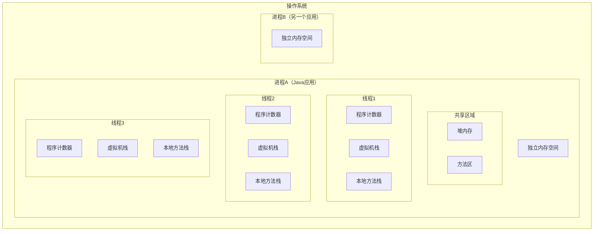

### 1.3 核心区别对比

| 维度 | 进程 | 线程 |
|------|------|------|
| **定义** | 资源分配的最小单位 | CPU 调度的最小单位 |
| **内存** | 拥有独立的内存空间 | 共享进程的堆和方法区 |
| **开销** | 创建/销毁/切换开销大 | 创建/销毁/切换开销小 |
| **通信** | IPC（管道/消息队列/共享内存等） | 直接读写共享变量（需同步） |
| **安全性** | 进程间互不影响 | 一个线程崩溃可能影响整个进程 |
| **独立性** | 有独立的地址空间 | 共享地址空间，有各自的栈和PC |

### 1.4 为什么要用多线程？

1. **充分利用多核 CPU**：单线程只能使用一个 CPU 核心
2. **提高程序响应性**：UI 线程 + 后台工作线程
3. **简化异步编程模型**：比多进程更轻量
4. **提高系统吞吐量**：Web 服务器同时处理多个请求

### 1.5 多线程的挑战

1. **线程安全问题**：共享可变状态需要同步
2. **死锁**：多个线程互相等待
3. **活锁**：线程不断重试但无法推进
4. **性能开销**：上下文切换、锁竞争

---

## 2. 线程创建的 4 种方式

### 2.1 方式一：继承 Thread 类

```java
// 方式1：继承 Thread
public class MyThread extends Thread {
    @Override
    public void run() {
        System.out.println("线程运行: " + Thread.currentThread().getName());
    }
}

// 使用
MyThread t = new MyThread();
t.start(); // 启动线程（不是调用 run！）
```

**特点**：
- 简单直接
- Java 单继承限制，扩展性差
- 线程与任务耦合

### 2.2 方式二：实现 Runnable 接口

```java
// 方式2：实现 Runnable
public class MyRunnable implements Runnable {
    @Override
    public void run() {
        System.out.println("线程运行: " + Thread.currentThread().getName());
    }
}

// 使用
Thread t = new Thread(new MyRunnable());
t.start();

// Lambda 写法（推荐）
Thread t2 = new Thread(() -> {
    System.out.println("Lambda 线程运行");
});
t2.start();
```

**特点**：
- 解耦线程与任务
- 可以继承其他类
- 无返回值

### 2.3 方式三：实现 Callable + FutureTask

```java
// 方式3：Callable + FutureTask（有返回值）
import java.util.concurrent.Callable;
import java.util.concurrent.FutureTask;

public class MyCallable implements Callable<String> {
    @Override
    public String call() throws Exception {
        Thread.sleep(1000);
        return "任务执行结果";
    }
}

// 使用
FutureTask<String> futureTask = new FutureTask<>(new MyCallable());
Thread t = new Thread(futureTask);
t.start();

String result = futureTask.get(); // 阻塞等待结果
System.out.println(result);
```

**特点**：
- 有返回值
- 可以抛出异常
- `get()` 会阻塞直到任务完成

### 2.4 方式四：线程池（推荐）

```java
// 方式4：线程池（生产环境推荐）
import java.util.concurrent.ExecutorService;
import java.util.concurrent.Executors;
import java.util.concurrent.Future;

// 创建线程池（推荐使用 ThreadPoolExecutor 自定义参数）
ExecutorService pool = Executors.newFixedThreadPool(4);

// 提交 Runnable 任务
pool.execute(() -> {
    System.out.println("Runnable 任务");
});

// 提交 Callable 任务
Future<String> future = pool.submit(() -> {
    return "Callable 任务结果";
});
String result = future.get();

pool.shutdown(); // 优雅关闭
```

**特点**：
- 线程复用，减少创建/销毁开销
- 可控制最大并发数
- 提供任务队列缓冲

### 2.5 四种方式对比

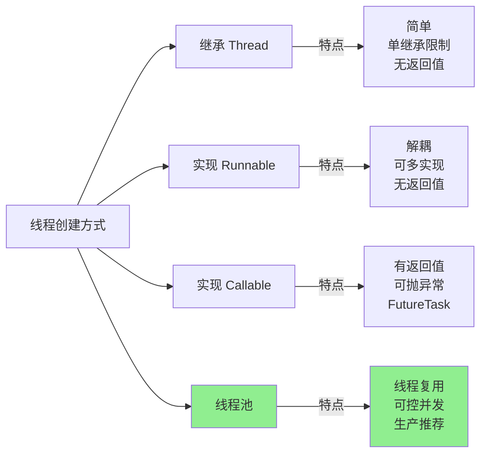

| 特性 | Thread | Runnable | Callable | 线程池 |
|------|--------|----------|----------|--------|
| 实现方式 | 继承 | 实现接口 | 实现接口 | 工厂/构造器 |
| 返回值 | 无 | 无 | 有 | 有（submit） |
| 异常处理 | 不能抛检查异常 | 不能抛检查异常 | 可以抛异常 | 可以抛异常 |
| 线程复用 | 不支持 | 不支持 | 不支持 | 支持 |
| 扩展性 | 单继承限制 | 好 | 好 | 好 |
| 推荐程度 | ❌ 不推荐 | ✅ 简单场景 | ✅ 需要返回值 | ⭐ 生产首选 |

---

## 3. 线程的 6 种状态与生命周期

### 3.1 Java 线程的 6 种状态

Java `Thread.State` 枚举定义了 6 种状态：

| 状态 | 说明 | 进入条件 |
|------|------|---------|
| **NEW** | 新建，尚未启动 | `new Thread()` |
| **RUNNABLE** | 可运行（包含 Ready 和 Running） | `thread.start()` |
| **BLOCKED** | 阻塞，等待获取监视器锁 | 等待进入 `synchronized` 块 |
| **WAITING** | 无限期等待 | `wait()` / `join()` / `LockSupport.park()` |
| **TIMED_WAITING** | 有限期等待 | `sleep(n)` / `wait(n)` / `join(n)` |
| **TERMINATED** | 终止，线程执行完毕 | `run()` 执行完毕或异常退出 |

### 3.2 状态转换图（Mermaid）

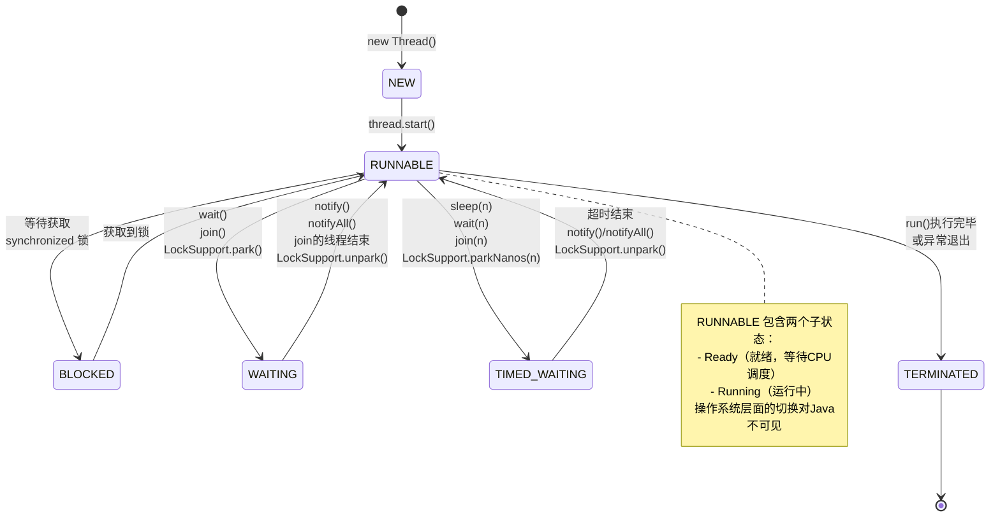

### 3.3 状态转换详解

#### NEW → RUNNABLE

```java
Thread t = new Thread(() -> {});  // NEW
t.start();                         // → RUNNABLE
// 注意：不能对一个线程调用两次 start()，会抛 IllegalThreadStateException
```

#### RUNNABLE → BLOCKED → RUNNABLE

```java
synchronized (lock) {
    // 如果 lock 被其他线程持有
    // 当前线程进入 BLOCKED 状态
    // 获取到锁后回到 RUNNABLE
}
```

#### RUNNABLE → WAITING → RUNNABLE

```java
synchronized (lock) {
    lock.wait();    // → WAITING，释放锁
    // 被 notify()/notifyAll() 唤醒后
    // 重新竞争锁，获取到锁后 → RUNNABLE
}
```

#### RUNNABLE → TIMED_WAITING → RUNNABLE

```java
Thread.sleep(1000);  // → TIMED_WAITING
// 1秒后自动 → RUNNABLE

synchronized (lock) {
    lock.wait(5000);  // → TIMED_WAITING，释放锁
    // 5秒后或被 notify() 唤醒后 → RUNNABLE
}
```

#### RUNNABLE → TERMINATED

```java
// run() 方法正常执行完毕 → TERMINATED
// 或 run() 中抛出未捕获异常 → TERMINATED
```

> **实验代码**：运行 `code/ThreadStateDemo.java` 观察每种状态的实际表现。

---

## 4. 线程的核心方法

### 4.1 start() vs run()

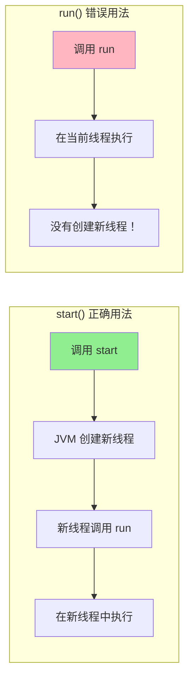

```java
Thread t = new Thread(() -> {
    System.out.println("当前线程: " + Thread.currentThread().getName());
});

t.start(); // 输出: Thread-0（新线程）
t.run();   // 输出: main（当前线程，没有创建新线程！）
```

**核心区别**：
- `start()`：启动新线程，由新线程调用 `run()`
- `run()`：普通方法调用，在当前线程执行

### 4.2 sleep(long millis)

```java
// 让当前线程暂停指定毫秒数
Thread.sleep(1000); // 暂停 1 秒
```

**关键特性**：
- **不释放锁**：持有的 synchronized 锁不会释放
- **可被中断**：抛出 `InterruptedException`
- **状态变化**：RUNNABLE → TIMED_WAITING → RUNNABLE
- **精度问题**：实际睡眠时间可能略大于指定时间

```java
synchronized (lock) {
    Thread.sleep(1000); // 持有锁不释放！其他线程仍然阻塞
}
```

### 4.3 yield()

```java
// 提示调度器当前线程愿意让出CPU
Thread.yield();
```

**关键特性**：
- **仅提示**：调度器可以忽略这个提示
- **不释放锁**：不影响锁的持有
- **状态不变**：仍然是 RUNNABLE
- **实际用途**：极少使用，一般用于测试或调试

### 4.4 join()

```java
Thread t = new Thread(() -> {
    // 耗时操作
    try { Thread.sleep(2000); } catch (InterruptedException e) {}
    System.out.println("子线程完成");
});

t.start();
t.join();       // 主线程等待 t 执行完毕（无超时）
t.join(5000);   // 最多等待 5 秒
System.out.println("主线程继续"); // 等 t 结束后才执行
```

**关键特性**：
- **阻塞当前线程**：直到目标线程执行完毕
- **可设超时**：`join(long millis)`
- **状态变化**：调用者进入 WAITING 或 TIMED_WAITING

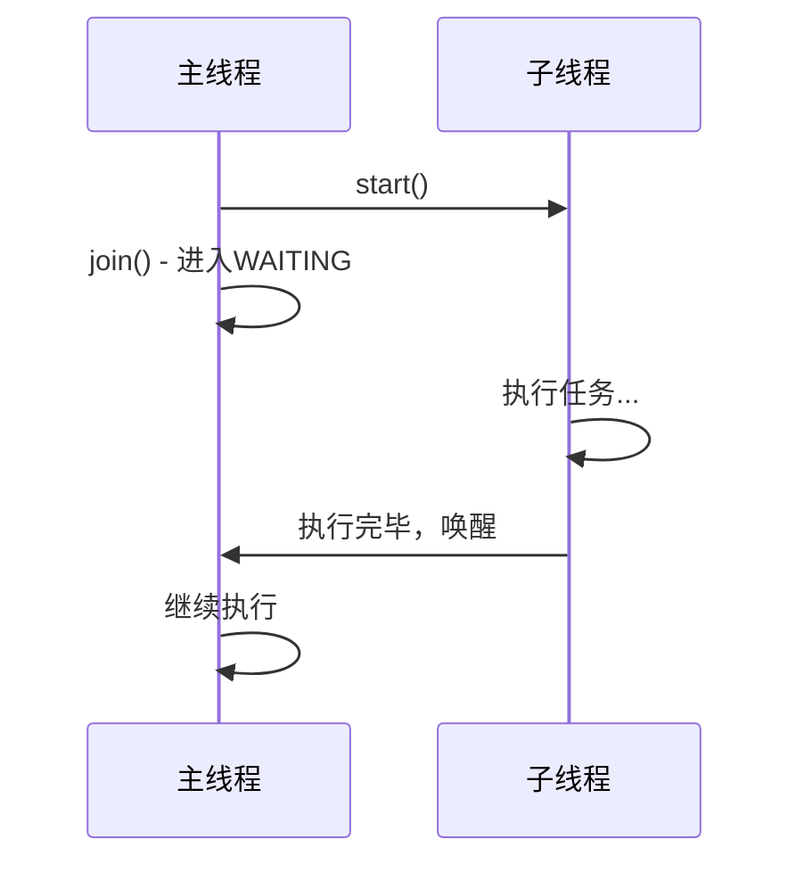

### 4.5 interrupt() —— 中断机制

Java 的中断是一种**协作机制**，不是强制停止线程。

```java
Thread t = new Thread(() -> {
    while (!Thread.currentThread().isInterrupted()) {
        try {
            System.out.println("工作中...");
            Thread.sleep(500);
        } catch (InterruptedException e) {
            System.out.println("收到中断信号，清理资源...");
            // sleep/wait/join 被中断时会清除中断标志
            // 需要重新设置或直接退出
            Thread.currentThread().interrupt(); // 重新设置中断标志
            break;
        }
    }
    System.out.println("线程安全退出");
});

t.start();
Thread.sleep(2000);
t.interrupt(); // 发送中断信号
```

**三个关键方法**：

| 方法 | 说明 |
|------|------|
| `t.interrupt()` | 设置目标线程的中断标志 |
| `t.isInterrupted()` | 检查目标线程的中断标志（不清除） |
| `Thread.interrupted()` | 检查当前线程的中断标志（清除标志） |

**中断的响应规则**：
- 如果线程正在 `sleep/wait/join`，抛出 `InterruptedException`，**同时清除中断标志**
- 如果线程正在运行，仅设置中断标志，需要线程自己检查

> ⚠️ **不要使用已废弃的方法**：`stop()`、`suspend()`、`resume()` 都已废弃，可能导致数据不一致。

### 4.6 方法对比总结

| 方法 | 是否释放锁 | 状态变化 | 抛异常 | 用途 |
|------|-----------|---------|--------|------|
| `start()` | - | NEW→RUNNABLE | - | 启动线程 |
| `run()` | - | 不变（当前线程执行） | - | 普通方法 |
| `sleep(n)` | ❌ 不释放 | →TIMED_WAITING | `InterruptedException` | 暂停执行 |
| `yield()` | ❌ 不释放 | 不变 | - | 让出CPU |
| `join()` | ❌ 不释放 | →WAITING | `InterruptedException` | 等待线程完成 |
| `wait()` | ✅ **释放** | →WAITING | `InterruptedException` | 条件等待 |
| `notify()` | ❌ 不释放 | - | - | 唤醒一个等待线程 |
| `interrupt()` | - | - | - | 发送中断信号 |

> **重点记忆**：`sleep` 不释放锁，`wait` 释放锁！这是面试高频考点。

---

## 5. synchronized 深入原理

### 5.1 synchronized 的三种用法

```java
public class SyncDemo {

    // 用法1：修饰实例方法（锁是 this 对象）
    public synchronized void instanceMethod() {
        // ...
    }

    // 用法2：修饰静态方法（锁是 Class 对象）
    public static synchronized void staticMethod() {
        // ...
    }

    // 用法3：修饰代码块（锁是指定对象）
    public void blockMethod() {
        synchronized (this) {      // 对象锁
            // ...
        }
        synchronized (SyncDemo.class) { // 类锁
            // ...
        }
    }
}
```

### 5.2 对象头 Mark Word

Java 对象在内存中的布局：

```
┌────────────────────────────────────────────────────────┐
│                    对象头（Header）                       │
├──────────────────────┬─────────────────────────────────┤
│    Mark Word         │    类型指针（Klass Pointer）       │
│   （8 字节/64位）     │   （4/8 字节，开启压缩为4字节）     │
├──────────────────────┴─────────────────────────────────┤
│                 实例数据（Instance Data）                 │
├────────────────────────────────────────────────────────┤
│                 对齐填充（Padding）                       │
└────────────────────────────────────────────────────────┘
```

**64 位 JVM 的 Mark Word 结构**：

```
┌─────────────────────────────────────────────────────────────────────┐
│                        Mark Word (64 bits)                          │
├────────────┬───────────┬──────┬───────┬──────────┬─────────────────┤
│ 锁状态      │ 25 bits   │4 bits│1 bit  │ 2 bits   │ 说明            │
├────────────┼───────────┼──────┼───────┼──────────┼─────────────────┤
│ 无锁        │ hashcode  │ age  │ 0     │ 01       │ 正常对象         │
│ 偏向锁      │ threadId  │ age  │ 1     │ 01       │ 偏向线程ID       │
│ 轻量级锁    │ 指向栈中锁记录的指针          │ 00       │ CAS 竞争        │
│ 重量级锁    │ 指向 Monitor 的指针           │ 10       │ 激烈竞争         │
│ GC 标记     │ 空                           │ 11       │ GC 使用         │
└────────────┴──────────────────────────────┴──────────┴─────────────┘
```

### 5.3 Monitor 机制

每个 Java 对象都关联一个 Monitor（监视器），也叫管程。

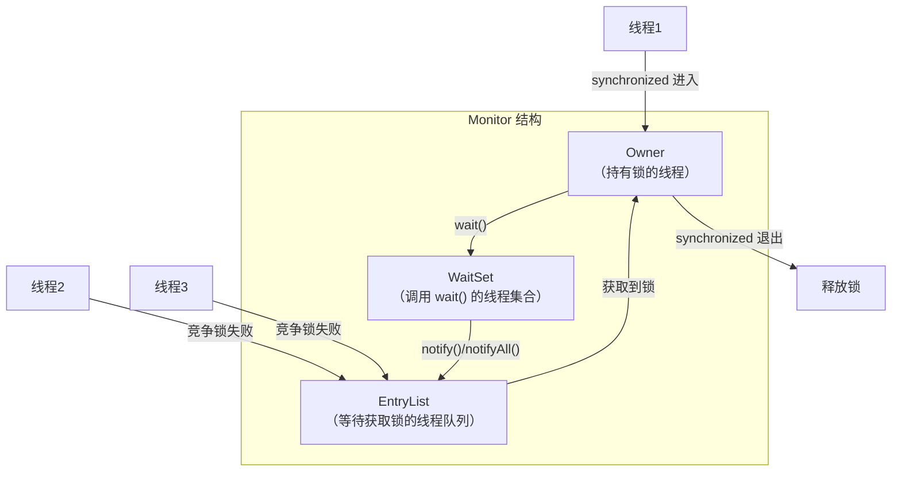

**Monitor 的工作流程**：
1. 线程进入 `synchronized`，尝试获取 Monitor 的 Owner
2. 如果 Owner 为空，当前线程成为 Owner
3. 如果 Owner 不为空，当前线程进入 EntryList 等待（BLOCKED）
4. Owner 线程调用 `wait()`，进入 WaitSet（WAITING），释放锁
5. 其他线程调用 `notify()`，从 WaitSet 中选一个线程移到 EntryList
6. Owner 线程退出 `synchronized`，从 EntryList 中选一个线程成为新 Owner

### 5.4 锁升级过程（无锁 → 偏向锁 → 轻量级锁 → 重量级锁）

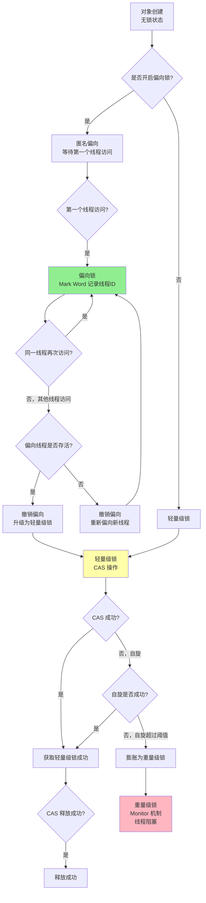

#### 各锁级别详解

**① 偏向锁（Biased Locking）**
- **适用场景**：只有一个线程访问同步块
- **原理**：在 Mark Word 中记录线程 ID，下次同一线程进入时无需 CAS
- **优势**：几乎无额外开销
- **撤销条件**：其他线程尝试竞争

```
偏向锁的"偏"：偏心于第一个获取它的线程
只要没有竞争，持有偏向锁的线程就永远不需要同步
```

**② 轻量级锁（Lightweight Lock）**
- **适用场景**：线程交替执行同步块（无实际竞争）
- **原理**：CAS 将 Mark Word 复制到线程栈帧的 Lock Record
- **优势**：避免了操作系统级别的互斥量
- **升级条件**：CAS 自旋超过阈值

```
轻量级锁的设计基于经验：
大部分同步块不存在竞争，用 CAS 替代互斥量可以大幅提升性能
```

**③ 重量级锁（Heavyweight Lock）**
- **适用场景**：多线程激烈竞争
- **原理**：使用操作系统的 Mutex Lock（互斥量）
- **代价**：线程阻塞和唤醒需要操作系统介入（用户态↔内核态切换）

#### 锁升级总结

| 锁状态 | 适用场景 | 优点 | 缺点 | Mark Word |
|--------|---------|------|------|-----------|
| 无锁 | 无竞争 | 无开销 | - | hashcode/age/01 |
| 偏向锁 | 单线程访问 | 无 CAS 开销 | 撤销需暂停线程 | threadId/age/01 |
| 轻量级锁 | 交替访问 | 自旋避免阻塞 | 自旋消耗 CPU | Lock Record 指针/00 |
| 重量级锁 | 激烈竞争 | 不消耗 CPU 自旋 | 阻塞/唤醒开销大 | Monitor 指针/10 |

> ⚠️ **锁只能升级，不能降级**（JDK 官方实现）

> **实验代码**：运行 `code/SynchronizedDemo.java` 观察各种锁行为。

---

## 6. volatile 深入原理

### 6.1 volatile 的两大特性

volatile 保证了两个特性：

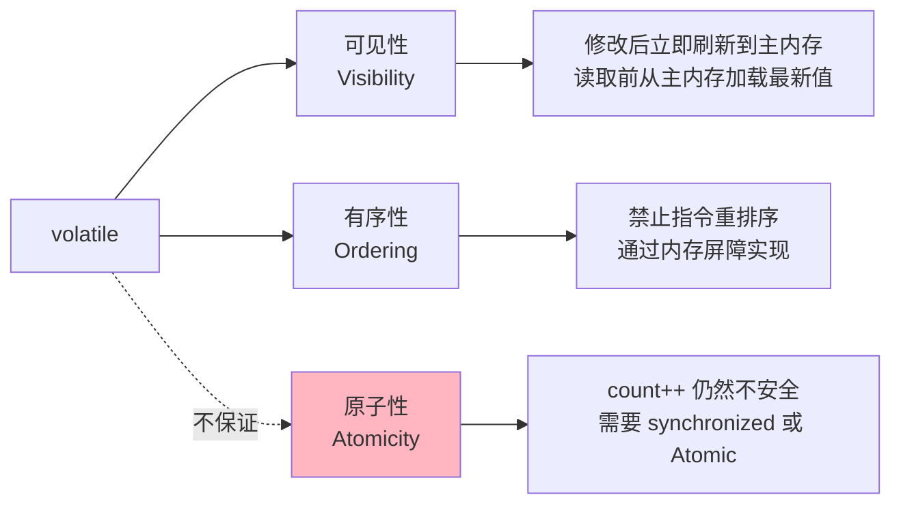

### 6.2 可见性原理

**问题**：每个线程有自己的工作内存（CPU 缓存），共享变量的修改对其他线程不可见。

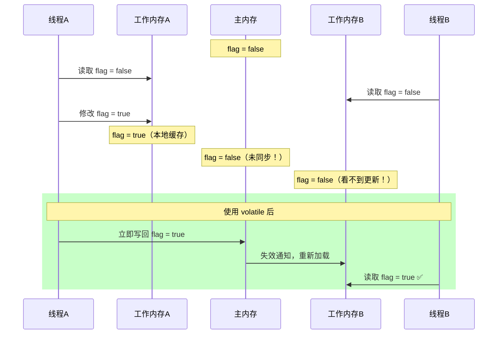

**volatile 可见性的实现**：
1. 写 volatile 变量时：强制将工作内存的值刷新到主内存
2. 读 volatile 变量时：强制从主内存重新加载

### 6.3 有序性与内存屏障

**指令重排序**：编译器和处理器为了优化性能，可能改变指令的执行顺序。

```java
// 源代码顺序
int a = 1;     // 语句1
int b = 2;     // 语句2
int c = a + b; // 语句3

// 可能被重排为：
int b = 2;     // 语句2
int a = 1;     // 语句1
int c = a + b; // 语句3
// 语句1和语句2没有数据依赖，可以重排
// 语句3依赖语句1和2，不会被重排到它们前面
```

**volatile 通过内存屏障（Memory Barrier）禁止重排序**：

| 屏障类型 | 说明 | 作用 |
|---------|------|------|
| LoadLoad | Load1; LoadLoad; Load2 | 确保 Load1 先于 Load2 加载 |
| StoreStore | Store1; StoreStore; Store2 | 确保 Store1 先于 Store2 写入 |
| LoadStore | Load1; LoadStore; Store2 | 确保 Load1 先于 Store2 写入 |
| StoreLoad | Store1; StoreLoad; Load2 | 确保 Store1 写入对 Load2 可见 |

**volatile 的内存屏障插入策略**：

```
volatile 写操作前：StoreStore 屏障
volatile 写操作后：StoreLoad 屏障

volatile 读操作后：LoadLoad 屏障
volatile 读操作后：LoadStore 屏障
```

```
// 具体示例
StoreStore 屏障
----- volatile flag = true; -----  // volatile 写
StoreLoad 屏障

----- volatile读 flag -----        // volatile 读
LoadLoad 屏障
LoadStore 屏障
```

### 6.4 MESI 缓存一致性协议

MESI 是 CPU 缓存一致性协议，volatile 的底层依赖它来实现。

**MESI 的 4 种状态**：

| 状态 | 全称 | 说明 |
|------|------|------|
| **M** (Modified) | 已修改 | 缓存行被修改，与主内存不一致，需要写回 |
| **E** (Exclusive) | 独占 | 缓存行只在当前 CPU 缓存中，与主内存一致 |
| **S** (Shared) | 共享 | 缓存行在多个 CPU 缓存中存在，与主内存一致 |
| **I** (Invalid) | 无效 | 缓存行已失效，需要从主内存重新加载 |

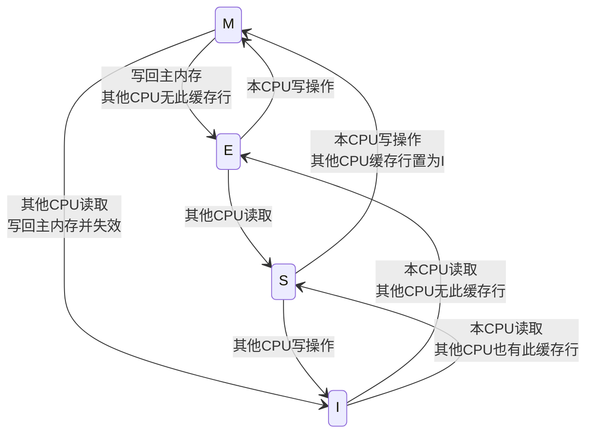

**volatile 变量的写操作会触发**：
1. 当前 CPU 缓存行状态变为 Modified
2. 通过总线嗅探（Bus Snooping）通知其他 CPU
3. 其他 CPU 的缓存行状态变为 Invalid
4. 其他 CPU 下次读取时，从主内存重新加载

### 6.5 volatile 的典型使用场景

**✅ 适合使用 volatile 的场景**：
1. **状态标志**：如停机标志 `volatile boolean stopped = false;`
2. **一次性安全发布**：如 DCL 单例模式
3. **开销较低的读写锁策略**：读操作多、写操作少

**❌ 不适合使用 volatile 的场景**：
1. 需要原子性操作的场景（如 `count++`）
2. 需要复合操作的场景（如 check-then-act）

> **实验代码**：运行 `code/VolatileDemo.java` 验证可见性和非原子性。

---

## 7. Java 内存模型 JMM

### 7.1 什么是 JMM？

**Java Memory Model（Java 内存模型）** 是 Java 规范中定义的一组规则，规定了多线程程序中共享变量的访问方式。

> **核心目的**：在不同硬件平台上，提供一致的内存可见性保证。

### 7.2 主内存与工作内存

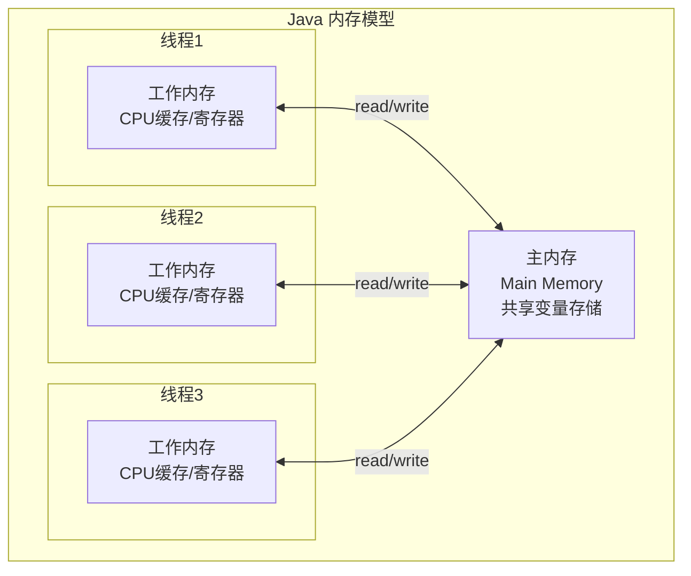

**规则**：
- 所有共享变量存储在**主内存**
- 每个线程有自己的**工作内存**（主内存的副本）
- 线程对变量的操作必须在工作内存中进行，不能直接操作主内存
- 不同线程不能直接访问对方的工作内存

### 7.3 JMM 的 8 种内存操作

| 操作 | 作用位置 | 说明 |
|------|---------|------|
| `lock` | 主内存 | 标识变量为线程独占 |
| `unlock` | 主内存 | 释放变量的锁定状态 |
| `read` | 主内存 | 将变量值传输到工作内存 |
| `load` | 工作内存 | 将 read 的值放入工作内存副本 |
| `use` | 工作内存 | 将工作内存的值传给执行引擎 |
| `assign` | 工作内存 | 将执行引擎的值赋给工作内存变量 |
| `store` | 工作内存 | 将工作内存的值传输到主内存 |
| `write` | 主内存 | 将 store 的值写入主内存变量 |

### 7.4 happens-before 规则

**happens-before** 是 JMM 提供的可见性保证规则。如果操作 A happens-before 操作 B，那么 A 的结果对 B 可见。

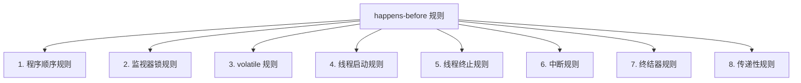

**8 条 happens-before 规则详解**：

| # | 规则 | 说明 | 示例 |
|---|------|------|------|
| 1 | **程序顺序规则** | 同一线程中，前面的操作 happens-before 后面的操作 | `a=1` hb `b=a+1` |
| 2 | **监视器锁规则** | `unlock` 操作 happens-before 后续的 `lock` 操作 | 线程A释放锁 hb 线程B获取同一把锁 |
| 3 | **volatile 规则** | volatile 写 happens-before 后续的 volatile 读 | `volatile flag=true` hb 后续读 `flag` |
| 4 | **线程启动规则** | `start()` happens-before 被启动线程的每一个操作 | 主线程设置变量 hb 子线程读取 |
| 5 | **线程终止规则** | 线程所有操作 happens-before 其他线程检测到它终止 | 子线程修改变量 hb 主线程 `join()` 返回后读取 |
| 6 | **中断规则** | `interrupt()` happens-before 被中断线程检测到中断 | `t.interrupt()` hb `t.isInterrupted()` |
| 7 | **终结器规则** | 构造函数 happens-before `finalize()` | 对象初始化 hb 对象回收 |
| 8 | **传递性** | 如果 A hb B，B hb C，则 A hb C | 组合规则推导 |

**实际应用示例**：

```java
// 利用 volatile 规则 + 传递性 保证可见性
int a = 0;               // 语句1
volatile boolean flag = false;

// 线程A
a = 42;                   // 语句2
flag = true;              // 语句3（volatile 写）

// 线程B
if (flag) {               // 语句4（volatile 读）
    int b = a;            // 语句5，b 一定等于 42
}

// 推导：
// 语句2 hb 语句3（程序顺序规则）
// 语句3 hb 语句4（volatile 规则）
// 语句4 hb 语句5（程序顺序规则）
// 所以：语句2 hb 语句5（传递性）→ a=42 对语句5可见
```

---

## 8. ThreadLocal 原理与使用

### 8.1 什么是 ThreadLocal？

ThreadLocal 提供**线程局部变量**，每个线程都有自己独立的副本，互不干扰。

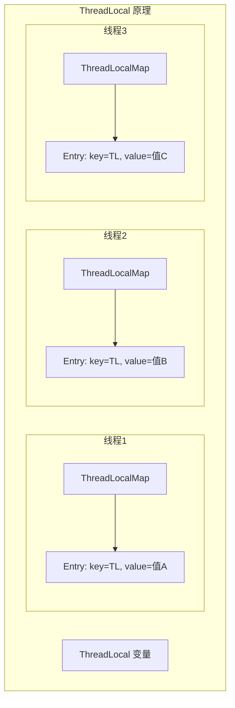

### 8.2 ThreadLocal 的核心 API

```java
// 创建 ThreadLocal
ThreadLocal<String> threadLocal = new ThreadLocal<>();

// 推荐：使用 withInitial 设置默认值
ThreadLocal<SimpleDateFormat> dateFormat =
    ThreadLocal.withInitial(() -> new SimpleDateFormat("yyyy-MM-dd"));

// 核心方法
threadLocal.set("value");           // 设置当前线程的值
String value = threadLocal.get();   // 获取当前线程的值
threadLocal.remove();               // 移除当前线程的值（重要！）
```

### 8.3 ThreadLocalMap 内部结构

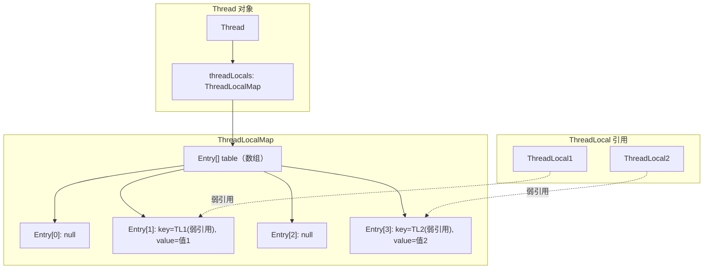

**关键实现细节**：
- 每个 Thread 对象内部有一个 `ThreadLocalMap` 字段
- `ThreadLocalMap` 是一个定制的 HashMap（开放寻址法，非链表法）
- Entry 的 key 是 **ThreadLocal 的弱引用**
- Entry 的 value 是 **强引用**

### 8.4 内存泄漏问题

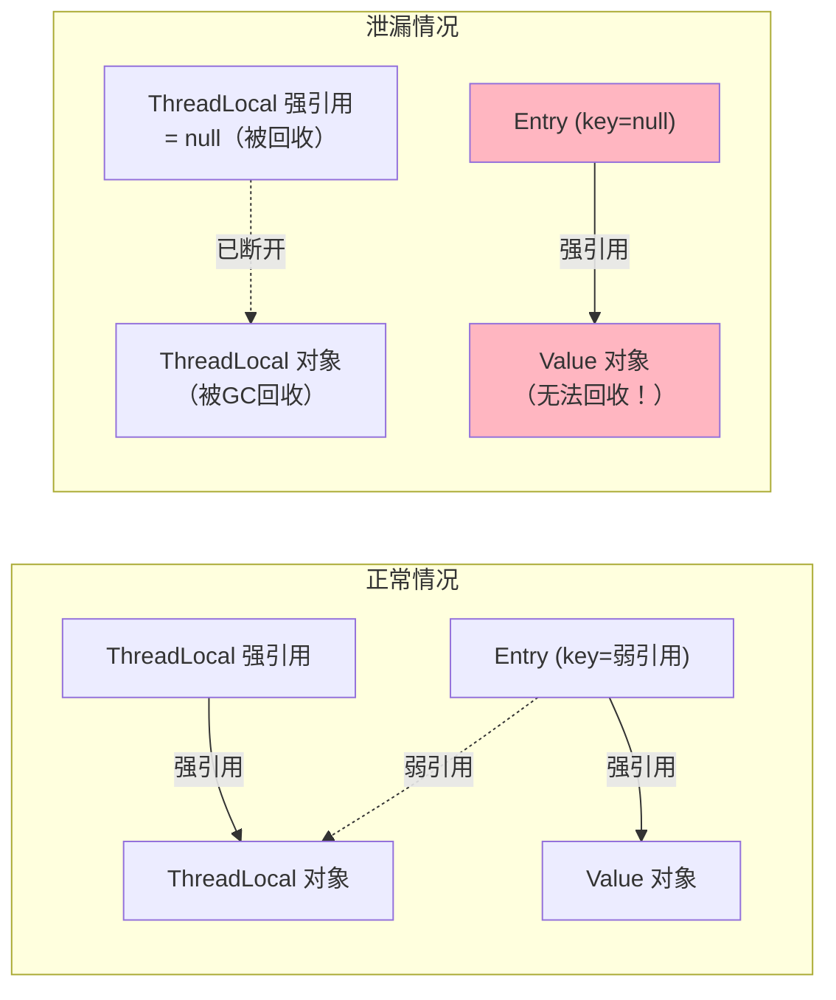

**内存泄漏的原因**：
1. ThreadLocal 对象被 GC 回收（弱引用）
2. Entry 的 key 变成 null
3. 但 Entry 的 value 仍然被强引用，无法回收
4. 如果线程长期存活（如线程池），这些 value 会一直占用内存

**解决方案**：

```java
// ✅ 最佳实践：始终在 finally 中调用 remove()
try {
    threadLocal.set(value);
    // 使用 threadLocal
} finally {
    threadLocal.remove(); // 必须清理！
}
```

### 8.5 ThreadLocal 的典型使用场景

| 场景 | 说明 | 示例 |
|------|------|------|
| **数据库连接** | 每个线程独立的 Connection | Spring 的事务管理 |
| **用户上下文** | 请求级别的用户信息传递 | Web 框架的 SecurityContext |
| **日期格式化** | SimpleDateFormat 线程不安全 | 每线程独立实例 |
| **事务管理** | 保证同一线程使用同一事务 | Spring @Transactional |
| **链路追踪** | 传递 traceId 等上下文信息 | SLF4J MDC |

### 8.6 最佳实践

```java
// 1. 声明为 private static final
private static final ThreadLocal<User> currentUser = new ThreadLocal<>();

// 2. 使用 withInitial 设置默认值
private static final ThreadLocal<DateFormat> dateFormat =
    ThreadLocal.withInitial(() -> new SimpleDateFormat("yyyy-MM-dd"));

// 3. 始终在 finally 中 remove
public void handleRequest(User user) {
    try {
        currentUser.set(user);
        // 业务逻辑...
    } finally {
        currentUser.remove();
    }
}

// 4. 在线程池环境中尤其注意清理
executorService.submit(() -> {
    try {
        currentUser.set(user);
        // ...
    } finally {
        currentUser.remove(); // 线程池线程会被复用！
    }
});
```

> **实验代码**：运行 `code/ThreadLocalDemo.java` 观察线程隔离和内存泄漏问题。

---

## 9. 线程安全的实现方式

### 9.1 什么是线程安全？

> 当多个线程同时访问一个对象时，不需要额外的同步或协调，调用该对象的行为都能获得正确的结果，那这个对象就是线程安全的。  
> —— Brian Goerta《Java Concurrency in Practice》

### 9.2 三种实现方式

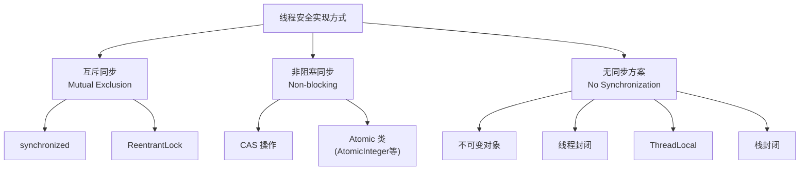

### 9.3 互斥同步（悲观锁）

**思想**：先加锁，再操作，操作完释放锁。假设会发生冲突。

#### synchronized

```java
// 最基本的互斥同步
private int count = 0;

public synchronized void increment() {
    count++;
}
```

#### ReentrantLock

```java
private final ReentrantLock lock = new ReentrantLock();
private int count = 0;

public void increment() {
    lock.lock();
    try {
        count++;
    } finally {
        lock.unlock(); // 必须在 finally 中释放
    }
}
```

**synchronized vs ReentrantLock**：

| 特性 | synchronized | ReentrantLock |
|------|-------------|---------------|
| 实现 | JVM 内置 | JDK API |
| 释放锁 | 自动释放 | 必须手动 unlock |
| 可中断 | 不可中断 | `lockInterruptibly()` |
| 公平锁 | 非公平 | 可选公平/非公平 |
| 条件变量 | 一个（wait/notify） | 多个 Condition |
| 性能 | JDK 6 后优化接近 | 高竞争场景略好 |
| 推荐 | 优先使用 | 需要高级功能时 |

### 9.4 非阻塞同步（乐观锁）

**思想**：先操作，如果检测到冲突再重试。假设不会发生冲突。

#### CAS（Compare And Swap）

```java
// CAS 操作的伪代码
boolean compareAndSwap(V expectedValue, V newValue) {
    if (当前值 == expectedValue) {
        当前值 = newValue;
        return true;  // 更新成功
    }
    return false;     // 更新失败，有其他线程修改了
}
```

#### AtomicInteger 示例

```java
import java.util.concurrent.atomic.AtomicInteger;

AtomicInteger count = new AtomicInteger(0);

// 原子自增
count.incrementAndGet();  // ++count
count.getAndIncrement();  // count++

// CAS 操作
count.compareAndSet(期望值, 新值);
```

**CAS 的 ABA 问题**：
1. 线程1读取值为 A
2. 线程2将 A 改为 B，再改回 A
3. 线程1 CAS 检查仍然是 A，认为没有变化

**解决方案**：`AtomicStampedReference`（带版本号）

### 9.5 无同步方案

#### 不可变对象

```java
// final 类，所有字段 final，无 setter
public final class ImmutablePoint {
    private final int x;
    private final int y;

    public ImmutablePoint(int x, int y) {
        this.x = x;
        this.y = y;
    }
    // 只有 getter，没有 setter
}
```

#### 线程封闭

```java
// 栈封闭：局部变量天然线程安全
public void process() {
    int localVar = 0; // 栈上变量，线程私有
    List<String> localList = new ArrayList<>(); // 不逃逸出方法
    // ...
}

// ThreadLocal 封闭
private static ThreadLocal<Connection> connHolder = new ThreadLocal<>();
```

---

## 10. 死锁的 4 个条件与排查方法

### 10.1 什么是死锁？

死锁是指两个或多个线程互相持有对方需要的锁，导致所有线程都无法继续执行。

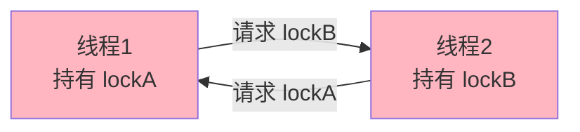

### 10.2 死锁的 4 个必要条件

| # | 条件 | 说明 | 如何破坏 |
|---|------|------|---------|
| 1 | **互斥条件** | 资源一次只能被一个线程占用 | 使用无锁数据结构（难破坏） |
| 2 | **持有并等待** | 持有资源的同时等待其他资源 | 一次性请求所有资源 |
| 3 | **不可剥夺** | 已获取的资源不能被强制剥夺 | 使用 tryLock 超时放弃 |
| 4 | **循环等待** | 线程之间形成环形等待链 | 按固定顺序获取锁 |

> **打破任一条件即可避免死锁**。实践中最常用：**统一锁的获取顺序**（破坏循环等待）。

### 10.3 死锁代码示例

```java
// ❌ 死锁代码
final Object lockA = new Object();
final Object lockB = new Object();

// 线程1：先获取 lockA，再获取 lockB
new Thread(() -> {
    synchronized (lockA) {
        Thread.sleep(100);
        synchronized (lockB) { /* ... */ }
    }
}).start();

// 线程2：先获取 lockB，再获取 lockA（顺序相反！）
new Thread(() -> {
    synchronized (lockB) {
        Thread.sleep(100);
        synchronized (lockA) { /* ... */ }
    }
}).start();
```

```java
// ✅ 修复：统一锁的获取顺序
// 线程1和线程2都先获取 lockA，再获取 lockB
new Thread(() -> {
    synchronized (lockA) {
        Thread.sleep(100);
        synchronized (lockB) { /* ... */ }
    }
}).start();

new Thread(() -> {
    synchronized (lockA) { // 改为先获取 lockA
        Thread.sleep(100);
        synchronized (lockB) { /* ... */ }
    }
}).start();
```

### 10.4 死锁的排查方法

#### 方法1：jstack

```bash
# 获取进程 ID
jps

# 导出线程栈
jstack <pid>

# 在输出中搜索
# "Found one Java-level deadlock:"
```

**jstack 输出示例**：

```
Found one Java-level deadlock:
=============================
"deadlock-thread-2":
  waiting to lock monitor 0x00007f8b4c003f08 (object 0x00000000d5e00000, a java.lang.Object),
  which is held by "deadlock-thread-1"
"deadlock-thread-1":
  waiting to lock monitor 0x00007f8b4c004028 (object 0x00000000d5e00010, a java.lang.Object),
  which is held by "deadlock-thread-2"
```

#### 方法2：jconsole / VisualVM

1. 打开 jconsole / VisualVM
2. 连接到目标 Java 进程
3. 切换到"线程"选项卡
4. 点击"检测死锁"按钮

#### 方法3：代码中检测

```java
import java.lang.management.ManagementFactory;
import java.lang.management.ThreadMXBean;

ThreadMXBean mxBean = ManagementFactory.getThreadMXBean();
long[] deadlockedThreads = mxBean.findDeadlockedThreads();
if (deadlockedThreads != null) {
    System.out.println("检测到死锁！涉及 " + deadlockedThreads.length + " 个线程");
}
```

### 10.5 避免死锁的最佳实践

1. **统一锁的获取顺序**：所有线程按相同顺序获取锁
2. **使用 tryLock 超时**：`lock.tryLock(timeout, TimeUnit.SECONDS)`
3. **减小锁的粒度**：只锁必要的代码段
4. **避免嵌套锁**：尽量不在持有一个锁的情况下获取另一个锁
5. **使用并发工具类**：优先使用 `java.util.concurrent` 包

> **实验代码**：运行 `code/SynchronizedDemo.java` 的死锁实验，配合 `jstack` 排查。

---

## 11. 面试高频问题

### Q1：进程和线程的区别？

**答**：进程是操作系统资源分配的最小单位，线程是 CPU 调度的最小单位。一个进程可以包含多个线程，同一进程的线程共享堆和方法区，各自拥有独立的程序计数器、虚拟机栈和本地方法栈。线程更轻量，创建和切换开销更小。

### Q2：创建线程有几种方式？

**答**：主要有 4 种：
1. **继承 Thread 类**：重写 run()，简单但受单继承限制
2. **实现 Runnable 接口**：解耦任务和线程，更灵活
3. **实现 Callable 接口 + FutureTask**：有返回值，可抛异常
4. **线程池**：生产环境推荐，线程复用，可控并发数

本质上只有一种方式：`new Thread().start()`，其他都是通过不同方式提供 `run()` 方法的实现。

### Q3：线程的 6 种状态是什么？

**答**：
- **NEW**：创建后未启动
- **RUNNABLE**：可运行（包含就绪和运行）
- **BLOCKED**：等待获取 synchronized 锁
- **WAITING**：无限期等待（wait/join/park）
- **TIMED_WAITING**：有限期等待（sleep/wait(n)/join(n)）
- **TERMINATED**：执行完毕

### Q4：sleep() 和 wait() 的区别？

**答**：

| 维度 | sleep() | wait() |
|------|---------|--------|
| 所属类 | Thread | Object |
| 释放锁 | **不释放** | **释放** |
| 使用条件 | 任何地方 | 必须在 synchronized 中 |
| 唤醒方式 | 超时自动唤醒 | notify()/notifyAll() |
| 用途 | 暂停执行 | 线程间通信 |

### Q5：synchronized 的锁升级过程？

**答**：
1. **无锁**：对象刚创建，没有线程访问同步块
2. **偏向锁**：只有一个线程反复进入，Mark Word 记录线程 ID，无需 CAS
3. **轻量级锁**：多个线程交替进入（无竞争），使用 CAS + 自旋
4. **重量级锁**：多个线程同时竞争，使用 OS 的 Mutex，线程阻塞

锁只能升级不能降级。JDK 15 之后默认关闭偏向锁。

### Q6：volatile 能保证线程安全吗？

**答**：volatile 只保证**可见性**和**有序性**，不保证**原子性**。例如 `volatile int count; count++` 仍然不是线程安全的，因为 `count++` 是读-改-写三步操作。如果只是读写（不是复合操作），volatile 可以保证线程安全。

### Q7：什么是 happens-before？

**答**：happens-before 是 JMM 定义的偏序关系，规定了哪些操作的结果对其他操作可见。主要规则包括：程序顺序规则、监视器锁规则、volatile 规则、线程启动/终止规则、传递性规则。它不要求操作的执行顺序，只要求结果的可见性。

### Q8：ThreadLocal 会导致内存泄漏吗？怎么避免？

**答**：会。ThreadLocalMap 的 Entry 中，key 是 ThreadLocal 的弱引用，value 是强引用。当 ThreadLocal 被 GC 回收后，key 变为 null，但 value 仍被强引用，无法回收。特别是在线程池环境中，线程长期存活，泄漏的 value 会越积越多。

**避免方法**：使用完后在 `finally` 中调用 `threadLocal.remove()`。

### Q9：什么是死锁？如何排查？

**答**：死锁是两个或多个线程互相持有对方需要的资源，导致永远等待。四个必要条件：互斥、持有并等待、不可剥夺、循环等待。排查方法：
- `jstack <pid>`：查看线程栈，搜索 "Found one Java-level deadlock"
- jconsole / VisualVM：图形化检测死锁
- 代码中使用 `ThreadMXBean.findDeadlockedThreads()`

### Q10：synchronized 和 ReentrantLock 的区别？

**答**：
1. synchronized 是 JVM 关键字，ReentrantLock 是 JDK API 类
2. synchronized 自动释放锁，ReentrantLock 需手动 unlock
3. ReentrantLock 支持可中断、超时获取、公平锁
4. ReentrantLock 支持多个 Condition
5. synchronized 在 JDK 6 后做了大量优化（锁升级），性能接近

优先使用 synchronized（简洁安全），需要高级特性时再用 ReentrantLock。

### Q11：如何保证线程安全？

**答**：三种方式：
1. **互斥同步**（悲观锁）：synchronized、ReentrantLock
2. **非阻塞同步**（乐观锁）：CAS、AtomicInteger 等原子类
3. **无同步方案**：不可变对象（final）、线程封闭（ThreadLocal、栈变量）

### Q12：volatile 和 synchronized 的区别？

**答**：

| 维度 | volatile | synchronized |
|------|----------|-------------|
| 作用 | 变量级别 | 方法/代码块级别 |
| 可见性 | ✅ 保证 | ✅ 保证 |
| 有序性 | ✅ 保证 | ✅ 保证 |
| 原子性 | ❌ 不保证 | ✅ 保证 |
| 阻塞 | 不会阻塞 | 可能阻塞 |
| 编译优化 | 禁止重排序 | - |
| 性能 | 更轻量 | 相对重 |

---

## 12. 学习检查清单

### 12.1 知识点自测

完成学习后，检查以下知识点是否掌握：

- [ ] 能说清进程和线程的区别（至少 3 个维度）
- [ ] 能写出 4 种创建线程的方式，并说明各自优缺点
- [ ] 能画出线程的 6 种状态转换图
- [ ] 能说清 `sleep` 和 `wait` 的 5 个区别
- [ ] 能说清 `start` 和 `run` 的区别
- [ ] 能解释 synchronized 的锁升级过程（4 个级别）
- [ ] 能解释 volatile 的可见性和有序性原理
- [ ] 能说清 volatile 为什么不保证原子性
- [ ] 能解释 JMM 的主内存/工作内存模型
- [ ] 能说出至少 4 条 happens-before 规则
- [ ] 能解释 ThreadLocal 的内存泄漏原因和解决方法
- [ ] 能说出死锁的 4 个必要条件
- [ ] 能用 jstack 排查死锁
- [ ] 能写出生产者消费者的两种实现

### 12.2 实验验收

- [ ] 运行 `ThreadStateDemo.java`，观察到所有 6 种状态
- [ ] 运行 `SynchronizedDemo.java`，理解锁机制和死锁
- [ ] 运行 `VolatileDemo.java`，理解可见性和非原子性
- [ ] 运行 `ProducerConsumerDemo.java`，理解 wait/notify 和 BlockingQueue
- [ ] 运行 `ThreadLocalDemo.java`，理解线程隔离和内存泄漏

---

> **下一步**：完成实验后，在 `02-学习笔记.md` 中记录你的理解和思考。
