# CAS 与 AQS 原理详解

> **Day05 核心课件** | 预计阅读时间：150-200 分钟  
> **前置知识**：Java 多线程基础、synchronized 关键字、volatile 关键字、Java 内存模型（JMM）  
> **学习目标**：深入理解 CAS 原子操作原理，掌握 AQS 框架设计与源码分析，能手撕 AQS 核心流程

---

## 目录

1. [CAS 原理（Compare And Swap）](#1-cas-原理compare-and-swap)
2. [CAS 的三大问题](#2-cas-的三大问题)
3. [Atomic 原子类家族](#3-atomic-原子类家族)
4. [LongAdder 与 LongAccumulator](#4-longadder-与-longaccumulator)
5. [AQS 原理（AbstractQueuedSynchronizer）](#5-aqs-原理abstractqueuedsynchronizer)
6. [ReentrantLock 源码分析](#6-reentrantlock-源码分析)
7. [ReentrantReadWriteLock 原理](#7-reentrantreadwritelock-原理)
8. [CountDownLatch / Semaphore / CyclicBarrier](#8-countdownlatch--semaphore--cyclicbarrier)
9. [StampedLock（JDK 8 乐观读锁）](#9-stampedlockjdk-8-乐观读锁)
10. [面试高频问题（15题+详细答案）](#10-面试高频问题15题详细答案)
11. [学习检查清单](#11-学习检查清单)

---

## 1. CAS 原理（Compare And Swap）

### 1.1 什么是 CAS

CAS（Compare And Swap，比较并交换）是一种**无锁**（Lock-Free）的原子操作，是**乐观锁**的核心实现机制。它不使用传统的互斥锁（Mutex），而是通过硬件级别的原子指令来保证并发安全。

CAS 操作包含三个操作数：

| 操作数 | 名称 | 说明 |
|--------|------|------|
| **V** | 内存值（Value） | 要操作的变量在主内存中的当前值 |
| **E** | 期望值（Expected） | 线程认为该变量目前应该是什么值 |
| **N** | 新值（New） | 如果期望匹配，要更新成的值 |

**核心语义**：当且仅当 V == E 时，将 V 原子地更新为 N；否则不做任何操作。整个"比较+交换"过程是**不可分割**的原子操作。

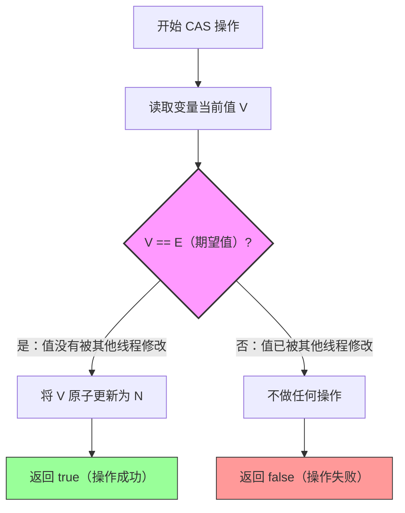
```mermaid
flowchart TD
    A["开始 CAS 操作"] --> B["读取变量当前值 V"]
    B --> C{"V == E（期望值）?"}
    C -- "是：值没有被其他线程修改" --> D["将 V 原子更新为 N"]
    D --> E["返回 true（操作成功）"]
    C -- "否：值已被其他线程修改" --> F["不做任何操作"]
    F --> G["返回 false（操作失败）"]
    style C fill:#f9f,stroke:#333,stroke-width:2px
    style E fill:#9f9,stroke:#333
    style G fill:#f99,stroke:#333
```

**CAS 与悲观锁/乐观锁的关系**：

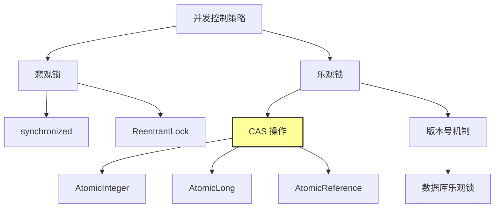
```mermaid
graph TD
    A["并发控制策略"] --> B["悲观锁"]
    A --> C["乐观锁"]
    B --> B1["synchronized"]
    B --> B2["ReentrantLock"]
    C --> C1["CAS 操作"]
    C --> C2["版本号机制"]
    C1 --> C1a["AtomicInteger"]
    C1 --> C1b["AtomicLong"]
    C1 --> C1c["AtomicReference"]
    C2 --> C2a["数据库乐观锁"]
    style C1 fill:#ff9,stroke:#333,stroke-width:2px
```

**为什么需要 CAS？**

传统的 `synchronized` 或 `ReentrantLock` 等悲观锁在获取锁失败时会阻塞线程（上下文切换开销大）。在**低竞争**或**短临界区**场景下，CAS 通过"尝试-重试"的方式避免了线程阻塞和上下文切换，性能显著优于悲观锁。

### 1.2 底层实现：Unsafe 类 + CPU 指令

#### 1.2.1 sun.misc.Unsafe 类

Java 中 CAS 操作通过 `sun.misc.Unsafe` 类实现。这个类是 JDK 内部使用的"后门"类，提供了直接操作内存、线程调度等底层能力。

```java
public final class Unsafe {
    // 私有构造器，不允许外部直接实例化
    private Unsafe() {}
    
    // 单例，只能通过反射或 JDK 内部类获取
    private static final Unsafe theUnsafe = new Unsafe();

    // ===== CAS 操作的三个核心 native 方法 =====
    
    /**
     * 对 int 类型进行 CAS 操作
     * @param o        目标对象
     * @param offset   字段在对象中的内存偏移量
     * @param expected 期望值
     * @param update   新值
     * @return 是否更新成功
     */
    public final native boolean compareAndSwapInt(
        Object o, long offset, int expected, int update);

    /**
     * 对 long 类型进行 CAS 操作
     */
    public final native boolean compareAndSwapLong(
        Object o, long offset, long expected, long update);

    /**
     * 对引用类型进行 CAS 操作
     */
    public final native boolean compareAndSwapObject(
        Object o, long offset, Object expected, Object update);

    // ===== 内存偏移量获取方法 =====
    
    /**
     * 获取字段在对象中的偏移量
     * 用于后续 CAS 操作定位字段
     */
    public native long objectFieldOffset(Field f);

    // ===== volatile 读写 =====
    
    public native int getIntVolatile(Object o, long offset);
    public native void putIntVolatile(Object o, long offset, int x);
    
    // ===== 线程调度 =====
    
    public native void park(boolean isAbsolute, long time);
    public native void unpark(Object thread);
}
```

**如何获取 Unsafe 实例**（仅供了解，实际开发不建议使用）：

```java
// 方式1：通过反射获取（Unsafe 的 getUnsafe() 方法有调用者类加载器检查）
Field f = Unsafe.class.getDeclaredField("theUnsafe");
f.setAccessible(true);
Unsafe unsafe = (Unsafe) f.get(null);

// 方式2：JDK 9+ 可以使用 VarHandle 替代（官方推荐的安全替代）
```

#### 1.2.2 内存偏移量（offset）的作用

CAS 操作需要知道目标字段在对象中的**精确内存位置**，这就是 offset 的作用。以 `AtomicInteger` 为例：

```java
public class AtomicInteger extends Number {
    private static final Unsafe unsafe = Unsafe.getUnsafe();
    private static final long valueOffset;

    static {
        try {
            // 获取 value 字段在 AtomicInteger 对象中的内存偏移量
            // 这样 CAS 操作就知道要去对象的哪个位置读写
            valueOffset = unsafe.objectFieldOffset(
                AtomicInteger.class.getDeclaredField("value"));
        } catch (Exception ex) { throw new Error(ex); }
    }

    private volatile int value; // volatile 保证可见性
}
```

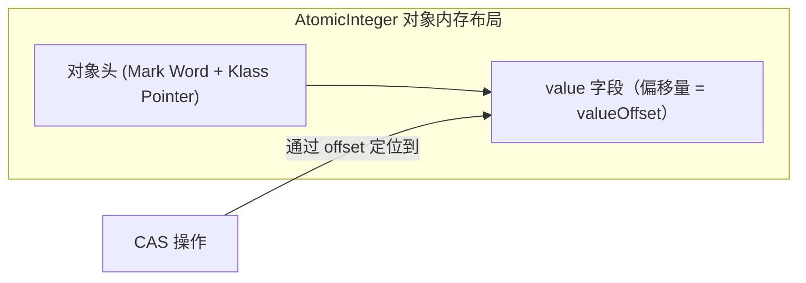
```mermaid
graph LR
    subgraph "AtomicInteger 对象内存布局"
        A["对象头 (Mark Word + Klass Pointer)"] --> B["value 字段（偏移量 = valueOffset）"]
    end
    C["CAS 操作"] -- "通过 offset 定位到" --> B
```

#### 1.2.3 CPU cmpxchg 指令

Unsafe 的 native 方法最终通过 JNI（Java Native Interface）调用 CPU 的原子指令。在 x86/x64 架构上，使用的是 **`CMPXCHG`**（Compare and Exchange）指令：

```asm
; x86 汇编 - CAS 原子操作
; EAX = 期望值(expected)
; [destination] = 内存地址中的当前值(V)
; source = 新值(update)
lock cmpxchg [destination], source
```

**`lock` 前缀的三大作用**：

| 作用 | 说明 |
|------|------|
| **锁定缓存行** | 在多核 CPU 上，lock 前缀会锁定该内存地址所在的缓存行（早期锁总线，现代 CPU 使用缓存锁） |
| **禁止指令重排序** | 充当内存屏障（Memory Barrier），阻止编译器和 CPU 的指令重排 |
| **刷新写缓冲区** | 将 Store Buffer 中的数据立即写入到缓存/主内存，对其他 CPU 可见 |

**CMPXCHG 指令执行流程**：

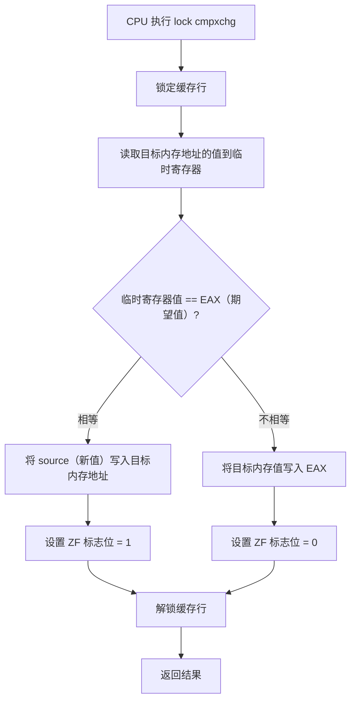
```mermaid
flowchart TD
    A["CPU 执行 lock cmpxchg"] --> B["锁定缓存行"]
    B --> C["读取目标内存地址的值到临时寄存器"]
    C --> D{"临时寄存器值 == EAX（期望值）?"}
    D -- "相等" --> E["将 source（新值）写入目标内存地址"]
    E --> F["设置 ZF 标志位 = 1"]
    F --> G["解锁缓存行"]
    D -- "不相等" --> H["将目标内存值写入 EAX"]
    H --> I["设置 ZF 标志位 = 0"]
    I --> G
    G --> J["返回结果"]
```

#### 1.2.4 CAS 完整调用链

从 Java 代码到 CPU 指令的完整调用路径：

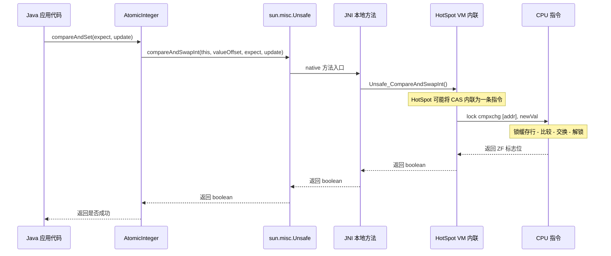
```mermaid
sequenceDiagram
    participant App as Java 应用代码
    participant AI as AtomicInteger
    participant Unsafe as sun.misc.Unsafe
    participant JNI as JNI 本地方法
    participant HotSpot as HotSpot VM 内联
    participant CPU as CPU 指令

    App->>AI: compareAndSet(expect, update)
    AI->>Unsafe: compareAndSwapInt(this, valueOffset, expect, update)
    Unsafe->>JNI: native 方法入口
    JNI->>HotSpot: Unsafe_CompareAndSwapInt()
    Note over HotSpot: HotSpot 可能将 CAS 内联为一条指令
    HotSpot->>CPU: lock cmpxchg [addr], newVal
    Note over CPU: 锁缓存行 - 比较 - 交换 - 解锁
    CPU-->>HotSpot: 返回 ZF 标志位
    HotSpot-->>JNI: 返回 boolean
    JNI-->>Unsafe: 返回 boolean
    Unsafe-->>AI: 返回 boolean
    AI-->>App: 返回是否成功
```

> **关键优化**：HotSpot JVM 会将 Unsafe 的 CAS 方法作为**编译器内联函数**（Intrinsic），直接生成对应的 CPU 指令，而不是走完整的 JNI 调用，极大减少了调用开销。

### 1.3 AtomicInteger 中的 CAS 自旋

`AtomicInteger` 是 CAS 最典型的应用。以 `getAndIncrement()` 为例分析自旋过程：

```java
public class AtomicInteger extends Number implements java.io.Serializable {
    private static final Unsafe unsafe = Unsafe.getUnsafe();
    private static final long valueOffset;
    
    static {
        try {
            valueOffset = unsafe.objectFieldOffset(
                AtomicInteger.class.getDeclaredField("value"));
        } catch (Exception ex) { throw new Error(ex); }
    }

    private volatile int value; // volatile 保证可见性

    // i++ 的原子版本
    public final int getAndIncrement() {
        return unsafe.getAndAddInt(this, valueOffset, 1);
    }
    
    // ++i 的原子版本
    public final int incrementAndGet() {
        return unsafe.getAndAddInt(this, valueOffset, 1) + 1;
    }

    // CAS 操作
    public final boolean compareAndSet(int expect, int update) {
        return unsafe.compareAndSwapInt(this, valueOffset, expect, update);
    }
}

// ===== Unsafe.getAndAddInt 的实现（JDK 8+）=====
public final int getAndAddInt(Object o, long offset, int delta) {
    int v;
    do {
        v = getIntVolatile(o, offset);     // 第1步：volatile 读取当前值
    } while (!compareAndSwapInt(o, offset, v, v + delta));  // 第2步：CAS 尝试更新
    // 如果 CAS 失败（说明其他线程修改了），重新读取并重试
    return v;  // 返回旧值
}
```

**CAS 自旋过程详细时序图**：

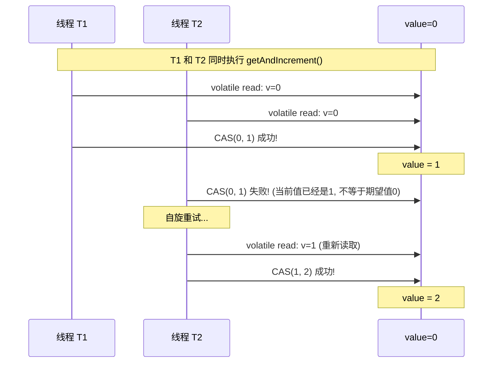
```mermaid
sequenceDiagram
    participant T1 as 线程 T1
    participant T2 as 线程 T2
    participant V as value=0

    Note over T1,V: T1 和 T2 同时执行 getAndIncrement()
    
    T1->>V: volatile read: v=0
    T2->>V: volatile read: v=0
    
    T1->>V: CAS(0, 1) 成功!
    Note over V: value = 1
    
    T2->>V: CAS(0, 1) 失败! (当前值已经是1, 不等于期望值0)
    Note over T2: 自旋重试...
    
    T2->>V: volatile read: v=1 (重新读取)
    T2->>V: CAS(1, 2) 成功!
    Note over V: value = 2
```

**自旋流程图**：

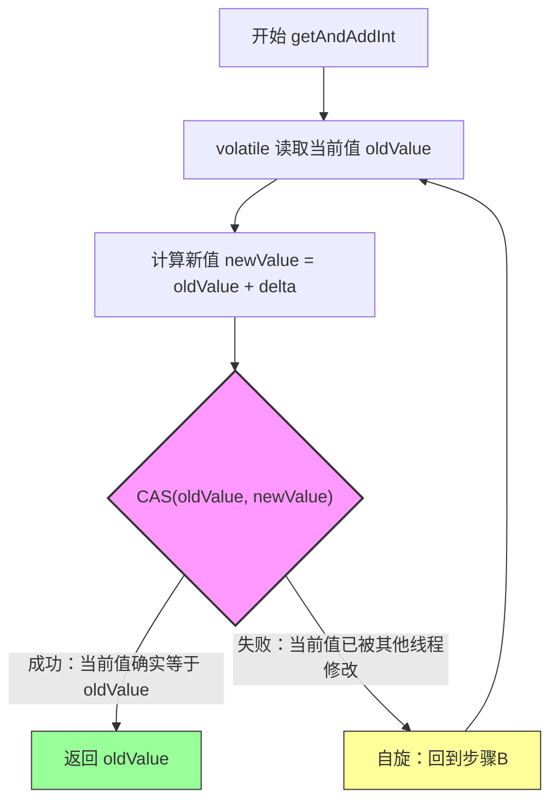
```mermaid
flowchart TD
    A["开始 getAndAddInt"] --> B["volatile 读取当前值 oldValue"]
    B --> C["计算新值 newValue = oldValue + delta"]
    C --> D{"CAS(oldValue, newValue)"}
    D -- "成功：当前值确实等于 oldValue" --> E["返回 oldValue"]
    D -- "失败：当前值已被其他线程修改" --> F["自旋：回到步骤B"]
    F --> B
    style D fill:#f9f,stroke:#333,stroke-width:2px
    style E fill:#9f9,stroke:#333
    style F fill:#ff9,stroke:#333
```

### 1.4 CAS 与 volatile 的配合

CAS 操作的正确性依赖于 `volatile` 关键字：

1. **volatile 读**：保证每次读取都从主内存获取最新值（可见性）
2. **CAS 写**：保证"比较+交换"的原子性（lock cmpxchg 本身也包含内存屏障语义）

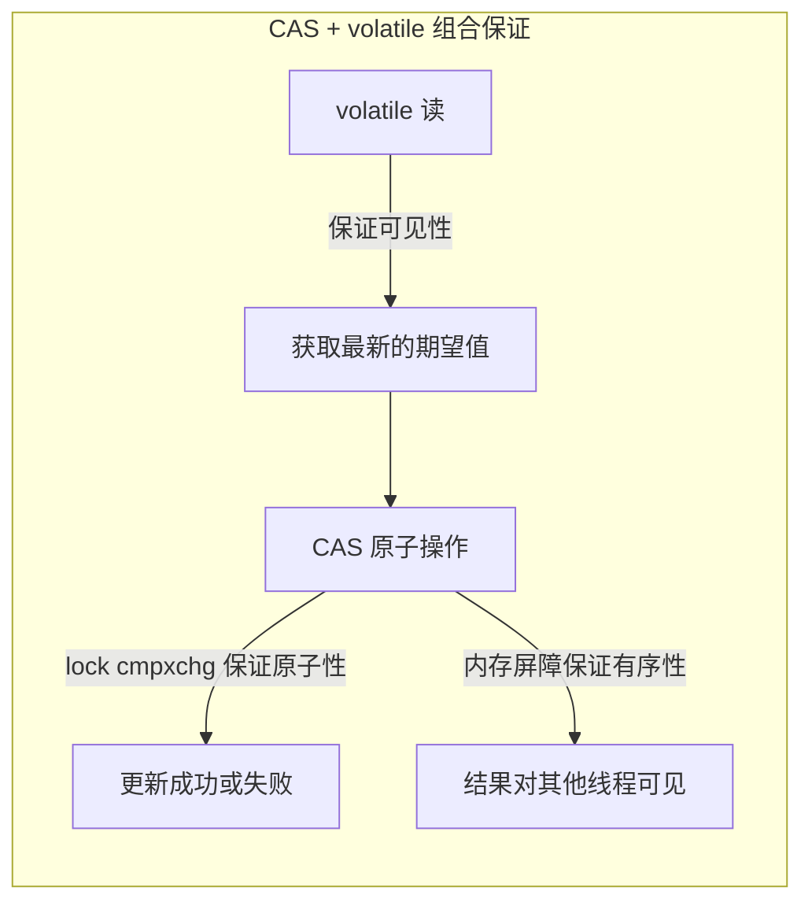
```mermaid
graph LR
    subgraph "CAS + volatile 组合保证"
        A["volatile 读"] -- "保证可见性" --> B["获取最新的期望值"]
        B --> C["CAS 原子操作"]
        C -- "lock cmpxchg 保证原子性" --> D["更新成功或失败"]
        C -- "内存屏障保证有序性" --> E["结果对其他线程可见"]
    end
```

### 1.5 CAS 与 synchronized 性能对比

| 维度 | CAS（无锁） | synchronized（有锁） |
|------|------------|---------------------|
| **低竞争** | 极快（直接 CAS 成功） | 偏向锁/轻量级锁也较快 |
| **中等竞争** | 较快（少量自旋） | 膨胀为重量级锁，上下文切换 |
| **高竞争** | 退化（大量自旋浪费 CPU） | 阻塞等待，CPU 利用率反而高 |
| **线程模型** | 非阻塞（不放弃 CPU） | 阻塞（放弃 CPU 时间片） |
| **适用场景** | 短临界区、低竞争 | 长临界区、高竞争 |

---

## 2. CAS 的三大问题

### 2.1 ABA 问题

#### 2.1.1 问题描述

ABA 问题是 CAS 操作的经典缺陷：线程 T1 读取值为 A，在 T1 执行 CAS 之前，另一个线程 T2 将值从 A 改为 B 再改回 A。此时 T1 的 CAS 操作发现值仍然是 A，认为没有变化而成功更新——**但实际上值已经经历了 A→B→A 的变化**。

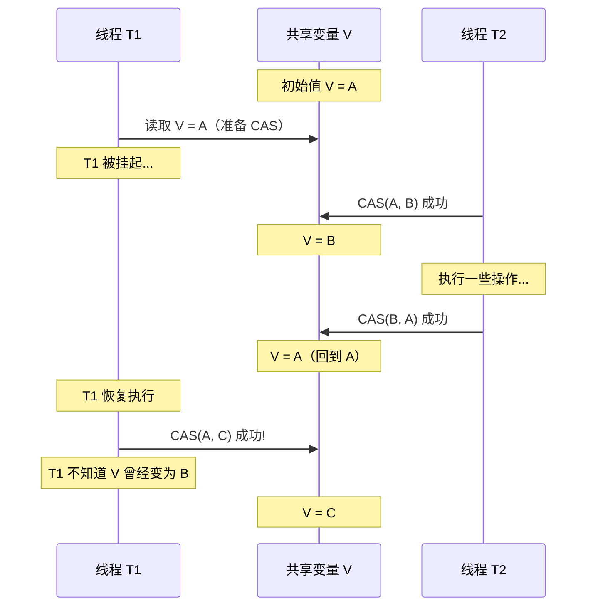
```mermaid
sequenceDiagram
    participant T1 as 线程 T1
    participant Mem as 共享变量 V
    participant T2 as 线程 T2

    Note over Mem: 初始值 V = A
    
    T1->>Mem: 读取 V = A（准备 CAS）
    Note over T1: T1 被挂起...
    
    T2->>Mem: CAS(A, B) 成功
    Note over Mem: V = B
    Note over T2: 执行一些操作...
    T2->>Mem: CAS(B, A) 成功
    Note over Mem: V = A（回到 A）
    
    Note over T1: T1 恢复执行
    T1->>Mem: CAS(A, C) 成功!
    Note over T1: T1 不知道 V 曾经变为 B
    Note over Mem: V = C
```

#### 2.1.2 ABA 问题的实际危害

在大多数**简单计数**场景中，ABA 问题无害。但在某些场景下会导致严重问题：

**场景1：链表/栈操作中的 ABA 问题**

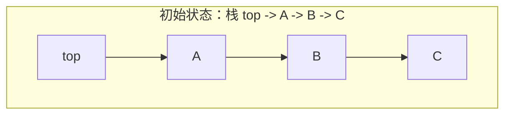
```mermaid
graph TD
    subgraph "初始状态：栈 top -> A -> B -> C"
        S1_TOP["top"] --> S1_A["A"]
        S1_A --> S1_B["B"]
        S1_B --> S1_C["C"]
    end
```

```
线程T1 要执行 pop()：
  1. 读取 top = A, next = B
  2. 准备 CAS(top: A -> B)  // 即把 top 指向 B
  3. T1 被挂起...

线程T2 执行：
  1. pop() -> 弹出 A，栈变成 top -> B -> C
  2. pop() -> 弹出 B，栈变成 top -> C
  3. push(A) -> A 重新入栈，栈变成 top -> A -> C

线程T1 恢复：
  CAS(top: A -> B) 成功！
  但此时 B 已经不在栈中了！top 指向了一个游离的 B 节点
  栈结构被破坏！
```

**场景2：账户余额转换**

```
账户余额 = 100 元
线程T1：准备扣款 100，期望值=100，新值=0
线程T2：先扣款 100（余额=0），再充值 100（余额=100）
线程T1：CAS(100, 0) 成功！—— 但 100 元是充值后的钱，不是原来的钱
```

#### 2.1.3 解决方案一：AtomicStampedReference（版本号）

`AtomicStampedReference` 通过引入**整数版本号（stamp）**来解决 ABA 问题。每次修改不仅更新值，还更新版本号。CAS 时同时比较值和版本号。

**核心源码分析**：

```java
public class AtomicStampedReference<V> {

    // 内部类：将引用和版本号封装为一个不可变对象
    private static class Pair<T> {
        final T reference;   // 实际引用值
        final int stamp;     // 版本号
        
        private Pair(T reference, int stamp) {
            this.reference = reference;
            this.stamp = stamp;
        }
        
        static <T> Pair<T> of(T reference, int stamp) {
            return new Pair<T>(reference, stamp);
        }
    }

    // 使用 volatile Pair 保证可见性
    private volatile Pair<V> pair;

    // 构造方法
    public AtomicStampedReference(V initialRef, int initialStamp) {
        pair = Pair.of(initialRef, initialStamp);
    }

    // 获取当前引用
    public V getReference() {
        return pair.reference;
    }

    // 获取当前版本号
    public int getStamp() {
        return pair.stamp;
    }

    // 同时获取引用和版本号
    public V get(int[] stampHolder) {
        Pair<V> pair = this.pair;
        stampHolder[0] = pair.stamp;
        return pair.reference;
    }

    /**
     * CAS 操作：同时比较引用和版本号
     * 只有当 expectedReference == 当前引用 且 expectedStamp == 当前版本号 时
     * 才将引用更新为 newReference，版本号更新为 newStamp
     */
    public boolean compareAndSet(V expectedReference, V newReference,
                                 int expectedStamp, int newStamp) {
        Pair<V> current = pair;
        return
            expectedReference == current.reference &&    // 引用相同
            expectedStamp == current.stamp &&            // 版本号相同
            ((newReference == current.reference &&       // 新值与当前相同
              newStamp == current.stamp) ||              // 且版本号也相同 -> 不需要更新
             casPair(current, Pair.of(newReference, newStamp)));  // 否则 CAS 更新 Pair
    }

    // 对 pair 字段进行 CAS
    private boolean casPair(Pair<V> cmp, Pair<V> val) {
        return UNSAFE.compareAndSwapObject(this, pairOffset, cmp, val);
    }
}
```

**关键设计思想**：将"引用+版本号"封装成一个 `Pair` 对象，对 `Pair` 的**引用**做 CAS。因为每次修改都会创建新的 `Pair` 实例，所以即使引用值相同，版本号不同也会导致 `Pair` 引用不同，CAS 自然失败。

**使用示例**：

```java
// 创建带版本号的原子引用，初始值=100，初始版本=1
AtomicStampedReference<Integer> balance = 
    new AtomicStampedReference<>(100, 1);

// 线程 T1
int[] stampHolder = new int[1];
Integer ref = balance.get(stampHolder);  // ref=100, stamp=1
// T1 被挂起...

// 线程 T2
int stamp2 = balance.getStamp();  // stamp2=1
balance.compareAndSet(100, 0, stamp2, stamp2 + 1);   // 100->0, stamp: 1->2
balance.compareAndSet(0, 100, stamp2 + 1, stamp2 + 2); // 0->100, stamp: 2->3

// T1 恢复
boolean success = balance.compareAndSet(100, 50, 
    stampHolder[0], stampHolder[0] + 1);  // CAS(100, 50, stamp=1, newStamp=2)
// success = false! 因为当前 stamp=3，不等于期望的 stamp=1
```

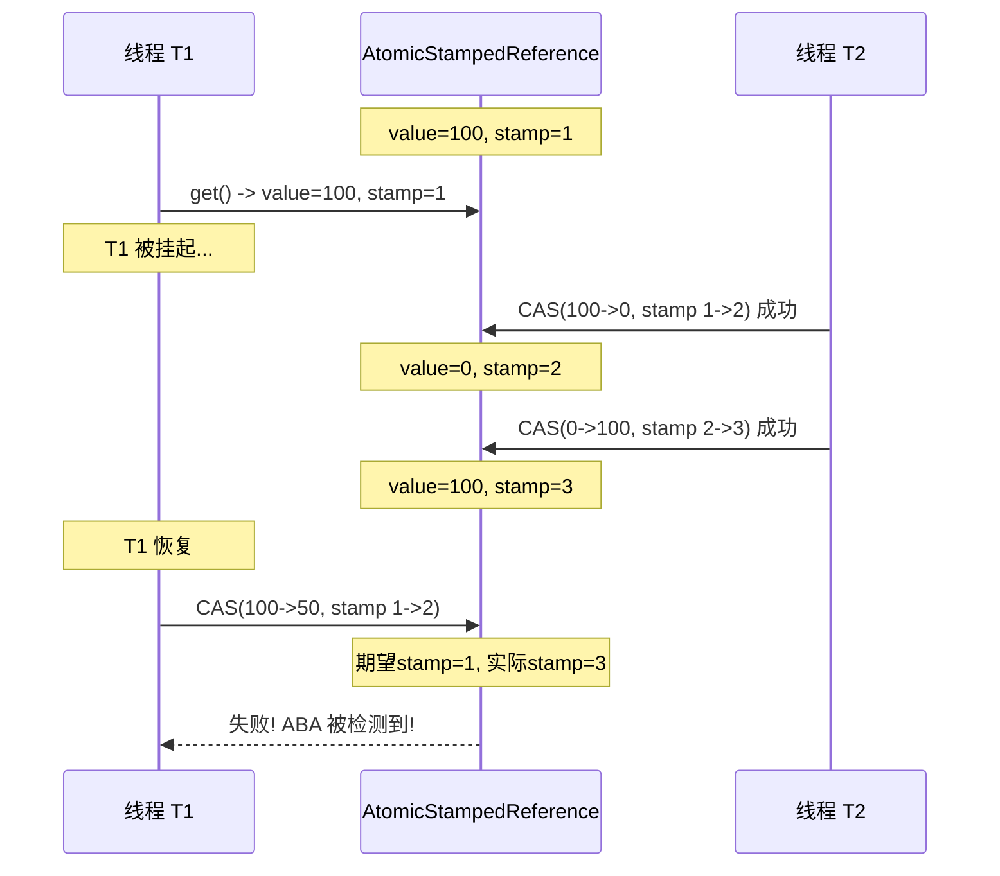
```mermaid
sequenceDiagram
    participant T1 as 线程 T1
    participant ASR as AtomicStampedReference
    participant T2 as 线程 T2

    Note over ASR: value=100, stamp=1

    T1->>ASR: get() -> value=100, stamp=1
    Note over T1: T1 被挂起...

    T2->>ASR: CAS(100->0, stamp 1->2) 成功
    Note over ASR: value=0, stamp=2
    T2->>ASR: CAS(0->100, stamp 2->3) 成功
    Note over ASR: value=100, stamp=3

    Note over T1: T1 恢复
    T1->>ASR: CAS(100->50, stamp 1->2)
    Note over ASR: 期望stamp=1, 实际stamp=3
    ASR-->>T1: 失败! ABA 被检测到!
```

#### 2.1.4 解决方案二：AtomicMarkableReference（标记位）

`AtomicMarkableReference` 与 `AtomicStampedReference` 类似，但使用 **boolean** 标记代替整数版本号。它不关心被修改了几次，只关心**是否被修改过**。

```java
public class AtomicMarkableReference<V> {
    private static class Pair<T> {
        final T reference;
        final boolean mark;   // boolean 标记（而非 int stamp）
        // ...
    }

    public boolean compareAndSet(V expectedReference, V newReference,
                                 boolean expectedMark, boolean newMark) {
        // 同时比较引用和标记位
    }
}

// 使用示例
AtomicMarkableReference<Integer> ref = new AtomicMarkableReference<>(100, false);
ref.compareAndSet(100, 200, false, true); // 修改值并标记
```

**两种方案对比**：

| 方案 | 类 | 额外信息 | 适用场景 |
|------|-----|---------|---------|
| 版本号 | `AtomicStampedReference` | int stamp（修改次数） | 需要精确追踪修改次数 |
| 标记位 | `AtomicMarkableReference` | boolean mark（是否修改） | 只需知道是否被改过 |

### 2.2 循环时间长开销大

#### 2.2.1 问题描述

CAS 使用**自旋**（do-while 循环）来重试失败的操作。在高并发场景下，大量线程同时竞争同一个变量，导致 CAS 频繁失败，线程不断自旋重试，**空耗 CPU 资源**。

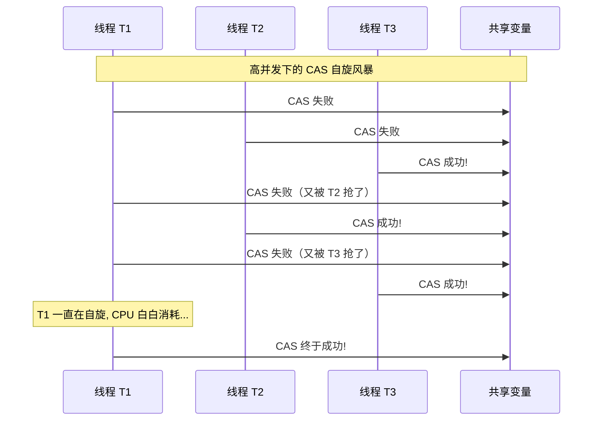
```mermaid
sequenceDiagram
    participant T1 as 线程 T1
    participant T2 as 线程 T2
    participant T3 as 线程 T3
    participant V as 共享变量

    Note over T1,V: 高并发下的 CAS 自旋风暴
    
    T1->>V: CAS 失败
    T2->>V: CAS 失败
    T3->>V: CAS 成功!
    
    T1->>V: CAS 失败（又被 T2 抢了）
    T2->>V: CAS 成功!
    
    T1->>V: CAS 失败（又被 T3 抢了）
    T3->>V: CAS 成功!
    
    Note over T1: T1 一直在自旋, CPU 白白消耗...
    T1->>V: CAS 终于成功!
```

#### 2.2.2 解决方案

| 方案 | 说明 | 代表实现 |
|------|------|---------|
| **分段思想** | 将热点变量拆分为多个小变量，减少竞争 | `LongAdder`（Cell[] + base） |
| **限制自旋次数** | 自旋 N 次后放弃，改用阻塞 | AQS 的 `acquireQueued` |
| **退避策略** | 失败后等待一段随机时间再重试 | `Thread.yield()` / `Thread.sleep()` |
| **适应性自旋** | 根据上次自旋结果动态调整自旋次数 | JVM 内部优化（synchronized 轻量级锁） |

### 2.3 只能保证一个共享变量的原子操作

#### 2.3.1 问题描述

CAS 操作的目标是**单个变量**。如果需要同时原子更新多个变量（例如同时更新 x 和 y 坐标），CAS 无法直接保证。

```java
// 无法用 CAS 同时原子更新 x 和 y
AtomicInteger x = new AtomicInteger(0);
AtomicInteger y = new AtomicInteger(0);

// 以下两个操作不是原子的！
x.compareAndSet(0, 1);  // 可能在这两步之间被其他线程看到不一致的状态
y.compareAndSet(0, 1);
```

#### 2.3.2 解决方案

**方案一：AtomicReference 封装多个变量**

```java
// 将多个变量封装成一个不可变对象
class Point {
    final int x, y;
    Point(int x, int y) { this.x = x; this.y = y; }
}

AtomicReference<Point> pointRef = new AtomicReference<>(new Point(0, 0));

// 原子更新：创建新 Point 对象
pointRef.compareAndSet(
    pointRef.get(), 
    new Point(1, 1)
);
```

**方案二：使用锁**

```java
// 当操作复杂时，锁可能是更合适的选择
synchronized (lock) {
    x = newX;
    y = newY;
}
```

**方案三：AtomicReferenceFieldUpdater（JDK 提供的字段更新器）**

```java
// 对象中某个 volatile 字段的原子更新
AtomicReferenceFieldUpdater<Foo, Bar> updater = 
    AtomicReferenceFieldUpdater.newUpdater(Foo.class, Bar.class, "bar");
```

---

## 3. Atomic 原子类家族

### 3.1 分类总览

JDK 提供了丰富的原子类，分为五大类：


```mermaid
classDiagram
    class Number {
        <<abstract>>
    }

    class AtomicInteger {
        -volatile int value
        +get() int
        +set(int newValue)
        +getAndIncrement() int
        +incrementAndGet() int
        +getAndAdd(int delta) int
        +compareAndSet(int expect, int update) boolean
        +getAndUpdate(IntUnaryOperator) int
        +accumulateAndGet(int x, IntBinaryOperator) int
    }

    class AtomicLong {
        -volatile long value
        +get() long
        +getAndIncrement() long
        +compareAndSet(long expect, long update) boolean
    }

    class AtomicBoolean {
        -volatile int value
        +get() boolean
        +compareAndSet(boolean expect, boolean update) boolean
    }

    class AtomicReference~V~ {
        -volatile V value
        +get() V
        +compareAndSet(V expect, V update) boolean
    }

    class AtomicStampedReference~V~ {
        -volatile Pair~V~ pair
        +getReference() V
        +getStamp() int
        +compareAndSet(V eRef, V nRef, int eStamp, int nStamp) boolean
    }

    class AtomicMarkableReference~V~ {
        -volatile Pair~V~ pair
        +getReference() V
        +isMarked() boolean
        +compareAndSet(V eRef, V nRef, boolean eMark, boolean nMark) boolean
    }

    class AtomicIntegerArray {
        -final int[] array
        +get(int i) int
        +compareAndSet(int i, int expect, int update) boolean
    }

    class AtomicLongArray {
        -final long[] array
        +get(int i) long
        +compareAndSet(int i, long expect, long update) boolean
    }

    class AtomicReferenceArray~E~ {
        -final Object[] array
        +get(int i) E
        +compareAndSet(int i, E expect, E update) boolean
    }

    Number <|-- AtomicInteger
    Number <|-- AtomicLong
    Number <|-- AtomicBoolean
```

**完整分类表**：

| 分类 | 类名 | 说明 |
|------|------|------|
| **基本类型** | `AtomicInteger` | int 原子操作 |
| | `AtomicLong` | long 原子操作 |
| | `AtomicBoolean` | boolean 原子操作（内部用 int 存储） |
| **引用类型** | `AtomicReference<V>` | 引用类型原子操作 |
| | `AtomicStampedReference<V>` | 带版本号的引用（解决 ABA） |
| | `AtomicMarkableReference<V>` | 带标记位的引用（解决 ABA） |
| **数组类型** | `AtomicIntegerArray` | int 数组中元素的原子操作 |
| | `AtomicLongArray` | long 数组中元素的原子操作 |
| | `AtomicReferenceArray<E>` | 引用数组中元素的原子操作 |
| **字段更新器** | `AtomicIntegerFieldUpdater<T>` | 对象 volatile int 字段的原子更新 |
| | `AtomicLongFieldUpdater<T>` | 对象 volatile long 字段的原子更新 |
| | `AtomicReferenceFieldUpdater<T,V>` | 对象 volatile 引用字段的原子更新 |
| **累加器(JDK 8+)** | `LongAdder` | 高性能 long 累加器 |
| | `DoubleAdder` | 高性能 double 累加器 |
| | `LongAccumulator` | 通用 long 累加器（自定义函数） |
| | `DoubleAccumulator` | 通用 double 累加器（自定义函数） |

### 3.2 基本类型：AtomicInteger / AtomicLong / AtomicBoolean

#### 3.2.1 AtomicInteger 核心方法

```java
AtomicInteger counter = new AtomicInteger(0);

// ===== 基础读写 =====
int val = counter.get();             // 读取当前值
counter.set(10);                     // 设置值（volatile 写）
counter.lazySet(10);                 // 延迟设置（不保证立即对其他线程可见，性能更好）

// ===== 原子增减 =====
counter.getAndIncrement();           // 相当于 i++（返回旧值）
counter.incrementAndGet();           // 相当于 ++i（返回新值）
counter.getAndDecrement();           // 相当于 i--（返回旧值）
counter.decrementAndGet();           // 相当于 --i（返回新值）
counter.getAndAdd(5);                // 相当于先 get 再 +=5（返回旧值）
counter.addAndGet(5);                // 相当于 +=5 再 get（返回新值）

// ===== CAS 操作 =====
counter.compareAndSet(10, 20);       // 期望10则更新为20，返回boolean

// ===== JDK 8+ Lambda 操作 =====
counter.getAndUpdate(x -> x * 2);         // 先get再用lambda更新（返回旧值）
counter.updateAndGet(x -> x * 2);         // 先用lambda更新再get（返回新值）
counter.getAndAccumulate(5, Integer::max); // 先get再用二元函数累加（返回旧值）
counter.accumulateAndGet(5, Math::max);    // 先用二元函数累加再get（返回新值）
```

#### 3.2.2 getAndUpdate 源码分析

JDK 8 新增的 Lambda 方法底层也是 CAS 自旋：

```java
public final int getAndUpdate(IntUnaryOperator updateFunction) {
    int prev, next;
    do {
        prev = get();                              // 读取当前值
        next = updateFunction.applyAsInt(prev);    // 通过函数计算新值
    } while (!compareAndSet(prev, next));          // CAS 自旋直到成功
    return prev;
}
```

#### 3.2.3 AtomicBoolean 内部实现

`AtomicBoolean` 内部用 `int` 存储（因为 CPU 的 CAS 指令操作的最小单位是 int/long）：

```java
public class AtomicBoolean {
    private volatile int value;  // 0 = false, 1 = true

    public final boolean get() {
        return value != 0;
    }

    public final boolean compareAndSet(boolean expect, boolean update) {
        int e = expect ? 1 : 0;
        int u = update ? 1 : 0;
        return unsafe.compareAndSwapInt(this, valueOffset, e, u);
    }
}
```

### 3.3 引用类型：AtomicReference

`AtomicReference<V>` 对**引用类型**进行 CAS 操作。注意比较的是**引用地址**（`==`），不是 `equals()`。

```java
// 典型应用：原子更新不可变对象
class User {
    final String name;
    final int age;
    User(String name, int age) { this.name = name; this.age = age; }
}

AtomicReference<User> userRef = new AtomicReference<>(new User("Alice", 25));

// 原子更新：创建新对象替换旧对象
User oldUser, newUser;
do {
    oldUser = userRef.get();
    newUser = new User(oldUser.name, oldUser.age + 1);
} while (!userRef.compareAndSet(oldUser, newUser));
```

**注意事项**：

```java
// ⚠️ 以下代码是错误的！
Integer a = 128;
Integer b = 128;
// a == b 为 false（超出 Integer 缓存范围 -128~127）
// CAS 比较的是引用，不是值！

// 正确做法：使用 AtomicStampedReference 或确保引用一致
```

### 3.4 数组类型：AtomicIntegerArray / AtomicLongArray / AtomicReferenceArray

对数组中**每个元素**独立提供原子操作。数组**引用本身不可变**（final），可变的是数组中的元素。

```java
AtomicIntegerArray arr = new AtomicIntegerArray(10);  // 长度为10
// 或者
AtomicIntegerArray arr2 = new AtomicIntegerArray(new int[]{1, 2, 3, 4, 5});

// 对指定索引的元素进行原子操作
arr.get(0);                           // 读取 index=0 的值
arr.set(0, 100);                      // 设置 index=0 为 100
arr.getAndIncrement(0);               // index=0 的元素原子自增
arr.compareAndSet(0, 100, 200);       // CAS 更新 index=0
arr.getAndUpdate(0, x -> x * 2);      // Lambda 原子更新

// 注意：数组引用本身不可变
// arr = new AtomicIntegerArray(5);  // 编译错误（如果声明为 final）
```

**内部实现**：通过计算元素在数组中的内存偏移量进行 CAS

```java
// AtomicIntegerArray 内部
private static final int base = unsafe.arrayBaseOffset(int[].class);
private static final int shift;  // 用于计算索引对应的偏移量

static {
    int scale = unsafe.arrayIndexScale(int[].class);  // 每个元素的字节大小
    shift = 31 - Integer.numberOfLeadingZeros(scale);
}

// 根据索引计算内存偏移量
private long checkedByteOffset(int i) {
    return ((long) i << shift) + base;
}
```

### 3.5 字段更新器：AtomicIntegerFieldUpdater / AtomicLongFieldUpdater / AtomicReferenceFieldUpdater

字段更新器允许对已有对象的 **`volatile` 字段**进行原子更新，**无需将字段改为原子类**。适用于不能修改原有类结构的场景。

```java
class Account {
    volatile int balance;  // 必须是 volatile
    String name;
    
    Account(String name, int balance) {
        this.name = name;
        this.balance = balance;
    }
}

// 创建字段更新器（通过反射）
AtomicIntegerFieldUpdater<Account> balanceUpdater =
    AtomicIntegerFieldUpdater.newUpdater(Account.class, "balance");

Account account = new Account("Alice", 1000);

// 原子更新 balance 字段
balanceUpdater.getAndAdd(account, -100);           // 扣款100
balanceUpdater.compareAndSet(account, 900, 800);   // CAS 扣款
int current = balanceUpdater.get(account);         // 读取余额
```

**使用限制**：

| 限制 | 说明 |
|------|------|
| 字段必须 `volatile` | 保证可见性 |
| 不能是 `static` | 静态字段使用 `AtomicXxxFieldUpdater` 没有意义（用 `AtomicXxx` 就行） |
| 不能是 `private`（跨类时） | 更新器通过反射访问字段，需要有访问权限 |
| 不能是包装类型（Integer 等） | `AtomicIntegerFieldUpdater` 只能操作 `int` 类型字段 |

**字段更新器 vs 原子类 选型**：

| 场景 | 推荐 |
|------|------|
| 新设计的类 | 直接使用 `AtomicInteger` 等原子类 |
| 无法修改的已有类 | 使用字段更新器 |
| 大量对象（节省内存） | 使用字段更新器（不需要额外的原子类包装） |

---

## 4. LongAdder 与 LongAccumulator

### 4.1 AtomicLong 的瓶颈

在高并发场景下，`AtomicLong` 所有线程竞争**同一个 value** 的 CAS，导致大量 CAS 失败和自旋重试：

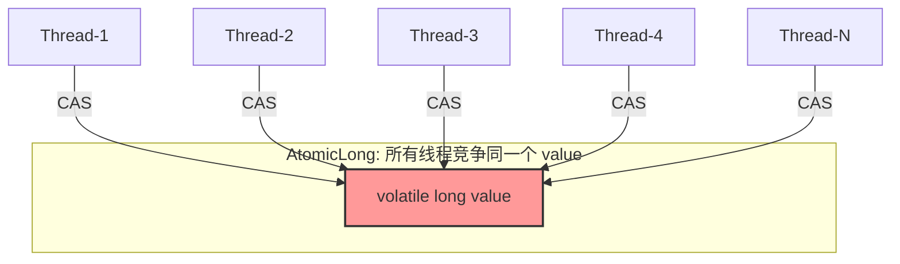
```mermaid
graph TD
    subgraph "AtomicLong: 所有线程竞争同一个 value"
        V["volatile long value"]
    end
    T1["Thread-1"] -- "CAS" --> V
    T2["Thread-2"] -- "CAS" --> V
    T3["Thread-3"] -- "CAS" --> V
    T4["Thread-4"] -- "CAS" --> V
    T5["Thread-N"] -- "CAS" --> V
    
    style V fill:#f99,stroke:#333,stroke-width:2px
```

> 100 个线程同时 CAS，只有 1 个成功，其余 99 个都需要重试。这就是**CAS 热点争用**问题。

### 4.2 LongAdder 分段思想

`LongAdder` 采用**分段（Striping）**思想：将热点值拆分为 **base + Cell[] 数组**，不同线程操作不同的 Cell（或 base），最后求和。

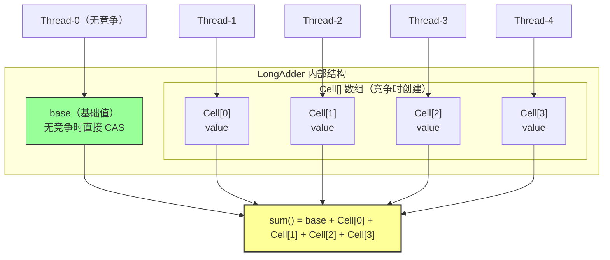
```mermaid
flowchart TD
    subgraph "LongAdder 内部结构"
        BASE["base（基础值）<br/>无竞争时直接 CAS"]
        subgraph "Cell[] 数组（竞争时创建）"
            C0["Cell[0]<br/>value"]
            C1["Cell[1]<br/>value"]
            C2["Cell[2]<br/>value"]
            C3["Cell[3]<br/>value"]
        end
    end
    
    T0["Thread-0（无竞争）"] --> BASE
    T1["Thread-1"] --> C0
    T2["Thread-2"] --> C1
    T3["Thread-3"] --> C2
    T4["Thread-4"] --> C3
    
    BASE --> SUM["sum() = base + Cell[0] + Cell[1] + Cell[2] + Cell[3]"]
    C0 --> SUM
    C1 --> SUM
    C2 --> SUM
    C3 --> SUM
    
    style BASE fill:#9f9,stroke:#333
    style SUM fill:#ff9,stroke:#333,stroke-width:2px
```

**核心思想**：**空间换时间** —— 分散竞争热点。

### 4.3 Cell 类与 @Contended 伪共享优化

#### 4.3.1 Cell 类定义

```java
// Striped64 内部类
@sun.misc.Contended   // 防止伪共享！
static final class Cell {
    volatile long value;
    
    Cell(long x) { value = x; }

    // 对 value 进行 CAS
    final boolean cas(long cmp, long val) {
        return UNSAFE.compareAndSwapLong(this, valueOffset, cmp, val);
    }
    
    private static final sun.misc.Unsafe UNSAFE;
    private static final long valueOffset;
    static {
        try {
            UNSAFE = sun.misc.Unsafe.getUnsafe();
            valueOffset = UNSAFE.objectFieldOffset(
                Cell.class.getDeclaredField("value"));
        } catch (Exception e) { throw new Error(e); }
    }
}
```

#### 4.3.2 什么是伪共享（False Sharing）

CPU 缓存以**缓存行（Cache Line）**为单位（通常 64 字节）。如果两个无关的变量恰好在同一缓存行中，一个线程修改其中一个变量时，会导致另一个线程缓存行失效，造成不必要的缓存失效和同步——这就是**伪共享**。

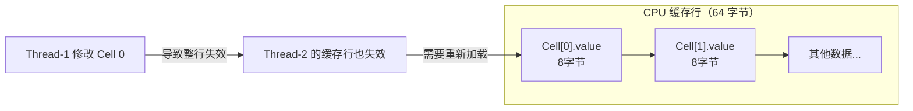
```mermaid
graph LR
    subgraph "CPU 缓存行（64 字节）"
        A["Cell[0].value<br/>8字节"] --> B["Cell[1].value<br/>8字节"]
        B --> C["其他数据..."]
    end
    
    T1["Thread-1 修改 Cell 0"] -- "导致整行失效" --> T2["Thread-2 的缓存行也失效"]
    T2 -- "需要重新加载" --> A
```

#### 4.3.3 @Contended 的作用

`@sun.misc.Contended` 注解会在对象**前后各填充 128 字节**（2个缓存行大小），确保 Cell 独占缓存行：

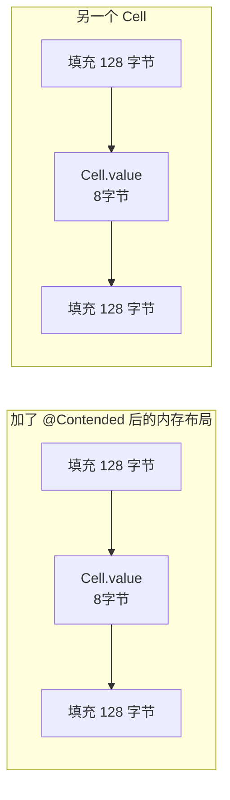
```mermaid
graph LR
    subgraph "加了 @Contended 后的内存布局"
        P1["填充 128 字节"] --> V["Cell.value<br/>8字节"] --> P2["填充 128 字节"]
    end
    
    subgraph "另一个 Cell"
        P3["填充 128 字节"] --> V2["Cell.value<br/>8字节"] --> P4["填充 128 字节"]
    end
```

> **注意**：使用 `@Contended` 需要添加 JVM 参数 `-XX:-RestrictContended`，否则不生效。JDK 内部类不受此限制。

### 4.4 LongAdder add() 源码深度分析

```java
public void add(long x) {
    Cell[] as;       // cells 数组引用
    long b, v;       // b: base值, v: cell当前值
    int m;           // cells 长度减1（用于取模）
    Cell a;          // 当前线程映射到的 Cell
    
    // 第一步：如果 cells 未初始化 且 CAS 更新 base 成功 → 直接返回
    // （无竞争场景，快速路径）
    if ((as = cells) != null || !casBase(b = base, b + x)) {
        // 进入此分支说明：cells 已初始化 或 base 的 CAS 失败（有竞争）
        boolean uncontended = true;
        
        // 第二步：尝试 CAS 更新对应的 Cell
        if (as == null                           // cells 还没初始化
            || (m = as.length - 1) < 0           // cells 为空数组
            || (a = as[getProbe() & m]) == null  // 当前线程对应的 Cell 还没创建
            || !(uncontended = a.cas(v = a.value, v + x)))  // CAS 更新 Cell 失败
        {
            // 第三步：以上都不满足时，进入 longAccumulate
            // 负责：初始化 cells / 创建 Cell / 扩容 cells / 重新 hash 后重试
            longAccumulate(x, null, uncontended);
        }
    }
}
```

**add() 流程图（完整版）**：

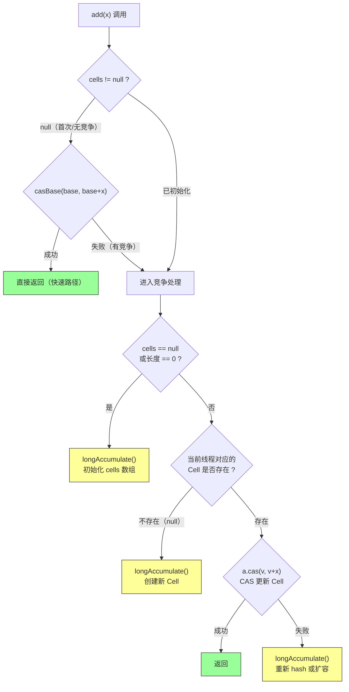
```mermaid
flowchart TD
    START["add(x) 调用"] --> CHECK1{"cells != null ?"}
    
    CHECK1 -- "null（首次/无竞争）" --> CAS_BASE{"casBase(base, base+x)"}
    CAS_BASE -- "成功" --> DONE1["直接返回（快速路径）"]
    CAS_BASE -- "失败（有竞争）" --> ENTER["进入竞争处理"]
    
    CHECK1 -- "已初始化" --> ENTER
    
    ENTER --> CHECK2{"cells == null<br/>或长度 == 0 ?"}
    CHECK2 -- "是" --> ACCUMULATE["longAccumulate()<br/>初始化 cells 数组"]
    
    CHECK2 -- "否" --> CHECK3{"当前线程对应的<br/>Cell 是否存在 ?"}
    CHECK3 -- "不存在（null）" --> ACCUMULATE2["longAccumulate()<br/>创建新 Cell"]
    
    CHECK3 -- "存在" --> CAS_CELL{"a.cas(v, v+x)<br/>CAS 更新 Cell"}
    CAS_CELL -- "成功" --> DONE2["返回"]
    CAS_CELL -- "失败" --> ACCUMULATE3["longAccumulate()<br/>重新 hash 或扩容"]
    
    style DONE1 fill:#9f9,stroke:#333
    style DONE2 fill:#9f9,stroke:#333
    style ACCUMULATE fill:#ff9,stroke:#333
    style ACCUMULATE2 fill:#ff9,stroke:#333
    style ACCUMULATE3 fill:#ff9,stroke:#333
```

### 4.5 longAccumulate() 核心逻辑

`longAccumulate()` 是 `Striped64` 中最复杂的方法，处理所有竞争情况：

```java
// 简化版 longAccumulate
final void longAccumulate(long x, LongBinaryOperator fn, boolean wasUncontended) {
    int h;
    if ((h = getProbe()) == 0) {     // 线程 hash 未初始化
        ThreadLocalRandom.current(); // 强制初始化
        h = getProbe();
        wasUncontended = true;
    }
    
    boolean collide = false;  // 扩容标志
    
    for (;;) {  // 自旋
        Cell[] as; Cell a; int n; long v;
        
        if ((as = cells) != null && (n = as.length) > 0) {
            // === 情况1: cells 已初始化 ===
            
            if ((a = as[(n - 1) & h]) == null) {
                // 情况1a: 对应槽位为空 → 创建新 Cell
                // ... 通过 cellsBusy 自旋锁创建 Cell ...
            }
            else if (!wasUncontended) {
                // 情况1b: 上次 CAS 失败 → 重新 hash 后重试
                wasUncontended = true;
            }
            else if (a.cas(v = a.value, (fn == null) ? v + x : fn.applyAsLong(v, x))) {
                // 情况1c: CAS Cell 成功 → 返回
                break;
            }
            else if (n >= NCPU || cells != as) {
                // 情况1d: 数组已达 CPU 核数上限 或 数组已变化 → 不扩容
                collide = false;
            }
            else if (!collide) {
                // 情况1e: 设置扩容标志
                collide = true;
            }
            else if (cellsBusy == 0 && casCellsBusy()) {
                // 情况1f: 扩容！数组长度翻倍
                try {
                    if (cells == as) {
                        Cell[] rs = new Cell[n << 1];  // 扩容为2倍
                        for (int i = 0; i < n; ++i)
                            rs[i] = as[i];
                        cells = rs;
                    }
                } finally {
                    cellsBusy = 0;
                }
                collide = false;
                continue;  // 扩容后重试
            }
            
            h = advanceProbe(h);  // 重新 hash
        }
        else if (cellsBusy == 0 && cells == as && casCellsBusy()) {
            // === 情况2: cells 未初始化 → 初始化 ===
            try {
                if (cells == as) {
                    Cell[] rs = new Cell[2];    // 初始大小为2
                    rs[h & 1] = new Cell(x);
                    cells = rs;
                }
            } finally {
                cellsBusy = 0;
            }
            break;
        }
        else if (casBase(v = base, (fn == null) ? v + x : fn.applyAsLong(v, x))) {
            // === 情况3: 初始化竞争失败 → 尝试更新 base ===
            break;
        }
    }
}
```

**longAccumulate 流程图**：

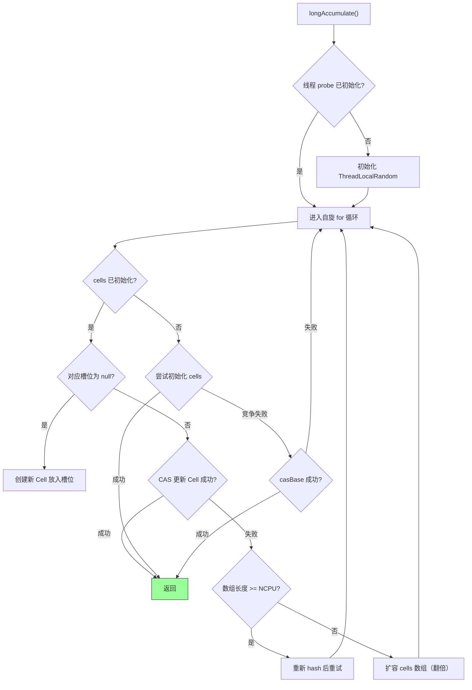
```mermaid
flowchart TD
    START["longAccumulate()"] --> INIT{"线程 probe 已初始化?"}
    INIT -- "否" --> INIT_PROBE["初始化 ThreadLocalRandom"]
    INIT -- "是" --> SPIN["进入自旋 for 循环"]
    INIT_PROBE --> SPIN
    
    SPIN --> C1{"cells 已初始化?"}
    
    C1 -- "是" --> C1A{"对应槽位为 null?"}
    C1A -- "是" --> CREATE["创建新 Cell 放入槽位"]
    C1A -- "否" --> C1C{"CAS 更新 Cell 成功?"}
    C1C -- "成功" --> DONE["返回"]
    C1C -- "失败" --> C1D{"数组长度 >= NCPU?"}
    C1D -- "是" --> REHASH["重新 hash 后重试"]
    C1D -- "否" --> EXPAND["扩容 cells 数组（翻倍）"]
    EXPAND --> SPIN
    REHASH --> SPIN
    
    C1 -- "否" --> C2{"尝试初始化 cells"}
    C2 -- "成功" --> DONE
    C2 -- "竞争失败" --> C3{"casBase 成功?"}
    C3 -- "成功" --> DONE
    C3 -- "失败" --> SPIN
    
    style DONE fill:#9f9,stroke:#333
```

### 4.6 sum() 方法分析

```java
public long sum() {
    Cell[] as = cells;
    Cell a;
    long sum = base;   // 先加 base
    if (as != null) {
        for (int i = 0; i < as.length; ++i) {
            if ((a = as[i]) != null)
                sum += a.value;  // 逐个累加 Cell 的值
        }
    }
    return sum;  
    // ⚠️ 注意：sum() 不是原子操作！
    // 在遍历过程中，其他线程可能修改 base 或 Cell
    // 因此 sum() 返回的是一个近似值
}
```

### 4.7 LongAccumulator

`LongAccumulator` 是 `LongAdder` 的通用版本，支持自定义二元运算函数：

```java
// LongAdder 等价于：
LongAccumulator adder = new LongAccumulator(Long::sum, 0L);

// 求最大值
LongAccumulator max = new LongAccumulator(Long::max, Long.MIN_VALUE);
max.accumulate(10);
max.accumulate(20);
max.accumulate(5);
System.out.println(max.get()); // 20

// 求最小值
LongAccumulator min = new LongAccumulator(Long::min, Long.MAX_VALUE);

// 求乘积
LongAccumulator product = new LongAccumulator((a, b) -> a * b, 1L);
```

### 4.8 LongAdder vs AtomicLong 性能对比

| 维度 | AtomicLong | LongAdder |
|------|-----------|-----------|
| **低竞争（2线程）** | 差异不大 | 差异不大 |
| **中等竞争（16线程）** | 明显变慢 | 快2-5倍 |
| **高竞争（64线程）** | 极慢（大量自旋） | 快5-10倍 |
| **读取精确性** | `get()` 精确 | `sum()` 非原子（近似值） |
| **内存占用** | 小（一个 long） | 大（base + Cell[] + 填充） |
| **适用场景** | 需要精确值的场景 | 高并发统计（QPS/计数） |

**选型建议**：

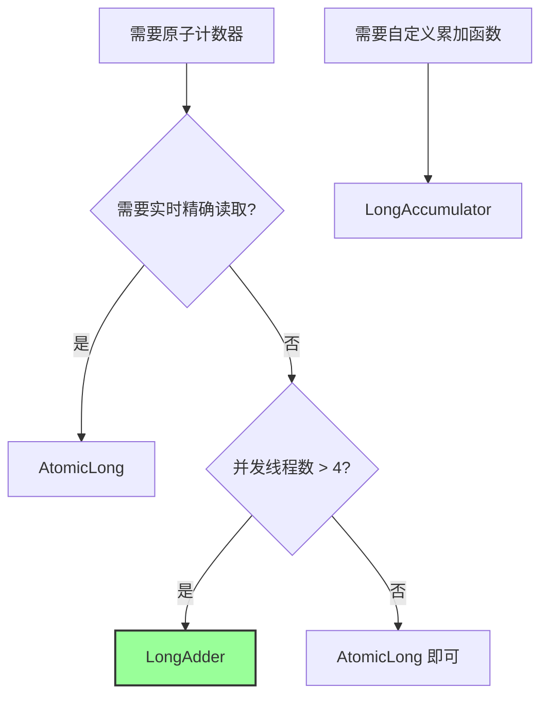
```mermaid
flowchart TD
    A["需要原子计数器"] --> B{"需要实时精确读取?"}
    B -- "是" --> C["AtomicLong"]
    B -- "否" --> D{"并发线程数 > 4?"}
    D -- "是" --> E["LongAdder"]
    D -- "否" --> F["AtomicLong 即可"]
    
    A2["需要自定义累加函数"] --> G["LongAccumulator"]
    
    style E fill:#9f9,stroke:#333,stroke-width:2px
```

---

## 5. AQS 原理（AbstractQueuedSynchronizer）

### 5.1 概述

AQS（AbstractQueuedSynchronizer，抽象队列同步器）是 `java.util.concurrent` 包中**构建锁和同步器的核心框架**，由 Doug Lea 大师设计。JUC 中绝大部分同步工具都基于 AQS：

```mermaid
graph TD
    AQS["AbstractQueuedSynchronizer<br/>（AQS 抽象类）"]
    AQS --> RL["ReentrantLock<br/>可重入独占锁"]
    AQS --> RRWL["ReentrantReadWriteLock<br/>读写锁"]
    AQS --> CDL["CountDownLatch<br/>倒计数门闩"]
    AQS --> S["Semaphore<br/>信号量"]
    AQS --> TP["ThreadPoolExecutor<br/>Worker 继承 AQS"]
    
    style AQS fill:#f96,stroke:#333,stroke-width:3px
    style RL fill:#9cf,stroke:#333
    style RRWL fill:#9cf,stroke:#333
    style CDL fill:#9cf,stroke:#333
    style S fill:#9cf,stroke:#333
    style TP fill:#9cf,stroke:#333
```

**AQS 的设计模式**：**模板方法模式**

AQS 定义好了获取/释放锁的整体流程（模板方法），子类只需实现几个关键的"钩子方法"：

| 钩子方法 | 说明 | 模式 |
|---------|------|------|
| `tryAcquire(int)` | 尝试以独占模式获取 | 独占 |
| `tryRelease(int)` | 尝试以独占模式释放 | 独占 |
| `tryAcquireShared(int)` | 尝试以共享模式获取 | 共享 |
| `tryReleaseShared(int)` | 尝试以共享模式释放 | 共享 |
| `isHeldExclusively()` | 当前线程是否独占持有 | 独占 |

### 5.2 核心设计：state + CLH 队列

AQS 的核心由两部分组成：

1. **`volatile int state`**：同步状态，通过 CAS 修改
2. **CLH 等待队列**：FIFO 双向链表，存放获取锁失败的线程

```mermaid
flowchart LR
    subgraph "AQS 核心结构"
        STATE["state: volatile int<br/>（CAS 修改）<br/>- ReentrantLock: 0=未锁, >0=重入次数<br/>- Semaphore: 剩余许可数<br/>- CountDownLatch: 倒计数值"]
        
        subgraph "CLH 等待队列（FIFO 双向链表）"
            HEAD["head"] --> SENTINEL["哨兵 Node<br/>（dummy node）<br/>ws=SIGNAL"]
            SENTINEL --> N1["Node-A<br/>thread=T1<br/>ws=SIGNAL"]
            N1 --> N2["Node-B<br/>thread=T2<br/>ws=SIGNAL"]
            N2 --> N3["Node-C<br/>thread=T3<br/>ws=0"]
            TAIL["tail"] --> N3
        end
        
        OWNER["exclusiveOwnerThread<br/>当前持锁线程"]
    end
```

**state 在不同同步器中的含义**：

| 同步器 | state 含义 | 初始值 |
|--------|-----------|--------|
| `ReentrantLock` | 0=未锁，>0=重入次数 | 0 |
| `ReentrantReadWriteLock` | 高16位=读锁持有数，低16位=写锁重入数 | 0 |
| `CountDownLatch` | 倒计数值（count） | 用户指定 |
| `Semaphore` | 剩余许可证数量 | 用户指定 |
| `ThreadPoolExecutor.Worker` | -1=未启动，0=未锁，1=已锁 | -1 |

### 5.3 Node 节点详解

```java
static final class Node {
    // ===== 模式标记 =====
    static final Node SHARED = new Node();  // 共享模式标记
    static final Node EXCLUSIVE = null;     // 独占模式标记
    
    // ===== waitStatus 5种状态 =====
    
    /** 值=1: 线程已取消（超时或中断），该节点永远不会再阻塞 */
    static final int CANCELLED  =  1;
    
    /** 值=-1: 后继节点需要被唤醒。
     *  当一个节点的 ws=SIGNAL 时，释放锁时需要 unpark 其后继 */
    static final int SIGNAL     = -1;
    
    /** 值=-2: 节点在条件队列（Condition Queue）中等待
     *  被 signal 后会转移到同步队列（Sync Queue） */
    static final int CONDITION  = -2;
    
    /** 值=-3: 共享模式下，释放锁时需要传播唤醒后续共享节点 */
    static final int PROPAGATE  = -3;
    
    /** 值=0: 初始状态，新创建的节点 */
    // 0 = 初始状态
    
    // ===== 核心字段 =====
    volatile int waitStatus;     // 当前节点的等待状态
    volatile Node prev;          // 前驱节点
    volatile Node next;          // 后继节点
    volatile Thread thread;      // 该节点关联的线程
    Node nextWaiter;             // 条件队列中的下一个节点 / 模式标记
}
```

**waitStatus 5种状态转换图**：

```mermaid
stateDiagram-v2
    [*] --> INITIAL: 新建节点(0)
    INITIAL --> SIGNAL: 后继入队<br/>设为 SIGNAL(-1)
    INITIAL --> CANCELLED: 超时/中断(1)
    SIGNAL --> INITIAL: 释放锁时<br/>重置为 0
    SIGNAL --> CANCELLED: 超时/中断
    INITIAL --> CONDITION: 进入条件队列(-2)
    CONDITION --> INITIAL: signal 转移到<br/>同步队列(0)
    CONDITION --> CANCELLED: 超时/中断
    INITIAL --> PROPAGATE: 共享释放(-3)
```

**waitStatus 详细说明**：

| 状态值 | 常量名 | 说明 | 典型场景 |
|--------|--------|------|---------|
| 0 | （初始） | 新创建的节点默认值 | 刚入队的节点 |
| -1 | SIGNAL | 表示"我释放锁后需要唤醒后继节点" | 后继节点 park 前把前驱设为 SIGNAL |
| 1 | CANCELLED | 线程被取消（中断或超时），永远不会再参与锁竞争 | `tryLock(timeout)` 超时 |
| -2 | CONDITION | 节点在 Condition 的条件队列中 | `condition.await()` |
| -3 | PROPAGATE | 共享模式下需要向后传播唤醒 | `releaseShared` |

### 5.4 独占模式：acquire 获取锁（完整源码级分析）

#### 5.4.1 acquire() 入口方法

```java
/**
 * 独占模式获取锁的入口方法（模板方法）
 * 整体流程：尝试获取 → 失败则入队 → 队列中自旋/阻塞
 */
public final void acquire(int arg) {
    if (!tryAcquire(arg) &&                              // 步骤1：尝试获取（子类实现）
        acquireQueued(addWaiter(Node.EXCLUSIVE), arg))   // 步骤2：失败则入队并阻塞
        selfInterrupt();                                 // 步骤3：补中断标记
}
```

#### 5.4.2 addWaiter() 入队操作

```java
/**
 * 将当前线程封装为 Node 加入队列尾部
 * @param mode Node.EXCLUSIVE（独占）或 Node.SHARED（共享）
 */
private Node addWaiter(Node mode) {
    Node node = new Node(Thread.currentThread(), mode);
    
    // 快速路径：尝试 CAS 将 node 设为 tail
    Node pred = tail;
    if (pred != null) {
        node.prev = pred;
        if (compareAndSetTail(pred, node)) {  // CAS 设置 tail
            pred.next = node;
            return node;
        }
    }
    
    // 快速路径失败（队列为空或 CAS 竞争失败）→ 自旋入队
    enq(node);
    return node;
}

/**
 * 自旋入队（处理队列未初始化和 CAS 失败的情况）
 */
private Node enq(final Node node) {
    for (;;) {  // 自旋
        Node t = tail;
        if (t == null) {
            // 队列为空：创建哨兵节点（dummy head）
            if (compareAndSetHead(new Node()))
                tail = head;
        } else {
            // 正常入队
            node.prev = t;
            if (compareAndSetTail(t, node)) {
                t.next = node;
                return t;
            }
        }
    }
}
```

**addWaiter 流程图**：

```mermaid
flowchart TD
    START["addWaiter(mode)"] --> CREATE["创建 Node(thread, mode)"]
    CREATE --> CHECK{"tail != null?<br/>（队列已初始化）"}
    
    CHECK -- "是" --> FAST_CAS{"快速 CAS 设为 tail"}
    FAST_CAS -- "成功" --> DONE["返回 node"]
    FAST_CAS -- "失败" --> ENQ["enq() 自旋入队"]
    
    CHECK -- "否（队列为空）" --> ENQ
    
    ENQ --> ENQ_CHECK{"tail == null?"}
    ENQ_CHECK -- "是" --> INIT["CAS 创建哨兵节点<br/>head = tail = new Node()"]
    INIT --> ENQ_CHECK
    ENQ_CHECK -- "否" --> ENQ_CAS{"CAS 设为 tail"}
    ENQ_CAS -- "成功" --> DONE
    ENQ_CAS -- "失败" --> ENQ_CHECK
    
    style DONE fill:#9f9,stroke:#333
```

#### 5.4.3 acquireQueued() 在队列中自旋/阻塞

```java
/**
 * 已入队的线程在队列中自旋尝试获取锁
 * 核心规则：只有前驱是 head 的节点才有资格尝试获取锁
 * @return 是否被中断过
 */
final boolean acquireQueued(final Node node, int arg) {
    boolean failed = true;
    try {
        boolean interrupted = false;
        
        for (;;) {  // 自旋
            final Node p = node.predecessor();  // 获取前驱节点
            
            // ★ 核心：只有前驱是 head 的节点才尝试获取锁
            if (p == head && tryAcquire(arg)) {
                // 获取成功！将当前节点设为 head（出队）
                setHead(node);       // head = node; node.thread = null; node.prev = null
                p.next = null;       // 帮助 GC（断开旧 head 的引用）
                failed = false;
                return interrupted;
            }
            
            // 不是 head 的后继 或 tryAcquire 失败
            // 判断是否应该 park（阻塞）
            if (shouldParkAfterFailedAcquire(p, node) &&  // 设置前驱 ws=SIGNAL
                parkAndCheckInterrupt())                    // LockSupport.park 阻塞
                interrupted = true;                         // 记录中断标记
        }
    } finally {
        if (failed)
            cancelAcquire(node);  // 异常情况下取消获取
    }
}
```

#### 5.4.4 shouldParkAfterFailedAcquire() 判断是否阻塞

```java
/**
 * 获取锁失败后判断是否应该 park 阻塞
 * 核心：确保前驱节点的 ws == SIGNAL（这样前驱释放锁时才会唤醒我）
 */
private static boolean shouldParkAfterFailedAcquire(Node pred, Node node) {
    int ws = pred.waitStatus;
    
    if (ws == Node.SIGNAL)
        // 前驱已经是 SIGNAL → 可以安全 park
        return true;
    
    if (ws > 0) {
        // 前驱已取消（CANCELLED）→ 跳过所有已取消的前驱
        do {
            node.prev = pred = pred.prev;
        } while (pred.waitStatus > 0);
        pred.next = node;
    } else {
        // ws 为 0 或 PROPAGATE → CAS 设为 SIGNAL
        // 下次循环再 park
        compareAndSetWaitStatus(pred, ws, Node.SIGNAL);
    }
    
    return false;  // 本次不 park，回去再自旋一次
}
```

#### 5.4.5 parkAndCheckInterrupt() 阻塞等待

```java
/**
 * 调用 LockSupport.park 阻塞当前线程
 * 被唤醒后检查是否被中断
 */
private final boolean parkAndCheckInterrupt() {
    LockSupport.park(this);           // 阻塞！线程在此处挂起
    return Thread.interrupted();       // 被唤醒后检查并清除中断标记
}
```

**acquire 完整流程图（源码级）**：

```mermaid
flowchart TD
    A["acquire(arg)"] --> B["tryAcquire(arg)<br/>（子类实现）"]
    B -- "成功" --> C["获取锁成功，返回"]
    B -- "失败" --> D["addWaiter(EXCLUSIVE)<br/>创建 Node 入队尾"]
    D --> E["acquireQueued(node, arg)<br/>进入自旋"]
    
    E --> F{"前驱 == head ?"}
    F -- "是" --> G["tryAcquire(arg) 再次尝试"]
    G -- "成功" --> H["setHead(node)<br/>当前节点成为 head"]
    H --> I["获取锁成功，返回"]
    
    G -- "失败" --> J["shouldParkAfterFailedAcquire"]
    F -- "否" --> J
    
    J --> J1{"前驱 ws == SIGNAL?"}
    J1 -- "是" --> K["parkAndCheckInterrupt()<br/>LockSupport.park 阻塞"]
    J1 -- "否 (ws==0)" --> J2["CAS 设前驱 ws = SIGNAL"]
    J2 --> F
    J1 -- "ws > 0 (CANCELLED)" --> J3["跳过已取消的前驱"]
    J3 --> F
    
    K --> L["被 unpark 唤醒"]
    L --> F
    
    style C fill:#9f9,stroke:#333
    style I fill:#9f9,stroke:#333
    style K fill:#f99,stroke:#333
```

### 5.5 独占模式：release 释放锁（完整源码级分析）

```java
/**
 * 独占模式释放锁的入口方法
 */
public final boolean release(int arg) {
    if (tryRelease(arg)) {           // 步骤1：尝试释放（子类实现）
        Node h = head;
        if (h != null && h.waitStatus != 0)
            unparkSuccessor(h);      // 步骤2：唤醒后继节点
        return true;
    }
    return false;
}

/**
 * 唤醒后继节点
 * 从 tail 往前找（因为 next 链接不可靠，但 prev 链接是可靠的）
 */
private void unparkSuccessor(Node node) {
    int ws = node.waitStatus;
    if (ws < 0)
        compareAndSetWaitStatus(node, ws, 0);  // 重置 head 的 ws 为 0
    
    // 找到下一个需要唤醒的有效节点
    Node s = node.next;
    if (s == null || s.waitStatus > 0) {
        // next 为空或已取消 → 从 tail 向前遍历找到最靠前的有效节点
        // ★ 为什么从后往前？因为 addWaiter 中先设置 prev 再 CAS tail，
        //   next 的设置不是原子的，可能还没来得及设置
        s = null;
        for (Node t = tail; t != null && t != node; t = t.prev)
            if (t.waitStatus <= 0)
                s = t;
    }
    
    if (s != null)
        LockSupport.unpark(s.thread);  // 唤醒后继线程！
}
```

**release 流程图**：

```mermaid
flowchart TD
    A["release(arg)"] --> B["tryRelease(arg)<br/>（子类实现）"]
    B -- "释放成功（state==0）" --> C{"head != null<br/>且 head.ws != 0 ?"}
    C -- "是" --> D["unparkSuccessor(head)"]
    D --> D1{"head.next 有效?"}
    D1 -- "是" --> D2["LockSupport.unpark(next.thread)"]
    D1 -- "否" --> D3["从 tail 向前找最前面的有效节点"]
    D3 --> D2
    D2 --> E["返回 true"]
    C -- "否" --> E
    B -- "释放失败（还有重入）" --> F["返回 false"]
    
    style D2 fill:#ff9,stroke:#333
    style E fill:#9f9,stroke:#333
```

### 5.6 共享模式：acquireShared / releaseShared

#### 5.6.1 acquireShared() 获取共享锁

```java
public final void acquireShared(int arg) {
    if (tryAcquireShared(arg) < 0)   // 子类实现：返回 <0 表示失败
        doAcquireShared(arg);         // 入队等待
}

private void doAcquireShared(int arg) {
    final Node node = addWaiter(Node.SHARED);  // 入队（共享模式）
    boolean failed = true;
    try {
        boolean interrupted = false;
        for (;;) {
            final Node p = node.predecessor();
            if (p == head) {
                int r = tryAcquireShared(arg);
                if (r >= 0) {
                    // ★ 关键区别：共享模式获取成功后需要传播唤醒
                    setHeadAndPropagate(node, r);
                    p.next = null;
                    if (interrupted)
                        selfInterrupt();
                    failed = false;
                    return;
                }
            }
            if (shouldParkAfterFailedAcquire(p, node) &&
                parkAndCheckInterrupt())
                interrupted = true;
        }
    } finally {
        if (failed) cancelAcquire(node);
    }
}
```

#### 5.6.2 setHeadAndPropagate() 传播唤醒

共享模式的核心特点：一个线程获取共享锁成功后，需要**传播**唤醒后续等待的共享节点。

```java
/**
 * 共享模式获取成功后：设为 head 并传播唤醒
 */
private void setHeadAndPropagate(Node node, int propagate) {
    Node h = head;
    setHead(node);
    
    // ★ 传播条件：如果还有剩余资源 或 旧/新 head 的 ws 为负数
    if (propagate > 0 || h == null || h.waitStatus < 0 ||
        (h = head) == null || h.waitStatus < 0) {
        Node s = node.next;
        if (s == null || s.isShared())
            doReleaseShared();  // 唤醒后续共享节点
    }
}
```

#### 5.6.3 releaseShared() 释放共享锁

```java
public final boolean releaseShared(int arg) {
    if (tryReleaseShared(arg)) {     // 子类实现
        doReleaseShared();            // 传播唤醒
        return true;
    }
    return false;
}

private void doReleaseShared() {
    for (;;) {
        Node h = head;
        if (h != null && h != tail) {
            int ws = h.waitStatus;
            if (ws == Node.SIGNAL) {
                if (!compareAndSetWaitStatus(h, Node.SIGNAL, 0))
                    continue;
                unparkSuccessor(h);   // 唤醒后继
            }
            else if (ws == 0 &&
                     !compareAndSetWaitStatus(h, 0, Node.PROPAGATE))
                continue;
        }
        if (h == head)   // head 没变则退出
            break;
        // head 变了说明有新节点获取到锁，继续循环传播
    }
}
```

**共享模式传播唤醒示意图**：

```mermaid
sequenceDiagram
    participant T0 as 持锁线程
    participant H as Head(哨兵)
    participant N1 as Node-1(SHARED)
    participant N2 as Node-2(SHARED)
    participant N3 as Node-3(EXCLUSIVE)
    
    T0->>H: releaseShared -> doReleaseShared
    H->>N1: unpark (唤醒)
    Note over N1: N1 获取共享锁成功
    N1->>N1: setHeadAndPropagate
    Note over N1: N1 成为新 head
    N1->>N2: 传播唤醒 unpark
    Note over N2: N2 获取共享锁成功
    N2->>N2: setHeadAndPropagate
    Note over N2: N2 成为新 head
    N2->>N3: N3 是 EXCLUSIVE 模式
    Note over N3: 不传播，N3 继续等待
```

**独占模式 vs 共享模式对比**：

| 特性 | 独占模式（Exclusive） | 共享模式（Shared） |
|------|---------------------|-------------------|
| 同时获取数 | 只允许 1 个线程 | 允许多个线程 |
| 子类方法 | `tryAcquire` / `tryRelease` | `tryAcquireShared` / `tryReleaseShared` |
| 获取成功后 | 只设为 head | 设为 head 并**传播唤醒** |
| 唤醒方式 | 只唤醒后继 | 链式传播唤醒多个共享节点 |
| 典型实现 | ReentrantLock | CountDownLatch, Semaphore, ReadLock |

### 5.7 条件队列 Condition（await / signal 原理）

#### 5.7.1 概述

`Condition` 是 AQS 提供的条件等待机制，类似 `Object.wait()/notify()` 但更灵活。一个 `Lock` 可以创建多个 `Condition`，实现**精确唤醒**。

```java
ReentrantLock lock = new ReentrantLock();
Condition notEmpty = lock.newCondition();  // 条件1：非空
Condition notFull  = lock.newCondition();  // 条件2：非满

// 消费者
lock.lock();
try {
    while (queue.isEmpty())
        notEmpty.await();       // 在 notEmpty 条件上等待
    Object item = queue.poll();
    notFull.signal();           // 唤醒在 notFull 条件上等待的生产者
} finally {
    lock.unlock();
}
```

#### 5.7.2 条件队列 vs 同步队列

AQS 中有**两种队列**：

```mermaid
flowchart TD
    subgraph "同步队列（Sync Queue）- CLH 队列"
        direction LR
        SH["head（哨兵）"] --> SN1["Node-A<br/>ws=SIGNAL"]
        SN1 --> SN2["Node-B<br/>ws=0"]
        ST["tail"] --> SN2
    end
    
    subgraph "条件队列 1（Condition Queue）- 单向链表"
        direction LR
        CF1["firstWaiter"] --> CN1["Node-X<br/>ws=CONDITION"]
        CN1 --> CN2["Node-Y<br/>ws=CONDITION"]
        CL1["lastWaiter"] --> CN2
    end
    
    subgraph "条件队列 2（Condition Queue）- 单向链表"
        direction LR
        CF2["firstWaiter"] --> CN3["Node-Z<br/>ws=CONDITION"]
        CL2["lastWaiter"] --> CN3
    end
```

| 特性 | 同步队列（Sync Queue） | 条件队列（Condition Queue） |
|------|----------------------|--------------------------|
| 结构 | 双向链表（prev/next） | 单向链表（nextWaiter） |
| 节点状态 | SIGNAL / CANCELLED / 0 / PROPAGATE | CONDITION |
| 数量 | 每个 AQS 只有 1 个 | 每个 Condition 1 个 |
| 作用 | 等待获取锁 | 等待条件满足 |

#### 5.7.3 await() 源码分析

```java
/**
 * Condition.await() 实现
 * 流程：释放锁 → 进入条件队列 → 阻塞 → 被 signal 唤醒 → 重新获取锁
 */
public final void await() throws InterruptedException {
    if (Thread.interrupted())
        throw new InterruptedException();
    
    // 步骤1：将当前线程封装为 Node 加入条件队列尾部
    Node node = addConditionWaiter();
    
    // 步骤2：完全释放锁（记录释放前的 state，后面需要恢复）
    int savedState = fullyRelease(node);
    
    int interruptMode = 0;
    
    // 步骤3：检查是否已经转移到同步队列（被 signal 了）
    while (!isOnSyncQueue(node)) {
        LockSupport.park(this);     // 阻塞！在条件队列中等待
        if ((interruptMode = checkInterruptWhileWaiting(node)) != 0)
            break;
    }
    
    // 步骤4：被唤醒后，重新获取锁（acquireQueued）
    if (acquireQueued(node, savedState) && interruptMode != THROW_IE)
        interruptMode = REINTERRUPT;
    
    // 步骤5：清理条件队列中已取消的节点
    if (node.nextWaiter != null)
        unlinkCancelledWaiters();
    
    // 步骤6：处理中断
    if (interruptMode != 0)
        reportInterruptAfterWait(interruptMode);
}
```

#### 5.7.4 signal() 源码分析

```java
/**
 * Condition.signal() 实现
 * 将条件队列的第一个节点转移到同步队列
 */
public final void signal() {
    // 只有持锁线程才能 signal
    if (!isHeldExclusively())
        throw new IllegalMonitorStateException();
    
    Node first = firstWaiter;
    if (first != null)
        doSignal(first);    // 转移第一个节点
}

private void doSignal(Node first) {
    do {
        // 更新 firstWaiter
        if ((firstWaiter = first.nextWaiter) == null)
            lastWaiter = null;
        first.nextWaiter = null;
    } while (!transferForSignal(first) &&     // 转移到同步队列
             (first = firstWaiter) != null);   // 如果失败（已取消），转移下一个
}

/**
 * 将节点从条件队列转移到同步队列
 */
final boolean transferForSignal(Node node) {
    // CAS 将 ws 从 CONDITION 改为 0（表示已不在条件队列）
    if (!compareAndSetWaitStatus(node, Node.CONDITION, 0))
        return false;  // 已取消
    
    // 加入同步队列尾部
    Node p = enq(node);
    int ws = p.waitStatus;
    
    // 如果前驱已取消或 CAS 设 SIGNAL 失败 → 立即唤醒
    if (ws > 0 || !compareAndSetWaitStatus(p, ws, Node.SIGNAL))
        LockSupport.unpark(node.thread);
    
    return true;
}
```

**await / signal 完整流程图**：

```mermaid
sequenceDiagram
    participant T1 as 线程 T1（await）
    participant CQ as 条件队列
    participant SQ as 同步队列
    participant Lock as 锁(state)
    participant T2 as 线程 T2（signal）
    
    Note over T1: T1 持有锁
    T1->>CQ: 1. addConditionWaiter()<br/>加入条件队列
    T1->>Lock: 2. fullyRelease()<br/>完全释放锁(state=0)
    Note over T1: 3. park() 阻塞
    
    Note over T2: T2 获取到锁
    T2->>CQ: 4. signal() -> doSignal()
    T2->>SQ: 5. transferForSignal()<br/>将 T1 的 Node 从条件队列<br/>转移到同步队列
    Note over T2: T2 继续执行并释放锁
    
    T2->>Lock: 6. unlock() -> release()
    Lock->>SQ: 7. unparkSuccessor()<br/>唤醒同步队列中的 T1
    
    Note over T1: 8. T1 被唤醒
    T1->>SQ: 9. acquireQueued()<br/>重新竞争获取锁
    T1->>Lock: 10. 获取锁成功，从 await 返回
```

---

## 6. ReentrantLock 源码分析

### 6.1 类继承结构

```mermaid
classDiagram
    class AbstractQueuedSynchronizer {
        <<abstract>>
        #volatile int state
        +acquire(int arg)
        +release(int arg)
        #tryAcquire(int arg)* boolean
        #tryRelease(int arg)* boolean
        #isHeldExclusively()* boolean
    }
    
    class ReentrantLock {
        -Sync sync
        +lock()
        +unlock()
        +tryLock() boolean
        +tryLock(long timeout, TimeUnit unit) boolean
        +lockInterruptibly()
        +newCondition() Condition
        +isLocked() boolean
        +isFair() boolean
        +getHoldCount() int
    }
    
    class Sync {
        <<abstract>>
        #nonfairTryAcquire(int acquires) boolean
        #tryRelease(int releases) boolean
        +lock()* void
    }
    
    class NonfairSync {
        +lock()
        #tryAcquire(int acquires) boolean
    }
    
    class FairSync {
        +lock()
        #tryAcquire(int acquires) boolean
    }
    
    AbstractQueuedSynchronizer <|-- Sync
    Sync <|-- NonfairSync
    Sync <|-- FairSync
    ReentrantLock *-- Sync : 组合
```

**构造方法**：

```java
public class ReentrantLock implements Lock {
    private final Sync sync;

    // 默认非公平锁（性能更好）
    public ReentrantLock() {
        sync = new NonfairSync();
    }

    // 可选公平锁
    public ReentrantLock(boolean fair) {
        sync = fair ? new FairSync() : new NonfairSync();
    }
}
```

### 6.2 非公平锁 NonfairSync 完整调用链

#### 6.2.1 lock() 方法

```java
static final class NonfairSync extends Sync {
    
    /**
     * 非公平锁的 lock()
     * 特点：先尝试直接 CAS 插队，失败再走 acquire 流程
     */
    final void lock() {
        // ★ 第1步：不管队列中有没有人排队，先 CAS 尝试插队
        if (compareAndSetState(0, 1))
            // 插队成功！直接设置持锁线程
            setExclusiveOwnerThread(Thread.currentThread());
        else
            // 插队失败，走正常的 acquire 流程
            acquire(1);
    }
    
    /**
     * 非公平锁的 tryAcquire
     * 委托给 Sync.nonfairTryAcquire
     */
    protected final boolean tryAcquire(int acquires) {
        return nonfairTryAcquire(acquires);
    }
}
```

#### 6.2.2 nonfairTryAcquire() 非公平获取

```java
// 定义在 Sync 中
final boolean nonfairTryAcquire(int acquires) {
    final Thread current = Thread.currentThread();
    int c = getState();
    
    if (c == 0) {
        // ★ 锁空闲：直接 CAS 抢锁（不检查队列！不公平的关键点）
        if (compareAndSetState(0, acquires)) {
            setExclusiveOwnerThread(current);
            return true;  // 获取成功
        }
    }
    else if (current == getExclusiveOwnerThread()) {
        // ★ 可重入：当前线程已持有锁，state + acquires
        int nextc = c + acquires;
        if (nextc < 0) // int 溢出
            throw new Error("Maximum lock count exceeded");
        setState(nextc);  // 不需要 CAS，因为只有持锁线程才能到这里
        return true;
    }
    
    return false;  // 获取失败
}
```

#### 6.2.3 非公平锁 lock 完整调用链

```mermaid
sequenceDiagram
    participant App as 应用代码
    participant RL as ReentrantLock
    participant NFS as NonfairSync
    participant AQS as AQS
    participant LP as LockSupport

    App->>RL: lock()
    RL->>NFS: lock()
    
    NFS->>AQS: CAS(state: 0 -> 1) 尝试插队
    
    alt CAS 插队成功
        AQS-->>NFS: true
        NFS->>AQS: setExclusiveOwnerThread(currentThread)
        NFS-->>App: 获取锁成功!
    else CAS 插队失败
        AQS-->>NFS: false
        NFS->>AQS: acquire(1)
        AQS->>NFS: tryAcquire(1) -> nonfairTryAcquire(1)
        
        alt state==0 且 CAS 成功
            NFS-->>AQS: true
            AQS-->>App: 获取锁成功!
        else state>0 且当前线程==持锁线程（重入）
            NFS->>AQS: setState(state + 1)
            NFS-->>AQS: true
            AQS-->>App: 重入成功!
        else 获取失败
            NFS-->>AQS: false
            AQS->>AQS: addWaiter(EXCLUSIVE) 入队
            AQS->>AQS: acquireQueued() 自旋
            
            loop 自旋等待
                AQS->>AQS: 前驱==head? tryAcquire?
                alt 获取成功
                    AQS-->>App: 获取锁成功!
                else 获取失败
                    AQS->>AQS: shouldParkAfterFailedAcquire
                    AQS->>LP: park() 阻塞
                    Note over LP: 等待被 unpark 唤醒...
                    LP-->>AQS: 被唤醒, 继续自旋
                end
            end
        end
    end
```

### 6.3 公平锁 FairSync 完整调用链

```java
static final class FairSync extends Sync {
    
    /**
     * 公平锁的 lock()
     * 特点：不插队，直接走 acquire 流程
     */
    final void lock() {
        acquire(1);  // ★ 注意：没有先 CAS 插队
    }
    
    /**
     * 公平锁的 tryAcquire
     * 核心区别：在 CAS 之前先检查队列中是否有人排队
     */
    protected final boolean tryAcquire(int acquires) {
        final Thread current = Thread.currentThread();
        int c = getState();
        
        if (c == 0) {
            // ★ 公平锁的关键：先检查队列是否有前驱在等待
            if (!hasQueuedPredecessors() &&    // 没有人排队才 CAS
                compareAndSetState(0, acquires)) {
                setExclusiveOwnerThread(current);
                return true;
            }
        }
        else if (current == getExclusiveOwnerThread()) {
            // 可重入（与非公平锁相同）
            int nextc = c + acquires;
            if (nextc < 0)
                throw new Error("Maximum lock count exceeded");
            setState(nextc);
            return true;
        }
        
        return false;
    }
}
```

#### 6.3.1 hasQueuedPredecessors() 判断是否有前驱等待

```java
/**
 * 判断当前线程是否需要排队
 * 返回 true 表示有其他线程在排队（当前线程不能插队）
 */
public final boolean hasQueuedPredecessors() {
    Node t = tail;
    Node h = head;
    Node s;
    return h != t &&                                  // 队列非空
        ((s = h.next) == null ||                      // head.next 为空（正在入队）
         s.thread != Thread.currentThread());          // head.next 不是当前线程
}
```

### 6.4 非公平锁 vs 公平锁核心差异总结

```mermaid
flowchart TD
    subgraph "非公平锁 NonfairSync"
        NF1["lock()"] --> NF2{"直接 CAS(0,1) 插队"}
        NF2 -- "成功" --> NF3["插队获取锁!"]
        NF2 -- "失败" --> NF4["acquire(1)"]
        NF4 --> NF5["nonfairTryAcquire"]
        NF5 --> NF6{"state==0?"}
        NF6 -- "是" --> NF7["直接 CAS 抢锁<br/>（不检查队列）"]
        NF6 -- "否" --> NF8{"当前线程==持锁线程?"}
        NF8 -- "是" --> NF9["state++ 重入"]
        NF8 -- "否" --> NF10["入队等待"]
    end
    
    subgraph "公平锁 FairSync"
        F1["lock()"] --> F2["acquire(1)<br/>（不插队）"]
        F2 --> F3["tryAcquire"]
        F3 --> F4{"state==0?"}
        F4 -- "是" --> F5{"hasQueuedPredecessors?<br/>（有人排队吗？）"}
        F5 -- "没人排队" --> F6["CAS 获取锁"]
        F5 -- "有人排队" --> F7["乖乖入队等待"]
        F4 -- "否" --> F8{"当前线程==持锁线程?"}
        F8 -- "是" --> F9["state++ 重入"]
        F8 -- "否" --> F7
    end
```

| 差异点 | 非公平锁（默认） | 公平锁 |
|--------|----------------|--------|
| lock() 是否先 CAS | 是，先尝试插队 | 否，直接 acquire |
| tryAcquire 是否检查队列 | 否（直接 CAS） | 是（hasQueuedPredecessors） |
| 性能 | 更好（减少上下文切换） | 稍差（严格排队） |
| 公平性 | 可能导致线程饥饿 | 严格 FIFO |
| 默认选择 | JDK 默认 | 需要显式指定 `new ReentrantLock(true)` |

**为什么非公平锁性能更好？**

非公平锁允许刚释放锁的线程（或新来的线程）直接 CAS 获取锁，避免了唤醒队列中线程的上下文切换开销。在大多数场景下，这种"插队"行为反而提高了整体吞吐量。

### 6.5 unlock() 完整调用链

```java
// ReentrantLock.unlock()
public void unlock() {
    sync.release(1);
}

// AQS.release()
public final boolean release(int arg) {
    if (tryRelease(arg)) {
        Node h = head;
        if (h != null && h.waitStatus != 0)
            unparkSuccessor(h);
        return true;
    }
    return false;
}

// Sync.tryRelease()
protected final boolean tryRelease(int releases) {
    int c = getState() - releases;
    
    // 必须是持锁线程才能释放
    if (Thread.currentThread() != getExclusiveOwnerThread())
        throw new IllegalMonitorStateException();
    
    boolean free = false;
    if (c == 0) {
        // ★ 完全释放（所有重入都释放了）
        free = true;
        setExclusiveOwnerThread(null);  // 清空持锁线程
    }
    // 如果 c > 0，说明还有重入没释放完，只减少 state
    setState(c);
    return free;
}
```

```mermaid
sequenceDiagram
    participant App as 应用代码
    participant RL as ReentrantLock
    participant Sync as Sync
    participant AQS as AQS
    participant LP as LockSupport

    App->>RL: unlock()
    RL->>AQS: release(1)
    AQS->>Sync: tryRelease(1)
    Sync->>Sync: state = state - 1
    
    alt state == 0（完全释放）
        Sync->>Sync: setExclusiveOwnerThread(null)
        Sync-->>AQS: return true（已完全释放）
        AQS->>AQS: head != null 且 head.ws != 0
        AQS->>LP: unparkSuccessor(head)
        LP->>LP: unpark 后继线程
    else state > 0（还有重入）
        Sync-->>AQS: return false（未完全释放）
        Note over AQS: 不唤醒任何线程
    end
```

### 6.6 ReentrantLock vs synchronized 全面对比

| 维度 | synchronized | ReentrantLock |
|------|-------------|---------------|
| **实现层面** | JVM 关键字（monitorenter/monitorexit） | Java API（AQS） |
| **锁释放** | 自动释放（退出同步块/异常） | 手动 `unlock()`（必须 finally 中） |
| **可中断** | 不支持 | `lockInterruptibly()` |
| **超时获取** | 不支持 | `tryLock(timeout, unit)` |
| **非阻塞获取** | 不支持 | `tryLock()` |
| **公平性** | 非公平 | 可选公平/非公平 |
| **条件变量** | 只有 1 个等待队列 | 多个 `Condition`（精确唤醒） |
| **可重入** | 是 | 是 |
| **锁信息** | 无 | `isLocked()`, `getHoldCount()`, `getQueueLength()` |
| **JVM 优化** | 偏向锁/轻量级锁/重量级锁自适应 | 无 JVM 级优化 |
| **性能（JDK 6+）** | 相当 | 相当（synchronized 已被大幅优化） |
| **推荐场景** | 简单同步场景 | 需要高级功能时 |

**选型建议**：

```mermaid
flowchart TD
    A["需要加锁"] --> B{"需要以下高级功能?<br/>- 可中断<br/>- 超时获取<br/>- 公平锁<br/>- 多条件变量<br/>- tryLock"}
    B -- "需要任一" --> C["使用 ReentrantLock"]
    B -- "都不需要" --> D["使用 synchronized<br/>（更简单、自动释放、JVM优化）"]
    
    style C fill:#9cf,stroke:#333
    style D fill:#9f9,stroke:#333
```

---

## 7. ReentrantReadWriteLock 原理

### 7.1 state 高16位/低16位设计

`ReentrantReadWriteLock` 巧妙地用**一个 int（32位）**同时表示读锁和写锁的状态：

```
state（32位 int）
┌─────────────────────────────────────────────────────────────┐
│  高16位（bit 16~31）：读锁持有数     │  低16位（bit 0~15）：写锁重入数     │
└─────────────────────────────────────────────────────────────┘
```

```mermaid
graph LR
    subgraph "state = 0x00030002（示例）"
        direction LR
        HIGH["高16位: 0x0003<br/>= 3（有3个读锁）"]
        LOW["低16位: 0x0002<br/>= 2（写锁重入2次）"]
    end
```

**位运算提取读写状态**：

```java
static final int SHARED_SHIFT   = 16;
static final int SHARED_UNIT    = (1 << SHARED_SHIFT);         // 65536 (0x10000)
static final int MAX_COUNT      = (1 << SHARED_SHIFT) - 1;     // 65535 (0xFFFF)
static final int EXCLUSIVE_MASK = (1 << SHARED_SHIFT) - 1;     // 65535 (0xFFFF)

// 读锁数量（高16位）
static int sharedCount(int c)    { return c >>> SHARED_SHIFT; }   // 无符号右移16位

// 写锁重入数（低16位）
static int exclusiveCount(int c) { return c & EXCLUSIVE_MASK; }   // 与 0xFFFF

// 读锁 +1：state + SHARED_UNIT（加 65536 = 高16位 +1）
// 写锁 +1：state + 1（低16位 +1）
```

**示例**：

```
state = 0x00020001
读锁数 = 0x00020001 >>> 16 = 2（有2个线程持有读锁）
写锁数 = 0x00020001 & 0xFFFF = 1（写锁重入1次）
```

### 7.2 读写锁互斥规则

| 已持有锁 | 尝试获取读锁 | 尝试获取写锁 |
|---------|------------|------------|
| 无锁 | 成功 | 成功 |
| 读锁（其他线程） | 成功（共享） | 阻塞（互斥） |
| 读锁（当前线程） | 成功（共享） | 阻塞（不支持锁升级） |
| 写锁（其他线程） | 阻塞 | 阻塞 |
| 写锁（当前线程） | 成功（锁降级） | 成功（重入） |

```mermaid
graph TD
    subgraph "读写锁互斥矩阵"
        RR["读 + 读 = 共享允许"]
        RW["读 + 写 = 互斥阻塞"]
        WR["写 + 读 = 互斥阻塞<br/>（但当前线程可降级）"]
        WW["写 + 写 = 互斥阻塞<br/>（但同线程可重入）"]
    end
    
    style RR fill:#9f9,stroke:#333
    style RW fill:#f99,stroke:#333
    style WR fill:#ff9,stroke:#333
    style WW fill:#f99,stroke:#333
```

### 7.3 写锁获取（tryAcquire）

```java
protected final boolean tryAcquire(int acquires) {
    Thread current = Thread.currentThread();
    int c = getState();
    int w = exclusiveCount(c);    // 写锁重入数
    
    if (c != 0) {
        // state != 0 说明有锁被持有
        if (w == 0 ||                                    // w==0 说明只有读锁（读写互斥）
            current != getExclusiveOwnerThread())         // 写锁被其他线程持有
            return false;
        
        if (w + exclusiveCount(acquires) > MAX_COUNT)    // 重入次数溢出
            throw new Error("Maximum lock count exceeded");
        
        // 写锁重入
        setState(c + acquires);
        return true;
    }
    
    // c == 0，锁完全空闲
    if (writerShouldBlock() ||      // 公平锁：检查队列；非公平锁：总是返回 false
        !compareAndSetState(c, c + acquires))
        return false;
    
    setExclusiveOwnerThread(current);
    return true;
}
```

### 7.4 读锁获取（tryAcquireShared）

```java
protected final int tryAcquireShared(int unused) {
    Thread current = Thread.currentThread();
    int c = getState();
    
    // 如果有写锁且不是当前线程持有 → 失败
    if (exclusiveCount(c) != 0 &&
        getExclusiveOwnerThread() != current)
        return -1;
    
    int r = sharedCount(c);    // 读锁数量
    
    if (!readerShouldBlock() &&        // 是否需要阻塞
        r < MAX_COUNT &&               // 未超过最大读锁数
        compareAndSetState(c, c + SHARED_UNIT)) {  // CAS 高16位 +1
        
        // 记录每个线程的读锁重入次数（使用 ThreadLocal）
        if (r == 0) {
            firstReader = current;
            firstReaderHoldCount = 1;
        } else if (firstReader == current) {
            firstReaderHoldCount++;
        } else {
            HoldCounter rh = cachedHoldCounter;
            if (rh == null || rh.tid != getThreadId(current))
                cachedHoldCounter = rh = readHolds.get();
            else if (rh.count == 0)
                readHolds.set(rh);
            rh.count++;
        }
        return 1;   // 获取成功
    }
    
    return fullTryAcquireShared(current);  // CAS 失败则完整版重试
}
```

### 7.5 读锁持有计数（ThreadLocal）

`ReentrantReadWriteLock` 使用 `ThreadLocal<HoldCounter>` 记录每个线程持有读锁的重入次数：

```java
static final class HoldCounter {
    int count = 0;           // 重入次数
    final long tid = getThreadId(Thread.currentThread());  // 线程 ID
}

static final class ThreadLocalHoldCounter
    extends ThreadLocal<HoldCounter> {
    public HoldCounter initialValue() {
        return new HoldCounter();
    }
}

// 性能优化：缓存最后一个成功获取读锁的线程
private transient Thread firstReader = null;          // 第一个读者
private transient int firstReaderHoldCount;           // 第一个读者的重入次数
private transient HoldCounter cachedHoldCounter;      // 最近一个读者的 HoldCounter
private transient ThreadLocalHoldCounter readHolds;   // ThreadLocal
```

### 7.6 锁降级（写锁 → 读锁）

```mermaid
flowchart LR
    A["持有写锁"] --> B["获取读锁<br/>（同一线程可以）"]
    B --> C["释放写锁"]
    C --> D["继续持有读锁"]
    D --> E["释放读锁"]
    
    style A fill:#f99,stroke:#333
    style B fill:#ff9,stroke:#333
    style C fill:#ff9,stroke:#333
    style D fill:#9f9,stroke:#333
```

**锁降级标准写法**：

```java
ReentrantReadWriteLock rwLock = new ReentrantReadWriteLock();
ReentrantReadWriteLock.ReadLock readLock = rwLock.readLock();
ReentrantReadWriteLock.WriteLock writeLock = rwLock.writeLock();

volatile Object data;

// 带缓存的数据读取，使用锁降级保证数据可见性
public void processData() {
    readLock.lock();
    try {
        if (data == null) {          // 数据未初始化
            readLock.unlock();       // 释放读锁
            writeLock.lock();        // 获取写锁
            try {
                if (data == null) {  // double check
                    data = loadData();
                }
                readLock.lock();     // ★ 锁降级第1步：获取读锁
            } finally {
                writeLock.unlock();  // ★ 锁降级第2步：释放写锁
            }
        }
        // 此时持有读锁，安全地使用 data
        use(data);
    } finally {
        readLock.unlock();
    }
}
```

**为什么需要锁降级？** 如果直接释放写锁而不先获取读锁，在释放写锁到获取读锁之间，可能有其他线程修改了数据，导致当前线程读到不一致的数据。

### 7.7 为什么不支持锁升级（读锁 → 写锁）

```mermaid
sequenceDiagram
    participant T1 as 线程 T1
    participant T2 as 线程 T2
    participant Lock as ReadWriteLock

    T1->>Lock: 获取读锁 成功
    T2->>Lock: 获取读锁 成功
    
    T1->>Lock: 尝试升级写锁... 等待 T2 释放读锁
    T2->>Lock: 尝试升级写锁... 等待 T1 释放读锁
    
    Note over T1,T2: 死锁! 互相等待对方释放读锁
```

如果允许锁升级，当两个线程同时持有读锁并尝试升级为写锁时，各自等待对方释放读锁 → **死锁**。

---

## 8. CountDownLatch / Semaphore / CyclicBarrier

### 8.1 CountDownLatch（倒计数门闩）

#### 8.1.1 原理

基于 AQS **共享模式**。初始化 `state = count`，`countDown()` 每次 `state - 1`，`await()` 在 `state > 0` 时阻塞，当 `state` 减到 0 时唤醒所有等待线程。

```mermaid
sequenceDiagram
    participant Main as 主线程
    participant CDL as CountDownLatch(3)
    participant W1 as Worker-1
    participant W2 as Worker-2
    participant W3 as Worker-3

    Main->>CDL: await() 阻塞 (state=3)
    Note over Main: park 等待...
    
    W1->>CDL: countDown() state: 3 -> 2
    W2->>CDL: countDown() state: 2 -> 1
    W3->>CDL: countDown() state: 1 -> 0
    
    Note over CDL: state==0, 触发 releaseShared
    CDL-->>Main: 唤醒! await() 返回
    Note over Main: 继续执行后续逻辑
```

#### 8.1.2 AQS 实现源码

```java
public class CountDownLatch {
    
    private static final class Sync extends AbstractQueuedSynchronizer {
        
        Sync(int count) {
            setState(count);  // state = count
        }
        
        int getCount() {
            return getState();
        }
        
        /**
         * await 时调用：state==0 时获取成功
         * 返回值：1 = 成功，-1 = 失败（需要等待）
         */
        protected int tryAcquireShared(int acquires) {
            return (getState() == 0) ? 1 : -1;
        }
        
        /**
         * countDown 时调用：CAS 将 state - 1
         * 返回 true 表示 state 变为 0，需要唤醒等待线程
         */
        protected boolean tryReleaseShared(int releases) {
            for (;;) {
                int c = getState();
                if (c == 0)
                    return false;  // 已经是 0 了
                int nextc = c - 1;
                if (compareAndSetState(c, nextc))
                    return nextc == 0;  // 如果减到0，返回true触发唤醒
            }
        }
    }
    
    private final Sync sync;
    
    public CountDownLatch(int count) {
        if (count < 0) throw new IllegalArgumentException();
        this.sync = new Sync(count);
    }
    
    public void await() throws InterruptedException {
        sync.acquireSharedInterruptibly(1);
    }
    
    public boolean await(long timeout, TimeUnit unit) throws InterruptedException {
        return sync.tryAcquireSharedNanos(1, unit.toNanos(timeout));
    }
    
    public void countDown() {
        sync.releaseShared(1);
    }
    
    public long getCount() {
        return sync.getCount();
    }
}
```

#### 8.1.3 使用场景

```java
// 场景1：主线程等待多个子任务完成
CountDownLatch latch = new CountDownLatch(3);

for (int i = 0; i < 3; i++) {
    new Thread(() -> {
        try {
            doWork();
        } finally {
            latch.countDown();  // 完成一个任务减 1
        }
    }).start();
}

latch.await();  // 主线程等待所有任务完成
System.out.println("All tasks done!");

// 场景2：多线程同时起跑（模拟并发）
CountDownLatch startSignal = new CountDownLatch(1);

for (int i = 0; i < 10; i++) {
    new Thread(() -> {
        startSignal.await();  // 等待发令枪
        doRace();
    }).start();
}

startSignal.countDown();  // 发令枪，所有线程同时开始
```

### 8.2 Semaphore（信号量）

#### 8.2.1 原理

基于 AQS **共享模式**。`state = 许可数`，`acquire()` 减少许可（state -1），`release()` 增加许可（state +1）。

```mermaid
flowchart TD
    subgraph "Semaphore(3) 许可证模型"
        P1["许可 1"]
        P2["许可 2"]
        P3["许可 3"]
    end
    
    T1["Thread-1"] -- "acquire()" --> P1
    T2["Thread-2"] -- "acquire()" --> P2
    T3["Thread-3"] -- "acquire()" --> P3
    T4["Thread-4"] -- "acquire()" --> WAIT["阻塞等待<br/>（许可用完了）"]
    
    P1 -- "release()" --> T4
    
    style WAIT fill:#f99,stroke:#333
```

#### 8.2.2 AQS 实现源码

```java
// 非公平版本
static final class NonfairSync extends Sync {
    
    /**
     * 尝试获取许可
     * 返回剩余许可数（>=0 成功，<0 失败需要等待）
     */
    protected int tryAcquireShared(int acquires) {
        for (;;) {
            int available = getState();              // 当前可用许可数
            int remaining = available - acquires;    // 获取后剩余
            if (remaining < 0 ||                     // 许可不够 → 返回负数（失败）
                compareAndSetState(available, remaining))  // CAS 减少许可
                return remaining;
        }
    }
}

// 公平版本
static final class FairSync extends Sync {
    
    protected int tryAcquireShared(int acquires) {
        for (;;) {
            // ★ 公平锁：先检查队列
            if (hasQueuedPredecessors())
                return -1;
            int available = getState();
            int remaining = available - acquires;
            if (remaining < 0 ||
                compareAndSetState(available, remaining))
                return remaining;
        }
    }
}

// 释放许可（公平和非公平共用）
protected final boolean tryReleaseShared(int releases) {
    for (;;) {
        int current = getState();
        int next = current + releases;  // 许可 +1
        if (next < current) // int 溢出
            throw new Error("Maximum permit count exceeded");
        if (compareAndSetState(current, next))
            return true;
    }
}
```

#### 8.2.3 使用场景

```java
// 场景：数据库连接池限流（最多5个并发连接）
Semaphore semaphore = new Semaphore(5);

for (int i = 0; i < 20; i++) {
    new Thread(() -> {
        try {
            semaphore.acquire();       // 获取许可（阻塞）
            Connection conn = getConnection();
            useConnection(conn);
        } finally {
            semaphore.release();       // 释放许可
        }
    }).start();
}
```

### 8.3 CyclicBarrier（循环屏障）

#### 8.3.1 原理

**不直接基于 AQS**，使用 `ReentrantLock + Condition` 实现。让一组线程互相等待到达屏障点后一起继续，可循环使用（`reset()`）。

```mermaid
sequenceDiagram
    participant T1 as Thread-1
    participant T2 as Thread-2
    participant T3 as Thread-3
    participant CB as CyclicBarrier(3)

    Note over CB: count = 3

    T1->>CB: await() count:3->2, 阻塞
    T2->>CB: await() count:2->1, 阻塞
    T3->>CB: await() count:1->0, 最后一个到达!
    
    Note over CB: 执行 barrierAction (如果有)
    Note over CB: nextGeneration(): 重置 count, signalAll
    
    CB-->>T1: 唤醒!
    CB-->>T2: 唤醒!
    CB-->>T3: 返回
    
    Note over T1,T3: 所有线程一起继续执行
```

#### 8.3.2 核心源码

```java
public class CyclicBarrier {
    private final ReentrantLock lock = new ReentrantLock();
    private final Condition trip = lock.newCondition();
    private final int parties;          // 参与者总数
    private final Runnable barrierCommand;  // 所有到达后执行的回调
    private Generation generation = new Generation();
    private int count;                  // 还没到达的线程数
    
    public int await() throws InterruptedException, BrokenBarrierException {
        final ReentrantLock lock = this.lock;
        lock.lock();
        try {
            final Generation g = generation;
            
            if (g.broken)
                throw new BrokenBarrierException();
            
            int index = --count;
            
            if (index == 0) {
                // ★ 最后一个到达的线程
                boolean ranAction = false;
                try {
                    if (barrierCommand != null)
                        barrierCommand.run();    // 执行屏障动作
                    ranAction = true;
                    nextGeneration();            // 重置，开启下一轮
                    return 0;
                } finally {
                    if (!ranAction)
                        breakBarrier();
                }
            }
            
            // ★ 不是最后一个，阻塞等待
            for (;;) {
                trip.await();               // Condition.await() 阻塞
                if (g.broken)
                    throw new BrokenBarrierException();
                if (g != generation)
                    return index;           // 新一轮开始了，返回
            }
        } finally {
            lock.unlock();
        }
    }
    
    // 开启下一轮
    private void nextGeneration() {
        trip.signalAll();                   // 唤醒所有等待的线程
        count = parties;                    // 重置计数
        generation = new Generation();      // 新一代
    }
}
```

### 8.4 三者对比

| 特性 | CountDownLatch | CyclicBarrier | Semaphore |
|------|---------------|---------------|-----------|
| **用途** | 等一组线程完成 | 线程互相等待到达屏障 | 控制并发访问数量 |
| **可重用** | 一次性（减到0后不能重置） | 可循环使用（自动/手动 reset） | 一直可用 |
| **基于** | AQS 共享模式 | ReentrantLock + Condition | AQS 共享模式 |
| **等待方** | `await()` 等待 count 减到 0 | `await()` 所有到达后一起继续 | `acquire()` 获取许可 |
| **触发方** | `countDown()` 减计数 | 最后一个到达的线程 | `release()` 释放许可 |
| **回调** | 无 | 有（barrierAction） | 无 |
| **典型场景** | 主线程等子任务完成 | 分段计算后汇总 | 连接池/限流 |
| **异常处理** | 无特殊机制 | BrokenBarrierException | 无特殊机制 |

```mermaid
flowchart TD
    A["需要同步工具"] --> B{"场景是什么?"}
    B -- "等一组任务完成" --> C["CountDownLatch"]
    B -- "线程互相等待<br/>一起出发" --> D["CyclicBarrier"]
    B -- "限制并发数" --> E["Semaphore"]
    
    C --> C1["一次性使用"]
    D --> D1["可循环使用"]
    E --> E1["持续使用"]
```

---

## 9. StampedLock（JDK 8 乐观读锁）

### 9.1 三种模式

`StampedLock` 提供三种访问模式，每次获取锁都会返回一个 **stamp（long 类型）**，释放锁时需要传入对应的 stamp。

```mermaid
graph TD
    SL["StampedLock"] --> WL["写锁 writeLock()<br/>独占模式<br/>和读锁互斥"]
    SL --> RL["悲观读锁 readLock()<br/>共享模式<br/>和写锁互斥"]
    SL --> ORL["乐观读 tryOptimisticRead()<br/>无锁模式! 不阻塞写<br/>通过 validate 检查一致性"]
    
    style ORL fill:#ff9,stroke:#333,stroke-width:3px
```

| 模式 | 获取方法 | 说明 | 是否阻塞写 |
|------|---------|------|-----------|
| 写锁 | `writeLock()` | 独占模式，和其他所有模式互斥 | - |
| 悲观读锁 | `readLock()` | 共享模式，和写锁互斥 | 是 |
| 乐观读 | `tryOptimisticRead()` | **不真正加锁**，返回一个版本戳 | **否**（核心优势） |

### 9.2 乐观读详细原理

乐观读的核心思想：**先读数据，再验证读取期间是否有写操作**。如果没有写操作，读取直接成功（零开销）；如果有写操作，升级为悲观读锁重读。

```java
StampedLock lock = new StampedLock();
double x, y;

// ===== 写操作 =====
public void move(double deltaX, double deltaY) {
    long stamp = lock.writeLock();     // 获取写锁
    try {
        x += deltaX;
        y += deltaY;
    } finally {
        lock.unlockWrite(stamp);       // 释放写锁
    }
}

// ===== 乐观读操作（核心！）=====
public double distanceFromOrigin() {
    // 第1步：获取乐观读的版本戳（不加锁！）
    long stamp = lock.tryOptimisticRead();
    
    // 第2步：读取数据到局部变量
    // ★ 必须拷贝到局部变量！不能直接使用 this.x, this.y
    double currentX = x, currentY = y;
    
    // 第3步：验证版本戳（检查读取期间是否有写操作）
    if (!lock.validate(stamp)) {
        // 验证失败：说明读取期间有写操作，数据可能不一致
        // 升级为悲观读锁
        stamp = lock.readLock();
        try {
            currentX = x;
            currentY = y;
        } finally {
            lock.unlockRead(stamp);
        }
    }
    
    // 第4步：使用局部变量进行计算（安全的）
    return Math.sqrt(currentX * currentX + currentY * currentY);
}
```

**乐观读流程图**：

```mermaid
flowchart TD
    A["tryOptimisticRead() 获取版本戳 stamp"] --> B["读数据到局部变量<br/>localX = x; localY = y"]
    B --> C{"validate(stamp)<br/>验证版本戳"}
    C -- "true: 读取期间无写操作" --> D["直接使用局部变量<br/>零额外开销!"]
    C -- "false: 读取期间有写操作" --> E["升级为悲观读锁<br/>stamp = readLock()"]
    E --> F["重新读取数据"]
    F --> G["unlockRead(stamp)<br/>释放悲观读锁"]
    G --> D
    
    style D fill:#9f9,stroke:#333,stroke-width:2px
    style E fill:#ff9,stroke:#333
```

### 9.3 validate() 内部原理

```java
/**
 * 验证版本戳是否有效
 * 内部通过比较 stamp 与当前 state 来判断是否有写操作发生
 */
public boolean validate(long stamp) {
    U.loadFence();  // 内存屏障：确保之前的读操作不被重排到 validate 之后
    return (stamp & SBITS) == (state & SBITS);
    // SBITS 是 state 的高位部分（写锁标记位）
    // 如果写锁版本号变了，说明有写操作发生
}
```

### 9.4 锁转换

`StampedLock` 支持模式间的转换：

```java
// 乐观读 → 悲观读
long stamp = lock.tryOptimisticRead();
// ... 读取数据 ...
if (!lock.validate(stamp)) {
    stamp = lock.readLock();  // 直接获取悲观读锁
}

// 悲观读 → 写锁（锁升级）
long stamp = lock.readLock();
long ws = lock.tryConvertToWriteLock(stamp);  // 尝试升级
if (ws != 0L) {
    stamp = ws;    // 升级成功
    // ... 写数据 ...
    lock.unlockWrite(stamp);
} else {
    lock.unlockRead(stamp);   // 升级失败，释放读锁
    stamp = lock.writeLock(); // 重新获取写锁
    // ... 写数据 ...
    lock.unlockWrite(stamp);
}
```

### 9.5 StampedLock vs ReentrantReadWriteLock 全面对比

| 特性 | ReentrantReadWriteLock | StampedLock |
|------|----------------------|-------------|
| **乐观读** | 不支持 | 支持（核心优势，零开销读） |
| **可重入** | 支持 | **不支持**（重入会死锁！） |
| **Condition** | 支持（newCondition） | **不支持** |
| **写饥饿** | 可能（读锁一直占着，写锁拿不到） | **不会**（内部机制避免） |
| **锁转换** | 支持锁降级 | 支持 tryConvertToXxx |
| **锁升级** | 不支持 | `tryConvertToWriteLock` 可尝试 |
| **中断** | `lockInterruptibly()` | `readLockInterruptibly()` 等 |
| **性能（读多写少）** | 好 | **更好**（乐观读无锁） |
| **使用复杂度** | 低 | 高（stamp 管理、validate 模式） |
| **适用场景** | 通用读写锁场景 | 读多写少、读操作快的场景 |

**注意事项**：

1. StampedLock **不可重入**！同一线程重复获取写锁会死锁
2. 乐观读**必须**将数据拷贝到局部变量后再 validate
3. 不支持 Condition，不能用于需要条件等待的场景
4. stamp 不能为 0（0 表示获取失败）

---

## 10. 面试高频问题（15题+详细答案）

### Q1：什么是 CAS？原理是什么？

**答**：CAS（Compare And Swap，比较并交换）是一种无锁的原子操作。包含三个操作数：V（内存中的当前值）、E（期望值）、N（新值）。执行时比较 V 和 E，如果相等则将 V 更新为 N，否则不做操作。整个过程是原子的。

底层通过 `sun.misc.Unsafe` 类调用 native 方法，最终映射到 CPU 的 `lock cmpxchg` 指令。`lock` 前缀保证原子性（锁缓存行）、可见性（刷新写缓冲区）和有序性（禁止重排序）。

**优点**：无锁，避免线程阻塞和上下文切换，低竞争下性能好。  
**缺点**：ABA 问题、高竞争下自旋开销大、只能保证单变量原子性。

### Q2：ABA 问题是什么？如何解决？

**答**：ABA 问题：线程1读取值A，线程2把值从A改为B再改回A，线程1 CAS时发现值仍然是A而误以为没有变化。在链表操作等场景可能导致数据结构损坏。

**解决方案**：
- `AtomicStampedReference`：引入 int 版本号，每次修改版本号+1，CAS 时同时比较值和版本号。适用于需要精确追踪修改次数的场景。
- `AtomicMarkableReference`：引入 boolean 标记位，只关心是否被修改过。适用于只需知道"有没有被改"的场景。

### Q3：AQS 的核心原理是什么？

**答**：AQS（AbstractQueuedSynchronizer）是 JUC 中构建锁和同步器的核心框架，有两大核心：

1. **`volatile int state`**：表示同步状态，通过 CAS 修改。不同实现赋予不同含义（ReentrantLock=重入次数，Semaphore=许可数等）。
2. **CLH 等待队列**：FIFO 双向链表，获取锁失败的线程封装为 Node 入队等待。head 是哨兵节点，只有 head 的后继才有资格尝试获取锁。

采用**模板方法模式**：AQS 定义整体流程（acquire/release），子类只需实现 tryAcquire/tryRelease 等钩子方法。

### Q4：AQS 的 Node 有哪些 waitStatus 状态？

**答**：Node 的 waitStatus 有5种值：
- **0（初始）**：新建节点的默认状态
- **SIGNAL（-1）**：表示后继节点需要被唤醒。当前节点释放锁时必须 unpark 后继
- **CANCELLED（1）**：线程被取消（超时或中断），不再参与锁竞争
- **CONDITION（-2）**：节点在 Condition 的条件队列中等待
- **PROPAGATE（-3）**：共享模式下，释放操作需要向后续节点传播

### Q5：公平锁和非公平锁的区别？为什么默认非公平？

**答**：**非公平锁**：`lock()` 时先直接 CAS 尝试插队；`tryAcquire` 时如果 state==0 直接 CAS 不检查队列。**公平锁**：`lock()` 直接走 acquire 不插队；`tryAcquire` 时先调用 `hasQueuedPredecessors()` 检查队列是否有等待线程。

默认非公平的原因：非公平锁允许新来的线程直接获取锁，避免了唤醒队列中线程的上下文切换开销，整体吞吐量更高。虽然可能导致某些线程等待较久（饥饿），但在大多数场景下性能收益大于公平性损失。

### Q6：ReentrantLock 和 synchronized 的区别？

**答**：
- **实现层面**：synchronized 是 JVM 关键字（monitorenter/monitorexit），ReentrantLock 是 Java API（基于 AQS）
- **锁释放**：synchronized 自动释放（退出同步块/异常），ReentrantLock 必须手动 `unlock()`（要在 finally 中）
- **高级功能**：ReentrantLock 支持可中断（`lockInterruptibly`）、超时获取（`tryLock(timeout)`）、公平锁、多 Condition
- **性能**：JDK 6 之后两者性能相当（synchronized 已有偏向锁/轻量级锁优化）
- **建议**：简单场景用 synchronized，需要高级功能时用 ReentrantLock

### Q7：CLH 队列为什么从 tail 向前遍历找后继？

**答**：在 `addWaiter()` 入队时，先 `node.prev = pred`，再 CAS 设 `tail`，最后 `pred.next = node`。`prev` 的设置在 CAS 之前（总是可靠的），但 `next` 的设置在 CAS 之后（可能还没来得及设置）。因此在 `unparkSuccessor()` 中，如果 `head.next` 为 null 或已取消，需要从 tail 向前遍历才能可靠地找到最前面的有效后继节点。

### Q8：LongAdder 为什么比 AtomicLong 快？

**答**：AtomicLong 所有线程竞争同一个 value 的 CAS，高并发下大量失败重试。LongAdder 采用**分段思想**：将热点值拆分为 `base + Cell[]`，不同线程通过 hash 操作不同的 Cell，大幅减少 CAS 竞争。本质是**空间换时间**。

关键优化：
- Cell 使用 `@Contended` 注解避免伪共享
- Cell 数组最大为 CPU 核数
- 无竞争时只操作 base，有竞争才创建 Cell
- `sum()` 非原子，适合写多读少的统计场景

### Q9：ReadWriteLock 的 state 是如何设计的？

**答**：用一个 `int`（32位）的高16位表示读锁持有数，低16位表示写锁重入数。
- 读锁数量：`state >>> 16`（无符号右移）
- 写锁重入数：`state & 0xFFFF`（低16位掩码）
- 读锁 +1：`state + (1 << 16)` 即 `state + 65536`
- 写锁 +1：`state + 1`

这样一次 CAS 就能同时修改读写状态，非常巧妙。

### Q10：什么是锁降级？为什么不支持锁升级？

**答**：**锁降级**：持有写锁 → 获取读锁 → 释放写锁 → 释放读锁。目的是在释放写锁前先获取读锁，保证数据一致性。

**不支持锁升级的原因**：如果两个线程同时持有读锁并尝试升级为写锁，A 等 B 释放读锁，B 等 A 释放读锁 → 死锁。因此 `ReentrantReadWriteLock` 不允许直接从读锁升级为写锁。

### Q11：CountDownLatch 和 CyclicBarrier 的区别？

**答**：
- **CountDownLatch**：等一组线程**完成**，countDown/await，一次性使用，基于 AQS 共享模式。典型场景：主线程等多个初始化任务完成。
- **CyclicBarrier**：线程**互相等待**到达屏障点后一起继续，可循环使用，基于 ReentrantLock + Condition。支持到达后的回调（barrierAction）。典型场景：分段并行计算后汇总。

### Q12：StampedLock 的乐观读原理？

**答**：`tryOptimisticRead()` 获取一个版本戳（stamp），此时不加任何锁，不阻塞写操作。读取数据到局部变量后，调用 `validate(stamp)` 检查读取期间是否有写操作。如果没有（stamp 有效），直接使用数据，**零锁开销**。如果有写操作（stamp 无效），升级为悲观读锁重新读取。

注意事项：不可重入、不支持 Condition、必须拷贝到局部变量后再 validate。

### Q13：Condition 的 await/signal 和 Object 的 wait/notify 有什么区别？

**答**：
- **Condition** 配合 Lock 使用，支持**多个条件队列**，实现精确唤醒不同条件的线程；**Object.wait/notify** 配合 synchronized，只有一个等待队列，notify 随机唤醒。
- Condition 提供更丰富的 API：`awaitUninterruptibly()`（不响应中断）、`awaitNanos()`（纳秒超时）、`awaitUntil(deadline)`（截止时间）。
- Condition 的条件队列是单向链表（nextWaiter），signal 后节点转移到 AQS 同步队列。
- Object.wait 使用 Monitor 的 WaitSet，notify 后线程进入 EntryList。

### Q14：Semaphore 的公平和非公平模式有什么区别？

**答**：与 `ReentrantLock` 类似：
- **非公平（默认）**：`tryAcquireShared` 时直接 CAS 尝试获取许可，不检查队列。新来的线程可能插队，吞吐量更高。
- **公平**：`tryAcquireShared` 先调用 `hasQueuedPredecessors()` 检查队列，有等待线程时直接返回失败入队排队。严格 FIFO，但性能稍差。

### Q15：如何基于 AQS 自定义一个同步器？

**答**：继承 `AbstractQueuedSynchronizer`，重写对应的钩子方法即可。

示例 —— 实现一个不可重入的独占锁：

```java
public class SimpleLock extends AbstractQueuedSynchronizer {
    
    // state==0 未锁, state==1 已锁
    @Override
    protected boolean tryAcquire(int arg) {
        if (compareAndSetState(0, 1)) {
            setExclusiveOwnerThread(Thread.currentThread());
            return true;
        }
        return false;
    }

    @Override
    protected boolean tryRelease(int arg) {
        if (getState() == 0)
            throw new IllegalMonitorStateException();
        setExclusiveOwnerThread(null);
        setState(0);
        return true;
    }

    @Override
    protected boolean isHeldExclusively() {
        return getState() == 1 && 
               getExclusiveOwnerThread() == Thread.currentThread();
    }

    // Lock 接口方法
    public void lock()   { acquire(1); }
    public void unlock() { release(1); }
}
```

---

## 11. 学习检查清单

### 知识点自测

#### CAS 基础
- [ ] 能解释 CAS 的三个操作数（V、E、N）和核心语义
- [ ] 能描述 CAS 的底层实现链路（Unsafe → JNI → CPU cmpxchg）
- [ ] 能解释 `lock` 前缀的三大作用（锁缓存行、禁止重排、刷写缓冲区）
- [ ] 能说出 CAS 与 volatile 如何配合保证并发安全
- [ ] 能画出 `getAndIncrement` 的 CAS 自旋流程图

#### CAS 三大问题
- [ ] 能详细描述 ABA 问题及其危害场景（链表操作、余额转换）
- [ ] 能说出 `AtomicStampedReference` 和 `AtomicMarkableReference` 的区别和源码原理
- [ ] 能提出解决 CAS 循环开销的方案（分段、限制自旋、退避策略）
- [ ] 能解释"只能保证单变量原子性"的解决方案（AtomicReference 封装）

#### Atomic 原子类
- [ ] 能列举 Atomic 原子类的 5 大分类（基本/引用/数组/字段更新器/累加器）
- [ ] 能说出 `AtomicBoolean` 内部用 int 存储的原因
- [ ] 能解释字段更新器的使用限制（volatile、非 static、访问权限）
- [ ] 能写出 JDK 8+ Lambda 方法（getAndUpdate、accumulateAndGet）的用法

#### LongAdder
- [ ] 能画出 LongAdder 的分段结构图（base + Cell[]）
- [ ] 能解释 `@Contended` 注解和伪共享问题
- [ ] 能描述 `add()` 方法的三级处理逻辑（base → Cell → longAccumulate）
- [ ] 能说出 `sum()` 为什么不是原子操作
- [ ] 能回答 LongAdder 和 AtomicLong 的选型建议

#### AQS 核心
- [ ] 能描述 AQS 的两大核心（state + CLH 队列）
- [ ] 能说出 Node 的 5 种 waitStatus 及其含义
- [ ] 能完整画出 `acquire()` 的流程图（tryAcquire → addWaiter → acquireQueued → shouldPark → park）
- [ ] 能解释 `shouldParkAfterFailedAcquire` 的三种情况（SIGNAL/CANCELLED/其他）
- [ ] 能完整画出 `release()` 的流程图（tryRelease → unparkSuccessor）
- [ ] 能解释为什么 `unparkSuccessor` 从 tail 向前遍历
- [ ] 能区分独占模式和共享模式（传播唤醒机制）

#### Condition
- [ ] 能描述条件队列和同步队列的区别
- [ ] 能画出 `await()` 和 `signal()` 的完整流程
- [ ] 能说明 `await()` 的步骤：入条件队列 → 释放锁 → park → 唤醒后重新获取锁

#### ReentrantLock
- [ ] 能画出 Sync/NonfairSync/FairSync 的继承关系
- [ ] 能写出非公平锁 `lock()` 的完整调用链
- [ ] 能说出公平锁和非公平锁的至少 3 个差异
- [ ] 能解释 `tryRelease` 中重入次数的处理逻辑
- [ ] 能全面对比 ReentrantLock 和 synchronized（至少 7 个维度）

#### ReadWriteLock
- [ ] 能解释 state 高16位/低16位的设计
- [ ] 能写出读写锁的互斥规则
- [ ] 能描述锁降级的标准写法和原因
- [ ] 能解释为什么不支持锁升级（死锁场景）

#### 同步工具
- [ ] 能说出 CountDownLatch / CyclicBarrier / Semaphore 的原理和区别
- [ ] 能解释 CountDownLatch 的 AQS 实现（tryAcquireShared / tryReleaseShared）
- [ ] 能说出 CyclicBarrier 基于 ReentrantLock + Condition 而非直接基于 AQS

#### StampedLock
- [ ] 能描述 StampedLock 的三种模式（写锁/悲观读/乐观读）
- [ ] 能写出乐观读的标准代码模式
- [ ] 能说出 StampedLock 的注意事项（不可重入、不支持 Condition）
- [ ] 能全面对比 StampedLock 和 ReentrantReadWriteLock

#### 面试
- [ ] 能完整回答 15 道面试题

### 实验验收

- [ ] 实验A：CAS 操作与 ABA 问题复现
- [ ] 实验B：手写基于 AQS 的自定义同步器（独占锁/共享锁）
- [ ] 实验C：ReentrantLock 公平锁 vs 非公平锁性能对比
- [ ] 实验D：LongAdder vs AtomicLong 高并发性能对比
- [ ] 实验E：ReadWriteLock 锁降级实践
- [ ] 实验F：StampedLock 乐观读模式实践

---

> **下一步**：完成 `03-实验与练习.md` 中的实验，然后在 `02-学习笔记.md` 中记录你的理解。
