# 线程池原理与实战详解

> **Day06 核心课件** | 预计阅读时间：120-180 分钟  
> **前置知识**：Java 多线程基础、synchronized/volatile、CAS 与 AQS 原理  
> **学习目标**：深入理解线程池工作原理，掌握 ThreadPoolExecutor 源码，能手写简易线程池

---

## 目录

1. [为什么需要线程池](#1-为什么需要线程池)
2. [线程池核心参数详解](#2-线程池核心参数详解)
3. [线程池工作流程](#3-线程池工作流程)
4. [4 种拒绝策略](#4-4-种拒绝策略)
5. [常用阻塞队列详解](#5-常用阻塞队列详解)
6. [Executors 工厂方法](#6-executors-工厂方法)
7. [ThreadPoolExecutor 源码深度分析](#7-threadpoolexecutor-源码深度分析)
8. [ScheduledThreadPoolExecutor](#8-scheduledthreadpoolexecutor)
9. [ForkJoinPool](#9-forkjoinpool)
10. [线程池最佳实践](#10-线程池最佳实践)
11. [手写简易线程池](#11-手写简易线程池)
12. [面试高频问题](#12-面试高频问题)
13. [学习检查清单](#13-学习检查清单)

---

## 1. 为什么需要线程池

### 1.1 线程创建与销毁的开销

在 Java 中，每次通过 `new Thread()` 创建线程，底层都会经历以下步骤：

1. **JVM 层面**：为线程分配栈空间（默认 512KB~1MB），创建 Thread 对象
2. **OS 层面**：通过系统调用（如 Linux 的 `pthread_create`）创建操作系统级线程
3. **调度开销**：线程需要被操作系统调度器纳入管理，涉及上下文切换

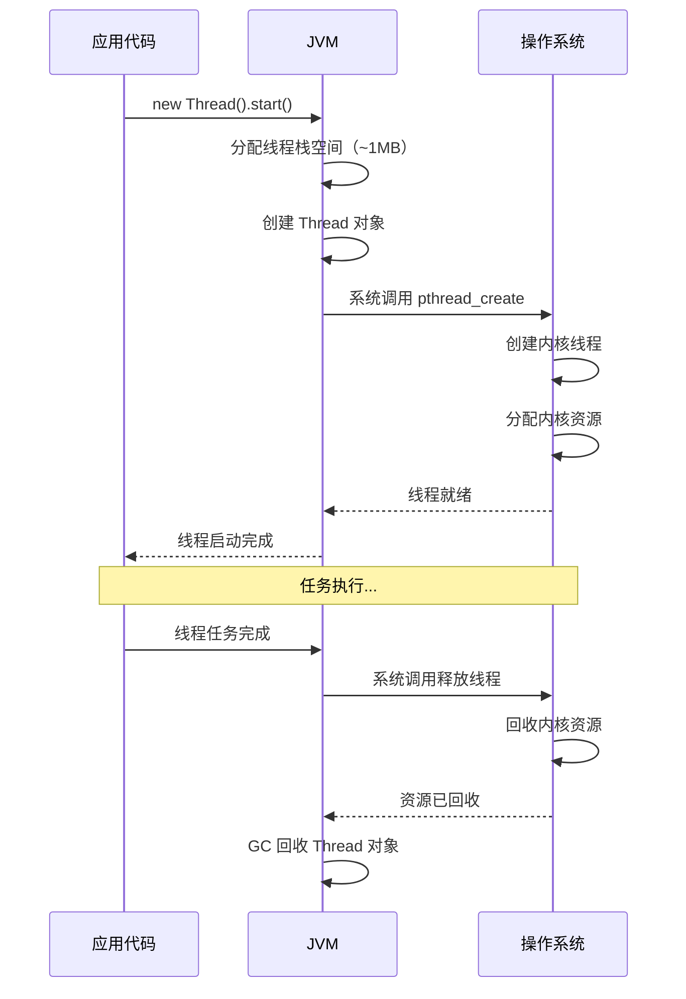

**问题量化**：

| 操作 | 大致耗时 |
|------|---------|
| 创建一个 Java 线程 | 0.5~1ms |
| 销毁一个 Java 线程 | 0.3~0.5ms |
| 上下文切换 | 1~10μs |

假设一个 Web 服务器每秒处理 10000 个请求，如果每个请求都创建一个新线程：
- 线程创建/销毁开销：10000 × 1.5ms = **15 秒**（远超 1 秒窗口）
- 内存占用：10000 × 1MB = **10GB**
- 结论：系统会立即崩溃

### 1.2 资源管理问题

不使用线程池，线程管理面临三大问题：

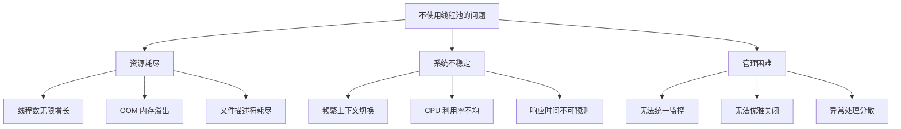

**典型反面案例**：

```java
// ❌ 错误：为每个请求创建新线程
public void handleRequest(Request request) {
    new Thread(() -> {
        processRequest(request);  // 处理业务
    }).start();
}

// 问题1：无法控制并发数，高并发下线程暴增
// 问题2：频繁创建/销毁线程，性能损耗严重
// 问题3：没有任务队列，无法缓冲突发流量
// 问题4：无法统一管理线程生命周期
// 问题5：异常无法统一处理
```

### 1.3 线程池的核心价值

线程池是一种**池化技术（Pooling）**，核心思想是**资源复用**。

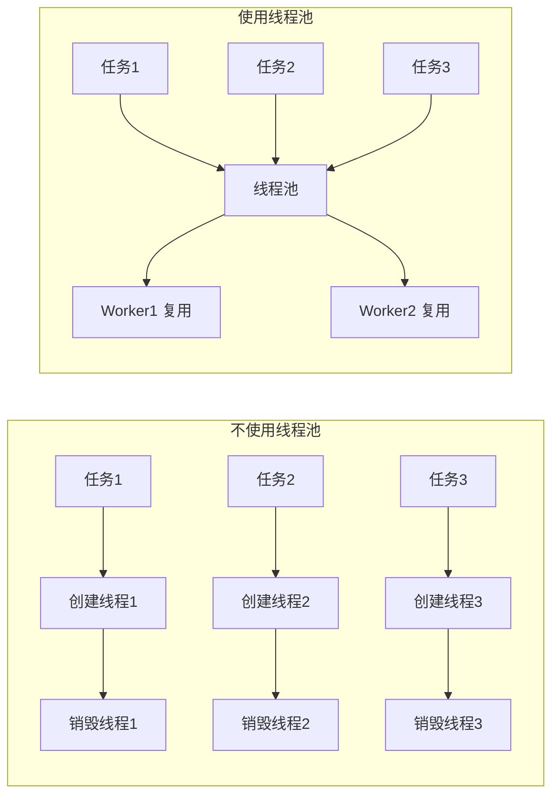

线程池的**四大核心优势**：

| 优势 | 说明 | 类比 |
|------|------|------|
| **降低资源消耗** | 线程被复用，避免反复创建/销毁 | 出租车：用完不拆，下一位继续坐 |
| **提高响应速度** | 任务到来时直接执行，无需等待线程创建 | 银行：窗口已有工作人员在等 |
| **控制并发数** | 限制线程上限，避免资源耗尽 | 银行：最多 10 个窗口 |
| **统一管理** | 统一监控、关闭、异常处理 | 银行：经理统一调度 |

### 1.4 池化技术的广泛应用

线程池只是池化技术的一种，实际开发中到处都有池化思想：

| 池化技术 | 说明 |
|---------|------|
| 线程池（ThreadPool） | 复用线程 |
| 连接池（ConnectionPool） | 复用数据库连接（如 HikariCP、Druid） |
| 对象池（ObjectPool） | 复用重量级对象（如 Apache Commons Pool） |
| 内存池（MemoryPool） | 预分配内存块复用（如 Netty 的 ByteBuf） |
| 常量池（String Pool） | JVM 字符串常量复用 |

---

## 2. 线程池核心参数详解

### 2.1 ThreadPoolExecutor 构造方法

`ThreadPoolExecutor` 是 Java 线程池的**核心实现类**，其最完整的构造方法有 **7 个参数**：

```java
public ThreadPoolExecutor(
    int corePoolSize,                    // 核心线程数
    int maximumPoolSize,                 // 最大线程数
    long keepAliveTime,                  // 非核心线程空闲存活时间
    TimeUnit unit,                       // 时间单位
    BlockingQueue<Runnable> workQueue,   // 工作队列
    ThreadFactory threadFactory,         // 线程工厂
    RejectedExecutionHandler handler     // 拒绝策略
)
```

### 2.2 银行窗口模型——直观理解 7 个参数

把线程池比作一个银行营业厅，非常直观：

```mermaid
graph TB
    subgraph 银行营业厅 = 线程池
        subgraph 常驻窗口 = corePoolSize
            W1[窗口1<br/>核心线程]
            W2[窗口2<br/>核心线程]
        end
        subgraph 临时窗口 = maximumPoolSize - corePoolSize
            W3[窗口3<br/>临时线程]
            W4[窗口4<br/>临时线程]
        end
        subgraph 等候区 = workQueue
            Q1[排队客户1]
            Q2[排队客户2]
            Q3[排队客户3]
        end
    end

    CUST[新来客户=新任务] --> |"所有窗口满+等候区满"| REJECT[保安劝退=拒绝策略 handler]
    W3 --> |"空闲超过 keepAliveTime"| CLOSE[关闭临时窗口]
```

| 参数 | 银行类比 | 说明 |
|------|---------|------|
| `corePoolSize` | 常驻窗口数 | 即使没客户，窗口也保持营业 |
| `maximumPoolSize` | 最大窗口数（含临时） | 人太多时临时开放更多窗口 |
| `keepAliveTime` | 临时窗口空闲关闭时间 | 临时窗口没客户多久后关闭 |
| `unit` | 时间单位 | 秒/毫秒/分钟等 |
| `workQueue` | 等候区 | 所有窗口忙时，客户在此排队 |
| `threadFactory` | 窗口装修标准 | 决定每个窗口的名字、样式等 |
| `handler` | 保安/应急方案 | 窗口满+等候区满时怎么办 |

### 2.3 参数一：corePoolSize（核心线程数）

**定义**：线程池中**常驻**的线程数量，即使这些线程空闲也不会被回收（除非设置了 `allowCoreThreadTimeOut(true)`）。

**关键行为**：
- 线程池创建后，核心线程**不会立即创建**，而是在有任务提交时**懒加载**创建
- 可以通过 `prestartAllCoreThreads()` 预先启动所有核心线程
- 可以通过 `prestartCoreThread()` 预先启动一个核心线程

```java
ThreadPoolExecutor pool = new ThreadPoolExecutor(4, 8, 60, TimeUnit.SECONDS,
        new LinkedBlockingQueue<>(100));

// 此时线程数为 0（懒加载）
System.out.println(pool.getPoolSize()); // 0

// 预启动所有核心线程
pool.prestartAllCoreThreads();
System.out.println(pool.getPoolSize()); // 4
```

**设置建议**：
- CPU 密集型：`corePoolSize = CPU 核心数 + 1`
- IO 密集型：`corePoolSize = CPU 核心数 × 2`（或更多，取决于 IO 等待比例）

### 2.4 参数二：maximumPoolSize（最大线程数）

**定义**：线程池中允许的**最大线程数**，包括核心线程和非核心线程。

**关键行为**：
- 当核心线程满了且工作队列满了，才会创建非核心线程
- 非核心线程数 = `maximumPoolSize - corePoolSize`
- `maximumPoolSize` 必须 >= `corePoolSize`，否则抛出 `IllegalArgumentException`

```java
// 示例：corePoolSize=2, maximumPoolSize=5
// 非核心线程数 = 5 - 2 = 3
// 最多同时有 5 个线程在执行任务
```

**特殊情况**：
- 如果使用**无界队列**（如 `LinkedBlockingQueue` 不指定容量），`maximumPoolSize` 参数**无效**，因为队列永远不会满，永远不会创建非核心线程

### 2.5 参数三：keepAliveTime（空闲存活时间）

**定义**：当线程池中的线程数超过 `corePoolSize` 时，多余的空闲线程在被终止前等待新任务的**最长时间**。

**关键行为**：

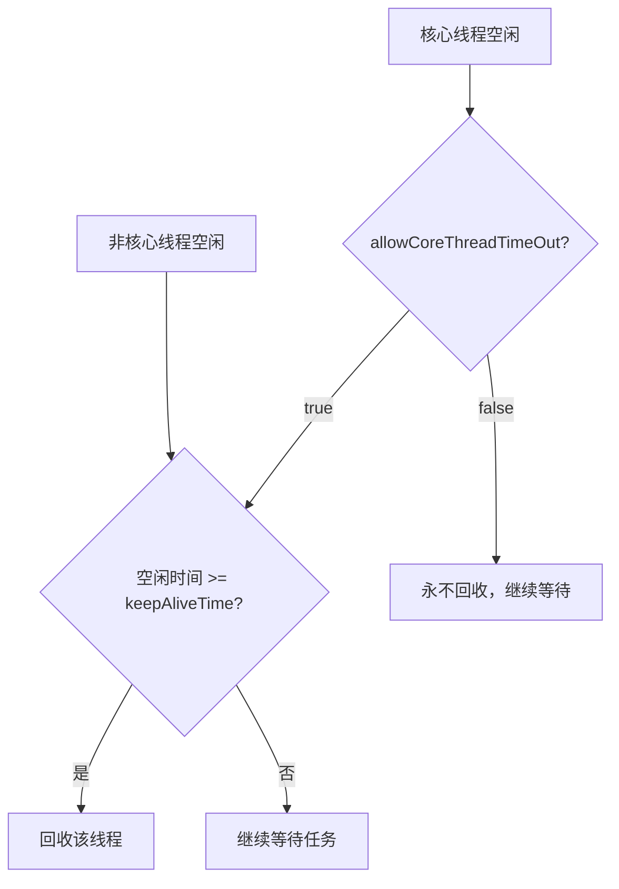

```java
// 非核心线程空闲 60 秒后回收
ThreadPoolExecutor pool = new ThreadPoolExecutor(
    2, 5, 60L, TimeUnit.SECONDS, new ArrayBlockingQueue<>(10));

// 设置核心线程也可以超时回收
pool.allowCoreThreadTimeOut(true);
// 此时所有线程空闲 60 秒后都会被回收
```

**注意**：`keepAliveTime` 设为 0 表示非核心线程一旦空闲就立即回收。

### 2.6 参数四：unit（时间单位）

**定义**：`keepAliveTime` 的时间单位，使用 `java.util.concurrent.TimeUnit` 枚举。

```java
TimeUnit.NANOSECONDS   // 纳秒
TimeUnit.MICROSECONDS  // 微秒
TimeUnit.MILLISECONDS  // 毫秒
TimeUnit.SECONDS       // 秒（最常用）
TimeUnit.MINUTES       // 分钟
TimeUnit.HOURS         // 小时
TimeUnit.DAYS          // 天
```

### 2.7 参数五：workQueue（工作队列）

**定义**：用于保存等待执行的任务的**阻塞队列**。当所有核心线程都在执行任务时，新任务会被放入此队列。

工作队列必须是 `BlockingQueue<Runnable>` 的实现类。常用的有：

| 队列类型 | 有界/无界 | 特点 | 适用场景 |
|---------|----------|------|---------|
| `ArrayBlockingQueue` | 有界 | 基于数组，FIFO | 需要控制队列大小 |
| `LinkedBlockingQueue` | 可选有界 | 基于链表，FIFO | 高吞吐场景 |
| `SynchronousQueue` | 无容量 | 不存储元素，直接传递 | CachedThreadPool |
| `PriorityBlockingQueue` | 无界 | 优先级排序 | 需要任务优先级 |
| `DelayQueue` | 无界 | 延迟获取 | 定时/延迟任务 |

> 详细分析见 [第 5 章](#5-常用阻塞队列详解)。

### 2.8 参数六：threadFactory（线程工厂）

**定义**：用于创建新线程的工厂。可以自定义线程的名称、优先级、是否守护线程等属性。

**默认工厂**：`Executors.defaultThreadFactory()`，创建的线程命名为 `pool-N-thread-M`。

**为什么要自定义？**  
在生产环境，线程命名至关重要！当出现问题需要排查时，通过线程名可以快速定位是哪个线程池的线程出了问题。

```java
// 自定义线程工厂示例
public class NamedThreadFactory implements ThreadFactory {
    private final AtomicInteger threadNumber = new AtomicInteger(1);
    private final String namePrefix;

    public NamedThreadFactory(String poolName) {
        this.namePrefix = poolName + "-worker-";
    }

    @Override
    public Thread newThread(Runnable r) {
        Thread t = new Thread(r, namePrefix + threadNumber.getAndIncrement());
        // 非守护线程
        t.setDaemon(false);
        // 设置优先级
        t.setPriority(Thread.NORM_PRIORITY);
        // 可以设置 UncaughtExceptionHandler
        t.setUncaughtExceptionHandler((thread, ex) -> {
            System.err.println("线程 " + thread.getName() + " 异常: " + ex.getMessage());
        });
        return t;
    }
}

// 使用
ThreadPoolExecutor pool = new ThreadPoolExecutor(
    4, 8, 60, TimeUnit.SECONDS,
    new ArrayBlockingQueue<>(100),
    new NamedThreadFactory("order-service"),  // 线程名：order-service-worker-1, -2, ...
    new ThreadPoolExecutor.CallerRunsPolicy()
);
```

**Google Guava 提供了更便捷的写法**：

```java
ThreadFactory factory = new ThreadFactoryBuilder()
    .setNameFormat("order-pool-%d")
    .setDaemon(false)
    .setPriority(Thread.NORM_PRIORITY)
    .setUncaughtExceptionHandler((t, e) -> log.error("线程异常", e))
    .build();
```

### 2.9 参数七：handler（拒绝策略）

**定义**：当线程池中的线程数达到 `maximumPoolSize` 且工作队列已满时，新提交的任务将被拒绝，由此策略处理。

JDK 提供了 4 种内置拒绝策略：

| 策略 | 行为 | 适用场景 |
|------|------|---------|
| `AbortPolicy` | 抛出 `RejectedExecutionException`（**默认**） | 需要感知任务被拒绝的场景 |
| `CallerRunsPolicy` | 由提交任务的线程自己执行 | 不丢弃任务，可降级处理 |
| `DiscardPolicy` | 静默丢弃被拒绝的任务 | 允许任务丢失的场景 |
| `DiscardOldestPolicy` | 丢弃队列头部（最老）任务，重新提交当前任务 | 新任务优先级高于旧任务 |

> 详细分析见 [第 4 章](#4-4-种拒绝策略)。

### 2.10 参数速查表

```
┌──────────────────────────────────────────────────────────────────┐
│                    ThreadPoolExecutor 参数总览                      │
├──────────────────┬──────────────────┬────────────────────────────┤
│ 参数              │ 类型              │ 说明                        │
├──────────────────┼──────────────────┼────────────────────────────┤
│ corePoolSize     │ int              │ 核心线程数（常驻）              │
│ maximumPoolSize  │ int              │ 最大线程数（含核心+临时）        │
│ keepAliveTime    │ long             │ 非核心线程空闲存活时间           │
│ unit             │ TimeUnit         │ keepAliveTime 的时间单位       │
│ workQueue        │ BlockingQueue    │ 任务等待队列                   │
│ threadFactory    │ ThreadFactory    │ 线程创建工厂                   │
│ handler          │ RejectedHandler  │ 拒绝策略                      │
└──────────────────┴──────────────────┴────────────────────────────┘
```

---

## 3. 线程池工作流程

### 3.1 任务提交完整流程

当调用 `execute(Runnable task)` 或 `submit(Callable task)` 提交任务时，线程池内部按以下流程处理：

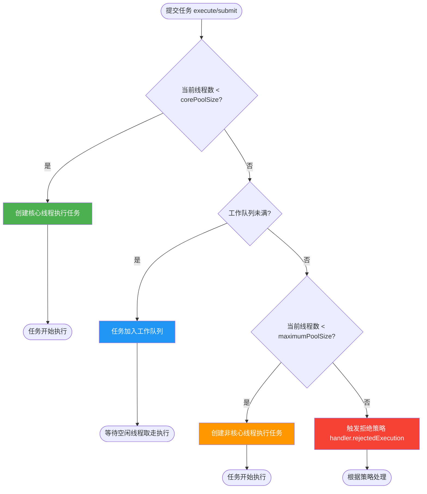

### 3.2 流程详解——三步判断

**第一步：核心线程是否已满？**
- 如果当前运行的线程数**小于** `corePoolSize`，则**创建一个新的核心线程**来执行该任务
- 即使有其他核心线程是空闲的，也优先创建新线程（直到核心线程数达到 `corePoolSize`）

**第二步：工作队列是否已满？**
- 如果核心线程数已满，则将任务**放入工作队列**等待执行
- 使用 `workQueue.offer(task)` 尝试入队，成功返回 true

**第三步：是否可以创建非核心线程？**
- 如果工作队列也满了，判断当前线程数是否小于 `maximumPoolSize`
- 如果是，则创建一个**非核心（临时）线程**来执行该任务
- 如果否（即线程数已达最大值），则**触发拒绝策略**

### 3.3 一个具体的例子

假设配置：`corePoolSize=2, maximumPoolSize=4, workQueue容量=3`

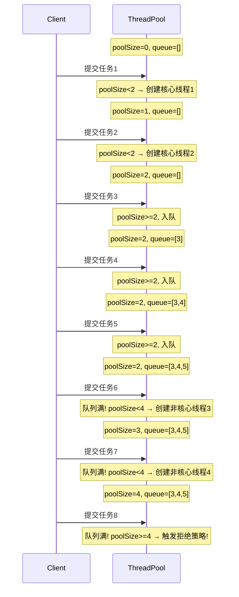

### 3.4 execute() vs submit()

| 对比维度 | `execute()` | `submit()` |
|---------|------------|-----------|
| **定义位置** | `Executor` 接口 | `ExecutorService` 接口 |
| **参数类型** | `Runnable` | `Runnable` / `Callable` |
| **返回值** | `void` | `Future<?>` / `Future<T>` |
| **异常处理** | 异常直接抛出，线程终止，触发 UncaughtExceptionHandler | 异常封装在 Future 中，需调用 `future.get()` 获取 |
| **适用场景** | 不需要获取返回值 | 需要获取返回值或异常 |

```java
// execute 方式：异常直接抛出
pool.execute(() -> {
    throw new RuntimeException("任务异常");
    // 异常会导致线程终止，触发 UncaughtExceptionHandler
    // 线程池会创建新线程补充
});

// submit 方式：异常被封装
Future<?> future = pool.submit(() -> {
    throw new RuntimeException("任务异常");
    // 异常不会直接抛出！
});

try {
    future.get(); // 只有调用 get() 时才会抛出 ExecutionException
} catch (ExecutionException e) {
    System.out.println("捕获到异常: " + e.getCause().getMessage());
}
```

**submit 的异常丢失陷阱**：

```java
// ❌ 如果不调用 future.get()，异常会被静默吞掉！
pool.submit(() -> {
    // 这里抛出的异常不会被任何地方感知
    throw new RuntimeException("消失的异常");
});
// 没有 get()，异常就像从未发生过

// ✅ 解决方案1：使用 try-catch 在任务内部捕获
pool.submit(() -> {
    try {
        riskyOperation();
    } catch (Exception e) {
        log.error("任务执行异常", e);
    }
});

// ✅ 解决方案2：始终调用 future.get()
Future<?> future = pool.submit(() -> riskyOperation());
try {
    future.get();
} catch (ExecutionException e) {
    log.error("任务执行异常", e.getCause());
}
```

---

## 4. 4 种拒绝策略

### 4.1 什么时候触发拒绝策略？

当同时满足以下两个条件时，触发拒绝策略：
1. 工作队列已满（`workQueue.offer(task)` 返回 false）
2. 当前线程数已达到 `maximumPoolSize`

此外，当线程池调用了 `shutdown()` 后，任何新提交的任务也会被拒绝。

### 4.2 AbortPolicy（中止策略，默认）

**行为**：直接抛出 `RejectedExecutionException` 异常。

```java
public static class AbortPolicy implements RejectedExecutionHandler {
    public void rejectedExecution(Runnable r, ThreadPoolExecutor e) {
        throw new RejectedExecutionException(
            "Task " + r.toString() +
            " rejected from " + e.toString());
    }
}
```

**特点**：
- 这是**默认的拒绝策略**
- 调用方能立即感知到任务被拒绝
- 如果不捕获异常，可能导致后续任务提交代码不执行

**适用场景**：
- 不允许任务丢失的关键业务
- 需要明确知道任务被拒绝的场景
- 配合异常捕获做降级处理

```java
try {
    pool.execute(task);
} catch (RejectedExecutionException e) {
    // 降级处理：写入数据库/消息队列，稍后重试
    fallbackQueue.add(task);
    log.warn("线程池满，任务进入降级队列");
}
```

### 4.3 CallerRunsPolicy（调用者运行策略）

**行为**：由**提交任务的线程**直接执行被拒绝的任务（如果线程池未关闭）。

```java
public static class CallerRunsPolicy implements RejectedExecutionHandler {
    public void rejectedExecution(Runnable r, ThreadPoolExecutor e) {
        if (!e.isShutdown()) {
            r.run();  // 注意：在调用者线程中直接执行！
        }
    }
}
```

**特点**：
- **不会丢弃任务**，也不会抛异常
- 调用者线程会被阻塞（因为要执行任务），从而**降低了任务提交速度**
- 实现了一种**反压（Back Pressure）机制**：当线程池处理不过来时，自动减缓任务提交速度

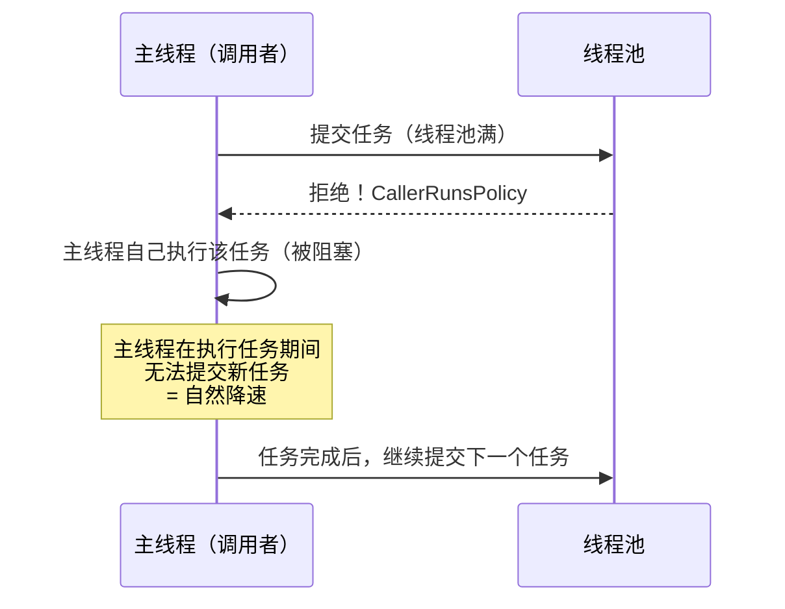

**适用场景**：
- 不能丢弃任务，且能接受任务提交速度降低
- 需要反压机制的场景
- Web 应用中处理请求任务

### 4.4 DiscardPolicy（丢弃策略）

**行为**：**静默丢弃**被拒绝的任务，不抛异常、不执行、不通知。

```java
public static class DiscardPolicy implements RejectedExecutionHandler {
    public void rejectedExecution(Runnable r, ThreadPoolExecutor e) {
        // 什么都不做！任务就这么消失了
    }
}
```

**特点**：
- 最"安静"的策略，被拒绝的任务无声无息地消失
- **危险**：可能导致任务丢失而无人察觉
- 适用于任务可丢弃且不影响业务的场景

**适用场景**：
- 日志打印等不重要的任务
- 非关键的统计计数
- 心跳检测等可丢失的任务

### 4.5 DiscardOldestPolicy（丢弃最老策略）

**行为**：**丢弃工作队列中最老的任务**（即队列头部的任务），然后尝试重新提交当前任务。

```java
public static class DiscardOldestPolicy implements RejectedExecutionHandler {
    public void rejectedExecution(Runnable r, ThreadPoolExecutor e) {
        if (!e.isShutdown()) {
            e.getQueue().poll();  // 丢弃队头（最老的）任务
            e.execute(r);         // 重新提交当前任务
        }
    }
}
```

**特点**：
- 优先保证**新任务**被执行
- 旧任务可能被"挤掉"
- 如果使用了 `PriorityBlockingQueue`，会丢弃优先级最高的任务（因为队头是优先级最高的），需要特别注意

**适用场景**：
- 实时性要求高，新数据比旧数据更重要
- 如：实时行情推送、GPS 位置更新

### 4.6 拒绝策略对比总览

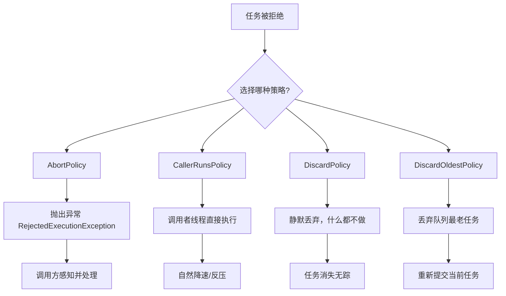

| 策略 | 抛异常 | 丢任务 | 阻塞调用者 | 适用场景 |
|------|:------:|:------:|:--------:|---------|
| AbortPolicy | ✅ | ❌ | ❌ | 关键业务，必须知道任务被拒绝 |
| CallerRunsPolicy | ❌ | ❌ | ✅ | 不能丢任务，接受降速 |
| DiscardPolicy | ❌ | ✅ | ❌ | 可丢弃的非关键任务 |
| DiscardOldestPolicy | ❌ | ✅（丢旧的） | ❌ | 新任务优先，旧任务可丢弃 |

### 4.7 自定义拒绝策略

在生产环境中，内置的 4 种策略往往不够用，通常需要**自定义拒绝策略**：

```java
/**
 * 自定义拒绝策略：记录日志 + 持久化到数据库 + 告警
 */
public class CustomRejectPolicy implements RejectedExecutionHandler {

    @Override
    public void rejectedExecution(Runnable r, ThreadPoolExecutor executor) {
        // 1. 记录日志
        log.warn("任务被拒绝: task={}, pool={}, activeCount={}, queueSize={}",
                r.toString(),
                executor.toString(),
                executor.getActiveCount(),
                executor.getQueue().size());

        // 2. 持久化到数据库或消息队列（后续可重试）
        taskRepository.saveRejectedTask(r);

        // 3. 发送告警通知
        alertService.sendAlert("线程池满载告警",
                "线程池 " + executor + " 已满，任务被拒绝");

        // 4. 可选：尝试再次提交（带超时）
        try {
            boolean offered = executor.getQueue().offer(r, 3, TimeUnit.SECONDS);
            if (!offered) {
                log.error("重试提交失败，任务最终被丢弃: {}", r);
            }
        } catch (InterruptedException e) {
            Thread.currentThread().interrupt();
            log.error("重试提交被中断", e);
        }
    }
}
```

**常见自定义策略思路**：

| 策略 | 实现思路 |
|------|---------|
| 日志记录 + 降级 | 记录被拒绝任务详情，写入降级队列 |
| 持久化重试 | 保存到 DB/Redis，由定时任务重新消费 |
| 阻塞等待 | 用 `queue.put(r)` 阻塞等待直到有空间 |
| 带超时重试 | 用 `queue.offer(r, timeout, unit)` 有限等待 |
| 告警 + 丢弃 | 发送告警后丢弃任务 |

---

## 5. 常用阻塞队列详解

### 5.1 BlockingQueue 接口

`BlockingQueue` 是 `java.util.concurrent` 包中的核心接口，提供阻塞的入队和出队操作：

| 方法 | 抛异常 | 返回特殊值 | 阻塞 | 超时 |
|------|--------|----------|------|------|
| 入队 | `add(e)` | `offer(e)` → boolean | `put(e)` | `offer(e, time, unit)` |
| 出队 | `remove()` | `poll()` → null | `take()` | `poll(time, unit)` |
| 检查 | `element()` | `peek()` → null | — | — |

### 5.2 LinkedBlockingQueue（链表阻塞队列）

**底层结构**：基于**单向链表**的阻塞队列。

```java
// 默认构造：容量为 Integer.MAX_VALUE（近似无界！）
BlockingQueue<Runnable> queue = new LinkedBlockingQueue<>();

// 指定容量：有界
BlockingQueue<Runnable> queue = new LinkedBlockingQueue<>(1000);
```

**核心特性**：

| 特性 | 说明 |
|------|------|
| 容量 | 默认 `Integer.MAX_VALUE`（约 21 亿），可指定容量 |
| 排序 | FIFO（先进先出） |
| 锁机制 | **两把锁**（putLock + takeLock），入队和出队可以并发 |
| 性能 | 吞吐量通常**高于** ArrayBlockingQueue |
| 内存 | 链表结构，每个元素有额外的 Node 开销 |

**内部锁设计**：

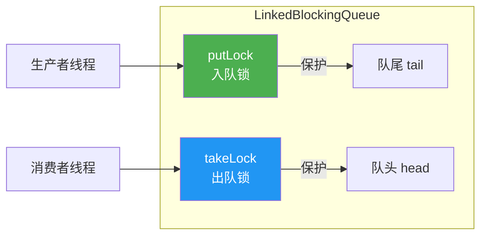

**为什么两把锁效率更高？** 因为入队操作只影响队尾，出队操作只影响队头，两者互不影响，可以并发执行。

**适用场景**：
- FixedThreadPool 和 SingleThreadExecutor 默认使用
- 高吞吐量、需要大缓冲区的场景
- **风险**：不指定容量时近似无界，可能导致 OOM

### 5.3 ArrayBlockingQueue（数组阻塞队列）

**底层结构**：基于**数组**的有界阻塞队列。

```java
// 必须指定容量
BlockingQueue<Runnable> queue = new ArrayBlockingQueue<>(100);

// 可选是否公平（FIFO 唤醒等待线程）
BlockingQueue<Runnable> queue = new ArrayBlockingQueue<>(100, true);
```

**核心特性**：

| 特性 | 说明 |
|------|------|
| 容量 | **必须指定**，创建后不可变 |
| 排序 | FIFO |
| 锁机制 | **一把锁**（ReentrantLock），入队和出队互斥 |
| 性能 | 低于 LinkedBlockingQueue（单锁竞争） |
| 内存 | 数组结构，无 Node 开销，内存紧凑 |
| 公平性 | 支持公平模式（保证等待最久的线程先获取） |

**内部结构**：

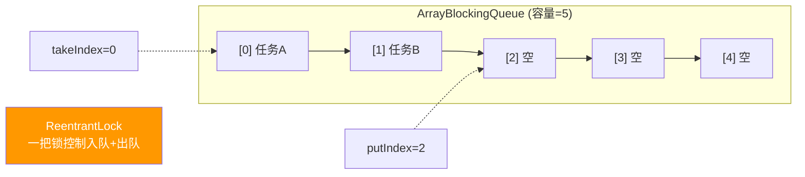

**适用场景**：
- 需要严格控制队列大小的场景
- 需要公平性保证的场景
- 内存敏感的场景

### 5.4 SynchronousQueue（同步移交队列）

**底层结构**：一个**不存储元素**的特殊队列。每个插入操作必须等待另一个线程的移除操作，反之亦然。

```java
BlockingQueue<Runnable> queue = new SynchronousQueue<>();

// 默认非公平（使用栈 TransferStack），可选公平（使用队列 TransferQueue）
BlockingQueue<Runnable> queue = new SynchronousQueue<>(true);
```

**核心特性**：

| 特性 | 说明 |
|------|------|
| 容量 | **0**（不存储任何元素） |
| 行为 | 生产者和消费者必须**一对一配对** |
| `offer()` | 如果没有消费者等待，立即返回 false |
| `put()` | 阻塞直到有消费者取走 |
| `size()` | 永远返回 0 |
| `peek()` | 永远返回 null |

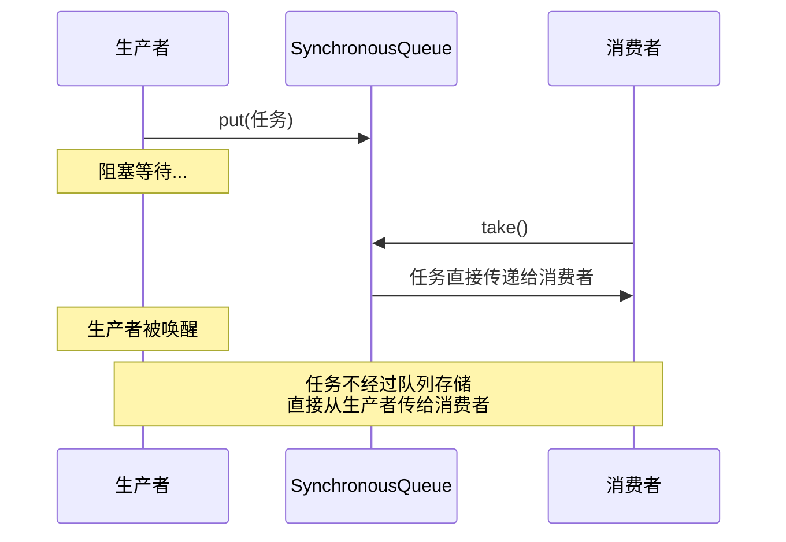

**适用场景**：
- CachedThreadPool 使用
- 需要直接传递任务的场景
- 高并发且任务处理速度快的场景

### 5.5 PriorityBlockingQueue（优先级阻塞队列）

**底层结构**：基于**二叉堆（最小堆）** 的无界优先级队列。

```java
// 元素必须实现 Comparable 接口，或提供 Comparator
BlockingQueue<Runnable> queue = new PriorityBlockingQueue<>();

// 指定初始容量和比较器
BlockingQueue<Runnable> queue = new PriorityBlockingQueue<>(100,
    Comparator.comparingInt(task -> ((PriorityTask) task).getPriority()));
```

**核心特性**：

| 特性 | 说明 |
|------|------|
| 容量 | **无界**（会自动扩容） |
| 排序 | 按优先级排序（最小堆） |
| 线程安全 | 使用 ReentrantLock |
| FIFO？ | **不保证** FIFO，同优先级元素顺序不确定 |
| 入队 | 永远不会阻塞（无界） |
| 出队 | 没有元素时阻塞 |

**适用场景**：
- 任务有优先级区分（如 VIP 用户请求优先处理）
- 需要按权重调度任务
- **注意**：无界，可能 OOM

### 5.6 DelayQueue（延迟队列）

**底层结构**：基于 `PriorityBlockingQueue` 实现的**无界延迟队列**。元素必须实现 `Delayed` 接口。

```java
// 元素必须实现 Delayed 接口
class DelayedTask implements Delayed {
    private final long executeTime; // 执行时间点

    public DelayedTask(long delayMillis) {
        this.executeTime = System.currentTimeMillis() + delayMillis;
    }

    @Override
    public long getDelay(TimeUnit unit) {
        long diff = executeTime - System.currentTimeMillis();
        return unit.convert(diff, TimeUnit.MILLISECONDS);
    }

    @Override
    public int compareTo(Delayed other) {
        return Long.compare(this.getDelay(TimeUnit.MILLISECONDS),
                           other.getDelay(TimeUnit.MILLISECONDS));
    }
}
```

**核心特性**：

| 特性 | 说明 |
|------|------|
| 容量 | 无界 |
| 取出条件 | 元素的延迟时间到期后才能被取出 |
| 排序 | 按延迟到期时间排序（最快到期的在队头） |
| 入队 | 永远不会阻塞 |
| 出队 | 没有到期元素时阻塞 |

**适用场景**：
- 定时任务调度（ScheduledThreadPoolExecutor 内部使用的 DelayedWorkQueue 类似）
- 订单超时取消
- 缓存过期清理
- 重试机制（延迟重试）

### 5.7 队列对比总览

| 队列 | 底层 | 有界/无界 | 锁 | 排序 | 适用场景 |
|------|------|----------|-----|------|---------|
| `ArrayBlockingQueue` | 数组 | 有界 | 单锁 | FIFO | 有界线程池 |
| `LinkedBlockingQueue` | 链表 | 可选 | 双锁 | FIFO | 高吞吐场景 |
| `SynchronousQueue` | 无存储 | 容量0 | CAS | — | 直接传递 |
| `PriorityBlockingQueue` | 堆 | 无界 | 单锁 | 优先级 | 任务分优先级 |
| `DelayQueue` | 堆 | 无界 | 单锁 | 延迟时间 | 延迟/定时任务 |

---

## 6. Executors 工厂方法

### 6.1 概述

`Executors` 是 JDK 提供的线程池工厂工具类，提供了几种快速创建线程池的静态方法。

> ⚠️ **重要提醒**：**阿里巴巴 Java 开发手册明确规定禁止使用 Executors 创建线程池**，必须通过 `ThreadPoolExecutor` 手动创建。

### 6.2 newFixedThreadPool（固定大小线程池）

```java
public static ExecutorService newFixedThreadPool(int nThreads) {
    return new ThreadPoolExecutor(
        nThreads,                           // corePoolSize = nThreads
        nThreads,                           // maximumPoolSize = nThreads（核心=最大）
        0L, TimeUnit.MILLISECONDS,          // 无空闲超时
        new LinkedBlockingQueue<Runnable>() // ⚠️ 无界队列！
    );
}
```

**参数分析**：

| 参数 | 值 | 说明 |
|------|-----|------|
| corePoolSize | nThreads | 固定线程数 |
| maximumPoolSize | nThreads | 等于核心线程数（无非核心线程） |
| keepAliveTime | 0 | 不生效（没有非核心线程） |
| workQueue | `LinkedBlockingQueue()` | **无界队列（默认容量 Integer.MAX_VALUE）** |

**行为特点**：
- 线程数固定不变
- 任务多于线程数时进入无界队列排队
- **永远不会触发拒绝策略**（队列无界，永远放得进去）

**致命问题**：

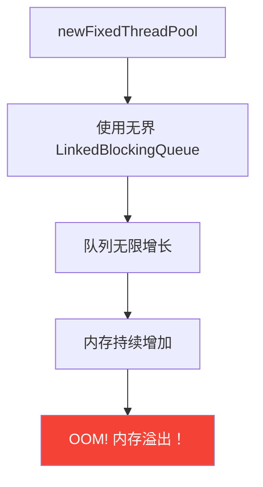

```java
// ❌ 危险示例
ExecutorService pool = Executors.newFixedThreadPool(2);
// 如果任务提交速度远大于处理速度
// 队列会无限增长 → OOM
for (int i = 0; i < Integer.MAX_VALUE; i++) {
    pool.execute(() -> {
        try { Thread.sleep(1000); } catch (InterruptedException e) {}
    });
}
// 最终会报 java.lang.OutOfMemoryError: GC overhead limit exceeded
```

### 6.3 newSingleThreadExecutor（单线程线程池）

```java
public static ExecutorService newSingleThreadExecutor() {
    return new FinalizableDelegatedExecutorService(
        new ThreadPoolExecutor(
            1, 1,                               // 只有 1 个线程
            0L, TimeUnit.MILLISECONDS,
            new LinkedBlockingQueue<Runnable>()  // ⚠️ 无界队列！
        )
    );
}
```

**参数分析**：

| 参数 | 值 | 说明 |
|------|-----|------|
| corePoolSize | 1 | 只有一个线程 |
| maximumPoolSize | 1 | 最大也是一个 |
| workQueue | `LinkedBlockingQueue()` | **无界队列** |

**行为特点**：
- 所有任务**串行执行**（保证任务按提交顺序依次完成）
- 如果线程异常终止，会创建新线程替代
- 被 `FinalizableDelegatedExecutorService` 包装，**不能强转为 ThreadPoolExecutor** 来修改参数

**致命问题**：同 FixedThreadPool，使用无界队列，可能 OOM。

**适用场景（如果手动创建的话）**：
- 需要保证任务顺序执行
- 如：日志写入、事件总线消费

### 6.4 newCachedThreadPool（缓存线程池）

```java
public static ExecutorService newCachedThreadPool() {
    return new ThreadPoolExecutor(
        0,                                  // corePoolSize = 0（无核心线程）
        Integer.MAX_VALUE,                  // ⚠️ maximumPoolSize = 无限！
        60L, TimeUnit.SECONDS,              // 空闲 60 秒回收
        new SynchronousQueue<Runnable>()    // 不存储任务，直接传递
    );
}
```

**参数分析**：

| 参数 | 值 | 说明 |
|------|-----|------|
| corePoolSize | 0 | 没有核心线程 |
| maximumPoolSize | `Integer.MAX_VALUE` | **约 21 亿！** |
| keepAliveTime | 60 秒 | 空闲线程 60 秒后回收 |
| workQueue | `SynchronousQueue` | 不存储元素，直接传递 |

**行为特点**：
- 每来一个任务，如果没有空闲线程，就创建一个新线程
- 空闲线程 60 秒后回收
- 适合大量短期异步任务

**致命问题**：

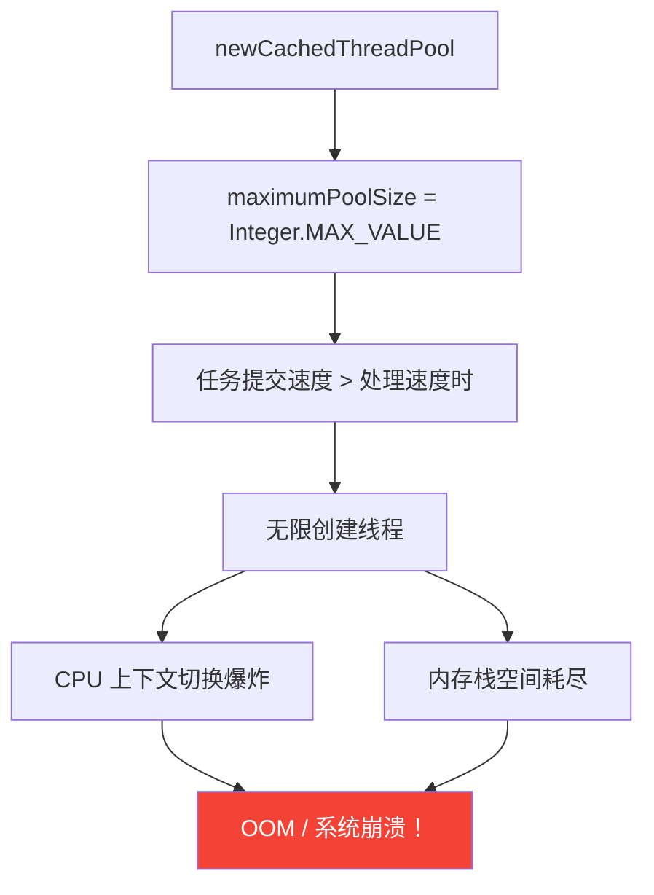

```java
// ❌ 危险示例
ExecutorService pool = Executors.newCachedThreadPool();
for (int i = 0; i < 100000; i++) {
    pool.execute(() -> {
        try { Thread.sleep(10000); } catch (InterruptedException e) {}
    });
}
// 会创建 100000 个线程！
// java.lang.OutOfMemoryError: unable to create native thread
```

### 6.5 newScheduledThreadPool（定时任务线程池）

```java
public static ScheduledExecutorService newScheduledThreadPool(int corePoolSize) {
    return new ScheduledThreadPoolExecutor(corePoolSize);
    // 内部：
    // super(corePoolSize, Integer.MAX_VALUE, 0, NANOSECONDS,
    //       new DelayedWorkQueue());
}
```

**参数分析**：

| 参数 | 值 | 说明 |
|------|-----|------|
| corePoolSize | 用户指定 | 核心线程数 |
| maximumPoolSize | `Integer.MAX_VALUE` | **无限** |
| workQueue | `DelayedWorkQueue` | 基于堆的延迟队列（**无界**） |

**致命问题**：maximumPoolSize 为 Integer.MAX_VALUE，理论上可无限创建线程。

### 6.6 为什么阿里规范禁止使用 Executors？

**阿里巴巴 Java 开发手册原文**：

> 【强制】线程池不允许使用 Executors 去创建，而是通过 ThreadPoolExecutor 的方式，这样的处理方式让写的同学更加明确线程池的运行规则，规避资源耗尽的风险。

**根本原因总结**：

| 方法 | 风险 | 原因 |
|------|------|------|
| `newFixedThreadPool` | **OOM** | 无界队列 `LinkedBlockingQueue`，任务堆积 |
| `newSingleThreadExecutor` | **OOM** | 无界队列 `LinkedBlockingQueue`，任务堆积 |
| `newCachedThreadPool` | **OOM** | `maximumPoolSize = Integer.MAX_VALUE`，无限创建线程 |
| `newScheduledThreadPool` | **OOM** | `maximumPoolSize = Integer.MAX_VALUE` + 无界队列 |

**正确做法**：

```java
// ✅ 手动创建 ThreadPoolExecutor
ThreadPoolExecutor pool = new ThreadPoolExecutor(
    4,                                      // 核心线程数：明确指定
    8,                                      // 最大线程数：明确指定
    60L, TimeUnit.SECONDS,                  // 空闲超时
    new ArrayBlockingQueue<>(200),          // 有界队列：明确指定容量
    new NamedThreadFactory("business"),     // 自定义线程工厂
    new ThreadPoolExecutor.CallerRunsPolicy() // 明确拒绝策略
);
```

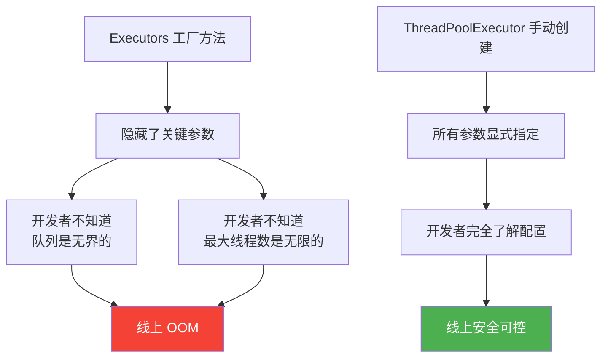

---

## 7. ThreadPoolExecutor 源码深度分析

### 7.1 ctl 字段设计（核心中的核心）

ThreadPoolExecutor 使用一个 **`AtomicInteger ctl`** 字段同时保存两个信息：
- **高 3 位**：线程池的运行状态（runState）
- **低 29 位**：工作线程的数量（workerCount）

```java
// 源码
private final AtomicInteger ctl = new AtomicInteger(ctlOf(RUNNING, 0));

private static final int COUNT_BITS = Integer.SIZE - 3; // 29
private static final int CAPACITY   = (1 << COUNT_BITS) - 1; // 约 5.3 亿

// 线程池状态（高3位）
private static final int RUNNING    = -1 << COUNT_BITS; // 111 00000...
private static final int SHUTDOWN   =  0 << COUNT_BITS; // 000 00000...
private static final int STOP       =  1 << COUNT_BITS; // 001 00000...
private static final int TIDYING    =  2 << COUNT_BITS; // 010 00000...
private static final int TERMINATED =  3 << COUNT_BITS; // 011 00000...

// 位运算方法：解包 ctl
private static int runStateOf(int c)     { return c & ~CAPACITY; } // 取高3位
private static int workerCountOf(int c)  { return c & CAPACITY; }  // 取低29位
private static int ctlOf(int rs, int wc) { return rs | wc; }      // 打包
```

**为什么这样设计？**

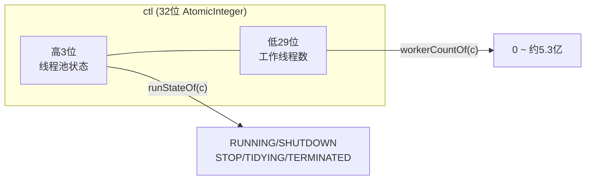

**好处**：
1. **原子性**：一个 CAS 操作可以同时更新状态和线程数，避免锁竞争
2. **高效**：位运算比使用两个 AtomicInteger 更快，减少内存开销
3. **一致性**：读取时总是获得一致的快照（状态和线程数是一起变化的）

**位运算详解**：

```
CAPACITY  = 0001_1111_1111_1111_1111_1111_1111_1111  (29个1)
~CAPACITY = 1110_0000_0000_0000_0000_0000_0000_0000  (高3位全1)

假设 ctl = 1110_0000_0000_0000_0000_0000_0000_0011 (RUNNING, 3个线程)

runStateOf(ctl)    = ctl & ~CAPACITY
                   = 1110_0000_..._0011 & 1110_0000_..._0000
                   = 1110_0000_..._0000  → RUNNING

workerCountOf(ctl) = ctl & CAPACITY
                   = 1110_0000_..._0011 & 0001_1111_..._1111
                   = 0000_0000_..._0011  → 3 个线程
```

### 7.2 5 种线程池状态

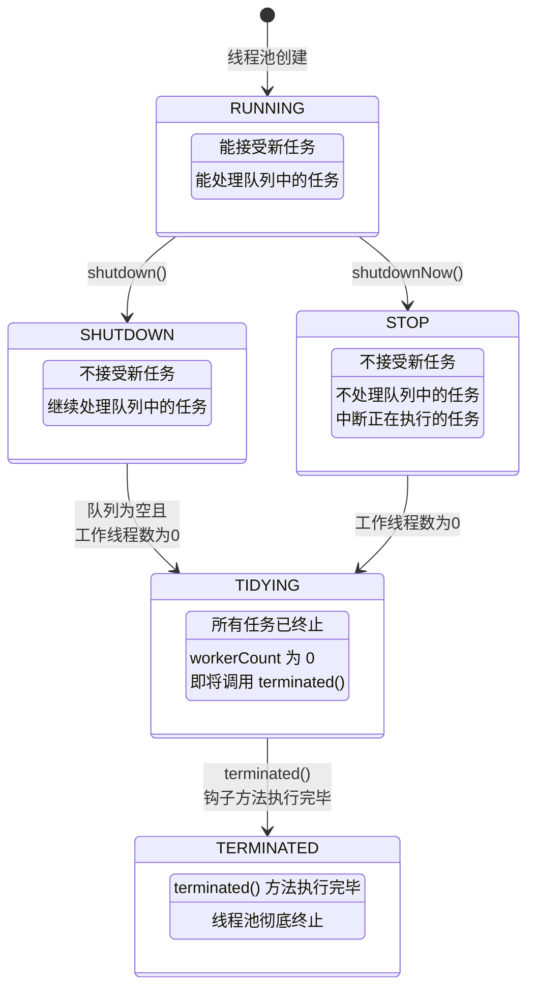

**状态详解**：

| 状态 | 高3位 | 接受新任务 | 处理队列任务 | 中断执行中任务 | 说明 |
|------|:-----:|:--------:|:----------:|:----------:|------|
| **RUNNING** | 111 | ✅ | ✅ | ❌ | 正常运行状态 |
| **SHUTDOWN** | 000 | ❌ | ✅ | ❌ | 优雅关闭中 |
| **STOP** | 001 | ❌ | ❌ | ✅ | 强制关闭中 |
| **TIDYING** | 010 | ❌ | ❌ | — | 所有任务结束，线程数为0 |
| **TERMINATED** | 011 | ❌ | ❌ | — | 彻底终止 |

**状态转换条件**：

```
RUNNING → SHUTDOWN   : 调用 shutdown()
RUNNING → STOP       : 调用 shutdownNow()
SHUTDOWN → STOP      : 调用 shutdownNow()
SHUTDOWN → TIDYING   : 队列为空 && 工作线程数为 0
STOP → TIDYING       : 工作线程数为 0
TIDYING → TERMINATED : terminated() 钩子方法执行完毕
```

**重要**：状态值是**单调递增**的（RUNNING < SHUTDOWN < STOP < TIDYING < TERMINATED），源码中用 `>=` 比较来判断状态。

```java
// 源码中常见的状态判断模式
private static boolean isRunning(int c) {
    return c < SHUTDOWN; // RUNNING 的值是负数（高3位111），小于 SHUTDOWN(000)
}
```

### 7.3 execute() 方法源码逐行分析

这是线程池最核心的方法，理解它就理解了线程池的核心逻辑。

```java
public void execute(Runnable command) {
    // 1. 空任务检查
    if (command == null)
        throw new NullPointerException();

    // 2. 获取 ctl 值（包含线程池状态 + 工作线程数）
    int c = ctl.get();

    // ========== 第一步：核心线程是否已满？ ==========
    if (workerCountOf(c) < corePoolSize) {
        // 工作线程数 < 核心线程数 → 创建核心线程
        if (addWorker(command, true))  // true 表示以核心线程身份添加
            return;                     // 成功，返回
        c = ctl.get();                  // 失败（可能并发修改），重新获取 ctl
    }

    // ========== 第二步：能否入队？ ==========
    if (isRunning(c) && workQueue.offer(command)) {
        // 线程池正在运行，且任务成功入队
        int recheck = ctl.get();
        // 再次检查线程池状态（double-check）
        if (!isRunning(recheck) && remove(command))
            // 如果入队后线程池已经不是 RUNNING 状态了，移除任务并拒绝
            reject(command);
        else if (workerCountOf(recheck) == 0)
            // 如果当前没有工作线程了（都已经回收了），创建一个空任务的线程去处理队列
            addWorker(null, false);
    }
    // ========== 第三步：创建非核心线程 ==========
    else if (!addWorker(command, false))  // false 表示以非核心线程身份添加
        // 创建非核心线程失败 → 拒绝任务
        reject(command);
}
```

**流程图**：

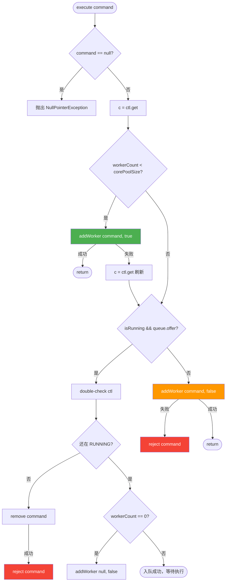

**execute() 三步判断中的关键细节**：

1. **为什么 addWorker 失败后要重新获取 ctl？**  
   因为在并发环境下，其他线程可能已经修改了线程池状态或线程数

2. **为什么入队后要 double-check？**  
   因为在 `offer` 成功后、检查状态前，线程池可能被关闭了。如果不检查，任务会留在队列中但无人执行

3. **`workerCountOf(recheck) == 0` 是什么情况？**  
   所有线程都已经退出了（如 `allowCoreThreadTimeOut(true)` 且所有线程超时），需要创建一个线程来处理队列中的任务

### 7.4 addWorker() 方法源码分析

`addWorker` 负责创建新的工作线程并启动。参数 `core` 决定以核心线程还是非核心线程的身份添加。

```java
private boolean addWorker(Runnable firstTask, boolean core) {
    // ========== 外层循环：检查状态 ==========
    retry:
    for (;;) {
        int c = ctl.get();
        int rs = runStateOf(c);

        // 状态检查：如果线程池已关闭，通常拒绝添加
        // 特殊情况：SHUTDOWN 状态 + firstTask==null + 队列非空
        //          → 允许添加线程来处理剩余队列任务
        if (rs >= SHUTDOWN &&
            ! (rs == SHUTDOWN && firstTask == null && ! workQueue.isEmpty()))
            return false;

        // ========== 内层循环：CAS 增加线程数 ==========
        for (;;) {
            int wc = workerCountOf(c);
            // 线程数超限检查
            if (wc >= CAPACITY ||
                wc >= (core ? corePoolSize : maximumPoolSize))
                return false;
            // CAS 增加线程数
            if (compareAndIncrementWorkerCount(c))
                break retry;  // 成功，跳出双层循环
            // CAS 失败，重新读取 ctl
            c = ctl.get();
            if (runStateOf(c) != rs)
                continue retry;  // 状态变了，重新外层循环
            // 状态没变，只是线程数变了，继续内层循环重试 CAS
        }
    }

    // ========== 线程数已增加，开始创建 Worker ==========
    boolean workerStarted = false;
    boolean workerAdded = false;
    Worker w = null;
    try {
        w = new Worker(firstTask);  // 创建 Worker（内部创建 Thread）
        final Thread t = w.thread;
        if (t != null) {
            final ReentrantLock mainLock = this.mainLock;
            mainLock.lock();  // 获取全局锁
            try {
                int rs = runStateOf(ctl.get());
                // 再次检查状态
                if (rs < SHUTDOWN ||
                    (rs == SHUTDOWN && firstTask == null)) {
                    if (t.isAlive())
                        throw new IllegalThreadStateException();
                    workers.add(w);  // 加入 workers 集合
                    int s = workers.size();
                    if (s > largestPoolSize)
                        largestPoolSize = s;  // 更新历史最大线程数
                    workerAdded = true;
                }
            } finally {
                mainLock.unlock();
            }
            if (workerAdded) {
                t.start();  // 启动线程！
                workerStarted = true;
            }
        }
    } finally {
        if (!workerStarted)
            addWorkerFailed(w);  // 启动失败，回滚
    }
    return workerStarted;
}
```

**addWorker 关键流程**：

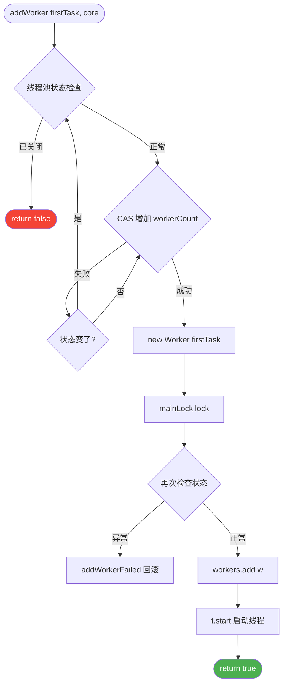

### 7.5 Worker 内部类的设计

Worker 是 ThreadPoolExecutor 的核心内部类，它同时**继承了 AQS**（简单独占锁）并**实现了 Runnable**。

```java
private final class Worker
    extends AbstractQueuedSynchronizer
    implements Runnable {

    final Thread thread;    // Worker 对应的线程
    Runnable firstTask;     // 初始任务（可为 null）
    volatile long completedTasks; // 已完成任务数

    Worker(Runnable firstTask) {
        setState(-1); // 禁止中断，直到 runWorker
        this.firstTask = firstTask;
        this.thread = getThreadFactory().newThread(this); // 用工厂创建线程
    }

    public void run() {
        runWorker(this);  // 委托给外部类的 runWorker 方法
    }

    // ========== AQS 锁方法 ==========
    // Worker 的锁是不可重入的！（与 ReentrantLock 不同）
    protected boolean isHeldExclusively() {
        return getState() != 0;
    }

    protected boolean tryAcquire(int unused) {
        if (compareAndSetState(0, 1)) {  // 只能从 0 变为 1
            setExclusiveOwnerThread(Thread.currentThread());
            return true;
        }
        return false;
    }

    protected boolean tryRelease(int unused) {
        setExclusiveOwnerThread(null);
        setState(0);
        return true;
    }

    public void lock()        { acquire(1); }
    public boolean tryLock()  { return tryAcquire(1); }
    public void unlock()      { release(1); }
    public boolean isLocked() { return isHeldExclusively(); }
}
```

**为什么 Worker 要继承 AQS？**

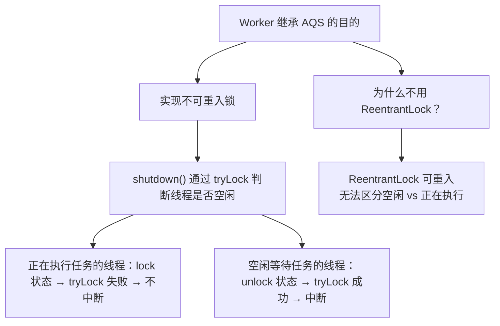

**关键设计点**：
1. **不可重入**：Worker 锁是不可重入的（`tryAcquire` 只能从 0→1），这样 `shutdown()` 时通过 `tryLock()` 能准确判断 Worker 是否正在执行任务
2. **初始状态 -1**：`setState(-1)` 防止 Worker 在 `runWorker` 执行前被中断
3. **线程创建**：通过 ThreadFactory 创建线程，`this`（Worker 自身，实现了 Runnable）作为任务传入

### 7.6 runWorker() 方法源码分析

`runWorker` 是 Worker 线程的核心执行循环，负责不断从队列获取任务并执行。

```java
final void runWorker(Worker w) {
    Thread wt = Thread.currentThread();
    Runnable task = w.firstTask;  // 取出第一个任务
    w.firstTask = null;
    w.unlock(); // 将 state 从 -1 改为 0，允许中断
    boolean completedAbruptly = true;  // 是否异常终止
    try {
        // ========== 核心循环：获取任务并执行 ==========
        while (task != null || (task = getTask()) != null) {
            w.lock();  // 上锁：标记正在执行任务

            // 中断检查：
            // 如果线程池 >= STOP，确保线程被中断
            // 如果线程池 < STOP，确保线程未被中断
            if ((runStateAtLeast(ctl.get(), STOP) ||
                 (Thread.interrupted() && runStateAtLeast(ctl.get(), STOP))) &&
                !wt.isInterrupted())
                wt.interrupt();

            try {
                beforeExecute(wt, task);  // 钩子方法：任务执行前
                Throwable thrown = null;
                try {
                    task.run();           // ★ 执行任务！
                } catch (RuntimeException x) {
                    thrown = x; throw x;
                } catch (Error x) {
                    thrown = x; throw x;
                } catch (Throwable x) {
                    thrown = x; throw new Error(x);
                } finally {
                    afterExecute(task, thrown);  // 钩子方法：任务执行后
                }
            } finally {
                task = null;
                w.completedTasks++;
                w.unlock();  // 解锁：标记空闲
            }
        }
        completedAbruptly = false;
    } finally {
        processWorkerExit(w, completedAbruptly);  // 线程退出处理
    }
}
```

**runWorker 流程图**：

```mermaid
flowchart TD
    A([Worker.run → runWorker]) --> B[取出 firstTask]
    B --> C[w.unlock 允许中断]
    C --> LOOP

    LOOP{task != null 或<br/>getTask 返回任务?}
    LOOP -- 否 --> EXIT[processWorkerExit<br/>线程退出]
    LOOP -- 是 --> LOCK[w.lock 标记忙碌]

    LOCK --> INT_CHECK{中断状态检查}
    INT_CHECK --> BEFORE[beforeExecute 钩子]
    BEFORE --> RUN["task.run() 执行任务"]
    RUN --> AFTER[afterExecute 钩子]
    AFTER --> UNLOCK[w.unlock 标记空闲]
    UNLOCK --> LOOP

    RUN -- 异常 --> AFTER
    AFTER --> UNLOCK

    style RUN fill:#4CAF50,color:#fff
    style EXIT fill:#F44336,color:#fff
```

**核心要点**：
1. **firstTask 优先执行**：创建 Worker 时带入的第一个任务不需要从队列获取
2. **循环获取**：`while (task != null || (task = getTask()) != null)` 保证线程持续运行
3. **lock/unlock**：执行任务期间加锁，用于 `shutdown()` 时判断线程是否空闲
4. **钩子方法**：`beforeExecute` 和 `afterExecute` 可以被子类重写，用于监控、日志等
5. **异常处理**：任务抛出异常后，该 Worker 会退出，但线程池会创建新线程补充

### 7.7 getTask() 方法源码分析

`getTask` 从工作队列获取待执行的任务，也是**线程回收**的关键。

```java
private Runnable getTask() {
    boolean timedOut = false; // 上一次 poll 是否超时

    for (;;) {
        int c = ctl.get();
        int rs = runStateOf(c);

        // ========== 状态检查 ==========
        // SHUTDOWN + 队列为空 → 不需要再处理了
        // STOP 状态 → 不管队列有没有任务，都不取了
        if (rs >= SHUTDOWN && (rs >= STOP || workQueue.isEmpty())) {
            decrementWorkerCount();  // 减少线程数
            return null;             // 返回 null → runWorker 退出循环 → 线程终止
        }

        int wc = workerCountOf(c);

        // ========== 判断是否需要超时回收 ==========
        // 两种情况需要超时回收：
        // 1. allowCoreThreadTimeOut 为 true
        // 2. 当前线程数 > corePoolSize（有非核心线程）
        boolean timed = allowCoreThreadTimeOut || wc > corePoolSize;

        // ========== 线程回收判断 ==========
        if ((wc > maximumPoolSize || (timed && timedOut))
            && (wc > 1 || workQueue.isEmpty())) {
            // CAS 减少线程数
            if (compareAndDecrementWorkerCount(c))
                return null;  // 返回 null → 线程退出
            continue;         // CAS 失败，重试
        }

        // ========== 从队列获取任务 ==========
        try {
            Runnable r = timed ?
                workQueue.poll(keepAliveTime, TimeUnit.NANOSECONDS) : // 超时获取
                workQueue.take();  // 无限等待
            if (r != null)
                return r;
            timedOut = true;  // poll 超时了
        } catch (InterruptedException retry) {
            timedOut = false;  // 被中断，不算超时
        }
    }
}
```

**核心线程 vs 非核心线程的超时机制**：

```mermaid
flowchart TD
    A[getTask 开始] --> B{状态检查}
    B -- "STOP 或 SHUTDOWN+队列空" --> RETURN_NULL[return null<br/>线程退出]

    B -- 正常 --> C{需要超时回收?<br/>allowCoreThreadTimeOut<br/>或 wc > corePoolSize}

    C -- 需要超时 --> POLL["workQueue.poll(keepAliveTime)"]
    POLL -- 超时返回null --> TIMEOUT[timedOut = true]
    TIMEOUT --> D{CAS 减少线程数}
    D -- 成功 --> RETURN_NULL
    D -- 失败 --> A

    POLL -- 获取到任务 --> RETURN_TASK[return task]

    C -- 不需要超时 --> TAKE["workQueue.take()"]
    TAKE -- 阻塞等待直到有任务 --> RETURN_TASK

    style RETURN_NULL fill:#F44336,color:#fff
    style RETURN_TASK fill:#4CAF50,color:#fff
```

**关键理解**：
- **核心线程**（wc <= corePoolSize 且 allowCoreThreadTimeOut=false）：使用 `take()` **无限阻塞等待**任务，所以核心线程不会退出
- **非核心线程**（wc > corePoolSize 或 allowCoreThreadTimeOut=true）：使用 `poll(keepAliveTime)` **超时等待**，超时后返回 null，线程退出

> **本质**：核心线程和非核心线程在代码层面没有区别！唯一的区别是获取任务时是否带超时。线程池通过控制 `take()` 还是 `poll()` 来决定线程是否会被回收。

### 7.8 shutdown() vs shutdownNow() 的区别

#### shutdown()

```java
public void shutdown() {
    final ReentrantLock mainLock = this.mainLock;
    mainLock.lock();
    try {
        checkShutdownAccess();        // 安全检查
        advanceRunState(SHUTDOWN);    // 将状态推进到 SHUTDOWN
        interruptIdleWorkers();       // 中断空闲线程
        onShutdown();                 // 钩子（ScheduledThreadPoolExecutor 用）
    } finally {
        mainLock.unlock();
    }
    tryTerminate();                    // 尝试终止
}

// interruptIdleWorkers 的关键：通过 tryLock 判断是否空闲
private void interruptIdleWorkers(boolean onlyOne) {
    final ReentrantLock mainLock = this.mainLock;
    mainLock.lock();
    try {
        for (Worker w : workers) {
            Thread t = w.thread;
            if (!t.isInterrupted() && w.tryLock()) {  // tryLock 成功 = 线程空闲
                try {
                    t.interrupt();  // 中断空闲线程
                } catch (SecurityException ignore) {
                } finally {
                    w.unlock();
                }
            }
        }
    } finally {
        mainLock.unlock();
    }
}
```

#### shutdownNow()

```java
public List<Runnable> shutdownNow() {
    List<Runnable> tasks;
    final ReentrantLock mainLock = this.mainLock;
    mainLock.lock();
    try {
        checkShutdownAccess();
        advanceRunState(STOP);            // 将状态推进到 STOP
        interruptWorkers();               // 中断所有线程（不管是否空闲）
        tasks = drainQueue();             // 取出队列中未执行的任务
    } finally {
        mainLock.unlock();
    }
    tryTerminate();
    return tasks;                          // 返回未执行的任务列表
}

// interruptWorkers：中断所有已启动的线程
private void interruptWorkers() {
    final ReentrantLock mainLock = this.mainLock;
    mainLock.lock();
    try {
        for (Worker w : workers)
            w.interruptIfStarted();  // 不管是否空闲，直接中断
    } finally {
        mainLock.unlock();
    }
}
```

**对比总结**：

| 维度 | `shutdown()` | `shutdownNow()` |
|------|-------------|-----------------|
| 状态 | → `SHUTDOWN` | → `STOP` |
| 新任务 | 拒绝 | 拒绝 |
| 队列任务 | **继续执行** | **不执行，返回未执行列表** |
| 执行中任务 | **等待完成** | **发送中断信号** |
| 空闲线程 | 中断 | 中断 |
| 返回值 | void | `List<Runnable>`（未执行的任务） |

**优雅关闭模式**：

```java
// 推荐的优雅关闭模式
pool.shutdown();  // 不再接受新任务
try {
    // 等待已提交任务执行完毕
    if (!pool.awaitTermination(60, TimeUnit.SECONDS)) {
        pool.shutdownNow();  // 超时后强制关闭
        if (!pool.awaitTermination(60, TimeUnit.SECONDS))
            System.err.println("线程池未能完全关闭");
    }
} catch (InterruptedException e) {
    pool.shutdownNow();  // 当前线程被中断，强制关闭
    Thread.currentThread().interrupt();
}
```

---

## 8. ScheduledThreadPoolExecutor

### 8.1 概述

`ScheduledThreadPoolExecutor` 继承自 `ThreadPoolExecutor`，用于执行**延迟任务**和**周期性任务**。它是 `Timer` 的替代方案。

```mermaid
classDiagram
    class ThreadPoolExecutor {
        +execute(Runnable)
        +submit(Callable)
        +shutdown()
    }
    class ScheduledThreadPoolExecutor {
        +schedule(Runnable, delay, unit)
        +scheduleAtFixedRate(Runnable, initialDelay, period, unit)
        +scheduleWithFixedDelay(Runnable, initialDelay, delay, unit)
    }
    class ScheduledExecutorService {
        <<interface>>
    }
    ThreadPoolExecutor <|-- ScheduledThreadPoolExecutor
    ScheduledExecutorService <|.. ScheduledThreadPoolExecutor
```

### 8.2 与 Timer 的对比

| 维度 | Timer | ScheduledThreadPoolExecutor |
|------|-------|---------------------------|
| 线程数 | 单线程 | 多线程 |
| 异常处理 | 一个任务异常，**整个 Timer 停止** | 任务异常不影响其他任务 |
| 调度精度 | 绝对时间（受系统时钟影响） | 相对时间（`System.nanoTime`） |
| 任务类型 | `TimerTask` | `Runnable`/`Callable` |
| 推荐使用 | ❌ 不推荐 | ✅ 推荐 |

```java
// ❌ Timer 的问题
Timer timer = new Timer();
timer.schedule(new TimerTask() {
    @Override
    public void run() {
        throw new RuntimeException("异常！");
        // 这个异常会导致 Timer 线程终止
        // 后续所有任务都不会执行！
    }
}, 0);
timer.schedule(new TimerTask() {
    @Override
    public void run() {
        System.out.println("这个任务永远不会执行");
    }
}, 1000);
```

### 8.3 核心方法

#### schedule() — 一次性延迟执行

```java
ScheduledExecutorService scheduler = new ScheduledThreadPoolExecutor(4);

// 延迟 5 秒后执行一次
scheduler.schedule(() -> {
    System.out.println("延迟 5 秒执行");
}, 5, TimeUnit.SECONDS);

// 延迟执行带返回值的任务
ScheduledFuture<String> future = scheduler.schedule(() -> {
    return "计算结果";
}, 3, TimeUnit.SECONDS);
String result = future.get(); // 阻塞等待结果
```

#### scheduleAtFixedRate() — 固定频率执行

```java
// 初始延迟 1 秒，之后每 3 秒执行一次
scheduler.scheduleAtFixedRate(() -> {
    System.out.println("固定频率执行: " + System.currentTimeMillis());
    // 注意：如果任务执行时间 > period，下一次会立即开始
}, 1, 3, TimeUnit.SECONDS);
```

**关键特性**：以**固定频率**执行。如果任务执行时间超过间隔 `period`，下一次执行会**立即开始**（不会并行，是等当前执行完后立即开始下一次）。

```mermaid
sequenceDiagram
    participant T as 时间轴

    Note over T: scheduleAtFixedRate(delay=0, period=3s)

    rect rgb(76, 175, 80)
        Note over T: 任务1 (耗时1s)<br/>0s ~ 1s
    end
    Note over T: 空闲 2s
    rect rgb(76, 175, 80)
        Note over T: 任务2 (耗时1s)<br/>3s ~ 4s
    end
    Note over T: 空闲 2s
    rect rgb(255, 152, 0)
        Note over T: 任务3 (耗时5s!)<br/>6s ~ 11s
    end
    rect rgb(244, 67, 54)
        Note over T: 任务4 (立即开始!)<br/>11s ~ 12s
    end
```

#### scheduleWithFixedDelay() — 固定延迟执行

```java
// 初始延迟 1 秒，每次执行结束后等 3 秒再执行下一次
scheduler.scheduleWithFixedDelay(() -> {
    System.out.println("固定延迟执行: " + System.currentTimeMillis());
}, 1, 3, TimeUnit.SECONDS);
```

**关键特性**：以**固定延迟**执行。每次执行**结束后**，再等待 `delay` 时间后开始下一次执行。

```mermaid
sequenceDiagram
    participant T as 时间轴

    Note over T: scheduleWithFixedDelay(delay=0, delay=3s)

    rect rgb(76, 175, 80)
        Note over T: 任务1 (耗时1s)<br/>0s ~ 1s
    end
    Note over T: 等待 3s
    rect rgb(76, 175, 80)
        Note over T: 任务2 (耗时1s)<br/>4s ~ 5s
    end
    Note over T: 等待 3s
    rect rgb(255, 152, 0)
        Note over T: 任务3 (耗时5s)<br/>8s ~ 13s
    end
    Note over T: 等待 3s
    rect rgb(76, 175, 80)
        Note over T: 任务4<br/>16s ~ 17s
    end
```

#### 两种周期方法对比

| 维度 | `scheduleAtFixedRate` | `scheduleWithFixedDelay` |
|------|----------------------|------------------------|
| 计时起点 | 从任务**开始**时刻算 | 从任务**结束**时刻算 |
| 间隔含义 | 两次开始之间的间隔 | 上次结束到下次开始的间隔 |
| 任务执行超时 | 下次立即开始（不并行） | 等当前结束后再等 delay |
| 适用场景 | 固定频率采集（如每秒采样） | 固定间隔执行（如每隔 5 分钟检查） |

### 8.4 DelayedWorkQueue

ScheduledThreadPoolExecutor 使用的内部工作队列是 `DelayedWorkQueue`，它是一个基于**最小堆**的无界延迟队列。

```mermaid
graph TD
    subgraph "DelayedWorkQueue（最小堆）"
        ROOT["任务A<br/>delay=1s"] --> LEFT["任务B<br/>delay=3s"]
        ROOT --> RIGHT["任务C<br/>delay=5s"]
        LEFT --> LL["任务D<br/>delay=7s"]
        LEFT --> LR["任务E<br/>delay=10s"]
    end

    TAKE["take()"] --> ROOT
    Note_["最快到期的任务<br/>在堆顶"]
```

**特点**：
- 基于数组实现的最小堆
- 按任务的**到期时间**排序
- `take()` 只在堆顶任务到期时才返回
- 支持快速取消操作

### 8.5 周期任务的异常处理

**重要注意**：如果周期任务抛出了未捕获的异常，**该任务的后续调度会被取消**！

```java
// ❌ 错误：异常未捕获，后续调度取消
scheduler.scheduleAtFixedRate(() -> {
    // 如果这里抛出异常，后续不会再执行了！
    riskyOperation();
}, 0, 1, TimeUnit.SECONDS);

// ✅ 正确：在任务内部捕获异常
scheduler.scheduleAtFixedRate(() -> {
    try {
        riskyOperation();
    } catch (Exception e) {
        log.error("周期任务异常（不影响后续执行）", e);
    }
}, 0, 1, TimeUnit.SECONDS);
```

---

## 9. ForkJoinPool

### 9.1 概述

`ForkJoinPool` 是 JDK 7 引入的特殊线程池，专为**分治（Divide and Conquer）** 算法设计。核心思想是将大任务**拆分（Fork）** 成小任务，各子任务并行执行后再**合并（Join）** 结果。

```mermaid
graph TD
    A["大任务 (1~100万求和)"] --> B["子任务1 (1~50万)"]
    A --> C["子任务2 (50万~100万)"]
    B --> D["子任务3 (1~25万)"]
    B --> E["子任务4 (25万~50万)"]
    C --> F["子任务5 (50万~75万)"]
    C --> G["子任务6 (75万~100万)"]
    D --> H["直接计算"]
    E --> I["直接计算"]
    F --> J["直接计算"]
    G --> K["直接计算"]

    H --> L["合并 join"]
    I --> L
    L --> M["合并 join"]
    J --> N["合并 join"]
    K --> N
    M --> O["最终结果"]
    N --> O
```

### 9.2 工作窃取算法（Work-Stealing）

ForkJoinPool 的核心特色是**工作窃取算法**：每个工作线程都有自己的**双端队列（Deque）**，当一个线程完成了自己队列中的所有任务后，会**从其他线程的队列尾部"偷"任务**来执行。

```mermaid
graph LR
    subgraph "Worker-1 的队列"
        direction TB
        Q1_1["任务A"] --- Q1_2["任务B"] --- Q1_3["任务C"]
    end

    subgraph "Worker-2 的队列（空了）"
        direction TB
        Q2["空"]
    end

    subgraph "Worker-3 的队列"
        direction TB
        Q3_1["任务D"] --- Q3_2["任务E"]
    end

    Q1_3 -.->|"Worker-2 从队尾偷任务"| Q2

    W1["Worker-1<br/>从队头取"] --> Q1_1
    W2["Worker-2<br/>自己的队列空了"] --> Q2
    W3["Worker-3<br/>从队头取"] --> Q3_1
```

**为什么从队尾偷？**
- 线程处理自己的任务时从队头（head）取
- 偷取其他线程任务时从队尾（tail）取
- 这样**减少了竞争**（两头同时操作互不干扰）
- 队尾的任务通常是**较大的任务**（因为 fork 后子任务在队头），偷大任务能减少偷取次数

### 9.3 RecursiveTask vs RecursiveAction

ForkJoinPool 处理的任务必须是 `ForkJoinTask` 的子类，常用的有两种：

| 类 | 有返回值 | 核心方法 | 用途 |
|---|:------:|---------|------|
| `RecursiveTask<V>` | ✅ | `compute()` 返回 V | 分治计算（如求和、统计） |
| `RecursiveAction` | ❌ | `compute()` 返回 void | 分治操作（如排序、遍历） |

#### RecursiveTask 示例——大数组求和

```java
class SumTask extends RecursiveTask<Long> {
    private static final int THRESHOLD = 10000; // 阈值
    private final long[] array;
    private final int start, end;

    SumTask(long[] array, int start, int end) {
        this.array = array;
        this.start = start;
        this.end = end;
    }

    @Override
    protected Long compute() {
        // 任务足够小，直接计算
        if (end - start <= THRESHOLD) {
            long sum = 0;
            for (int i = start; i < end; i++) sum += array[i];
            return sum;
        }

        // 拆分任务
        int mid = (start + end) / 2;
        SumTask left = new SumTask(array, start, mid);
        SumTask right = new SumTask(array, mid, end);

        left.fork();              // 异步执行左任务
        long rightResult = right.compute(); // 当前线程执行右任务
        long leftResult = left.join();      // 等待左任务结果

        return leftResult + rightResult;
    }
}

// 使用
ForkJoinPool pool = new ForkJoinPool();
long result = pool.invoke(new SumTask(array, 0, array.length));
```

#### RecursiveAction 示例——并行排序

```java
class ParallelSort extends RecursiveAction {
    private static final int THRESHOLD = 8192;
    private final int[] array;
    private final int start, end;

    ParallelSort(int[] array, int start, int end) {
        this.array = array;
        this.start = start;
        this.end = end;
    }

    @Override
    protected void compute() {
        if (end - start <= THRESHOLD) {
            Arrays.sort(array, start, end);
            return;
        }

        int mid = (start + end) / 2;
        ParallelSort left = new ParallelSort(array, start, mid);
        ParallelSort right = new ParallelSort(array, mid, end);

        invokeAll(left, right);  // 并行执行两个子任务
        merge(array, start, mid, end);  // 合并
    }
}
```

### 9.4 ForkJoinPool 的关键 API

```java
// 创建 ForkJoinPool
ForkJoinPool pool = new ForkJoinPool();         // 默认并行度 = CPU 核心数
ForkJoinPool pool = new ForkJoinPool(8);        // 指定并行度
ForkJoinPool pool = ForkJoinPool.commonPool();  // 使用公共池（Java 8+）

// 提交任务
T result = pool.invoke(task);    // 同步执行，阻塞等待结果
ForkJoinTask<T> f = pool.submit(task);  // 异步提交
pool.execute(task);              // 异步执行（无返回值）
```

### 9.5 ForkJoinPool vs ThreadPoolExecutor

| 维度 | ThreadPoolExecutor | ForkJoinPool |
|------|-------------------|-------------|
| 设计目的 | 通用线程池 | 分治并行计算 |
| 任务队列 | 所有线程共享一个队列 | 每个线程有自己的双端队列 |
| 工作窃取 | ❌ | ✅ |
| 任务类型 | Runnable/Callable | ForkJoinTask |
| 适用场景 | IO 密集、通用任务 | CPU 密集、分治算法 |
| JDK 版本 | JDK 5 | JDK 7 |

### 9.6 ForkJoinPool 适用场景

**适合**：
- CPU 密集型的分治计算（大数据集的排序、搜索、统计）
- Java 8 的并行流（`parallelStream`）底层使用 `ForkJoinPool.commonPool()`
- `CompletableFuture` 的默认异步执行池

**不适合**：
- IO 密集型任务（会阻塞工作线程，降低并行效率）
- 无法拆分的任务
- 任务之间有严格依赖关系的场景

```java
// Java 8 并行流底层使用 ForkJoinPool
long sum = LongStream.rangeClosed(1, 100_000_000)
    .parallel()   // 使用 ForkJoinPool.commonPool()
    .sum();

// CompletableFuture 默认使用 ForkJoinPool
CompletableFuture.supplyAsync(() -> {
    return "异步结果";
}); // 默认在 ForkJoinPool.commonPool() 中执行
```

---

## 10. 线程池最佳实践

### 10.1 如何合理配置线程数

线程数配置是线程池最关键的决策之一，配置不当会导致性能问题。

#### CPU 密集型任务

**特征**：任务主要进行计算操作，几乎不涉及 IO 等待。如：数学运算、加密解密、压缩解压。

**公式**：

```
线程数 = CPU 核心数 + 1
```

**为什么 +1？** 即使所有线程都在计算，也可能因为偶尔的**缺页中断**或其他原因导致线程暂停，额外的 1 个线程可以填补这个空隙。

```java
int cpuCores = Runtime.getRuntime().availableProcessors();
int poolSize = cpuCores + 1;
```

#### IO 密集型任务

**特征**：任务主要进行 IO 操作（网络请求、数据库查询、文件读写），CPU 大部分时间在等待。

**公式**：

```
线程数 = CPU 核心数 × (1 + 平均等待时间 / 平均计算时间)
```

简化公式：

```
线程数 = CPU 核心数 × 2        （通用估算）
线程数 = CPU 核心数 × N (N=2~10)  （根据 IO 等待比例调整）
```

```java
int cpuCores = Runtime.getRuntime().availableProcessors();
// 假设 IO 等待时间是计算时间的 2 倍
int poolSize = cpuCores * (1 + 2); // 3N
```

#### 混合型任务

如果任务既有 CPU 计算又有 IO 等待，可以考虑拆分为两个线程池。

```java
// CPU 密集型线程池
ThreadPoolExecutor cpuPool = new ThreadPoolExecutor(
    cpuCores + 1, cpuCores + 1, 0, TimeUnit.SECONDS,
    new ArrayBlockingQueue<>(100));

// IO 密集型线程池
ThreadPoolExecutor ioPool = new ThreadPoolExecutor(
    cpuCores * 2, cpuCores * 4, 60, TimeUnit.SECONDS,
    new ArrayBlockingQueue<>(500));
```

#### 配置参考表

| 任务类型 | 线程数公式 | 队列建议 | 示例（8核CPU） |
|---------|----------|---------|-------------|
| CPU 密集型 | N + 1 | 短队列 | 9 |
| IO 密集型 | N × 2 ~ N × 4 | 较长队列 | 16~32 |
| 混合型 | 视情况拆分 | 分开配置 | — |

### 10.2 线程池监控

在生产环境中，**监控线程池**至关重要。ThreadPoolExecutor 提供了丰富的监控方法：

```java
ThreadPoolExecutor pool = ...;

// ========== 线程数相关 ==========
pool.getPoolSize();           // 当前线程数
pool.getCorePoolSize();       // 核心线程数
pool.getMaximumPoolSize();    // 最大线程数
pool.getActiveCount();        // 活跃线程数（正在执行任务的线程）
pool.getLargestPoolSize();    // 历史最大线程数

// ========== 任务相关 ==========
pool.getTaskCount();          // 已提交任务总数（包括已完成+正在执行+在队列中的）
pool.getCompletedTaskCount(); // 已完成任务数
pool.getQueue().size();       // 当前队列中等待的任务数

// ========== 状态相关 ==========
pool.isShutdown();            // 是否已调用 shutdown
pool.isTerminated();          // 是否已完全终止
pool.isTerminating();         // 是否正在终止中
```

**定时监控示例**：

```java
ScheduledExecutorService monitor = Executors.newSingleThreadScheduledExecutor();
monitor.scheduleAtFixedRate(() -> {
    System.out.printf(
        "[监控] 活跃=%d, 池大小=%d, 核心=%d, 最大=%d, 队列=%d, 已完成=%d%n",
        pool.getActiveCount(),
        pool.getPoolSize(),
        pool.getCorePoolSize(),
        pool.getMaximumPoolSize(),
        pool.getQueue().size(),
        pool.getCompletedTaskCount()
    );
}, 0, 5, TimeUnit.SECONDS);
```

**利用钩子方法监控**：

```java
ThreadPoolExecutor pool = new ThreadPoolExecutor(...) {
    @Override
    protected void beforeExecute(Thread t, Runnable r) {
        // 任务执行前：记录开始时间
        super.beforeExecute(t, r);
    }

    @Override
    protected void afterExecute(Runnable r, Throwable t) {
        // 任务执行后：记录耗时、异常等
        super.afterExecute(r, t);
        if (t != null) {
            log.error("任务执行异常", t);
        }
    }

    @Override
    protected void terminated() {
        // 线程池终止时：发送通知
        super.terminated();
        log.info("线程池已终止");
    }
};
```

### 10.3 优雅关闭线程池

**错误做法**：直接 `shutdownNow()`，可能导致正在执行的任务被中断。

**推荐模式**：先 `shutdown()`，再 `awaitTermination()`，超时后再 `shutdownNow()`。

```java
/**
 * 优雅关闭线程池
 */
public static void gracefulShutdown(ExecutorService pool, int timeoutSeconds) {
    // Step 1: 停止接受新任务
    pool.shutdown();
    try {
        // Step 2: 等待已提交任务完成
        if (!pool.awaitTermination(timeoutSeconds, TimeUnit.SECONDS)) {
            // Step 3: 超时后强制关闭
            List<Runnable> droppedTasks = pool.shutdownNow();
            log.warn("线程池强制关闭，丢弃 {} 个任务", droppedTasks.size());

            // Step 4: 再等待一小段时间
            if (!pool.awaitTermination(timeoutSeconds, TimeUnit.SECONDS)) {
                log.error("线程池未能完全关闭");
            }
        }
    } catch (InterruptedException e) {
        // Step 5: 如果等待被中断，强制关闭
        pool.shutdownNow();
        Thread.currentThread().interrupt();
    }
}
```

```mermaid
flowchart TD
    A([开始关闭]) --> B["pool.shutdown()"]
    B --> C["awaitTermination(timeout)"]
    C -- 超时 --> D["pool.shutdownNow()"]
    D --> E["awaitTermination(timeout)"]
    E -- 超时 --> F["log.error 线程池未能关闭"]
    E -- 成功 --> G([关闭完成])
    C -- 成功 --> G
    C -- 被中断 --> H["pool.shutdownNow()"]
    H --> G
```

**Spring Boot 中的优雅关闭**：

```java
@Bean
public ThreadPoolExecutor businessPool() {
    return new ThreadPoolExecutor(4, 8, 60, TimeUnit.SECONDS,
            new ArrayBlockingQueue<>(200));
}

@PreDestroy
public void destroy() {
    gracefulShutdown(businessPool, 30);
}
```

### 10.4 异常处理策略

线程池中的异常处理是一个容易被忽视但非常重要的问题。

#### 问题1：execute 方式异常丢失

```java
// execute 提交的任务抛出异常：
// 1. 异常会导致 Worker 线程终止
// 2. 如果没设置 UncaughtExceptionHandler，异常信息可能只在 stderr
// 3. 线程池会创建新线程补充

// ✅ 方案：设置 UncaughtExceptionHandler
ThreadFactory factory = r -> {
    Thread t = new Thread(r);
    t.setUncaughtExceptionHandler((thread, ex) -> {
        log.error("线程 {} 未捕获异常", thread.getName(), ex);
    });
    return t;
};
```

#### 问题2：submit 方式异常静默

```java
// submit 提交的任务抛出异常：
// 1. 异常被封装在 Future 中
// 2. 不调用 future.get() 就无法感知异常
// 3. Worker 线程不会终止（异常被吞了）

// ✅ 方案1：任务内部 try-catch
pool.submit(() -> {
    try {
        riskyOperation();
    } catch (Exception e) {
        log.error("任务异常", e);
    }
});

// ✅ 方案2：重写 afterExecute
ThreadPoolExecutor pool = new ThreadPoolExecutor(...) {
    @Override
    protected void afterExecute(Runnable r, Throwable t) {
        super.afterExecute(r, t);
        if (t == null && r instanceof Future<?>) {
            try {
                ((Future<?>) r).get();
            } catch (ExecutionException e) {
                t = e.getCause();
            } catch (InterruptedException e) {
                Thread.currentThread().interrupt();
            } catch (CancellationException e) {
                t = e;
            }
        }
        if (t != null) {
            log.error("任务执行异常", t);
        }
    }
};
```

#### 异常处理总结

| 方式 | 异常行为 | 推荐处理方式 |
|------|---------|------------|
| `execute()` | 异常向上抛出，Worker 终止 | UncaughtExceptionHandler 或任务内 try-catch |
| `submit()` | 异常封装在 Future 中 | `future.get()` 捕获或任务内 try-catch |
| `scheduleAtFixedRate` | 异常导致后续调度取消 | **必须**在任务内 try-catch |

### 10.5 动态调整线程池参数

ThreadPoolExecutor 支持**运行时动态调整**参数，这在生产环境非常有用。

```java
pool.setCorePoolSize(newCoreSize);       // 动态调整核心线程数
pool.setMaximumPoolSize(newMaxSize);     // 动态调整最大线程数
pool.setKeepAliveTime(time, unit);       // 动态调整空闲超时
pool.setRejectedExecutionHandler(handler); // 动态调整拒绝策略
```

**美团动态线程池实践**：

```mermaid
graph LR
    A[配置中心<br/>Nacos/Apollo] -->|"推送参数变更"| B[应用]
    B --> C["pool.setCorePoolSize()"]
    B --> D["pool.setMaximumPoolSize()"]
    B --> E["pool.setKeepAliveTime()"]

    F[监控系统<br/>Prometheus/Grafana] <-->|"采集指标"| B

    style A fill:#4CAF50,color:#fff
    style F fill:#2196F3,color:#fff
```

**动态调整的注意事项**：

```java
// setCorePoolSize 的行为：
// 1. 如果新值 > 旧值：可能立即创建新线程来处理队列中的任务
// 2. 如果新值 < 旧值：多余的核心线程会在空闲后被回收（等 getTask 返回 null）

// setMaximumPoolSize 的行为：
// 1. 如果新值 < 当前线程数：多余线程在空闲后被回收
// 2. 新值必须 >= corePoolSize
```

---

## 11. 手写简易线程池

### 11.1 设计思路

手写一个简易线程池，帮助理解 ThreadPoolExecutor 的核心原理。

**核心组件**：

```mermaid
graph TD
    subgraph SimpleThreadPool
        QUEUE["任务队列<br/>BlockingQueue"]
        WORKERS["Worker 线程集合<br/>List&lt;Thread&gt;"]
        POLICY["拒绝策略<br/>RejectPolicy"]
        STATE["状态标记<br/>AtomicBoolean"]
    end

    SUBMIT[execute 提交任务] --> QUEUE
    QUEUE --> WORKERS
    QUEUE -- "队列满" --> POLICY
    SHUTDOWN[shutdown 关闭] --> STATE

    WORKERS --> |"循环取任务执行"| WORKER1["Worker-1"]
    WORKERS --> |"循环取任务执行"| WORKER2["Worker-2"]
    WORKERS --> |"循环取任务执行"| WORKER3["Worker-3"]
```

### 11.2 完整实现

```java
import java.util.ArrayList;
import java.util.Collections;
import java.util.List;
import java.util.concurrent.ArrayBlockingQueue;
import java.util.concurrent.BlockingQueue;
import java.util.concurrent.TimeUnit;
import java.util.concurrent.atomic.AtomicBoolean;
import java.util.concurrent.atomic.AtomicInteger;

/**
 * 手写简易线程池
 *
 * 核心功能：
 * 1. 固定数量的 Worker 线程
 * 2. 有界阻塞队列缓冲任务
 * 3. 可插拔的拒绝策略
 * 4. 优雅关闭
 */
public class SimpleThreadPool {

    // ==================== 拒绝策略 ====================

    @FunctionalInterface
    interface RejectPolicy {
        void reject(Runnable task, SimpleThreadPool pool);
    }

    // 默认策略：抛异常
    static class AbortRejectPolicy implements RejectPolicy {
        @Override
        public void reject(Runnable task, SimpleThreadPool pool) {
            throw new RuntimeException("线程池已满，任务被拒绝！队列大小="
                + pool.taskQueue.size());
        }
    }

    // 调用者执行策略
    static class CallerRunsRejectPolicy implements RejectPolicy {
        @Override
        public void reject(Runnable task, SimpleThreadPool pool) {
            if (!pool.isStopped.get()) {
                System.out.printf("[拒绝策略] 由调用者 [%s] 执行%n",
                    Thread.currentThread().getName());
                task.run();
            }
        }
    }

    // ==================== Worker 工作线程 ====================

    class Worker implements Runnable {
        private final String name;

        Worker(String name) {
            this.name = name;
        }

        @Override
        public void run() {
            System.out.printf("[%s] Worker 启动%n", name);
            while (!isStopped.get() || !taskQueue.isEmpty()) {
                try {
                    // 带超时的 poll，避免永久阻塞
                    Runnable task = taskQueue.poll(1, TimeUnit.SECONDS);
                    if (task != null) {
                        try {
                            task.run();
                        } catch (Exception e) {
                            System.out.printf("[%s] 任务异常: %s%n", name, e.getMessage());
                        }
                    }
                } catch (InterruptedException e) {
                    Thread.currentThread().interrupt();
                    break;
                }
            }
            System.out.printf("[%s] Worker 退出%n", name);
            workerCount.decrementAndGet();
        }
    }

    // ==================== 核心字段 ====================

    private final int corePoolSize;
    private final BlockingQueue<Runnable> taskQueue;
    private final RejectPolicy rejectPolicy;
    private final List<Thread> workers;
    private final AtomicBoolean isStopped = new AtomicBoolean(false);
    private final AtomicInteger workerCount = new AtomicInteger(0);
    private final AtomicInteger threadNumber = new AtomicInteger(1);

    // ==================== 构造方法 ====================

    public SimpleThreadPool(int corePoolSize, int queueCapacity,
                            RejectPolicy rejectPolicy) {
        this.corePoolSize = corePoolSize;
        this.taskQueue = new ArrayBlockingQueue<>(queueCapacity);
        this.rejectPolicy = rejectPolicy;
        this.workers = Collections.synchronizedList(new ArrayList<>());

        // 预创建所有核心线程
        for (int i = 0; i < corePoolSize; i++) {
            String name = "SimplePool-" + threadNumber.getAndIncrement();
            Worker worker = new Worker(name);
            Thread thread = new Thread(worker, name);
            workers.add(thread);
            workerCount.incrementAndGet();
            thread.start();
        }
    }

    public SimpleThreadPool(int corePoolSize, int queueCapacity) {
        this(corePoolSize, queueCapacity, new AbortRejectPolicy());
    }

    // ==================== 提交任务 ====================

    public void execute(Runnable task) {
        if (task == null) throw new NullPointerException("任务不能为 null");
        if (isStopped.get()) throw new RuntimeException("线程池已关闭");

        // 尝试入队
        boolean offered = taskQueue.offer(task);
        if (!offered) {
            // 队列满，触发拒绝策略
            rejectPolicy.reject(task, this);
        }
    }

    // ==================== 关闭方法 ====================

    public void shutdown() {
        isStopped.set(true);
    }

    public void shutdownNow() {
        isStopped.set(true);
        for (Thread worker : workers) {
            worker.interrupt();
        }
    }

    public void awaitTermination(long timeoutMillis)
            throws InterruptedException {
        long deadline = System.currentTimeMillis() + timeoutMillis;
        for (Thread worker : workers) {
            long remaining = deadline - System.currentTimeMillis();
            if (remaining <= 0) break;
            worker.join(remaining);
        }
    }
}
```

### 11.3 与 ThreadPoolExecutor 的对比

| 维度 | SimpleThreadPool | ThreadPoolExecutor |
|------|-----------------|-------------------|
| 核心/非核心线程 | 仅核心线程 | 支持核心+非核心 |
| 线程回收 | 不支持 | keepAliveTime 超时回收 |
| Worker 设计 | 简单 Runnable | 继承 AQS 的 Worker |
| 状态管理 | AtomicBoolean | ctl（状态+线程数打包） |
| 拒绝策略 | 自定义接口 | RejectedExecutionHandler |
| 线程安全 | 基本保证 | CAS + ReentrantLock |
| 生产可用 | ❌ | ✅ |

---

## 12. 面试高频问题

### 问题1：线程池的核心参数有哪些？分别是什么作用？

**参考答案**：

ThreadPoolExecutor 有 7 个核心参数：

1. **corePoolSize**（核心线程数）：线程池中常驻的线程数，即使空闲也不会回收（除非设置 `allowCoreThreadTimeOut`）
2. **maximumPoolSize**（最大线程数）：线程池允许创建的最大线程数，包括核心和非核心线程
3. **keepAliveTime**（空闲存活时间）：非核心线程空闲后等待新任务的最长时间，超时则被回收
4. **unit**（时间单位）：keepAliveTime 的时间单位
5. **workQueue**（工作队列）：阻塞队列，核心线程满后新任务先入队等待
6. **threadFactory**（线程工厂）：创建线程的工厂，可自定义线程名、优先级等
7. **handler**（拒绝策略）：队列满且线程达到最大值时，新任务的处理策略

---

### 问题2：线程池的工作流程是什么？

**参考答案**：

任务提交后经过三步判断：

1. **核心线程是否满？** 如果当前线程数 < corePoolSize，创建核心线程执行任务
2. **工作队列是否满？** 如果核心线程满了，将任务放入 workQueue 等待
3. **最大线程是否满？** 如果队列也满了，且线程数 < maximumPoolSize，创建非核心线程执行
4. **都满了** → 触发拒绝策略

注意：是先填满队列，再创建非核心线程。不是先创建非核心线程。

---

### 问题3：为什么阿里规范禁止使用 Executors 创建线程池？

**参考答案**：

因为 Executors 的工厂方法隐藏了关键参数，可能导致 OOM：

- **newFixedThreadPool / newSingleThreadExecutor**：使用无界的 `LinkedBlockingQueue`（默认容量 Integer.MAX_VALUE），任务堆积导致内存溢出
- **newCachedThreadPool**：`maximumPoolSize = Integer.MAX_VALUE`，并发高时无限创建线程导致 OOM
- **newScheduledThreadPool**：`maximumPoolSize = Integer.MAX_VALUE`，同上

正确做法是使用 `ThreadPoolExecutor` 构造方法手动创建，明确每个参数。

---

### 问题4：线程池有哪些拒绝策略？如何选择？

**参考答案**：

JDK 内置 4 种：

1. **AbortPolicy（默认）**：直接抛 RejectedExecutionException，适用于关键业务
2. **CallerRunsPolicy**：由调用者线程执行，不丢任务且有反压效果
3. **DiscardPolicy**：静默丢弃，适用于可丢失的非关键任务
4. **DiscardOldestPolicy**：丢弃队列最老任务，适用于新数据优先的场景

生产环境通常**自定义拒绝策略**：记录日志 + 持久化到 DB/MQ + 告警通知。

---

### 问题5：线程池中核心线程和非核心线程有什么区别？

**参考答案**：

在源码层面，核心线程和非核心线程**没有本质区别**。它们的区别仅在于：

- 创建时机不同：核心线程在工作线程数 < corePoolSize 时创建，非核心线程在队列满时创建
- 回收策略不同：在 `getTask()` 方法中，如果线程数 > corePoolSize，线程使用 `poll(keepAliveTime)` 获取任务（超时则回收）；否则使用 `take()` 无限阻塞等待

实际上，线程池中的线程并没有"核心"/"非核心"的标记。只要线程池中存活的线程数 > corePoolSize，多余的空闲线程就会被回收，不管是最先创建的还是最后创建的。

---

### 问题6：execute() 和 submit() 有什么区别？

**参考答案**：

| 维度 | execute() | submit() |
|------|----------|---------|
| 接口 | Executor | ExecutorService |
| 参数 | Runnable | Runnable / Callable |
| 返回值 | void | Future |
| 异常 | 直接抛出，线程终止 | 封装在 Future 中 |

submit() 的一个常见陷阱是**异常丢失**：如果不调用 `future.get()`，异常会被静默吞掉。

---

### 问题7：线程池的 ctl 字段是怎么设计的？

**参考答案**：

ctl 是一个 `AtomicInteger`，用一个 32 位整数同时存储两个信息：

- **高 3 位**：线程池运行状态（RUNNING=-1, SHUTDOWN=0, STOP=1, TIDYING=2, TERMINATED=3）
- **低 29 位**：工作线程数量（最多约 5.3 亿）

通过位运算解包：
- `runStateOf(c) = c & ~CAPACITY`（取高 3 位）
- `workerCountOf(c) = c & CAPACITY`（取低 29 位）

好处是一次 CAS 操作就能同时更新状态和线程数，保证原子性和一致性。

---

### 问题8：线程池有几种状态？怎么转换？

**参考答案**：

5 种状态：

| 状态 | 接受新任务 | 处理队列 | 中断执行中 |
|------|:--------:|:------:|:--------:|
| RUNNING | ✅ | ✅ | ❌ |
| SHUTDOWN | ❌ | ✅ | ❌ |
| STOP | ❌ | ❌ | ✅ |
| TIDYING | ❌ | ❌ | — |
| TERMINATED | ❌ | ❌ | — |

转换：
- RUNNING → SHUTDOWN：调用 `shutdown()`
- RUNNING → STOP：调用 `shutdownNow()`
- SHUTDOWN → TIDYING：队列空且线程数为 0
- STOP → TIDYING：线程数为 0
- TIDYING → TERMINATED：`terminated()` 执行完毕

---

### 问题9：shutdown() 和 shutdownNow() 有什么区别？

**参考答案**：

| 维度 | shutdown() | shutdownNow() |
|------|-----------|--------------|
| 新任务 | 拒绝 | 拒绝 |
| 队列任务 | 继续执行 | 不执行，返回未执行列表 |
| 执行中任务 | 等待完成 | 发送中断信号 |
| 状态 | → SHUTDOWN | → STOP |

生产环境推荐：先 `shutdown()`，超时后再 `shutdownNow()`。

---

### 问题10：ForkJoinPool 的工作窃取算法是什么？

**参考答案**：

ForkJoinPool 中每个工作线程都有自己的**双端队列（Deque）**。线程处理自己的任务时从队头取，当自己的队列空了时，会从其他线程的队尾"偷"任务来执行。

好处：
1. 负载均衡：忙的线程有大量任务，闲的线程帮忙分担
2. 减少竞争：从两端操作，冲突概率低
3. 从队尾偷的是较大的任务（fork 后子任务在队头），减少偷取次数

---

### 问题11：如何合理设置线程池参数？

**参考答案**：

核心是区分 CPU 密集型和 IO 密集型：

- **CPU 密集型**：线程数 = CPU 核心数 + 1，使用短队列
- **IO 密集型**：线程数 = CPU 核心数 × 2~4，使用较长队列
- **混合型**：考虑拆分成两个线程池

实际生产中：
1. 先用理论公式估算
2. 通过压测调整
3. 最好使用**动态线程池**，支持运行时通过配置中心调整参数

---

### 问题12：线程池中的异常怎么处理？

**参考答案**：

execute 方式的异常会直接抛出导致线程终止，submit 方式的异常被封装在 Future 中。

处理策略：
1. **任务内 try-catch**：最通用，推荐所有任务都包裹 try-catch
2. **UncaughtExceptionHandler**：通过 ThreadFactory 设置，处理 execute 方式的未捕获异常
3. **重写 afterExecute**：继承 ThreadPoolExecutor，在 afterExecute 中统一处理
4. **future.get()**：submit 方式必须调用 get() 获取异常

对于 ScheduledThreadPoolExecutor 的周期任务，必须在任务内部 try-catch，否则未捕获异常会导致后续调度取消。

---

### 问题13：手写一个简易线程池需要哪些核心组件？

**参考答案**：

核心组件：
1. **任务队列**（BlockingQueue）：缓冲待执行任务
2. **Worker 线程**：循环从队列取任务执行
3. **execute 方法**：提交任务到队列，队列满时触发拒绝策略
4. **拒绝策略**：队列满时的处理方式
5. **shutdown 方法**：停止接受新任务，等待已提交任务完成

Worker 的核心循环：`while(!stopped || !queue.empty) { task = queue.poll(); task.run(); }`

---

### 问题14：线程池中线程复用的原理是什么？

**参考答案**：

线程复用的核心在于 Worker 线程的**循环执行机制**。

在 `runWorker()` 方法中，Worker 线程执行完一个任务后不会退出，而是通过 `while` 循环不断调用 `getTask()` 从工作队列获取下一个任务。只要 `getTask()` 不返回 null，线程就会一直运行。

对于核心线程，`getTask()` 内部使用 `workQueue.take()` 阻塞等待，队列为空时线程挂起而不是退出，有新任务时被唤醒继续执行。

所以本质上，线程池中的 Thread 始终在执行同一个 `runWorker()` 方法，只是方法内部不断切换执行不同的 task.run()。线程没有销毁和重新创建，实现了复用。

---

## 13. 学习检查清单

完成今天的学习后，请对照以下清单自我检查：

### 基础理解
- [ ] 能解释为什么需要线程池（至少 3 个原因）
- [ ] 能说出 ThreadPoolExecutor 的 7 个参数及其含义
- [ ] 能用"银行窗口"模型解释线程池工作流程
- [ ] 能画出任务提交的完整流程图（核心线程→队列→最大线程→拒绝）

### 拒绝策略与队列
- [ ] 能说出 4 种拒绝策略的名称和行为
- [ ] 能解释 CallerRunsPolicy 的反压机制
- [ ] 能对比 3 种常用队列（LinkedBlockingQueue/ArrayBlockingQueue/SynchronousQueue）
- [ ] 能解释 LinkedBlockingQueue 为什么吞吐量更高（双锁设计）

### Executors 与规范
- [ ] 能说出 4 种 Executors 工厂方法的参数配置
- [ ] 能解释阿里规范为什么禁止使用 Executors（具体到每种的风险）
- [ ] 能正确手写 ThreadPoolExecutor 的创建代码

### 源码分析
- [ ] 能解释 ctl 字段的设计（高3位+低29位）
- [ ] 能说出 5 种线程池状态及转换条件
- [ ] 能描述 execute() 方法的三步判断逻辑
- [ ] 能解释 Worker 为什么继承 AQS（不可重入锁的意义）
- [ ] 能解释 getTask() 中核心线程与非核心线程的区别（take vs poll）
- [ ] 能对比 shutdown() 与 shutdownNow() 的区别

### 高级特性
- [ ] 能说出 scheduleAtFixedRate 和 scheduleWithFixedDelay 的区别
- [ ] 能解释 ForkJoinPool 的工作窃取算法
- [ ] 能区分 RecursiveTask 和 RecursiveAction
- [ ] 能说出 CPU 密集型和 IO 密集型的线程数配置公式

### 实践能力
- [ ] 能手写简易线程池的核心逻辑
- [ ] 能写出线程池的优雅关闭代码
- [ ] 能说出线程池异常处理的 3 种方式
- [ ] 能设计自定义拒绝策略

---

> **恭喜完成 Day06 的学习！** 线程池是 Java 并发编程中最重要的基础设施之一，理解它的原理和源码对于面试和实际开发都至关重要。建议反复阅读源码部分，直到能脱口而出 execute()、addWorker()、runWorker()、getTask() 的核心逻辑。
