# 并发工具类详解

> **Day07 核心课件** | 预计阅读时间：120-180 分钟  
> **前置知识**：Java 多线程基础、synchronized/volatile、CAS 与 AQS 原理  
> **学习目标**：全面掌握 JUC 并发工具类的原理、源码与实战应用

---

## 目录

1. [CountDownLatch 详解](#1-countdownlatch-详解)
2. [CyclicBarrier 详解](#2-cyclicbarrier-详解)
3. [Semaphore 详解](#3-semaphore-详解)
4. [Exchanger 详解](#4-exchanger-详解)
5. [Phaser 详解（JDK 7）](#5-phaser-详解jdk-7)
6. [CompletableFuture 异步编程（重点）](#6-completablefuture-异步编程重点)
7. [Fork/Join 框架详解](#7-forkjoin-框架详解)
8. [BlockingQueue 阻塞队列家族](#8-blockingqueue-阻塞队列家族)
9. [CopyOnWriteArrayList / CopyOnWriteArraySet](#9-copyonwritearraylist--copyonwritearrayset)
10. [并发工具选型指南](#10-并发工具选型指南)
11. [本周总结：JVM + 并发知识体系回顾](#11-本周总结jvm--并发知识体系回顾)
12. [面试高频问题](#12-面试高频问题)

---

## 1. CountDownLatch 详解

### 1.1 什么是 CountDownLatch

CountDownLatch（倒计时门闩）是 JUC 包中的同步工具，允许一个或多个线程等待其他线程完成操作后再继续执行。可以理解为一个**倒计时计数器**：初始化时设定计数值，每当一个操作完成就减 1（`countDown()`），等待的线程通过 `await()` 阻塞直到计数归零。

**核心特征**：
- **一次性**的：计数到 0 后不能重置，只能重新创建
- 基于 **AQS 共享模式**实现
- 等待线程不会被中断后自动恢复计数

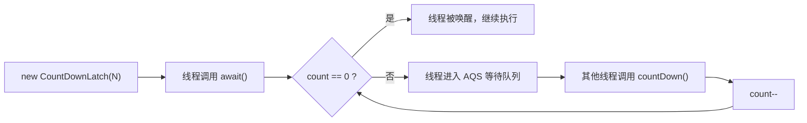
```mermaid
flowchart LR
    A["new CountDownLatch(N)"] --> B["线程调用 await()"]
    B --> C{"count == 0 ?"}
    C -- 是 --> D["线程被唤醒，继续执行"]
    C -- 否 --> E["线程进入 AQS 等待队列"]
    E --> F["其他线程调用 countDown()"]
    F --> G["count--"]
    G --> C
```

### 1.2 原理：基于 AQS 共享模式

CountDownLatch 内部维护了一个 `Sync` 内部类，继承自 `AbstractQueuedSynchronizer`。利用 AQS 的 **state** 字段保存计数值。

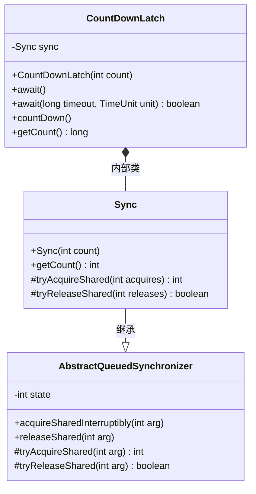
```mermaid
classDiagram
    class AbstractQueuedSynchronizer {
        -int state
        +acquireSharedInterruptibly(int arg)
        +releaseShared(int arg)
        #tryAcquireShared(int arg) int
        #tryReleaseShared(int arg) boolean
    }
    class CountDownLatch {
        -Sync sync
        +CountDownLatch(int count)
        +await()
        +await(long timeout, TimeUnit unit) boolean
        +countDown()
        +getCount() long
    }
    class Sync {
        +Sync(int count)
        +getCount() int
        #tryAcquireShared(int acquires) int
        #tryReleaseShared(int releases) boolean
    }
    CountDownLatch *-- Sync : 内部类
    Sync --|> AbstractQueuedSynchronizer : 继承
```

### 1.3 源码分析

#### 1.3.1 构造函数

```java
public CountDownLatch(int count) {
    if (count < 0) throw new IllegalArgumentException("count < 0");
    this.sync = new Sync(count);
}

// Sync 内部类
private static final class Sync extends AbstractQueuedSynchronizer {
    Sync(int count) {
        setState(count); // 将 count 设置到 AQS 的 state 字段
    }

    int getCount() {
        return getState();
    }
}
```

**关键点**：构造时将 count 值直接赋给 AQS 的 state 字段。

#### 1.3.2 await() —— 等待计数归零

```java
public void await() throws InterruptedException {
    sync.acquireSharedInterruptibly(1);
}

// AQS 中的 acquireSharedInterruptibly
public final void acquireSharedInterruptibly(int arg) throws InterruptedException {
    if (Thread.interrupted())
        throw new InterruptedException();
    if (tryAcquireShared(arg) < 0)   // 尝试获取共享锁
        doAcquireSharedInterruptibly(arg); // 失败则进入等待队列
}

// CountDownLatch.Sync 重写
protected int tryAcquireShared(int acquires) {
    return (getState() == 0) ? 1 : -1;
    // state == 0 返回 1（获取成功，不阻塞）
    // state != 0 返回 -1（获取失败，进入等待队列）
}
```

**执行流程**：
1. 调用 `await()` → 委托给 `sync.acquireSharedInterruptibly(1)`
2. 先调 `tryAcquireShared()`：如果 state == 0，直接返回（不阻塞）
3. 如果 state != 0，调 `doAcquireSharedInterruptibly()` 进入 AQS 等待队列，线程被挂起（`LockSupport.park()`）

#### 1.3.3 countDown() —— 计数减一

```java
public void countDown() {
    sync.releaseShared(1);
}

// AQS 中的 releaseShared
public final boolean releaseShared(int arg) {
    if (tryReleaseShared(arg)) {   // 尝试释放
        doReleaseShared();          // 唤醒等待队列中的线程
        return true;
    }
    return false;
}

// CountDownLatch.Sync 重写
protected boolean tryReleaseShared(int releases) {
    for (;;) { // CAS 自旋
        int c = getState();
        if (c == 0)
            return false; // 已经是 0 了，无需操作
        int nextc = c - 1;
        if (compareAndSetState(c, nextc)) // CAS 更新
            return nextc == 0; // 减到 0 返回 true，触发唤醒
    }
}
```

**执行流程**：
1. 调用 `countDown()` → 委托给 `sync.releaseShared(1)`
2. `tryReleaseShared()`：CAS 将 state 减 1
3. 如果减到 0，返回 true → 调用 `doReleaseShared()` → 唤醒所有在等待队列中的线程（`LockSupport.unpark()`）
4. 如果没减到 0，返回 false，不唤醒

### 1.4 核心方法总结

| 方法 | 说明 |
|------|------|
| `CountDownLatch(int count)` | 构造，设定计数值 |
| `void await()` | 阻塞当前线程，直到计数归零 |
| `boolean await(long timeout, TimeUnit unit)` | 带超时的等待，超时返回 false |
| `void countDown()` | 将计数减 1，减到 0 时唤醒所有等待线程 |
| `long getCount()` | 获取当前计数值 |

### 1.5 时序图：多线程协作过程

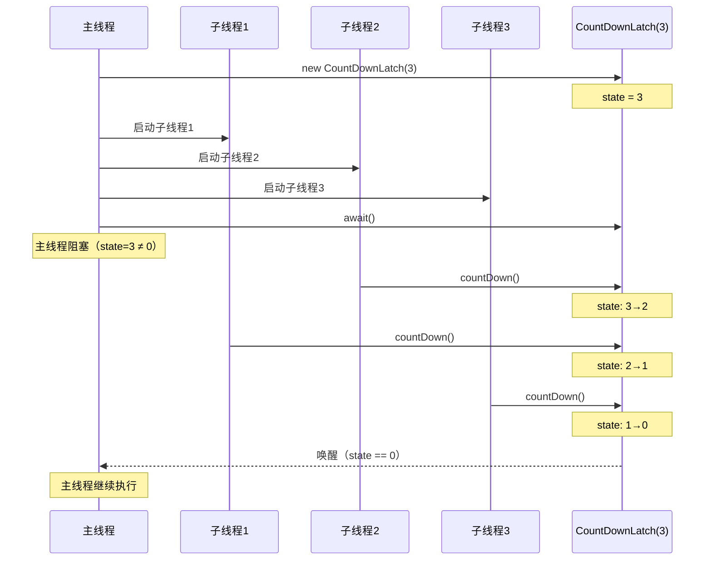
```mermaid
sequenceDiagram
    participant Main as 主线程
    participant T1 as 子线程1
    participant T2 as 子线程2
    participant T3 as 子线程3
    participant CDL as CountDownLatch(3)

    Main->>CDL: new CountDownLatch(3)
    Note over CDL: state = 3

    Main->>T1: 启动子线程1
    Main->>T2: 启动子线程2
    Main->>T3: 启动子线程3
    Main->>CDL: await()
    Note over Main: 主线程阻塞（state=3 ≠ 0）

    T2->>CDL: countDown()
    Note over CDL: state: 3→2

    T1->>CDL: countDown()
    Note over CDL: state: 2→1

    T3->>CDL: countDown()
    Note over CDL: state: 1→0

    CDL-->>Main: 唤醒（state == 0）
    Note over Main: 主线程继续执行
```

### 1.6 使用场景

#### 场景一：主线程等待多个子线程完成

最经典的用法——并行查询多个数据源后汇总结果。

```java
// 并行查询多个数据源后汇总
public Map<String, Object> queryAllDataSources() throws InterruptedException {
    Map<String, Object> result = new ConcurrentHashMap<>();
    CountDownLatch latch = new CountDownLatch(3);
    ExecutorService executor = Executors.newFixedThreadPool(3);

    // 并行查询数据库
    executor.submit(() -> {
        try {
            result.put("db", queryDatabase());
        } finally {
            latch.countDown();
        }
    });

    // 并行查询 Redis
    executor.submit(() -> {
        try {
            result.put("redis", queryRedis());
        } finally {
            latch.countDown();
        }
    });

    // 并行查询 ES
    executor.submit(() -> {
        try {
            result.put("es", queryElasticsearch());
        } finally {
            latch.countDown();
        }
    });

    // 主线程等待所有查询完成（带超时保护）
    boolean success = latch.await(5, TimeUnit.SECONDS);
    if (!success) {
        log.warn("部分数据源查询超时");
    }

    executor.shutdown();
    return result;
}
```

#### 场景二：发令枪（CountDownLatch(1) 作为开关）

```java
// 所有运动员就位后，裁判发令，同时起跑
CountDownLatch readyLatch = new CountDownLatch(N);  // 等待运动员就位
CountDownLatch startLatch = new CountDownLatch(1);   // 发令枪
CountDownLatch finishLatch = new CountDownLatch(N);  // 等待跑完

for (int i = 0; i < N; i++) {
    new Thread(() -> {
        readyLatch.countDown();   // 就位
        startLatch.await();       // 等待发令
        // ... 跑步 ...
        finishLatch.countDown();  // 到达终点
    }).start();
}

readyLatch.await();     // 等待所有运动员就位
startLatch.countDown();  // 发令！
finishLatch.await();    // 等待所有运动员到达终点
```

### 1.7 注意事项

1. **countDown() 必须放在 finally 块中**——防止异常导致计数永远无法归零
2. **建议使用带超时的 await()**——避免某个线程异常导致主线程永久阻塞
3. **一次性使用**——计数归零后无法重置，若需循环使用请选 CyclicBarrier
4. **count 值必须 ≥ 0**——否则构造时抛出 IllegalArgumentException

---

## 2. CyclicBarrier 详解

### 2.1 什么是 CyclicBarrier

CyclicBarrier（循环栅栏/循环屏障）允许一组线程互相等待，直到所有线程都到达某个公共屏障点（barrier point）后才一起继续执行。与 CountDownLatch 最大的不同在于：

1. **可循环使用**（Cyclic）：所有线程通过屏障后，屏障自动重置，可以重复使用
2. **线程互相等待**：不是某个线程等待其他线程，而是所有参与线程互相等待
3. **支持 barrierAction**：所有线程到达后，可以先执行一个回调任务

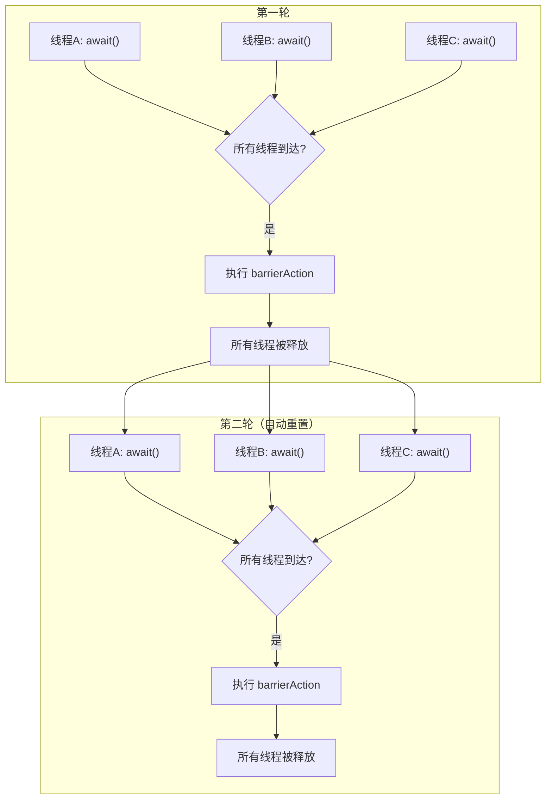
```mermaid
flowchart TB
    subgraph "第一轮"
        A1["线程A: await()"] --> B1{"所有线程到达?"}
        A2["线程B: await()"] --> B1
        A3["线程C: await()"] --> B1
        B1 -- 是 --> C1["执行 barrierAction"]
        C1 --> D1["所有线程被释放"]
    end
    subgraph "第二轮（自动重置）"
        D1 --> E1["线程A: await()"]
        D1 --> E2["线程B: await()"]
        D1 --> E3["线程C: await()"]
        E1 --> F1{"所有线程到达?"}
        E2 --> F1
        E3 --> F1
        F1 -- 是 --> G1["执行 barrierAction"]
        G1 --> H1["所有线程被释放"]
    end
```

### 2.2 原理：基于 ReentrantLock + Condition

CyclicBarrier **不是**基于 AQS 共享模式实现的，而是使用了 `ReentrantLock` + `Condition` 的组合。

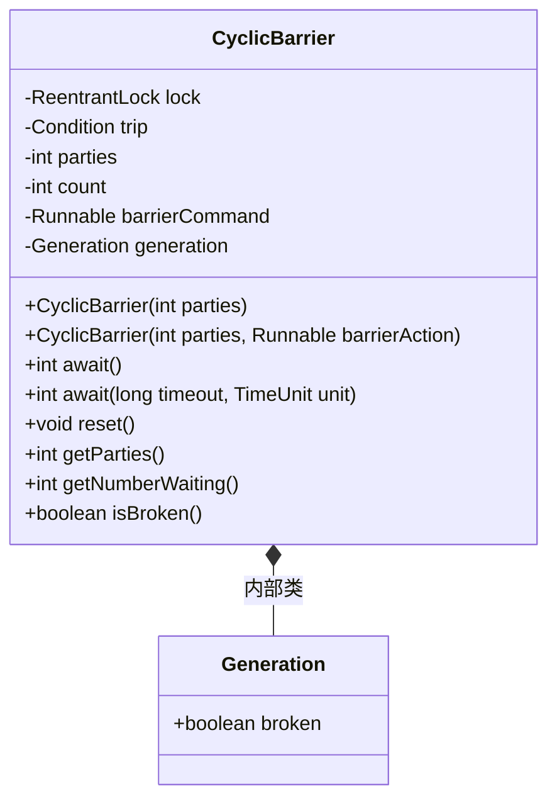
```mermaid
classDiagram
    class CyclicBarrier {
        -ReentrantLock lock
        -Condition trip
        -int parties
        -int count
        -Runnable barrierCommand
        -Generation generation
        +CyclicBarrier(int parties)
        +CyclicBarrier(int parties, Runnable barrierAction)
        +int await()
        +int await(long timeout, TimeUnit unit)
        +void reset()
        +int getParties()
        +int getNumberWaiting()
        +boolean isBroken()
    }
    class Generation {
        +boolean broken
    }
    CyclicBarrier *-- Generation : 内部类
```

**核心字段说明**：

| 字段 | 类型 | 说明 |
|------|------|------|
| `lock` | ReentrantLock | 保护屏障入口的锁 |
| `trip` | Condition | 线程等待/通知的条件变量 |
| `parties` | int | 参与线程总数（不可变） |
| `count` | int | 还需到达的线程数（每轮从 parties 倒计数） |
| `barrierCommand` | Runnable | 所有线程到达后执行的回调 |
| `generation` | Generation | 当前屏障的"代"，用于检测屏障是否被打破 |

### 2.3 源码分析

#### 2.3.1 await() 核心逻辑

`await()` 最终调用 `dowait()` 方法，这是 CyclicBarrier 的核心：

```java
public int await() throws InterruptedException, BrokenBarrierException {
    try {
        return dowait(false, 0L);
    } catch (TimeoutException toe) {
        throw new Error(toe); // 不可能发生
    }
}

private int dowait(boolean timed, long nanos)
    throws InterruptedException, BrokenBarrierException, TimeoutException {
    final ReentrantLock lock = this.lock;
    lock.lock();  // 加锁
    try {
        final Generation g = generation;

        if (g.broken)
            throw new BrokenBarrierException(); // 屏障已被打破

        if (Thread.interrupted()) {
            breakBarrier();   // 打破屏障
            throw new InterruptedException();
        }

        int index = --count;  // 计数减 1
        if (index == 0) {     // 最后一个到达的线程
            boolean ranAction = false;
            try {
                final Runnable command = barrierCommand;
                if (command != null)
                    command.run();   // 执行 barrierAction（由最后到达的线程执行）
                ranAction = true;
                nextGeneration();    // 唤醒所有线程 + 重置屏障
                return 0;
            } finally {
                if (!ranAction)
                    breakBarrier();  // barrierAction 异常，打破屏障
            }
        }

        // 非最后到达的线程，进入等待
        for (;;) {
            try {
                if (!timed)
                    trip.await();               // 无超时等待
                else if (nanos > 0L)
                    nanos = trip.awaitNanos(nanos); // 带超时等待
            } catch (InterruptedException ie) {
                if (g == generation && !g.broken) {
                    breakBarrier();
                    throw ie;
                } else {
                    Thread.currentThread().interrupt();
                }
            }

            if (g.broken)
                throw new BrokenBarrierException();

            if (g != generation)
                return index;  // 新一代，正常返回

            if (timed && nanos <= 0L) {
                breakBarrier();   // 超时，打破屏障
                throw new TimeoutException();
            }
        }
    } finally {
        lock.unlock();  // 解锁
    }
}
```

#### 2.3.2 nextGeneration() —— 进入下一代

```java
private void nextGeneration() {
    trip.signalAll();             // 唤醒所有等待线程
    count = parties;              // 重置计数
    generation = new Generation(); // 创建新的 Generation
}
```

#### 2.3.3 breakBarrier() —— 打破屏障

```java
private void breakBarrier() {
    generation.broken = true;  // 标记当前代已损坏
    count = parties;           // 重置计数
    trip.signalAll();          // 唤醒所有等待线程（让它们抛出 BrokenBarrierException）
}
```

### 2.4 await() 时序图

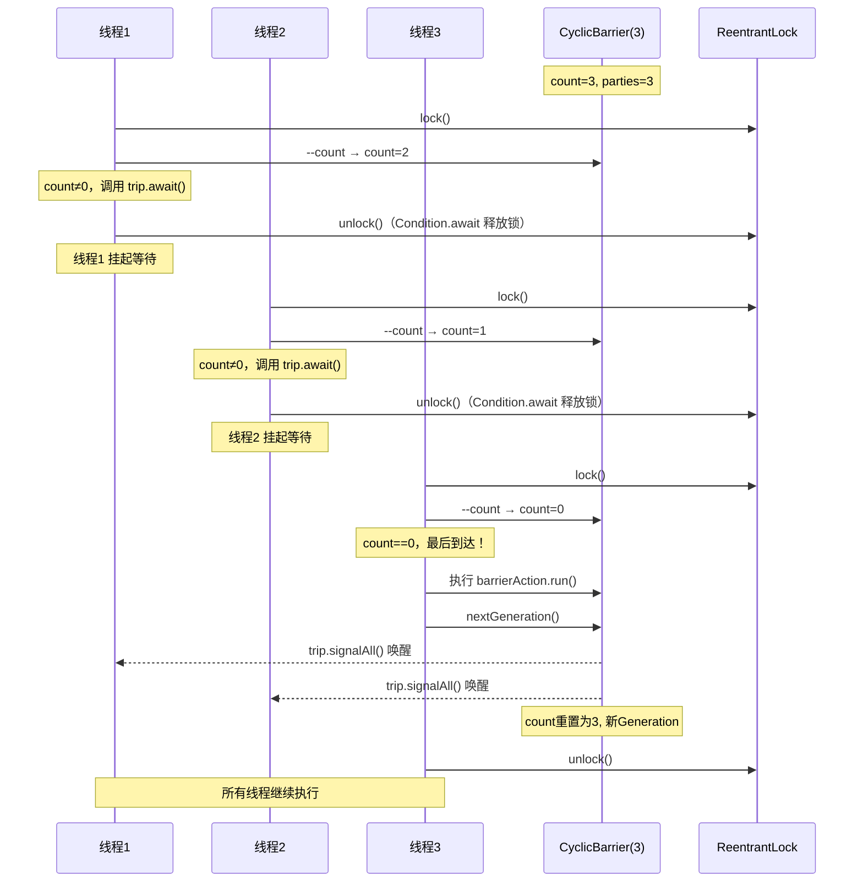
```mermaid
sequenceDiagram
    participant T1 as 线程1
    participant T2 as 线程2
    participant T3 as 线程3
    participant CB as CyclicBarrier(3)
    participant Lock as ReentrantLock

    Note over CB: count=3, parties=3

    T1->>Lock: lock()
    T1->>CB: --count → count=2
    Note over T1: count≠0，调用 trip.await()
    T1->>Lock: unlock()（Condition.await 释放锁）
    Note over T1: 线程1 挂起等待

    T2->>Lock: lock()
    T2->>CB: --count → count=1
    Note over T2: count≠0，调用 trip.await()
    T2->>Lock: unlock()（Condition.await 释放锁）
    Note over T2: 线程2 挂起等待

    T3->>Lock: lock()
    T3->>CB: --count → count=0
    Note over T3: count==0，最后到达！
    T3->>CB: 执行 barrierAction.run()
    T3->>CB: nextGeneration()
    CB-->>T1: trip.signalAll() 唤醒
    CB-->>T2: trip.signalAll() 唤醒
    Note over CB: count重置为3, 新Generation
    T3->>Lock: unlock()

    Note over T1,T3: 所有线程继续执行
```

### 2.5 与 CountDownLatch 的区别

| 对比维度 | CountDownLatch | CyclicBarrier |
|----------|----------------|---------------|
| **实现原理** | 基于 AQS 共享模式 | 基于 ReentrantLock + Condition |
| **可重用性** | ❌ 一次性的 | ✅ 可循环使用 |
| **等待主体** | 一个线程等待其他线程 | 所有线程互相等待 |
| **计数方式** | 调用 countDown() 减计数 | 调用 await() 减计数 |
| **回调支持** | ❌ 无 | ✅ 支持 barrierAction |
| **异常传播** | 不影响其他线程 | 一个线程异常，屏障被打破 |
| **reset** | ❌ 不支持 | ✅ 支持 reset() |
| **典型场景** | 主线程等多个子线程完成 | 多线程分阶段并行计算 |

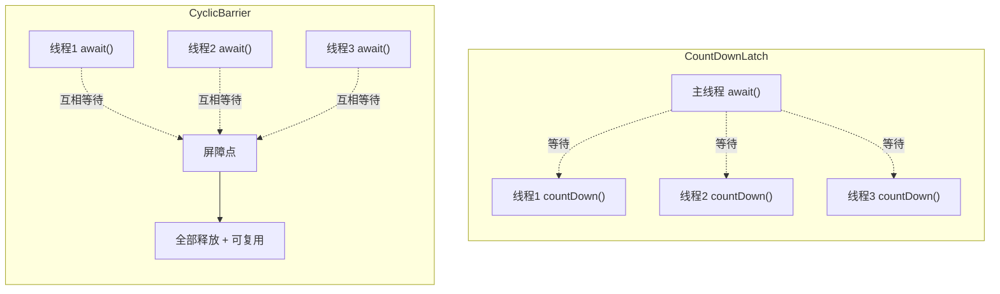
```mermaid
flowchart TB
    subgraph CountDownLatch
        direction TB
        M["主线程 await()"] -.等待.-> T1a["线程1 countDown()"]
        M -.等待.-> T2a["线程2 countDown()"]
        M -.等待.-> T3a["线程3 countDown()"]
    end
    subgraph CyclicBarrier
        direction TB
        T1b["线程1 await()"] -.互相等待.-> B["屏障点"]
        T2b["线程2 await()"] -.互相等待.-> B
        T3b["线程3 await()"] -.互相等待.-> B
        B --> R["全部释放 + 可复用"]
    end
```

### 2.6 核心方法

| 方法 | 说明 |
|------|------|
| `CyclicBarrier(int parties)` | 构造，指定参与线程数 |
| `CyclicBarrier(int parties, Runnable barrierAction)` | 构造，额外指定回调 |
| `int await()` | 等待所有线程到达，返回到达序号（最后到达为 0） |
| `int await(long timeout, TimeUnit unit)` | 带超时的等待 |
| `void reset()` | 手动重置屏障 |
| `int getNumberWaiting()` | 获取当前在等待的线程数 |
| `int getParties()` | 获取参与线程总数 |
| `boolean isBroken()` | 屏障是否已被打破 |

### 2.7 实际应用：多线程分段计算后汇总

```java
// 将大数组拆分为 N 段，每段由一个线程计算，全部完成后汇总
int[] bigArray = new int[1_000_000];
int threadCount = 4;
int segmentSize = bigArray.length / threadCount;
long[] segmentSums = new long[threadCount];

CyclicBarrier barrier = new CyclicBarrier(threadCount, () -> {
    // barrierAction: 在所有段计算完成后汇总
    long total = 0;
    for (long s : segmentSums) total += s;
    System.out.println("总和 = " + total);
});

for (int i = 0; i < threadCount; i++) {
    final int seg = i;
    new Thread(() -> {
        int start = seg * segmentSize;
        int end = (seg == threadCount - 1) ? bigArray.length : start + segmentSize;
        long sum = 0;
        for (int j = start; j < end; j++) sum += bigArray[j];
        segmentSums[seg] = sum;
        barrier.await(); // 等待其他线程
    }).start();
}
```

### 2.8 注意事项

1. **barrierAction 由最后到达的线程执行**——不是新开线程执行
2. **一个线程被中断或超时，屏障被打破**——其他等待线程收到 `BrokenBarrierException`
3. **reset() 会打破当前屏障**——等待线程收到 `BrokenBarrierException`
4. **parties 必须 > 0**——否则构造时抛出 IllegalArgumentException
5. **要注意死锁**——如果参与线程数少于 parties，所有线程都会一直等待

---

## 3. Semaphore 详解

### 3.1 什么是 Semaphore

Semaphore（信号量）是一种**许可证机制**的同步工具，用于控制同时访问某个特定资源的线程数量。可以理解为一个**"停车场"**——有 N 个车位（许可），车辆（线程）需要先获取车位才能停车（执行），离开时释放车位。

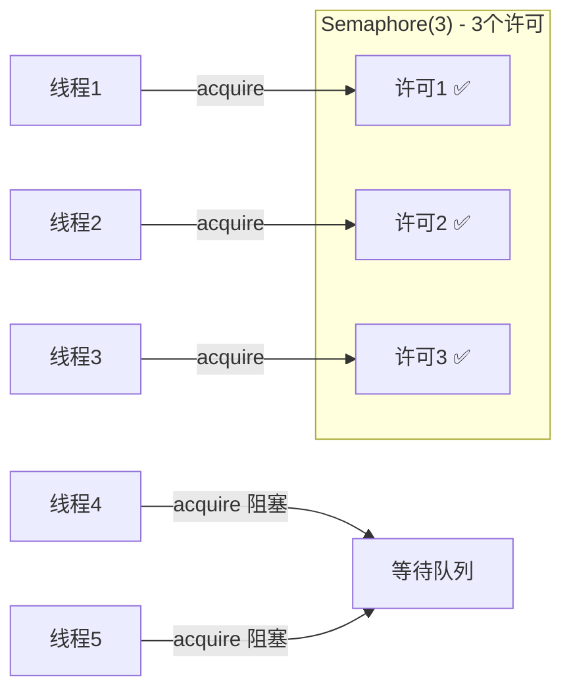
```mermaid
flowchart LR
    subgraph "Semaphore(3) - 3个许可"
        P1["许可1 ✅"]
        P2["许可2 ✅"]
        P3["许可3 ✅"]
    end

    T1["线程1"] -->|acquire| P1
    T2["线程2"] -->|acquire| P2
    T3["线程3"] -->|acquire| P3
    T4["线程4"] -->|acquire 阻塞| W["等待队列"]
    T5["线程5"] -->|acquire 阻塞| W
```

### 3.2 原理：基于 AQS 共享模式

Semaphore 同样基于 AQS 实现，与 CountDownLatch 类似，利用 AQS 的 state 字段保存**可用许可数**。但 Semaphore 既可以获取（state 减少）也可以释放（state 增加），而且支持**公平**和**非公平**两种模式。

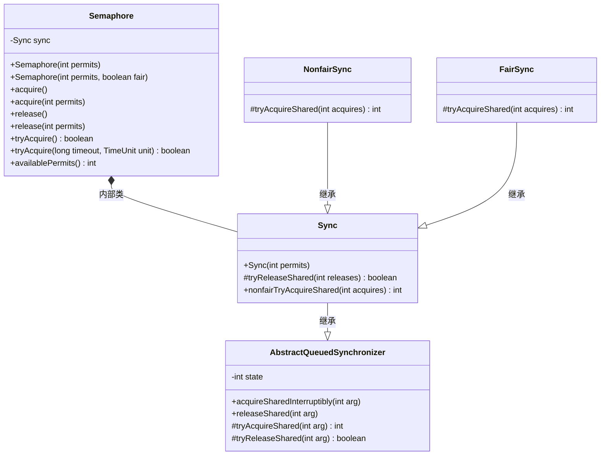
```mermaid
classDiagram
    class AbstractQueuedSynchronizer {
        -int state
        +acquireSharedInterruptibly(int arg)
        +releaseShared(int arg)
        #tryAcquireShared(int arg) int
        #tryReleaseShared(int arg) boolean
    }
    class Semaphore {
        -Sync sync
        +Semaphore(int permits)
        +Semaphore(int permits, boolean fair)
        +acquire()
        +acquire(int permits)
        +release()
        +release(int permits)
        +tryAcquire() boolean
        +tryAcquire(long timeout, TimeUnit unit) boolean
        +availablePermits() int
    }
    class Sync {
        +Sync(int permits)
        #tryReleaseShared(int releases) boolean
        +nonfairTryAcquireShared(int acquires) int
    }
    class NonfairSync {
        #tryAcquireShared(int acquires) int
    }
    class FairSync {
        #tryAcquireShared(int acquires) int
    }
    Semaphore *-- Sync : 内部类
    Sync --|> AbstractQueuedSynchronizer : 继承
    NonfairSync --|> Sync : 继承
    FairSync --|> Sync : 继承
```

### 3.3 公平 vs 非公平

#### 非公平模式（默认）

```java
// NonfairSync
protected int tryAcquireShared(int acquires) {
    return nonfairTryAcquireShared(acquires);
}

// Sync 中的非公平获取
final int nonfairTryAcquireShared(int acquires) {
    for (;;) {
        int available = getState();
        int remaining = available - acquires;
        if (remaining < 0 ||
            compareAndSetState(available, remaining))
            return remaining;
        // remaining < 0：许可不足，返回负值（进入等待队列）
        // CAS 成功：获取许可成功，返回剩余许可数
    }
}
```

#### 公平模式

```java
// FairSync
protected int tryAcquireShared(int acquires) {
    for (;;) {
        if (hasQueuedPredecessors()) // 公平模式：检查是否有前驱节点
            return -1;               // 有人排队，老老实实排队去
        int available = getState();
        int remaining = available - acquires;
        if (remaining < 0 ||
            compareAndSetState(available, remaining))
            return remaining;
    }
}
```

**公平 vs 非公平**：

| 对比 | 公平模式 | 非公平模式 |
|------|----------|------------|
| 获取顺序 | 严格 FIFO | 新线程可插队 |
| 吞吐量 | 较低（排队开销） | 较高 |
| 饥饿问题 | 无 | 可能存在 |
| 构造方式 | `new Semaphore(n, true)` | `new Semaphore(n)` 或 `new Semaphore(n, false)` |

### 3.4 源码分析

#### 3.4.1 acquire() —— 获取许可

```java
public void acquire() throws InterruptedException {
    sync.acquireSharedInterruptibly(1);
}

public void acquire(int permits) throws InterruptedException {
    if (permits < 0) throw new IllegalArgumentException();
    sync.acquireSharedInterruptibly(permits);
}
```

**执行流程**：
1. 调用 `tryAcquireShared()`：CAS 将 state 减去 permits
2. 如果 state 剩余 >= 0，获取成功
3. 如果 state 剩余 < 0，进入 AQS 等待队列

#### 3.4.2 release() —— 释放许可

```java
public void release() {
    sync.releaseShared(1);
}

// Sync 中的释放
protected final boolean tryReleaseShared(int releases) {
    for (;;) {
        int current = getState();
        int next = current + releases; // 增加许可
        if (next < current) // 溢出检查
            throw new Error("Maximum permit count exceeded");
        if (compareAndSetState(current, next))
            return true;
    }
}
```

**重要特性**：release() 不要求调用者先 acquire()——这意味着**许可数可以动态增加**！

### 3.5 核心方法

| 方法 | 说明 |
|------|------|
| `acquire()` | 获取一个许可（阻塞） |
| `acquire(int permits)` | 获取指定数量的许可 |
| `release()` | 释放一个许可 |
| `release(int permits)` | 释放指定数量的许可 |
| `tryAcquire()` | 尝试获取一个许可（非阻塞） |
| `tryAcquire(long timeout, TimeUnit unit)` | 带超时的尝试获取 |
| `availablePermits()` | 获取当前可用许可数 |
| `drainPermits()` | 获取并返回所有可用许可 |
| `getQueueLength()` | 获取等待队列长度 |

### 3.6 时序图：acquire/release 过程

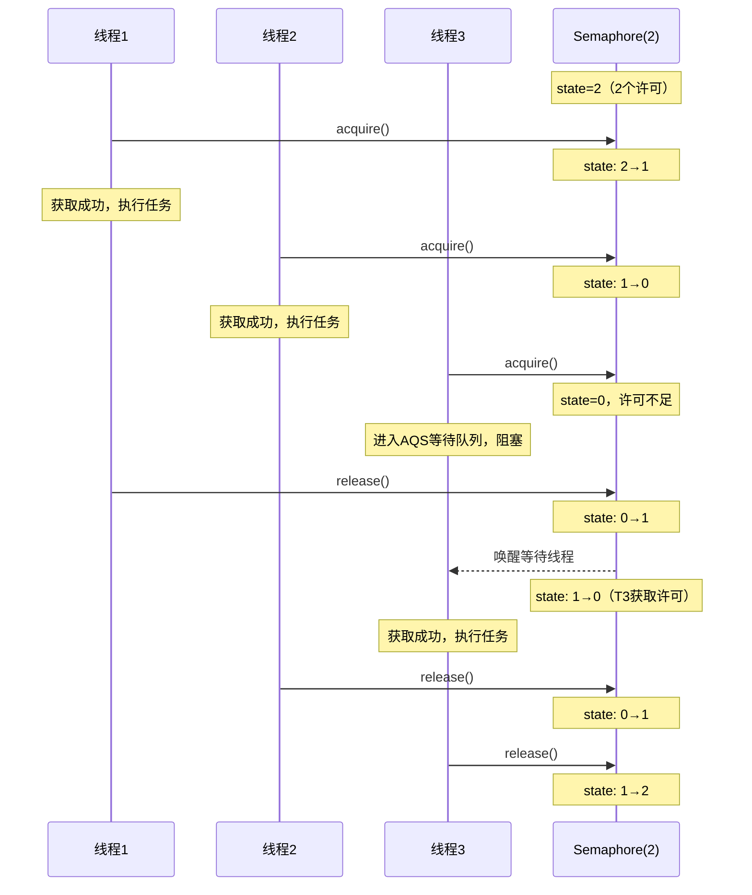
```mermaid
sequenceDiagram
    participant T1 as 线程1
    participant T2 as 线程2
    participant T3 as 线程3
    participant S as Semaphore(2)

    Note over S: state=2（2个许可）

    T1->>S: acquire()
    Note over S: state: 2→1
    Note over T1: 获取成功，执行任务

    T2->>S: acquire()
    Note over S: state: 1→0
    Note over T2: 获取成功，执行任务

    T3->>S: acquire()
    Note over S: state=0，许可不足
    Note over T3: 进入AQS等待队列，阻塞

    T1->>S: release()
    Note over S: state: 0→1
    S-->>T3: 唤醒等待线程
    Note over S: state: 1→0（T3获取许可）
    Note over T3: 获取成功，执行任务

    T2->>S: release()
    Note over S: state: 0→1
    T3->>S: release()
    Note over S: state: 1→2
```

### 3.7 实际应用

#### 应用一：数据库连接池限流

```java
public class ConnectionPool {
    private final Semaphore semaphore;
    private final LinkedBlockingQueue<Connection> pool;

    public ConnectionPool(int poolSize) {
        this.semaphore = new Semaphore(poolSize);
        this.pool = new LinkedBlockingQueue<>(poolSize);
        // 初始化连接
        for (int i = 0; i < poolSize; i++) {
            pool.offer(createConnection());
        }
    }

    public Connection getConnection() throws InterruptedException {
        semaphore.acquire();         // 获取许可（限流）
        return pool.poll();          // 取连接
    }

    public void releaseConnection(Connection conn) {
        pool.offer(conn);            // 归还连接
        semaphore.release();         // 释放许可
    }
}
```

#### 应用二：接口限流（限制并发数）

```java
public class RateLimiter {
    private final Semaphore semaphore;

    public RateLimiter(int maxConcurrent) {
        this.semaphore = new Semaphore(maxConcurrent);
    }

    public <T> T execute(Callable<T> task) throws Exception {
        semaphore.acquire();
        try {
            return task.call();
        } finally {
            semaphore.release();
        }
    }

    // 非阻塞版本
    public <T> T tryExecute(Callable<T> task, long timeout, TimeUnit unit)
            throws Exception {
        if (!semaphore.tryAcquire(timeout, unit)) {
            throw new RuntimeException("系统繁忙，请稍后再试");
        }
        try {
            return task.call();
        } finally {
            semaphore.release();
        }
    }
}
```

### 3.8 注意事项

1. **acquire 和 release 必须配对**——不配对会导致许可数永久减少或增加
2. **release 可以不由 acquire 的线程调用**——灵活但容易出错
3. **release 可以增加许可数超过初始值**——这是一个特性也是一个陷阱
4. **建议在 finally 中 release()**——防止异常导致许可泄漏

---

## 4. Exchanger 详解

### 4.1 什么是 Exchanger

Exchanger 是一种线程间**数据交换**的工具，允许两个线程在某个交汇点交换数据。当一个线程调用 `exchange()` 方法时，会阻塞等待另一个线程也调用 `exchange()`，然后两者互相交换各自的数据。

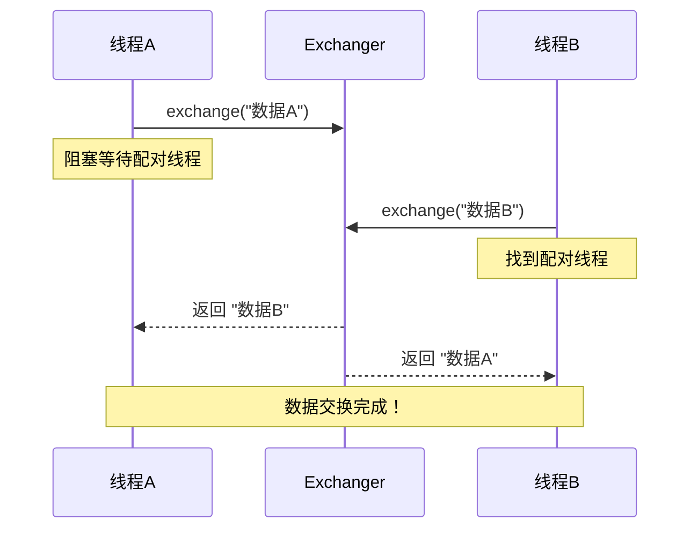
```mermaid
sequenceDiagram
    participant T1 as 线程A
    participant EX as Exchanger
    participant T2 as 线程B

    T1->>EX: exchange("数据A")
    Note over T1: 阻塞等待配对线程

    T2->>EX: exchange("数据B")
    Note over T2: 找到配对线程

    EX-->>T1: 返回 "数据B"
    EX-->>T2: 返回 "数据A"

    Note over T1,T2: 数据交换完成！
```

### 4.2 核心方法

| 方法 | 说明 |
|------|------|
| `V exchange(V x)` | 等待另一个线程到达交换点，交换数据（可能永久阻塞） |
| `V exchange(V x, long timeout, TimeUnit unit)` | 带超时的交换 |

### 4.3 原理简析

Exchanger 内部使用了一种称为"**双槽位（Slot）**"的机制：

1. **单槽位**（低并发）：第一个线程将数据放入 slot，等待第二个线程到来
2. **Arena 多槽位**（高并发）：通过分散到多个槽位减少竞争

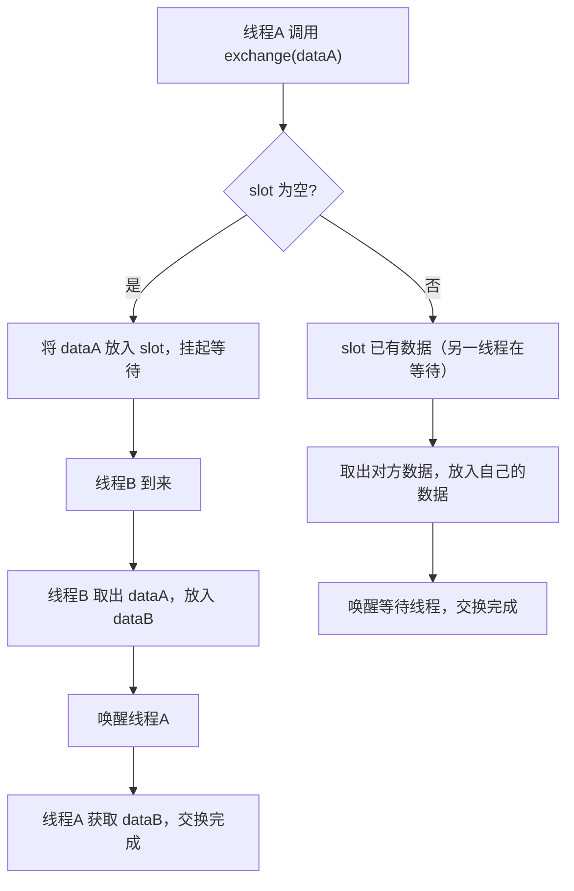
```mermaid
flowchart TB
    A["线程A 调用 exchange(dataA)"] --> B{"slot 为空?"}
    B -- 是 --> C["将 dataA 放入 slot，挂起等待"]
    C --> D["线程B 到来"]
    D --> E["线程B 取出 dataA，放入 dataB"]
    E --> F["唤醒线程A"]
    F --> G["线程A 获取 dataB，交换完成"]

    B -- 否 --> H["slot 已有数据（另一线程在等待）"]
    H --> I["取出对方数据，放入自己的数据"]
    I --> J["唤醒等待线程，交换完成"]
```

### 4.4 实际应用：生产者-消费者交换缓冲区

最经典的应用是生产者和消费者之间交换缓冲区（类似于"双缓冲"）：

```java
/**
 * 生产者-消费者通过 Exchanger 交换缓冲区
 * 生产者填满缓冲区后与消费者交换
 * 消费者处理缓冲区的同时生产者填充新缓冲区
 */
public class ExchangerDemo {
    private static final int BUFFER_SIZE = 10;
    private static final Exchanger<List<Integer>> exchanger = new Exchanger<>();

    public static void main(String[] args) {
        // 生产者
        new Thread(() -> {
            List<Integer> buffer = new ArrayList<>(BUFFER_SIZE);
            int count = 0;
            try {
                while (count < 50) {
                    // 填充缓冲区
                    while (buffer.size() < BUFFER_SIZE && count < 50) {
                        buffer.add(count++);
                    }
                    System.out.println("生产者填满缓冲区: " + buffer);
                    buffer = exchanger.exchange(buffer); // 交换：把满缓冲区换出，拿回空缓冲区
                    buffer.clear(); // 清空拿回来的缓冲区
                }
            } catch (InterruptedException e) {
                Thread.currentThread().interrupt();
            }
        }, "Producer").start();

        // 消费者
        new Thread(() -> {
            List<Integer> buffer = new ArrayList<>(BUFFER_SIZE);
            try {
                for (int i = 0; i < 5; i++) { // 5 轮
                    buffer = exchanger.exchange(buffer); // 交换：把空缓冲区换出，拿回满缓冲区
                    System.out.println("消费者接收缓冲区: " + buffer);
                    // 处理数据...
                    Thread.sleep(500);
                }
            } catch (InterruptedException e) {
                Thread.currentThread().interrupt();
            }
        }, "Consumer").start();
    }
}
```

### 4.5 注意事项

1. **仅适用于两个线程之间的交换**——如果有多个线程调用 exchange()，会配对但不确定哪两个配对
2. **建议使用带超时的版本**——避免一方异常导致另一方永久阻塞
3. **交换的是引用**——如果需要完整数据隔离，考虑深拷贝
4. **适用场景有限**——实际项目中使用较少，面试偶尔考到

---

## 5. Phaser 详解（JDK 7）

### 5.1 什么是 Phaser

Phaser（阶段器）是 JDK 7 引入的**最灵活的同步屏障**。它结合了 CountDownLatch 和 CyclicBarrier 的功能，并且**支持动态注册/注销参与者**。

Phaser 的核心概念：
- **Phase**（阶段）：所有参与者完成当前阶段后，共同进入下一阶段
- **Party**（参与者）：可以动态注册和注销
- **Arrive**（到达）：参与者表明已完成当前阶段的工作

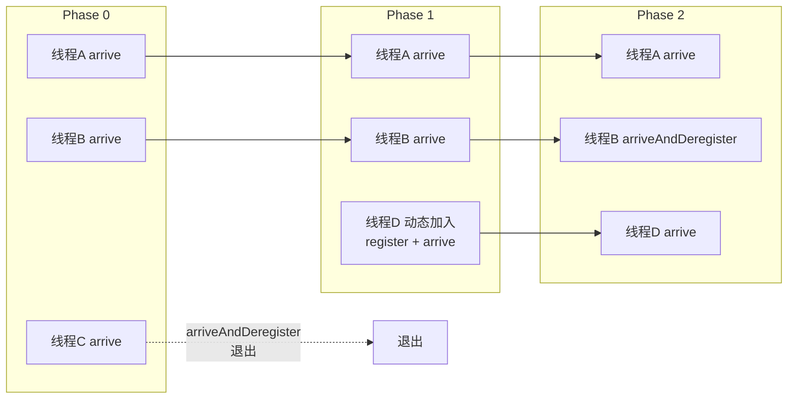
```mermaid
flowchart LR
    subgraph "Phase 0"
        A0["线程A arrive"]
        B0["线程B arrive"]
        C0["线程C arrive"]
    end
    subgraph "Phase 1"
        A1["线程A arrive"]
        B1["线程B arrive"]
        D1["线程D 动态加入<br/>register + arrive"]
    end
    subgraph "Phase 2"
        A2["线程A arrive"]
        B2["线程B arriveAndDeregister"]
        D2["线程D arrive"]
    end

    A0 --> A1 --> A2
    B0 --> B1 --> B2
    C0 -.->|"arriveAndDeregister<br/>退出"| X["退出"]
    D1 --> D2
```

### 5.2 与 CountDownLatch/CyclicBarrier 的对比

| 特性 | CountDownLatch | CyclicBarrier | Phaser |
|------|----------------|---------------|--------|
| **可重用** | ❌ | ✅ | ✅ |
| **动态参与者** | ❌ | ❌ | ✅ |
| **多阶段** | ❌ | ✅（需手动循环） | ✅（内置） |
| **阶段回调** | ❌ | ✅（barrierAction） | ✅（onAdvance） |
| **参与者退出** | ❌ | ❌ | ✅（arriveAndDeregister） |
| **树形结构** | ❌ | ❌ | ✅（分层 Phaser） |
| **等待特定阶段** | ❌ | ❌ | ✅（awaitAdvance） |

### 5.3 核心方法

| 方法 | 说明 |
|------|------|
| `register()` | 注册一个新参与者（parties + 1） |
| `bulkRegister(int parties)` | 批量注册参与者 |
| `arrive()` | 到达当前阶段，不等待其他参与者 |
| `arriveAndAwaitAdvance()` | 到达并等待所有参与者完成当前阶段 |
| `arriveAndDeregister()` | 到达并注销（parties - 1） |
| `awaitAdvance(int phase)` | 等待指定阶段完成 |
| `getPhase()` | 获取当前阶段编号 |
| `getRegisteredParties()` | 获取已注册参与者数 |
| `getArrivedParties()` | 获取已到达参与者数 |
| `isTerminated()` | 是否已终止 |

### 5.4 onAdvance() 回调

每个阶段结束时，Phaser 会调用 `onAdvance(int phase, int registeredParties)` 方法。可以通过重写来实现阶段回调或终止条件：

```java
Phaser phaser = new Phaser() {
    @Override
    protected boolean onAdvance(int phase, int registeredParties) {
        System.out.println("=== 第 " + phase + " 阶段完成，参与者: " + registeredParties + " ===");
        // 返回 true 表示 Phaser 终止
        // 返回 false 表示继续下一阶段
        return phase >= 2 || registeredParties == 0; // 3个阶段后终止
    }
};
```

### 5.5 原理简析

Phaser 使用一个 `long` 类型的 state 字段编码了多项信息：

```
  state（64位）:
  ┌─────────────────────────────────────────────────────────────┐
  │ phase(31位) │ parties(16位) │ unarrived(16位)               │
  │ 阶段编号     │ 参与者总数     │ 尚未到达的参与者数              │
  └─────────────────────────────────────────────────────────────┘
```

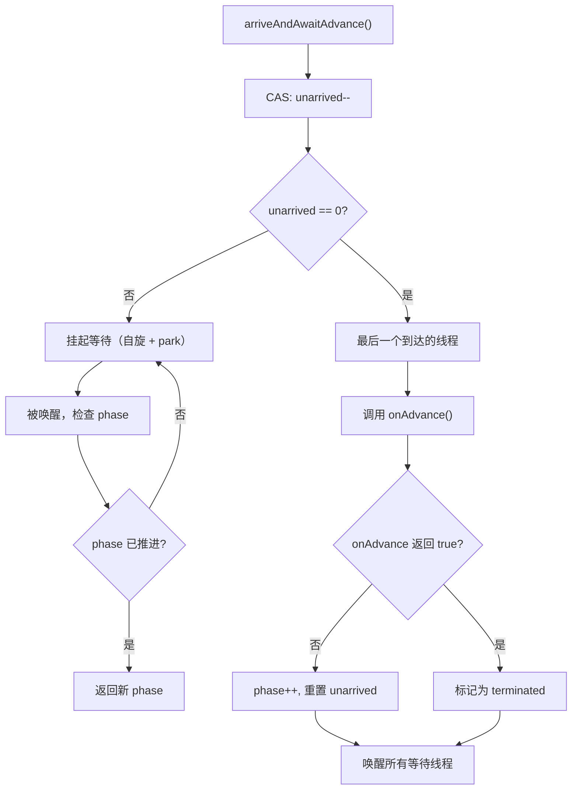
```mermaid
flowchart TB
    A["arriveAndAwaitAdvance()"] --> B["CAS: unarrived--"]
    B --> C{"unarrived == 0?"}
    C -- 否 --> D["挂起等待（自旋 + park）"]
    D --> E["被唤醒，检查 phase"]
    E --> F{"phase 已推进?"}
    F -- 是 --> G["返回新 phase"]
    F -- 否 --> D

    C -- 是 --> H["最后一个到达的线程"]
    H --> I["调用 onAdvance()"]
    I --> J{"onAdvance 返回 true?"}
    J -- 是 --> K["标记为 terminated"]
    J -- 否 --> L["phase++, 重置 unarrived"]
    L --> M["唤醒所有等待线程"]
    K --> M
```

### 5.6 实际应用：多阶段并行任务

```java
/**
 * 模拟多阶段任务：体检流程
 * 阶段0：所有人到达体检中心
 * 阶段1：所有人完成验血
 * 阶段2：所有人完成拍片
 * 有人可以中途离开（arriveAndDeregister）
 */
public class PhaserDemo {
    public static void main(String[] args) {
        Phaser phaser = new Phaser() {
            @Override
            protected boolean onAdvance(int phase, int registeredParties) {
                switch (phase) {
                    case 0: System.out.println("=== 所有人到达体检中心 ==="); break;
                    case 1: System.out.println("=== 所有人完成验血 ==="); break;
                    case 2: System.out.println("=== 所有人完成拍片 ==="); break;
                }
                return phase >= 2 || registeredParties == 0;
            }
        };

        String[] people = {"张三", "李四", "王五", "赵六"};
        for (String name : people) {
            phaser.register(); // 动态注册
            new Thread(() -> {
                // 阶段0：到达
                System.out.println(name + " 到达体检中心");
                phaser.arriveAndAwaitAdvance();

                // 阶段1：验血
                System.out.println(name + " 开始验血...");
                sleep(randomTime());
                System.out.println(name + " 验血完成");

                // 王五验血后离开
                if ("王五".equals(name)) {
                    System.out.println(name + " 有事先走了");
                    phaser.arriveAndDeregister();
                    return;
                }
                phaser.arriveAndAwaitAdvance();

                // 阶段2：拍片
                System.out.println(name + " 开始拍片...");
                sleep(randomTime());
                System.out.println(name + " 拍片完成");
                phaser.arriveAndAwaitAdvance();
            }, name).start();
        }
    }
}
```

### 5.7 注意事项

1. **参与者数量上限为 65535**（16 位存储）
2. **动态注册必须在 arrive 之前**——否则可能导致阶段提前推进
3. **大量参与者建议使用分层 Phaser**——通过构造 `new Phaser(parent)` 构建树形结构
4. **Phaser API 比较复杂**——简单场景优先使用 CountDownLatch 或 CyclicBarrier

---

## 6. CompletableFuture 异步编程（重点）

### 6.1 Future 的不足

Java 5 引入的 `Future` 接口存在诸多限制：

```java
// Future 的问题演示
ExecutorService executor = Executors.newFixedThreadPool(3);
Future<String> future = executor.submit(() -> {
    Thread.sleep(2000);
    return "结果";
});

// 问题1：get() 阻塞，回到了同步模式
String result = future.get(); // 阻塞等待

// 问题2：无法手动完成
// future.complete("手动设置结果"); // ❌ 不支持

// 问题3：无法链式调用
// future.thenApply(r -> r + " 处理后"); // ❌ 不支持

// 问题4：无法组合多个 Future
// Future.allOf(future1, future2); // ❌ 不支持

// 问题5：异常处理不友好
try {
    future.get();
} catch (ExecutionException e) {
    // 只能通过 try-catch 处理
}
```

**Future 的五大不足**：

| 不足 | 说明 |
|------|------|
| get() 阻塞 | 调用 get() 会阻塞当前线程，失去异步意义 |
| 无法链式调用 | 不能对结果进行转换、消费、组合 |
| 无法组合 | 不能等待多个 Future 全部/任一完成 |
| 无法手动完成 | 不能手动设置结果或异常 |
| 异常处理不友好 | 只能通过 try-catch 在 get() 时处理 |

### 6.2 CompletableFuture 的优势

Java 8 引入的 `CompletableFuture` 实现了 `Future` 和 `CompletionStage` 两个接口，提供了**函数式、链式、异步**的编程模型。

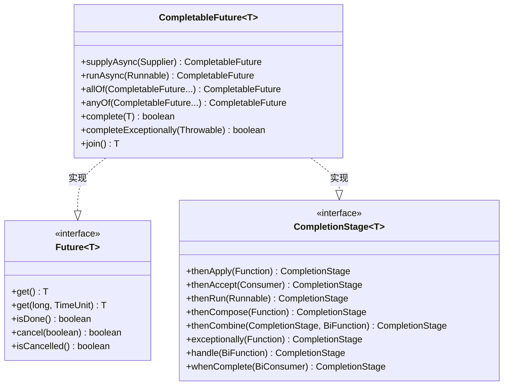
```mermaid
classDiagram
    class Future~T~ {
        <<interface>>
        +get() T
        +get(long, TimeUnit) T
        +isDone() boolean
        +cancel(boolean) boolean
        +isCancelled() boolean
    }
    class CompletionStage~T~ {
        <<interface>>
        +thenApply(Function) CompletionStage
        +thenAccept(Consumer) CompletionStage
        +thenRun(Runnable) CompletionStage
        +thenCompose(Function) CompletionStage
        +thenCombine(CompletionStage, BiFunction) CompletionStage
        +exceptionally(Function) CompletionStage
        +handle(BiFunction) CompletionStage
        +whenComplete(BiConsumer) CompletionStage
    }
    class CompletableFuture~T~ {
        +supplyAsync(Supplier) CompletableFuture
        +runAsync(Runnable) CompletableFuture
        +allOf(CompletableFuture...) CompletableFuture
        +anyOf(CompletableFuture...) CompletableFuture
        +complete(T) boolean
        +completeExceptionally(Throwable) boolean
        +join() T
    }
    CompletableFuture ..|> Future : 实现
    CompletableFuture ..|> CompletionStage : 实现
```

### 6.3 创建方式：supplyAsync / runAsync

```java
// ① supplyAsync —— 有返回值（Supplier）
CompletableFuture<String> cf1 = CompletableFuture.supplyAsync(() -> {
    // 异步执行，使用公共 ForkJoinPool
    return "计算结果";
});

// ② supplyAsync + 自定义线程池（推荐）
ExecutorService myPool = Executors.newFixedThreadPool(8);
CompletableFuture<String> cf2 = CompletableFuture.supplyAsync(() -> {
    return "自定义线程池的结果";
}, myPool);

// ③ runAsync —— 无返回值（Runnable）
CompletableFuture<Void> cf3 = CompletableFuture.runAsync(() -> {
    System.out.println("无返回值的异步任务");
});

// ④ 已完成的 Future
CompletableFuture<String> cf4 = CompletableFuture.completedFuture("直接完成");
```

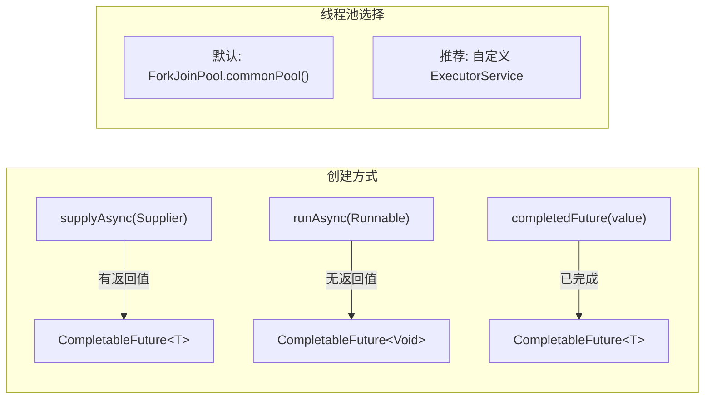
```mermaid
flowchart LR
    subgraph "创建方式"
        A["supplyAsync(Supplier)"] -->|有返回值| CF["CompletableFuture&lt;T&gt;"]
        B["runAsync(Runnable)"] -->|无返回值| CF2["CompletableFuture&lt;Void&gt;"]
        C["completedFuture(value)"] -->|已完成| CF3["CompletableFuture&lt;T&gt;"]
    end
    subgraph "线程池选择"
        D["默认: ForkJoinPool.commonPool()"]
        E["推荐: 自定义 ExecutorService"]
    end
```

### 6.4 链式调用详解

这是 CompletableFuture 最强大的特性——函数式链式调用。

#### 6.4.1 thenApply —— 转换结果（Function）

```java
// thenApply: T -> U（类似 Stream 的 map）
CompletableFuture<Integer> future = CompletableFuture
    .supplyAsync(() -> "100")
    .thenApply(Integer::parseInt)      // String → Integer
    .thenApply(i -> i * 2);            // Integer → Integer

System.out.println(future.join()); // 200
```

#### 6.4.2 thenAccept —— 消费结果（Consumer）

```java
// thenAccept: T -> void（有入参，无返回值）
CompletableFuture.supplyAsync(() -> "Hello")
    .thenAccept(s -> System.out.println("消费: " + s)); // 消费: Hello
```

#### 6.4.3 thenRun —— 执行后续操作（Runnable）

```java
// thenRun: void -> void（无入参，无返回值，纯粹的后续操作）
CompletableFuture.supplyAsync(() -> "某个结果")
    .thenRun(() -> System.out.println("前一步已完成，执行后续操作"));
```

#### 6.4.4 thenCompose —— 扁平化（flatMap）

当回调返回的也是 `CompletableFuture` 时，使用 `thenCompose` 避免嵌套。

```java
// ❌ thenApply 会产生嵌套：CompletableFuture<CompletableFuture<String>>
CompletableFuture<CompletableFuture<String>> nested = CompletableFuture
    .supplyAsync(() -> 1)
    .thenApply(id -> queryUserAsync(id)); // 返回 CompletableFuture<String>

// ✅ thenCompose 自动扁平化：CompletableFuture<String>
CompletableFuture<String> flat = CompletableFuture
    .supplyAsync(() -> 1)
    .thenCompose(id -> queryUserAsync(id)); // 返回 CompletableFuture<String>
```

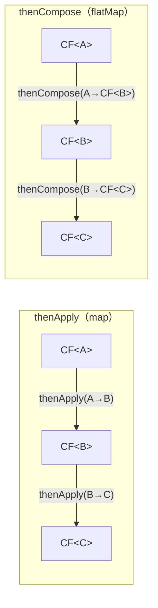
```mermaid
flowchart LR
    subgraph "thenApply（map）"
        A1["CF&lt;A&gt;"] -->|"thenApply(A→B)"| B1["CF&lt;B&gt;"]
        B1 -->|"thenApply(B→C)"| C1["CF&lt;C&gt;"]
    end
    subgraph "thenCompose（flatMap）"
        A2["CF&lt;A&gt;"] -->|"thenCompose(A→CF&lt;B&gt;)"| B2["CF&lt;B&gt;"]
        B2 -->|"thenCompose(B→CF&lt;C&gt;)"| C2["CF&lt;C&gt;"]
    end
```

#### 6.4.5 thenCombine —— 合并两个独立 Future

```java
// 两个独立的异步任务，都完成后合并结果
CompletableFuture<String> priceFuture = CompletableFuture.supplyAsync(() -> {
    sleep(800);
    return "价格: 99.9";
});

CompletableFuture<String> stockFuture = CompletableFuture.supplyAsync(() -> {
    sleep(600);
    return "库存: 100";
});

CompletableFuture<String> result = priceFuture.thenCombine(stockFuture,
    (price, stock) -> price + " | " + stock);

System.out.println(result.join()); // 价格: 99.9 | 库存: 100
// 总耗时约 800ms（取最长的），而非 1400ms
```

#### 6.4.6 链式调用总结图

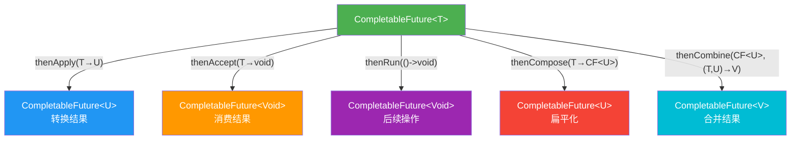
```mermaid
flowchart TB
    CF["CompletableFuture&lt;T&gt;"]

    CF -->|"thenApply(T→U)"| R1["CompletableFuture&lt;U&gt;<br/>转换结果"]
    CF -->|"thenAccept(T→void)"| R2["CompletableFuture&lt;Void&gt;<br/>消费结果"]
    CF -->|"thenRun(()->void)"| R3["CompletableFuture&lt;Void&gt;<br/>后续操作"]
    CF -->|"thenCompose(T→CF&lt;U&gt;)"| R4["CompletableFuture&lt;U&gt;<br/>扁平化"]
    CF -->|"thenCombine(CF&lt;U&gt;, (T,U)→V)"| R5["CompletableFuture&lt;V&gt;<br/>合并结果"]

    style CF fill:#4CAF50,color:#fff
    style R1 fill:#2196F3,color:#fff
    style R2 fill:#FF9800,color:#fff
    style R3 fill:#9C27B0,color:#fff
    style R4 fill:#F44336,color:#fff
    style R5 fill:#00BCD4,color:#fff
```

#### 6.4.7 Async 后缀变体

每个链式调用方法都有三个变体：

| 变体 | 说明 | 示例 |
|------|------|------|
| `thenApply` | 由上一步的线程或调用线程执行 | `cf.thenApply(x -> x + 1)` |
| `thenApplyAsync` | 由默认 ForkJoinPool 异步执行 | `cf.thenApplyAsync(x -> x + 1)` |
| `thenApplyAsync(fn, executor)` | 由指定线程池异步执行 | `cf.thenApplyAsync(x -> x + 1, myPool)` |

```java
// 线程模型示意
CompletableFuture.supplyAsync(() -> "step1", poolA)    // poolA 线程执行
    .thenApply(s -> s + "-step2")                       // 可能由 poolA 线程或主线程执行
    .thenApplyAsync(s -> s + "-step3")                  // ForkJoinPool 线程执行
    .thenApplyAsync(s -> s + "-step4", poolB);          // poolB 线程执行
```

### 6.5 异常处理

#### 6.5.1 exceptionally —— 捕获异常并恢复

```java
CompletableFuture<String> future = CompletableFuture
    .supplyAsync(() -> {
        if (true) throw new RuntimeException("出错了");
        return "正常结果";
    })
    .exceptionally(ex -> {
        System.out.println("捕获异常: " + ex.getMessage());
        return "兜底默认值"; // 提供降级值
    });

System.out.println(future.join()); // 兜底默认值
```

#### 6.5.2 handle —— 无论成功或失败都执行

```java
// handle: (T, Throwable) -> U
CompletableFuture<String> future = CompletableFuture
    .supplyAsync(() -> {
        // 可能成功，也可能失败
        return "结果";
    })
    .handle((result, ex) -> {
        if (ex != null) {
            return "异常降级: " + ex.getMessage();
        }
        return "成功处理: " + result;
    });
```

#### 6.5.3 whenComplete —— 观察（不改变结果）

```java
// whenComplete: (T, Throwable) -> void
// 与 handle 的区别：whenComplete 不改变返回值
CompletableFuture<String> future = CompletableFuture
    .supplyAsync(() -> "原始结果")
    .whenComplete((result, ex) -> {
        if (ex != null) {
            log.error("执行异常", ex); // 记录日志
        } else {
            log.info("执行成功: " + result); // 记录日志
        }
        // 注意：不能改变返回值
    });

System.out.println(future.join()); // 原始结果（未被改变）
```

#### 6.5.4 异常处理对比

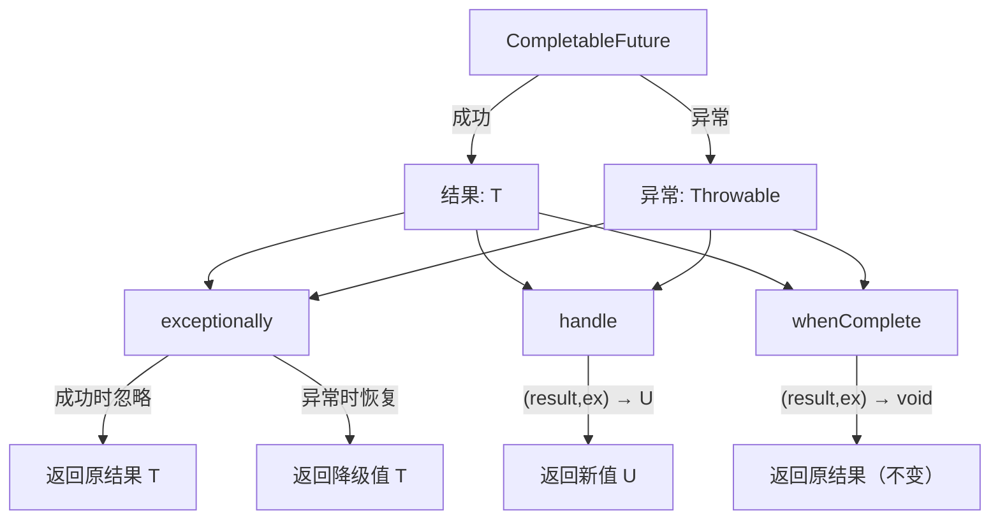
```mermaid
flowchart TB
    CF["CompletableFuture"]

    CF -->|成功| S["结果: T"]
    CF -->|异常| E["异常: Throwable"]

    S --> EX["exceptionally"]
    E --> EX
    EX -->|成功时忽略| R1["返回原结果 T"]
    EX -->|异常时恢复| R1a["返回降级值 T"]

    S --> H["handle"]
    E --> H
    H -->|"(result,ex) → U"| R2["返回新值 U"]

    S --> WC["whenComplete"]
    E --> WC
    WC -->|"(result,ex) → void"| R3["返回原结果（不变）"]
```

| 方法 | 触发条件 | 能否改变返回值 | 返回类型 |
|------|----------|----------------|----------|
| `exceptionally` | 仅异常时 | ✅ 返回降级值 | `CompletableFuture<T>` |
| `handle` | 成功或异常 | ✅ 返回新值 | `CompletableFuture<U>` |
| `whenComplete` | 成功或异常 | ❌ 仅观察 | `CompletableFuture<T>` |

### 6.6 组合操作：allOf / anyOf

#### 6.6.1 allOf —— 等待所有完成

```java
CompletableFuture<String> f1 = CompletableFuture.supplyAsync(() -> { sleep(1000); return "服务A"; });
CompletableFuture<String> f2 = CompletableFuture.supplyAsync(() -> { sleep(800);  return "服务B"; });
CompletableFuture<String> f3 = CompletableFuture.supplyAsync(() -> { sleep(600);  return "服务C"; });

// allOf 返回 CompletableFuture<Void>
CompletableFuture<Void> allOf = CompletableFuture.allOf(f1, f2, f3);

// 等待全部完成后收集结果
CompletableFuture<List<String>> allResults = allOf.thenApply(v ->
    Stream.of(f1, f2, f3)
          .map(CompletableFuture::join)
          .collect(Collectors.toList())
);

System.out.println(allResults.join()); // [服务A, 服务B, 服务C]
// 总耗时约 1000ms（最慢的那个）
```

#### 6.6.2 anyOf —— 任一完成

```java
CompletableFuture<String> fast   = CompletableFuture.supplyAsync(() -> { sleep(200);  return "快速结果"; });
CompletableFuture<String> medium = CompletableFuture.supplyAsync(() -> { sleep(500);  return "中速结果"; });
CompletableFuture<String> slow   = CompletableFuture.supplyAsync(() -> { sleep(1000); return "慢速结果"; });

// anyOf 返回 CompletableFuture<Object>（第一个完成的结果）
CompletableFuture<Object> anyOf = CompletableFuture.anyOf(fast, medium, slow);

System.out.println(anyOf.join()); // 快速结果
// 总耗时约 200ms
```

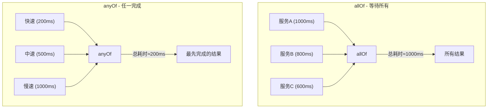
```mermaid
flowchart TB
    subgraph "allOf - 等待所有"
        A1["服务A (1000ms)"] --> ALL["allOf"]
        A2["服务B (800ms)"] --> ALL
        A3["服务C (600ms)"] --> ALL
        ALL -->|"总耗时≈1000ms"| R1["所有结果"]
    end

    subgraph "anyOf - 任一完成"
        B1["快速 (200ms)"] --> ANY["anyOf"]
        B2["中速 (500ms)"] --> ANY
        B3["慢速 (1000ms)"] --> ANY
        ANY -->|"总耗时≈200ms"| R2["最先完成的结果"]
    end
```

### 6.7 自定义线程池

**为什么要自定义线程池？**

默认情况下，CompletableFuture 使用 `ForkJoinPool.commonPool()` 作为线程池。这个公共线程池：
- 被所有 CompletableFuture 共享
- 被 parallel stream 共享
- 线程数 = Runtime.getRuntime().availableProcessors() - 1
- 如果某个任务执行慢，会阻塞公共池中的其他任务

```java
// ❌ 不推荐：使用默认公共线程池
CompletableFuture.supplyAsync(() -> heavyTask());

// ✅ 推荐：使用自定义线程池
ExecutorService ioPool = new ThreadPoolExecutor(
    10, 50,                    // 核心10，最大50
    60L, TimeUnit.SECONDS,     // 空闲超时60秒
    new LinkedBlockingQueue<>(200), // 队列容量200
    new ThreadFactory() {
        private final AtomicInteger counter = new AtomicInteger(1);
        @Override
        public Thread newThread(Runnable r) {
            Thread t = new Thread(r, "io-pool-" + counter.getAndIncrement());
            t.setDaemon(true); // 守护线程
            return t;
        }
    },
    new ThreadPoolExecutor.CallerRunsPolicy() // 拒绝策略
);

CompletableFuture.supplyAsync(() -> heavyTask(), ioPool);
```

**最佳实践——按业务场景区分线程池**：

```java
// IO 密集型（网络调用、数据库查询）
ExecutorService ioPool = Executors.newFixedThreadPool(50);

// CPU 密集型（计算、序列化）
ExecutorService cpuPool = Executors.newFixedThreadPool(
    Runtime.getRuntime().availableProcessors()
);

// 使用不同的池
CompletableFuture.supplyAsync(() -> callRemoteAPI(), ioPool);
CompletableFuture.supplyAsync(() -> heavyComputation(), cpuPool);
```

### 6.8 实际应用：并行调用多个微服务接口后合并结果

这是 CompletableFuture 最常见的应用场景——电商详情页需要从多个服务获取数据：

```java
/**
 * 商品详情页聚合服务
 * 并行调用：用户服务 + 商品服务 + 库存服务 + 优惠券服务 + 评价服务
 */
public class ProductDetailService {
    private final ExecutorService executor = new ThreadPoolExecutor(
        10, 30, 60L, TimeUnit.SECONDS,
        new LinkedBlockingQueue<>(200),
        r -> new Thread(r, "detail-pool-" + Thread.currentThread().getId())
    );

    public ProductDetailVO getProductDetail(Long userId, Long productId) {
        // 并行调用5个微服务
        CompletableFuture<UserInfo> userFuture = CompletableFuture
            .supplyAsync(() -> userService.getUserInfo(userId), executor)
            .exceptionally(ex -> {
                log.error("用户服务异常", ex);
                return UserInfo.defaultUser(); // 降级
            });

        CompletableFuture<ProductInfo> productFuture = CompletableFuture
            .supplyAsync(() -> productService.getProductInfo(productId), executor)
            .exceptionally(ex -> {
                log.error("商品服务异常", ex);
                return null; // 商品信息不能降级，返回null后处理
            });

        CompletableFuture<StockInfo> stockFuture = CompletableFuture
            .supplyAsync(() -> stockService.getStock(productId), executor)
            .exceptionally(ex -> {
                log.error("库存服务异常", ex);
                return StockInfo.unknown();
            });

        CompletableFuture<List<Coupon>> couponFuture = CompletableFuture
            .supplyAsync(() -> couponService.getAvailableCoupons(userId, productId), executor)
            .exceptionally(ex -> {
                log.error("优惠券服务异常", ex);
                return Collections.emptyList();
            });

        CompletableFuture<List<Review>> reviewFuture = CompletableFuture
            .supplyAsync(() -> reviewService.getReviews(productId, 10), executor)
            .exceptionally(ex -> {
                log.error("评价服务异常", ex);
                return Collections.emptyList();
            });

        // 等待所有服务完成（带超时保护）
        try {
            CompletableFuture.allOf(userFuture, productFuture, stockFuture,
                                     couponFuture, reviewFuture)
                             .get(3, TimeUnit.SECONDS); // 最多等3秒
        } catch (TimeoutException e) {
            log.warn("部分服务超时");
        } catch (Exception e) {
            log.error("聚合异常", e);
        }

        // 组装结果
        ProductDetailVO vo = new ProductDetailVO();
        vo.setUser(userFuture.getNow(UserInfo.defaultUser()));
        vo.setProduct(productFuture.getNow(null));
        vo.setStock(stockFuture.getNow(StockInfo.unknown()));
        vo.setCoupons(couponFuture.getNow(Collections.emptyList()));
        vo.setReviews(reviewFuture.getNow(Collections.emptyList()));

        return vo;
    }
}
```

### 6.9 CompletableFuture API 全景图

```mermaid
flowchart TB
    subgraph "创建"
        S1["supplyAsync(Supplier)"]
        S2["runAsync(Runnable)"]
        S3["completedFuture(value)"]
    end

    subgraph "转换"
        T1["thenApply(Function)"]
        T2["thenCompose(Function→CF)"]
    end

    subgraph "消费"
        C1["thenAccept(Consumer)"]
        C2["thenRun(Runnable)"]
    end

    subgraph "合并"
        M1["thenCombine(CF, BiFunction)"]
        M2["thenAcceptBoth(CF, BiConsumer)"]
        M3["runAfterBoth(CF, Runnable)"]
    end

    subgraph "竞争"
        R1["applyToEither(CF, Function)"]
        R2["acceptEither(CF, Consumer)"]
        R3["runAfterEither(CF, Runnable)"]
    end

    subgraph "批量"
        B1["allOf(CF...)"]
        B2["anyOf(CF...)"]
    end

    subgraph "异常"
        E1["exceptionally(Function)"]
        E2["handle(BiFunction)"]
        E3["whenComplete(BiConsumer)"]
    end

    S1 --> T1
    S1 --> C1
    S1 --> M1
    S1 --> R1
    S1 --> E1
```

### 6.10 最佳实践与注意事项

#### ✅ 推荐做法

1. **总是使用自定义线程池**——避免公共 ForkJoinPool 被阻塞

```java
// ✅ 推荐
CompletableFuture.supplyAsync(() -> task(), customExecutor);
```

2. **使用 join() 而非 get()**——join() 不抛受检异常

```java
// ✅ 推荐：join() 抛出 CompletionException（非受检异常）
String result = future.join();

// ❌ 不推荐：get() 抛出受检异常，需要 try-catch
try {
    String result = future.get();
} catch (InterruptedException | ExecutionException e) { }
```

3. **每个异步任务都加异常处理**——防止异常被静默吞掉

```java
// ✅ 推荐
CompletableFuture.supplyAsync(() -> riskyTask(), executor)
    .exceptionally(ex -> {
        log.error("任务异常", ex);
        return defaultValue;
    });
```

4. **使用 allOf + 超时保护**

```java
// ✅ 推荐
CompletableFuture.allOf(f1, f2, f3).get(5, TimeUnit.SECONDS);
```

5. **用 getNow() 获取可能未完成的结果**

```java
// 超时后用 getNow 获取已完成的结果，未完成的返回默认值
String result = future.getNow("默认值");
```

#### ❌ 避免的做法

1. **不要在链式调用中使用阻塞操作**

```java
// ❌ 在异步回调中阻塞
CompletableFuture.supplyAsync(() -> "data")
    .thenApply(data -> {
        Thread.sleep(5000); // ❌ 阻塞了线程池中的线程
        return process(data);
    });
```

2. **不要忽略异常**

```java
// ❌ 异常被静默吞掉
CompletableFuture.supplyAsync(() -> {
    throw new RuntimeException("出错");
}); // 没有异常处理，异常被忽略
```

3. **不要在回调中修改外部可变状态（无同步）**

```java
// ❌ 线程不安全
List<String> results = new ArrayList<>(); // 非线程安全
futures.forEach(f -> f.thenAccept(results::add)); // 并发修改

// ✅ 使用线程安全集合
List<String> results = new CopyOnWriteArrayList<>();
// 或者用 Stream + join 收集
List<String> results = futures.stream()
    .map(CompletableFuture::join)
    .collect(Collectors.toList());
```

### 6.11 get() vs join() vs getNow()

| 方法 | 阻塞 | 异常 | 说明 |
|------|------|------|------|
| `get()` | ✅ 阻塞 | 抛 ExecutionException（受检异常） | 需要 try-catch |
| `get(timeout, unit)` | ✅ 带超时 | 抛 TimeoutException | 推荐用于最外层 |
| `join()` | ✅ 阻塞 | 抛 CompletionException（非受检异常） | 链式调用中推荐 |
| `getNow(defaultValue)` | ❌ 不阻塞 | 未完成时返回默认值 | 超时降级场景 |

---

## 7. Fork/Join 框架详解

### 7.1 什么是 Fork/Join 框架

Fork/Join 是 Java 7 引入的并行计算框架，基于**分治思想**：将大任务拆分（Fork）为子任务，子任务并行执行后再合并结果（Join）。

```mermaid
flowchart TB
    A["大任务"] -->|Fork| B["子任务1"]
    A -->|Fork| C["子任务2"]
    B -->|Fork| D["子子任务1-1"]
    B -->|Fork| E["子子任务1-2"]
    C -->|Fork| F["子子任务2-1"]
    C -->|Fork| G["子子任务2-2"]

    D -->|计算结果| H["合并1-1 + 1-2"]
    E -->|计算结果| H
    F -->|计算结果| I["合并2-1 + 2-2"]
    G -->|计算结果| I

    H -->|Join| J["合并最终结果"]
    I -->|Join| J
```

### 7.2 工作窃取算法（Work-Stealing）

Fork/Join 的核心优化是**工作窃取算法**：每个工作线程维护一个**双端队列（Deque）**，当某个线程的队列为空时，它会从其他忙碌线程的队列**尾部窃取**任务执行。

```mermaid
flowchart TB
    subgraph "Worker Thread 1 (繁忙)"
        direction TB
        Q1["双端队列（Deque）"]
        Q1T["头部 → 本线程取任务"]
        Q1B["尾部 → 被窃取端"]
        T1A["任务A"]
        T1B["任务B"]
        T1C["任务C"]
        T1D["任务D"]
    end

    subgraph "Worker Thread 2 (空闲)"
        direction TB
        Q2["双端队列（空）"]
        Q2N["没有任务了..."]
    end

    Q2N -->|"窃取！从尾部取"| T1D

    style Q2N fill:#FF5722,color:#fff
    style T1D fill:#4CAF50,color:#fff
```

**为什么从尾部窃取？**

1. 减少竞争：本线程从头部取，窃取者从尾部取，互不干扰
2. 尾部的任务通常更"大"（还没拆分），窃取后可以进一步拆分
3. 避免 false sharing（缓存行争用）

```mermaid
flowchart LR
    subgraph "Worker 1 的 Deque"
        direction TB
        H["头部(本线程取)"] --> T1["小任务"]
        T1 --> T2["小任务"]
        T2 --> T3["中任务"]
        T3 --> T4["大任务"]
        T4 --> B["尾部(被窃取)"]
    end

    W1["Worker 1"] -->|"从头部 pop"| H
    W2["Worker 2 (空闲)"] -->|"从尾部 steal"| B

    style W2 fill:#FF9800,color:#fff
```

### 7.3 ForkJoinPool 架构

```mermaid
classDiagram
    class ForkJoinPool {
        -WorkQueue[] workQueues
        -int parallelism
        +ForkJoinPool()
        +ForkJoinPool(int parallelism)
        +invoke(ForkJoinTask) T
        +submit(ForkJoinTask) ForkJoinTask
        +execute(ForkJoinTask)
        +commonPool() ForkJoinPool
        +getStealCount() long
    }
    class ForkJoinTask~V~ {
        +fork() ForkJoinTask
        +join() V
        +invoke() V
        +invokeAll(ForkJoinTask...)
        +compute() V
        #setRawResult(V)
    }
    class RecursiveTask~V~ {
        #compute() V
    }
    class RecursiveAction {
        #compute() void
    }
    class WorkQueue {
        -ForkJoinTask[] array
        +push(ForkJoinTask)
        +pop() ForkJoinTask
        +poll() ForkJoinTask
    }

    ForkJoinPool *-- WorkQueue : 包含多个
    ForkJoinTask <|-- RecursiveTask : 有返回值
    ForkJoinTask <|-- RecursiveAction : 无返回值
    ForkJoinPool --> ForkJoinTask : 调度执行
```

### 7.4 RecursiveTask vs RecursiveAction

| 对比 | RecursiveTask\<V\> | RecursiveAction |
|------|---------------------|-----------------|
| **返回值** | 有返回值（V） | 无返回值（void） |
| **compute()** | 返回 V | 返回 void |
| **典型场景** | 并行求和、并行搜索 | 并行排序、并行遍历处理 |

### 7.5 fork() / join() / compute() 执行流程

```mermaid
sequenceDiagram
    participant Pool as ForkJoinPool
    participant W1 as Worker线程1
    participant W2 as Worker线程2
    participant Task as 大任务

    W1->>Task: compute()
    Note over Task: 任务太大，需要拆分

    Task->>Task: 创建 leftTask, rightTask
    Task->>W1: leftTask.fork()
    Note over W1: 将 leftTask 推入自己的Deque

    Task->>Task: rightTask.compute()
    Note over Task: 当前线程直接计算右半部分

    W2->>W1: 从Deque尾部窃取 leftTask
    Note over W2: 执行 leftTask.compute()

    W2-->>Task: leftTask 计算完成
    Task->>Task: leftResult = leftTask.join()
    Note over Task: 如果 leftTask 已完成，直接获取结果<br/>如果未完成，帮助执行或等待

    Task->>Task: return leftResult + rightResult
    Task-->>Pool: 返回最终结果
```

**关键细节**：
- `fork()`：将任务推入当前工作线程的 Deque，不会创建新线程
- `compute()`：由当前线程直接执行（不入队）
- `join()`：如果结果已就绪直接返回；否则可能帮助执行该任务或等待

**最佳实践——先 fork 再 compute**：

```java
@Override
protected Long compute() {
    if (size <= THRESHOLD) {
        return directCompute();
    }
    SubTask left = new SubTask(/*...*/);
    SubTask right = new SubTask(/*...*/);

    left.fork();              // ① fork 左半部分（入队）
    Long rightResult = right.compute(); // ② 当前线程直接计算右半部分
    Long leftResult = left.join();      // ③ 等待左半部分完成

    return leftResult + rightResult;
}

// ❌ 错误：两个都 fork 会浪费当前线程
// left.fork();
// right.fork();
// return left.join() + right.join(); // 当前线程闲置！
```

### 7.6 实际应用：大数组并行求和

```java
public class ArraySumTask extends RecursiveTask<Long> {
    private static final int THRESHOLD = 10000;
    private final long[] array;
    private final int start, end;

    public ArraySumTask(long[] array, int start, int end) {
        this.array = array;
        this.start = start;
        this.end = end;
    }

    @Override
    protected Long compute() {
        int length = end - start;

        // 小于阈值，直接计算
        if (length <= THRESHOLD) {
            long sum = 0;
            for (int i = start; i < end; i++) {
                sum += array[i];
            }
            return sum;
        }

        // 拆分
        int mid = start + length / 2;
        ArraySumTask leftTask = new ArraySumTask(array, start, mid);
        ArraySumTask rightTask = new ArraySumTask(array, mid, end);

        leftTask.fork();                    // 左半部分异步执行
        Long rightResult = rightTask.compute(); // 右半部分当前线程执行
        Long leftResult = leftTask.join();      // 等待左半部分

        return leftResult + rightResult;
    }

    public static void main(String[] args) {
        int size = 100_000_000;
        long[] array = new long[size];
        for (int i = 0; i < size; i++) array[i] = i + 1;

        ForkJoinPool pool = new ForkJoinPool();
        long start = System.currentTimeMillis();
        Long result = pool.invoke(new ArraySumTask(array, 0, size));
        long elapsed = System.currentTimeMillis() - start;

        System.out.println("结果: " + result);
        System.out.println("耗时: " + elapsed + "ms");
        System.out.println("并行度: " + pool.getParallelism());
        System.out.println("窃取次数: " + pool.getStealCount());
    }
}
```

### 7.7 Fork/Join 注意事项

1. **合理设置阈值（THRESHOLD）**——太小导致任务拆分过多，开销超过收益
2. **避免在 compute() 中使用阻塞操作**——会降低并行效率
3. **不要在 Fork/Join 任务中使用 synchronized**——可能导致死锁
4. **优先用 `invokeAll()` 而非手动 fork+compute+join**（适用于两个以上子任务）
5. **小数据量不适合 Fork/Join**——线程创建和任务调度有开销

---

## 8. BlockingQueue 阻塞队列家族

### 8.1 BlockingQueue 接口

`BlockingQueue` 是 JUC 提供的线程安全队列接口，支持**阻塞的入队和出队**操作。

```mermaid
flowchart LR
    P["生产者"] -->|"put(阻塞)"| Q["BlockingQueue"]
    Q -->|"take(阻塞)"| C["消费者"]

    P2["生产者"] -->|"offer(非阻塞)"| Q
    Q -->|"poll(非阻塞)"| C2["消费者"]
```

**四组 API 对比**：

| 操作 | 抛异常 | 返回特殊值 | 阻塞 | 超时 |
|------|--------|------------|------|------|
| **入队** | `add(e)` | `offer(e)` → boolean | `put(e)` | `offer(e, time, unit)` |
| **出队** | `remove()` | `poll()` → null | `take()` | `poll(time, unit)` |
| **检查** | `element()` | `peek()` → null | — | — |

### 8.2 六种 BlockingQueue 实现

```mermaid
classDiagram
    class BlockingQueue~E~ {
        <<interface>>
        +put(E e)
        +take() E
        +offer(E e) boolean
        +poll() E
    }
    class ArrayBlockingQueue~E~ {
        -Object[] items
        -ReentrantLock lock
        -Condition notEmpty
        -Condition notFull
    }
    class LinkedBlockingQueue~E~ {
        -Node head
        -Node last
        -ReentrantLock takeLock
        -ReentrantLock putLock
    }
    class PriorityBlockingQueue~E~ {
        -Object[] queue
        -ReentrantLock lock
        -Comparator comparator
    }
    class DelayQueue~E~ {
        -PriorityQueue queue
        -ReentrantLock lock
    }
    class SynchronousQueue~E~ {
        -Transferer transferer
    }
    class LinkedTransferQueue~E~ {
        +transfer(E e)
        +tryTransfer(E e) boolean
    }
    BlockingQueue <|.. ArrayBlockingQueue
    BlockingQueue <|.. LinkedBlockingQueue
    BlockingQueue <|.. PriorityBlockingQueue
    BlockingQueue <|.. DelayQueue
    BlockingQueue <|.. SynchronousQueue
    BlockingQueue <|.. LinkedTransferQueue
```

### 8.3 ArrayBlockingQueue（有界、数组、一把锁）

**特点**：
- 底层数据结构：**数组**（环形数组）
- **必须指定容量**（有界）
- 使用**一把 ReentrantLock** + 两个 Condition（notEmpty、notFull）
- 支持公平/非公平模式
- FIFO 顺序

```java
// 创建
ArrayBlockingQueue<String> queue = new ArrayBlockingQueue<>(10);
ArrayBlockingQueue<String> fairQueue = new ArrayBlockingQueue<>(10, true); // 公平模式
```

**内部结构**：

```mermaid
flowchart LR
    subgraph "ArrayBlockingQueue 内部"
        direction TB
        L["ReentrantLock (1把锁)"]
        NE["Condition notEmpty"]
        NF["Condition notFull"]
        A["数组 items[]"]
        PI["putIndex"]
        TI["takeIndex"]
        CT["count"]
    end

    PUT["put()"] --> L
    L --> NF
    NF -->|"队列满？等待"| NF
    NF -->|"队列未满"| A
    A -->|"items[putIndex] = e"| PI

    TAKE["take()"] --> L
    L --> NE
    NE -->|"队列空？等待"| NE
    NE -->|"队列非空"| A
    A -->|"e = items[takeIndex]"| TI
```

**源码核心**：

```java
public void put(E e) throws InterruptedException {
    Objects.requireNonNull(e);
    final ReentrantLock lock = this.lock;
    lock.lockInterruptibly();
    try {
        while (count == items.length) // 队列满了
            notFull.await();           // 等待 notFull 条件
        enqueue(e);                    // 入队
    } finally {
        lock.unlock();
    }
}

public E take() throws InterruptedException {
    final ReentrantLock lock = this.lock;
    lock.lockInterruptibly();
    try {
        while (count == 0)           // 队列空了
            notEmpty.await();         // 等待 notEmpty 条件
        return dequeue();             // 出队
    } finally {
        lock.unlock();
    }
}
```

### 8.4 LinkedBlockingQueue（可选有界、链表、两把锁）

**特点**：
- 底层数据结构：**单向链表**
- 容量**可选**（默认 `Integer.MAX_VALUE`，可视为无界）
- 使用**两把锁**：takeLock（出队锁）+ putLock（入队锁）
- 吞吐量通常优于 ArrayBlockingQueue（锁分离）

```java
// 创建
LinkedBlockingQueue<String> queue1 = new LinkedBlockingQueue<>();     // 默认无界
LinkedBlockingQueue<String> queue2 = new LinkedBlockingQueue<>(100);  // 有界
```

**两把锁的优势**：

```mermaid
flowchart LR
    subgraph "LinkedBlockingQueue"
        direction TB
        PL["putLock (入队锁)"]
        TL["takeLock (出队锁)"]
        HEAD["head"] --> N1["Node1"]
        N1 --> N2["Node2"]
        N2 --> N3["Node3"]
        N3 --> LAST["last"]
    end

    PUT["生产者 put()"] -->|"加 putLock"| LAST
    TAKE["消费者 take()"] -->|"加 takeLock"| HEAD

    style PUT fill:#4CAF50,color:#fff
    style TAKE fill:#2196F3,color:#fff
```

**关键优化**：生产者和消费者操作不同端，使用不同的锁，减少竞争。

### 8.5 PriorityBlockingQueue（无界、优先级堆）

**特点**：
- 底层数据结构：**二叉堆**（数组实现）
- **无界**（自动扩容）
- 元素需实现 `Comparable` 或提供 `Comparator`
- **不保证相同优先级的元素顺序**
- 使用一把 ReentrantLock

```java
// 按优先级出队
PriorityBlockingQueue<Task> taskQueue = new PriorityBlockingQueue<>(11,
    Comparator.comparingInt(Task::getPriority) // 按优先级排序
);

taskQueue.put(new Task("低优先级", 3));
taskQueue.put(new Task("高优先级", 1));
taskQueue.put(new Task("中优先级", 2));

taskQueue.take(); // 返回 "高优先级"（priority=1）
```

### 8.6 DelayQueue（延迟队列、元素需实现 Delayed）

**特点**：
- 内部使用 `PriorityQueue`（按延迟时间排序）
- 元素必须实现 `Delayed` 接口
- 只有延迟到期的元素才能被取出
- 无界队列

```java
// 延迟任务
public class DelayedTask implements Delayed {
    private final String name;
    private final long executeTime; // 执行时间（绝对时间）

    public DelayedTask(String name, long delayMs) {
        this.name = name;
        this.executeTime = System.currentTimeMillis() + delayMs;
    }

    @Override
    public long getDelay(TimeUnit unit) {
        long diff = executeTime - System.currentTimeMillis();
        return unit.convert(diff, TimeUnit.MILLISECONDS);
    }

    @Override
    public int compareTo(Delayed o) {
        return Long.compare(this.executeTime, ((DelayedTask) o).executeTime);
    }
}

// 使用
DelayQueue<DelayedTask> delayQueue = new DelayQueue<>();
delayQueue.put(new DelayedTask("任务A", 5000)); // 5秒后执行
delayQueue.put(new DelayedTask("任务B", 2000)); // 2秒后执行

DelayedTask task = delayQueue.take(); // 2秒后返回 "任务B"
```

**典型应用**：
- 订单超时取消
- 缓存过期清理
- 定时任务调度

### 8.7 SynchronousQueue（零容量、直接交接）

**特点**：
- **没有内部容量**（不存储元素）
- 每个 put 操作必须等待一个 take 操作（反之亦然）
- 生产者和消费者**直接交接**
- 支持公平/非公平模式
- `Executors.newCachedThreadPool()` 使用的就是 SynchronousQueue

```mermaid
sequenceDiagram
    participant P as 生产者
    participant SQ as SynchronousQueue
    participant C as 消费者

    P->>SQ: put("数据")
    Note over P: 阻塞等待消费者

    C->>SQ: take()
    SQ-->>C: 返回 "数据"
    SQ-->>P: put 返回（交接完成）

    Note over P,C: 直接交接，队列不存储元素
```

```java
SynchronousQueue<String> sq = new SynchronousQueue<>();

new Thread(() -> {
    try {
        System.out.println("生产者: 准备 put");
        sq.put("Hello");
        System.out.println("生产者: put 完成（说明有消费者接走了）");
    } catch (InterruptedException e) { }
}).start();

Thread.sleep(1000); // 确保生产者先阻塞

System.out.println("消费者: take = " + sq.take());
```

### 8.8 LinkedTransferQueue（JDK 7、transfer 操作）

**特点**：
- JDK 7 引入
- 基于链表的无界队列
- 结合了 `LinkedBlockingQueue` 和 `SynchronousQueue` 的优点
- 独有的 `transfer()` 方法：如果有消费者等待则直接交接，否则入队等待消费者

```java
LinkedTransferQueue<String> ltq = new LinkedTransferQueue<>();

// transfer: 如果有消费者等待，直接交接；否则阻塞等待消费者
new Thread(() -> {
    try {
        System.out.println("transfer 开始...");
        ltq.transfer("数据"); // 阻塞直到被消费
        System.out.println("transfer 完成");
    } catch (InterruptedException e) { }
}).start();

Thread.sleep(1000);
System.out.println("消费者: " + ltq.take());

// tryTransfer: 非阻塞版本，没有消费者则返回 false
boolean success = ltq.tryTransfer("数据2"); // 可能返回 false
```

### 8.9 BlockingQueue 特性对比表

| 实现 | 数据结构 | 有界/无界 | 锁机制 | 特殊能力 | 适用场景 |
|------|----------|-----------|--------|----------|----------|
| **ArrayBlockingQueue** | 数组（环形） | 有界（必须指定） | 1 把锁 | 公平/非公平 | 固定容量的生产者-消费者 |
| **LinkedBlockingQueue** | 链表 | 可选有界（默认无界） | 2 把锁 | 吞吐量高 | 高吞吐量的生产者-消费者 |
| **PriorityBlockingQueue** | 二叉堆 | 无界 | 1 把锁 | 优先级排序 | 任务优先级调度 |
| **DelayQueue** | PriorityQueue | 无界 | 1 把锁 | 延迟出队 | 定时任务、缓存过期 |
| **SynchronousQueue** | 无存储 | 零容量 | CAS | 直接交接 | CachedThreadPool |
| **LinkedTransferQueue** | 链表 | 无界 | CAS | transfer 操作 | 高性能消息传递 |

### 8.10 如何选择？

```mermaid
flowchart TB
    A{"需要阻塞队列"} --> B{"需要延迟出队?"}
    B -- 是 --> C["DelayQueue"]
    B -- 否 --> D{"需要优先级?"}
    D -- 是 --> E["PriorityBlockingQueue"]
    D -- 否 --> F{"需要直接交接?"}
    F -- 是 --> G{"需要 transfer?"}
    G -- 是 --> H["LinkedTransferQueue"]
    G -- 否 --> I["SynchronousQueue"]
    F -- 否 --> J{"需要有界?"}
    J -- 是 --> K{"追求高吞吐量?"}
    K -- 是 --> L["LinkedBlockingQueue(n)"]
    K -- 否 --> M["ArrayBlockingQueue(n)"]
    J -- 否 --> N["LinkedBlockingQueue()"]
```

---

## 9. CopyOnWriteArrayList / CopyOnWriteArraySet

### 9.1 写时复制（Copy-On-Write）原理

CopyOnWriteArrayList 是一个**线程安全的 ArrayList**，其核心思想是：**读操作不加锁，写操作通过复制底层数组来实现**。

```mermaid
flowchart TB
    subgraph "写时复制过程"
        direction TB
        A["原始数组: [A, B, C]"]
        B["写操作: add(D)"]
        C["① 复制原数组 → 新数组: [A, B, C, _]"]
        D["② 在新数组上修改: [A, B, C, D]"]
        E["③ 将引用指向新数组"]
        F["新数组: [A, B, C, D]"]
        G["旧数组被 GC 回收"]

        A --> B --> C --> D --> E --> F
        A -.->|"读操作仍读旧数组<br/>（快照读）"| G
    end
```

### 9.2 源码分析

```java
public class CopyOnWriteArrayList<E> implements List<E> {
    // volatile 保证可见性
    private transient volatile Object[] array;

    // 读操作：不加锁，直接读当前数组
    public E get(int index) {
        return (E) getArray()[index]; // 无锁读取
    }

    // 写操作：加锁 + 复制数组
    public boolean add(E e) {
        synchronized (lock) { // JDK 9+ 用 synchronized，之前用 ReentrantLock
            Object[] es = getArray();
            int len = es.length;
            // ① 复制原数组，长度+1
            es = Arrays.copyOf(es, len + 1);
            // ② 在新数组末尾添加元素
            es[len] = e;
            // ③ 将引用指向新数组（volatile 写，保证可见性）
            setArray(es);
            return true;
        }
    }

    // 删除操作：加锁 + 复制数组
    public E remove(int index) {
        synchronized (lock) {
            Object[] es = getArray();
            int len = es.length;
            E oldValue = (E) es[index];
            int numMoved = len - index - 1;
            Object[] newElements;
            if (numMoved == 0) {
                newElements = Arrays.copyOf(es, len - 1);
            } else {
                newElements = new Object[len - 1];
                System.arraycopy(es, 0, newElements, 0, index);
                System.arraycopy(es, index + 1, newElements, index, numMoved);
            }
            setArray(newElements);
            return oldValue;
        }
    }

    // 迭代器：基于创建时的快照
    public Iterator<E> iterator() {
        return new COWIterator<>(getArray(), 0);
        // 迭代器持有创建时的数组引用
        // 迭代过程中的修改不可见（快照语义）
    }
}
```

### 9.3 CopyOnWriteArraySet

CopyOnWriteArraySet 内部就是包装了一个 CopyOnWriteArrayList：

```java
public class CopyOnWriteArraySet<E> extends AbstractSet<E> {
    private final CopyOnWriteArrayList<E> al;

    public CopyOnWriteArraySet() {
        al = new CopyOnWriteArrayList<>();
    }

    // add 时检查是否已存在（遍历数组）
    public boolean add(E e) {
        return al.addIfAbsent(e); // O(n) 的去重检查
    }
}
```

### 9.4 适用场景

**适合**：
- **读多写少**的场景（读远多于写）
- 迭代操作频繁
- 列表较小

**典型应用**：
- 事件监听器列表（Listener List）
- 黑白名单
- 配置信息缓存

```java
// 事件监听器（读多写少的经典场景）
private final CopyOnWriteArrayList<EventListener> listeners = new CopyOnWriteArrayList<>();

// 注册监听器（写操作，偶尔）
public void addListener(EventListener listener) {
    listeners.add(listener);
}

// 触发事件（读操作，频繁，不需要加锁）
public void fireEvent(Event event) {
    for (EventListener listener : listeners) { // 安全的迭代
        listener.onEvent(event);
    }
}
```

### 9.5 缺点

| 缺点 | 说明 |
|------|------|
| **内存占用高** | 每次写操作都复制整个数组，瞬间有两份数据 |
| **写性能低** | 写操作是 O(n) 的（复制数组），频繁写入开销大 |
| **数据弱一致性** | 读操作可能读到旧数据（快照读） |
| **不适合大集合** | 集合越大，复制开销越大 |

### 9.6 与其他线程安全 List 对比

| 对比 | CopyOnWriteArrayList | Collections.synchronizedList | Vector |
|------|---------------------|------------------------------|--------|
| **锁粒度** | 写时复制，读无锁 | 方法级 synchronized | 方法级 synchronized |
| **读性能** | ⭐⭐⭐⭐⭐ 无锁 | ⭐⭐ 有锁 | ⭐⭐ 有锁 |
| **写性能** | ⭐ 复制数组 | ⭐⭐⭐ 直接修改 | ⭐⭐⭐ 直接修改 |
| **迭代安全** | ✅ 快照迭代 | ❌ 需手动加锁 | ❌ 可能 ConcurrentModificationException |
| **适用场景** | 读多写少 | 通用 | 已不推荐使用 |

---

## 10. 并发工具选型指南

### 10.1 决策表

| 场景 | 推荐工具 | 说明 |
|------|----------|------|
| 主线程等待多个子线程完成 | **CountDownLatch** | 一次性，最简单 |
| 多线程互相等待后一起执行 | **CyclicBarrier** | 可循环，支持 barrierAction |
| 多阶段任务，动态参与者 | **Phaser** | 最灵活，可动态注册/注销 |
| 控制并发访问数量（限流） | **Semaphore** | 许可证机制 |
| 两个线程交换数据 | **Exchanger** | 专用，场景有限 |
| 异步任务编排（链式、组合） | **CompletableFuture** | 最强大的异步编程工具 |
| 大数据量分治计算 | **Fork/Join** | 工作窃取算法 |
| 生产者-消费者模式 | **BlockingQueue** | 6 种实现可选 |
| 读多写少的线程安全列表 | **CopyOnWriteArrayList** | 写时复制 |

### 10.2 选型决策流程

```mermaid
flowchart TB
    START{"并发需求"} --> A{"需要线程协调?"}

    A -- 是 --> B{"等待模式?"}
    B -->|"一个等多个"| CDL["CountDownLatch"]
    B -->|"互相等待"| CB_OR_PH{"可循环? 动态参与者?"}
    CB_OR_PH -->|"固定参与者，可循环"| CB["CyclicBarrier"]
    CB_OR_PH -->|"动态参与者"| PH["Phaser"]
    B -->|"限制并发数"| SEM["Semaphore"]
    B -->|"两线程交换"| EX["Exchanger"]

    A -- 否 --> C{"异步任务编排?"}
    C -- 是 --> CF["CompletableFuture"]
    C -- 否 --> D{"分治并行计算?"}
    D -- 是 --> FJ["Fork/Join"]
    D -- 否 --> E{"生产者-消费者?"}
    E -- 是 --> BQ["BlockingQueue"]
    E -- 否 --> F{"线程安全集合?"}
    F -- 是 --> COW["CopyOnWrite / Concurrent集合"]

    style CDL fill:#4CAF50,color:#fff
    style CB fill:#2196F3,color:#fff
    style PH fill:#9C27B0,color:#fff
    style SEM fill:#FF9800,color:#fff
    style CF fill:#F44336,color:#fff
    style FJ fill:#00BCD4,color:#fff
    style BQ fill:#795548,color:#fff
    style COW fill:#607D8B,color:#fff
```

### 10.3 组合使用模式

实际项目中，这些工具经常**组合使用**：

```java
// 模式1: CompletableFuture + Semaphore（限流 + 异步）
Semaphore limiter = new Semaphore(10); // 最多10个并发请求
List<CompletableFuture<String>> futures = urls.stream()
    .map(url -> CompletableFuture.supplyAsync(() -> {
        try {
            limiter.acquire();
            return httpClient.get(url);
        } finally {
            limiter.release();
        }
    }, executor))
    .collect(Collectors.toList());

// 模式2: CountDownLatch + BlockingQueue（批量处理 + 等待完成）
CountDownLatch latch = new CountDownLatch(taskCount);
BlockingQueue<Result> resultQueue = new LinkedBlockingQueue<>();
for (Task task : tasks) {
    executor.submit(() -> {
        try {
            resultQueue.put(process(task));
        } finally {
            latch.countDown();
        }
    });
}
latch.await();
// 从 resultQueue 中取出所有结果

// 模式3: CyclicBarrier + CompletableFuture（分阶段 + 异步汇总）
// 每个阶段用 CyclicBarrier 同步，阶段间用 CompletableFuture 异步衔接
```

---

## 11. 本周总结：JVM + 并发知识体系回顾

### 11.1 第一周知识体系全景图

```mermaid
flowchart TB
    subgraph "Day01-03: JVM 基础"
        JMM["JVM 内存模型"]
        GC["GC 算法与收集器"]
        TUNE["JVM 调优实战"]
        JMM --> GC --> TUNE
    end

    subgraph "Day04: 多线程基础"
        TH["线程创建与生命周期"]
        SYNC["synchronized 原理"]
        VOL["volatile 与可见性"]
        TL["ThreadLocal"]
        TH --> SYNC --> VOL --> TL
    end

    subgraph "Day05: CAS 与 AQS"
        CAS["CAS 原理"]
        ATOMIC["Atomic 原子类"]
        AQS["AQS 框架"]
        LOCK["ReentrantLock"]
        CAS --> ATOMIC --> AQS --> LOCK
    end

    subgraph "Day06: 线程池"
        TPE["ThreadPoolExecutor"]
        REJECT["拒绝策略"]
        MONITOR["线程池监控"]
        TPE --> REJECT --> MONITOR
    end

    subgraph "Day07: 并发工具类"
        CDL["CountDownLatch"]
        CB["CyclicBarrier"]
        SEM["Semaphore"]
        CF["CompletableFuture"]
        FJ["Fork/Join"]
        BQ["BlockingQueue"]
        COW["CopyOnWrite"]
    end

    TUNE --> TH
    TL --> CAS
    LOCK --> TPE
    LOCK --> CDL
    AQS --> CDL
    AQS --> SEM
    TPE --> CF
    TPE --> FJ
    CDL --> CB --> SEM
    CF --> FJ
```

### 11.2 核心知识点速记

#### JVM 部分（Day01-03）

| 主题 | 核心知识点 |
|------|-----------|
| 内存模型 | 堆（新生代/老年代）、方法区（元空间）、栈、本地方法栈、程序计数器 |
| GC 算法 | 标记-清除、标记-复制、标记-整理、分代收集 |
| 垃圾收集器 | Serial、ParNew、CMS、G1、ZGC |
| JVM 调优 | 参数设置、GC 日志分析、内存泄漏排查、jstack/jmap 工具 |

#### 并发部分（Day04-07）

| 主题 | 核心知识点 |
|------|-----------|
| 线程基础 | 创建方式、生命周期、sleep/wait/yield 区别 |
| synchronized | 对象头 Mark Word、锁升级（偏向→轻量→重量） |
| volatile | 可见性、有序性（禁止指令重排）、不保证原子性 |
| CAS | Compare And Swap、ABA 问题、Unsafe 类 |
| AQS | state + CLH 队列、独占/共享模式 |
| 线程池 | 核心参数、拒绝策略、线程池选型 |
| 并发工具 | CountDownLatch、CyclicBarrier、Semaphore、CompletableFuture、Fork/Join |

### 11.3 思维导图：并发知识体系

```mermaid
mindmap
  root((Java 并发))
    线程基础
      创建方式
        Thread
        Runnable
        Callable+Future
      生命周期
        NEW→RUNNABLE→BLOCKED/WAITING/TIMED_WAITING→TERMINATED
      线程通信
        wait/notify
        join
        interrupt
    同步机制
      synchronized
        偏向锁→轻量级锁→重量级锁
        Monitor
      volatile
        可见性
        有序性
      CAS
        原子操作
        ABA问题
    锁框架
      AQS
        state + CLH队列
        独占模式
        共享模式
      ReentrantLock
        公平/非公平
      ReentrantReadWriteLock
      StampedLock
    线程池
      ThreadPoolExecutor
      核心参数
      拒绝策略
      Executors工厂
    并发工具
      CountDownLatch
      CyclicBarrier
      Semaphore
      Phaser
      Exchanger
      CompletableFuture
      Fork/Join
    并发容器
      BlockingQueue
      ConcurrentHashMap
      CopyOnWriteArrayList
```

---

## 12. 面试高频问题

### 问题 1：CountDownLatch 和 CyclicBarrier 的区别？

**参考答案**：

CountDownLatch 和 CyclicBarrier 都是并发协调工具，但有本质区别：

1. **实现原理不同**：
   - CountDownLatch 基于 AQS 共享模式，用 state 存储计数值
   - CyclicBarrier 基于 ReentrantLock + Condition

2. **使用模式不同**：
   - CountDownLatch：一个或多个线程等待其他线程完成（"我等你们"），通过 `countDown()` 减计数，`await()` 等待归零
   - CyclicBarrier：所有线程互相等待到达屏障点（"大家互相等"），每个线程都调用 `await()`

3. **可重用性**：
   - CountDownLatch 是一次性的，计数归零后无法重置
   - CyclicBarrier 可循环使用，所有线程通过后自动重置

4. **额外功能**：
   - CyclicBarrier 支持 barrierAction 回调
   - CyclicBarrier 支持 reset() 手动重置
   - CyclicBarrier 一个线程异常会打破屏障

**选择建议**：一个等多个用 CountDownLatch，互相等待用 CyclicBarrier。

---

### 问题 2：Semaphore 的原理？如何用它实现限流？

**参考答案**：

Semaphore（信号量）基于 AQS 共享模式实现，用 AQS 的 state 存储可用许可数：

- `acquire()`：CAS 将 state 减 1，不足则进入 AQS 等待队列
- `release()`：CAS 将 state 加 1，唤醒等待队列中的线程
- 支持公平（FIFO）和非公平（可插队）模式

**限流实现**：

```java
Semaphore limiter = new Semaphore(100); // 最多100个并发

public Result handleRequest(Request req) {
    if (!limiter.tryAcquire(500, TimeUnit.MILLISECONDS)) {
        throw new TooManyRequestsException("系统繁忙");
    }
    try {
        return doBusinessLogic(req);
    } finally {
        limiter.release(); // 必须在 finally 中释放
    }
}
```

**注意点**：release() 不要求调用线程是 acquire() 的线程；release() 可以增加许可数超过初始值。

---

### 问题 3：CompletableFuture 相比 Future 有什么优势？

**参考答案**：

Future 的五大不足与 CompletableFuture 的解决方案：

| Future 的不足 | CompletableFuture 的解决 |
|---------------|--------------------------|
| get() 阻塞 | 链式调用 thenApply/thenAccept，无需阻塞 |
| 无法链式调用 | 支持 thenApply → thenCompose → thenCombine 等 |
| 无法组合多个 Future | allOf/anyOf 批量组合 |
| 无法手动完成 | complete()/completeExceptionally() |
| 异常处理不友好 | exceptionally/handle/whenComplete |

CompletableFuture 实现了 Future + CompletionStage 两个接口，提供了约 50 个方法，支持函数式编程风格的异步任务编排。

---

### 问题 4：CompletableFuture 的 thenApply 和 thenCompose 有什么区别？

**参考答案**：

- **thenApply**：类似 Stream 的 `map`，将结果 T 转换为 U。如果转换函数返回的是普通值，得到 `CompletableFuture<U>`。
- **thenCompose**：类似 Stream 的 `flatMap`，转换函数返回 `CompletableFuture<U>`，thenCompose 会自动"扁平化"，避免 `CompletableFuture<CompletableFuture<U>>` 的嵌套。

```java
// thenApply: f(T) -> U
cf.thenApply(s -> s.length()); // CF<String> → CF<Integer>

// thenCompose: f(T) -> CF<U>
cf.thenCompose(id -> queryUserAsync(id)); // CF<Integer> → CF<User>
// 如果用 thenApply，会得到 CF<CF<User>>，嵌套了
```

---

### 问题 5：Fork/Join 的工作窃取算法是什么？

**参考答案**：

工作窃取（Work-Stealing）是 Fork/Join 框架的核心优化策略：

1. **每个工作线程维护一个双端队列（Deque）**，自己的任务从**头部**取出执行
2. 当某个线程的队列为空时，它会去**其他线程**的队列**尾部**窃取任务
3. **从尾部窃取的原因**：
   - 减少与队列所有者的竞争（所有者从头部取）
   - 尾部的任务通常更"大"，窃取后可以继续拆分

**好处**：充分利用所有 CPU 核心，避免某些线程闲置而其他线程忙碌，提高并行效率。

---

### 问题 6：BlockingQueue 的 put/take 和 offer/poll 有什么区别？

**参考答案**：

| 方法 | 满/空时行为 | 返回值 |
|------|------------|--------|
| `put(e)` | 队列满时**阻塞**等待 | void |
| `offer(e)` | 队列满时**立即返回** false | boolean |
| `take()` | 队列空时**阻塞**等待 | E |
| `poll()` | 队列空时**立即返回** null | E |
| `offer(e, timeout, unit)` | 队列满时**等待指定时间** | boolean |
| `poll(timeout, unit)` | 队列空时**等待指定时间** | E |

**生产环境建议**：使用 `offer(e, timeout, unit)` + `poll(timeout, unit)` 带超时的版本，避免永久阻塞。

---

### 问题 7：ArrayBlockingQueue 和 LinkedBlockingQueue 的区别？

**参考答案**：

| 对比 | ArrayBlockingQueue | LinkedBlockingQueue |
|------|--------------------|--------------------|
| 数据结构 | 数组（环形） | 单向链表 |
| 容量 | **必须指定**（有界） | 可选（默认 Integer.MAX_VALUE） |
| 锁 | **1 把锁**（put/take 互斥） | **2 把锁**（putLock + takeLock） |
| 吞吐量 | 较低 | 较高（锁分离） |
| 内存 | 预分配数组，内存连续 | 按需分配节点 |
| GC | 无额外 GC 压力 | 节点创建/回收有 GC 压力 |

**选择**：追求高吞吐量选 LinkedBlockingQueue（有界），追求内存可控选 ArrayBlockingQueue。

---

### 问题 8：CopyOnWriteArrayList 的原理和适用场景？

**参考答案**：

**原理**：写时复制（Copy-On-Write）。读操作不加锁，直接读 volatile 数组引用；写操作加锁，先复制整个数组，在新数组上修改，再将引用指向新数组。

**优点**：读操作无锁，高性能；迭代器基于快照，不会 ConcurrentModificationException。

**缺点**：写操作开销大（复制数组）；内存占用高（写时有两份数组）；数据弱一致性（读可能读到旧数据）。

**适用场景**：读多写少，如事件监听器列表、黑白名单、配置信息缓存。

---

### 问题 9：CompletableFuture 默认用什么线程池？有什么问题？

**参考答案**：

默认使用 `ForkJoinPool.commonPool()`，这个公共线程池的问题：

1. **被所有 CompletableFuture 和 parallel stream 共享**——某个慢任务可能阻塞其他任务
2. **线程数固定**为 `CPU 核心数 - 1`——不适合 IO 密集型任务
3. **无法监控和隔离**——难以排查问题

**最佳实践**：按业务场景创建独立的线程池。IO 密集型用较多线程（如 50），CPU 密集型用 CPU 核心数。

```java
ExecutorService ioPool = Executors.newFixedThreadPool(50);
CompletableFuture.supplyAsync(() -> callAPI(), ioPool);
```

---

### 问题 10：Phaser 和 CyclicBarrier 有什么区别？

**参考答案**：

1. **动态参与者**：Phaser 支持动态注册（`register()`）和注销（`arriveAndDeregister()`），CyclicBarrier 的参与者数量在构造时固定
2. **多阶段支持**：Phaser 内置多阶段（phase），CyclicBarrier 需要手动循环
3. **阶段回调**：Phaser 通过重写 `onAdvance()` 实现，CyclicBarrier 通过 barrierAction
4. **终止条件**：Phaser 可以通过 `onAdvance()` 返回 true 终止，CyclicBarrier 没有内置终止机制
5. **层级结构**：Phaser 支持分层（`new Phaser(parent)`），适合大量参与者场景

**简单场景用 CyclicBarrier，复杂动态场景用 Phaser**。

---

### 问题 11：SynchronousQueue 的特点？在哪里用到？

**参考答案**：

SynchronousQueue 是一个没有内部容量的阻塞队列：
- 每个 put 必须等到一个 take（反之亦然）
- 相当于生产者和消费者**直接交接**
- 支持公平（TransferQueue）和非公平（TransferStack）模式

**在 `Executors.newCachedThreadPool()` 中使用**：

```java
public static ExecutorService newCachedThreadPool() {
    return new ThreadPoolExecutor(0, Integer.MAX_VALUE,
        60L, TimeUnit.SECONDS,
        new SynchronousQueue<Runnable>()); // ← 这里
}
```

使用 SynchronousQueue 的原因：任务提交后如果没有空闲线程，由于队列无法存储任务，线程池会立即创建新线程处理。这保证了 CachedThreadPool 的"即时响应"特性。

---

### 问题 12：如何用 CompletableFuture 实现超时控制？

**参考答案**：

Java 9+ 提供了原生超时方法：

```java
// Java 9+
CompletableFuture<String> future = CompletableFuture
    .supplyAsync(() -> slowTask())
    .orTimeout(3, TimeUnit.SECONDS)           // 超时抛 TimeoutException
    .completeOnTimeout("默认值", 3, TimeUnit.SECONDS); // 超时返回默认值
```

Java 8 实现超时控制：

```java
// Java 8 实现
public static <T> CompletableFuture<T> withTimeout(
        CompletableFuture<T> future, long timeout, TimeUnit unit) {

    // 创建一个定时完成的 Future
    CompletableFuture<T> timeoutFuture = new CompletableFuture<>();
    ScheduledExecutorService scheduler = Executors.newSingleThreadScheduledExecutor();
    scheduler.schedule(() -> {
        timeoutFuture.completeExceptionally(new TimeoutException("超时"));
    }, timeout, unit);

    // 任一完成即返回
    return CompletableFuture.anyOf(future, timeoutFuture)
            .thenApply(r -> (T) r);
}
```

或者在最外层使用 `get(timeout, unit)`：

```java
try {
    String result = future.get(3, TimeUnit.SECONDS);
} catch (TimeoutException e) {
    // 超时处理
    String fallback = future.getNow("默认值");
}
```

---

### 问题 13：实际项目中如何正确使用 CompletableFuture？

**参考答案**：

1. **总是指定自定义线程池**——避免默认 ForkJoinPool 被阻塞
2. **每个 Future 都加异常处理**——用 exceptionally/handle 防止异常被吞
3. **使用 allOf + 超时保护**——`allOf(...).get(5, TimeUnit.SECONDS)`
4. **用 join() 而非 get()**——避免受检异常
5. **用 getNow(default) 做降级**——超时后获取已完成的结果
6. **不要在回调中执行阻塞操作**——会占用线程池线程
7. **按业务隔离线程池**——IO 密集和 CPU 密集用不同的池
8. **注意线程安全**——回调中修改共享状态需要同步

---

### 问题 14：DelayQueue 的实现原理和应用场景？

**参考答案**：

**原理**：
- 内部使用 PriorityQueue（按延迟时间排序的最小堆）
- 队头总是最先到期的元素
- take() 时检查队头元素的 getDelay() 是否 <= 0
- 如果还没到期，使用 Condition 的 `awaitNanos()` 精确等待

**应用场景**：
- **订单超时取消**：下单后放入 DelayQueue，30分钟后自动取消
- **缓存过期清理**：缓存条目过期后从 DelayQueue 取出清理
- **重试机制**：失败任务延迟后重新入队执行
- **会话超时**：Session 到期后自动销毁

---

## 学习检查清单

完成本课件学习后，请确认你能回答以下问题：

- [ ] CountDownLatch 的原理（AQS 共享模式、state 保存计数值）
- [ ] CountDownLatch 的 await 和 countDown 的源码执行流程
- [ ] CyclicBarrier 的原理（ReentrantLock + Condition）
- [ ] CountDownLatch 与 CyclicBarrier 的区别（至少 5 点）
- [ ] Semaphore 的原理和公平/非公平模式
- [ ] Semaphore 如何实现限流
- [ ] Exchanger 的用法和适用场景
- [ ] Phaser 与 CyclicBarrier 的区别（动态参与者、多阶段）
- [ ] CompletableFuture 的创建方式（supplyAsync/runAsync）
- [ ] CompletableFuture 的链式调用（thenApply/thenCompose/thenCombine）
- [ ] CompletableFuture 的异常处理（exceptionally/handle/whenComplete）
- [ ] CompletableFuture 的组合操作（allOf/anyOf）
- [ ] CompletableFuture 为什么要用自定义线程池
- [ ] Fork/Join 的工作窃取算法原理
- [ ] RecursiveTask 与 RecursiveAction 的区别
- [ ] fork/join/compute 的正确使用方式
- [ ] BlockingQueue 六种实现的特点和区别
- [ ] CopyOnWriteArrayList 的写时复制原理
- [ ] 不同并发场景如何选择合适的工具
