# HashMap 源码深度分析

> **适用版本**：JDK 8（java.util.HashMap）  
> **前置知识**：Java 基础、数组与链表、哈希表概念  
> **学习目标**：能够逐行分析 HashMap 源码，理解每个设计决策背后的原因，从容应对面试

---

## 目录

1. [HashMap 概述](#1-hashmap-概述)
2. [底层数据结构演进](#2-底层数据结构演进)
3. [核心常量与字段](#3-核心常量与字段)
4. [hash() 方法深度分析](#4-hash-方法深度分析)
5. [put() 方法源码逐行分析](#5-put-方法源码逐行分析)
6. [get() 方法源码分析](#6-get-方法源码分析)
7. [resize() 扩容机制](#7-resize-扩容机制)
8. [红黑树相关](#8-红黑树相关)
9. [remove() 方法源码分析](#9-remove-方法源码分析)
10. [HashMap 的线程不安全性分析](#10-hashmap-的线程不安全性分析)
11. [HashMap 与其他 Map 的对比](#11-hashmap-与其他-map-的对比)
12. [手写简化版 HashMap](#12-手写简化版-hashmap)
13. [面试高频问题](#13-面试高频问题)

---

## 1. HashMap 概述

### 1.1 什么是 HashMap

`HashMap` 是 Java 集合框架中最常用的 `Map` 实现，它基于**哈希表**（Hash Table）实现，用于存储**键值对**（Key-Value Pair）。

```java
// HashMap 的类定义
public class HashMap<K,V> extends AbstractMap<K,V>
    implements Map<K,V>, Cloneable, Serializable {
    // ...
}
```

**继承关系图：**

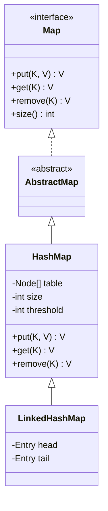

### 1.2 核心特点

| 特点 | 说明 |
|------|------|
| **键值对存储** | 每个元素是一个 `<K, V>` 键值对 |
| **无序** | 不保证插入顺序（需要有序用 `LinkedHashMap`） |
| **允许 null** | 允许一个 null key 和多个 null value |
| **非线程安全** | 多线程环境下会数据不一致，需用 `ConcurrentHashMap` |
| **基于哈希表** | 通过 hash 值定位元素，实现快速存取 |
| **懒初始化** | 第一次 put 时才创建 table 数组 |

### 1.3 时间复杂度分析

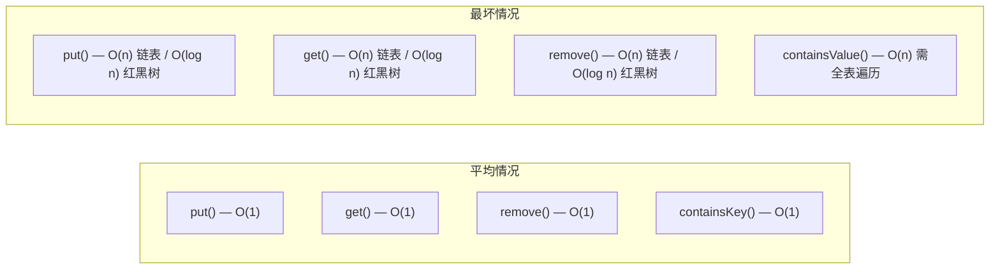

| 操作 | 平均时间复杂度 | 最坏时间复杂度 | 说明 |
|------|--------------|--------------|------|
| `put(K, V)` | O(1) | O(n) / O(log n) | 链表退化时 O(n)，红黑树时 O(log n) |
| `get(K)` | O(1) | O(n) / O(log n) | 同上 |
| `remove(K)` | O(1) | O(n) / O(log n) | 同上 |
| `containsKey(K)` | O(1) | O(n) / O(log n) | 同上 |
| `containsValue(V)` | O(n) | O(n) | 必须遍历所有桶 |

**为什么平均 O(1)？**
- hash 函数将 key 映射到桶位置，直接定位，无需遍历
- 负载因子控制冲突数量，大部分桶只有 0~1 个元素

**为什么最坏 O(n)？**
- 如果所有 key 的 hash 值相同（极端 hash 冲突），所有元素在同一个桶
- 桶内退化为链表，查找需要逐个比较

**JDK 8 优化**：链表长度 ≥ 8 且数组长度 ≥ 64 时，链表转为红黑树，最坏时间从 O(n) 降为 O(log n)

---

## 2. 底层数据结构演进

### 2.1 JDK 7：数组 + 链表

JDK 7 的 HashMap 底层是 **数组 + 链表** 的组合：
- **数组**：`Entry<K,V>[] table`，每个位置称为一个"桶"（bucket）
- **链表**：当多个 key 的 hash 映射到同一个桶时，用链表解决冲突（链地址法）
- **插入方式**：**头插法**（新元素插入链表头部）

```java
// JDK 7 的 Entry 节点
static class Entry<K,V> implements Map.Entry<K,V> {
    final K key;
    V value;
    Entry<K,V> next;  // 链表指针
    int hash;
}
```

**JDK 7 结构示意图：**

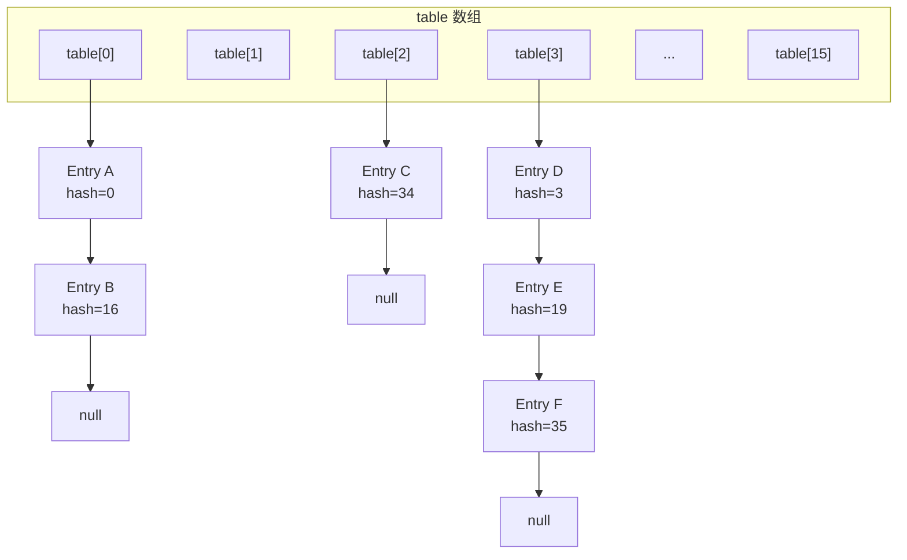

**JDK 7 头插法的问题：**
1. 新元素总是插入链表头部，导致链表顺序与插入顺序相反
2. **多线程扩容时**，头插法 + 并发 = 链表可能形成环 → **死循环**（CPU 100%）
3. 链表过长时（大量 hash 冲突），查找效率退化为 O(n)

### 2.2 JDK 8：数组 + 链表 + 红黑树

JDK 8 对 HashMap 做了重大优化：
- **数组**：`Node<K,V>[] table`（从 Entry 改名为 Node）
- **链表**：hash 冲突时，用链表存储（**尾插法**）
- **红黑树**：当链表长度 ≥ 8 且数组长度 ≥ 64 时，链表转为**红黑树**（TreeNode）
- **退化**：当红黑树节点 ≤ 6 时，退化为链表

```java
// JDK 8 的 Node 节点（普通链表节点）
static class Node<K,V> implements Map.Entry<K,V> {
    final int hash;
    final K key;
    V value;
    Node<K,V> next;
}

// JDK 8 的 TreeNode 节点（红黑树节点）
static final class TreeNode<K,V> extends LinkedHashMap.Entry<K,V> {
    TreeNode<K,V> parent;  // 父节点
    TreeNode<K,V> left;    // 左子节点
    TreeNode<K,V> right;   // 右子节点
    TreeNode<K,V> prev;    // 前驱（用于删除时链接）
    boolean red;           // 红/黑
}
```

**JDK 8 结构示意图：**

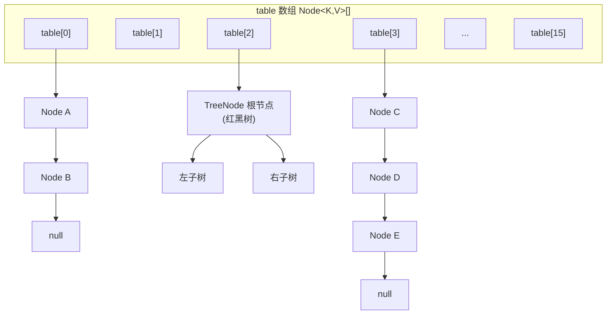

### 2.3 为什么引入红黑树

**问题**：当 hash 冲突严重时，同一个桶的链表会非常长，查找效率退化为 O(n)。

**分析**：
- 假设某个桶有 1000 个节点（极端冲突），链表查找平均需要比较 500 次
- 如果是红黑树，查找只需要 log₂(1000) ≈ 10 次
- **性能差距：50 倍！**

**为什么选择红黑树而不是 AVL 树？**

| 对比项 | 红黑树 | AVL 树 |
|--------|--------|--------|
| 平衡程度 | 近似平衡（黑色高度平衡） | 严格平衡（高度差 ≤ 1） |
| 查找效率 | O(log n)（稍慢） | O(log n)（略快） |
| 插入/删除效率 | **更快**（旋转次数少，最多 3 次） | 较慢（可能多次旋转） |
| 适用场景 | 插入/删除频繁 | 查找密集 |

**结论**：HashMap 的场景是**插入和删除频繁**（put/remove），红黑树在插入删除时只需要 O(1) 次旋转，比 AVL 树更适合。

### 2.4 JDK 7 与 JDK 8 核心差异对比

| 特性 | JDK 7 | JDK 8 |
|------|-------|-------|
| 底层结构 | 数组 + 链表 | 数组 + 链表 + 红黑树 |
| 节点类名 | `Entry<K,V>` | `Node<K,V>` / `TreeNode<K,V>` |
| 插入方式 | **头插法** | **尾插法** |
| hash 方法 | 4 次扰动 + 5 次异或 | 1 次扰动（高16位异或低16位） |
| 扩容机制 | 重新计算每个元素的桶位置 | hash & oldCap 判断高低位 |
| 链表过长 | 不处理（一直链表） | 转为红黑树 |
| 并发安全 | 死循环（头插法环形链表） | 不会死循环，但仍然不安全 |

---

## 3. 核心常量与字段

### 3.1 核心常量

```java
// ============ 容量相关 ============

/**
 * 默认初始容量：16
 * 为什么是 16？
 * 1. 太小（如4）→ 频繁扩容
 * 2. 太大（如1024）→ 浪费内存
 * 3. 16 是经验值，在内存和性能之间取得平衡
 * 4. 必须是 2 的幂（位运算优化取模）
 */
static final int DEFAULT_INITIAL_CAPACITY = 1 << 4; // 16

/**
 * 最大容量：2^30 = 1073741824
 * 为什么是 2^30 而不是 2^31？
 * - int 最大值是 2^31 - 1，而容量必须是 2 的幂
 * - 2^31 是 Integer.MIN_VALUE（负数），不能用
 * - 所以最大只能是 2^30
 */
static final int MAXIMUM_CAPACITY = 1 << 30;

/**
 * 默认负载因子：0.75
 * 为什么是 0.75？
 * - 是空间利用率和时间效率的最佳折中
 * - 太大（如 1.0）→ 冲突多，查找变慢
 * - 太小（如 0.5）→ 冲突少但浪费内存
 * - 0.75 时泊松分布下，单桶元素数 ≥ 8 的概率 < 0.00000006
 * 
 * 数学基础：
 * - 在随机 hash 下，桶中元素数服从泊松分布 P(X=k) = (λ^k * e^(-λ)) / k!
 * - λ = n * p = 0.75（负载因子就是 λ）
 * - P(X≥8) ≈ 0.00000006，极其罕见
 */
static final float DEFAULT_LOAD_FACTOR = 0.75f;

// ============ 红黑树相关 ============

/**
 * 树化阈值：8
 * 链表长度 >= 8 时，考虑转为红黑树
 * 
 * 为什么是 8？
 * - 泊松分布下，负载因子 0.75 时：
 *   P(0) = 0.60653066   P(1) = 0.30326533
 *   P(2) = 0.07581633   P(3) = 0.01263606
 *   P(4) = 0.00157952   P(5) = 0.00015795
 *   P(6) = 0.00001316   P(7) = 0.00000094
 *   P(8) = 0.00000006   ← 几乎不可能！
 * - 链表到 8 基本是 hash 攻击或极端情况
 * - 此时转红黑树，从 O(n) 优化到 O(log n)
 */
static final int TREEIFY_THRESHOLD = 8;

/**
 * 退化阈值：6
 * 红黑树节点 <= 6 时，退化为链表
 * 
 * 为什么是 6 而不是 8？
 * - 如果也是 8，会导致频繁的 "树化 ↔ 退化" 抖动
 * - 中间留 2 个缓冲（7 和 8），避免边界反复转换
 * - 类似"迟滞"效应（hysteresis）
 */
static final int UNTREEIFY_THRESHOLD = 6;

/**
 * 最小树化容量：64
 * 只有当 table.length >= 64 时，才允许树化
 * 如果 table.length < 64，即使链表 >= 8，也只扩容不树化
 * 
 * 为什么？
 * - 小容量时冲突多是正常的（桶太少）
 * - 扩容能更有效地减少冲突
 * - 红黑树维护成本高（旋转、着色），小表划不来
 */
static final int MIN_TREEIFY_CAPACITY = 64;
```

### 3.2 核心字段

```java
/**
 * 存储桶的数组（Hash 表的主体）
 * 
 * 特点：
 * - 懒初始化：构造时不创建，第一次 put 时才分配
 * - 长度总是 2 的幂（0, 16, 32, 64, ...）
 * - 每个位置称为一个"桶"，桶内可以是 null / Node 链表 / TreeNode 红黑树
 */
transient Node<K,V>[] table;

/**
 * 当前键值对的数量
 * 注意：size 不等于 table.length（table.length 是容量/桶数）
 */
transient int size;

/**
 * 扩容阈值 = capacity * loadFactor
 * 当 size > threshold 时触发扩容
 * 
 * 例如：capacity=16, loadFactor=0.75 → threshold=12
 * 即：插入第 13 个元素时触发扩容
 */
int threshold;

/**
 * 负载因子
 * 控制 table 的填充程度
 * threshold = capacity * loadFactor
 */
final float loadFactor;

/**
 * 修改计数器（fail-fast 机制）
 * 每次结构修改（put/remove）时 modCount++
 * 迭代器在遍历时检查 modCount 是否变化，变了就抛 ConcurrentModificationException
 */
transient int modCount;

/**
 * entrySet 缓存（懒初始化）
 */
transient Set<Map.Entry<K,V>> entrySet;
```

### 3.3 字段关系图

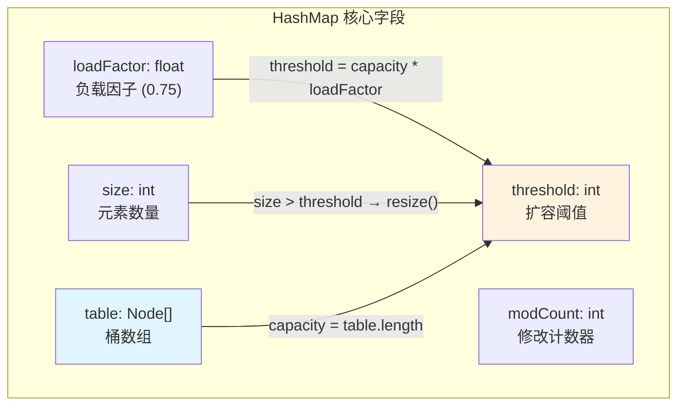

**关键公式：**
```
capacity = table.length                    // 桶的数量
threshold = capacity * loadFactor          // 扩容阈值
扩容条件：size > threshold                  // 元素数 > 阈值时扩容
新容量 = 旧容量 * 2                         // 每次翻倍
```

**示例：**
```
初始状态：capacity=16, loadFactor=0.75, threshold=12
插入第1~12个元素：正常插入，不扩容
插入第13个元素：size=13 > threshold=12 → 触发扩容
扩容后：capacity=32, threshold=24
```

---

## 4. hash() 方法深度分析

### 4.1 源码

```java
/**
 * JDK 8 的 hash 方法（扰动函数）
 */
static final int hash(Object key) {
    int h;
    return (key == null) ? 0 : (h = key.hashCode()) ^ (h >>> 16);
}
```

这段代码虽然只有一行，但设计非常精巧。让我们逐步拆解。

### 4.2 执行过程分析

```java
// 假设 key = "Java"
int h = key.hashCode();     // 第1步：获取 hashCode
// h = 2301506 = 0000 0000 0010 0011 0001 1110 0010 0010

int h_shifted = h >>> 16;   // 第2步：无符号右移16位
// h >>> 16 = 0000 0000 0000 0000 0000 0000 0010 0011

int hash = h ^ h_shifted;   // 第3步：异或
// hash = 0000 0000 0010 0011 0001 1110 0000 0001
```

**图解扰动过程：**

```
原始 hashCode (h):
  高16位                      低16位
  0000 0000 0010 0011   |   0001 1110 0010 0010

h >>> 16 (高16位移到低16位):
  0000 0000 0000 0000   |   0000 0000 0010 0011

XOR 异或:
  0000 0000 0010 0011   |   0001 1110 0000 0001
                              ↑ 高位信息混入低位
```

### 4.3 为什么要高16位异或低16位

**核心问题**：桶定位公式是 `(n-1) & hash`，当 n（容量）较小时，**只有 hash 的低位参与运算**，高位被完全忽略。

```java
// 假设容量 n = 16
// n - 1 = 15 = 0000 0000 0000 0000 0000 0000 0000 1111
// 只有最低4位有效！高28位全被 & 掉了
int index = (16 - 1) & hash;
```

**不做扰动的后果：**

```java
// 两个 hashCode，高位不同，低4位相同
int h1 = 0b0001_0000_0000_0000_0000_0000_0001_0101; // 高位不同
int h2 = 0b0010_0000_0000_0000_0000_0000_0001_0101; // 高位不同
int h3 = 0b0100_0000_0000_0000_0000_0000_0001_0101; // 高位不同

// 不做扰动，直接取低4位
h1 & 15 = 5;  // 桶 5
h2 & 15 = 5;  // 桶 5 → 冲突！
h3 & 15 = 5;  // 桶 5 → 冲突！

// 做扰动后
hash(h1) & 15 = ?; // 不同的桶！
hash(h2) & 15 = ?; // 不同的桶！
```

**扰动函数的作用**：让高16位的信息**"下沉"**到低位，使得即使高位不同的 hashCode，在低位也能体现差异，**减少冲突**。

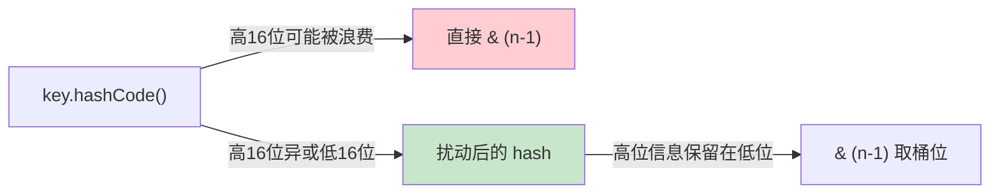

### 4.4 为什么容量必须是 2 的幂

**原因：将取模运算优化为位与运算。**

```java
// 数学等价（仅当 n 是 2 的幂时成立）：
hash % n  ==  hash & (n - 1)

// 例如 n = 16:
// hash % 16  ==  hash & 15
// hash & 0b1111  →  取 hash 的低4位
```

**为什么用位运算？**
- **取模运算 `%`**：需要除法，CPU 耗时约 20~30 个时钟周期
- **位与运算 `&`**：只需 1 个时钟周期
- **性能差距：20~30 倍！**

**为什么 n 必须是 2 的幂才能等价？**

```
当 n = 2^k 时：
  n     = 100...0  (k 个 0)
  n - 1 = 011...1  (k 个 1)

hash & (n-1) 相当于取 hash 的低 k 位
这等价于 hash % n

当 n 不是 2 的幂时：
  例如 n = 10
  n - 1 = 9 = 1001
  hash & 1001 ≠ hash % 10
  并且某些桶位置永远不会被映射到，造成空间浪费
```

### 4.5 tableSizeFor() 方法

```java
/**
 * 返回 >= cap 的最小 2 的幂
 * 
 * 例如：
 *   tableSizeFor(1)  → 1
 *   tableSizeFor(5)  → 8
 *   tableSizeFor(10) → 16
 *   tableSizeFor(16) → 16
 *   tableSizeFor(17) → 32
 */
static final int tableSizeFor(int cap) {
    int n = cap - 1;       // 防止 cap 本身就是 2 的幂时翻倍
    n |= n >>> 1;          // 最高位的1扩展到右边1位
    n |= n >>> 2;          // 继续扩展2位
    n |= n >>> 4;          // 继续扩展4位
    n |= n >>> 8;          // 继续扩展8位
    n |= n >>> 16;         // 继续扩展16位
    // 至此，n 的最高位到最低位全部变成1
    return (n < 0) ? 1 : (n >= MAXIMUM_CAPACITY) ? MAXIMUM_CAPACITY : n + 1;
}
```

**图解算法过程（以 cap=20 为例）：**

```
cap = 20
n = cap - 1 = 19 = 0001 0011

n |= n >>> 1:
  0001 0011
  0000 1001  (>>> 1)
  ---------
  0001 1011

n |= n >>> 2:
  0001 1011
  0000 0110  (>>> 2)
  ---------
  0001 1111

n |= n >>> 4:
  0001 1111
  0000 0001  (>>> 4)
  ---------
  0001 1111  (已经全是1了)

... 后续不变

n + 1 = 0010 0000 = 32  ← >= 20 的最小 2 的幂
```

**算法本质**：将最高位的 1 "涂满" 到所有低位，然后 +1 进位，得到 2 的幂。

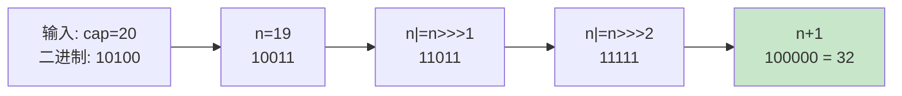

### 4.6 null key 的处理

```java
static final int hash(Object key) {
    int h;
    return (key == null) ? 0 : (h = key.hashCode()) ^ (h >>> 16);
    //      ↑ null key 的 hash = 0，总是放在 table[0]
}
```

- HashMap **允许一个 null key**
- null key 的 hash 值固定为 0，总是存储在 `table[0]` 位置
- `Hashtable` 和 `ConcurrentHashMap` **不允许** null key

---

## 5. put() 方法源码逐行分析

### 5.1 put() 入口

```java
public V put(K key, V value) {
    return putVal(hash(key), key, value, false, true);
}
```

- `hash(key)`：先计算 key 的 hash 值
- `putVal()`：实际执行插入的核心方法
- `false`（onlyIfAbsent）：存在时覆盖旧值
- `true`（evict）：表模式标志，普通使用时为 true

### 5.2 putVal() 完整源码 + 逐行注释

```java
final V putVal(int hash, K key, V value, boolean onlyIfAbsent, boolean evict) {
    Node<K,V>[] tab;  // 局部变量引用 table
    Node<K,V> p;      // 桶中的第一个节点
    int n, i;         // n=table长度, i=桶索引

    // ★ 第1步：table 为空或长度为0 → 初始化（懒加载）
    if ((tab = table) == null || (n = tab.length) == 0)
        n = (tab = resize()).length;
        // resize() 既负责初始化，也负责扩容

    // ★ 第2步：计算桶位置，如果桶为空 → 直接放入新节点
    if ((p = tab[i = (n - 1) & hash]) == null)
        tab[i] = newNode(hash, key, value, null);
        // (n-1) & hash 等价于 hash % n（因为 n 是 2 的幂）
        // 桶为空，没有冲突，直接创建新节点放入

    else {
        // ★ 第3步：桶不为空 → 有冲突，需要处理
        Node<K,V> e;  // 目标节点（如果找到已存在的 key）
        K k;

        // ★ 3a：检查第一个节点是否就是要找的 key
        if (p.hash == hash &&
            ((k = p.key) == key || (key != null && key.equals(k))))
            e = p;
            // 找到了！第一个节点就是目标
            // 先比 hash（int比较快），再比引用或equals

        // ★ 3b：如果第一个节点是红黑树节点 → 用红黑树的方式插入
        else if (p instanceof TreeNode)
            e = ((TreeNode<K,V>)p).putTreeVal(this, tab, hash, key, value);

        // ★ 3c：否则是链表 → 遍历链表
        else {
            for (int binCount = 0; ; ++binCount) {

                // 遍历到链表尾部，没有找到相同的 key → 尾插新节点
                if ((e = p.next) == null) {
                    p.next = newNode(hash, key, value, null);
                    // ★ 关键：尾插法！JDK 7 是头插法

                    // ★ 检查是否需要树化
                    // binCount 从 0 开始，当 binCount = 7 时（第8个节点），
                    // 加上新插入的节点，链表长度 = 8 + 1 = 9
                    // 但注意 TREEIFY_THRESHOLD - 1 = 7
                    if (binCount >= TREEIFY_THRESHOLD - 1) // -1 for 1st
                        treeifyBin(tab, hash);
                        // 树化（但内部还要检查 table.length >= 64）
                    break;
                }

                // 在链表中找到了相同的 key → 停止遍历
                if (e.hash == hash &&
                    ((k = e.key) == key || (key != null && key.equals(k))))
                    break;

                p = e;  // 移动到下一个节点
            }
        }

        // ★ 第4步：如果找到了已存在的 key → 覆盖旧值
        if (e != null) { // existing mapping for key
            V oldValue = e.value;
            if (!onlyIfAbsent || oldValue == null)
                e.value = value;  // 覆盖
            afterNodeAccess(e);   // 回调钩子（LinkedHashMap 用）
            return oldValue;      // 返回旧值
        }
    }

    // ★ 第5步：修改计数器 +1（fail-fast 机制）
    ++modCount;

    // ★ 第6步：size +1，检查是否需要扩容
    if (++size > threshold)
        resize();

    afterNodeInsertion(evict);  // 回调钩子（LinkedHashMap 用）
    return null;  // 新插入返回 null（没有旧值）
}
```

### 5.3 put() 流程图

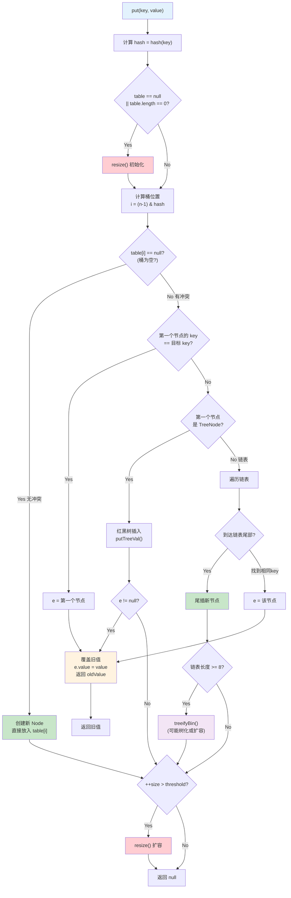

### 5.4 put() 各分支详细分析

#### 分支1：table 为空 → resize() 初始化

```java
if ((tab = table) == null || (n = tab.length) == 0)
    n = (tab = resize()).length;
```

- HashMap 是**懒初始化**的，构造时不创建 table
- 第一次 put 时才通过 resize() 创建 table
- 默认 resize() 创建 capacity=16 的数组，threshold=12

#### 分支2：桶为空 → 直接放入

```java
if ((p = tab[i = (n - 1) & hash]) == null)
    tab[i] = newNode(hash, key, value, null);
```

- 计算桶位置 `i = (n-1) & hash`
- 桶为空（没有冲突），直接创建 Node 放入
- 这是**最常见**的情况（O(1)）

#### 分支3a：第一个节点就是目标 key

```java
if (p.hash == hash &&
    ((k = p.key) == key || (key != null && key.equals(k))))
    e = p;
```

- **先比 hash**：int 比较非常快，可以快速过滤掉大部分不相等的 key
- **再比引用**：`p.key == key`，如果是同一个对象，直接匹配
- **最后比 equals**：`key.equals(k)`，逻辑相等
- 三级过滤，效率最大化

#### 分支3b：红黑树插入

```java
else if (p instanceof TreeNode)
    e = ((TreeNode<K,V>)p).putTreeVal(this, tab, hash, key, value);
```

- 如果桶中已经是红黑树，调用 TreeNode 的插入方法
- 时间复杂度 O(log n)

#### 分支3c：链表遍历 + 尾插法

```java
for (int binCount = 0; ; ++binCount) {
    if ((e = p.next) == null) {
        p.next = newNode(hash, key, value, null);  // 尾插
        if (binCount >= TREEIFY_THRESHOLD - 1)      // 链表长度 >= 8
            treeifyBin(tab, hash);                   // 树化
        break;
    }
    if (e.hash == hash &&
        ((k = e.key) == key || (key != null && key.equals(k))))
        break;  // 找到相同 key
    p = e;
}
```

**遍历过程：**
1. 从第二个节点开始遍历链表
2. 如果遍历到 null → 到达尾部，尾插新节点
3. 如果发现相同 key → 停止遍历，后续覆盖旧值
4. **binCount** 统计遍历的节点数，达到 8 时触发树化

**为什么用尾插法而不是头插法？**
- 头插法在多线程扩容时会形成环形链表（JDK 7 的 bug）
- 尾插法保持链表顺序不变，避免死循环
- 尾插法需要遍历到链表末尾，**但由于还要检查 key 是否存在，遍历是必须的**

#### 分支4：覆盖旧值

```java
if (e != null) {
    V oldValue = e.value;
    if (!onlyIfAbsent || oldValue == null)
        e.value = value;
    afterNodeAccess(e);
    return oldValue;
}
```

- 如果找到了已存在的 key（e != null），覆盖旧值
- `onlyIfAbsent=false` 时无条件覆盖（`put` 方法）
- `onlyIfAbsent=true` 且旧值不为 null 时不覆盖（`putIfAbsent` 方法）
- 返回旧值

#### 分支5/6：modCount++ 和扩容检查

```java
++modCount;           // 结构修改计数 +1
if (++size > threshold)
    resize();          // 扩容
afterNodeInsertion(evict);
return null;
```

- **modCount++**：用于 fail-fast 迭代器检测
- **size > threshold**：size 先 +1，再与 threshold 比较，超过则扩容
- 返回 null（新 key，没有旧值）

---

## 6. get() 方法源码分析

### 6.1 get() 入口

```java
public V get(Object key) {
    Node<K,V> e;
    return (e = getNode(hash(key), key)) == null ? null : e.value;
}
```

### 6.2 getNode() 完整源码 + 逐行注释

```java
final Node<K,V> getNode(int hash, Object key) {
    Node<K,V>[] tab;  // 局部变量引用 table
    Node<K,V> first, e;  // first=桶中第一个节点, e=遍历指针
    int n;  // table 长度
    K k;

    // ★ 第1步：table 不为空 && 桶不为空
    if ((tab = table) != null && (n = tab.length) > 0 &&
        (first = tab[(n - 1) & hash]) != null) {

        // ★ 第2步：检查第一个节点（大部分情况直接命中）
        if (first.hash == hash && // always check first node
            ((k = first.key) == key || (key != null && key.equals(k))))
            return first;
            // 第一个节点就是目标！直接返回
            // 在 hash 分布均匀的情况下，大多数桶只有 1 个节点

        // ★ 第3步：第一个节点不是 → 继续查找
        if ((e = first.next) != null) {

            // 3a：如果是红黑树 → 用红黑树查找（O(log n)）
            if (first instanceof TreeNode)
                return ((TreeNode<K,V>)first).getTreeNode(hash, key);

            // 3b：否则是链表 → 遍历链表（O(n)）
            do {
                if (e.hash == hash &&
                    ((k = e.key) == key || (key != null && key.equals(k))))
                    return e;  // 找到了
            } while ((e = e.next) != null);
        }
    }
    return null;  // 没找到
}
```

### 6.3 get() 流程图

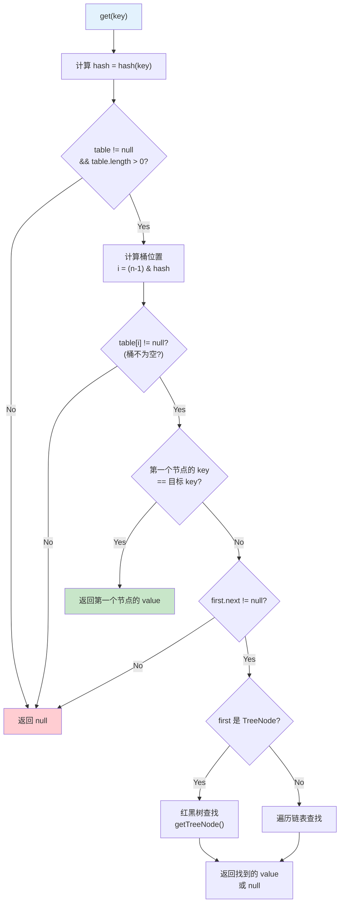

### 6.4 为什么先检查第一个节点

```java
if (first.hash == hash &&
    ((k = first.key) == key || (key != null && key.equals(k))))
    return first;
```

**原因：性能优化**
- 在 hash 分布均匀且负载因子 = 0.75 的情况下：
  - 约 60% 的桶是空的（直接返回 null）
  - 约 30% 的桶只有 1 个节点（检查第一个就够了）
  - 只有约 10% 的桶有 2 个以上节点
- **先检查第一个节点可以覆盖 ~90% 的有效查找场景**

### 6.5 containsKey() vs get()

```java
public boolean containsKey(Object key) {
    return getNode(hash(key), key) != null;
}
```

**注意**：
- `get()` 返回 null 有**两种含义**：key 不存在，或 value 本身就是 null
- 如果要区分这两种情况，用 `containsKey()`

```java
map.put("key", null);
map.get("key");          // null（但 key 存在！）
map.get("no_such_key");  // null（key 不存在）
map.containsKey("key");  // true ← 能区分
```

---

## 7. resize() 扩容机制

resize() 是 HashMap 中最复杂的方法之一，既负责**初始化**，又负责**扩容**。

### 7.1 扩容时机

扩容在以下情况触发：
1. **首次 put 时**：table 为 null，需要初始化
2. **size > threshold 时**：元素数量超过阈值，需要扩容
3. **treeifyBin() 时发现 table.length < 64**：不树化，改为扩容

### 7.2 resize() 完整源码 + 逐行注释

```java
final Node<K,V>[] resize() {
    Node<K,V>[] oldTab = table;      // 旧 table
    int oldCap = (oldTab == null) ? 0 : oldTab.length;  // 旧容量
    int oldThr = threshold;           // 旧阈值
    int newCap, newThr = 0;          // 新容量、新阈值

    // ============ 第1部分：计算新容量和新阈值 ============

    if (oldCap > 0) {
        // ★ 情况1：已经初始化过，正常扩容
        if (oldCap >= MAXIMUM_CAPACITY) {
            // 容量已达上限，无法再扩
            threshold = Integer.MAX_VALUE;
            return oldTab;
        }
        else if ((newCap = oldCap << 1) < MAXIMUM_CAPACITY &&
                 oldCap >= DEFAULT_INITIAL_CAPACITY)
            // 新容量 = 旧容量 * 2（左移1位）
            // 新阈值也翻倍
            newThr = oldThr << 1; // double threshold
    }
    else if (oldThr > 0)
        // ★ 情况2：构造时指定了初始容量（存在 threshold 里）
        // new HashMap(initialCapacity) → threshold = tableSizeFor(cap)
        newCap = oldThr;  // 用 threshold 作为新容量
    else {
        // ★ 情况3：默认构造，完全初始化
        // new HashMap() → capacity=16, threshold=12
        newCap = DEFAULT_INITIAL_CAPACITY;           // 16
        newThr = (int)(DEFAULT_LOAD_FACTOR * DEFAULT_INITIAL_CAPACITY); // 12
    }

    if (newThr == 0) {
        // 计算新阈值（情况2走到这里）
        float ft = (float)newCap * loadFactor;
        newThr = (newCap < MAXIMUM_CAPACITY && ft < (float)MAXIMUM_CAPACITY ?
                  (int)ft : Integer.MAX_VALUE);
    }
    threshold = newThr;  // 更新阈值

    // ============ 第2部分：创建新数组 ============

    @SuppressWarnings({"rawtypes","unchecked"})
    Node<K,V>[] newTab = (Node<K,V>[])new Node[newCap];
    table = newTab;

    // ============ 第3部分：迁移旧数据 ============

    if (oldTab != null) {
        for (int j = 0; j < oldCap; ++j) {
            Node<K,V> e;
            if ((e = oldTab[j]) != null) {
                oldTab[j] = null; // 帮助 GC 回收旧数组

                // ★ 情况A：桶中只有一个节点 → 直接重新定位
                if (e.next == null)
                    newTab[e.hash & (newCap - 1)] = e;

                // ★ 情况B：桶中是红黑树 → 拆分树
                else if (e instanceof TreeNode)
                    ((TreeNode<K,V>)e).split(this, newTab, j, oldCap);

                // ★ 情况C：桶中是链表 → 高低位链表拆分（JDK 8 核心优化）
                else { // preserve order
                    Node<K,V> loHead = null, loTail = null; // 低位链表
                    Node<K,V> hiHead = null, hiTail = null; // 高位链表
                    Node<K,V> next;

                    do {
                        next = e.next;

                        // ★ 核心判断：e.hash & oldCap
                        if ((e.hash & oldCap) == 0) {
                            // 高位为 0 → 留在原位置（低位链表）
                            if (loTail == null)
                                loHead = e;
                            else
                                loTail.next = e;
                            loTail = e;
                        }
                        else {
                            // 高位为 1 → 移到 原位置 + oldCap（高位链表）
                            if (hiTail == null)
                                hiHead = e;
                            else
                                hiTail.next = e;
                            hiTail = e;
                        }
                    } while ((e = next) != null);

                    // 低位链表放在原位置
                    if (loTail != null) {
                        loTail.next = null;
                        newTab[j] = loHead;
                    }
                    // 高位链表放在 原位置 + oldCap
                    if (hiTail != null) {
                        hiTail.next = null;
                        newTab[j + oldCap] = hiHead;
                    }
                }
            }
        }
    }
    return newTab;
}
```

### 7.3 扩容大小

```
扩容前：capacity = 16,  threshold = 12
扩容后：capacity = 32,  threshold = 24

扩容前：capacity = 32,  threshold = 24
扩容后：capacity = 64,  threshold = 48

规律：每次扩容，容量和阈值都翻倍
```

### 7.4 JDK 8 核心优化：不需要重新计算 hash

这是 JDK 8 HashMap 最精彩的优化之一。

**JDK 7 的做法**：扩容时对每个元素重新计算 `indexFor(e.hash, newCapacity)`，即 `e.hash & (newCap - 1)`。

**JDK 8 的优化**：只需要看 `e.hash & oldCap` 是 0 还是 1。

#### 原理详解

假设 oldCap = 16，扩容到 newCap = 32：

```
oldCap = 16 = 10000

oldCap - 1 = 15 = 01111    ← 旧的掩码
newCap - 1 = 31 = 11111    ← 新的掩码
                    ↑
                    唯一的差别：多了最高位的1
```

**新掩码比旧掩码多了1位**，这个多出的1位恰好就是 `oldCap` 的位置！

所以：
- 如果 `hash` 在这个位置是 **0** → `hash & newMask == hash & oldMask`，**桶位置不变**
- 如果 `hash` 在这个位置是 **1** → 桶位置 = **原位置 + oldCap**

**判断方式**：`e.hash & oldCap`
- `== 0` → 留在原位（低位链表）
- `!= 0` → 移到原位 + oldCap（高位链表）

#### 图解

```
以桶 index=5 为例，oldCap=16，扩容到 newCap=32

原来在桶5的元素，hash 的低5位形如 ?0101:

元素A: hash = ...0_0101  → hash & 16(10000) = 0 → 留在桶5
元素B: hash = ...1_0101  → hash & 16(10000) = 16 → 移到桶 5+16=21
元素C: hash = ...0_0101  → hash & 16(10000) = 0 → 留在桶5
元素D: hash = ...1_0101  → hash & 16(10000) = 16 → 移到桶21
```

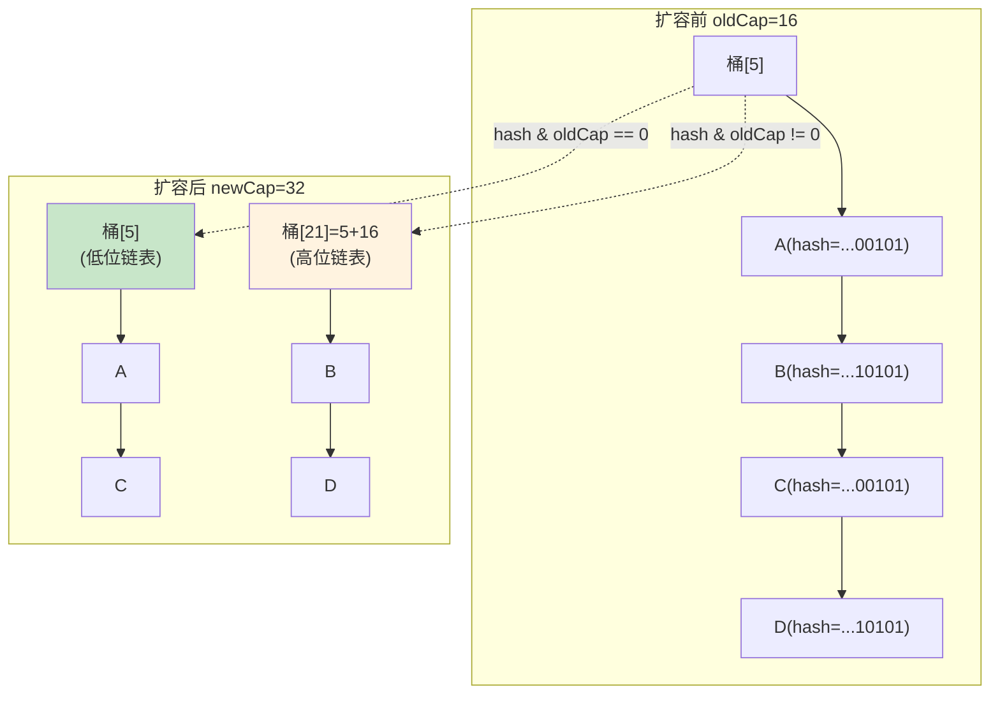

#### 优势

| 对比项 | JDK 7 | JDK 8 |
|--------|--------|--------|
| 新位置计算 | `hash & (newCap-1)`（重新计算） | `hash & oldCap`（一次位与） |
| 链表处理 | 头插法（顺序反转） | 尾插法（顺序保持） |
| 线程安全 | 多线程死循环 | 不会死循环（但仍不安全） |
| 性能 | 较慢 | 更快（位运算更简单） |

### 7.5 JDK 7 扩容的多线程死循环问题

这是面试中**超高频**的问题。

#### JDK 7 的 transfer 方法（头插法）

```java
// JDK 7 扩容时的数据迁移（头插法）
void transfer(Entry[] newTable, boolean rehash) {
    int newCapacity = newTable.length;
    for (Entry<K,V> e : table) {
        while(null != e) {
            Entry<K,V> next = e.next;        // ① 保存 next
            if (rehash) {
                e.hash = (null == e.key) ? 0 : hash(e.key);
            }
            int i = indexFor(e.hash, newCapacity); // ② 计算新桶位置
            e.next = newTable[i];             // ③ 头插：e 指向桶头
            newTable[i] = e;                  // ④ e 成为新桶头
            e = next;                         // ⑤ 处理下一个
        }
    }
}
```

#### 死循环形成过程详解

**初始状态**：假设桶中链表为 `A → B → null`，两个线程同时触发扩容。

**正常单线程头插法扩容**：
```
原链表：A → B → null
头插法结果：B → A → null  (顺序反转！)
```

**多线程并发扩容导致死循环：**

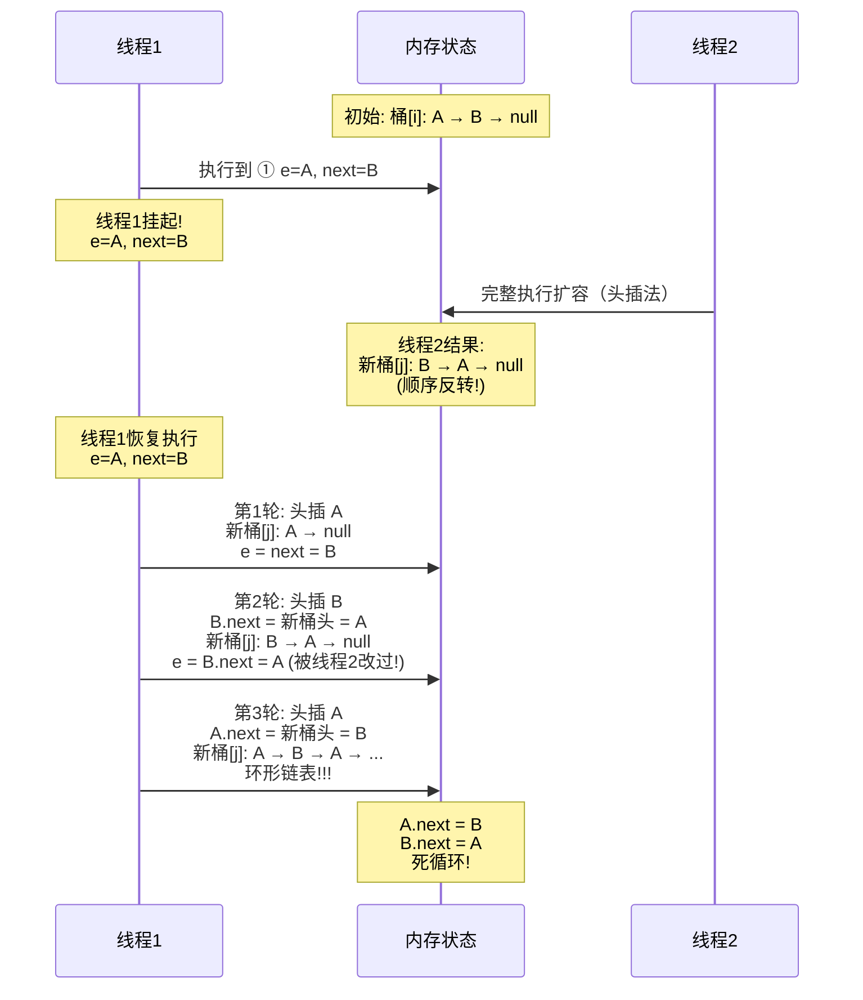

**详细图解：**

```
═══════════════════════════════════════════════
步骤0：初始状态
═══════════════════════════════════════════════
  旧桶[i]: A → B → null

  线程1暂停在 ①：e = A, next = B
  线程2开始完整扩容...

═══════════════════════════════════════════════
步骤1：线程2完成扩容（头插法，顺序反转）
═══════════════════════════════════════════════
  线程2新桶[j]: B → A → null
  
  此时内存中：B.next = A, A.next = null
  但线程1还保存着：e = A, next = B

═══════════════════════════════════════════════
步骤2：线程1恢复，第1轮循环
═══════════════════════════════════════════════
  e = A, next = B
  
  ③ A.next = newTable[j] = null  (线程1的新表是空的)
  ④ newTable[j] = A
  ⑤ e = next = B
  
  线程1新桶[j]: A → null
  e = B

═══════════════════════════════════════════════
步骤3：线程1第2轮循环
═══════════════════════════════════════════════
  e = B
  ① next = B.next = A  (已被线程2改成指向A!)
  
  ③ B.next = newTable[j] = A  (头插)
  ④ newTable[j] = B
  ⑤ e = next = A  (不是null!)
  
  线程1新桶[j]: B → A → null
  e = A

═══════════════════════════════════════════════
步骤4：线程1第3轮循环 → 形成环!
═══════════════════════════════════════════════
  e = A
  ① next = A.next = null  (在步骤2中被设为null)
  
  ③ A.next = newTable[j] = B  (头插: A指向B)
  ④ newTable[j] = A
  ⑤ e = next = null → 循环结束
  
  最终: A → B → A → B → ... (环形链表!)
       A.next = B, B.next = A
```

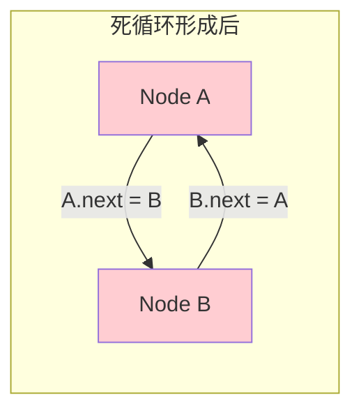

**后果**：任何 `get()` 操作如果访问到这个桶，会在环形链表中无限遍历，**CPU 飙升 100%，程序卡死**。

**JDK 8 的修复**：改用**尾插法**，扩容时保持链表顺序不变，不会产生环形链表。

---

## 8. 红黑树相关

### 8.1 红黑树的 5 个性质

红黑树是一种**自平衡二叉搜索树**，满足以下 5 个性质：

| 性质 | 描述 |
|------|------|
| 性质1 | 每个节点是**红色**或**黑色** |
| 性质2 | **根节点**是黑色 |
| 性质3 | **叶子节点**（NIL/null）是黑色 |
| 性质4 | 如果一个节点是**红色**，则它的两个子节点都是**黑色**（不能有连续红节点） |
| 性质5 | 从任意节点到其所有叶子节点的路径上，**黑色节点数量相同**（黑色高度一致） |

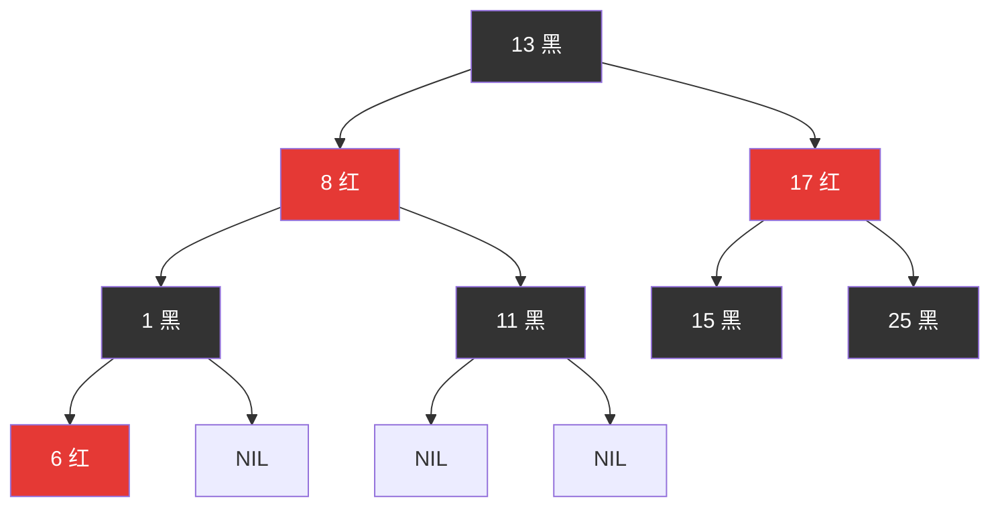

**性质5** 保证了红黑树的关键特性：**最长路径不超过最短路径的 2 倍**。

证明：
- 最短路径：全黑节点，长度 = B（黑色高度）
- 最长路径：红黑交替，长度 = 2B
- 所以树的高度 h ≤ 2 * log₂(n+1)，查找复杂度 O(log n)

### 8.2 树化条件

HashMap 中链表转红黑树需要同时满足两个条件：

```java
// 条件1：链表长度 >= 8（在 putVal 中判断）
if (binCount >= TREEIFY_THRESHOLD - 1) // TREEIFY_THRESHOLD = 8
    treeifyBin(tab, hash);

// 条件2：table.length >= 64（在 treeifyBin 中判断）
final void treeifyBin(Node<K,V>[] tab, int hash) {
    int n, index; Node<K,V> e;
    if (tab == null || (n = tab.length) < MIN_TREEIFY_CAPACITY) // 64
        resize();  // 不树化，改为扩容！
    else if ((e = tab[index = (n - 1) & hash]) != null) {
        // 真正的树化过程...
    }
}
```

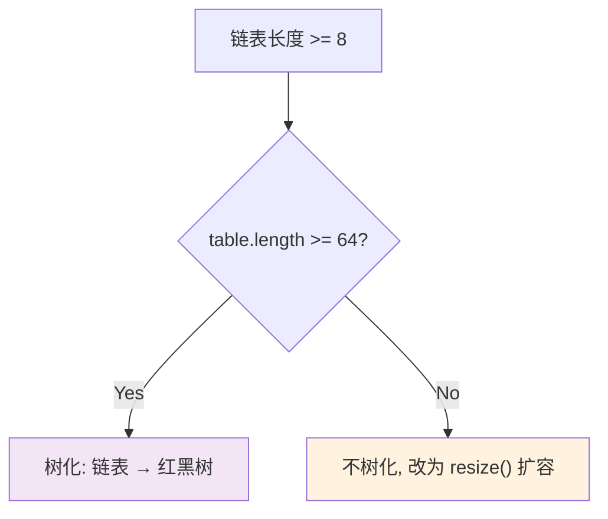

**为什么有两个条件？**
- table 容量小时（< 64），冲突多是正常的（桶太少）
- 此时**扩容**比**树化**更有效 → 扩容后元素重新分布，冲突自然减少
- 只有 table 容量足够大时，链表还是很长，才说明是真的 hash 冲突严重，这时才树化

### 8.3 退化条件

红黑树在以下情况退化为链表：

```java
// 在 resize() 拆分红黑树时，如果树的一半节点 <= UNTREEIFY_THRESHOLD(6)
// 则退化为链表
if (lc <= UNTREEIFY_THRESHOLD)
    tab[index] = loHead.untreeify(map);
```

**退化时机**：扩容（resize）时，红黑树被拆分为高低两部分，如果某一部分的节点数 ≤ 6，则退化为链表。

**注意**：remove 操作不会直接触发退化检查，只有 resize 时才检查。

### 8.4 treeifyBin() 过程

```java
final void treeifyBin(Node<K,V>[] tab, int hash) {
    int n, index; Node<K,V> e;

    // 1. 容量 < 64 → 扩容而非树化
    if (tab == null || (n = tab.length) < MIN_TREEIFY_CAPACITY)
        resize();

    else if ((e = tab[index = (n - 1) & hash]) != null) {
        TreeNode<K,V> hd = null, tl = null;

        // 2. 将 Node 链表转为 TreeNode 双向链表
        do {
            TreeNode<K,V> p = replacementTreeNode(e, null);
            if (tl == null)
                hd = p;       // 头节点
            else {
                p.prev = tl;  // 双向链接
                tl.next = p;
            }
            tl = p;
        } while ((e = e.next) != null);

        // 3. 将 TreeNode 双向链表转为红黑树
        if ((tab[index] = hd) != null)
            hd.treeify(tab);
    }
}
```

**过程分解：**

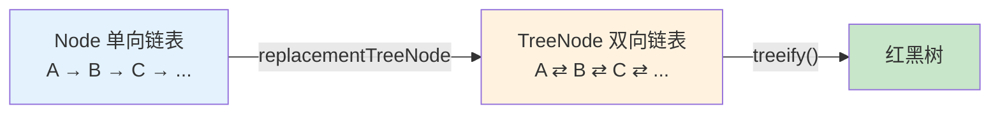

### 8.5 treeify() 红黑树构建过程

`treeify()` 方法将 TreeNode 链表转为实际的红黑树结构：

```java
final void treeify(Node<K,V>[] tab) {
    TreeNode<K,V> root = null;

    for (TreeNode<K,V> x = this, next; x != null; x = next) {
        next = (TreeNode<K,V>)x.next;
        x.left = x.right = null;

        // 第一个节点作为根，染黑
        if (root == null) {
            x.parent = null;
            x.red = false;  // 根节点是黑色
            root = x;
        }
        else {
            K k = x.key;
            int h = x.hash;
            Class<?> kc = null;

            // 从根节点开始，找到插入位置
            for (TreeNode<K,V> p = root;;) {
                int dir, ph;
                K pk = p.key;

                // 比较 hash 值决定左右
                if ((ph = p.hash) > h)
                    dir = -1;  // 往左子树
                else if (ph < h)
                    dir = 1;   // 往右子树
                else if ((kc == null &&
                          (kc = comparableClassFor(k)) == null) ||
                         (dir = compareComparables(kc, k, pk)) == 0)
                    dir = tieBreakingCompare(k, pk); // hash 相同时的仲裁

                TreeNode<K,V> xp = p;
                // 找到空位，插入
                if ((p = (dir <= 0) ? p.left : p.right) == null) {
                    x.parent = xp;
                    if (dir <= 0)
                        xp.left = x;
                    else
                        xp.right = x;
                    // 插入后修复红黑树性质
                    root = balanceInsertion(root, x);
                    break;
                }
            }
        }
    }
    // 确保根节点在桶的第一个位置
    moveRootToFront(tab, root);
}
```

### 8.6 untreeify() 退化过程

```java
final Node<K,V> untreeify(HashMap<K,V> map) {
    Node<K,V> hd = null, tl = null;

    // 将 TreeNode 转回普通 Node，保持链表顺序
    for (Node<K,V> q = this; q != null; q = q.next) {
        Node<K,V> p = map.replacementNode(q, null);
        if (tl == null)
            hd = p;
        else
            tl.next = p;
        tl = p;
    }
    return hd;
}
```

### 8.7 为什么树化阈值是 8，退化阈值是 6

**泊松分布概率分析：**

在理想的随机 hash 分布下，负载因子 λ = 0.75 时，桶中元素数量 k 服从泊松分布：

```
P(X = k) = (λ^k * e^(-λ)) / k!

k=0: P = 0.60653066    ← 60% 的桶是空的
k=1: P = 0.30326533    ← 30% 的桶只有1个元素
k=2: P = 0.07581633
k=3: P = 0.01263606
k=4: P = 0.00157952
k=5: P = 0.00015795
k=6: P = 0.00001316
k=7: P = 0.00000094
k=8: P = 0.00000006    ← 千万分之六！
```

**结论：**
- 正常情况下，链表长度到达 8 的概率**不到千万分之一**
- 如果真的到了 8，几乎可以确定是 **hash 攻击**或 **hashCode 实现很差**
- 此时转红黑树是值得的（O(n) → O(log n)）

**为什么退化阈值是 6 而不是 8？**
- 如果退化阈值也是 8，那么在 8 附近会不断"树化 → 退化 → 树化"（抖动）
- 中间留 2 个缓冲（7 和 8），**避免频繁转换的性能损耗**
- 这是一种**迟滞（Hysteresis）设计**


---

## 9. remove() 方法源码分析

### 9.1 remove() 入口

```java
public V remove(Object key) {
    Node<K,V> e;
    return (e = removeNode(hash(key), key, null, false, true)) == null ?
        null : e.value;
}
```

### 9.2 removeNode() 完整源码 + 逐行注释

```java
/**
 * @param hash       key 的 hash 值
 * @param key        要删除的 key
 * @param value      如果 matchValue 为 true，只有 value 也匹配时才删除
 * @param matchValue 是否需要匹配 value
 * @param movable    红黑树删除时是否移动其他节点
 * @return 被删除的节点，null 表示未找到
 */
final Node<K,V> removeNode(int hash, Object key, Object value,
                            boolean matchValue, boolean movable) {
    Node<K,V>[] tab; Node<K,V> p; int n, index;

    // ★ 第1步：table 不为空 && 桶不为空
    if ((tab = table) != null && (n = tab.length) > 0 &&
        (p = tab[index = (n - 1) & hash]) != null) {

        Node<K,V> node = null, e; K k; V v;

        // ★ 第2步：查找目标节点

        // 2a：检查第一个节点
        if (p.hash == hash &&
            ((k = p.key) == key || (key != null && key.equals(k))))
            node = p;

        // 2b：第一个不是，继续查找
        else if ((e = p.next) != null) {
            // 红黑树查找
            if (p instanceof TreeNode)
                node = ((TreeNode<K,V>)p).getTreeNode(hash, key);
            // 链表遍历
            else {
                do {
                    if (e.hash == hash &&
                        ((k = e.key) == key ||
                         (key != null && key.equals(k)))) {
                        node = e;
                        break;
                    }
                    p = e;  // p 始终指向 node 的前一个节点
                } while ((e = e.next) != null);
            }
        }

        // ★ 第3步：找到了 → 删除

        if (node != null && (!matchValue || (v = node.value) == value ||
                             (value != null && value.equals(v)))) {

            // 3a：红黑树删除
            if (node instanceof TreeNode)
                ((TreeNode<K,V>)node).removeTreeNode(this, tab, movable);

            // 3b：目标是桶的第一个节点
            else if (node == p)
                tab[index] = node.next;

            // 3c：目标在链表中间或末尾
            else
                p.next = node.next;

            ++modCount;
            --size;
            afterNodeRemoval(node);  // 回调钩子
            return node;
        }
    }
    return null;
}
```

### 9.3 remove() 流程图

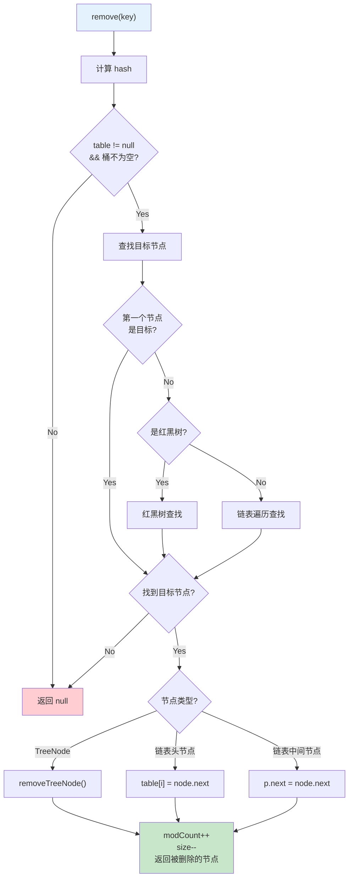

### 9.4 链表删除图解

```
删除链表中间节点（假设删除 B）：

  删除前: table[i] → A → B → C → null
                      ↑p  ↑node

  操作: p.next = node.next
  
  删除后: table[i] → A → C → null
                      B (被回收)

删除链表头节点（假设删除 A）：

  删除前: table[i] → A → B → C → null
                      ↑p=node

  操作: table[i] = node.next
  
  删除后: table[i] → B → C → null
                      A (被回收)
```

---

## 10. HashMap 的线程不安全性分析

### 10.1 HashMap 为什么不是线程安全的？

HashMap 没有任何同步机制，多线程并发操作会导致以下问题：

### 10.2 问题1：数据覆盖（JDK 7 & 8）

**场景**：两个线程同时 put 到同一个空桶

```java
// putVal 中的关键代码
if ((p = tab[i = (n - 1) & hash]) == null)
    tab[i] = newNode(hash, key, value, null);
```

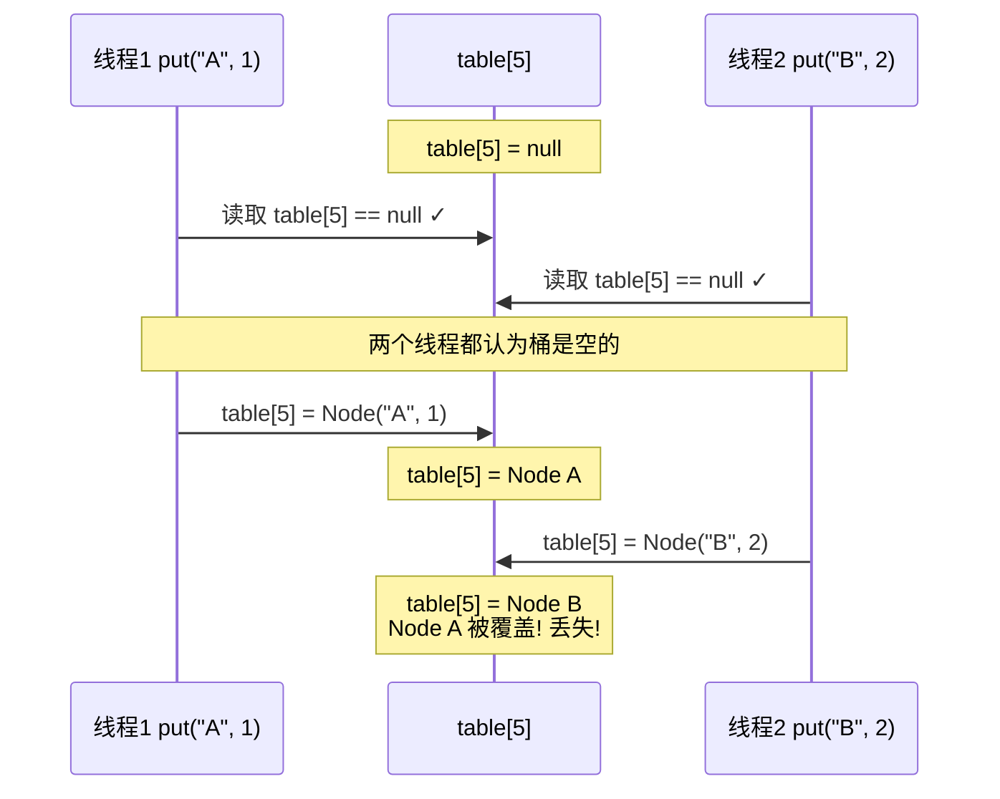

### 10.3 问题2：JDK 7 死循环（前面已详细分析）

- 头插法 + 并发扩容 → 环形链表
- `get()` 遍历到环形链表 → 无限循环 → CPU 100%
- **JDK 8 已修复**（改为尾插法），但并发仍然不安全

### 10.4 问题3：size 不准确

```java
// putVal 中
if (++size > threshold)  // size++ 不是原子操作
    resize();
```

`++size` 对应的字节码：

```
getfield      size    // 读取 size 到栈
iconst_1              // 压入 1
iadd                  // 相加
putfield      size    // 写回 size
```

**多线程场景：**
```
线程1: getfield size → 读到 10
线程2: getfield size → 读到 10
线程1: iadd → 11, putfield → size = 11
线程2: iadd → 11, putfield → size = 11
// 两个线程各插入了 1 个元素，但 size 只增加了 1！
```

### 10.5 问题4：扩容期间数据丢失/读到 null

- 线程1正在扩容，数据从旧表迁移到新表
- 线程2在旧表中读取数据 → 可能读到 null（数据已迁移到新表）
- 线程2在新表中写入数据 → 可能被线程1的扩容覆盖

### 10.6 解决方案

| 方案 | 原理 | 优点 | 缺点 | 推荐场景 |
|------|------|------|------|---------|
| `Collections.synchronizedMap(map)` | 对所有方法加 `synchronized` | 简单，兼容 HashMap | 性能差（全表锁） | 简单场景 |
| `Hashtable` | 所有方法加 `synchronized` | JDK 1.0 就有 | 性能差，不允许 null | **不推荐**（遗留类） |
| `ConcurrentHashMap` | JDK 7: 分段锁<br/>JDK 8: CAS + synchronized | **高并发性能最好** | 不允许 null key/value | **高并发首选** |

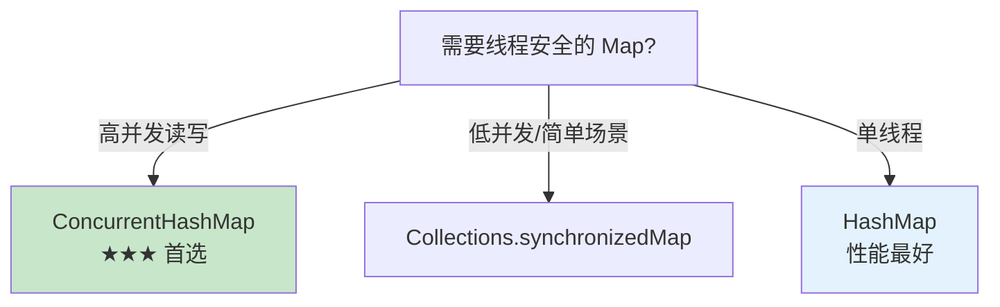

**Collections.synchronizedMap 的原理：**

```java
// 所有方法都用 mutex 同步
public V get(Object key) {
    synchronized (mutex) { return m.get(key); }
}
public V put(K key, V value) {
    synchronized (mutex) { return m.put(key, value); }
}
```

**ConcurrentHashMap 的优势（JDK 8）：**
- 不是全表加锁，而是**对每个桶（桶头节点）加锁**
- 读操作无锁（volatile 保证可见性）
- 写操作只锁当前桶，不影响其他桶
- 并发度 = 桶的数量，远高于 synchronizedMap

---

## 11. HashMap 与其他 Map 的对比

### 11.1 HashMap vs Hashtable

| 对比项 | HashMap | Hashtable |
|--------|---------|-----------|
| 线程安全 | 不安全 | 安全（全方法 synchronized） |
| null key | 允许 1 个 | **不允许**（NullPointerException） |
| null value | 允许多个 | **不允许**（NullPointerException） |
| 继承关系 | extends AbstractMap | extends Dictionary（过时） |
| 迭代器 | Iterator（fail-fast） | Enumeration + Iterator |
| 初始容量 | 16 | 11 |
| 扩容策略 | 容量 * 2 | 容量 * 2 + 1 |
| hash 算法 | 扰动函数 | 直接 hashCode |
| 性能 | **快**（无锁） | 慢（全表锁） |
| 推荐使用 | **是**（单线程） | **否**（已过时，用 ConcurrentHashMap 替代） |

### 11.2 HashMap vs LinkedHashMap

| 对比项 | HashMap | LinkedHashMap |
|--------|---------|---------------|
| 顺序 | **无序** | **有序**（插入顺序或访问顺序） |
| 底层结构 | 数组+链表+红黑树 | HashMap + **双向链表** |
| 内存消耗 | 较少 | 较多（额外维护双向链表） |
| 性能 | 略快 | 略慢（维护链表开销） |
| 用途 | 通用 Map | 需要保持顺序、**LRU 缓存** |

```java
// LinkedHashMap 实现 LRU 缓存
LinkedHashMap<Integer, String> lru = new LinkedHashMap<>(16, 0.75f, true) {
    @Override
    protected boolean removeEldestEntry(Map.Entry<Integer, String> eldest) {
        return size() > 100; // 超过100个元素时删除最旧的
    }
};
```

### 11.3 HashMap vs TreeMap

| 对比项 | HashMap | TreeMap |
|--------|---------|---------|
| 顺序 | **无序** | **按 key 排序**（自然顺序或 Comparator） |
| 底层结构 | 哈希表 | **红黑树** |
| 时间复杂度 | O(1) 平均 | **O(log n)** |
| null key | 允许 | **不允许**（排序需要比较） |
| 额外功能 | 无 | `firstKey()`, `lastKey()`, `subMap()`, `headMap()` 等 |
| 用途 | 通用快速查找 | 需要**排序**或**范围查找** |

### 11.4 HashMap vs ConcurrentHashMap

| 对比项 | HashMap | ConcurrentHashMap |
|--------|---------|-------------------|
| 线程安全 | 不安全 | **安全** |
| null key | 允许 | **不允许** |
| null value | 允许 | **不允许** |
| 锁机制 | 无 | JDK 7: 分段锁<br/>JDK 8: CAS + synchronized（桶级别） |
| 并发读 | — | **无锁**（volatile） |
| 并发写 | — | **锁桶头节点** |
| size() | O(1) | O(n)（JDK 7）/ baseCount+counterCells（JDK 8） |
| 迭代器 | fail-fast | **弱一致性**（不抛 CME） |
| 性能（单线程） | **更快** | 稍慢 |
| 性能（多线程） | 不安全 | **高效** |

### 11.5 对比总表

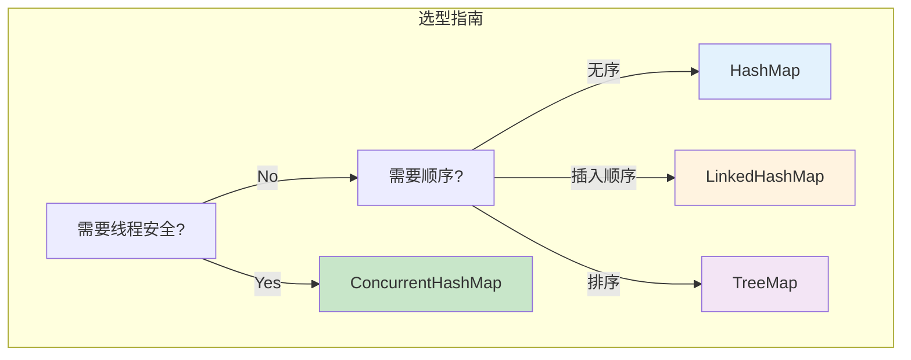

| 特性 | HashMap | Hashtable | LinkedHashMap | TreeMap | ConcurrentHashMap |
|------|---------|-----------|---------------|---------|-------------------|
| 线程安全 | ✗ | ✓ | ✗ | ✗ | ✓ |
| 有序 | ✗ | ✗ | ✓(插入序) | ✓(排序) | ✗ |
| null key | ✓ | ✗ | ✓ | ✗ | ✗ |
| null value | ✓ | ✗ | ✓ | ✓ | ✗ |
| 时间复杂度 | O(1) | O(1) | O(1) | O(log n) | O(1) |
| 推荐使用 | ✓ 单线程通用 | ✗ 已过时 | ✓ 需要顺序 | ✓ 需要排序 | ✓ 多线程 |

---

## 12. 手写简化版 HashMap

### 12.1 设计思路

我们实现一个简化版 HashMap，包含以下核心功能：

1. **数据结构**：数组 + 链表（不实现红黑树）
2. **hash 计算**：与 JDK 8 一致的扰动函数
3. **核心方法**：put / get / remove / size
4. **扩容机制**：JDK 8 高低位链表拆分

**与 JDK HashMap 的差距：**
- 没有红黑树（链表过长不转换）
- 没有实现 Map 接口
- 没有 fail-fast 机制（modCount）
- 没有实现序列化

### 12.2 Node 内部类

```java
static class Node<K, V> {
    final int hash;    // hash 值（缓存，避免重复计算）
    final K key;       // 键（final，不可变）
    V value;           // 值（可变，允许覆盖）
    Node<K, V> next;   // 链表下一个节点

    Node(int hash, K key, V value, Node<K, V> next) {
        this.hash = hash;
        this.key = key;
        this.value = value;
        this.next = next;
    }
}
```

### 12.3 hash() 方法

```java
static int hash(Object key) {
    int h;
    return (key == null) ? 0 : (h = key.hashCode()) ^ (h >>> 16);
}
```

与 JDK 8 完全一致：高16位异或低16位。

### 12.4 put() 方法

```java
public V put(K key, V value) {
    // 1. table 为空则初始化
    if (table == null || table.length == 0) {
        resize();
    }

    int hash = hash(key);
    int n = table.length;
    int index = (n - 1) & hash;  // 计算桶位置

    // 2. 桶为空 → 直接放入新节点
    Node<K, V> first = table[index];
    if (first == null) {
        table[index] = new Node<>(hash, key, value, null);
    } else {
        // 3. 桶不为空 → 遍历链表
        Node<K, V> e = first;
        Node<K, V> prev = null;

        while (e != null) {
            // 找到相同 key → 覆盖 value
            if (e.hash == hash && (e.key == key || (key != null && key.equals(e.key)))) {
                V oldValue = e.value;
                e.value = value;
                return oldValue;  // 返回旧值
            }
            prev = e;
            e = e.next;
        }

        // 没找到相同 key → 尾插法添加新节点
        prev.next = new Node<>(hash, key, value, null);
    }

    // 4. size + 1，检查是否需要扩容
    if (++size > threshold) {
        resize();
    }

    return null;
}
```

### 12.5 get() 方法

```java
public V get(K key) {
    if (table == null || table.length == 0) {
        return null;
    }

    int hash = hash(key);
    int index = (table.length - 1) & hash;
    Node<K, V> e = table[index];

    while (e != null) {
        if (e.hash == hash && (e.key == key || (key != null && key.equals(e.key)))) {
            return e.value;
        }
        e = e.next;
    }

    return null;
}
```

### 12.6 remove() 方法

```java
public V remove(K key) {
    if (table == null || table.length == 0) {
        return null;
    }

    int hash = hash(key);
    int index = (table.length - 1) & hash;
    Node<K, V> e = table[index];
    Node<K, V> prev = null;

    while (e != null) {
        if (e.hash == hash && (e.key == key || (key != null && key.equals(e.key)))) {
            if (prev == null) {
                table[index] = e.next;   // 删除头节点
            } else {
                prev.next = e.next;      // 删除中间/尾节点
            }
            size--;
            return e.value;
        }
        prev = e;
        e = e.next;
    }

    return null;
}
```

### 12.7 resize() 扩容方法

```java
void resize() {
    Node<K, V>[] oldTable = table;
    int oldCap = (oldTable == null) ? 0 : oldTable.length;
    int oldThr = threshold;
    int newCap, newThr;

    if (oldCap > 0) {
        newCap = oldCap << 1;  // 容量翻倍
        newThr = (int) (newCap * loadFactor);
    } else if (oldThr > 0) {
        newCap = oldThr;
        newThr = (int) (newCap * loadFactor);
    } else {
        newCap = 16;      // 默认容量
        newThr = (int) (16 * 0.75f);  // 12
    }

    threshold = newThr;
    Node<K, V>[] newTable = new Node[newCap];
    table = newTable;

    // 迁移数据（JDK 8 高低位链表拆分）
    if (oldTable != null) {
        for (int j = 0; j < oldCap; j++) {
            Node<K, V> e = oldTable[j];
            if (e == null) continue;
            oldTable[j] = null;  // 帮助 GC

            if (e.next == null) {
                // 只有一个节点，直接放到新位置
                newTable[e.hash & (newCap - 1)] = e;
            } else {
                // 高低位链表拆分
                Node<K, V> loHead = null, loTail = null;
                Node<K, V> hiHead = null, hiTail = null;
                Node<K, V> next;

                do {
                    next = e.next;
                    if ((e.hash & oldCap) == 0) {
                        if (loTail == null) loHead = e;
                        else loTail.next = e;
                        loTail = e;
                    } else {
                        if (hiTail == null) hiHead = e;
                        else hiTail.next = e;
                        hiTail = e;
                    }
                } while ((e = next) != null);

                if (loTail != null) {
                    loTail.next = null;
                    newTable[j] = loHead;
                }
                if (hiTail != null) {
                    hiTail.next = null;
                    newTable[j + oldCap] = hiHead;
                }
            }
        }
    }
}
```

### 12.8 tableSizeFor() 方法

```java
static int tableSizeFor(int cap) {
    int n = cap - 1;
    n |= n >>> 1;
    n |= n >>> 2;
    n |= n >>> 4;
    n |= n >>> 8;
    n |= n >>> 16;
    return (n < 0) ? 1 : (n >= (1 << 30)) ? (1 << 30) : n + 1;
}
```

### 12.9 完整实现流程图

```mermaid
graph TB
    subgraph "SimpleHashMap 核心方法"
        PUT["put(K, V)"]
        GET["get(K)"]
        REMOVE["remove(K)"]
        RESIZE["resize()"]
    end

    subgraph "put 流程"
        P1["hash(key)"] --> P2["index = hash & (n-1)"]
        P2 --> P3{"桶为空?"}
        P3 -->|Yes| P4["new Node 放入"]
        P3 -->|No| P5["遍历链表"]
        P5 --> P6{"key 存在?"}
        P6 -->|Yes| P7["覆盖旧值"]
        P6 -->|No| P8["尾插新节点"]
        P4 & P8 --> P9{"size > threshold?"}
        P9 -->|Yes| RESIZE
    end

    subgraph "resize 流程"
        R1["新容量 = 旧容量 * 2"] --> R2["创建新数组"]
        R2 --> R3["遍历旧数组每个桶"]
        R3 --> R4{"桶内情况"}
        R4 -->|"1个节点"| R5["直接放新位置"]
        R4 -->|"多个节点"| R6["高低位链表拆分"]
        R6 --> R7["低位链表 → 桶[j]"]
        R6 --> R8["高位链表 → 桶[j+oldCap]"]
    end
```

---

## 13. 面试高频问题

### 问题1：HashMap 的底层数据结构是什么？

**答**：JDK 8 的 HashMap 底层是**数组 + 链表 + 红黑树**。

- **数组**：`Node<K,V>[] table`，长度总是 2 的幂，每个位置称为一个桶（bucket）
- **链表**：hash 冲突时，同一个桶中的元素用链表连接（尾插法）
- **红黑树**：当链表长度 ≥ 8 且数组长度 ≥ 64 时，链表转为红黑树；当树节点 ≤ 6 时退化为链表

JDK 7 是 **数组 + 链表**（没有红黑树），使用头插法。

---

### 问题2：HashMap 的 put 过程是怎样的？

**答**：

1. 调用 `hash(key)` 计算 hash 值（高16位异或低16位的扰动函数）
2. 如果 table 为空，先调用 `resize()` 初始化
3. 计算桶位置 `i = (n-1) & hash`
4. 如果桶为空，直接创建新 Node 放入
5. 如果桶不为空（有冲突）：
   - 如果第一个节点就是目标 key → 准备覆盖
   - 如果是红黑树 → 红黑树方式插入
   - 如果是链表 → 遍历链表，尾插新节点；如果链表长度 ≥ 8 → 调用 `treeifyBin()`
6. 如果找到了已存在的 key → 覆盖旧值，返回旧值
7. `modCount++`，`size++`
8. 如果 `size > threshold` → 调用 `resize()` 扩容

---

### 问题3：HashMap 的 hash 方法为什么要高16位异或低16位？

**答**：

因为桶的定位公式是 `(n-1) & hash`，当 n（容量）较小时，**只有 hash 的低位参与运算，高位被浪费**。

例如 n=16 时，(n-1)=15=0b1111，只取 hash 的低4位。如果两个 key 的 hashCode 高位不同但低4位相同，就会映射到同一个桶（碰撞）。

**高16位异或低16位**的作用是让高位信息也"参与"到低位中，使得即使高位不同，低位也会不同，从而**减少 hash 碰撞**。

这种设计在性能和碰撞率之间取得了很好的平衡：只需要一次位移和一次异或，代价极小。

---

### 问题4：HashMap 的容量为什么必须是 2 的幂？

**答**：

有两个原因：

1. **位运算优化取模**：`hash % n == hash & (n-1)`，这个等式只有在 n 是 2 的幂时才成立。位与运算比取模运算快 20~30 倍。

2. **扩容时元素重新分布更高效**：扩容时只需要看 `hash & oldCap` 的最高位是 0 还是 1，就能决定元素留在原位还是移到 `原位 + oldCap`，不需要重新计算 hash。

3. **hash 分布更均匀**：当 n 是 2 的幂时，`(n-1)` 的二进制全是 1（如 15=0b1111），`hash & (n-1)` 相当于取 hash 的低位，每个桶被映射到的概率相等。如果 n 不是 2 的幂，某些桶永远不会被映射到。

---

### 问题5：HashMap 的扩容机制是怎样的？

**答**：

**触发条件**：当 `size > threshold`（threshold = capacity * loadFactor）时触发扩容。

**扩容过程**：
1. 新容量 = 旧容量 * 2，新阈值 = 旧阈值 * 2
2. 创建新的 Node 数组（长度为新容量）
3. 遍历旧数组的每个桶，将元素迁移到新数组：
   - 桶中只有一个节点 → 直接 `hash & (newCap-1)` 放到新位置
   - 桶中是红黑树 → `split()` 拆分
   - 桶中是链表 → **高低位链表拆分**（JDK 8 优化）

**JDK 8 高低位链表拆分**：
- 用 `e.hash & oldCap` 判断：
  - `== 0` → 留在原位（低位链表）
  - `!= 0` → 移到 `原位 + oldCap`（高位链表）
- 不需要重新计算 hash，只需要一次位与运算

---

### 问题6：为什么负载因子是 0.75？

**答**：

0.75 是**空间利用率和时间效率的最佳折中**：

- **负载因子越大**（如 1.0）：空间利用率高，但碰撞概率大，链表变长，查找变慢
- **负载因子越小**（如 0.5）：碰撞少，查找快，但浪费内存（大量空桶）

在 0.75 的负载因子下，根据泊松分布：
- 约 60% 的桶是空的
- 约 30% 的桶有 1 个元素
- 链表长度达到 8 的概率不到千万分之一

源码注释中也提到：0.75 提供了一个很好的 time/space tradeoff（时间/空间权衡）。

---

### 问题7：链表什么时候转红黑树？为什么阈值是 8？

**答**：

**转换条件**：
1. 链表长度 ≥ 8（TREEIFY_THRESHOLD）
2. **且** table 长度 ≥ 64（MIN_TREEIFY_CAPACITY）
3. 如果 table 长度 < 64，则只扩容不树化

**为什么阈值是 8？**

根据泊松分布，负载因子 0.75 时：
- 链表长度 = 8 的概率仅为 **0.00000006**（千万分之六）
- 正常使用几乎不会到达这个阈值
- 到达 8 说明是 hash 攻击或 hashCode 实现极差
- 此时转红黑树，从 O(n) 优化到 O(log n)

**为什么退化阈值是 6 而不是 8？**
- 避免在 8 附近频繁"树化 ↔ 退化"（抖动）
- 中间留 2 个缓冲（7 和 8），类似**迟滞效应**

---

### 问题8：HashMap 是线程安全的吗？怎么解决？

**答**：

**不是线程安全的。** 多线程并发操作会导致：
1. **数据覆盖**：两个线程同时 put 到同一个空桶，后者覆盖前者
2. **size 不准确**：`size++` 不是原子操作，多线程会丢失更新
3. **JDK 7 死循环**：头插法 + 并发扩容 → 环形链表 → get 死循环
4. **扩容数据丢失**：并发扩容时数据迁移可能丢失节点

**解决方案**：

| 方案 | 说明 | 推荐度 |
|------|------|--------|
| `ConcurrentHashMap` | 桶级别锁（JDK 8），高并发性能最好 | ★★★★★ |
| `Collections.synchronizedMap()` | 包装器，全方法加锁 | ★★☆☆☆ |
| `Hashtable` | 遗留类，全方法 synchronized | ★☆☆☆☆ |

**首选 ConcurrentHashMap**，它在 JDK 8 中使用 CAS + synchronized（桶头节点级别锁），读操作无锁，写操作只锁当前桶。

---

### 问题9：JDK 7 HashMap 多线程死循环是怎么产生的？

**答**：

JDK 7 HashMap 使用**头插法**迁移元素：

1. 假设桶中链表为 A → B → null
2. 线程1 执行到 `next = e.next`（e=A, next=B）后**挂起**
3. 线程2 完整执行扩容，头插法导致链表**反转**：B → A → null
4. 线程1 恢复执行：
   - 头插 A → 新桶头
   - e = B（next 保存的），头插 B → B.next = A（桶头）
   - e = B.next = A（已被线程2改成指向 A！不是 null）
   - 头插 A → A.next = B（桶头），形成**环形链表**：A → B → A → ...
5. 此后任何 get() 访问该桶都会**无限循环**，CPU 100%

JDK 8 修复：改为**尾插法**，扩容时不反转链表，所以不会形成环。

---

### 问题10：HashMap 和 ConcurrentHashMap 的区别？

**答**：

| 对比项 | HashMap | ConcurrentHashMap |
|--------|---------|-------------------|
| 线程安全 | 否 | 是 |
| null key/value | 允许 | **不允许** |
| 锁机制 | 无 | JDK 8: CAS + synchronized（桶级别） |
| 并发读 | 不安全 | 无锁（volatile） |
| 并发写 | 不安全 | 只锁当前桶 |
| 迭代器 | fail-fast | 弱一致性 |
| 性能（单线程） | 更快 | 略慢 |
| 性能（多线程） | 不安全 | 高效 |

ConcurrentHashMap 在 JDK 8 中的改进：
- 放弃分段锁（Segment），改为 **CAS + synchronized**
- 锁的粒度从 Segment 细化到**桶头节点**
- 使用 `volatile` 保证 table 和 Node.val 的可见性
- size() 使用 baseCount + CounterCell[] 来高效统计

---

### 问题11：HashMap 的 key 可以是 null 吗？存在哪里？

**答**：

可以。HashMap **允许一个 null key**。

null key 的处理：
- `hash(null)` 返回 0
- 所以 null key 总是存在 `table[0]` 位置
- put 时如果 table[0] 已有其他元素，null key 和其他元素共存在桶0的链表中

注意：
- `Hashtable` 和 `ConcurrentHashMap` **不允许** null key
- HashMap 允许**多个 null value**
- `get(key)` 返回 null 不能区分"key 不存在"和"value 为 null"，需要用 `containsKey()` 区分

---

### 问题12：为什么重写 equals 必须重写 hashCode？

**答**：

HashMap 查找 key 的逻辑是：
```java
if (e.hash == hash && (e.key == key || key.equals(e.key)))
```

**先比 hash，再比 equals**。

如果两个对象 `equals()` 相等但 `hashCode()` 不同：
1. 它们会被分配到**不同的桶**
2. 用一个对象 put，用另一个"相等"的对象 get → **找不到！**

**契约**：
- `equals` 相等 → `hashCode` **必须**相等
- `hashCode` 相等 → `equals` **不一定**相等（hash 碰撞）

---

### 问题13：HashMap 的遍历方式有哪些？哪种最高效？

**答**：

```java
// 方式1：entrySet（推荐，最高效）
for (Map.Entry<K, V> entry : map.entrySet()) {
    K key = entry.getKey();
    V value = entry.getValue();
}

// 方式2：keySet + get（效率低，每次 get 要重新 hash）
for (K key : map.keySet()) {
    V value = map.get(key);
}

// 方式3：forEach (JDK 8)
map.forEach((key, value) -> { ... });

// 方式4：values（只需要值时）
for (V value : map.values()) { ... }

// 方式5：Iterator（需要在遍历中删除时用）
Iterator<Map.Entry<K, V>> it = map.entrySet().iterator();
while (it.hasNext()) {
    Map.Entry<K, V> entry = it.next();
    if (condition) it.remove(); // 安全删除
}
```

**最高效**：`entrySet` 遍历，只需遍历一次数组+链表，直接获取 key 和 value。

**keySet + get 效率低**：遍历一次获取 key，每次 `get()` 还要重新 hash 定位桶，相当于遍历了两次。

---

### 问题14：new HashMap(1000) 实际容量是多少？需要扩容吗？

**答**：

```java
HashMap<String, String> map = new HashMap<>(1000);
// tableSizeFor(1000) = 1024（>= 1000 的最小 2 的幂）
// 实际容量 = 1024
// threshold = 1024 * 0.75 = 768
```

如果要存 1000 个元素：
- threshold = 768 < 1000
- **会扩容！** 存到第 769 个元素时触发扩容，容量变为 2048

**最佳实践**：
```java
// 已知要存 n 个元素，设置初始容量为：
int capacity = (int)(n / 0.75f) + 1;
// n=1000: capacity = 1334 → tableSizeFor(1334) = 2048
// threshold = 2048 * 0.75 = 1536 > 1000 → 不会扩容！

HashMap<String, String> map = new HashMap<>(1334);
```

Guava 提供了便捷方法：`Maps.newHashMapWithExpectedSize(1000)`

---

### 问题15：HashMap 中 equals 和 == 有什么区别？HashMap 查找时如何比较 key？

**答**：

- `==`：比较**引用**（内存地址），判断是否是同一个对象
- `equals`：比较**内容**（逻辑相等），判断两个对象是否"相等"

HashMap 查找 key 的三级比较策略（性能从高到低）：
```java
if (e.hash == hash &&                              // 第1级：比 hash（int 比较，最快）
    ((k = e.key) == key ||                         // 第2级：比引用（如果是同一个对象）
     (key != null && key.equals(k))))              // 第3级：比 equals（逻辑相等）
```

1. **先比 hash**：int 比较非常快，可以过滤掉绝大部分不相等的 key
2. **再比引用**：如果是同一个对象，直接匹配，无需调用 equals
3. **最后比 equals**：调用 `equals()` 方法判断逻辑相等

这种三级过滤的设计，最大化了查找效率。

---

### 问题16：HashMap 是如何处理 hash 冲突的？

**答**：

HashMap 使用**链地址法**（Separate Chaining）处理 hash 冲突：

1. **计算桶位置**：`index = (n-1) & hash`
2. **发生冲突时**：将多个 hash 到同一个桶的元素用**链表**连接
3. **链表过长时**（长度 ≥ 8 且 table.length ≥ 64）：链表转为**红黑树**
4. **查找时**：先定位桶，再在桶内遍历链表/红黑树查找

**JDK 7 vs JDK 8 冲突处理对比**：
- JDK 7：链表（头插法），最坏 O(n)
- JDK 8：链表（尾插法）+ 红黑树，最坏 O(log n)

---

### 问题17：tableSizeFor 方法是怎么工作的？

**答**：

`tableSizeFor(int cap)` 方法返回 **≥ cap 的最小 2 的幂**。

算法思路：
1. `n = cap - 1`（防止 cap 本身是 2 的幂时翻倍）
2. 通过5次无符号右移+或运算，将最高位的 1 扩展到所有低位
3. 最后 `n + 1` 进位，得到 2 的幂

```
例如 cap = 20:
n = 19    = 0001 0011
n|=n>>>1  = 0001 1011
n|=n>>>2  = 0001 1111
n|=n>>>4  = 0001 1111  (已全1)
n+1       = 0010 0000 = 32
```

这个算法只需要几次位运算，效率极高（O(1)），比循环判断快得多。

---

## 总结

### 核心知识点回顾

```mermaid
mindmap
  root((HashMap 源码))
    数据结构
      数组 Node[]
      链表 Node.next
      红黑树 TreeNode
    核心方法
      hash() 扰动函数
      put() 插入
      get() 查找
      remove() 删除
      resize() 扩容
    关键设计
      容量必须是2的幂
      负载因子0.75
      树化阈值8/退化阈值6
      高低位链表拆分
    线程安全
      数据覆盖
      size不准确
      JDK7死循环
      解决方案: ConcurrentHashMap
    面试要点
      put完整流程
      扩容机制
      hash冲突处理
      vs ConcurrentHashMap
```

### 一句话总结每个方法

| 方法 | 一句话 |
|------|--------|
| `hash()` | 高16位异或低16位，让高位也参与桶定位 |
| `put()` | 计算桶位 → 空桶直放 → 有冲突则遍历链表/红黑树 → 尾插或覆盖 → 可能扩容或树化 |
| `get()` | 计算桶位 → 检查第一个节点 → 链表/红黑树遍历查找 |
| `remove()` | 计算桶位 → 查找目标节点 → 链表摘除或红黑树删除 |
| `resize()` | 容量翻倍 → 高低位链表拆分迁移（hash & oldCap 判断） |
| `treeifyBin()` | table<64 则扩容，否则链表转红黑树 |

---

> **学习建议**：
> 1. 先理解整体结构（数组+链表+红黑树），再逐个击破核心方法
> 2. `put()` 和 `resize()` 是重中之重，面试必考
> 3. 用 debug 模式单步跟踪 HashMap 源码，观察变量变化
> 4. 运行 `code/` 目录下的实验代码，加深理解
> 5. 用自己的话复述一遍，确保真正理解了
