# ConcurrentHashMap 源码深度分析

> **适用版本**：JDK 7 / JDK 8（java.util.concurrent.ConcurrentHashMap）  
> **前置知识**：HashMap 源码（Day08）、CAS 与 AQS（Day05）、volatile 与 synchronized（Day04）  
> **学习目标**：能够逐行分析 ConcurrentHashMap 源码，理解每个并发设计决策背后的原因，从容应对面试

---

## 目录

1. [为什么需要 ConcurrentHashMap](#1-为什么需要-concurrenthashmap)
2. [JDK 7 实现：分段锁 Segment](#2-jdk-7-实现分段锁-segment)
3. [JDK 8 实现：CAS + synchronized（重点）](#3-jdk-8-实现cas--synchronized重点)
4. [JDK 7 vs JDK 8 全面对比](#4-jdk-7-vs-jdk-8-全面对比)
5. [ConcurrentHashMap vs HashMap vs Hashtable 对比](#5-concurrenthashmap-vs-hashmap-vs-hashtable-对比)
6. [常见使用陷阱](#6-常见使用陷阱)
7. [面试高频问题](#7-面试高频问题)

---

## 1. 为什么需要 ConcurrentHashMap

### 1.1 HashMap 线程不安全

从 Day08 我们已经知道，HashMap 在多线程环境下存在严重问题：

| 问题 | JDK 版本 | 原因 | 后果 |
|------|---------|------|------|
| **扩容死链** | JDK 7 | 头插法 + 并发扩容 → 环形链表 | get() 死循环，CPU 100% |
| **数据覆盖** | JDK 7 & 8 | 两个线程同时 put 到同一个空桶 | 后者覆盖前者，数据丢失 |
| **size 不准确** | JDK 7 & 8 | `++size` 不是原子操作 | 计数丢失 |
| **扩容数据丢失** | JDK 7 & 8 | 并发扩容时数据迁移交叉 | 节点丢失 |

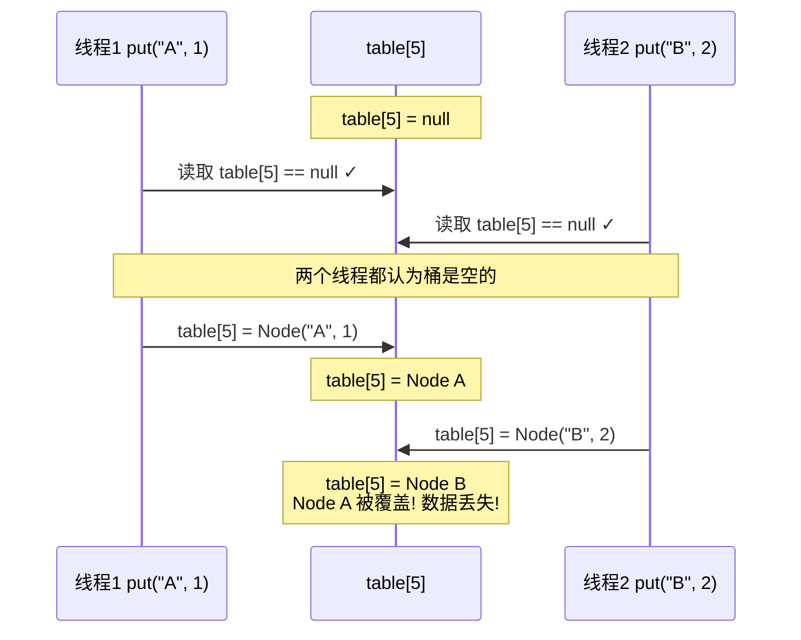

**结论：HashMap 绝对不能在多线程环境下直接使用。**

### 1.2 Hashtable：全表锁，性能差

Hashtable 是 JDK 1.0 就有的线程安全 Map，它的做法非常简单粗暴：**所有公开方法都加 `synchronized`**。

```java
// Hashtable 源码
public synchronized V put(K key, V value) {
    // ...
}
public synchronized V get(Object key) {
    // ...
}
public synchronized int size() {
    // ...
}
public synchronized V remove(Object key) {
    // ...
}
```

**问题**：

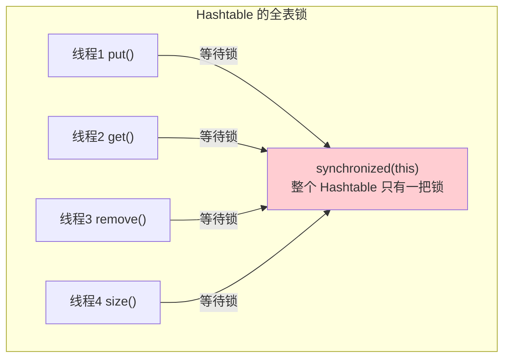

| 问题 | 说明 |
|------|------|
| **全表锁** | 所有操作共用一把锁，读与写互斥，写与写互斥，读与读也互斥 |
| **性能极差** | 任意时刻只有一个线程能操作 Hashtable，并发度 = 1 |
| **读也要锁** | 即使是 get() 这种纯读操作，也要获取锁 |
| **锁粒度太大** | 操作 table[0] 的线程 和 操作 table[100] 的线程也会互斥 |
| **已过时** | 官方推荐用 ConcurrentHashMap 替代 |

### 1.3 Collections.synchronizedMap：同样全表锁

```java
// Collections.synchronizedMap 的实现
public static <K,V> Map<K,V> synchronizedMap(Map<K,V> m) {
    return new SynchronizedMap<>(m);
}

private static class SynchronizedMap<K,V> implements Map<K,V> {
    private final Map<K,V> m;         // 被包装的 Map
    final Object mutex;                // 互斥锁对象

    public V get(Object key) {
        synchronized (mutex) { return m.get(key); }
    }
    public V put(K key, V value) {
        synchronized (mutex) { return m.put(key, value); }
    }
    public V remove(Object key) {
        synchronized (mutex) { return m.remove(key); }
    }
    public int size() {
        synchronized (mutex) { return m.size(); }
    }
}
```

**本质与 Hashtable 相同**：所有方法都用同一个 `mutex` 同步，锁粒度是整个 Map。

**额外问题：复合操作不安全**

```java
Map<String, Integer> map = Collections.synchronizedMap(new HashMap<>());

// 以下 "先检查后操作" 不是线程安全的！
if (!map.containsKey("count")) {     // ① 检查
    map.put("count", 1);             // ② 操作
}
// ①和②之间，其他线程可能已经插入了 "count"
```

### 1.4 为什么需要 ConcurrentHashMap

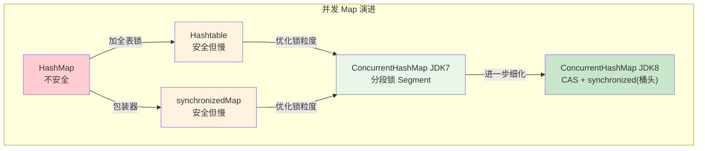

**ConcurrentHashMap 的目标**：

| 目标 | 实现方式 |
|------|---------|
| **线程安全** | CAS + synchronized（JDK 8）/ 分段锁（JDK 7） |
| **高并发性能** | 锁粒度细化到桶级别（JDK 8）/ Segment 级别（JDK 7） |
| **读操作无锁** | volatile 保证可见性，读不需要加锁 |
| **写操作低竞争** | 不同桶的写操作互不影响 |
| **原子复合操作** | 提供 compute / merge / putIfAbsent 等原子 API |

---

## 2. JDK 7 实现：分段锁 Segment

### 2.1 核心思想

JDK 7 的 ConcurrentHashMap 采用了**分段锁（Segment Locking）**的设计思想：

> 将一个大的 Map 拆分成多个小的 Segment（段），每个 Segment 独立加锁，不同 Segment 之间互不影响。

**类比理解**：
- Hashtable 就像一个大房间只有一个门（一把锁），同一时间只能一个人进出
- ConcurrentHashMap JDK 7 就像把大房间分成 16 个小房间，每个小房间有自己的门（自己的锁），16 个人可以同时进不同的小房间

### 2.2 数据结构

```java
// JDK 7 ConcurrentHashMap 的整体结构
public class ConcurrentHashMap<K,V> extends AbstractMap<K,V>
        implements ConcurrentMap<K,V>, Serializable {

    // Segment 数组（分段锁数组）
    final Segment<K,V>[] segments;

    // Segment 继承 ReentrantLock
    static final class Segment<K,V> extends ReentrantLock implements Serializable {
        transient volatile HashEntry<K,V>[] table;  // 每个 Segment 有自己的 HashEntry 数组
        transient int count;                         // 元素数量
        transient int modCount;                      // 修改计数
        transient int threshold;                     // 扩容阈值
        final float loadFactor;                      // 负载因子
    }

    // 链表节点
    static final class HashEntry<K,V> {
        final int hash;
        final K key;
        volatile V value;              // volatile 保证可见性
        volatile HashEntry<K,V> next;  // volatile 保证可见性
    }
}
```

**三层结构：Segment 数组 → HashEntry 数组 → 链表**

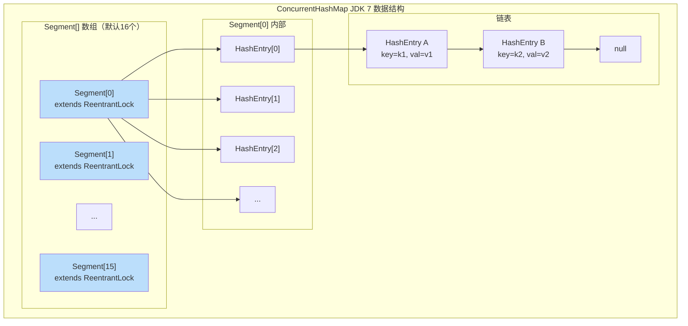

### 2.3 Segment 继承 ReentrantLock

```java
static final class Segment<K,V> extends ReentrantLock implements Serializable {
    // 每个 Segment 就是一把可重入锁
    // put 时需要先 lock()
    // get 不需要 lock（volatile 保证可见性）
}
```

**为什么继承 ReentrantLock 而不是使用 synchronized？**

| 对比 | ReentrantLock | synchronized |
|------|--------------|-------------|
| 可中断 | 支持 `lockInterruptibly()` | 不支持 |
| 超时获取 | 支持 `tryLock(timeout)` | 不支持 |
| 公平锁 | 可选公平/非公平 | 只有非公平 |
| 尝试获取 | 支持 `tryLock()` | 不支持 |

ConcurrentHashMap JDK 7 的 `scanAndLockForPut()` 方法就使用了 `tryLock()` 来尝试获取锁，获取不到时自旋重试。

### 2.4 核心常量

```java
/**
 * 默认并发度：16
 * 即默认 16 个 Segment，最多支持 16 个线程同时写入
 */
static final int DEFAULT_CONCURRENCY_LEVEL = 16;

/**
 * 默认初始容量：16
 */
static final int DEFAULT_INITIAL_CAPACITY = 16;

/**
 * 默认负载因子：0.75
 */
static final float DEFAULT_LOAD_FACTOR = 0.75f;

/**
 * Segment 最大数量：65536 (2^16)
 */
static final int MAX_SEGMENTS = 1 << 16;
```

**关键点**：
- Segment 数组的**长度在初始化后就固定了，不能扩容**
- 只有 Segment 内部的 HashEntry 数组可以扩容
- 默认 16 个 Segment，意味着默认并发度 = 16（最多 16 个线程同时写）

### 2.5 定位过程：两次 hash

JDK 7 中定位一个元素需要**两次定位**：

```java
// 第1次定位：确定在哪个 Segment
int segmentIndex = (hash >>> segmentShift) & segmentMask;

// 第2次定位：确定在 Segment 内部的哪个桶
int bucketIndex = hash & (table.length - 1);
```

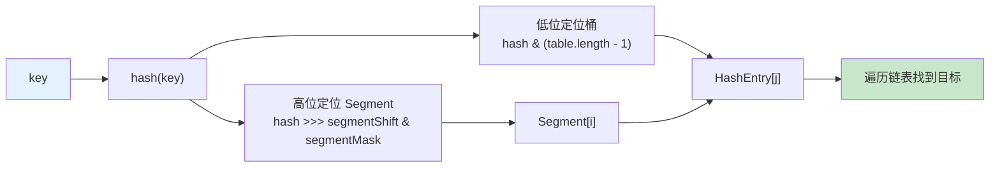

### 2.6 put 操作流程

```java
public V put(K key, V value) {
    Segment<K,V> s;
    if (value == null)
        throw new NullPointerException();  // 不允许 null value

    int hash = hash(key);

    // 第1步：定位 Segment
    int j = (hash >>> segmentShift) & segmentMask;
    s = ensureSegment(j);  // 确保 Segment 已初始化

    // 第2步：在 Segment 内部执行 put
    return s.put(key, hash, value, false);
}

// Segment 内部的 put 方法
final V put(K key, int hash, V value, boolean onlyIfAbsent) {
    // ★ 第1步：尝试获取锁
    HashEntry<K,V> node = tryLock() ? null :
        scanAndLockForPut(key, hash, value);  // 获取不到就自旋

    V oldValue;
    try {
        HashEntry<K,V>[] tab = table;
        int index = (tab.length - 1) & hash;     // 定位桶
        HashEntry<K,V> first = entryAt(tab, index); // 桶的第一个节点

        // ★ 第2步：遍历链表
        for (HashEntry<K,V> e = first;;) {
            if (e != null) {
                K k;
                // 找到相同 key → 覆盖
                if ((k = e.key) == key ||
                    (e.hash == hash && key.equals(k))) {
                    oldValue = e.value;
                    if (!onlyIfAbsent) {
                        e.value = value;
                        ++modCount;
                    }
                    break;
                }
                e = e.next;  // 继续遍历
            } else {
                // ★ 第3步：到达链表尾部，头插法插入新节点
                if (node != null)
                    node.setNext(first);
                else
                    node = new HashEntry<K,V>(hash, key, value, first);

                int c = count + 1;

                // ★ 第4步：检查是否需要扩容（只扩容当前 Segment 内的 table）
                if (c > threshold && tab.length < MAXIMUM_CAPACITY)
                    rehash(node);
                else
                    setEntryAt(tab, index, node);

                ++modCount;
                count = c;
                oldValue = null;
                break;
            }
        }
    } finally {
        // ★ 第5步：释放锁
        unlock();
    }
    return oldValue;
}
```

**put 流程图：**

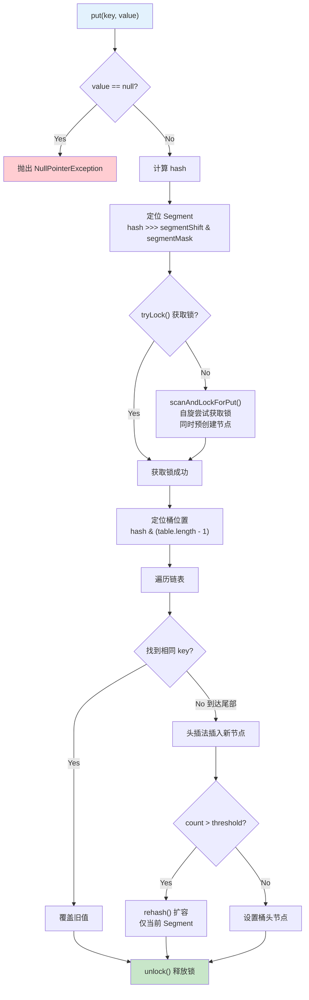

**scanAndLockForPut() 的妙处：**

```java
private HashEntry<K,V> scanAndLockForPut(K key, int hash, V value) {
    HashEntry<K,V> first = entryForHash(this, hash);
    HashEntry<K,V> e = first;
    HashEntry<K,V> node = null;
    int retries = -1;

    while (!tryLock()) {
        HashEntry<K,V> f;
        if (retries < 0) {
            if (e == null) {
                if (node == null)
                    node = new HashEntry<K,V>(hash, key, value, null);
                    // ★ 获取不到锁时，提前创建 HashEntry 节点
                    // 等拿到锁后直接用，减少锁持有时间
                retries = 0;
            }
            else if (key.equals(e.key))
                retries = 0;
            else
                e = e.next;
        }
        else if (++retries > MAX_SCAN_RETRIES) {
            lock();  // 自旋超过阈值，阻塞等待
            break;
        }
        else if ((retries & 1) == 0 &&
                 (f = entryForHash(this, hash)) != first) {
            e = first = f;  // 链表头变了，重新遍历
            retries = -1;
        }
    }
    return node;
}
```

### 2.7 get 操作流程

```java
public V get(Object key) {
    Segment<K,V> s;
    HashEntry<K,V>[] tab;
    int h = hash(key);

    // 定位 Segment
    long u = (((h >>> segmentShift) & segmentMask) << SSHIFT) + SBASE;
    if ((s = (Segment<K,V>)UNSAFE.getObjectVolatile(segments, u)) != null &&
        (tab = s.table) != null) {

        // 定位桶，遍历链表
        for (HashEntry<K,V> e = (HashEntry<K,V>) UNSAFE.getObjectVolatile
                 (tab, ((long)(((tab.length - 1) & h)) << TSHIFT) + TBASE);
             e != null; e = e.next) {
            K k;
            if ((k = e.key) == key || (e.hash == h && key.equals(k)))
                return e.value;
        }
    }
    return null;
}
```

**关键点：get 操作不需要加锁！**

| 原因 | 解释 |
|------|------|
| **value 是 volatile 的** | `volatile V value` 保证写入后其他线程立即可见 |
| **next 是 volatile 的** | `volatile HashEntry<K,V> next` 保证链表结构变更可见 |
| **UNSAFE.getObjectVolatile** | 读取 table 时使用 volatile 语义 |

### 2.8 size 操作流程

size() 是 ConcurrentHashMap 中最有趣的方法之一：

```java
public int size() {
    final Segment<K,V>[] segments = this.segments;
    int size;
    boolean overflow;
    long sum;
    long last = 0L;
    int retries = -1;

    try {
        for (;;) {
            // ★ 前两次尝试：不加锁，计算两次 modCount 之和
            if (retries++ == RETRIES_BEFORE_LOCK) {
                // 超过重试次数（2次），对所有 Segment 加锁
                for (int j = 0; j < segments.length; ++j)
                    ensureSegment(j).lock();
            }

            sum = 0L;
            size = 0;
            overflow = false;
            for (int j = 0; j < segments.length; ++j) {
                Segment<K,V> seg = segmentAt(segments, j);
                if (seg != null) {
                    sum += seg.modCount;   // 累加 modCount
                    int c = seg.count;
                    if (c < 0 || (size += c) < 0)
                        overflow = true;
                }
            }

            // 如果两次计算的 modCount 一致，说明期间没有修改
            if (sum == last)
                break;
            last = sum;
        }
    } finally {
        // 如果加了锁，要释放
        if (retries > RETRIES_BEFORE_LOCK) {
            for (int j = 0; j < segments.length; ++j)
                segmentAt(segments, j).unlock();
        }
    }

    return overflow ? Integer.MAX_VALUE : size;
}
```

**size() 的策略：先乐观后悲观**

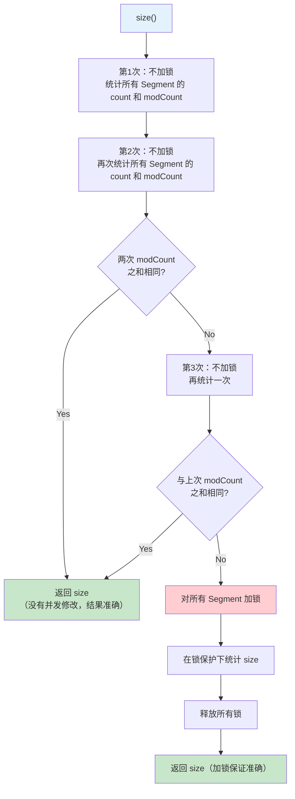

**设计思想**：
- **乐观策略**：大部分情况下并发修改不频繁，不加锁就能得到准确结果
- **悲观回退**：如果连续几次统计期间都有修改，就加锁保证准确性
- **平衡性能与正确性**：避免每次 size() 都加全部锁

### 2.9 并发度 concurrencyLevel

```java
// 构造函数
public ConcurrentHashMap(int initialCapacity,
                          float loadFactor, int concurrencyLevel) {
    // ...
    // ssize 是 >= concurrencyLevel 的最小 2 的幂
    int sshift = 0;
    int ssize = 1;
    while (ssize < concurrencyLevel) {
        ++sshift;
        ssize <<= 1;
    }
    // Segment 数组长度 = ssize
    this.segmentShift = 32 - sshift;
    this.segmentMask = ssize - 1;
    this.segments = Segment.newArray(ssize);
}
```

| 参数 | 默认值 | 含义 |
|------|--------|------|
| initialCapacity | 16 | 初始总容量 |
| loadFactor | 0.75f | 负载因子 |
| concurrencyLevel | 16 | 并发度（Segment 数量） |

**Segment 数量的确定：**
- `concurrencyLevel = 16` → Segment 数量 = 16
- `concurrencyLevel = 10` → Segment 数量 = 16（向上取 2 的幂）
- `concurrencyLevel = 32` → Segment 数量 = 32

**注意**：Segment 数组创建后**长度不可变**，只有 Segment 内部的 HashEntry 数组可以扩容。

---

## 3. JDK 8 实现：CAS + synchronized（重点）

### 3.1 核心变化：放弃 Segment，拥抱 CAS + synchronized

JDK 8 对 ConcurrentHashMap 进行了**彻底重写**：

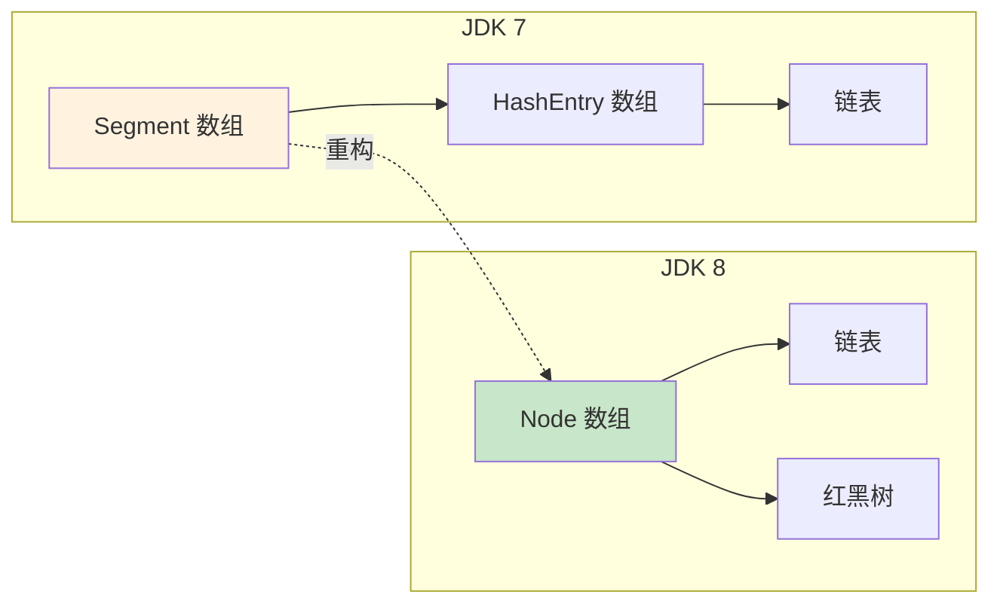

### 3.2 数据结构：Node 数组 + 链表 + 红黑树

```java
// JDK 8 ConcurrentHashMap 的 Node 节点
static class Node<K,V> implements Map.Entry<K,V> {
    final int hash;
    final K key;
    volatile V val;             // ★ volatile 保证可见性
    volatile Node<K,V> next;    // ★ volatile 保证可见性

    Node(int hash, K key, V val, Node<K,V> next) {
        this.hash = hash;
        this.key = key;
        this.val = val;
        this.next = next;
    }
}
```

**注意与 HashMap 的区别：**
- HashMap.Node 的 `value` 和 `next` **不是 volatile 的**
- ConcurrentHashMap.Node 的 `val` 和 `next` **是 volatile 的**
- 这就是 ConcurrentHashMap 的 get() 不需要加锁的基础

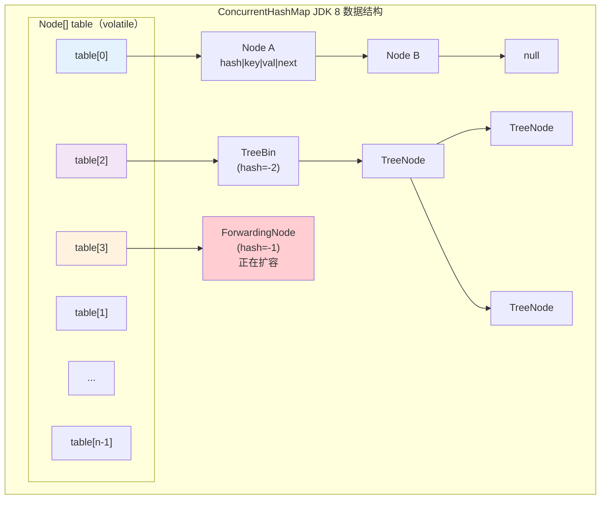

### 3.3 与 JDK 7 的核心差异对比表

| 维度 | JDK 7 | JDK 8 |
|------|-------|-------|
| **数据结构** | Segment[] + HashEntry[] + 链表 | Node[] + 链表 + 红黑树 |
| **锁粒度** | Segment 级别（一个 Segment 锁住多个桶） | **桶级别**（synchronized 锁住桶头节点） |
| **锁实现** | ReentrantLock（Segment 继承） | **CAS + synchronized** |
| **默认并发度** | 16（Segment 数量） | **Node 数组长度**（理论上无限） |
| **链表过长** | 不处理 | 转红黑树（长度 ≥ 8 且 table.length ≥ 64） |
| **hash 算法** | Wang/Jenkins 算法（多次扰动） | spread()（高16位异或低16位） |
| **计数方式** | 每个 Segment 维护 count | **baseCount + counterCells**（LongAdder 思想） |
| **扩容** | 每个 Segment 独立扩容 | **整个 table 扩容，多线程协助** |
| **节点定位** | 两次 hash（先 Segment 再桶） | 一次 hash（直接定位桶） |
| **空桶写入** | 加锁（lock） | **CAS（无锁）** |

### 3.4 核心字段详解

```java
public class ConcurrentHashMap<K,V> extends AbstractMap<K,V>
        implements ConcurrentMap<K,V>, Serializable {

    /**
     * ★ 存储桶的数组（核心数据结构）
     * 
     * transient volatile：
     * - transient：不参与序列化
     * - volatile：保证数组引用的可见性（但数组元素不是 volatile 的！）
     * 
     * 懒初始化：构造时不创建，第一次 put 时才分配
     * 长度总是 2 的幂
     */
    transient volatile Node<K,V>[] table;

    /**
     * ★ 扩容时的新数组
     * 只有在扩容（resize/transfer）过程中才非 null
     * 扩容完成后设为 null
     */
    private transient volatile Node<K,V>[] nextTable;

    /**
     * ★ 基础计数器
     * 没有竞争时直接 CAS 更新这个值
     * 有竞争时转用 counterCells
     * 最终 size ≈ baseCount + Σ counterCells[i].value
     */
    private transient volatile long baseCount;

    /**
     * ★★★ sizeCtl - ConcurrentHashMap 最重要的控制字段
     * 
     * 多重含义（根据值的不同范围）：
     * - 0            : 默认值，table 未初始化
     * - > 0（正数）  : ① table 未初始化时 = 初始容量
     *                   ② table 已初始化后 = 下次扩容的阈值（capacity * loadFactor）
     * - -1           : table 正在初始化中（有线程在执行 initTable）
     * - < -1（负数） : table 正在扩容
     *                   高16位 = 扩容标识戳（resizeStamp）
     *                   低16位 = 1 + 正在扩容的线程数
     */
    private transient volatile int sizeCtl;

    /**
     * ★ 扩容时的分配索引
     * 多线程扩容时，用于分配迁移任务（从后往前分配）
     */
    private transient volatile int transferIndex;

    /**
     * ★ 操作 counterCells 数组时的自旋锁标志
     * 0 = 空闲，1 = 正在操作
     */
    private transient volatile int cellsBusy;

    /**
     * ★ 分段计数器数组（LongAdder 思想）
     * 当 CAS 更新 baseCount 竞争激烈时，
     * 改为更新 counterCells 中的某个 Cell
     */
    private transient volatile CounterCell[] counterCells;
}
```

### 3.5 sizeCtl 的多重含义（★★★ 重点）

sizeCtl 是 ConcurrentHashMap 中**最复杂**的字段，需要根据上下文理解它的含义：

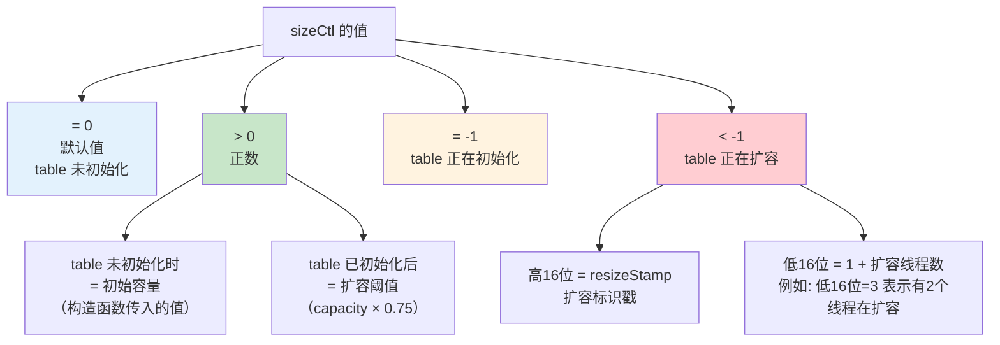

**sizeCtl 状态转换：**

```
初始状态    sizeCtl = 0（或构造时指定的容量）
   ↓
initTable() sizeCtl = -1（标记正在初始化）
   ↓
初始化完成   sizeCtl = threshold（如 capacity=16 时 sizeCtl=12）
   ↓
触发扩容     sizeCtl = (resizeStamp << 16) + 2（表示1个线程在扩容）
   ↓
其他线程加入  sizeCtl++（低16位递增，表示扩容线程数+1）
   ↓
线程完成退出  sizeCtl--（低16位递减）
   ↓
扩容完毕     sizeCtl = 新的 threshold
```

### 3.6 特殊节点类型

JDK 8 的 ConcurrentHashMap 有几种特殊节点类型，通过 hash 值区分：

```java
// 普通节点: hash >= 0
static class Node<K,V> { ... }

// 转发节点: hash = -1 (MOVED)
// 表示该桶已经迁移完毕，指向 nextTable
static final class ForwardingNode<K,V> extends Node<K,V> {
    final Node<K,V>[] nextTable;
    ForwardingNode(Node<K,V>[] tab) {
        super(MOVED, null, null, null);  // hash = -1
        this.nextTable = tab;
    }
}

// 红黑树容器节点: hash = -2 (TREEBIN)
// 桶头放 TreeBin，TreeBin 内部维护红黑树
static final class TreeBin<K,V> extends Node<K,V> {
    TreeNode<K,V> root;  // 红黑树根节点
    volatile TreeNode<K,V> first;  // 链表形式的第一个节点
    volatile Thread waiter;  // 等待线程
    volatile int lockState;  // 读写锁状态
    TreeBin(TreeNode<K,V> b) {
        super(TREEBIN, null, null, null);  // hash = -2
        // ...
    }
}

// 红黑树的实际节点
static final class TreeNode<K,V> extends Node<K,V> {
    TreeNode<K,V> parent;
    TreeNode<K,V> left;
    TreeNode<K,V> right;
    TreeNode<K,V> prev;
    boolean red;
}
```

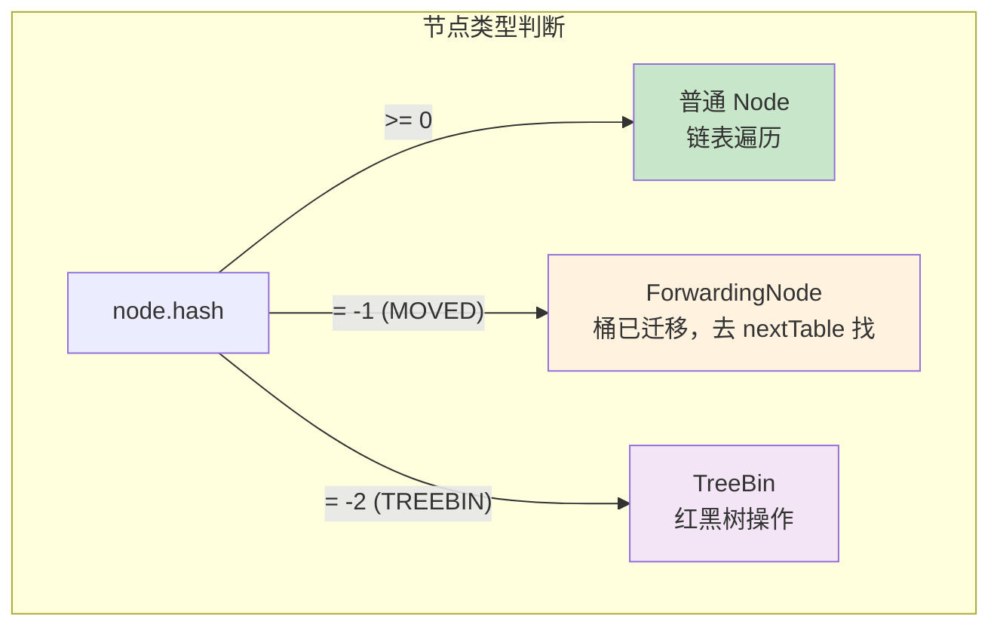

### 3.7 initTable() 源码分析

```java
/**
 * 初始化 table 数组
 * 使用 sizeCtl 作为并发控制标志
 */
private final Node<K,V>[] initTable() {
    Node<K,V>[] tab; int sc;

    // ★ 自旋：table 为空时持续尝试
    while ((tab = table) == null || tab.length == 0) {

        // ★ sizeCtl < 0 说明其他线程正在初始化，让出 CPU
        if ((sc = sizeCtl) < 0)
            Thread.yield();  // 让出时间片，等待其他线程初始化完成

        // ★ CAS 将 sizeCtl 设为 -1，标记"我来初始化"
        else if (U.compareAndSwapInt(this, SIZECTL, sc, -1)) {
            try {
                // 双重检查：拿到权利后再确认 table 确实还没初始化
                if ((tab = table) == null || tab.length == 0) {
                    // sc > 0 时是构造函数传入的初始容量
                    // sc == 0 时使用默认容量 16
                    int n = (sc > 0) ? sc : DEFAULT_CAPACITY;

                    @SuppressWarnings("unchecked")
                    Node<K,V>[] nt = (Node<K,V>[])new Node<?,?>[n];
                    table = tab = nt;

                    // ★ sc = n - n/4 = n * 0.75（扩容阈值）
                    // 用位运算代替浮点数乘法
                    sc = n - (n >>> 2);
                }
            } finally {
                // ★ 设置 sizeCtl 为扩容阈值（正数）
                sizeCtl = sc;
            }
            break;
        }
    }
    return tab;
}
```

**initTable 流程图：**

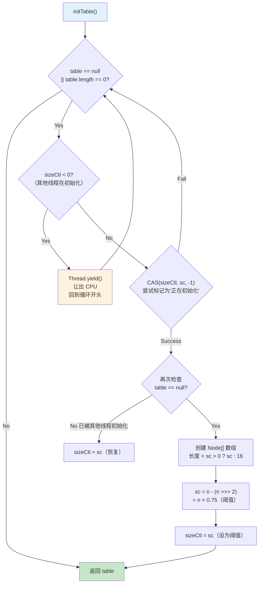

**关键设计：**
- **CAS 保证只有一个线程能初始化**：多个线程同时调用 initTable，只有 CAS 成功的那个线程能初始化
- **Thread.yield() 让出 CPU**：CAS 失败的线程不阻塞，只是让出时间片
- **双重检查**：CAS 成功后还要再检查 table 是否已被初始化（极端并发场景）
- **位运算计算阈值**：`n - (n >>> 2)` 等价于 `n * 0.75`，避免浮点运算

### 3.8 spread() hash 扰动函数

```java
/**
 * spread() 方法：hash 扰动
 * 
 * 与 HashMap 的 hash() 类似，但多了一步：& HASH_BITS
 */
static final int spread(int h) {
    return (h ^ (h >>> 16)) & HASH_BITS;
    // HASH_BITS = 0x7fffffff (0111 1111 ... 1111)
    // & HASH_BITS 的作用：确保结果为正数（最高位变为0）
    // 因为负数 hash 在 ConcurrentHashMap 中有特殊含义：
    //   -1 (MOVED) = ForwardingNode
    //   -2 (TREEBIN) = TreeBin
}

static final int HASH_BITS = 0x7fffffff; // usable bits of normal node hash
static final int MOVED     = -1;          // ForwardingNode 的 hash
static final int TREEBIN   = -2;          // TreeBin 的 hash
static final int RESERVED  = -3;          // ReservationNode 的 hash
```

**与 HashMap hash() 的对比：**

| 特性 | HashMap.hash() | ConcurrentHashMap.spread() |
|------|---------------|---------------------------|
| 扰动 | `h ^ (h >>> 16)` | `(h ^ (h >>> 16)) & HASH_BITS` |
| 结果 | 可能为负数 | **一定为正数**（& 0x7fffffff） |
| 原因 | 无特殊含义 | 负数 hash 有特殊用途（MOVED/TREEBIN） |

### 3.9 put() / putVal() 完整源码逐行分析（★★★ 核心）

这是 ConcurrentHashMap 最核心的方法，需要逐行理解：

```java
public V put(K key, V value) {
    return putVal(key, value, false);
}

/** 完整的 putVal 源码 + 逐行注释 */
final V putVal(K key, V value, boolean onlyIfAbsent) {
    // ★ ConcurrentHashMap 不允许 null key 和 null value
    if (key == null || value == null) throw new NullPointerException();

    // ★ 第1步：计算 hash（spread 扰动，保证非负）
    int hash = spread(key.hashCode());

    int binCount = 0;  // 记录桶内节点数（用于判断是否需要树化）

    // ★ 无限循环 + CAS 自旋
    for (Node<K,V>[] tab = table;;) {
        Node<K,V> f;  // f = 桶头节点
        int n, i, fh; // n=table长度, i=桶索引, fh=桶头节点的hash

        // ═══════════════════════════════════════════════
        // ★ 分支1：table 为空 → 初始化
        // ═══════════════════════════════════════════════
        if (tab == null || (n = tab.length) == 0)
            tab = initTable();
            // initTable() 用 CAS 保证只有一个线程初始化

        // ═══════════════════════════════════════════════
        // ★ 分支2：桶为空 → CAS 直接放入（无锁！）
        // ═══════════════════════════════════════════════
        else if ((f = tabAt(tab, i = (n - 1) & hash)) == null) {
            // tabAt 使用 Unsafe.getObjectVolatile 读取
            // 桶为空，CAS 放入新 Node（如果期间被其他线程修改，CAS 失败，下次循环重试）
            if (casTabAt(tab, i, null,
                         new Node<K,V>(hash, key, value, null)))
                break;  // CAS 成功，结束循环
            // CAS 失败，继续循环（for 循环回到开头）

        // ═══════════════════════════════════════════════
        // ★ 分支3：桶头节点的 hash == MOVED(-1) → 正在扩容
        // ═══════════════════════════════════════════════
        } else if ((fh = f.hash) == MOVED)
            tab = helpTransfer(tab, f);
            // 当前线程帮助扩容，扩容完成后继续循环

        // ═══════════════════════════════════════════════
        // ★ 分支4：桶不为空，hash 正常 → 锁住桶头节点，链表/红黑树操作
        // ═══════════════════════════════════════════════
        else {
            V oldVal = null;

            // ★★ synchronized 锁住桶头节点 f
            // 只锁一个桶！其他桶不受影响
            synchronized (f) {

                // ★ 双重检查：确认桶头节点没被其他线程改变
                if (tabAt(tab, i) == f) {

                    // ═════════════════════════════
                    // ★ 情况A：普通链表（fh >= 0）
                    // ═════════════════════════════
                    if (fh >= 0) {
                        binCount = 1;  // 节点计数从1开始

                        for (Node<K,V> e = f;; ++binCount) {
                            K ek;

                            // 找到相同 key → 覆盖
                            if (e.hash == hash &&
                                ((ek = e.key) == key ||
                                 (ek != null && key.equals(ek)))) {
                                oldVal = e.val;
                                if (!onlyIfAbsent)
                                    e.val = value;  // 覆盖旧值
                                break;
                            }

                            Node<K,V> pred = e;

                            // 到达链表尾部 → 尾插新节点
                            if ((e = e.next) == null) {
                                pred.next = new Node<K,V>(hash, key,
                                                          value, null);
                                break;
                            }
                        }
                    }

                    // ═════════════════════════════
                    // ★ 情况B：红黑树（TreeBin）
                    // ═════════════════════════════
                    else if (f instanceof TreeBin) {
                        Node<K,V> p;
                        binCount = 2;  // 红黑树固定设为2

                        if ((p = ((TreeBin<K,V>)f).putTreeVal(hash, key,
                                                       value)) != null) {
                            oldVal = p.val;
                            if (!onlyIfAbsent)
                                p.val = value;
                        }
                    }
                }
            }
            // synchronized 结束，释放桶头锁

            // ═══════════════════════════════════════════════
            // ★ 分支5：检查是否需要树化
            // ═══════════════════════════════════════════════
            if (binCount != 0) {
                if (binCount >= TREEIFY_THRESHOLD)  // >= 8
                    treeifyBin(tab, i);
                    // 内部还会检查 table.length >= 64，
                    // 不满足则扩容而非树化

                if (oldVal != null)
                    return oldVal;  // 覆盖旧值，不需要 addCount
                break;
            }
        }
    }

    // ═══════════════════════════════════════════════
    // ★ 第2步：计数 +1，检查是否需要扩容
    // ═══════════════════════════════════════════════
    addCount(1L, binCount);
    // addCount 使用 LongAdder 思想：
    // 1. 先 CAS 更新 baseCount
    // 2. CAS 失败则更新 counterCells
    // 3. 同时检查是否需要扩容

    return null;  // 新插入返回 null
}
```

### 3.10 putVal() 完整流程图

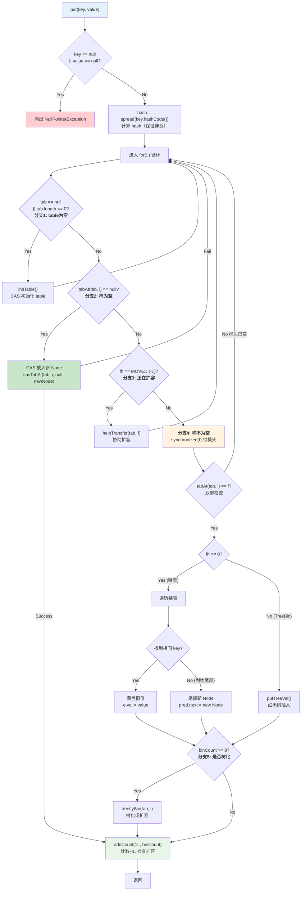

### 3.11 putVal 各分支详细分析

#### 分支1：table 为空 → initTable()

```java
if (tab == null || (n = tab.length) == 0)
    tab = initTable();
```

- ConcurrentHashMap 也是**懒初始化**，构造时不创建 table
- 第一次 put 时调用 initTable()
- initTable() 使用 CAS 控制只有一个线程初始化

#### 分支2：桶为空 → CAS 无锁写入

```java
else if ((f = tabAt(tab, i = (n - 1) & hash)) == null) {
    if (casTabAt(tab, i, null, new Node<K,V>(hash, key, value, null)))
        break;
}
```

这是**最精彩**的设计之一：
- 使用 `Unsafe.getObjectVolatile()` 读取桶头节点（volatile 语义）
- 桶为空时，用 **CAS** 直接放入新 Node
- **不需要加锁！** 如果 CAS 失败（其他线程抢先放入了），继续循环重试
- 空桶是最常见的情况（负载因子 0.75 下约 60% 的桶是空的），这个优化影响巨大

```java
// tabAt：volatile 读
static final <K,V> Node<K,V> tabAt(Node<K,V>[] tab, int i) {
    return (Node<K,V>)U.getObjectVolatile(tab, ((long)i << ASHIFT) + ABASE);
}

// casTabAt：CAS 写
static final <K,V> boolean casTabAt(Node<K,V>[] tab, int i,
                                    Node<K,V> c, Node<K,V> v) {
    return U.compareAndSwapObject(tab, ((long)i << ASHIFT) + ABASE, c, v);
}
```

#### 分支3：正在扩容 → helpTransfer() 协助扩容

```java
else if ((fh = f.hash) == MOVED)
    tab = helpTransfer(tab, f);
```

- 如果桶头节点是 ForwardingNode（hash = -1），说明**该桶已经迁移完毕，整个 table 正在扩容**
- 当前线程不是干等，而是**加入扩容**（helpTransfer），帮助迁移其他桶
- 扩容完成后，tab 指向新的 table，回到循环开头重新定位桶

#### 分支4：桶不为空 → synchronized 锁桶头

```java
synchronized (f) {
    if (tabAt(tab, i) == f) {  // 双重检查
        // 链表或红黑树操作
    }
}
```

**关键设计点：**

| 设计 | 原因 |
|------|------|
| **synchronized(f) 而非 synchronized(this)** | 只锁一个桶头节点，不影响其他桶 |
| **双重检查 tabAt(tab, i) == f** | 防止获取锁期间桶头被其他线程替换（扩容时会替换） |
| **锁的是 Node 对象** | 不同桶的 Node 对象不同，锁之间互不干扰 |

**为什么 JDK 8 用 synchronized 而不是 ReentrantLock？**

| 原因 | 说明 |
|------|------|
| **JVM 优化** | JDK 6+ 对 synchronized 做了大量优化（偏向锁、轻量级锁、锁消除、锁粗化） |
| **内存开销** | synchronized 不需要额外对象，ReentrantLock 需要 AQS 节点 |
| **自适应** | synchronized 的轻量级锁在竞争不激烈时性能极好（CAS 实现） |
| **简化代码** | synchronized 自动释放，不会忘记 unlock() |

#### 分支5：树化检查

```java
if (binCount >= TREEIFY_THRESHOLD)  // >= 8
    treeifyBin(tab, i);
```

与 HashMap 相同：
- `treeifyBin` 内部先检查 `table.length >= 64`
- 不满足则扩容而非树化
- 满足则将链表转为红黑树（TreeBin + TreeNode）

### 3.12 get() 源码分析（无锁读）

```java
public V get(Object key) {
    Node<K,V>[] tab; Node<K,V> e, p; int n, eh; K ek;

    // ★ 计算 hash
    int h = spread(key.hashCode());

    if ((tab = table) != null && (n = tab.length) > 0 &&
        (e = tabAt(tab, (n - 1) & h)) != null) {
        // tabAt 使用 volatile 读

        // ★ 检查第一个节点
        if ((eh = e.hash) == h) {
            if ((ek = e.key) == key || (ek != null && key.equals(ek)))
                return e.val;  // 第一个节点就是目标
        }

        // ★ hash < 0：特殊节点
        else if (eh < 0)
            // ForwardingNode: 去 nextTable 找
            // TreeBin: 在红黑树中查找
            return (p = e.find(h, key)) != null ? p.val : null;

        // ★ 链表遍历
        while ((e = e.next) != null) {
            if (e.hash == h &&
                ((ek = e.key) == key || (ek != null && key.equals(ek))))
                return e.val;
        }
    }
    return null;
}
```

**get() 全程无锁！为什么安全？**

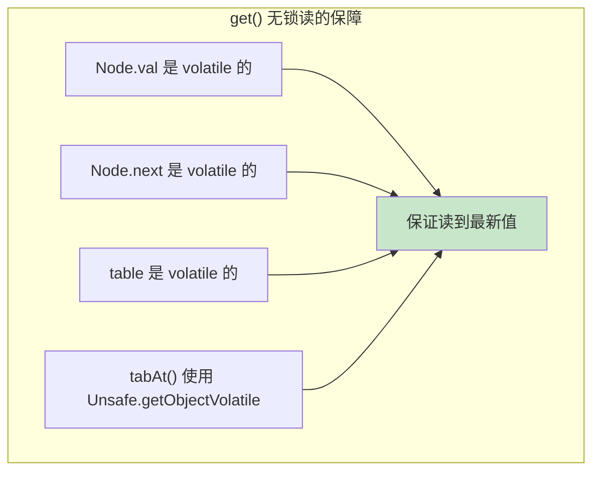

| 保障 | 说明 |
|------|------|
| `volatile V val` | 写入 val 后，其他线程的 get 立即可见 |
| `volatile Node<K,V> next` | 链表结构变更后，其他线程的遍历立即可见 |
| `tabAt()` 使用 volatile 读 | 桶头节点的变更对读线程可见 |
| **Node 只被追加（尾插）** | 不会出现链表断裂的中间态 |

**get() 流程图：**

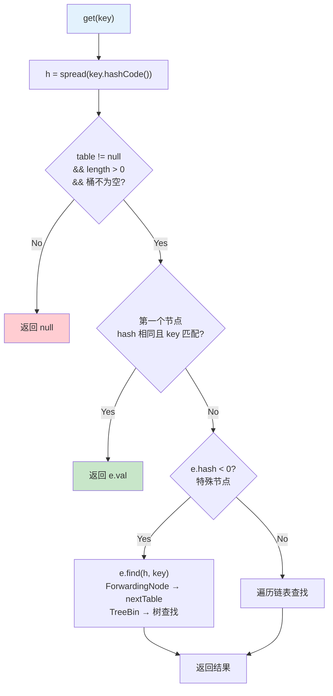

**ForwardingNode 的 find() 方法：**

```java
// ForwardingNode.find() - 在新表中查找
Node<K,V> find(int h, Object k) {
    outer: for (Node<K,V>[] tab = nextTable;;) {
        Node<K,V> e; int n;
        if (k == null || tab == null || (n = tab.length) == 0 ||
            (e = tabAt(tab, (n - 1) & h)) == null)
            return null;
        for (;;) {
            int eh; K ek;
            if ((eh = e.hash) == h &&
                ((ek = e.key) == k || (ek != null && k.equals(ek))))
                return e;
            if (eh < 0) {
                if (e instanceof ForwardingNode) {
                    tab = ((ForwardingNode<K,V>)e).nextTable;
                    continue outer;  // 可能又转发到更新的 table
                }
                else
                    return e.find(h, k);
            }
            if ((e = e.next) == null)
                return null;
        }
    }
}
```

### 3.13 resize() / transfer() 扩容机制：多线程协助扩容（★★★ 重点）

ConcurrentHashMap JDK 8 的扩容设计是其**最复杂也最精彩**的部分。

#### 3.13.1 扩容触发时机

扩容在以下两个地方触发：

```java
// 1. putVal 之后的 addCount 中：
private final void addCount(long x, int check) {
    // ... 更新 baseCount / counterCells ...

    if (check >= 0) {
        Node<K,V>[] tab, nt; int n, sc;
        // ★ 当元素数量 >= sizeCtl（扩容阈值）时触发扩容
        while (s >= (long)(sc = sizeCtl) && (tab = table) != null &&
               (n = tab.length) < MAXIMUM_CAPACITY) {
            int rs = resizeStamp(n);
            if (sc < 0) {
                // 已经在扩容，尝试加入帮助
                // ...
                tab = helpTransfer(tab, f);
            } else if (U.compareAndSwapInt(this, SIZECTL, sc,
                                           (rs << RESIZE_STAMP_SHIFT) + 2)) {
                // CAS 成功，自己开始扩容
                transfer(tab, null);
                break;
            }
        }
    }
}

// 2. treeifyBin 中发现 table.length < 64 时：
private final void treeifyBin(Node<K,V>[] tab, int index) {
    if (tab != null) {
        if ((n = tab.length) < MIN_TREEIFY_CAPACITY)
            tryPresize(n << 1);  // 扩容而非树化
    }
}
```

#### 3.13.2 helpTransfer() 协助扩容

```java
final Node<K,V>[] helpTransfer(Node<K,V>[] tab, Node<K,V> f) {
    Node<K,V>[] nextTab; int sc;

    if (tab != null && (f instanceof ForwardingNode) &&
        (nextTab = ((ForwardingNode<K,V>)f).nextTable) != null) {

        int rs = resizeStamp(tab.length);

        while (nextTab == nextTable && table == tab &&
               (sc = sizeCtl) < 0) {

            // 检查扩容是否已完成
            if ((sc >>> RESIZE_STAMP_SHIFT) != rs ||
                sc == rs + 1 ||
                sc == rs + MAX_RESIZERS ||
                transferIndex <= 0)
                break;

            // CAS sizeCtl + 1，表示"我加入扩容"
            if (U.compareAndSwapInt(this, SIZECTL, sc, sc + 1)) {
                transfer(tab, nextTab);  // ★ 执行扩容迁移
                break;
            }
        }
        return nextTab;
    }
    return table;
}
```

#### 3.13.3 transfer() 完整源码分析

```java
/**
 * 扩容核心方法：数据迁移
 * 
 * tab: 旧 table
 * nextTab: 新 table（第一个线程传 null，后续线程传已创建的 nextTable）
 */
private final void transfer(Node<K,V>[] tab, Node<K,V>[] nextTab) {
    int n = tab.length, stride;

    // ═══════════════════════════════════════════════
    // ★ 第1步：计算每个线程负责迁移的桶数（stride）
    // ═══════════════════════════════════════════════
    // stride = (NCPU > 1) ? (n >>> 3) / NCPU : n
    // 最小 stride = MIN_TRANSFER_STRIDE = 16
    if ((stride = (NCPU > 1) ? (n >>> 3) / NCPU : n) < MIN_TRANSFER_STRIDE)
        stride = MIN_TRANSFER_STRIDE;
    // 例如：n=1024, NCPU=8 → stride = max(1024/8/8, 16) = 16

    // ═══════════════════════════════════════════════
    // ★ 第2步：创建新 table（只有第一个线程执行）
    // ═══════════════════════════════════════════════
    if (nextTab == null) {
        try {
            @SuppressWarnings("unchecked")
            Node<K,V>[] nt = (Node<K,V>[])new Node<?,?>[n << 1]; // 容量翻倍
            nextTab = nt;
        } catch (Throwable ex) {
            sizeCtl = Integer.MAX_VALUE;  // OOM 时不再扩容
            return;
        }
        nextTable = nextTab;
        transferIndex = n;  // ★ 从后往前分配任务
    }

    int nextn = nextTab.length;
    // ★ 创建 ForwardingNode，指向新 table
    ForwardingNode<K,V> fwd = new ForwardingNode<K,V>(nextTab);
    boolean advance = true;   // 是否继续获取下一个桶
    boolean finishing = false; // 是否完成

    // ═══════════════════════════════════════════════
    // ★ 第3步：循环迁移桶
    // ═══════════════════════════════════════════════
    for (int i = 0, bound = 0;;) {
        Node<K,V> f; int fh;

        // ★ 3.1：领取任务（分配桶的范围）
        while (advance) {
            int nextIndex, nextBound;
            if (--i >= bound || finishing)
                advance = false;
            else if ((nextIndex = transferIndex) <= 0) {
                // ★ 没有更多桶需要迁移了
                i = -1;
                advance = false;
            }
            else if (U.compareAndSwapInt
                     (this, TRANSFERINDEX, nextIndex,
                      nextBound = (nextIndex > stride ?
                                   nextIndex - stride : 0))) {
                // ★ CAS 领取一段桶 [nextBound, nextIndex)
                bound = nextBound;
                i = nextIndex - 1;
                advance = false;
            }
        }

        // ★ 3.2：检查是否完成
        if (i < 0 || i >= n || i + n >= nextn) {
            int sc;
            if (finishing) {
                // ★ 扩容完成！
                nextTable = null;
                table = nextTab;  // 切换到新 table
                sizeCtl = (n << 1) - (n >>> 1);  // 新阈值 = 2n * 0.75 = 1.5n
                return;
            }
            // CAS sizeCtl - 1，表示"我完成了我的部分"
            if (U.compareAndSwapInt(this, SIZECTL, sc = sizeCtl, sc - 1)) {
                // 检查是否是最后一个线程
                if ((sc - 2) != resizeStamp(n) << RESIZE_STAMP_SHIFT)
                    return;  // 不是最后一个，直接返回
                // ★ 是最后一个线程！标记完成
                finishing = advance = true;
                i = n; // 重新检查一遍所有桶
            }
        }

        // ★ 3.3：桶为空 → 直接放 ForwardingNode
        else if ((f = tabAt(tab, i)) == null)
            advance = casTabAt(tab, i, null, fwd);

        // ★ 3.4：桶已经是 ForwardingNode → 已迁移，跳过
        else if ((fh = f.hash) == MOVED)
            advance = true;

        // ★ 3.5：正常桶 → 锁住桶头，迁移数据
        else {
            synchronized (f) {
                if (tabAt(tab, i) == f) {  // 双重检查

                    Node<K,V> ln, hn;  // ln=低位链表, hn=高位链表

                    // ═════════════ 链表迁移 ═════════════
                    if (fh >= 0) {
                        // ★ 与 HashMap JDK 8 相同的高低位拆分
                        int runBit = fh & n;  // 最高位判断
                        Node<K,V> lastRun = f;

                        // 找到最后一段连续相同 runBit 的节点
                        for (Node<K,V> p = f.next; p != null; p = p.next) {
                            int b = p.hash & n;
                            if (b != runBit) {
                                runBit = b;
                                lastRun = p;
                            }
                        }

                        if (runBit == 0) {
                            ln = lastRun; hn = null;
                        } else {
                            hn = lastRun; ln = null;
                        }

                        // 构建高低位链表
                        for (Node<K,V> p = f; p != lastRun; p = p.next) {
                            int ph = p.hash; K pk = p.key; V pv = p.val;
                            if ((ph & n) == 0)
                                ln = new Node<K,V>(ph, pk, pv, ln);
                            else
                                hn = new Node<K,V>(ph, pk, pv, hn);
                        }

                        // 放到新 table
                        setTabAt(nextTab, i, ln);       // 低位链表 → 原位置
                        setTabAt(nextTab, i + n, hn);   // 高位链表 → 原位置 + n
                        setTabAt(tab, i, fwd);          // 旧桶标记为 ForwardingNode
                        advance = true;
                    }

                    // ═════════════ 红黑树迁移 ═════════════
                    else if (f instanceof TreeBin) {
                        TreeBin<K,V> t = (TreeBin<K,V>)f;
                        TreeNode<K,V> lo = null, loTail = null;
                        TreeNode<K,V> hi = null, hiTail = null;
                        int lc = 0, hc = 0;

                        // 遍历 TreeNode 链表，拆分为高低位
                        for (Node<K,V> e = t.first; e != null; e = e.next) {
                            int h = e.hash;
                            TreeNode<K,V> p = new TreeNode<K,V>
                                (h, e.key, e.val, null, null);
                            if ((h & n) == 0) {
                                if ((p.prev = loTail) == null)
                                    lo = p;
                                else
                                    loTail.next = p;
                                loTail = p;
                                ++lc;
                            } else {
                                if ((p.prev = hiTail) == null)
                                    hi = p;
                                else
                                    hiTail.next = p;
                                hiTail = p;
                                ++hc;
                            }
                        }

                        // 如果节点数 <= 6，退化为链表
                        ln = (lc <= UNTREEIFY_THRESHOLD) ? untreeify(lo) :
                            (hc != 0) ? new TreeBin<K,V>(lo) : t;
                        hn = (hc <= UNTREEIFY_THRESHOLD) ? untreeify(hi) :
                            (lc != 0) ? new TreeBin<K,V>(hi) : t;

                        setTabAt(nextTab, i, ln);
                        setTabAt(nextTab, i + n, hn);
                        setTabAt(tab, i, fwd);
                        advance = true;
                    }
                }
            }
        }
    }
}
```

#### 3.13.4 多线程协助扩容的详细图解

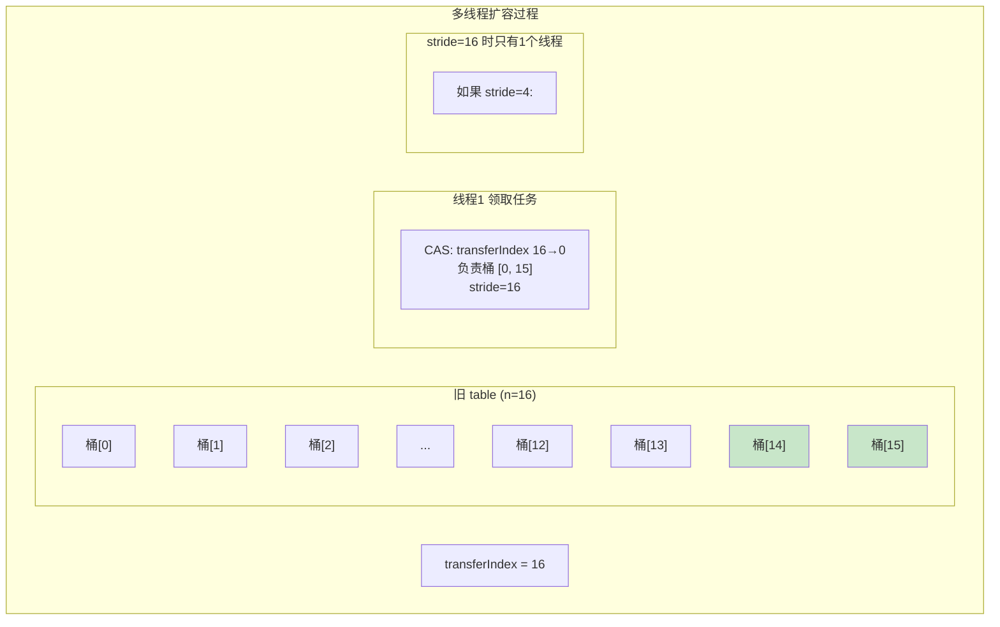

**假设 n=64, stride=16, 4个线程参与扩容：**

```
初始: transferIndex = 64

线程1: CAS(transferIndex, 64, 48) 成功 → 负责桶 [48, 63]
线程2: CAS(transferIndex, 48, 32) 成功 → 负责桶 [32, 47]
线程3: CAS(transferIndex, 32, 16) 成功 → 负责桶 [16, 31]
线程4: CAS(transferIndex, 16, 0)  成功 → 负责桶 [0, 15]

每个线程独立迁移自己负责的桶，互不干扰！
```

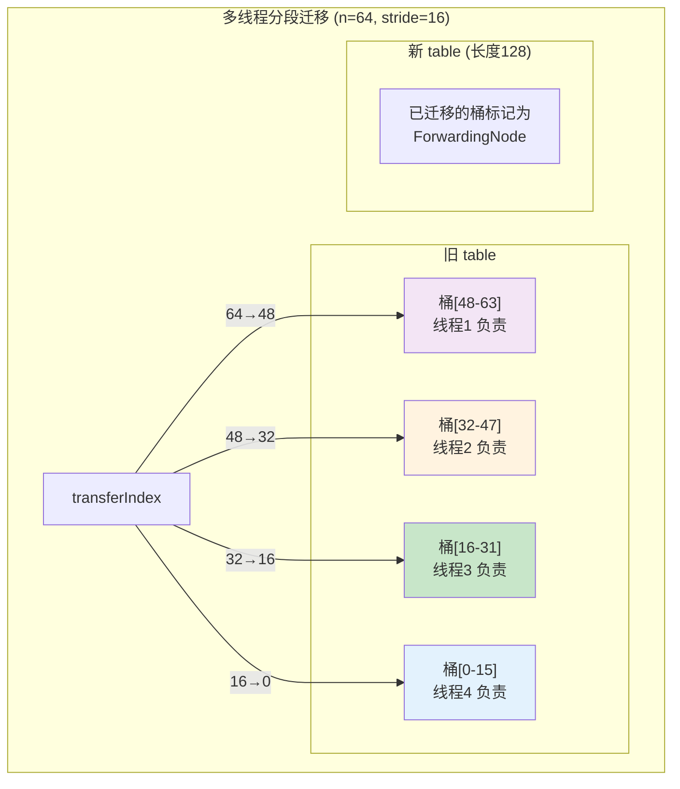

#### 3.13.5 ForwardingNode 标记

每个桶迁移完成后，旧 table 中该桶的位置会被设置为一个 ForwardingNode：

```java
setTabAt(tab, i, fwd);  // fwd 是 ForwardingNode，指向 nextTable
```

ForwardingNode 的作用：

| 作用 | 说明 |
|------|------|
| **标记已迁移** | 其他线程看到 hash == MOVED 就知道该桶已经迁移到新 table |
| **转发读请求** | get() 遇到 ForwardingNode 时，会调用 `fwd.find()` 在新 table 中查找 |
| **触发协助扩容** | put() 遇到 ForwardingNode 时，会调用 helpTransfer() 协助扩容 |

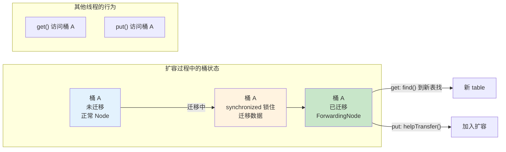

#### 3.13.6 扩容完整流程总结

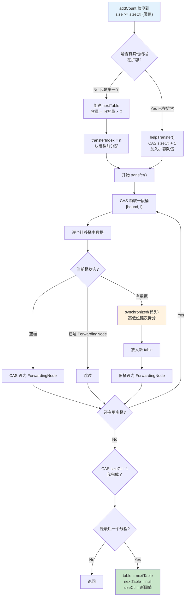

### 3.14 size() / sumCount() 的 LongAdder 思想

#### 3.14.1 addCount() 计数原理

```java
private final void addCount(long x, int check) {
    CounterCell[] as; long b, s;

    // ★ 策略1：先尝试 CAS 更新 baseCount
    if ((as = counterCells) != null ||
        !U.compareAndSwapLong(this, BASECOUNT, b = baseCount, s = b + x)) {

        // CAS 失败 或 counterCells 已存在
        CounterCell a; long v; int m;
        boolean uncontended = true;

        // ★ 策略2：CAS 更新 counterCells[hash & m]
        if (as == null || (m = as.length - 1) < 0 ||
            (a = as[ThreadLocalRandom.getProbe() & m]) == null ||
            !(uncontended = U.compareAndSwapLong(a, CELLVALUE,
                                                  v = a.value, v + x))) {
            // ★ 策略3：fullAddCount()，类似 LongAdder 的 longAccumulate
            fullAddCount(x, uncontended);
            return;
        }
        // ...
    }
    // ... 检查是否需要扩容 ...
}
```

**计数思想与 LongAdder 完全一致：**

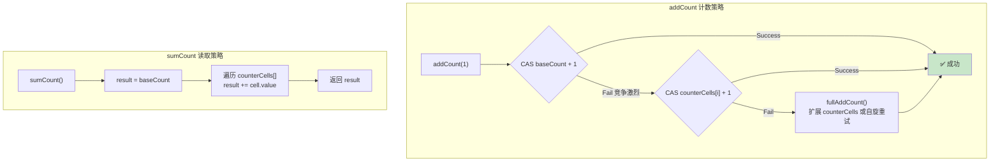

#### 3.14.2 CounterCell 的定义

```java
/**
 * 与 LongAdder 的 Cell 结构相同
 * @sun.misc.Contended 避免伪共享
 */
@sun.misc.Contended
static final class CounterCell {
    volatile long value;
    CounterCell(long x) { value = x; }
}
```

**`@sun.misc.Contended` 的作用：**
- CPU 缓存行通常是 64 字节
- 多个 CounterCell 可能位于同一个缓存行
- 一个线程修改 cell[0] 会导致持有同一缓存行的 cell[1] 失效（**伪共享**）
- `@Contended` 注解让 JVM 在对象前后填充字节，确保每个 Cell 独占一个缓存行

#### 3.14.3 sumCount() 和 size()

```java
final long sumCount() {
    CounterCell[] as = counterCells; CounterCell a;
    long sum = baseCount;
    if (as != null) {
        for (int i = 0; i < as.length; ++i) {
            if ((a = as[i]) != null)
                sum += a.value;  // 累加所有 cell 的值
        }
    }
    return sum;
}

public int size() {
    long n = sumCount();
    return ((n < 0L) ? 0 :
            (n > (long)Integer.MAX_VALUE) ? Integer.MAX_VALUE :
            (int)n);
}

// JDK 8 新增：返回 long，避免溢出
public long mappingCount() {
    long n = sumCount();
    return (n < 0L) ? 0L : n;
}
```

**为什么 size() 不是精确的？**

```
线程1: baseCount = 100
线程2: counterCells[0].value = 5, counterCells[1].value = 3
线程3: 正在执行 addCount，还没更新完

sumCount() = 100 + 5 + 3 = 108

但此时线程3 的 +1 还没反映出来，实际应该是 109
```

- size() / sumCount() 没有加锁，读取过程中可能有其他线程正在修改
- 返回的是一个**近似值**（弱一致性）
- 对于大部分场景来说，近似值已经够用了

### 3.15 红黑树操作（TreeBin / TreeNode）

#### 3.15.1 TreeBin 的读写锁

与 HashMap 不同，ConcurrentHashMap 的红黑树不是直接把 TreeNode 放在桶里，而是用一个 **TreeBin** 包装：

```java
static final class TreeBin<K,V> extends Node<K,V> {
    TreeNode<K,V> root;           // 红黑树根节点
    volatile TreeNode<K,V> first; // 链表第一个节点
    volatile Thread waiter;       // 等待线程
    volatile int lockState;       // 锁状态

    // 锁状态常量
    static final int WRITER = 1;   // 写锁
    static final int WAITER = 2;   // 等待写锁
    static final int READER = 4;   // 读锁（可多个）
}
```

**为什么需要 TreeBin？**

| 原因 | 说明 |
|------|------|
| **读写分离** | 红黑树的旋转会改变结构，读线程可能看到不一致状态 |
| **读锁** | 允许多个线程同时读红黑树 |
| **写锁** | 写操作（旋转、插入、删除）需要独占 |
| **桶头不变** | TreeBin 对象本身不变，只是内部的 root 在变。synchronized 锁的是 TreeBin 对象 |

#### 3.15.2 TreeBin 的 find() 方法

```java
final Node<K,V> find(int h, Object k) {
    if (k != null) {
        for (Node<K,V> e = first; e != null; ) {
            int s; K ek;
            // ★ 如果有写锁或等待写锁，走链表查找（避免读写冲突）
            if (((s = lockState) & (WAITER|WRITER)) != 0) {
                if (e.hash == h &&
                    ((ek = e.key) == k || (ek != null && k.equals(ek))))
                    return e;
                e = e.next;  // 退化为链表遍历
            }
            // ★ 没有写锁，走红黑树查找（更快）
            else if (U.compareAndSwapInt(this, LOCKSTATE, s,
                                         s + READER)) {
                TreeNode<K,V> r, p;
                try {
                    p = ((r = root) == null ? null :
                         r.findTreeNode(h, k, null));
                } finally {
                    Thread w;
                    if (U.getAndAddInt(this, LOCKSTATE, -READER) ==
                        (READER|WAITER) && (w = waiter) != null)
                        LockSupport.unpark(w);  // 唤醒等待的写线程
                }
                return p;
            }
        }
    }
    return null;
}
```

**设计精巧之处：**
- 有写锁时，退化为**链表遍历**（TreeNode 也维护了 next 链表指针）
- 没有写锁时，CAS 加读锁，走**红黑树查找**
- 读写互不阻塞（除非正在写，读退化为链表）

```mermaid
graph TD
    subgraph "TreeBin 读写策略"
        READ["find() 读操作"]
        READ --> CHECK{"有 WRITER<br/>或 WAITER?"}

        CHECK -->|Yes| LIST["退化为链表遍历<br/>O(n)"]
        CHECK -->|No| CAS_READ["CAS 加读锁<br/>lockState + READER"]
        CAS_READ --> TREE["红黑树查找<br/>O(log n)"]
        TREE --> UNLOCK_READ["释放读锁<br/>lockState - READER"]

        WRITE["put/remove 写操作"]
        WRITE --> SYNC["synchronized(TreeBin)"]
        SYNC --> LOCK_WRITE["lockState = WRITER"]
        LOCK_WRITE --> MODIFY["红黑树修改"]
        MODIFY --> UNLOCK_WRITE["lockState = 0"]
    end

    style LIST fill:#fff3e0
    style TREE fill:#c8e6c9
```

---

## 4. JDK 7 vs JDK 8 全面对比

### 4.1 详细对比表

| 维度 | JDK 7 | JDK 8 |
|------|-------|-------|
| **数据结构** | Segment[] + HashEntry[] + 链表 | Node[] + 链表 + 红黑树 |
| **锁粒度** | Segment 级别（一个 Segment 包含多个桶） | **桶级别**（每个桶独立锁） |
| **锁实现** | ReentrantLock（Segment 继承） | **CAS（空桶）+ synchronized（非空桶）** |
| **默认并发度** | 16（固定 Segment 数量） | **table.length（动态增长）** |
| **空桶写入** | 加锁（Segment.lock()） | **CAS 无锁写入** |
| **读操作** | 无锁（volatile 读） | 无锁（volatile 读） |
| **链表过长** | 不处理（一直是链表） | **转红黑树**（≥ 8 且 table ≥ 64） |
| **hash 算法** | Wang/Jenkins（多次扰动） | spread()（一次扰动 + & HASH_BITS） |
| **计数方式** | 每个 Segment 维护 count | **baseCount + counterCells**（LongAdder 思想） |
| **size() 策略** | 先不加锁尝试2次，不一致再加全锁 | sumCount()（baseCount + Σcells） |
| **扩容** | 每个 Segment 独立扩容 | **整个 table 扩容，多线程协助** |
| **扩容协助** | 无 | **helpTransfer() + ForwardingNode** |
| **定位方式** | 两次定位（先 Segment 再桶） | 一次定位（直接定位桶） |
| **Segment 可扩容？** | 不能，长度固定 | 无 Segment 概念 |
| **null key/value** | 不允许 | 不允许 |

### 4.2 为什么 JDK 8 放弃了 Segment

```mermaid
graph TD
    subgraph "JDK 7 Segment 的局限"
        L1["并发度固定为16<br/>无法动态调整"]
        L2["一个 Segment 锁住多个桶<br/>锁粒度不够细"]
        L3["没有红黑树<br/>hash 冲突严重时性能差"]
        L4["扩容只在单个 Segment<br/>不能利用多线程加速"]
        L5["数据结构复杂<br/>三层嵌套难以维护"]
    end

    subgraph "JDK 8 的改进"
        I1["并发度 = 桶数量<br/>动态增长"]
        I2["锁粒度细化到桶头<br/>不同桶完全并行"]
        I3["引入红黑树<br/>O(n) → O(log n)"]
        I4["多线程协助扩容<br/>transfer 任务分发"]
        I5["扁平结构<br/>Node[] + 链表/红黑树"]
    end

    L1 -.-> I1
    L2 -.-> I2
    L3 -.-> I3
    L4 -.-> I4
    L5 -.-> I5

    style L1 fill:#ffcdd2
    style L2 fill:#ffcdd2
    style L3 fill:#ffcdd2
    style L4 fill:#ffcdd2
    style L5 fill:#ffcdd2
    style I1 fill:#c8e6c9
    style I2 fill:#c8e6c9
    style I3 fill:#c8e6c9
    style I4 fill:#c8e6c9
    style I5 fill:#c8e6c9
```

### 4.3 性能提升分析

| 场景 | JDK 7 | JDK 8 | 原因 |
|------|-------|-------|------|
| **空桶写入** | 加锁 | **CAS 无锁** | CAS 比锁快一个数量级 |
| **不同桶写入** | 可能锁同一个 Segment | **完全并行** | 锁粒度从 Segment 细化到桶 |
| **读操作** | 无锁 | 无锁 | 两者都用 volatile |
| **hash 冲突** | O(n) | **O(log n)** | 红黑树 |
| **扩容** | 单线程 | **多线程协助** | 扩容速度成倍提升 |
| **计数** | Segment.count | **baseCount + counterCells** | 减少 CAS 竞争 |

---

## 5. ConcurrentHashMap vs HashMap vs Hashtable 对比

### 5.1 全面对比表

| 维度 | HashMap | Hashtable | ConcurrentHashMap (JDK 8) |
|------|---------|-----------|---------------------------|
| **线程安全** | 不安全 | 安全（全方法 synchronized） | **安全**（CAS + synchronized 桶头） |
| **null key** | 允许 1 个 | **不允许** | **不允许** |
| **null value** | 允许多个 | **不允许** | **不允许** |
| **锁粒度** | 无锁 | **整个表** | **桶头节点** |
| **读操作** | 无锁 | **有锁**（synchronized） | **无锁**（volatile） |
| **写操作** | 无锁 | **有锁**（synchronized） | **CAS（空桶）/ synchronized（非空桶）** |
| **并发读-读** | 支持 | **互斥** | **支持** |
| **并发读-写** | 不安全 | **互斥** | **支持**（弱一致） |
| **并发写-写** | 不安全 | **互斥** | **不同桶并行，同桶互斥** |
| **迭代器** | fail-fast | fail-fast | **弱一致性** |
| **继承关系** | AbstractMap | **Dictionary**（已过时） | AbstractMap |
| **数据结构** | 数组+链表+红黑树 | 数组+链表 | 数组+链表+红黑树 |
| **初始容量** | 16 | 11 | 16 |
| **扩容** | 2 倍 | 2 倍 + 1 | 2 倍 |
| **hash 算法** | h ^ (h >>> 16) | key.hashCode() | (h ^ (h >>> 16)) & 0x7fffffff |
| **size()** | O(1)，维护 size 字段 | O(1)，synchronized | O(n)，sumCount() |
| **JDK 版本** | 1.2 | 1.0 | 1.5（JDK 8 重写） |
| **推荐** | 单线程首选 | **不推荐** | **多线程首选** |

### 5.2 null 不允许的原因

**HashMap 允许 null，ConcurrentHashMap 不允许，为什么？**

```java
// ConcurrentHashMap 的 putVal
if (key == null || value == null) throw new NullPointerException();
```

| 原因 | 详细解释 |
|------|---------|
| **二义性问题** | `get(key)` 返回 null 时，无法区分"key 不存在"还是"value 就是 null" |
| **HashMap 的解决方案** | 可以用 `containsKey()` 区分 |
| **ConcurrentHashMap 的困境** | 并发环境下，`containsKey()` 和 `get()` 之间可能有其他线程 put/remove，导致不一致 |
| **Doug Lea 的设计哲学** | 并发容器应该避免歧义，null 是常见的 bug 来源 |

```java
// 在并发环境下，这段代码不安全：
ConcurrentHashMap<String, String> map = ...;
if (map.containsKey("key")) {      // ① 检查存在
    String val = map.get("key");   // ② 获取值
    // 在 ① 和 ② 之间，其他线程可能 remove("key")
    // 此时 val == null，但 key 曾经存在！
}
```

### 5.3 迭代器对比

| 迭代器类型 | HashMap | Hashtable | ConcurrentHashMap |
|-----------|---------|-----------|-------------------|
| **类型** | fail-fast | fail-fast | **弱一致性** |
| **并发修改** | 抛出 ConcurrentModificationException | 抛出 ConcurrentModificationException | **不抛异常** |
| **一致性** | 迭代开始后不允许修改 | 迭代开始后不允许修改 | **可能看到迭代开始后的修改** |
| **适用场景** | 单线程 | 单线程（虽然线程安全，迭代器仍是 fail-fast） | **多线程** |

### 5.4 选型指南

```mermaid
flowchart TD
    START["需要 Map"] --> Q1{"需要线程安全?"}
    Q1 -->|No| Q2{"需要顺序?"}
    Q1 -->|Yes| Q3{"高并发场景?"}

    Q2 -->|无序| HM["HashMap<br/>★★★★★ 单线程首选"]
    Q2 -->|插入顺序| LHM["LinkedHashMap"]
    Q2 -->|排序| TM["TreeMap"]

    Q3 -->|"Yes 高并发"| CHM["ConcurrentHashMap<br/>★★★★★ 多线程首选"]
    Q3 -->|"No 低并发"| SM["Collections.synchronizedMap<br/>或 ConcurrentHashMap"]

    style HM fill:#c8e6c9
    style CHM fill:#c8e6c9
```

---

## 6. 常见使用陷阱

### 6.1 陷阱1：复合操作非原子

```java
ConcurrentHashMap<String, Integer> map = new ConcurrentHashMap<>();

// ❌ 错误：先检查后操作，不是原子的！
if (!map.containsKey("count")) {
    map.put("count", 1);  // 多个线程可能同时进入这里
}

// ❌ 错误：先读后写，不是原子的！
Integer val = map.get("count");
if (val != null) {
    map.put("count", val + 1);  // 多个线程读到同一个 val，更新丢失
}

// ✅ 正确：使用 ConcurrentHashMap 提供的原子操作
map.putIfAbsent("count", 0);
map.compute("count", (k, v) -> (v == null ? 0 : v) + 1);  // 原子计算
map.merge("count", 1, Integer::sum);  // 原子合并
```

```mermaid
sequenceDiagram
    participant T1 as 线程1
    participant M as map
    participant T2 as 线程2

    Note over M: map = {"count": 10}

    T1->>M: get("count") → 10
    T2->>M: get("count") → 10
    T1->>M: put("count", 10 + 1) → 11
    T2->>M: put("count", 10 + 1) → 11

    Note over M: 期望 12，实际 11<br/>更新丢失！
```

### 6.2 陷阱2：size() 不精确

```java
ConcurrentHashMap<String, Integer> map = new ConcurrentHashMap<>();

// ❌ 不要依赖 size() 做业务判断
if (map.size() == 0) {
    // 在检查和操作之间，其他线程可能已经 put 了元素
    doSomething();
}

// ❌ size() 在并发修改过程中是近似值
// 多线程写入过程中
System.out.println("size = " + map.size());  // 可能不精确

// ✅ 如果需要精确判断，使用 isEmpty()（语义更清晰）
if (map.isEmpty()) {
    doSomething();
}

// 注意：size() 返回 int，最大 Integer.MAX_VALUE
// 如果元素超过 2^31 - 1，应使用 mappingCount()
long count = map.mappingCount();  // 返回 long
```

### 6.3 陷阱3：null 不允许

```java
ConcurrentHashMap<String, String> map = new ConcurrentHashMap<>();

// ❌ 以下都会抛 NullPointerException
map.put(null, "value");     // NPE: key 不能为 null
map.put("key", null);       // NPE: value 不能为 null
map.putIfAbsent("key", null); // NPE

// ✅ 如果需要表示"空值"，使用特殊标记
private static final String EMPTY = "";
map.put("key", EMPTY);
```

### 6.4 陷阱4：遍历结果不确定

```java
ConcurrentHashMap<String, Integer> map = new ConcurrentHashMap<>();
// 预填充数据
for (int i = 0; i < 100; i++) {
    map.put("key" + i, i);
}

// 弱一致性迭代器：遍历过程中看到的是"快照 + 部分更新"
// 一个线程遍历
new Thread(() -> {
    for (Map.Entry<String, Integer> entry : map.entrySet()) {
        // 可能看到其他线程的新增/修改，也可能看不到
        System.out.println(entry.getKey() + " = " + entry.getValue());
    }
}).start();

// 另一个线程修改
new Thread(() -> {
    map.put("key200", 200);
    map.remove("key0");
}).start();
```

### 6.5 陷阱5：computeIfAbsent 中的递归死锁

```java
ConcurrentHashMap<String, Integer> map = new ConcurrentHashMap<>();

// ❌ 危险：在 computeIfAbsent 的 mappingFunction 中操作同一个 map
// 可能导致死锁或 IllegalStateException
map.computeIfAbsent("key", k -> {
    map.put("anotherKey", 42);  // 可能死锁！
    return 1;
});
```

**原因**：`computeIfAbsent` 持有桶锁（synchronized），如果 mappingFunction 内部又触发同一个桶的操作，就会递归获取锁（虽然 synchronized 是可重入的，但操作不同桶时 CAS 和内部逻辑可能出现问题）。

### 6.6 陷阱总结

| 陷阱 | 问题 | 解决方案 |
|------|------|---------|
| 复合操作非原子 | 先检查后操作有竞态条件 | 使用 compute / merge / putIfAbsent |
| size() 不精确 | 并发下是近似值 | 不依赖 size() 做精确判断 |
| null 不允许 | NullPointerException | 使用特殊标记代替 null |
| 遍历不确定 | 弱一致性迭代器 | 接受弱一致性，或复制后遍历 |
| mappingFunction 副作用 | 可能死锁 | mappingFunction 中不修改同一个 map |

---

## 7. 面试高频问题

### 问题1：ConcurrentHashMap 的底层数据结构是什么？JDK 7 和 JDK 8 有什么区别？

**答**：

**JDK 7**：Segment 数组 + HashEntry 数组 + 链表。Segment 继承 ReentrantLock，每个 Segment 独立加锁（分段锁）。默认 16 个 Segment，并发度为 16。

**JDK 8**：Node 数组 + 链表 + 红黑树。放弃了 Segment 分段锁，改为 CAS + synchronized（桶头节点级别锁）。空桶写入用 CAS，非空桶写入用 synchronized 锁住桶头节点。

**核心改进：**
- 锁粒度从 Segment 级别细化到**桶级别**
- 并发度从固定 16 提升到**桶数量**（动态增长）
- 引入**红黑树**，hash 冲突严重时从 O(n) 优化到 O(log n)
- 引入**多线程协助扩容**（ForwardingNode + transferIndex）
- 计数方式改为 **baseCount + counterCells**（LongAdder 思想）

---

### 问题2：ConcurrentHashMap JDK 8 的 put() 过程是怎样的？

**答**：

1. 检查 key 和 value 不为 null（不允许 null）
2. 计算 `hash = spread(key.hashCode())`，保证 hash 为非负数
3. 进入 for(;;) 自旋循环：
   - **table 为空** → 调用 `initTable()` 初始化（CAS 控制只有一个线程初始化）
   - **桶为空** → **CAS** 直接放入新 Node（无锁！），成功则 break
   - **桶头 hash == MOVED(-1)** → 说明正在扩容，调用 `helpTransfer()` 协助扩容
   - **桶不为空且不在扩容** → **synchronized 锁住桶头节点**：
     - 如果是链表（hash >= 0）：遍历链表，尾插新节点或覆盖旧值
     - 如果是红黑树（TreeBin）：调用 `putTreeVal()` 插入
4. 链表长度 >= 8 时调用 `treeifyBin()` 考虑树化
5. 调用 `addCount(1)` 计数加一，同时检查是否需要扩容

**关键设计：空桶 CAS 无锁 + 非空桶 synchronized 锁桶头 + 多线程协助扩容**

---

### 问题3：ConcurrentHashMap 的 get() 为什么不需要加锁？

**答**：

ConcurrentHashMap 的 get() 全程无锁，安全性由以下 volatile 保证：

1. **`Node.val` 是 volatile 的**：写入后其他线程立即可见
2. **`Node.next` 是 volatile 的**：链表结构变更后其他线程立即可见
3. **`table` 是 volatile 的**：table 引用的变更对所有线程可见
4. **`tabAt()` 使用 `Unsafe.getObjectVolatile`**：桶头节点的变更对读线程可见

此外，链表的插入是尾插法，不会导致遍历时遗漏节点。

如果遇到 ForwardingNode（正在扩容），会调用 `fwd.find()` 在新 table 中查找，也无需加锁。

---

### 问题4：ConcurrentHashMap 的 sizeCtl 字段有什么含义？

**答**：

sizeCtl 是一个多功能控制字段，不同值表示不同含义：

| sizeCtl 的值 | 含义 |
|-------------|------|
| **0** | 默认值，table 还未初始化 |
| **> 0** | 如果 table 未初始化：初始容量；如果已初始化：扩容阈值（capacity × 0.75） |
| **-1** | table 正在初始化（有线程在执行 initTable） |
| **< -1** | table 正在扩容，高16位是扩容标识戳（resizeStamp），低16位是 1 + 参与扩容的线程数 |

initTable() 使用 CAS 将 sizeCtl 设为 -1 来抢占初始化权利。扩容时 sizeCtl 的低16位记录参与线程数，每个线程加入时 +1，完成时 -1，当低16位回到初始值时说明所有线程都完成了。

---

### 问题5：ConcurrentHashMap 的扩容机制是怎样的？如何实现多线程协助扩容？

**答**：

**触发扩容**：addCount() 中检测到元素数量 >= sizeCtl（阈值）时触发。

**扩容过程**：
1. 第一个线程创建新 table（容量翻倍），设置 `transferIndex = oldCap`
2. 计算 stride（每个线程负责迁移的桶数，最小 16）
3. 每个线程通过 CAS 从 transferIndex 领取一段桶 [bound, i)
4. 对每个桶：
   - 空桶：CAS 设置为 ForwardingNode
   - 已是 ForwardingNode：跳过
   - 有数据：synchronized 锁住桶头，高低位链表拆分迁移到新 table
5. 迁移完成的桶设置为 ForwardingNode，指向新 table
6. 每个线程完成后 CAS sizeCtl - 1，最后一个线程完成收尾工作

**多线程协助**：其他线程在 put() 时遇到 ForwardingNode，会调用 helpTransfer() 加入扩容。这样扩容不是单线程的瓶颈，而是**所有访问 ConcurrentHashMap 的线程都可能帮忙**。

---

### 问题6：ConcurrentHashMap 的 size() 是如何实现的？为什么不是精确的？

**答**：

**实现**：采用 **baseCount + counterCells** 的分段计数思想（与 LongAdder 原理一致）：
- 先尝试 CAS 更新 baseCount
- CAS 竞争激烈时，转用 counterCells[hash % length] 分散更新
- size() = baseCount + Σ counterCells[i].value

**不精确的原因**：sumCount() 在遍历 baseCount 和 counterCells 的过程中**没有加锁**，其他线程可能正在修改，所以得到的是一个**近似值**（弱一致性）。

**为什么不加锁？**：加锁会严重影响性能，而且大部分场景下近似值就够用了。如果需要精确值，只能在没有并发写入时才能获得。

---

### 问题7：ConcurrentHashMap 为什么不允许 null key 和 null value？

**答**：

这是 Doug Lea（ConcurrentHashMap 作者）的设计哲学：

1. **二义性问题**：`get(key)` 返回 null 时，无法区分"key 不存在"还是"value 就是 null"
2. **HashMap 可以用 containsKey() 区分**，但 ConcurrentHashMap 在并发环境下，containsKey() 和 get() 之间可能有其他线程修改，导致不一致
3. **并发容器应该避免歧义**：null 是常见的 bug 来源，在并发场景下问题更严重

Doug Lea 原话：
> The main reason that nulls aren't allowed in ConcurrentMaps (ConcurrentHashMaps, ConcurrentSkipListMaps) is that ambiguities that may be just barely tolerable in non-concurrent maps can't be accommodated.

---

### 问题8：ConcurrentHashMap JDK 8 为什么用 synchronized 而不是 ReentrantLock？

**答**：

JDK 7 的 Segment 继承 ReentrantLock，JDK 8 改用 synchronized，原因：

1. **JVM 优化**：JDK 6 之后 synchronized 经历了大量优化（偏向锁、轻量级锁、自适应自旋、锁消除、锁粗化），在低竞争场景下性能接近甚至优于 ReentrantLock
2. **内存开销更小**：synchronized 不需要额外的 AQS 节点对象，而 ConcurrentHashMap 可能有上百万个桶，每个桶如果用 ReentrantLock 内存开销巨大
3. **锁优化的基础更好**：synchronized 由 JVM 管理，JVM 可以做更多优化（如偏向锁只需要一次 CAS，之后是无锁的）
4. **代码简洁**：synchronized 自动释放锁，不会忘记 unlock()

---

### 问题9：ConcurrentHashMap 和 Hashtable 的区别？

**答**：

| 维度 | ConcurrentHashMap | Hashtable |
|------|-------------------|-----------|
| 锁粒度 | 桶级别（JDK 8）/ Segment（JDK 7） | **整个表**（一把锁） |
| 读操作 | **无锁** | 有锁 |
| 写操作 | CAS + synchronized（桶级别） | synchronized（全表） |
| 并发度 | 桶数量 | 1 |
| 红黑树 | 有 | 无 |
| 扩容 | 多线程协助 | 单线程 |
| null key/value | 不允许 | 不允许 |
| 迭代器 | 弱一致性（不抛异常） | fail-fast |
| 继承 | AbstractMap | Dictionary（已过时） |
| 性能 | **高** | 低（锁竞争严重） |

**一句话总结**：Hashtable 是"大锁"，所有操作串行化；ConcurrentHashMap 是"细粒度锁 + 无锁读"，不同桶可并行操作。

---

### 问题10：ConcurrentHashMap 的弱一致性是什么意思？

**答**：

ConcurrentHashMap 的弱一致性体现在：

1. **迭代器**：弱一致性迭代器不会抛出 ConcurrentModificationException。迭代过程中如果有其他线程修改了 map，迭代器**可能看到修改，也可能看不到**。
2. **size()**：返回的是近似值，可能不精确。
3. **get()**：基于 volatile 读，能看到"之前完成的"写操作，但不保证能看到"正在进行的"写操作的最终结果。

**弱一致性 vs 强一致性**：
- 强一致性：任何时刻，所有线程看到的数据都一致（需要加锁）
- 弱一致性：不保证实时一致，但最终会一致

**为什么选择弱一致性？** 因为强一致性需要加锁，会严重影响并发性能。在大部分场景下，弱一致性是可以接受的。

---

### 问题11：ConcurrentHashMap 中 ForwardingNode 的作用是什么？

**答**：

ForwardingNode 是扩容过程中的关键标记节点，hash 值固定为 MOVED(-1)：

1. **标记已迁移**：该桶的数据已经迁移到新 table，旧 table 中该桶不再有有效数据
2. **转发读请求**：get() 遇到 ForwardingNode 时，调用其 `find()` 方法在新 table（nextTable）中查找
3. **触发协助扩容**：put() 遇到 ForwardingNode 时，调用 `helpTransfer()` 帮助迁移其他尚未迁移的桶

ForwardingNode 内部持有 nextTable 的引用，保证扩容过程中读操作的正确性。

---

### 问题12：ConcurrentHashMap 的 spread() 和 HashMap 的 hash() 有什么区别？

**答**：

```java
// HashMap
static final int hash(Object key) {
    int h;
    return (key == null) ? 0 : (h = key.hashCode()) ^ (h >>> 16);
}

// ConcurrentHashMap
static final int spread(int h) {
    return (h ^ (h >>> 16)) & HASH_BITS;  // HASH_BITS = 0x7fffffff
}
```

| 区别 | HashMap | ConcurrentHashMap |
|------|---------|-------------------|
| null key | hash(null) = 0 | 不允许 null key |
| 结果范围 | 可能为负数 | **一定为正数**（& 0x7fffffff） |
| 原因 | 无特殊含义 | 负数 hash 有特殊用途（-1=ForwardingNode，-2=TreeBin） |
| 扰动方式 | 高16位异或低16位 | 高16位异或低16位（相同） |

---

### 问题13：ConcurrentHashMap 如何保证扩容时的读写安全？

**答**：

**读安全**：
- 已迁移的桶：桶头是 ForwardingNode，get() 调用 `fwd.find()` 在新 table 查找
- 未迁移的桶：正常在旧 table 中查找
- 正在迁移的桶：synchronized 锁住桶头，读线程要么在锁之前读到旧数据，要么在锁之后读到新结构

**写安全**：
- 已迁移的桶：put() 遇到 ForwardingNode → helpTransfer() 协助扩容，扩容完后在新 table 中 put
- 未迁移的桶：正常 put（synchronized 锁桶头）
- 正在迁移的桶：synchronized 互斥，put 等待迁移完成

---

### 问题14：为什么 ConcurrentHashMap 的 counterCells 使用 @Contended 注解？

**答**：

`@sun.misc.Contended` 注解用于**避免伪共享（False Sharing）**。

CPU 的缓存以**缓存行（Cache Line）** 为单位，通常 64 字节。如果两个 CounterCell 对象恰好在同一个缓存行中：
- 线程1 修改 cell[0]
- 该缓存行对应的所有 CPU 核心的缓存都失效
- 线程2 访问 cell[1] 虽然没被修改，但因为同一缓存行也要重新加载

这就是**伪共享**：不同线程操作不同数据，但因为共享缓存行导致性能下降。

`@Contended` 让 JVM 在对象前后填充空字节，确保每个 CounterCell 独占一个缓存行，消除伪共享。

---

### 问题15：在什么场景下应该使用 ConcurrentHashMap？什么场景不适合？

**答**：

**适合使用：**
- 多线程读写共享 Map 的场景
- 缓存（高读低写）
- 并发计数器（compute / merge）
- 生产者-消费者模型中的共享数据结构

**不适合使用：**
- 单线程环境（HashMap 更快，没有 volatile / CAS 开销）
- 需要强一致性的场景（size() 不精确，迭代器弱一致）
- 需要排序的场景（使用 ConcurrentSkipListMap）
- 需要存 null 的场景

**使用建议：**
- 优先使用 `compute` / `merge` / `putIfAbsent` 等原子操作，而非 get + put
- 不要依赖 size() 做业务判断
- 注意 computeIfAbsent 的 mappingFunction 中不要操作同一个 map
- 接受弱一致性的语义

---

### 问题16：ConcurrentHashMap 和 Collections.synchronizedMap 有什么区别？

**答**：

| 维度 | ConcurrentHashMap | synchronizedMap |
|------|-------------------|-----------------|
| 锁粒度 | 桶级别 | **整个 Map（mutex）** |
| 读操作 | **无锁** | 有锁 |
| 并发度 | 桶数量（动态增长） | 1 |
| 原子操作 | 提供 compute/merge/putIfAbsent | **不提供**（只有普通 put/get） |
| 迭代器 | 弱一致性 | fail-fast（需要手动同步） |
| null 支持 | 不允许 | 取决于被包装的 Map |
| 扩容 | 多线程协助 | 单线程 |
| 性能 | **高** | 低 |
| 使用复杂度 | 简单 | 迭代时需要手动同步 |

synchronizedMap 在高并发下性能极差，因为所有操作都竞争同一把锁。而且复合操作（如 get + put）不是原子的。ConcurrentHashMap 在性能和功能上都远远优于 synchronizedMap。

---

### 问题17：ConcurrentHashMap 中红黑树的 TreeBin 和 HashMap 中的 TreeNode 有什么区别？

**答**：

HashMap 直接把 TreeNode 放在桶头位置，而 ConcurrentHashMap 在桶头放的是 **TreeBin**（一个包装容器），TreeBin 内部维护红黑树。

**原因**：
1. **读写分离**：TreeBin 内部有一个简单的读写锁（lockState），允许多个线程同时读红黑树，写操作（旋转、插入）需要独占
2. **桶头不变**：put 操作的 synchronized 锁的是桶头对象。如果红黑树旋转后根节点变了，锁的对象就变了，会导致问题。TreeBin 对象始终不变，即使内部 root 变了，锁的还是同一个 TreeBin
3. **降级查找**：当有写锁时，读操作退化为链表遍历（TreeNode 也维护了 next 指针），避免读到不一致的树结构

---

### 问题18：如何用 ConcurrentHashMap 实现线程安全的计数器？

**答**：

```java
ConcurrentHashMap<String, LongAdder> counters = new ConcurrentHashMap<>();

// 方式1：computeIfAbsent + LongAdder（推荐）
counters.computeIfAbsent("pageView", k -> new LongAdder()).increment();

// 方式2：compute（原子操作）
ConcurrentHashMap<String, Long> map = new ConcurrentHashMap<>();
map.compute("count", (k, v) -> (v == null ? 0L : v) + 1);

// 方式3：merge（原子合并）
map.merge("count", 1L, Long::sum);

// ❌ 错误方式：非原子的 get + put
Long val = map.get("count");
map.put("count", val + 1);  // 竞态条件！
```

方式1 最推荐：`computeIfAbsent` 原子地创建 LongAdder，然后 LongAdder 的 `increment()` 也是原子的，性能极好。

---

## 总结

### 核心知识点回顾

```mermaid
mindmap
  root((ConcurrentHashMap<br/>源码分析))
    为什么需要
      HashMap 不安全
      Hashtable 全表锁
      synchronizedMap 全表锁
    JDK 7
      Segment 分段锁
      ReentrantLock
      并发度=16
      两次 hash 定位
      size() 先乐观后悲观
    JDK 8 重点
      CAS + synchronized
      Node[] + 链表 + 红黑树
      sizeCtl 多重含义
      initTable CAS 控制
      put: 空桶CAS / 非空synchronized
      get: 完全无锁 volatile
      transfer 多线程扩容
      ForwardingNode 标记
      counterCells LongAdder思想
      TreeBin 读写锁
    对比
      JDK7 vs JDK8
      vs HashMap
      vs Hashtable
    陷阱
      复合操作非原子
      size 不精确
      null 不允许
    面试
      put 完整流程
      get 无锁原理
      sizeCtl 含义
      多线程扩容
      vs Hashtable
```

### 一句话总结每个方法

| 方法 | 一句话 |
|------|--------|
| `spread()` | 高16位异或低16位 + & HASH_BITS，保证 hash 为正数 |
| `initTable()` | CAS 将 sizeCtl 设为 -1 抢占初始化权，其他线程 yield 等待 |
| `putVal()` | 空桶 CAS → 正在扩容 helpTransfer → 非空 synchronized 锁桶头 → 链表/红黑树操作 → addCount |
| `get()` | 全程无锁，volatile 读 → 检查桶头 → 特殊节点调 find() → 链表遍历 |
| `transfer()` | 多线程分段迁移（stride），ForwardingNode 标记，synchronized 迁移每个桶 |
| `addCount()` | 先 CAS baseCount，失败则 CAS counterCells[i]（LongAdder 思想） |
| `sumCount()` | baseCount + ΣcounterCells[i].value（弱一致性近似值） |
| `helpTransfer()` | CAS sizeCtl + 1 加入扩容，调用 transfer() |

---

> **学习建议**：
> 1. 先掌握 JDK 8 的 `putVal()` 和 `transfer()`，这是面试的核心
> 2. 理解 sizeCtl 的多重含义是理解并发控制的关键
> 3. 对比 JDK 7 和 JDK 8 的差异，理解每次改进的原因
> 4. 运行 `code/` 目录下的实验代码，加深对并发行为的直观感受
> 5. 用自己的话复述 put 流程和扩容流程，确保真正理解
