# 其他集合框架源码详解

> **学习目标**：深入理解 Java 集合框架中 ArrayList、LinkedList、HashSet、LinkedHashMap、TreeMap、PriorityQueue、ArrayDeque 等核心集合类的源码实现，掌握各集合的底层数据结构与算法原理，具备面试中深入解析集合源码的能力。

---

## 目录

- [一、Java 集合框架全景图](#一java-集合框架全景图)
- [二、ArrayList 源码深度分析](#二arraylist-源码深度分析)
- [三、LinkedList 源码深度分析](#三linkedlist-源码深度分析)
- [四、ArrayList vs LinkedList 全面对比](#四arraylist-vs-linkedlist-全面对比)
- [五、HashSet 源码分析](#五hashset-源码分析)
- [六、LinkedHashSet / LinkedHashMap 源码分析](#六linkedhashset--linkedhashmap-源码分析)
- [七、TreeMap / TreeSet 源码分析](#七treemap--treeset-源码分析)
- [八、PriorityQueue 源码分析](#八priorityqueue-源码分析)
- [九、ArrayDeque 源码分析](#九arraydeque-源码分析)
- [十、Collections 工具类](#十collections-工具类)
- [十一、集合选型指南](#十一集合选型指南)
- [十二、fail-fast vs fail-safe 机制](#十二fail-fast-vs-fail-safe-机制)
- [十三、面试高频问题](#十三面试高频问题)

---

## 一、Java 集合框架全景图

### 1.1 两大体系总览

Java 集合框架（Java Collections Framework, JCF）是 `java.util` 包下的一组接口和类，分为两大体系：

| 体系 | 根接口 | 特点 | 典型实现 |
|------|--------|------|----------|
| **Collection** | `Collection<E>` | 存储单个元素的集合 | ArrayList, LinkedList, HashSet, TreeSet |
| **Map** | `Map<K,V>` | 存储键值对的映射表 | HashMap, TreeMap, LinkedHashMap, ConcurrentHashMap |

### 1.2 Collection 体系类图

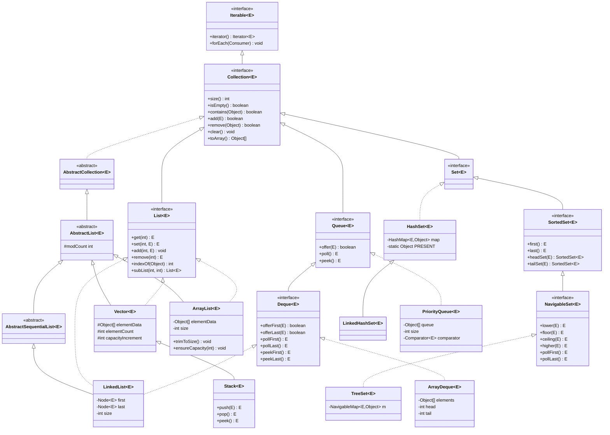

### 1.3 Map 体系类图

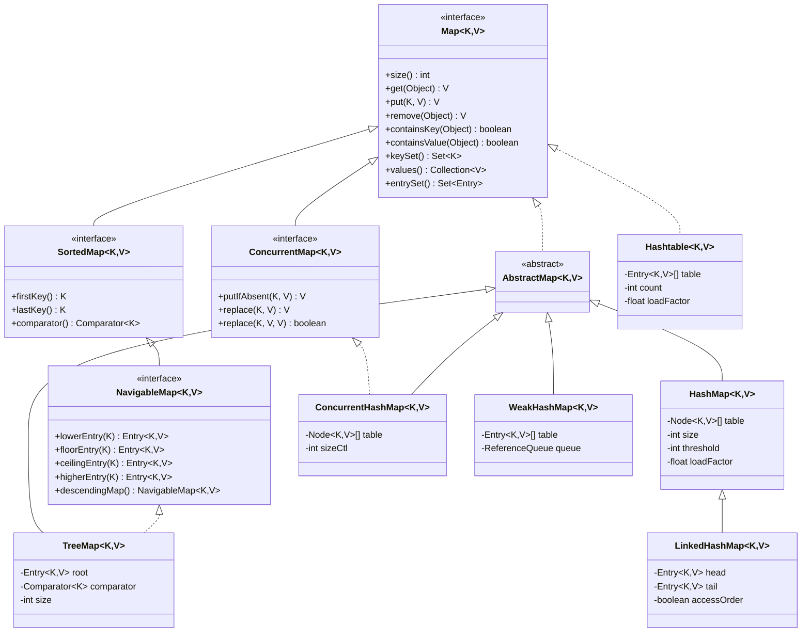

### 1.4 集合框架设计原则

Java 集合框架的设计遵循以下原则：

1. **接口与实现分离**：通过接口定义行为（List、Set、Map），具体实现类提供不同的底层数据结构
2. **泛型支持**：JDK 5 引入泛型，提供编译期类型安全
3. **迭代器模式**：统一的 `Iterator` 遍历接口
4. **算法与数据结构分离**：`Collections` 工具类提供排序、查找等通用算法
5. **fail-fast 机制**：快速失败，保护并发修改安全

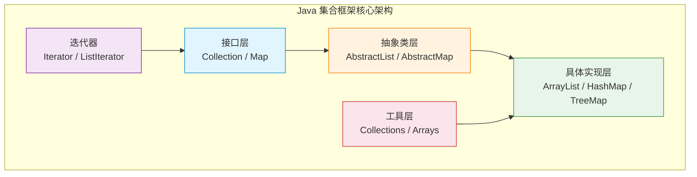

---

## 二、ArrayList 源码深度分析

### 2.1 类定义与继承结构

```java
public class ArrayList<E> extends AbstractList<E>
        implements List<E>, RandomAccess, Cloneable, java.io.Serializable {
    
    private static final long serialVersionUID = 8683452581122892189L;
    
    // 默认初始容量
    private static final int DEFAULT_CAPACITY = 10;
    
    // 空数组（用于指定容量为0时）
    private static final Object[] EMPTY_ELEMENTDATA = {};
    
    // 默认空数组（用于无参构造，区分于EMPTY_ELEMENTDATA）
    private static final Object[] DEFAULTCAPACITY_EMPTY_ELEMENTDATA = {};
    
    // 底层存储数组（transient 不参与默认序列化）
    transient Object[] elementData;
    
    // 实际元素个数
    private int size;
}
```

**关键点**：
- 实现 `RandomAccess` 接口：标记接口，表明支持 O(1) 随机访问
- `elementData` 是 `transient` 修饰的：ArrayList 自定义了序列化逻辑（`writeObject`/`readObject`），只序列化有效元素，避免浪费空间
- 两个空数组常量的区别：`DEFAULTCAPACITY_EMPTY_ELEMENTDATA` 用于无参构造，首次 add 时扩容到 `DEFAULT_CAPACITY`（10）；`EMPTY_ELEMENTDATA` 用于 `new ArrayList(0)`，按正常逻辑扩容

### 2.2 构造方法

```java
// 无参构造：创建一个空数组，第一次 add 时扩容到 10
public ArrayList() {
    this.elementData = DEFAULTCAPACITY_EMPTY_ELEMENTDATA;
}

// 指定初始容量
public ArrayList(int initialCapacity) {
    if (initialCapacity > 0) {
        this.elementData = new Object[initialCapacity];
    } else if (initialCapacity == 0) {
        this.elementData = EMPTY_ELEMENTDATA;
    } else {
        throw new IllegalArgumentException("Illegal Capacity: " + initialCapacity);
    }
}

// 从集合构造
public ArrayList(Collection<? extends E> c) {
    Object[] a = c.toArray();
    if ((size = a.length) != 0) {
        if (c.getClass() == ArrayList.class) {
            elementData = a;
        } else {
            elementData = Arrays.copyOf(a, size, Object[].class);
        }
    } else {
        elementData = EMPTY_ELEMENTDATA;
    }
}
```

> **面试要点**：无参构造创建的是空数组，而不是容量为 10 的数组。只有在第一次 add 时才会扩容到默认容量 10。这是 JDK 8 的优化——**懒初始化**，减少内存浪费。

### 2.3 add() 方法与扩容机制

#### 2.3.1 add(E e) 源码

```java
public boolean add(E e) {
    // 确保容量足够（size + 1 是所需的最小容量）
    ensureCapacityInternal(size + 1);  // Increments modCount!!
    // 在 size 位置放入元素，然后 size++
    elementData[size++] = e;
    return true;
}
```

#### 2.3.2 ensureCapacityInternal 调用链

```java
private void ensureCapacityInternal(int minCapacity) {
    ensureExplicitCapacity(calculateCapacity(elementData, minCapacity));
}

private static int calculateCapacity(Object[] elementData, int minCapacity) {
    // 如果是默认空数组（无参构造），取 DEFAULT_CAPACITY 和 minCapacity 的最大值
    if (elementData == DEFAULTCAPACITY_EMPTY_ELEMENTDATA) {
        return Math.max(DEFAULT_CAPACITY, minCapacity);
    }
    return minCapacity;
}

private void ensureExplicitCapacity(int minCapacity) {
    modCount++;  // 结构性修改计数器 +1（用于 fail-fast）
    
    // 如果所需最小容量 > 当前数组长度，则需要扩容
    if (minCapacity - elementData.length > 0)
        grow(minCapacity);
}
```

#### 2.3.3 grow() 扩容核心方法

```java
private void grow(int minCapacity) {
    // 旧容量
    int oldCapacity = elementData.length;
    // 新容量 = 旧容量 + 旧容量/2 = 旧容量 * 1.5
    int newCapacity = oldCapacity + (oldCapacity >> 1);
    
    // 如果新容量仍然不够，直接使用所需的最小容量
    if (newCapacity - minCapacity < 0)
        newCapacity = minCapacity;
    
    // 如果新容量超过最大数组大小
    if (newCapacity - MAX_ARRAY_SIZE > 0)
        newCapacity = hugeCapacity(minCapacity);
    
    // 使用 Arrays.copyOf 复制数组
    elementData = Arrays.copyOf(elementData, newCapacity);
}

private static int hugeCapacity(int minCapacity) {
    if (minCapacity < 0) // overflow
        throw new OutOfMemoryError();
    return (minCapacity > MAX_ARRAY_SIZE) ?
        Integer.MAX_VALUE :
        MAX_ARRAY_SIZE;
}
```

**扩容流程图**：

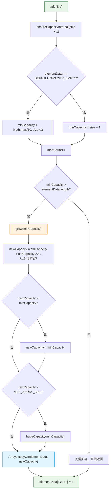

#### 2.3.4 add(int index, E element) 指定位置插入

```java
public void add(int index, E element) {
    rangeCheckForAdd(index);  // 检查下标合法性
    
    ensureCapacityInternal(size + 1);  // 确保容量
    
    // 将 index 及之后的元素向后移动一位
    System.arraycopy(elementData, index, elementData, index + 1,
                     size - index);
    elementData[index] = element;
    size++;
}
```

**数组移动示意图**：

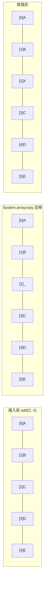

> **复杂度分析**：`add(int index, E element)` 的时间复杂度为 **O(n)**，因为需要移动 `size - index` 个元素。最坏情况（插入到头部）需要移动所有元素。

#### 2.3.5 扩容次数分析

假设初始容量为默认 10，不断 add 元素：

| 次数 | 触发扩容时的 size | 扩容前容量 | 扩容后容量 | 扩容倍数 |
|------|-------------------|-----------|-----------|----------|
| 1 | 1 (首次 add) | 0 → 10 | 10 | - (初始化) |
| 2 | 11 | 10 | 15 | 1.5x |
| 3 | 16 | 15 | 22 | 1.5x |
| 4 | 23 | 22 | 33 | 1.5x |
| 5 | 34 | 33 | 49 | 1.5x |
| 6 | 50 | 49 | 73 | 1.5x |

> **最佳实践**：如果能预估元素数量，建议使用 `new ArrayList<>(expectedSize)` 指定初始容量，避免频繁扩容带来的数组复制开销。

### 2.4 remove() 方法源码

#### 2.4.1 remove(int index) 按索引删除

```java
public E remove(int index) {
    rangeCheck(index);  // 检查下标合法性
    
    modCount++;  // 结构性修改计数器 +1
    E oldValue = elementData(index);  // 取出旧值
    
    int numMoved = size - index - 1;  // 需要移动的元素个数
    if (numMoved > 0)
        // 将 index+1 及之后的元素向前移动一位
        System.arraycopy(elementData, index+1, elementData, index,
                         numMoved);
    // 最后一个位置置 null，帮助 GC
    elementData[--size] = null;
    
    return oldValue;
}
```

**删除过程示意图**：

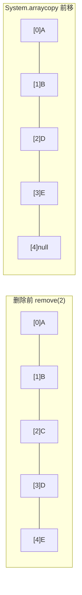

#### 2.4.2 remove(Object o) 按元素删除

```java
public boolean remove(Object o) {
    if (o == null) {
        for (int index = 0; index < size; index++)
            if (elementData[index] == null) {
                fastRemove(index);
                return true;
            }
    } else {
        for (int index = 0; index < size; index++)
            if (o.equals(elementData[index])) {
                fastRemove(index);
                return true;
            }
    }
    return false;
}

// 跳过边界检查的内部删除方法
private void fastRemove(int index) {
    modCount++;
    int numMoved = size - index - 1;
    if (numMoved > 0)
        System.arraycopy(elementData, index+1, elementData, index,
                         numMoved);
    elementData[--size] = null;
}
```

> **注意**：`remove(Object o)` 只删除第一个匹配的元素。如果需要删除所有匹配元素，使用 `removeAll(Collection)` 或 `removeIf(Predicate)`。

### 2.5 get() / set() 方法

```java
public E get(int index) {
    rangeCheck(index);  // 只检查上界（index >= size）
    return elementData(index);  // 直接数组下标访问
}

public E set(int index, E element) {
    rangeCheck(index);
    E oldValue = elementData(index);
    elementData[index] = element;
    return oldValue;
}

// 内部方法，做强制类型转换
@SuppressWarnings("unchecked")
E elementData(int index) {
    return (E) elementData[index];
}

// 只检查上界（数组下标为负数会抛 ArrayIndexOutOfBoundsException）
private void rangeCheck(int index) {
    if (index >= size)
        throw new IndexOutOfBoundsException(outOfBoundsMsg(index));
}
```

> **O(1) 随机访问**：`get(index)` 和 `set(index, element)` 都是直接通过数组下标访问，时间复杂度为 O(1)。这就是 ArrayList 实现 `RandomAccess` 标记接口的原因。

### 2.6 Iterator 与 fail-fast 机制

#### 2.6.1 Iterator 实现

```java
public Iterator<E> iterator() {
    return new Itr();
}

private class Itr implements Iterator<E> {
    int cursor;       // 下一个要返回的元素索引
    int lastRet = -1; // 上一次返回的元素索引，-1 表示没有
    int expectedModCount = modCount;  // 创建迭代器时记录 modCount
    
    public boolean hasNext() {
        return cursor != size;
    }
    
    @SuppressWarnings("unchecked")
    public E next() {
        checkForComodification();  // 检查是否发生并发修改
        int i = cursor;
        if (i >= size)
            throw new NoSuchElementException();
        Object[] elementData = ArrayList.this.elementData;
        if (i >= elementData.length)
            throw new ConcurrentModificationException();
        cursor = i + 1;
        return (E) elementData[lastRet = i];
    }
    
    public void remove() {
        if (lastRet < 0)
            throw new IllegalStateException();
        checkForComodification();
        
        try {
            ArrayList.this.remove(lastRet);
            cursor = lastRet;  // 因为删除了一个元素，cursor 需要回退
            lastRet = -1;
            expectedModCount = modCount;  // 同步 modCount
        } catch (IndexOutOfBoundsException ex) {
            throw new ConcurrentModificationException();
        }
    }
    
    // fail-fast 检测核心
    final void checkForComodification() {
        if (modCount != expectedModCount)
            throw new ConcurrentModificationException();
    }
}
```

#### 2.6.2 fail-fast 机制原理

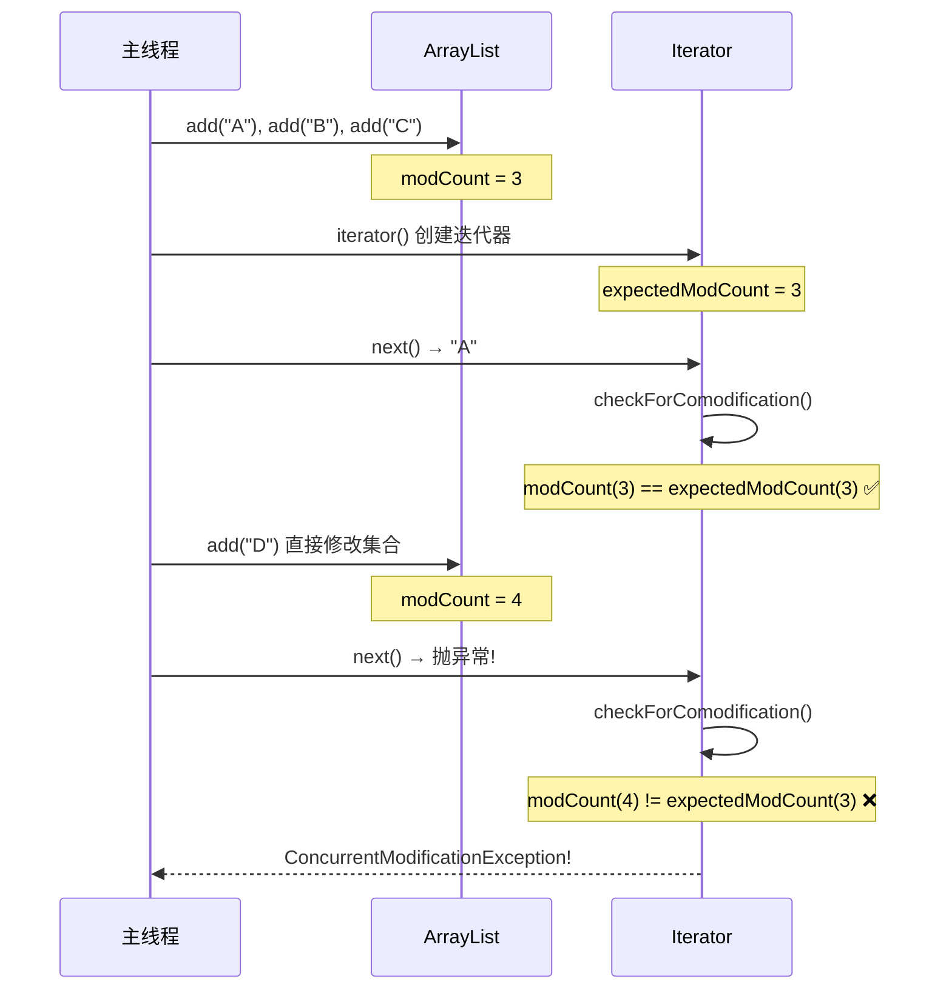

**触发 fail-fast 的常见场景**：

```java
// ❌ 错误：在 foreach 循环中直接修改集合
List<String> list = new ArrayList<>(Arrays.asList("A", "B", "C"));
for (String s : list) {
    if ("B".equals(s)) {
        list.remove(s);  // ConcurrentModificationException!
    }
}

// ✅ 正确方式1：使用 Iterator.remove()
Iterator<String> it = list.iterator();
while (it.hasNext()) {
    if ("B".equals(it.next())) {
        it.remove();  // 安全删除
    }
}

// ✅ 正确方式2：使用 removeIf()（JDK 8+）
list.removeIf(s -> "B".equals(s));

// ✅ 正确方式3：倒序遍历删除
for (int i = list.size() - 1; i >= 0; i--) {
    if ("B".equals(list.get(i))) {
        list.remove(i);
    }
}
```

### 2.7 subList 的坑

```java
public List<E> subList(int fromIndex, int toIndex) {
    subListRangeCheck(fromIndex, toIndex, size);
    return new SubList(this, 0, fromIndex, toIndex);
}
```

**SubList 不是独立的 ArrayList**，它是原始 ArrayList 的一个视图（view）：

```java
private class SubList extends AbstractList<E> implements RandomAccess {
    private final AbstractList<E> parent;
    private final int parentOffset;
    private final int offset;
    int size;
    
    // SubList 的所有操作都会映射到原始 ArrayList
    public E set(int index, E e) {
        rangeCheck(index);
        checkForComodification();
        E oldValue = ArrayList.this.elementData(offset + index);
        ArrayList.this.elementData[offset + index] = e;
        return oldValue;
    }
    
    public void add(int index, E e) {
        rangeCheckForAdd(index);
        checkForComodification();
        parent.add(parentOffset + index, e);
        this.modCount = parent.modCount;
        this.size++;
    }
}
```

**SubList 的坑**：

```java
// 坑1：修改 SubList 会影响原始 List
List<String> list = new ArrayList<>(Arrays.asList("A", "B", "C", "D", "E"));
List<String> sub = list.subList(1, 3);  // [B, C]
sub.set(0, "X");  // list 变成 [A, X, C, D, E]

// 坑2：修改原始 List 后操作 SubList 会抛异常
list.add("F");
sub.get(0);  // ConcurrentModificationException!

// 坑3：SubList 持有原始 ArrayList 的引用，可能导致内存泄漏
// 如果需要独立的列表：
List<String> independent = new ArrayList<>(list.subList(1, 3));
```

### 2.8 ArrayList 序列化机制

```java
// 自定义序列化：只写有效元素
private void writeObject(java.io.ObjectOutputStream s)
    throws java.io.IOException{
    int expectedModCount = modCount;
    s.defaultWriteObject();  // 写入非 transient 字段（size）
    s.writeInt(size);        // 写入 size（冗余，为了兼容性）
    
    // 只写入 size 个有效元素，而不是整个 elementData 数组
    for (int i=0; i<size; i++) {
        s.writeObject(elementData[i]);
    }
    
    if (modCount != expectedModCount) {
        throw new ConcurrentModificationException();
    }
}
```

> **设计思想**：`elementData` 数组的容量通常大于 `size`（有预留空间），使用 `transient` + 自定义序列化可以避免序列化无用的空位置，节省空间和时间。

---

## 三、LinkedList 源码深度分析

### 3.1 类定义与内部节点

```java
public class LinkedList<E>
    extends AbstractSequentialList<E>
    implements List<E>, Deque<E>, Cloneable, java.io.Serializable {
    
    transient int size = 0;
    
    // 指向第一个节点
    transient Node<E> first;
    
    // 指向最后一个节点
    transient Node<E> last;
    
    // 双向链表节点
    private static class Node<E> {
        E item;       // 存储的元素
        Node<E> next; // 后继节点
        Node<E> prev; // 前驱节点
        
        Node(Node<E> prev, E element, Node<E> next) {
            this.item = element;
            this.next = next;
            this.prev = prev;
        }
    }
}
```

**双向链表结构示意图**：

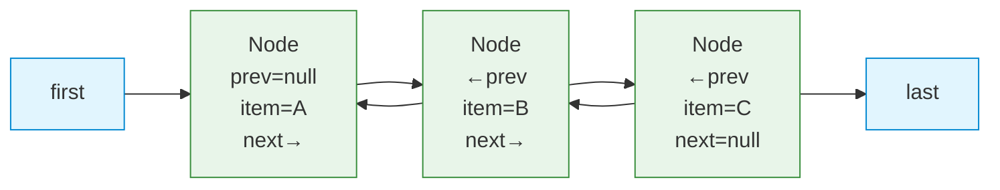

### 3.2 add 操作

#### 3.2.1 尾插 add(E e) / linkLast(E e)

```java
public boolean add(E e) {
    linkLast(e);
    return true;
}

void linkLast(E e) {
    final Node<E> l = last;
    final Node<E> newNode = new Node<>(l, e, null);
    last = newNode;
    if (l == null)
        first = newNode;  // 空链表，first 也指向新节点
    else
        l.next = newNode;  // 原来的 last 节点指向新节点
    size++;
    modCount++;
}
```

#### 3.2.2 头插 addFirst(E e) / linkFirst(E e)

```java
public void addFirst(E e) {
    linkFirst(e);
}

private void linkFirst(E e) {
    final Node<E> f = first;
    final Node<E> newNode = new Node<>(null, e, f);
    first = newNode;
    if (f == null)
        last = newNode;  // 空链表，last 也指向新节点
    else
        f.prev = newNode;  // 原来的 first 节点的 prev 指向新节点
    size++;
    modCount++;
}
```

#### 3.2.3 指定位置插入 add(int index, E element)

```java
public void add(int index, E element) {
    checkPositionIndex(index);
    
    if (index == size)
        linkLast(element);  // 如果插入位置是末尾
    else
        linkBefore(element, node(index));  // 在指定节点前插入
}

void linkBefore(E e, Node<E> succ) {
    final Node<E> pred = succ.prev;
    final Node<E> newNode = new Node<>(pred, e, succ);
    succ.prev = newNode;
    if (pred == null)
        first = newNode;
    else
        pred.next = newNode;
    size++;
    modCount++;
}
```

**链表插入过程**：

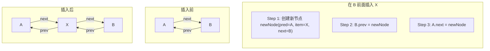

### 3.3 node(int index) — 折半查找优化

这是 LinkedList 的核心优化之一：

```java
Node<E> node(int index) {
    // 如果 index 在前半段，从 first 开始正向遍历
    if (index < (size >> 1)) {
        Node<E> x = first;
        for (int i = 0; i < index; i++)
            x = x.next;
        return x;
    } else {
        // 如果 index 在后半段，从 last 开始反向遍历
        Node<E> x = last;
        for (int i = size - 1; i > index; i--)
            x = x.prev;
        return x;
    }
}
```

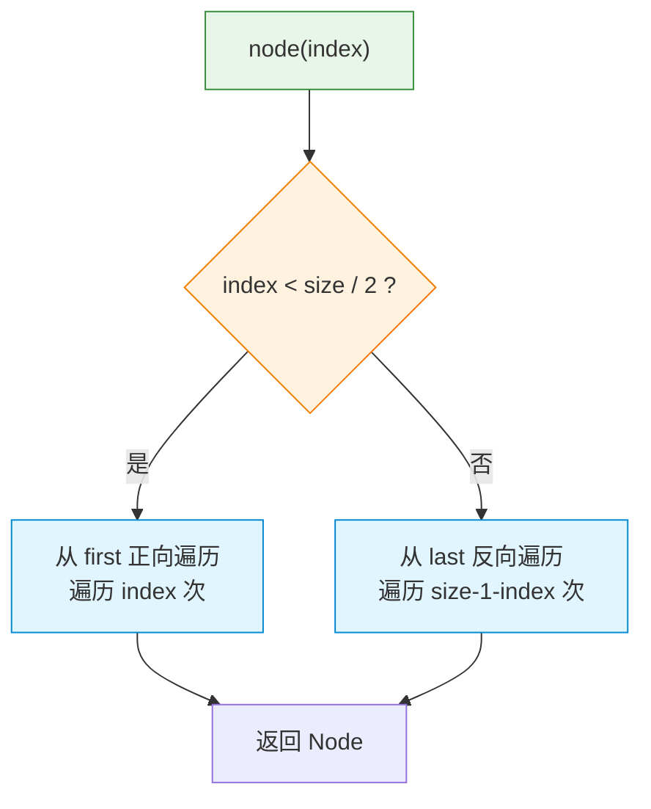

> **复杂度分析**：虽然做了折半优化，`node(index)` 的时间复杂度仍然是 **O(n/2) = O(n)**。这就是 LinkedList 按索引访问效率低下的根本原因。

### 3.4 remove 操作

#### 3.4.1 unlink(Node<E> x) 核心删除方法

```java
E unlink(Node<E> x) {
    final E element = x.item;
    final Node<E> next = x.next;
    final Node<E> prev = x.prev;
    
    // 处理前驱
    if (prev == null) {
        first = next;  // 删除的是头节点
    } else {
        prev.next = next;
        x.prev = null;  // 帮助 GC
    }
    
    // 处理后继
    if (next == null) {
        last = prev;  // 删除的是尾节点
    } else {
        next.prev = prev;
        x.next = null;  // 帮助 GC
    }
    
    x.item = null;  // 帮助 GC
    size--;
    modCount++;
    return element;
}
```

**删除过程示意图**：

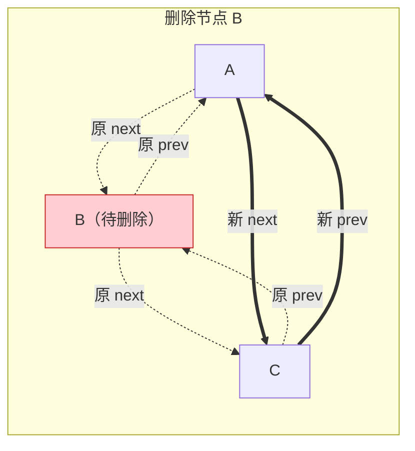

### 3.5 LinkedList 作为 Deque 使用

LinkedList 实现了 `Deque` 接口，可以用作双端队列：

| Deque 方法 | LinkedList 实现 | 说明 |
|-----------|----------------|------|
| `offerFirst(e)` | `addFirst(e)` + return true | 头部插入 |
| `offerLast(e)` | `addLast(e)` + return true | 尾部插入 |
| `pollFirst()` | `unlinkFirst(first)` | 头部取出并删除 |
| `pollLast()` | `unlinkLast(last)` | 尾部取出并删除 |
| `peekFirst()` | return `first.item` | 查看头部元素 |
| `peekLast()` | return `last.item` | 查看尾部元素 |
| `push(e)` | `addFirst(e)` | 栈：入栈 |
| `pop()` | `removeFirst()` | 栈：出栈 |

```java
// 用作队列（FIFO）
Deque<String> queue = new LinkedList<>();
queue.offer("A");     // 尾部入队
queue.offer("B");
String head = queue.poll();  // 头部出队 → "A"

// 用作栈（LIFO）
Deque<String> stack = new LinkedList<>();
stack.push("A");      // 头部入栈
stack.push("B");
String top = stack.pop();    // 头部出栈 → "B"
```

> **注意**：虽然 LinkedList 可以用作 Deque/Stack，但在性能上 **ArrayDeque 优于 LinkedList**（后面会详细分析）。

### 3.6 LinkedList 序列化

```java
private void writeObject(java.io.ObjectOutputStream s)
    throws java.io.IOException {
    s.defaultWriteObject();
    s.writeInt(size);
    
    // 按顺序写入所有元素
    for (Node<E> x = first; x != null; x = x.next)
        s.writeObject(x.item);
}

private void readObject(java.io.ObjectInputStream s)
    throws java.io.IOException, ClassNotFoundException {
    s.defaultReadObject();
    int size = s.readInt();
    
    // 逐个读取并使用 linkLast 重建链表
    for (int i = 0; i < size; i++)
        linkLast((E)s.readObject());
}
```

> **设计思想**：与 ArrayList 类似，LinkedList 也使用 `transient` + 自定义序列化。Node 的 prev/next 引用不需要序列化，反序列化时重建链表即可。

---

## 四、ArrayList vs LinkedList 全面对比

### 4.1 时间复杂度对比

| 操作 | ArrayList | LinkedList | 说明 |
|------|-----------|------------|------|
| `get(index)` | **O(1)** | O(n) | ArrayList 直接数组下标；LinkedList 需要遍历 |
| `set(index, e)` | **O(1)** | O(n) | 同上 |
| `add(e)` 尾部追加 | **O(1)** 均摊 | O(1) | ArrayList 偶尔需要扩容 |
| `add(0, e)` 头部插入 | O(n) | **O(1)** | ArrayList 需要移动所有元素 |
| `add(index, e)` 中间插入 | O(n) | O(n) | ArrayList 移动元素；LinkedList 先遍历再插入 |
| `remove(index)` | O(n) | O(n) | ArrayList 移动元素；LinkedList 先遍历 |
| `remove(0)` 头部删除 | O(n) | **O(1)** | ArrayList 移动所有元素 |
| `contains(o)` | O(n) | O(n) | 都需要遍历 |
| `iterator.next()` | O(1) | O(1) | 迭代器顺序访问都是 O(1) |
| `iterator.remove()` | O(n) | **O(1)** | ArrayList 需要移动元素 |

### 4.2 内存占用对比

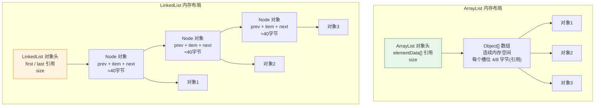

**内存详细对比**（假设 64 位 JVM，开启压缩指针，存储 Integer 对象）：

| 指标 | ArrayList | LinkedList |
|------|-----------|------------|
| 存储 N 个元素的额外内存 | ~4N 字节（引用数组） | ~40N 字节（Node 对象） |
| 每个元素的额外开销 | ~4 字节（一个引用） | ~40 字节（Node 对象头16B + 3个引用12B + 对齐填充） |
| 内存碎片 | 数组连续，碎片少 | Node 分散在堆中，碎片多 |
| 预分配浪费 | 可能有未使用的数组空间 | 无 |

> **结论**：LinkedList 的内存开销约为 ArrayList 的 **10 倍**！

### 4.3 CPU 缓存友好性

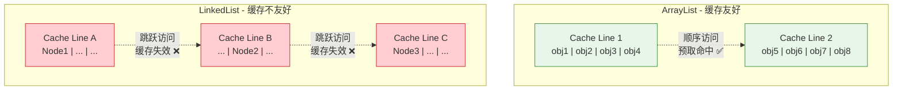

**CPU 缓存分析**：
- **ArrayList**：底层数组元素在内存中连续存放。CPU 加载一个缓存行（通常 64 字节）就能命中多个元素，空间局部性极好
- **LinkedList**：每个 Node 对象在堆中随机分布。遍历时几乎每次访问都可能导致缓存未命中（Cache Miss），性能大幅下降

### 4.4 实际性能测试结论

在实际测试中（JMH 基准测试）：

| 场景 | 胜者 | 备注 |
|------|------|------|
| 顺序遍历 | **ArrayList** | 缓存友好性碾压 |
| 随机访问 | **ArrayList** | O(1) vs O(n) |
| 尾部追加 | **ArrayList** | 均摊 O(1)，缓存友好 |
| 头部插入 | **LinkedList** | O(1) vs O(n)，但数据量小时 ArrayList 更快 |
| 中间插入（已知位置） | **ArrayList** | System.arraycopy 是 native 方法，极快 |
| 迭代器删除 | **LinkedList** | O(1) vs O(n) |
| 内存占用 | **ArrayList** | 内存开销约为 1/10 |

> **重要结论**：在绝大多数场景下，**ArrayList 优于 LinkedList**。只有在频繁进行头部插入/删除或使用迭代器批量删除时，LinkedList 才有优势。Effective Java 和许多性能专家都推荐默认使用 ArrayList。

### 4.5 选择建议

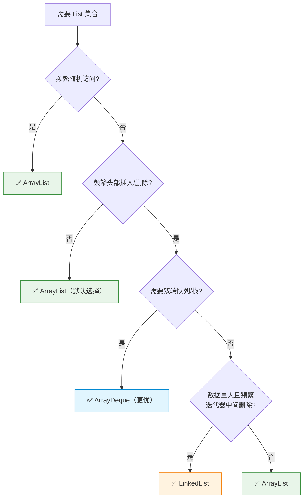

---

## 五、HashSet 源码分析

### 5.1 HashSet 的本质：HashMap 的包装

```java
public class HashSet<E>
    extends AbstractSet<E>
    implements Set<E>, Cloneable, java.io.Serializable {
    
    // 底层使用 HashMap 存储
    private transient HashMap<E,Object> map;
    
    // 所有 value 共用的虚拟对象
    private static final Object PRESENT = new Object();
    
    // 构造方法：创建一个新的 HashMap
    public HashSet() {
        map = new HashMap<>();
    }
    
    public HashSet(Collection<? extends E> c) {
        map = new HashMap<>(Math.max((int) (c.size()/.75f) + 1, 16));
        addAll(c);
    }
    
    public HashSet(int initialCapacity, float loadFactor) {
        map = new HashMap<>(initialCapacity, loadFactor);
    }
    
    public HashSet(int initialCapacity) {
        map = new HashMap<>(initialCapacity);
    }
    
    // 包级私有构造方法，给 LinkedHashSet 使用
    HashSet(int initialCapacity, float loadFactor, boolean dummy) {
        map = new LinkedHashMap<>(initialCapacity, loadFactor);
    }
}
```

### 5.2 核心方法实现

```java
public boolean add(E e) {
    // key = e, value = PRESENT（固定的虚拟对象）
    return map.put(e, PRESENT) == null;
}

public boolean remove(Object o) {
    return map.remove(o) == PRESENT;
}

public boolean contains(Object o) {
    return map.containsKey(o);
}

public int size() {
    return map.size();
}

public boolean isEmpty() {
    return map.isEmpty();
}

public void clear() {
    map.clear();
}

public Iterator<E> iterator() {
    return map.keySet().iterator();
}
```

**HashSet 原理示意图**：

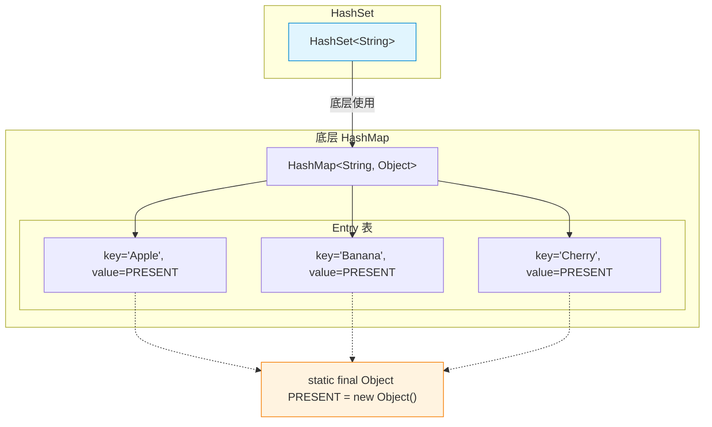

### 5.3 为什么 value 使用 PRESENT 而不是 null？

`HashMap.put(key, value)` 返回旧的 value：
- 如果 value = null，`put` 返回 null 无法区分是"key 不存在"还是"key 存在且 value 为 null"
- 使用一个非 null 的 `PRESENT` 对象，`put` 返回 null 表示 key 不存在（添加成功），返回 `PRESENT` 表示 key 已存在（添加失败）

### 5.4 HashSet 的性能特性

| 操作 | 时间复杂度 | 说明 |
|------|-----------|------|
| `add(e)` | O(1) 均摊 | 依赖 HashMap.put |
| `remove(o)` | O(1) 均摊 | 依赖 HashMap.remove |
| `contains(o)` | O(1) 均摊 | 依赖 HashMap.containsKey |
| `size()` | O(1) | |
| 遍历 | O(n + capacity) | 需要遍历 HashMap 的所有桶 |

> **使用 HashSet 的前提**：元素必须正确实现 `hashCode()` 和 `equals()` 方法。

---

## 六、LinkedHashSet / LinkedHashMap 源码分析

### 6.1 LinkedHashMap 概述

`LinkedHashMap` 继承自 `HashMap`，在 HashMap 的基础上额外维护了一个**双向链表**，用于保持元素的**插入顺序**或**访问顺序**。

```java
public class LinkedHashMap<K,V>
    extends HashMap<K,V>
    implements Map<K,V> {
    
    // 双向链表的头节点（最老的元素）
    transient LinkedHashMap.Entry<K,V> head;
    
    // 双向链表的尾节点（最新的元素）
    transient LinkedHashMap.Entry<K,V> tail;
    
    // true = 按访问顺序；false = 按插入顺序（默认）
    final boolean accessOrder;
}
```

### 6.2 Entry 节点结构

```java
// LinkedHashMap.Entry 继承自 HashMap.Node
static class Entry<K,V> extends HashMap.Node<K,V> {
    Entry<K,V> before, after;  // 双向链表的前驱和后继
    
    Entry(int hash, K key, V value, Node<K,V> next) {
        super(hash, key, value, next);
    }
}
```

**数据结构示意图**：

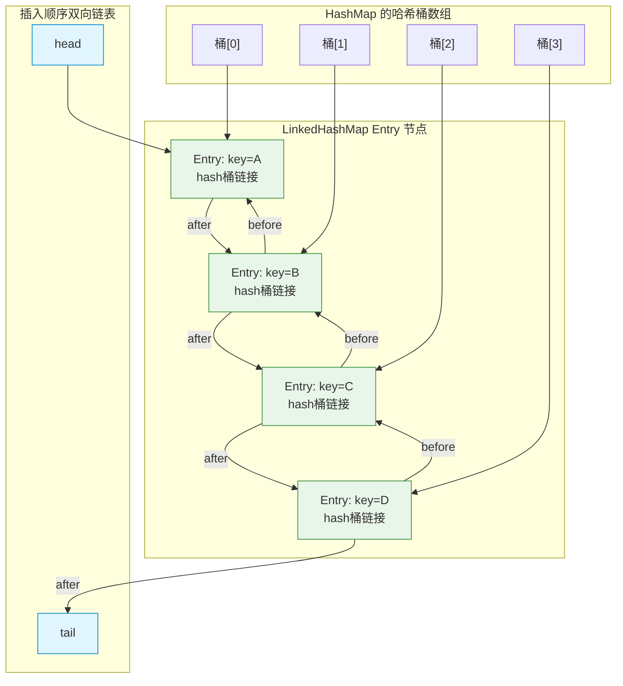

### 6.3 维护链表顺序的钩子方法

LinkedHashMap 通过 HashMap 预留的钩子方法（hook methods）来维护双向链表：

```java
// HashMap 中的钩子方法（空实现，留给子类覆写）
void afterNodeAccess(Node<K,V> p) { }
void afterNodeInsertion(boolean evict) { }
void afterNodeRemoval(Node<K,V> p) { }
```

#### 6.3.1 newNode — 新节点加入链表尾部

```java
// 覆写 HashMap 的 newNode 方法
Node<K,V> newNode(int hash, K key, V value, Node<K,V> e) {
    LinkedHashMap.Entry<K,V> p =
        new LinkedHashMap.Entry<K,V>(hash, key, value, e);
    linkNodeLast(p);  // 将新节点加到双向链表尾部
    return p;
}

private void linkNodeLast(LinkedHashMap.Entry<K,V> p) {
    LinkedHashMap.Entry<K,V> last = tail;
    tail = p;
    if (last == null)
        head = p;
    else {
        p.before = last;
        last.after = p;
    }
}
```

#### 6.3.2 afterNodeAccess — 访问后移到尾部

```java
// 当 accessOrder=true 时，每次访问（get/put 已有 key）都把节点移到链表尾部
void afterNodeAccess(Node<K,V> e) {
    LinkedHashMap.Entry<K,V> last;
    if (accessOrder && (last = tail) != e) {
        LinkedHashMap.Entry<K,V> p =
            (LinkedHashMap.Entry<K,V>)e, b = p.before, a = p.after;
        p.after = null;
        
        // 从原位置摘除
        if (b == null)
            head = a;
        else
            b.after = a;
        if (a != null)
            a.before = b;
        else
            last = b;
        
        // 挂到尾部
        if (last == null)
            head = p;
        else {
            p.before = last;
            last.after = p;
        }
        tail = p;
        ++modCount;
    }
}
```

#### 6.3.3 afterNodeInsertion — 插入后可能删除最老的元素

```java
void afterNodeInsertion(boolean evict) {
    LinkedHashMap.Entry<K,V> first;
    // 如果 removeEldestEntry 返回 true，删除链表头节点（最老的元素）
    if (evict && (first = head) != null && removeEldestEntry(first)) {
        K key = first.key;
        removeNode(hash(key), key, null, false, true);
    }
}

// 默认返回 false，子类覆写此方法可实现 LRU 缓存
protected boolean removeEldestEntry(Map.Entry<K,V> eldest) {
    return false;
}
```

#### 6.3.4 afterNodeRemoval — 从链表中删除节点

```java
void afterNodeRemoval(Node<K,V> e) {
    LinkedHashMap.Entry<K,V> p =
        (LinkedHashMap.Entry<K,V>)e, b = p.before, a = p.after;
    p.before = p.after = null;
    if (b == null)
        head = a;
    else
        b.after = a;
    if (a == null)
        tail = b;
    else
        a.before = b;
}
```

### 6.4 accessOrder 参数详解

```java
// 构造方法，accessOrder 默认为 false
public LinkedHashMap(int initialCapacity, float loadFactor, boolean accessOrder) {
    super(initialCapacity, loadFactor);
    this.accessOrder = accessOrder;
}
```

**插入顺序（accessOrder = false，默认）**：
```java
LinkedHashMap<String, Integer> map = new LinkedHashMap<>();
map.put("A", 1);
map.put("B", 2);
map.put("C", 3);
map.get("A");  // 访问 A，不影响顺序
// 遍历顺序：A → B → C（按插入顺序）
```

**访问顺序（accessOrder = true）**：
```java
LinkedHashMap<String, Integer> map = new LinkedHashMap<>(16, 0.75f, true);
map.put("A", 1);
map.put("B", 2);
map.put("C", 3);
map.get("A");  // 访问 A，移到尾部
// 遍历顺序：B → C → A（A 被访问过，移到尾部）
```

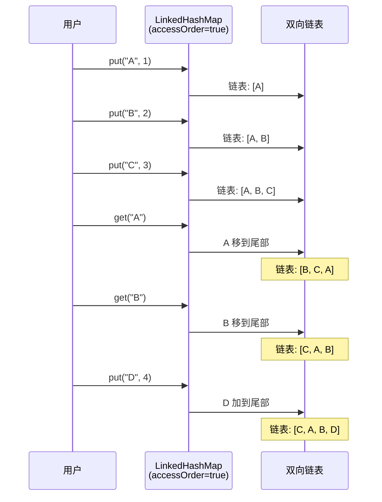

### 6.5 实现 LRU 缓存

基于 LinkedHashMap 实现 LRU（Least Recently Used，最近最少使用）缓存：

```java
public class LRUCache<K, V> extends LinkedHashMap<K, V> {
    private final int capacity;
    
    public LRUCache(int capacity) {
        // accessOrder=true 开启访问顺序
        super(capacity, 0.75f, true);
        this.capacity = capacity;
    }
    
    @Override
    protected boolean removeEldestEntry(Map.Entry<K, V> eldest) {
        // 当元素个数超过容量时，删除最老的元素（链表头部）
        return size() > capacity;
    }
}
```

**LRU 缓存工作流程**：

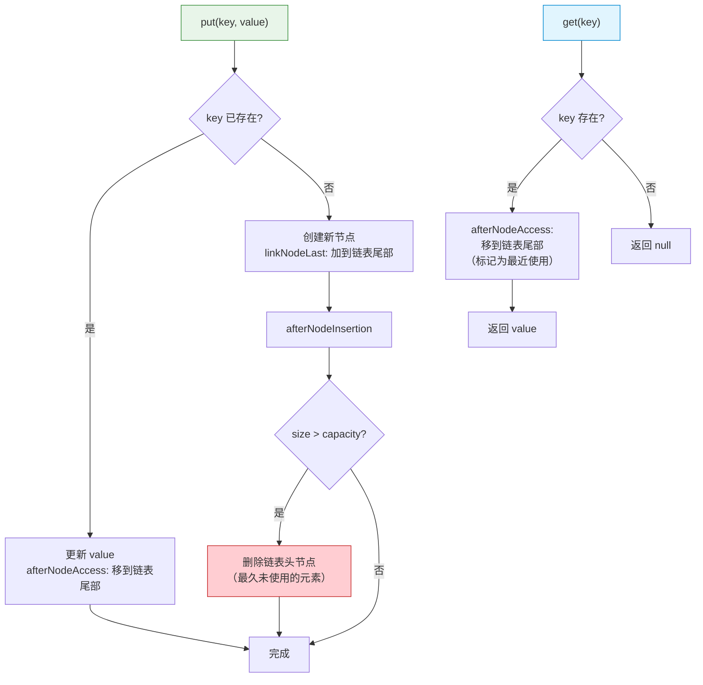

**LRU 缓存示例**：

```java
LRUCache<String, Integer> cache = new LRUCache<>(3);

cache.put("A", 1);  // 链表: [A]
cache.put("B", 2);  // 链表: [A, B]
cache.put("C", 3);  // 链表: [A, B, C]

cache.get("A");      // 访问 A，移到尾部 → 链表: [B, C, A]

cache.put("D", 4);   // 容量满，删除链表头 B → 链表: [C, A, D]

System.out.println(cache.get("B"));  // null（已被淘汰）
System.out.println(cache.get("C"));  // 3（还在缓存中）
```

### 6.6 LinkedHashSet

LinkedHashSet 是 LinkedHashMap 的简单包装：

```java
public class LinkedHashSet<E>
    extends HashSet<E>
    implements Set<E>, Cloneable, java.io.Serializable {
    
    public LinkedHashSet(int initialCapacity, float loadFactor) {
        // 调用 HashSet 的包级私有构造方法，创建 LinkedHashMap
        super(initialCapacity, loadFactor, true);
    }
    
    public LinkedHashSet(int initialCapacity) {
        super(initialCapacity, .75f, true);
    }
    
    public LinkedHashSet() {
        super(16, .75f, true);
    }
    
    public LinkedHashSet(Collection<? extends E> c) {
        super(Math.max(2*c.size(), 11), .75f, true);
        addAll(c);
    }
}
```

回顾 HashSet 中的那个特殊构造方法：

```java
// HashSet 中专门给 LinkedHashSet 用的构造方法
HashSet(int initialCapacity, float loadFactor, boolean dummy) {
    map = new LinkedHashMap<>(initialCapacity, loadFactor);
}
```

> **LinkedHashSet 特点**：在 HashSet 的 O(1) 查找基础上，额外维护了插入顺序。遍历时按插入顺序返回，性能略低于 HashSet（需要维护链表）。

---

## 七、TreeMap / TreeSet 源码分析

### 7.1 TreeMap 概述

```java
public class TreeMap<K,V>
    extends AbstractMap<K,V>
    implements NavigableMap<K,V>, Cloneable, java.io.Serializable {
    
    // 比较器（null 表示使用 key 的自然顺序）
    private final Comparator<? super K> comparator;
    
    // 红黑树的根节点
    private transient Entry<K,V> root;
    
    // 元素个数
    private transient int size = 0;
    
    // 结构修改计数器
    private transient int modCount = 0;
}
```

### 7.2 红黑树节点结构

```java
static final class Entry<K,V> implements Map.Entry<K,V> {
    K key;
    V value;
    Entry<K,V> left;    // 左子节点
    Entry<K,V> right;   // 右子节点
    Entry<K,V> parent;  // 父节点
    boolean color = BLACK;  // 节点颜色，默认黑色
    
    Entry(K key, V value, Entry<K,V> parent) {
        this.key = key;
        this.value = value;
        this.parent = parent;
    }
}
```

### 7.3 红黑树基本性质

红黑树是一种**自平衡二叉搜索树**，满足以下 5 条性质：

1. **每个节点要么是红色，要么是黑色**
2. **根节点是黑色**
3. **每个叶子节点（NIL）是黑色**
4. **红色节点的两个子节点都是黑色**（不能有两个连续的红色节点）
5. **从任一节点到其所有后代叶子节点的路径上，黑色节点个数相同**（黑高相同）

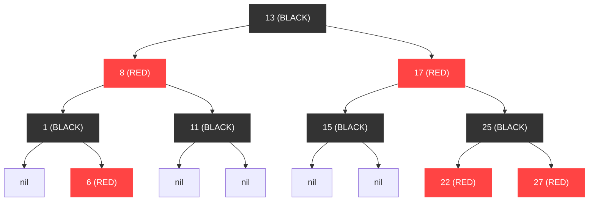

> **红黑树的优势**：通过这些约束，确保最长路径不超过最短路径的 2 倍，从而保证所有操作的时间复杂度为 **O(log n)**。

### 7.4 put() 方法源码

```java
public V put(K key, V value) {
    Entry<K,V> t = root;
    
    // 情况1：空树，直接设置根节点
    if (t == null) {
        compare(key, key); // type (and possibly null) check
        root = new Entry<>(key, value, null);
        size = 1;
        modCount++;
        return null;
    }
    
    int cmp;
    Entry<K,V> parent;
    Comparator<? super K> cpr = comparator;
    
    // 情况2：使用自定义 Comparator
    if (cpr != null) {
        do {
            parent = t;
            cmp = cpr.compare(key, t.key);
            if (cmp < 0)
                t = t.left;
            else if (cmp > 0)
                t = t.right;
            else
                return t.setValue(value);  // key 已存在，更新 value
        } while (t != null);
    }
    // 情况3：使用 key 的自然顺序（Comparable）
    else {
        if (key == null)
            throw new NullPointerException();
        @SuppressWarnings("unchecked")
        Comparable<? super K> k = (Comparable<? super K>) key;
        do {
            parent = t;
            cmp = k.compareTo(t.key);
            if (cmp < 0)
                t = t.left;
            else if (cmp > 0)
                t = t.right;
            else
                return t.setValue(value);  // key 已存在，更新 value
        } while (t != null);
    }
    
    // 创建新节点
    Entry<K,V> e = new Entry<>(key, value, parent);
    if (cmp < 0)
        parent.left = e;
    else
        parent.right = e;
    
    // 插入后修复红黑树性质
    fixAfterInsertion(e);
    size++;
    modCount++;
    return null;
}
```

**put 操作流程**：

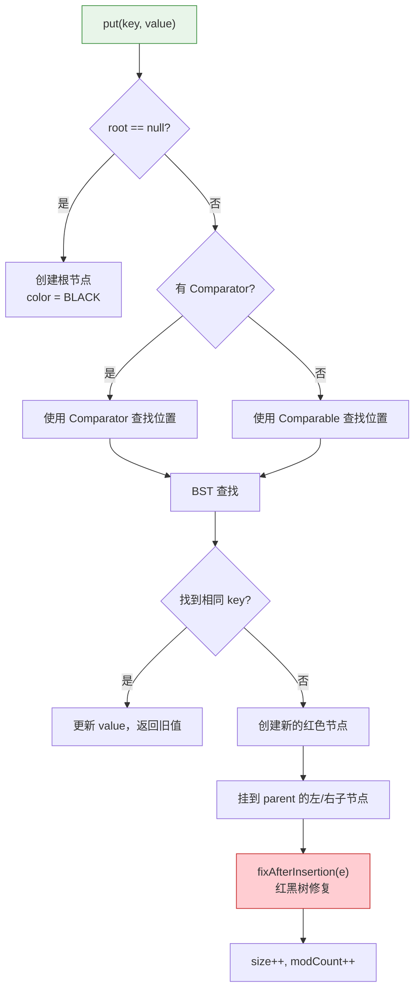

### 7.5 fixAfterInsertion — 插入后修复

```java
private void fixAfterInsertion(Entry<K,V> x) {
    x.color = RED;  // 新插入的节点设为红色
    
    // 当 x 不是根节点 且 x 的父节点是红色时，需要修复
    while (x != null && x != root && x.parent.color == RED) {
        if (parentOf(x) == leftOf(parentOf(parentOf(x)))) {
            // 父节点是祖父节点的左子节点
            Entry<K,V> y = rightOf(parentOf(parentOf(x)));  // 叔叔节点
            
            if (colorOf(y) == RED) {
                // Case 1：叔叔节点是红色 → 变色
                setColor(parentOf(x), BLACK);
                setColor(y, BLACK);
                setColor(parentOf(parentOf(x)), RED);
                x = parentOf(parentOf(x));  // 向上传播
            } else {
                if (x == rightOf(parentOf(x))) {
                    // Case 2：叔叔是黑色，x 是右子节点 → 左旋转为 Case 3
                    x = parentOf(x);
                    rotateLeft(x);
                }
                // Case 3：叔叔是黑色，x 是左子节点 → 变色 + 右旋
                setColor(parentOf(x), BLACK);
                setColor(parentOf(parentOf(x)), RED);
                rotateRight(parentOf(parentOf(x)));
            }
        } else {
            // 镜像情况：父节点是祖父节点的右子节点
            Entry<K,V> y = leftOf(parentOf(parentOf(x)));
            
            if (colorOf(y) == RED) {
                setColor(parentOf(x), BLACK);
                setColor(y, BLACK);
                setColor(parentOf(parentOf(x)), RED);
                x = parentOf(parentOf(x));
            } else {
                if (x == leftOf(parentOf(x))) {
                    x = parentOf(x);
                    rotateRight(x);
                }
                setColor(parentOf(x), BLACK);
                setColor(parentOf(parentOf(x)), RED);
                rotateLeft(parentOf(parentOf(x)));
            }
        }
    }
    root.color = BLACK;  // 确保根节点为黑色
}
```

**旋转操作示意图**：

```mermaid
graph TB
    subgraph "左旋 rotateLeft(x)"
        direction TB
        X1["x"] --> A1["A"]
        X1 --> Y1["y"]
        Y1 --> B1["B"]
        Y1 --> C1["C"]
    end
    
    subgraph "左旋结果"
        direction TB
        Y2["y"] --> X2["x"]
        Y2 --> C2["C"]
        X2 --> A2["A"]
        X2 --> B2["B"]
    end
```

```mermaid
graph TB
    subgraph "右旋 rotateRight(y)"
        direction TB
        Y3["y"] --> X3["x"]
        Y3 --> C3["C"]
        X3 --> A3["A"]
        X3 --> B3["B"]
    end
    
    subgraph "右旋结果"
        direction TB
        X4["x"] --> A4["A"]
        X4 --> Y4["y"]
        Y4 --> B4["B"]
        Y4 --> C4["C"]
    end
```

### 7.6 Comparable vs Comparator

| 特性 | Comparable | Comparator |
|------|-----------|------------|
| 包 | `java.lang` | `java.util` |
| 方法 | `compareTo(T o)` | `compare(T o1, T o2)` |
| 实现位置 | 在元素类内部实现 | 独立于元素类 |
| 排序方式 | 自然排序（唯一） | 可以有多种排序策略 |
| 修改元素类 | 需要修改 | 不需要 |

```java
// 使用 Comparable（自然排序）
TreeMap<String, Integer> map1 = new TreeMap<>();
// String 实现了 Comparable，按字典序排列

// 使用 Comparator（自定义排序）
TreeMap<String, Integer> map2 = new TreeMap<>(
    (a, b) -> b.compareTo(a)  // 逆序
);

// 使用 Comparator.comparing（JDK 8+）
TreeMap<String, Integer> map3 = new TreeMap<>(
    Comparator.comparingInt(String::length)  // 按字符串长度排序
        .thenComparing(Comparator.naturalOrder())  // 长度相同按字典序
);
```

### 7.7 NavigableMap 接口

TreeMap 实现了 `NavigableMap` 接口，提供了丰富的导航方法：

```java
TreeMap<Integer, String> map = new TreeMap<>();
map.put(1, "A"); map.put(3, "C"); map.put(5, "E"); map.put(7, "G"); map.put(9, "I");

// 查找最近的 key
map.lowerKey(5);    // 3  — 严格小于 5 的最大 key
map.floorKey(5);    // 5  — 小于等于 5 的最大 key
map.ceilingKey(6);  // 7  — 大于等于 6 的最小 key
map.higherKey(5);   // 7  — 严格大于 5 的最小 key

// 子映射视图
map.headMap(5);           // {1=A, 3=C}         — key < 5
map.headMap(5, true);     // {1=A, 3=C, 5=E}    — key <= 5
map.tailMap(5);           // {5=E, 7=G, 9=I}    — key >= 5
map.subMap(3, 7);         // {3=C, 5=E}         — 3 <= key < 7
map.subMap(3, true, 7, true);  // {3=C, 5=E, 7=G}  — 3 <= key <= 7

// 获取首尾
map.firstKey();     // 1
map.lastKey();      // 9
map.pollFirstEntry();  // 1=A（取出并删除）
map.pollLastEntry();   // 9=I（取出并删除）

// 逆序视图
NavigableMap<Integer, String> desc = map.descendingMap();
// {7=G, 5=E, 3=C}
```

### 7.8 TreeSet

TreeSet 基于 TreeMap 实现，与 HashSet 基于 HashMap 的思路完全一致：

```java
public class TreeSet<E> extends AbstractSet<E>
    implements NavigableSet<E>, Cloneable, java.io.Serializable {
    
    private transient NavigableMap<E,Object> m;
    private static final Object PRESENT = new Object();
    
    // 实际使用的构造方法
    TreeSet(NavigableMap<E,Object> m) {
        this.m = m;
    }
    
    public TreeSet() {
        this(new TreeMap<E,Object>());
    }
    
    public TreeSet(Comparator<? super E> comparator) {
        this(new TreeMap<>(comparator));
    }
    
    public boolean add(E e) {
        return m.put(e, PRESENT) == null;
    }
    
    public boolean remove(Object o) {
        return m.remove(o) == PRESENT;
    }
    
    public boolean contains(Object o) {
        return m.containsKey(o);
    }
}
```

### 7.9 TreeMap 性能特性

| 操作 | 时间复杂度 | 说明 |
|------|-----------|------|
| `put(key, value)` | O(log n) | 红黑树查找 + 可能的旋转修复 |
| `get(key)` | O(log n) | 红黑树查找 |
| `remove(key)` | O(log n) | 红黑树删除 + 可能的旋转修复 |
| `containsKey(key)` | O(log n) | 红黑树查找 |
| `firstKey() / lastKey()` | O(log n) | 沿最左/最右路径查找 |
| `lowerKey() / higherKey()` | O(log n) | |

> **TreeMap vs HashMap**：TreeMap 的操作都是 O(log n)，而 HashMap 是 O(1) 均摊。选择 TreeMap 是因为需要**有序**功能（排序、范围查找等），而不是为了性能。

---

## 八、PriorityQueue 源码分析

### 8.1 PriorityQueue 概述

`PriorityQueue` 是一个基于**二叉堆**（最小堆）实现的优先队列。

```java
public class PriorityQueue<E> extends AbstractQueue<E>
    implements java.io.Serializable {
    
    private static final int DEFAULT_INITIAL_CAPACITY = 11;
    
    // 底层存储数组（二叉堆）
    transient Object[] queue;
    
    // 元素个数
    private int size = 0;
    
    // 比较器
    private final Comparator<? super E> comparator;
    
    // 结构修改计数器
    transient int modCount = 0;
}
```

### 8.2 二叉堆的数组表示

```mermaid
graph TB
    subgraph "最小堆（完全二叉树）"
        N0["1<br/>[0]"] --> N1["3<br/>[1]"]
        N0 --> N2["2<br/>[2]"]
        N1 --> N3["7<br/>[3]"]
        N1 --> N4["5<br/>[4]"]
        N2 --> N5["4<br/>[5]"]
        N2 --> N6["8<br/>[6]"]
    end
    
    subgraph "数组存储"
        A["queue: | 1 | 3 | 2 | 7 | 5 | 4 | 8 |"]
        I["index:  | 0 | 1 | 2 | 3 | 4 | 5 | 6 |"]
    end
    
    style N0 fill:#e8f5e9,stroke:#388e3c
    style N1 fill:#e1f5fe,stroke:#0288d1
    style N2 fill:#e1f5fe,stroke:#0288d1
```

**父子节点索引关系**：

| 关系 | 公式 |
|------|------|
| 父节点索引 | `(i - 1) / 2` 或 `(i - 1) >>> 1` |
| 左子节点索引 | `2 * i + 1` |
| 右子节点索引 | `2 * i + 2` |

### 8.3 offer() — 添加元素（上浮操作）

```java
public boolean offer(E e) {
    if (e == null)
        throw new NullPointerException();
    modCount++;
    int i = size;
    if (i >= queue.length)
        grow(i + 1);  // 扩容
    size = i + 1;
    if (i == 0)
        queue[0] = e;  // 空堆，直接放到根
    else
        siftUp(i, e);  // 上浮操作
    return true;
}

// 上浮操作（使用 Comparator）
private void siftUpUsingComparator(int k, E x) {
    while (k > 0) {
        int parent = (k - 1) >>> 1;  // 父节点索引
        Object e = queue[parent];
        if (comparator.compare(x, (E) e) >= 0)
            break;  // 如果新元素 >= 父节点，停止上浮
        queue[k] = e;  // 父节点下移
        k = parent;    // 继续向上比较
    }
    queue[k] = x;  // 放入最终位置
}

// 上浮操作（使用 Comparable）
private void siftUpComparable(int k, E x) {
    Comparable<? super E> key = (Comparable<? super E>) x;
    while (k > 0) {
        int parent = (k - 1) >>> 1;
        Object e = queue[parent];
        if (key.compareTo((E) e) >= 0)
            break;
        queue[k] = e;
        k = parent;
    }
    queue[k] = key;
}
```

**上浮过程示意图（添加元素 0）**：

```mermaid
graph TB
    subgraph "Step 1: 放入末尾 [7]"
        S1_0["1<br/>[0]"] --> S1_1["3<br/>[1]"]
        S1_0 --> S1_2["2<br/>[2]"]
        S1_1 --> S1_3["7<br/>[3]"]
        S1_1 --> S1_4["5<br/>[4]"]
        S1_2 --> S1_5["4<br/>[5]"]
        S1_2 --> S1_6["8<br/>[6]"]
        S1_1 -.-> S1_7["0<br/>[7] 新元素"]
        style S1_7 fill:#ffcdd2,stroke:#c62828
    end
    
    subgraph "Step 2: 与父节点 3 比较，上浮"
        S2_0["1<br/>[0]"] --> S2_1["0<br/>[1]"]
        S2_0 --> S2_2["2<br/>[2]"]
        S2_1 --> S2_3["3<br/>[3]"]
        S2_1 --> S2_4["5<br/>[4]"]
        S2_2 --> S2_5["4<br/>[5]"]
        S2_2 --> S2_6["8<br/>[6]"]
        style S2_1 fill:#ffcdd2,stroke:#c62828
    end
    
    subgraph "Step 3: 与父节点 1 比较，继续上浮"
        S3_0["0<br/>[0]"] --> S3_1["1<br/>[1]"]
        S3_0 --> S3_2["2<br/>[2]"]
        S3_1 --> S3_3["3<br/>[3]"]
        S3_1 --> S3_4["5<br/>[4]"]
        S3_2 --> S3_5["4<br/>[5]"]
        S3_2 --> S3_6["8<br/>[6]"]
        style S3_0 fill:#e8f5e9,stroke:#388e3c
    end
```

### 8.4 poll() — 取出堆顶元素（下沉操作）

```java
public E poll() {
    if (size == 0)
        return null;
    int s = --size;
    modCount++;
    E result = (E) queue[0];       // 取出堆顶（最小值）
    E x = (E) queue[s];            // 取出最后一个元素
    queue[s] = null;               // 帮助 GC
    if (s != 0)
        siftDown(0, x);            // 将最后一个元素放到堆顶，下沉调整
    return result;
}

// 下沉操作（使用 Comparator）
private void siftDownUsingComparator(int k, E x) {
    int half = size >>> 1;  // 最后一个非叶子节点的下一个位置
    while (k < half) {
        int child = (k << 1) + 1;  // 左子节点索引
        Object c = queue[child];
        int right = child + 1;
        
        // 找左右子节点中较小的那个
        if (right < size && comparator.compare((E) c, (E) queue[right]) > 0)
            c = queue[child = right];
        
        // 如果当前元素 <= 较小的子节点，停止下沉
        if (comparator.compare(x, (E) c) <= 0)
            break;
        
        queue[k] = c;      // 较小的子节点上移
        k = child;          // 继续向下比较
    }
    queue[k] = x;  // 放入最终位置
}
```

**下沉过程示意图（取出堆顶 1）**：

```mermaid
flowchart TD
    A["poll(): 取出堆顶 1"] --> B["将末尾元素 8 放到堆顶"]
    B --> C["比较 8 与子节点 min(3,2)=2"]
    C --> D["8 > 2, 交换"]
    D --> E["比较 8 与子节点 min(4,_)=4"]
    E --> F["8 > 4, 交换"]
    F --> G["8 已经是叶子节点，停止"]
    
    style A fill:#e8f5e9,stroke:#388e3c
    style G fill:#e1f5fe,stroke:#0288d1
```

### 8.5 peek() — 查看堆顶

```java
public E peek() {
    return (size == 0) ? null : (E) queue[0];
}
```

> **O(1) 操作**：堆顶元素就是数组第一个元素。

### 8.6 扩容机制

```java
private void grow(int minCapacity) {
    int oldCapacity = queue.length;
    // 容量 < 64 时翻倍 + 2，否则增长 50%
    int newCapacity = oldCapacity + ((oldCapacity < 64) ?
                                     (oldCapacity + 2) :
                                     (oldCapacity >> 1));
    if (newCapacity - MAX_ARRAY_SIZE > 0)
        newCapacity = hugeCapacity(minCapacity);
    queue = Arrays.copyOf(queue, newCapacity);
}
```

### 8.7 PriorityQueue 使用示例

```java
// 最小堆（默认）
PriorityQueue<Integer> minHeap = new PriorityQueue<>();
minHeap.offer(5); minHeap.offer(3); minHeap.offer(7); minHeap.offer(1);
minHeap.poll();  // 1（最小值）
minHeap.poll();  // 3

// 最大堆
PriorityQueue<Integer> maxHeap = new PriorityQueue<>(Comparator.reverseOrder());
maxHeap.offer(5); maxHeap.offer(3); maxHeap.offer(7); maxHeap.offer(1);
maxHeap.poll();  // 7（最大值）
maxHeap.poll();  // 5

// 自定义排序（按字符串长度）
PriorityQueue<String> pq = new PriorityQueue<>(
    Comparator.comparingInt(String::length)
);
```

### 8.8 PriorityQueue 性能

| 操作 | 时间复杂度 | 说明 |
|------|-----------|------|
| `offer(e)` | O(log n) | 上浮操作 |
| `poll()` | O(log n) | 下沉操作 |
| `peek()` | O(1) | 直接返回数组[0] |
| `remove(o)` | O(n) | 需要先线性查找 |
| `contains(o)` | O(n) | 线性查找 |

> **注意**：PriorityQueue 不是线程安全的。多线程环境下使用 `PriorityBlockingQueue`。

---

## 九、ArrayDeque 源码分析

### 9.1 ArrayDeque 概述

`ArrayDeque` 是基于**循环数组**实现的双端队列，比 LinkedList 作为 Deque 时性能更好。

```java
public class ArrayDeque<E> extends AbstractCollection<E>
                           implements Deque<E>, Cloneable, Serializable {
    
    // 底层存储数组
    transient Object[] elements;
    
    // 头指针（指向第一个元素）
    transient int head;
    
    // 尾指针（指向最后一个元素的下一个位置）
    transient int tail;
    
    // 最小初始容量，必须是 2 的幂
    private static final int MIN_INITIAL_CAPACITY = 8;
}
```

### 9.2 循环数组原理

```mermaid
graph TB
    subgraph "循环数组示意图"
        direction TB
        A["数组容量 = 8"]
        
        subgraph "物理数组"
            E0["[0] D"]
            E1["[1] E"]
            E2["[2] _"]
            E3["[3] _"]
            E4["[4] _"]
            E5["[5] A"]
            E6["[6] B"]
            E7["[7] C"]
        end
        
        H["head = 5"]
        T["tail = 2"]
    end
    
    subgraph "逻辑顺序"
        L["A → B → C → D → E"]
    end
    
    H -.->|指向| E5
    T -.->|指向| E2
    
    style E5 fill:#e8f5e9,stroke:#388e3c
    style E6 fill:#e8f5e9,stroke:#388e3c
    style E7 fill:#e8f5e9,stroke:#388e3c
    style E0 fill:#e8f5e9,stroke:#388e3c
    style E1 fill:#e8f5e9,stroke:#388e3c
    style E2 fill:#fff3e0,stroke:#f57c00
    style E3 fill:#fff3e0,stroke:#f57c00
    style E4 fill:#fff3e0,stroke:#f57c00
```

**循环数组的关键**：通过位运算 `(index) & (elements.length - 1)` 实现循环取模（数组长度必须是 2 的幂）。

### 9.3 构造方法

```java
public ArrayDeque() {
    elements = new Object[16];  // 默认容量 16
}

public ArrayDeque(int numElements) {
    allocateElements(numElements);
}

// 确保容量是 2 的幂
private void allocateElements(int numElements) {
    int initialCapacity = MIN_INITIAL_CAPACITY;  // 8
    // 找到大于 numElements 的最小 2 的幂
    if (numElements >= initialCapacity) {
        initialCapacity = numElements;
        initialCapacity |= (initialCapacity >>>  1);
        initialCapacity |= (initialCapacity >>>  2);
        initialCapacity |= (initialCapacity >>>  4);
        initialCapacity |= (initialCapacity >>>  8);
        initialCapacity |= (initialCapacity >>> 16);
        initialCapacity++;
        if (initialCapacity < 0)  // overflow
            initialCapacity >>>= 1;
    }
    elements = new Object[initialCapacity];
}
```

> **为什么必须是 2 的幂**？为了用位运算 `& (length - 1)` 代替取模运算 `% length`，性能更好。这与 HashMap 的设计思路一致。

### 9.4 addFirst / addLast（头/尾插入）

```java
public void addFirst(E e) {
    if (e == null)
        throw new NullPointerException();
    // head 前移一位（循环）
    elements[head = (head - 1) & (elements.length - 1)] = e;
    if (head == tail)  // 满了就扩容
        doubleCapacity();
}

public void addLast(E e) {
    if (e == null)
        throw new NullPointerException();
    elements[tail] = e;
    // tail 后移一位（循环）
    if ((tail = (tail + 1) & (elements.length - 1)) == head)
        doubleCapacity();  // 满了就扩容
}
```

**头部插入过程**：

```mermaid
flowchart LR
    subgraph "addFirst(X) 前"
        A1["[0]_"] --- A2["[1]_"] --- A3["[2]A"] --- A4["[3]B"] --- A5["[4]C"] --- A6["[5]_"] --- A7["[6]_"] --- A8["[7]_"]
        H1["head=2"]
        T1["tail=5"]
    end
    
    subgraph "addFirst(X) 后"
        B1["[0]_"] --- B2["[1]X"] --- B3["[2]A"] --- B4["[3]B"] --- B5["[4]C"] --- B6["[5]_"] --- B7["[6]_"] --- B8["[7]_"]
        H2["head=1"]
        T2["tail=5"]
    end
```

### 9.5 doubleCapacity — 扩容（翻倍）

```java
private void doubleCapacity() {
    assert head == tail;  // 只有满了才扩容
    int p = head;
    int n = elements.length;
    int r = n - p;  // head 右边的元素个数
    int newCapacity = n << 1;  // 容量翻倍
    if (newCapacity < 0)
        throw new IllegalStateException("Sorry, deque too big");
    Object[] a = new Object[newCapacity];
    // 复制 head 到数组末尾的元素
    System.arraycopy(elements, p, a, 0, r);
    // 复制数组开头到 tail 的元素
    System.arraycopy(elements, 0, a, r, p);
    elements = a;
    head = 0;
    tail = n;
}
```

**扩容过程示意图**：

```mermaid
graph TB
    subgraph "扩容前（满）"
        direction LR
        O1["[0]D"] --- O2["[1]E"] --- O3["[2]F"] --- O4["[3]G"] --- O5["[4]A"] --- O6["[5]B"] --- O7["[6]C"]
        OH["head=4, tail=4"]
    end
    
    subgraph "扩容后（翻倍）"
        direction LR
        N1["[0]A"] --- N2["[1]B"] --- N3["[2]C"] --- N4["[3]D"] --- N5["[4]E"] --- N6["[5]F"] --- N7["[6]G"] --- N8["[7]_"] --- N9["[8]_"] --- N10["[9]_"]
        NH["head=0, tail=7"]
    end
    
    style OH fill:#ffcdd2,stroke:#c62828
    style NH fill:#e8f5e9,stroke:#388e3c
```

### 9.6 pollFirst / pollLast（头/尾删除）

```java
public E pollFirst() {
    int h = head;
    @SuppressWarnings("unchecked")
    E result = (E) elements[h];
    if (result == null)
        return null;  // 空队列
    elements[h] = null;  // 帮助 GC
    head = (h + 1) & (elements.length - 1);  // head 后移
    return result;
}

public E pollLast() {
    int t = (tail - 1) & (elements.length - 1);  // tail 前移
    @SuppressWarnings("unchecked")
    E result = (E) elements[t];
    if (result == null)
        return null;
    elements[t] = null;
    tail = t;
    return result;
}
```

### 9.7 ArrayDeque vs LinkedList 作为 Deque 的对比

| 特性 | ArrayDeque | LinkedList |
|------|-----------|------------|
| 底层结构 | 循环数组 | 双向链表 |
| 内存占用 | 低（连续数组） | 高（每个 Node ~40 字节） |
| 缓存友好 | ✅ 高（数组连续） | ❌ 低（节点分散） |
| 头尾操作 | O(1) 均摊 | O(1) |
| 随机访问 | 不支持（没实现 List） | O(n)（支持但很慢） |
| null 元素 | ❌ 不允许 | ✅ 允许 |
| 扩容 | 需要复制数组 | 无需扩容 |
| 作为栈 | ✅ **推荐**（比 Stack 好） | 可以但不推荐 |
| 作为队列 | ✅ **推荐** | 可以但不推荐 |

> **Javadoc 官方建议**：当需要使用栈时，优先选择 ArrayDeque 而不是 Stack；当需要使用队列时，优先选择 ArrayDeque 而不是 LinkedList。

### 9.8 ArrayDeque 使用示例

```java
// 作为栈使用
Deque<Integer> stack = new ArrayDeque<>();
stack.push(1);  // addFirst
stack.push(2);
stack.push(3);
stack.pop();    // removeFirst → 3
stack.peek();   // peekFirst → 2

// 作为队列使用
Deque<Integer> queue = new ArrayDeque<>();
queue.offer(1);  // addLast
queue.offer(2);
queue.offer(3);
queue.poll();    // removeFirst → 1
queue.peek();    // peekFirst → 2

// 作为双端队列使用
Deque<Integer> deque = new ArrayDeque<>();
deque.offerFirst(2);  // [2]
deque.offerFirst(1);  // [1, 2]
deque.offerLast(3);   // [1, 2, 3]
deque.pollFirst();    // 1 → [2, 3]
deque.pollLast();     // 3 → [2]
```

---

## 十、Collections 工具类

### 10.1 概述

`java.util.Collections` 是一个工具类，提供了操作集合的静态方法。类似于 `Arrays` 之于数组。

### 10.2 排序相关

```java
// 自然排序
List<Integer> list = new ArrayList<>(Arrays.asList(3, 1, 4, 1, 5, 9));
Collections.sort(list);  // [1, 1, 3, 4, 5, 9]

// 自定义排序
Collections.sort(list, Comparator.reverseOrder());  // [9, 5, 4, 3, 1, 1]

// JDK 8+ 推荐使用 List.sort()
list.sort(Comparator.naturalOrder());

// 反转
Collections.reverse(list);  // [9, 5, 4, 3, 1, 1]

// 随机打乱
Collections.shuffle(list);

// 交换
Collections.swap(list, 0, 1);

// 旋转
Collections.rotate(list, 2);  // 向右旋转2位
```

**Collections.sort() 源码**：

```java
public static <T extends Comparable<? super T>> void sort(List<T> list) {
    list.sort(null);  // 委托给 List.sort()
}

// List.sort() 的默认实现
default void sort(Comparator<? super E> c) {
    Object[] a = this.toArray();
    Arrays.sort(a, (Comparator) c);  // TimSort 算法
    ListIterator<E> i = this.listIterator();
    for (Object e : a) {
        i.next();
        i.set((E) e);
    }
}
```

> **底层使用 TimSort**（归并排序 + 插入排序的混合算法），时间复杂度 O(n log n)，稳定排序。

### 10.3 查找相关

```java
List<Integer> list = new ArrayList<>(Arrays.asList(1, 3, 5, 7, 9));

// 二分查找（列表必须有序）
int index = Collections.binarySearch(list, 5);  // 2

// 最大值 / 最小值
int max = Collections.max(list);  // 9
int min = Collections.min(list);  // 1

// 出现频率
List<String> words = Arrays.asList("a", "b", "a", "c", "a");
int freq = Collections.frequency(words, "a");  // 3

// 是否有交集
boolean disjoint = Collections.disjoint(list1, list2);  // true = 无交集
```

### 10.4 不可变集合（Unmodifiable）

```java
List<String> list = new ArrayList<>(Arrays.asList("A", "B", "C"));

// 返回不可变视图
List<String> unmodifiable = Collections.unmodifiableList(list);
unmodifiable.add("D");  // UnsupportedOperationException!

// 同样有 Map 和 Set 版本
Map<String, Integer> unmodifiableMap = Collections.unmodifiableMap(map);
Set<String> unmodifiableSet = Collections.unmodifiableSet(set);
```

**unmodifiableList 源码**：

```java
public static <T> List<T> unmodifiableList(List<? extends T> list) {
    return (list instanceof RandomAccess ?
            new UnmodifiableRandomAccessList<>(list) :
            new UnmodifiableList<>(list));
}

static class UnmodifiableList<E> extends UnmodifiableCollection<E>
                                  implements List<E> {
    final List<? extends E> list;
    
    public E get(int index) { return list.get(index); }
    public E set(int index, E element) {
        throw new UnsupportedOperationException();
    }
    public void add(int index, E element) {
        throw new UnsupportedOperationException();
    }
    public E remove(int index) {
        throw new UnsupportedOperationException();
    }
}
```

> **注意**：`unmodifiableList` 返回的是原始集合的**视图**，如果原始集合被修改，视图也会改变。JDK 9+ 推荐使用 `List.of()` / `Map.of()` 创建真正的不可变集合。

### 10.5 同步包装（Synchronized）

```java
// 将非线程安全的集合包装为线程安全的
List<String> syncList = Collections.synchronizedList(new ArrayList<>());
Map<String, Integer> syncMap = Collections.synchronizedMap(new HashMap<>());
Set<String> syncSet = Collections.synchronizedSet(new HashSet<>());
```

**synchronizedList 源码**：

```java
static class SynchronizedList<E>
    extends SynchronizedCollection<E>
    implements List<E> {
    
    final List<E> list;
    final Object mutex;  // 同步锁对象
    
    public E get(int index) {
        synchronized (mutex) { return list.get(index); }
    }
    public E set(int index, E element) {
        synchronized (mutex) { return list.set(index, element); }
    }
    public void add(int index, E element) {
        synchronized (mutex) { list.add(index, element); }
    }
    
    // 注意：迭代器没有同步！需要手动同步
    public ListIterator<E> listIterator() {
        return list.listIterator();  // 必须在 synchronized(syncList) 块中使用
    }
}
```

> **注意**：`synchronizedList` 的迭代器是非同步的，遍历时必须手动加锁：

```java
List<String> syncList = Collections.synchronizedList(new ArrayList<>());
synchronized (syncList) {
    for (String s : syncList) {
        // 安全遍历
    }
}
```

> **更好的替代方案**：使用 `CopyOnWriteArrayList`（读多写少场景）或 `ConcurrentHashMap`（Map 场景）。

### 10.6 单例集合（Singleton）

```java
// 创建只包含一个元素的不可变集合
List<String> singletonList = Collections.singletonList("only");
Set<String> singletonSet = Collections.singleton("only");
Map<String, Integer> singletonMap = Collections.singletonMap("key", 42);
```

**源码**：

```java
public static <T> List<T> singletonList(T o) {
    return new SingletonList<>(o);
}

private static class SingletonList<E> extends AbstractList<E>
    implements RandomAccess, Serializable {
    
    private final E element;
    
    SingletonList(E obj) { element = obj; }
    
    public int size() { return 1; }
    public boolean contains(Object obj) { return eq(obj, element); }
    public E get(int index) {
        if (index != 0) throw new IndexOutOfBoundsException();
        return element;
    }
}
```

### 10.7 空集合（Empty）

```java
List<String> emptyList = Collections.emptyList();
Set<String> emptySet = Collections.emptySet();
Map<String, Integer> emptyMap = Collections.emptyMap();

// JDK 9+ 推荐
List<String> emptyList2 = List.of();
Set<String> emptySet2 = Set.of();
Map<String, Integer> emptyMap2 = Map.of();
```

### 10.8 其他实用方法

```java
// 填充
Collections.fill(list, "default");  // 所有元素设为 "default"

// N 个副本
List<String> copies = Collections.nCopies(5, "hello");  // ["hello" x 5]

// 替换所有
Collections.replaceAll(list, "old", "new");

// 子列表首次出现位置
int pos = Collections.indexOfSubList(list, subList);

// 枚举转列表
List<String> fromEnum = Collections.list(enumeration);

// 添加多个元素
Collections.addAll(list, "X", "Y", "Z");
```

### 10.9 Collections 方法速查表

```mermaid
graph TB
    subgraph "Collections 工具类方法分类"
        A["排序与变换"]
        A1["sort() - 排序"]
        A2["reverse() - 反转"]
        A3["shuffle() - 随机打乱"]
        A4["rotate() - 旋转"]
        A5["swap() - 交换"]
        
        B["查找与统计"]
        B1["binarySearch() - 二分查找"]
        B2["max() / min() - 最值"]
        B3["frequency() - 频率"]
        B4["disjoint() - 是否无交集"]
        
        C["包装与视图"]
        C1["unmodifiableXxx() - 不可变"]
        C2["synchronizedXxx() - 同步"]
        C3["checkedXxx() - 类型检查"]
        
        D["工厂方法"]
        D1["singletonXxx() - 单例"]
        D2["emptyXxx() - 空集合"]
        D3["nCopies() - N个副本"]
        
        A --> A1 & A2 & A3 & A4 & A5
        B --> B1 & B2 & B3 & B4
        C --> C1 & C2 & C3
        D --> D1 & D2 & D3
    end
    
    style A fill:#e8f5e9,stroke:#388e3c
    style B fill:#e1f5fe,stroke:#0288d1
    style C fill:#fff3e0,stroke:#f57c00
    style D fill:#fce4ec,stroke:#c62828
```

---

## 十一、集合选型指南

### 11.1 决策流程图

```mermaid
flowchart TD
    START["需要使用集合"] --> A{"存储键值对?"}
    
    A -->|是| MAP{"需要排序?"}
    A -->|否| COL{"需要去重?"}
    
    MAP -->|是| TM["✅ TreeMap<br/>O(log n), 有序"]
    MAP -->|否| MAP2{"需要保持插入顺序?"}
    MAP2 -->|是| LHM["✅ LinkedHashMap<br/>O(1), 按插入/访问顺序"]
    MAP2 -->|否| MAP3{"多线程环境?"}
    MAP3 -->|是| CHM["✅ ConcurrentHashMap<br/>O(1), 线程安全"]
    MAP3 -->|否| HM["✅ HashMap<br/>O(1), 最常用"]
    
    COL -->|是| SET{"需要排序?"}
    COL -->|否| LIST["需要 List"]
    
    SET -->|是| TS["✅ TreeSet<br/>O(log n), 有序"]
    SET -->|否| SET2{"需要保持插入顺序?"}
    SET2 -->|是| LHS["✅ LinkedHashSet<br/>O(1), 按插入顺序"]
    SET2 -->|否| HS["✅ HashSet<br/>O(1), 最常用"]
    
    LIST --> LIST2{"需要双端队列/栈?"}
    LIST2 -->|是| AD["✅ ArrayDeque<br/>O(1), 循环数组"]
    LIST2 -->|否| LIST3{"需要优先级队列?"}
    LIST3 -->|是| PQ["✅ PriorityQueue<br/>O(log n), 二叉堆"]
    LIST3 -->|否| LIST4{"频繁随机访问?"}
    LIST4 -->|是| AL["✅ ArrayList<br/>O(1) 随机访问"]
    LIST4 -->|否| LIST5{"频繁头部插入/删除<br/>+ 不需要随机访问?"}
    LIST5 -->|是| LL["✅ LinkedList<br/>O(1) 头尾操作"]
    LIST5 -->|否| AL2["✅ ArrayList<br/>（默认选择）"]
    
    style START fill:#f3e5f5,stroke:#7b1fa2
    style HM fill:#e8f5e9,stroke:#388e3c
    style AL fill:#e8f5e9,stroke:#388e3c
    style AL2 fill:#e8f5e9,stroke:#388e3c
    style HS fill:#e8f5e9,stroke:#388e3c
    style TM fill:#e1f5fe,stroke:#0288d1
    style TS fill:#e1f5fe,stroke:#0288d1
    style AD fill:#e1f5fe,stroke:#0288d1
    style PQ fill:#e1f5fe,stroke:#0288d1
    style CHM fill:#fff3e0,stroke:#f57c00
    style LHM fill:#fff3e0,stroke:#f57c00
    style LHS fill:#fff3e0,stroke:#f57c00
    style LL fill:#fff3e0,stroke:#f57c00
```

### 11.2 常见场景选型表

| 场景 | 推荐集合 | 理由 |
|------|----------|------|
| 存储一组有序元素，频繁随机访问 | `ArrayList` | O(1) 随机访问，缓存友好 |
| 频繁在头部插入/删除 | `ArrayDeque` | O(1) 头尾操作，比 LinkedList 内存效率高 |
| 去重 | `HashSet` | O(1) 查找，最快 |
| 去重 + 保持插入顺序 | `LinkedHashSet` | O(1) + 保序 |
| 去重 + 排序 | `TreeSet` | 自动排序，支持范围查询 |
| 键值映射 | `HashMap` | O(1)，最常用 |
| 键值映射 + 保序 | `LinkedHashMap` | 插入顺序 / 访问顺序 |
| 键值映射 + 排序 | `TreeMap` | 按 key 排序，支持范围查询 |
| LRU 缓存 | `LinkedHashMap` | accessOrder=true + removeEldestEntry |
| 栈 | `ArrayDeque` | 比 Stack 更快（Stack 有同步开销） |
| 队列 | `ArrayDeque` / `LinkedList` | ArrayDeque 更推荐 |
| 优先级队列 | `PriorityQueue` | 二叉堆，自动维护优先级 |
| 多线程 Map | `ConcurrentHashMap` | CAS + synchronized，高并发 |
| 多线程 List（读多写少） | `CopyOnWriteArrayList` | 写时复制，读不加锁 |

### 11.3 性能总结

```mermaid
graph LR
    subgraph "时间复杂度对比"
        subgraph "O(1)"
            A1["ArrayList.get/set"]
            A2["HashMap.get/put"]
            A3["HashSet.contains"]
            A4["ArrayDeque.push/pop"]
            A5["LinkedList.addFirst/Last"]
        end
        
        subgraph "O(log n)"
            B1["TreeMap.get/put"]
            B2["TreeSet.contains"]
            B3["PriorityQueue.offer/poll"]
        end
        
        subgraph "O(n)"
            C1["ArrayList.add(0,e)"]
            C2["LinkedList.get(index)"]
            C3["ArrayList.contains"]
        end
    end
```

---

## 十二、fail-fast vs fail-safe 机制

### 12.1 fail-fast 机制

**fail-fast（快速失败）** 是 Java 集合框架的一种错误检测机制。当在迭代过程中集合被结构性修改时，迭代器会立刻抛出 `ConcurrentModificationException`。

**实现原理**：通过 `modCount` 计数器

```java
// AbstractList 中
protected transient int modCount = 0;

// ArrayList.Itr 中
private class Itr implements Iterator<E> {
    int expectedModCount = modCount;  // 创建迭代器时快照
    
    final void checkForComodification() {
        if (modCount != expectedModCount)
            throw new ConcurrentModificationException();
    }
}
```

**触发条件**：

```java
// 任何结构性修改都会增加 modCount
// add()、remove()、clear()、sort()、replaceAll() 等

// ❌ 在 for-each 中修改集合
for (String s : list) {
    list.remove(s);  // ConcurrentModificationException
}

// ❌ 在迭代器遍历中用集合方法修改
Iterator<String> it = list.iterator();
while (it.hasNext()) {
    it.next();
    list.add("new");  // ConcurrentModificationException
}
```

**fail-fast 集合**：`ArrayList`、`LinkedList`、`HashMap`、`HashSet`、`TreeMap`、`TreeSet` 等 `java.util` 包下的集合。

### 12.2 fail-safe 机制

**fail-safe（安全失败）** 机制在迭代时对集合的副本进行遍历，因此不会抛出 `ConcurrentModificationException`。

**实现方式**：

1. **CopyOnWriteArrayList / CopyOnWriteArraySet**：写时复制，迭代器使用创建时的数组快照

```java
// CopyOnWriteArrayList 的迭代器
static final class COWIterator<E> implements ListIterator<E> {
    private final Object[] snapshot;  // 数组快照
    private int cursor;
    
    private COWIterator(Object[] elements, int initialCursor) {
        cursor = initialCursor;
        snapshot = elements;  // 直接引用当前数组
    }
    
    public E next() {
        // 不检查 modCount，直接从 snapshot 读取
        return (E) snapshot[cursor++];
    }
}
```

2. **ConcurrentHashMap**：弱一致性迭代器

```java
// ConcurrentHashMap 的迭代器不会抛 ConcurrentModificationException
// 但可能不反映最新的修改
ConcurrentHashMap<String, Integer> map = new ConcurrentHashMap<>();
map.put("A", 1);
map.put("B", 2);

for (Map.Entry<String, Integer> entry : map.entrySet()) {
    map.put("C", 3);  // 不会抛异常，但"C"可能不出现在本次遍历中
}
```

### 12.3 对比总结

```mermaid
graph TB
    subgraph "fail-fast（快速失败）"
        FF1["检测到并发修改立即抛异常"]
        FF2["使用 modCount 机制"]
        FF3["java.util 包下的集合"]
        FF4["ArrayList, HashMap, TreeSet..."]
        FF1 --> FF2 --> FF3 --> FF4
    end
    
    subgraph "fail-safe（安全失败）"
        FS1["不会抛 ConcurrentModificationException"]
        FS2["遍历的是副本或支持并发"]
        FS3["java.util.concurrent 包下的集合"]
        FS4["CopyOnWriteArrayList, ConcurrentHashMap..."]
        FS1 --> FS2 --> FS3 --> FS4
    end
    
    style FF1 fill:#ffcdd2,stroke:#c62828
    style FS1 fill:#e8f5e9,stroke:#388e3c
```

| 特性 | fail-fast | fail-safe |
|------|----------|-----------|
| 异常 | `ConcurrentModificationException` | 不抛异常 |
| 检测机制 | `modCount` | 不检测 / 副本 / 弱一致性 |
| 数据一致性 | 强一致 | 弱一致（可能读到旧数据） |
| 内存开销 | 无额外开销 | 可能有额外开销（副本） |
| 性能 | 无额外性能开销 | 写操作可能较慢 |
| 适用场景 | 单线程 / 快速发现 bug | 多线程并发场景 |
| 代表集合 | ArrayList, HashMap | ConcurrentHashMap, CopyOnWriteArrayList |

> **重要提示**：fail-fast 并不保证一定能检测到并发修改（`modCount` 不是 `volatile` 的），它只是一种"尽最大努力"的检测机制。不能依赖它来保证正确性，只能将其视为 bug 检测工具。

---

## 十三、面试高频问题

### 问题 1：ArrayList 的扩容机制是怎样的？

**答**：

ArrayList 底层使用 `Object[]` 数组存储元素。无参构造创建的是空数组（`DEFAULTCAPACITY_EMPTY_ELEMENTDATA`），第一次 add 时扩容到默认容量 10。

当数组空间不足时（`size + 1 > elementData.length`），调用 `grow()` 方法扩容：
- 新容量 = 旧容量 + 旧容量 >> 1，即 **1.5 倍**
- 如果 1.5 倍仍不够，则直接使用所需的最小容量
- 使用 `Arrays.copyOf()` 将旧数组复制到新数组

**为什么是 1.5 倍而不是 2 倍**？1.5 倍是时间和空间的折中。倍数太大浪费内存，太小扩容频繁影响性能。另外，1.5 倍扩容多次后，之前释放的内存总和可以覆盖一次新的扩容，有助于内存复用（C++ std::vector 也是类似的思路）。

---

### 问题 2：ArrayList 和 LinkedList 的区别？

**答**：

| 对比项 | ArrayList | LinkedList |
|--------|-----------|------------|
| 底层结构 | 动态数组（`Object[]`） | 双向链表（`Node`） |
| 随机访问 | O(1)，实现了 `RandomAccess` | O(n)，需要遍历 |
| 头部插入/删除 | O(n)，需要移动元素 | O(1)，只需改指针 |
| 尾部插入 | O(1) 均摊（偶尔扩容） | O(1) |
| 内存占用 | 较少（连续数组 + 预留空间） | 较多（每个 Node ~40 字节） |
| 缓存友好性 | 好（数组连续，CPU 预取有效） | 差（Node 分散在堆中） |
| 线程安全 | 都不是线程安全的 | 都不是线程安全的 |

**实际选择**：绝大多数场景优先选择 ArrayList。LinkedList 的理论优势在实际场景中往往被 ArrayList 的缓存友好性和 `System.arraycopy` 的高效实现所抵消。

---

### 问题 3：ArrayList 的 subList 有什么需要注意的？

**答**：

`subList()` 返回的不是独立的 ArrayList，而是原始 ArrayList 的一个**视图（view）**：

1. **修改 SubList 会影响原始 List**：`subList.set(0, "X")` 会修改原始 list 中对应位置的元素
2. **修改原始 List 后操作 SubList 会抛异常**：原始 list 执行 add/remove 后，SubList 的操作会抛出 `ConcurrentModificationException`（因为 modCount 不匹配）
3. **SubList 持有原始 List 的引用**：可能导致原始 List 无法被 GC，造成内存泄漏

**解决方案**：如果需要独立的列表，使用 `new ArrayList<>(list.subList(1, 3))`。

---

### 问题 4：如何在遍历 ArrayList 时安全地删除元素？

**答**：

有 4 种安全方式：

1. **使用 Iterator.remove()**：
```java
Iterator<String> it = list.iterator();
while (it.hasNext()) {
    if (condition(it.next())) {
        it.remove();
    }
}
```

2. **使用 removeIf()（JDK 8+，最推荐）**：
```java
list.removeIf(s -> "target".equals(s));
```

3. **倒序遍历删除**：
```java
for (int i = list.size() - 1; i >= 0; i--) {
    if (condition(list.get(i))) {
        list.remove(i);
    }
}
```

4. **使用 CopyOnWriteArrayList**（多线程场景）

---

### 问题 5：HashSet 是如何保证元素不重复的？

**答**：

HashSet 底层使用 HashMap 实现，元素作为 HashMap 的 key，value 用一个固定的 `PRESENT` 对象占位。

`add(e)` 实际调用的是 `map.put(e, PRESENT)`：
1. 先计算元素的 `hashCode()`，确定在哈希桶中的位置
2. 如果桶中没有元素，直接插入
3. 如果桶中有元素，用 `equals()` 逐个比较
4. 如果找到相同的 key，`put` 返回旧 value，`add` 返回 false（添加失败）
5. 如果没有相同的 key，插入新节点，`add` 返回 true

因此，**正确实现 `hashCode()` 和 `equals()` 是使用 HashSet 的前提**。

---

### 问题 6：LinkedHashMap 如何实现 LRU 缓存？

**答**：

只需两步：

1. 构造时设置 `accessOrder = true`（按访问顺序排列）
2. 覆写 `removeEldestEntry()` 方法，当容量超限时返回 true

```java
public class LRUCache<K, V> extends LinkedHashMap<K, V> {
    private final int capacity;
    
    public LRUCache(int capacity) {
        super(capacity, 0.75f, true);  // accessOrder = true
        this.capacity = capacity;
    }
    
    @Override
    protected boolean removeEldestEntry(Map.Entry<K, V> eldest) {
        return size() > capacity;
    }
}
```

**原理**：
- `accessOrder = true` 使得每次 `get()` 或 `put()` 已有 key 时，该节点会被移到双向链表尾部
- 链表头部自然就是"最近最少使用"的元素
- `afterNodeInsertion()` 在每次插入后调用 `removeEldestEntry()`，如果返回 true 就删除链表头节点

---

### 问题 7：TreeMap 的 key 可以为 null 吗？HashMap 呢？

**答**：

- **HashMap**：允许一个 null key 和多个 null value。null key 的 hash 值为 0，存放在桶 [0]。
- **TreeMap**：**不允许** null key。因为 TreeMap 需要对 key 进行比较排序，null 无法参与比较（`compareTo` 或 `compare` 会抛 `NullPointerException`）。value 可以为 null。
- **Hashtable**：key 和 value 都不允许 null。
- **ConcurrentHashMap**：key 和 value 都不允许 null。

---

### 问题 8：PriorityQueue 的底层实现是什么？如何保证优先级？

**答**：

PriorityQueue 底层使用**数组实现的二叉堆**（默认最小堆）。

- 数组 `queue[0]` 始终是堆中最小的元素
- **offer(e)**：将元素放到数组末尾，然后**上浮（siftUp）**——与父节点比较，如果比父节点小就交换，直到满足堆性质。时间复杂度 O(log n)
- **poll()**：取出 `queue[0]`（最小值），将最后一个元素放到堆顶，然后**下沉（siftDown）**——与较小的子节点交换，直到满足堆性质。时间复杂度 O(log n)
- **peek()**：直接返回 `queue[0]`。时间复杂度 O(1)

父子索引关系：对于索引 i，父节点 = (i-1)/2，左子节点 = 2i+1，右子节点 = 2i+2。

---

### 问题 9：ArrayDeque 和 LinkedList 作为 Deque 有什么区别？

**答**：

| 对比项 | ArrayDeque | LinkedList |
|--------|-----------|------------|
| 底层 | 循环数组 | 双向链表 |
| 内存 | 低（连续数组） | 高（Node 对象开销大） |
| 缓存友好 | 好 | 差 |
| null 支持 | 不允许 | 允许 |
| 随机访问 | 不支持 | 支持但 O(n) |
| 头尾操作 | O(1) 均摊 | O(1) |
| 扩容 | 需要复制数组 | 不需要 |

**结论**：Java 官方文档推荐使用 ArrayDeque 而非 LinkedList 作为 Deque 或 Stack。ArrayDeque 在大多数操作上都比 LinkedList 快，内存占用也更少。

---

### 问题 10：Collections.sort() 用的什么排序算法？

**答**：

`Collections.sort()` 委托给 `List.sort()`，最终调用 `Arrays.sort()`。

JDK 8+ 使用 **TimSort** 算法：
- TimSort 是归并排序和插入排序的混合算法
- 时间复杂度：最好 O(n)，平均/最坏 O(n log n)
- 空间复杂度：O(n)
- **稳定排序**（相等元素的相对顺序不变）
- 对已经部分有序的数据特别高效（利用"run"的概念）

对于基本类型数组（如 `int[]`），JDK 使用**双轴快速排序（Dual-Pivot Quicksort）**，不保证稳定性。

---

### 问题 11：fail-fast 和 fail-safe 有什么区别？

**答**：

**fail-fast（快速失败）**：
- 在迭代过程中检测到集合被结构性修改，立即抛出 `ConcurrentModificationException`
- 通过 `modCount` 机制检测
- `java.util` 包下的集合（ArrayList、HashMap 等）
- 不保证一定能检测到（`modCount` 非 volatile）

**fail-safe（安全失败）**：
- 迭代过程中不会抛出异常
- 要么遍历副本（CopyOnWriteArrayList），要么使用弱一致性（ConcurrentHashMap）
- `java.util.concurrent` 包下的集合
- 可能读到旧数据

---

### 问题 12：HashMap、LinkedHashMap、TreeMap 有什么区别？如何选择？

**答**：

| 特性 | HashMap | LinkedHashMap | TreeMap |
|------|---------|---------------|---------|
| 底层结构 | 数组+链表+红黑树 | HashMap + 双向链表 | 红黑树 |
| 是否有序 | 无序 | 按插入/访问顺序 | 按 key 排序 |
| 时间复杂度 | O(1) 均摊 | O(1) 均摊 | O(log n) |
| null key | 允许 1 个 | 允许 1 个 | 不允许 |
| 线程安全 | 否 | 否 | 否 |

**选择原则**：
- 不需要顺序 → **HashMap**（性能最好）
- 需要保持插入顺序或实现 LRU → **LinkedHashMap**
- 需要按 key 排序或范围查询 → **TreeMap**

---

### 问题 13：为什么 ArrayList 的 elementData 用 transient 修饰？

**答**：

`transient` 表示该字段不参与默认的序列化过程。ArrayList 自定义了 `writeObject()` 和 `readObject()` 方法：

1. `elementData` 数组的容量通常大于实际元素个数（有预留空间），默认序列化会把空位置也写入，浪费空间
2. 自定义序列化只写入 `size` 个有效元素
3. 反序列化时根据 size 创建恰好大小的数组

这是一种**性能优化**，在网络传输或持久化时减少不必要的数据量。

---

### 问题 14：CopyOnWriteArrayList 的原理和适用场景？

**答**：

**原理**：
- 读操作直接读底层数组，不加锁
- 写操作（add/set/remove）会复制整个数组，在副本上修改，然后替换引用
- 使用 `ReentrantLock` 保证同一时间只有一个写操作

```java
public boolean add(E e) {
    final ReentrantLock lock = this.lock;
    lock.lock();
    try {
        Object[] elements = getArray();
        int len = elements.length;
        Object[] newElements = Arrays.copyOf(elements, len + 1);
        newElements[len] = e;
        setArray(newElements);
        return true;
    } finally {
        lock.unlock();
    }
}
```

**适用场景**：**读多写少**（如事件监听器列表、配置信息缓存）。写操作代价高（每次复制整个数组），不适合频繁写入。

---

## 总结

```mermaid
mindmap
  root((Java 集合框架))
    List
      ArrayList
        动态数组
        1.5倍扩容
        O_1_随机访问
        默认选择
      LinkedList
        双向链表
        O_1_头尾操作
        实现Deque
        内存开销大
      Vector
        线程安全_synchronized
        已过时
    Set
      HashSet
        基于HashMap
        O_1_查找
      LinkedHashSet
        保持插入顺序
      TreeSet
        红黑树_有序
    Queue
      PriorityQueue
        二叉堆
        优先级排序
      ArrayDeque
        循环数组
        推荐的栈和队列
    Map
      HashMap
        数组加链表加红黑树
        O_1_最常用
      LinkedHashMap
        插入或访问顺序
        可实现LRU
      TreeMap
        红黑树_有序
        NavigableMap
      ConcurrentHashMap
        线程安全
        CAS加synchronized
    工具类
      Collections
        sort_binarySearch
        unmodifiable
        synchronized
      Arrays
        sort_copyOf
        asList
```

**核心要点回顾**：

1. **ArrayList**：动态数组，1.5 倍扩容，O(1) 随机访问，默认首选
2. **LinkedList**：双向链表，O(1) 头尾操作，内存开销大，很少推荐使用
3. **HashSet**：基于 HashMap，key 存元素，value 用 PRESENT 占位
4. **LinkedHashMap**：HashMap + 双向链表，支持插入顺序/访问顺序，可实现 LRU
5. **TreeMap**：红黑树，O(log n)，有序，支持范围查询
6. **PriorityQueue**：数组实现的二叉堆，offer/poll 的上浮下沉
7. **ArrayDeque**：循环数组，官方推荐的栈和队列实现
8. **Collections**：排序、查找、不可变包装、同步包装等工具方法
9. **fail-fast**：modCount 检测，ConcurrentModificationException
10. **fail-safe**：副本/弱一致性，不抛异常，用于并发场景
