# 设计模式之创建型模式详解

> **学习目标**：深入理解 GOF 23 种设计模式中的 5 种创建型模式（单例、工厂方法、抽象工厂、建造者、原型），掌握 7 大设计原则，能在实际项目和面试中灵活运用。

---

## 目录

- [一、设计模式概述](#一设计模式概述)
  - [1.1 什么是设计模式](#11-什么是设计模式)
  - [1.2 GOF 23 种设计模式分类](#12-gof-23-种设计模式分类)
  - [1.3 七大设计原则](#13-七大设计原则)
- [二、单例模式（Singleton）](#二单例模式singleton)
- [三、工厂模式（Factory）](#三工厂模式factory)
- [四、建造者模式（Builder）](#四建造者模式builder)
- [五、原型模式（Prototype）](#五原型模式prototype)
- [六、创建型模式在 Spring/JDK 中的应用总结](#六创建型模式在-springjdk-中的应用总结)
- [七、面试高频问题](#七面试高频问题)

---

# 一、设计模式概述

## 1.1 什么是设计模式

**设计模式（Design Pattern）** 是前人在大量软件开发实践中总结出来的、被反复验证的、可复用的面向对象设计经验。它不是具体的代码，而是解决特定问题的**通用方案模板**。

> "每一个模式描述了一个在我们周围不断重复发生的问题，以及该问题的解决方案的核心。这样，你就能一次又一次地使用该方案而不必做重复劳动。"
> —— Christopher Alexander

### 设计模式的核心价值

1. **复用性**：提供经过验证的解决方案，避免重复造轮子
2. **可读性**：使用约定的术语（如"单例""工厂"），提高团队沟通效率
3. **可维护性**：遵循设计原则，使代码更容易修改和扩展
4. **可靠性**：经过无数项目检验，降低出错概率

### 设计模式的三要素

| 要素 | 说明 |
|------|------|
| **模式名称** | 用一两个词表达设计意图（如 Singleton、Factory） |
| **问题** | 描述在何种场景下使用该模式 |
| **解决方案** | 描述设计的各组成部分及其关系、职责和协作方式 |

---

## 1.2 GOF 23 种设计模式分类

GOF（Gang of Four）在 1994 年出版的《Design Patterns: Elements of Reusable Object-Oriented Software》中定义了 23 种经典设计模式，按**目的**分为三类：

```mermaid
graph TB
    A[GOF 23 种设计模式] --> B[创建型模式<br/>Creational]
    A --> C[结构型模式<br/>Structural]
    A --> D[行为型模式<br/>Behavioral]
    
    B --> B1[单例 Singleton]
    B --> B2[工厂方法 Factory Method]
    B --> B3[抽象工厂 Abstract Factory]
    B --> B4[建造者 Builder]
    B --> B5[原型 Prototype]
    
    C --> C1[适配器 Adapter]
    C --> C2[桥接 Bridge]
    C --> C3[组合 Composite]
    C --> C4[装饰器 Decorator]
    C --> C5[外观 Facade]
    C --> C6[享元 Flyweight]
    C --> C7[代理 Proxy]
    
    D --> D1[模板方法 Template Method]
    D --> D2[策略 Strategy]
    D --> D3[观察者 Observer]
    D --> D4[责任链 Chain of Responsibility]
    D --> D5[命令 Command]
    D --> D6[迭代器 Iterator]
    D --> D7[中介者 Mediator]
    D --> D8[备忘录 Memento]
    D --> D9[状态 State]
    D --> D10[访问者 Visitor]
    D --> D11[解释器 Interpreter]
    
    style B fill:#e1f5fe
    style C fill:#f3e5f5
    style D fill:#e8f5e9
```

### 三类模式对比

| 分类 | 关注点 | 核心思想 | 包含模式 |
|------|--------|----------|----------|
| **创建型** | 对象的**创建过程** | 将对象的创建与使用分离，隐藏创建细节 | 单例、工厂方法、抽象工厂、建造者、原型 |
| **结构型** | 类和对象的**组合方式** | 通过组合获得更大的结构，保持结构灵活高效 | 适配器、桥接、组合、装饰器、外观、享元、代理 |
| **行为型** | 对象之间的**职责分配和通信** | 描述对象之间怎样协作完成单个对象无法完成的任务 | 模板方法、策略、观察者、责任链、命令、迭代器、中介者、备忘录、状态、访问者、解释器 |

> **本节重点**：创建型模式。创建型模式的核心目标是**"将对象的创建与使用解耦"**，让客户端不需要关心对象是如何被创建的。

---

## 1.3 七大设计原则

设计原则是设计模式的**理论基石**。所有的设计模式都是为了更好地遵循这些原则。

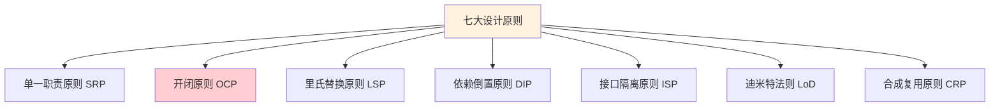

### 1.3.1 单一职责原则（SRP - Single Responsibility Principle）

> **定义**：一个类应该只有一个引起它变化的原因（即只负责一项职责）。

**核心思想**：如果一个类承担了多个职责，当其中一个职责发生变化时，可能会影响到其他职责的正常运行。

**反面示例**：一个类同时处理用户信息和订单逻辑

```java
// ❌ 违反单一职责：一个类同时管理用户数据和发送邮件
public class UserService {
    public void saveUser(User user) {
        // 保存用户到数据库
        String sql = "INSERT INTO users ...";
        // JDBC 操作...
    }
    
    public void sendEmail(User user, String content) {
        // 发送邮件通知
        // SMTP 操作...
    }
    
    public String generateReport(User user) {
        // 生成用户报告
        // 报告生成逻辑...
        return "report";
    }
}
```

**正面示例**：拆分为各自职责明确的类

```java
// ✅ 遵循单一职责
public class UserRepository {
    public void saveUser(User user) {
        // 只负责用户数据持久化
        String sql = "INSERT INTO users ...";
    }
}

public class EmailService {
    public void sendEmail(User user, String content) {
        // 只负责邮件发送
    }
}

public class ReportService {
    public String generateUserReport(User user) {
        // 只负责报告生成
        return "report";
    }
}
```

**实际应用**：
- Spring MVC 中的 Controller → Service → Repository 分层就是 SRP 的体现
- 每一层只关注自己的职责：Controller 处理请求、Service 处理业务逻辑、Repository 处理数据访问

---

### 1.3.2 开闭原则（OCP - Open/Closed Principle）

> **定义**：软件实体（类、模块、函数等）应该**对扩展开放，对修改关闭**。

**核心思想**：当需求变化时，通过**新增代码**来扩展功能，而不是**修改已有代码**。这是所有设计原则中**最重要**的一条。

**反面示例**：用 if-else 判断类型，每增加一种类型就要修改代码

```java
// ❌ 违反开闭原则：每新增一种图形，都要修改 drawShape 方法
public class GraphicEditor {
    public void drawShape(String type) {
        if ("circle".equals(type)) {
            drawCircle();
        } else if ("rectangle".equals(type)) {
            drawRectangle();
        } else if ("triangle".equals(type)) {
            // 新增三角形需要修改此方法
            drawTriangle();
        }
    }
    
    private void drawCircle() { System.out.println("画圆形"); }
    private void drawRectangle() { System.out.println("画矩形"); }
    private void drawTriangle() { System.out.println("画三角形"); }
}
```

**正面示例**：通过抽象 + 多态实现开闭原则

```java
// ✅ 遵循开闭原则：新增图形只需增加新类，无需修改已有代码
public interface Shape {
    void draw();
}

public class Circle implements Shape {
    @Override
    public void draw() { System.out.println("画圆形"); }
}

public class Rectangle implements Shape {
    @Override
    public void draw() { System.out.println("画矩形"); }
}

// 新增三角形：只需新增一个类，不修改任何已有代码
public class Triangle implements Shape {
    @Override
    public void draw() { System.out.println("画三角形"); }
}

public class GraphicEditor {
    public void drawShape(Shape shape) {
        shape.draw(); // 面向接口编程，对扩展开放
    }
}
```

**实际应用**：
- Java 的 `java.util.Collections.sort()` 通过 `Comparator` 接口扩展排序逻辑
- Spring 中大量使用策略模式实现 OCP

---

### 1.3.3 里氏替换原则（LSP - Liskov Substitution Principle）

> **定义**：所有引用基类的地方必须能透明地使用其子类的对象，而不会产生任何错误或异常。

**核心思想**：子类可以扩展父类的功能，但不应该改变父类原有的功能。

**反面示例**：经典的正方形-长方形问题

```java
// ❌ 违反里氏替换原则
public class Rectangle {
    protected int width;
    protected int height;
    
    public void setWidth(int width) { this.width = width; }
    public void setHeight(int height) { this.height = height; }
    public int getArea() { return width * height; }
}

// 正方形继承长方形
public class Square extends Rectangle {
    @Override
    public void setWidth(int width) {
        this.width = width;
        this.height = width; // 正方形要求宽高一致，修改了父类行为！
    }
    
    @Override
    public void setHeight(int height) {
        this.width = height;
        this.height = height;
    }
}

// 使用父类引用
public void resize(Rectangle r) {
    while (r.getArea() < 100) {
        r.setWidth(r.getWidth() + 1);
        // 如果传入 Square，将无限循环！因为 setWidth 同时改了 height
    }
}
```

**正面示例**：用抽象解决继承问题

```java
// ✅ 遵循里氏替换原则：提取公共抽象
public interface Shape {
    int getArea();
}

public class Rectangle implements Shape {
    private int width;
    private int height;
    
    public Rectangle(int width, int height) {
        this.width = width;
        this.height = height;
    }
    
    @Override
    public int getArea() { return width * height; }
}

public class Square implements Shape {
    private int side;
    
    public Square(int side) {
        this.side = side;
    }
    
    @Override
    public int getArea() { return side * side; }
}
```

**实际应用**：
- Java 集合框架中 `List`、`Set` 继承 `Collection`，它们的实现类都可以替代父接口使用
- 如果你覆盖了父类方法并改变了其语义，就违反了 LSP

---

### 1.3.4 依赖倒置原则（DIP - Dependency Inversion Principle）

> **定义**：
> 1. 高层模块不应该依赖低层模块，二者都应该依赖抽象
> 2. 抽象不应该依赖细节，细节应该依赖抽象

**核心思想**：面向接口编程，而不是面向实现编程。

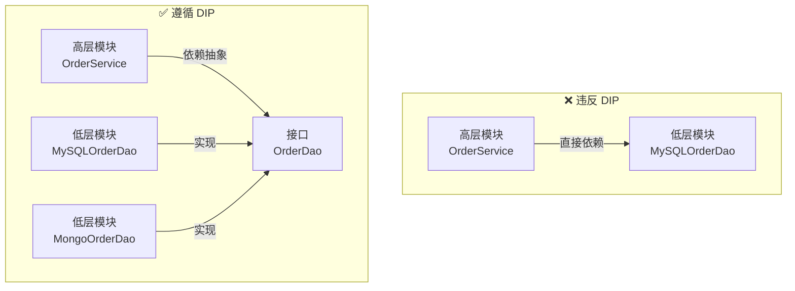

**反面示例**：高层直接依赖低层实现

```java
// ❌ 违反依赖倒置：OrderService 直接依赖 MySQLOrderDao
public class MySQLOrderDao {
    public void save(Order order) {
        // MySQL 保存逻辑
    }
}

public class OrderService {
    private MySQLOrderDao orderDao = new MySQLOrderDao(); // 直接依赖具体实现
    
    public void createOrder(Order order) {
        orderDao.save(order);
    }
}
// 如果要换成 MongoDB，必须修改 OrderService 的代码
```

**正面示例**：通过接口解耦

```java
// ✅ 遵循依赖倒置
public interface OrderDao {
    void save(Order order);
}

public class MySQLOrderDao implements OrderDao {
    @Override
    public void save(Order order) { /* MySQL 保存 */ }
}

public class MongoOrderDao implements OrderDao {
    @Override
    public void save(Order order) { /* MongoDB 保存 */ }
}

public class OrderService {
    private OrderDao orderDao; // 依赖抽象
    
    // 通过构造器注入（Spring DI 的核心思想）
    public OrderService(OrderDao orderDao) {
        this.orderDao = orderDao;
    }
    
    public void createOrder(Order order) {
        orderDao.save(order);
    }
}
```

**实际应用**：
- **Spring 的依赖注入（DI）** 就是 DIP 的最佳实践
- JDBC 的 `Connection`、`Statement` 接口屏蔽了具体数据库实现

---

### 1.3.5 接口隔离原则（ISP - Interface Segregation Principle）

> **定义**：客户端不应该依赖它不需要的接口。一个类对另一个类的依赖应该建立在最小的接口上。

**核心思想**：将臃肿的接口拆分成更小、更具体的接口，让实现类只需要关注自己需要的方法。

**反面示例**：接口过于臃肿

```java
// ❌ 违反接口隔离：一个巨大的"万能"接口
public interface Animal {
    void eat();
    void sleep();
    void fly();    // 不是所有动物都会飞
    void swim();   // 不是所有动物都会游泳
    void climb();  // 不是所有动物都会爬树
}

// Dog 不会飞，但被迫实现 fly()
public class Dog implements Animal {
    @Override public void eat() { /* ... */ }
    @Override public void sleep() { /* ... */ }
    @Override public void fly() { /* 狗不会飞！空实现或抛异常 */ }
    @Override public void swim() { /* ... */ }
    @Override public void climb() { /* 狗不会爬树！ */ }
}
```

**正面示例**：接口拆分

```java
// ✅ 遵循接口隔离：按能力拆分接口
public interface Eatable {
    void eat();
}

public interface Sleepable {
    void sleep();
}

public interface Flyable {
    void fly();
}

public interface Swimmable {
    void swim();
}

// Dog 只实现它需要的接口
public class Dog implements Eatable, Sleepable, Swimmable {
    @Override public void eat() { System.out.println("狗吃骨头"); }
    @Override public void sleep() { System.out.println("狗睡觉"); }
    @Override public void swim() { System.out.println("狗游泳"); }
}

// Bird 只实现它需要的接口
public class Bird implements Eatable, Sleepable, Flyable {
    @Override public void eat() { System.out.println("鸟吃虫"); }
    @Override public void sleep() { System.out.println("鸟睡觉"); }
    @Override public void fly() { System.out.println("鸟飞翔"); }
}
```

**实际应用**：
- Java 中的 `Serializable`、`Cloneable`、`Comparable` 都是小粒度的接口
- Spring 中的 `InitializingBean`（afterPropertiesSet）和 `DisposableBean`（destroy）是分开的接口

---

### 1.3.6 迪米特法则（LoD - Law of Demeter）

> **定义**：一个对象应该对其他对象有最少的了解（也叫**最少知识原则**）。只与直接朋友通信，不与"陌生人"说话。

**核心思想**：降低类之间的耦合。如果两个类之间不必直接通信，那么这两个类就不应当发生直接的相互作用。

**反面示例**：链式调用暴露内部结构

```java
// ❌ 违反迪米特法则：暴露了太多内部细节
public class Customer {
    private Wallet wallet;
    public Wallet getWallet() { return wallet; }
}

public class Wallet {
    private double money;
    public double getMoney() { return money; }
    public void setMoney(double money) { this.money = money; }
}

// 购物付款
public class ShoppingService {
    public void pay(Customer customer, double amount) {
        Wallet wallet = customer.getWallet(); // 直接拿到客户的钱包
        if (wallet.getMoney() >= amount) {
            wallet.setMoney(wallet.getMoney() - amount); // 直接操作钱包
        }
    }
}
// ShoppingService 不仅认识 Customer，还认识 Wallet —— 知道太多了！
```

**正面示例**：通过中间方法隐藏细节

```java
// ✅ 遵循迪米特法则：ShoppingService 只与 Customer 打交道
public class Customer {
    private Wallet wallet;
    
    // Customer 自己负责付款逻辑
    public boolean pay(double amount) {
        if (wallet.getMoney() >= amount) {
            wallet.setMoney(wallet.getMoney() - amount);
            return true;
        }
        return false;
    }
}

public class ShoppingService {
    public void pay(Customer customer, double amount) {
        boolean success = customer.pay(amount); // 只与直接朋友通信
        if (!success) {
            System.out.println("余额不足");
        }
    }
}
```

**实际应用**：
- 外观模式（Facade）就是迪米特法则的典型应用
- Spring 中 `JdbcTemplate` 封装了 Connection、Statement 等底层细节

---

### 1.3.7 合成复用原则（CRP - Composite Reuse Principle）

> **定义**：尽量使用**组合/聚合**的方式来实现代码复用，而不是使用继承。

**核心思想**：继承是一种强耦合关系（白箱复用），组合是一种弱耦合关系（黑箱复用）。优先使用组合可以使系统更加灵活。

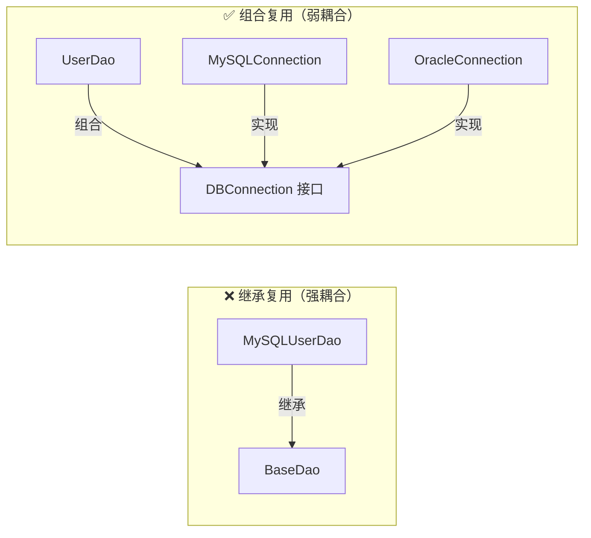

**反面示例**：通过继承复用数据库连接

```java
// ❌ 违反合成复用原则：通过继承获取数据库连接
public class BaseDao {
    public Connection getConnection() {
        // 获取 MySQL 连接
        return DriverManager.getConnection("jdbc:mysql://...");
    }
}

// 如果要换 Oracle，UserDao 必须改继承关系
public class UserDao extends BaseDao {
    public void saveUser(User user) {
        Connection conn = getConnection();
        // ...
    }
}
```

**正面示例**：通过组合复用

```java
// ✅ 遵循合成复用原则：通过组合获取数据库连接
public interface DBConnection {
    Connection getConnection();
}

public class MySQLConnection implements DBConnection {
    @Override
    public Connection getConnection() {
        return DriverManager.getConnection("jdbc:mysql://...");
    }
}

public class OracleConnection implements DBConnection {
    @Override
    public Connection getConnection() {
        return DriverManager.getConnection("jdbc:oracle://...");
    }
}

public class UserDao {
    private DBConnection dbConnection; // 组合，而非继承
    
    public UserDao(DBConnection dbConnection) {
        this.dbConnection = dbConnection;
    }
    
    public void saveUser(User user) {
        Connection conn = dbConnection.getConnection();
        // ...
    }
}
```

**实际应用**：
- Spring 中广泛使用组合而非继承
- Java 中 `HashSet` 内部组合了 `HashMap`，而不是继承它

---

### 七大设计原则总结表

| 原则 | 一句话总结 | 核心关键词 |
|------|-----------|-----------|
| **单一职责 SRP** | 一个类只做一件事 | 职责分离 |
| **开闭原则 OCP** | 对扩展开放，对修改关闭 | 抽象 + 多态 |
| **里氏替换 LSP** | 子类能替代父类 | 正确继承 |
| **依赖倒置 DIP** | 依赖抽象，不依赖具体 | 面向接口 |
| **接口隔离 ISP** | 接口要小而精 | 接口拆分 |
| **迪米特法则 LoD** | 只与直接朋友通信 | 最少知识 |
| **合成复用 CRP** | 优先用组合，少用继承 | 组合 > 继承 |

> **记忆口诀**：**开（OCP）口（ISP）合（CRP）里（LSP）单（SRP）的（DIP）迷（LoD）** —— "开口合理单的迷"

---

# 二、单例模式（Singleton）

## 2.1 什么是单例模式

> **定义**：确保一个类只有一个实例，并提供一个全局访问点。

单例模式是最简单也是最常用的设计模式之一。它的核心要点：
1. **私有构造器**：防止外部通过 `new` 创建实例
2. **静态私有实例**：类内部持有唯一实例
3. **静态公有方法**：提供全局访问点

### UML 类图

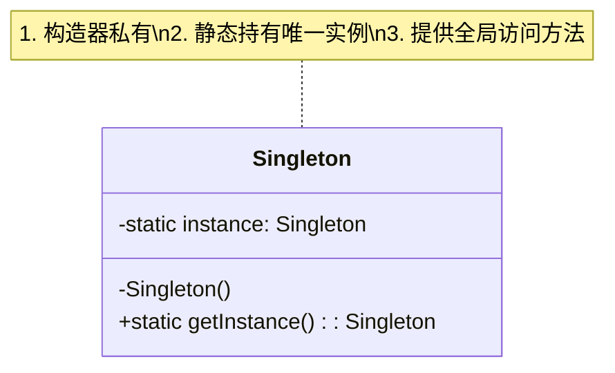

### 适用场景

- 配置管理（整个应用只需要一份配置）
- 连接池（数据库连接池、线程池）
- 日志记录器
- Spring 中的 Bean（默认单例）
- Runtime 类（`Runtime.getRuntime()`）

---

## 2.2 饿汉式（Eager Initialization）

### 2.2.1 静态常量方式

```java
/**
 * 饿汉式 - 静态常量
 * 优点：写法简单，类加载时完成实例化，天生线程安全
 * 缺点：无论是否使用都会创建实例，可能造成内存浪费
 */
public class Singleton1 {
    // 1. 私有构造器
    private Singleton1() {}
    
    // 2. 类加载时就创建实例（静态常量）
    private static final Singleton1 INSTANCE = new Singleton1();
    
    // 3. 提供全局访问点
    public static Singleton1 getInstance() {
        return INSTANCE;
    }
}
```

**原理分析**：
- 利用 JVM 的**类加载机制**保证线程安全
- `static final` 变量在类加载的**初始化阶段**由 `<clinit>()` 方法完成赋值
- JVM 保证 `<clinit>()` 方法在多线程环境下是线程安全的（只会被执行一次）

### 2.2.2 静态代码块方式

```java
/**
 * 饿汉式 - 静态代码块
 * 与静态常量方式本质相同，但可以在初始化时做更多操作（如读取配置）
 */
public class Singleton2 {
    private Singleton2() {}
    
    private static final Singleton2 INSTANCE;
    
    static {
        // 可以在这里做一些初始化操作，如读取配置文件
        INSTANCE = new Singleton2();
    }
    
    public static Singleton2 getInstance() {
        return INSTANCE;
    }
}
```

> **饿汉式总结**：线程安全，但不支持懒加载。适用于**确定会被使用**或**实例占用资源少**的场景。

---

## 2.3 懒汉式（Lazy Initialization）

### 2.3.1 线程不安全版本

```java
/**
 * 懒汉式 - 线程不安全
 * ❌ 多线程环境下可能创建多个实例！
 */
public class Singleton3 {
    private Singleton3() {}
    
    private static Singleton3 instance;
    
    public static Singleton3 getInstance() {
        if (instance == null) {           // 线程A判断为null
            instance = new Singleton3();  // 线程B也判断为null，创建了第二个实例！
        }
        return instance;
    }
}
```

**线程不安全的时序分析**：

```
时间线  线程A                    线程B
  t1    if (instance == null)   
  t2    → true                  if (instance == null)
  t3    new Singleton3()        → true
  t4    赋值给 instance          new Singleton3()  ← 创建了第二个实例！
  t5                            赋值给 instance
```

> ⚠️ **结论**：线程不安全的懒汉式**绝对不能在多线程环境中使用**。

### 2.3.2 synchronized 同步方法

```java
/**
 * 懒汉式 - synchronized 同步方法
 * 优点：线程安全
 * 缺点：每次调用都要获取锁，性能极差
 */
public class Singleton4 {
    private Singleton4() {}
    
    private static Singleton4 instance;
    
    // 整个方法加锁
    public static synchronized Singleton4 getInstance() {
        if (instance == null) {
            instance = new Singleton4();
        }
        return instance;
    }
}
```

**问题**：实例创建之后，后续每次调用 `getInstance()` 都要竞争锁，而此时 `instance` 已经不为 null 了，加锁毫无意义。这就是为什么需要 DCL。

### 2.3.3 DCL 双重检查锁（Double-Checked Locking）⭐⭐⭐

```java
/**
 * 懒汉式 - DCL 双重检查锁
 * ⭐ 推荐写法之一
 * 优点：线程安全 + 懒加载 + 性能好（只在第一次加锁）
 */
public class Singleton5 {
    private Singleton5() {}
    
    // 🔑 volatile 是关键！防止指令重排序
    private static volatile Singleton5 instance;
    
    public static Singleton5 getInstance() {
        if (instance == null) {              // 第一次检查（无锁）
            synchronized (Singleton5.class) { // 加锁
                if (instance == null) {       // 第二次检查（有锁）
                    instance = new Singleton5();
                }
            }
        }
        return instance;
    }
}
```

**为什么需要双重检查？**

```
时间线  线程A                         线程B
  t1    第一次检查 instance == null
  t2    → true，进入 synchronized    
  t3    获取锁                         第一次检查 instance == null
  t4    第二次检查 instance == null     → true，等待获取锁
  t5    → true，创建实例
  t6    释放锁                         
  t7                                   获取锁
  t8                                   第二次检查 instance == null
  t9                                   → false！不再创建实例 ✅
  t10                                  释放锁
```

- **第一次检查**：避免不必要的加锁（性能优化）
- **第二次检查**：防止多个线程同时通过第一次检查后重复创建实例

---

## 2.4 DCL 为什么需要 volatile ⭐⭐⭐⭐⭐

这是面试中**极高频**的问题，也是理解 Java 内存模型（JMM）的关键。

### 2.4.1 `new` 操作的三步拆解

`instance = new Singleton5();` 这行代码在 JVM 层面不是原子操作，它分为三步：

```
① memory = allocate();     // 分配内存空间
② ctorInstance(memory);    // 初始化对象（调用构造方法）
③ instance = memory;       // 将 instance 指向分配的内存地址
```

### 2.4.2 指令重排序问题

JVM 的**即时编译器（JIT）** 和 **CPU** 为了提高性能，可能会对指令进行重排序。步骤 ② 和 ③ **没有数据依赖关系**，因此可能被重排序为：

```
① memory = allocate();     // 分配内存空间
③ instance = memory;       // instance 已经指向内存（但对象还未初始化！）
② ctorInstance(memory);    // 初始化对象
```

### 2.4.3 没有 volatile 会怎样？

```
时间线  线程A                              线程B
  t1    ① allocate memory
  t2    ③ instance = memory（尚未初始化！）
  t3                                       第一次检查 instance == null
  t4                                       → false（instance 已经有值了）
  t5                                       return instance  ← 🚨 返回未初始化的对象！
  t6    ② ctorInstance（才开始初始化）
```

**严重后果**：线程B拿到了一个**尚未完成初始化的对象**！使用这个对象可能导致 NPE 或不可预期的行为。

### 2.4.4 volatile 如何解决？

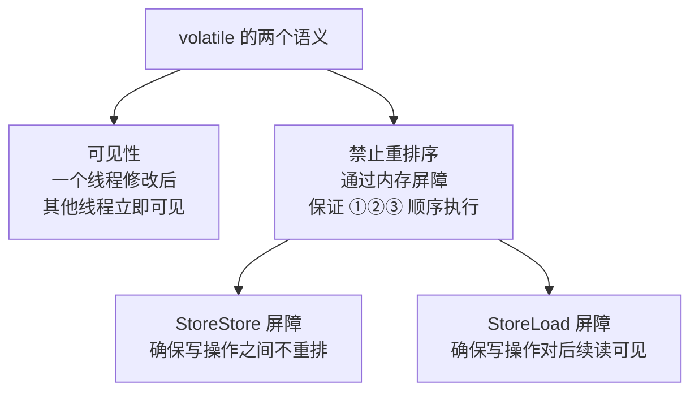

`volatile` 通过在关键位置插入**内存屏障（Memory Barrier）** 来禁止重排序：

```
// 加了 volatile 后的执行顺序（绝对不会重排）：
① memory = allocate();       // 分配内存
② ctorInstance(memory);      // 初始化对象
--- StoreStore Barrier ---   // 内存屏障，确保 ② 在 ③ 之前完成
③ instance = memory;         // 赋值
--- StoreLoad Barrier ---    // 内存屏障，确保 ③ 对其他线程可见
```

> **结论**：DCL 中的 `volatile` 不仅保证可见性，更重要的是**禁止指令重排序**，确保其他线程看到的 `instance` 要么是 `null`，要么是**完全初始化好的对象**。

---

## 2.5 静态内部类方式 ⭐⭐⭐

```java
/**
 * 静态内部类方式
 * ⭐ 推荐写法之一
 * 兼具懒加载和线程安全，且代码简洁
 */
public class Singleton6 {
    private Singleton6() {}
    
    // 静态内部类不会随外部类加载而加载
    private static class SingletonHolder {
        private static final Singleton6 INSTANCE = new Singleton6();
    }
    
    public static Singleton6 getInstance() {
        return SingletonHolder.INSTANCE; // 触发内部类加载
    }
}
```

**原理分析**：

1. **懒加载**：`SingletonHolder` 是静态内部类，不会随着 `Singleton6` 的加载而加载。只有当第一次调用 `getInstance()` 时，JVM 才会加载 `SingletonHolder`
2. **线程安全**：JVM 保证类加载过程是线程安全的（`<clinit>()` 方法由 JVM 加锁保护）
3. **无锁**：不需要 `synchronized`，性能好

> **JVM 类加载时机**（5种主动引用）：
> - new 实例、读写静态字段、调用静态方法
> - 反射调用
> - 初始化子类时先初始化父类
> - 主类（包含 main 方法的类）
> - JDK 7+ 的动态语言支持

---

## 2.6 枚举方式 ⭐⭐⭐⭐⭐

```java
/**
 * 枚举方式
 * ⭐⭐⭐ 最推荐的单例实现方式
 * Effective Java 作者 Joshua Bloch 推荐
 * 优点：写法最简洁、天然线程安全、防反射攻击、防序列化破坏
 */
public enum Singleton7 {
    INSTANCE;
    
    // 可以添加自己的方法
    private int count = 0;
    
    public void doSomething() {
        System.out.println("枚举单例执行业务逻辑, count=" + (++count));
    }
}

// 使用方式
// Singleton7.INSTANCE.doSomething();
```

**为什么枚举是最推荐的？**

1. **写法最简洁**：只需要一个 `enum` 声明
2. **天然线程安全**：枚举实例在类加载时由 JVM 创建，保证线程安全
3. **防止反射攻击**：`Constructor.newInstance()` 在遇到枚举类型时会直接抛出 `IllegalArgumentException`
4. **防止序列化破坏**：Java 序列化机制对枚举有特殊处理，反序列化时不会创建新实例

**反编译枚举**可以看到，枚举本质上是：

```java
public final class Singleton7 extends Enum<Singleton7> {
    public static final Singleton7 INSTANCE;
    
    static {
        INSTANCE = new Singleton7("INSTANCE", 0);
    }
    
    private Singleton7(String name, int ordinal) {
        super(name, ordinal);
    }
}
```

---

## 2.7 反射破坏单例 + 防御方案

### 2.7.1 反射如何破坏单例

```java
// 反射破坏单例的演示
public class ReflectionAttack {
    public static void main(String[] args) throws Exception {
        // 正常获取单例
        Singleton6 s1 = Singleton6.getInstance();
        
        // 通过反射获取私有构造器
        Constructor<Singleton6> constructor = Singleton6.class.getDeclaredConstructor();
        constructor.setAccessible(true); // 暴力破解私有访问
        
        // 反射创建新实例
        Singleton6 s2 = constructor.newInstance();
        
        System.out.println(s1 == s2); // false！单例被破坏了！
    }
}
```

### 2.7.2 防御方案：在构造器中检查

```java
public class Singleton6 {
    private static boolean created = false;
    
    private Singleton6() {
        // 防御反射攻击
        synchronized (Singleton6.class) {
            if (created) {
                throw new RuntimeException("禁止反射创建单例实例！");
            }
            created = true;
        }
    }
    
    private static class SingletonHolder {
        private static final Singleton6 INSTANCE = new Singleton6();
    }
    
    public static Singleton6 getInstance() {
        return SingletonHolder.INSTANCE;
    }
}
```

或者：

```java
private Singleton6() {
    if (SingletonHolder.INSTANCE != null) {
        throw new RuntimeException("禁止反射创建单例实例！");
    }
}
```

> ⚠️ **注意**：上述防御方案都不是万无一失的（反射可以修改 `created` 标志位），只有**枚举方式才能从 JVM 层面彻底防止反射攻击**。

---

## 2.8 序列化破坏单例 + readResolve() 防御

### 2.8.1 序列化如何破坏单例

```java
public class Singleton6 implements Serializable {
    private static final long serialVersionUID = 1L;
    
    private Singleton6() {}
    
    private static class SingletonHolder {
        private static final Singleton6 INSTANCE = new Singleton6();
    }
    
    public static Singleton6 getInstance() {
        return SingletonHolder.INSTANCE;
    }
}

// 序列化破坏单例的演示
public class SerializationAttack {
    public static void main(String[] args) throws Exception {
        Singleton6 s1 = Singleton6.getInstance();
        
        // 序列化
        ObjectOutputStream oos = new ObjectOutputStream(
            new FileOutputStream("singleton.bin"));
        oos.writeObject(s1);
        oos.close();
        
        // 反序列化
        ObjectInputStream ois = new ObjectInputStream(
            new FileInputStream("singleton.bin"));
        Singleton6 s2 = (Singleton6) ois.readObject();
        ois.close();
        
        System.out.println(s1 == s2); // false！反序列化创建了新实例！
    }
}
```

### 2.8.2 防御方案：readResolve() 方法

```java
public class Singleton6 implements Serializable {
    private static final long serialVersionUID = 1L;
    
    private Singleton6() {}
    
    private static class SingletonHolder {
        private static final Singleton6 INSTANCE = new Singleton6();
    }
    
    public static Singleton6 getInstance() {
        return SingletonHolder.INSTANCE;
    }
    
    /**
     * 关键！反序列化时 JVM 会自动调用此方法替换反序列化生成的新对象
     * ObjectInputStream.readObject() 源码中会检查是否有 readResolve() 方法
     */
    private Object readResolve() {
        return SingletonHolder.INSTANCE;
    }
}
```

**readResolve() 原理**：

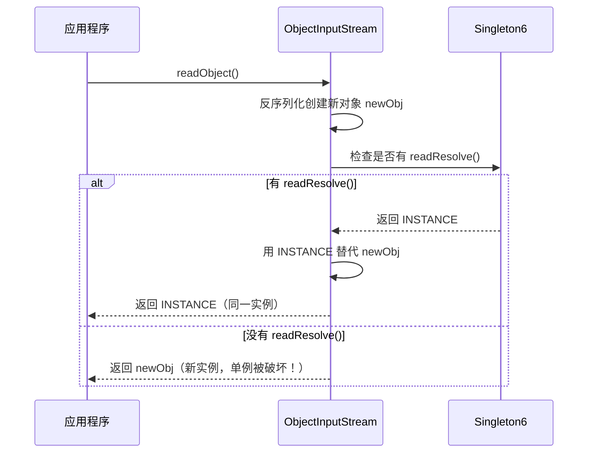

---

## 2.9 各种实现方式对比表

| 实现方式 | 线程安全 | 懒加载 | 防反射 | 防序列化 | 性能 | 推荐度 |
|---------|---------|--------|--------|---------|------|--------|
| 饿汉式（静态常量） | ✅ | ❌ | ❌ | ❌ | ⭐⭐⭐⭐⭐ | ⭐⭐⭐ |
| 饿汉式（静态代码块） | ✅ | ❌ | ❌ | ❌ | ⭐⭐⭐⭐⭐ | ⭐⭐⭐ |
| 懒汉式（线程不安全） | ❌ | ✅ | ❌ | ❌ | ⭐⭐⭐⭐⭐ | ⛔ |
| 懒汉式（synchronized） | ✅ | ✅ | ❌ | ❌ | ⭐ | ⭐ |
| DCL 双重检查锁 | ✅ | ✅ | ❌ | ❌ | ⭐⭐⭐⭐ | ⭐⭐⭐⭐ |
| 静态内部类 | ✅ | ✅ | ❌ | ❌* | ⭐⭐⭐⭐⭐ | ⭐⭐⭐⭐ |
| **枚举** | ✅ | ❌ | ✅ | ✅ | ⭐⭐⭐⭐⭐ | ⭐⭐⭐⭐⭐ |

> ❌* 需手动添加 readResolve() 方法

**推荐选择**：
- **不需要懒加载** → 枚举方式（最安全最简洁）
- **需要懒加载** → 静态内部类 或 DCL
- **需要序列化** → 枚举方式

---

## 2.10 Spring 中的单例

### Spring 单例 vs GOF 单例

| 维度 | GOF 单例 | Spring 单例 |
|------|---------|------------|
| **作用范围** | 整个 JVM（一个 ClassLoader 一个实例） | 一个 Spring IoC 容器（ApplicationContext）一个实例 |
| **实现方式** | 私有构造器 + 静态方法 | 通过 Bean 定义 + IoC 容器管理 |
| **创建控制** | 类自己控制 | Spring 容器控制（控制反转） |
| **多个容器** | 仍然只有一个实例 | 每个容器各有一个实例 |

### Spring 单例的实现原理

Spring 使用 **ConcurrentHashMap** 作为单例注册表（Singleton Registry）：

```java
// Spring 源码简化版（DefaultSingletonBeanRegistry）
public class DefaultSingletonBeanRegistry {
    // 一级缓存：存放完全初始化好的单例 Bean
    private final Map<String, Object> singletonObjects = new ConcurrentHashMap<>();
    
    public Object getSingleton(String beanName) {
        // 先从缓存中获取
        Object singletonObject = this.singletonObjects.get(beanName);
        if (singletonObject == null) {
            synchronized (this.singletonObjects) {
                singletonObject = this.singletonObjects.get(beanName);
                if (singletonObject == null) {
                    // 创建 Bean 实例
                    singletonObject = createBean(beanName);
                    // 放入缓存
                    this.singletonObjects.put(beanName, singletonObject);
                }
            }
        }
        return singletonObject;
    }
}
```

> 你会发现，Spring 的单例实现本质上就是一个**"注册表模式" + DCL 双重检查锁**。

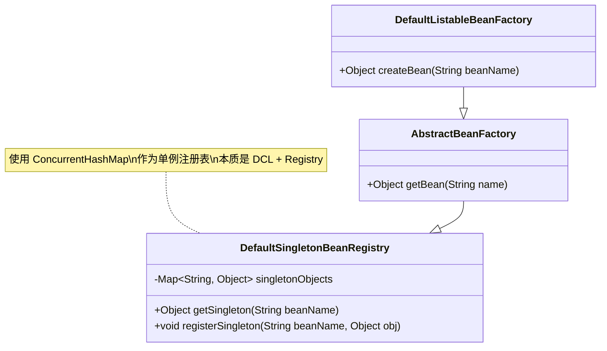

---

# 三、工厂模式（Factory）

工厂模式是最常用的创建型模式，其核心思想是**将对象的创建与使用分离**。

## 3.1 简单工厂模式（Simple Factory / Static Factory Method）

> **严格来说**，简单工厂不属于 GOF 23 种设计模式，但它是工厂方法模式的基础，实际开发中使用非常广泛。

### 3.1.1 需求场景

假设我们有一个 Pizza 店，需要根据客户订单创建不同类型的 Pizza：

```java
// ❌ 不使用工厂模式：客户端直接 new 对象
public class PizzaStore {
    public Pizza orderPizza(String type) {
        Pizza pizza;
        if ("cheese".equals(type)) {
            pizza = new CheesePizza();
        } else if ("pepperoni".equals(type)) {
            pizza = new PepperoniPizza();
        } else if ("veggie".equals(type)) {
            pizza = new VeggiePizza();
        } else {
            throw new IllegalArgumentException("未知的 Pizza 类型: " + type);
        }
        
        pizza.prepare();
        pizza.bake();
        pizza.cut();
        pizza.box();
        return pizza;
    }
}
// 问题：每新增一种 Pizza，都要修改 PizzaStore —— 违反开闭原则
```

### 3.1.2 简单工厂实现

```java
// 产品接口
public interface Pizza {
    void prepare();
    void bake();
    void cut();
    void box();
}

// 具体产品
public class CheesePizza implements Pizza {
    @Override public void prepare() { System.out.println("准备奶酪 Pizza 原料"); }
    @Override public void bake() { System.out.println("烘烤奶酪 Pizza"); }
    @Override public void cut() { System.out.println("切割奶酪 Pizza"); }
    @Override public void box() { System.out.println("包装奶酪 Pizza"); }
}

public class PepperoniPizza implements Pizza {
    @Override public void prepare() { System.out.println("准备意大利辣肠 Pizza 原料"); }
    @Override public void bake() { System.out.println("烘烤意大利辣肠 Pizza"); }
    @Override public void cut() { System.out.println("切割意大利辣肠 Pizza"); }
    @Override public void box() { System.out.println("包装意大利辣肠 Pizza"); }
}

// 简单工厂
public class SimplePizzaFactory {
    // 静态工厂方法
    public static Pizza createPizza(String type) {
        switch (type) {
            case "cheese":    return new CheesePizza();
            case "pepperoni": return new PepperoniPizza();
            case "veggie":    return new VeggiePizza();
            default: throw new IllegalArgumentException("未知的 Pizza 类型: " + type);
        }
    }
}

// 使用
public class PizzaStore {
    public Pizza orderPizza(String type) {
        Pizza pizza = SimplePizzaFactory.createPizza(type); // 创建与使用分离
        pizza.prepare();
        pizza.bake();
        pizza.cut();
        pizza.box();
        return pizza;
    }
}
```

### 3.1.3 UML 类图

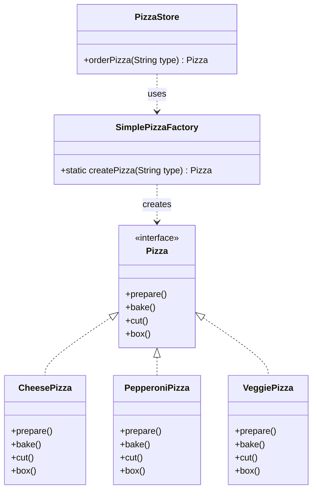

### 3.1.4 优缺点

| 优点 | 缺点 |
|------|------|
| 将创建逻辑集中管理 | 每新增产品都要修改工厂类（违反 OCP） |
| 客户端不需要知道具体类名 | 工厂类职责过重（违反 SRP） |
| 使用简单，代码直观 | 工厂类中的 switch/if-else 代码可能很长 |

---

## 3.2 工厂方法模式（Factory Method Pattern）

> **定义**：定义一个创建对象的接口，但让子类决定实例化哪一个类。工厂方法让类的实例化**推迟到子类**。

### 3.2.1 核心思想

简单工厂的问题是：每新增一种产品都要修改工厂类。工厂方法模式的解决方案是：**把创建逻辑下沉到子类**，每种产品对应一个工厂。

### 3.2.2 实现

```java
// 产品接口
public interface Pizza {
    void prepare();
    void bake();
    void cut();
    void box();
    String getName();
}

// 具体产品
public class NYCheesePizza implements Pizza {
    @Override public String getName() { return "纽约风味奶酪 Pizza"; }
    @Override public void prepare() { System.out.println("准备 " + getName() + " 原料"); }
    @Override public void bake() { System.out.println("烘烤 " + getName()); }
    @Override public void cut() { System.out.println("切割 " + getName()); }
    @Override public void box() { System.out.println("包装 " + getName()); }
}

public class ChicagoCheesePizza implements Pizza {
    @Override public String getName() { return "芝加哥风味奶酪 Pizza"; }
    @Override public void prepare() { System.out.println("准备 " + getName() + " 原料"); }
    @Override public void bake() { System.out.println("烘烤 " + getName()); }
    @Override public void cut() { System.out.println("对角线切割 " + getName()); }
    @Override public void box() { System.out.println("包装 " + getName()); }
}

// 抽象工厂（工厂方法模式的核心）
public abstract class PizzaStore {
    // 工厂方法：由子类实现
    protected abstract Pizza createPizza(String type);
    
    // 模板方法：定义制作流程
    public Pizza orderPizza(String type) {
        Pizza pizza = createPizza(type); // 调用工厂方法
        System.out.println("--- 制作 " + pizza.getName() + " ---");
        pizza.prepare();
        pizza.bake();
        pizza.cut();
        pizza.box();
        return pizza;
    }
}

// 具体工厂
public class NYPizzaStore extends PizzaStore {
    @Override
    protected Pizza createPizza(String type) {
        switch (type) {
            case "cheese": return new NYCheesePizza();
            case "pepperoni": return new NYPepperoniPizza();
            default: throw new IllegalArgumentException("纽约店不支持: " + type);
        }
    }
}

public class ChicagoPizzaStore extends PizzaStore {
    @Override
    protected Pizza createPizza(String type) {
        switch (type) {
            case "cheese": return new ChicagoCheesePizza();
            case "pepperoni": return new ChicagoPepperoniPizza();
            default: throw new IllegalArgumentException("芝加哥店不支持: " + type);
        }
    }
}
```

### 3.2.3 UML 类图

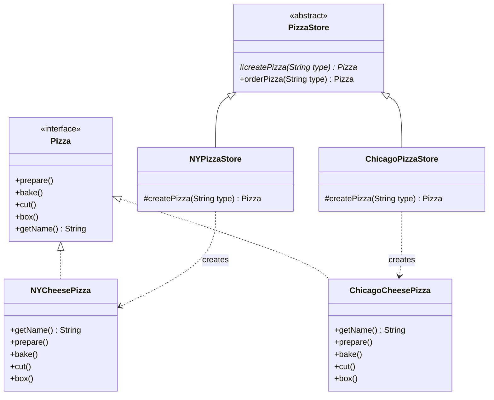

### 3.2.4 优缺点

| 优点 | 缺点 |
|------|------|
| 遵循开闭原则（新增产品只需新增工厂子类） | 每增加一种产品就要增加一个工厂类，类爆炸 |
| 遵循单一职责（每个工厂只创建一种产品） | 增加了系统抽象性和理解难度 |
| 客户端只依赖抽象，不依赖具体类 | 只能生产一种产品（一个方法） |

---

## 3.3 抽象工厂模式（Abstract Factory Pattern）

> **定义**：提供一个创建**一系列相关或相互依赖对象**的接口，而无需指定它们的具体类。

### 3.3.1 产品族 vs 产品等级结构

这是理解抽象工厂的关键概念：

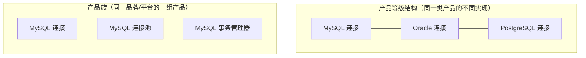

| 概念 | 说明 | 示例 |
|------|------|------|
| **产品等级结构** | 同一种产品的不同实现（纵向） | 手机产品线：华为手机、小米手机、苹果手机 |
| **产品族** | 同一品牌/平台的一系列产品（横向） | 华为产品族：华为手机、华为平板、华为笔记本 |

### 3.3.2 实现

以跨数据库的 DAO 层为例：

```java
// ===== 产品接口 =====
// 产品A：连接
public interface IConnection {
    void connect();
}

// 产品B：命令
public interface ICommand {
    void execute(String sql);
}

// ===== 具体产品（MySQL 产品族） =====
public class MySQLConnection implements IConnection {
    @Override
    public void connect() {
        System.out.println("建立 MySQL 连接");
    }
}

public class MySQLCommand implements ICommand {
    @Override
    public void execute(String sql) {
        System.out.println("MySQL 执行: " + sql);
    }
}

// ===== 具体产品（Oracle 产品族） =====
public class OracleConnection implements IConnection {
    @Override
    public void connect() {
        System.out.println("建立 Oracle 连接");
    }
}

public class OracleCommand implements ICommand {
    @Override
    public void execute(String sql) {
        System.out.println("Oracle 执行: " + sql);
    }
}

// ===== 抽象工厂 =====
public interface IDatabaseFactory {
    IConnection createConnection();
    ICommand createCommand();
}

// ===== 具体工厂（MySQL 工厂 —— 生产 MySQL 产品族） =====
public class MySQLFactory implements IDatabaseFactory {
    @Override
    public IConnection createConnection() {
        return new MySQLConnection();
    }
    
    @Override
    public ICommand createCommand() {
        return new MySQLCommand();
    }
}

// ===== 具体工厂（Oracle 工厂 —— 生产 Oracle 产品族） =====
public class OracleFactory implements IDatabaseFactory {
    @Override
    public IConnection createConnection() {
        return new OracleConnection();
    }
    
    @Override
    public ICommand createCommand() {
        return new OracleCommand();
    }
}

// ===== 客户端 =====
public class Application {
    private IConnection connection;
    private ICommand command;
    
    public Application(IDatabaseFactory factory) {
        this.connection = factory.createConnection();
        this.command = factory.createCommand();
    }
    
    public void run() {
        connection.connect();
        command.execute("SELECT * FROM users");
    }
}
```

### 3.3.3 UML 类图

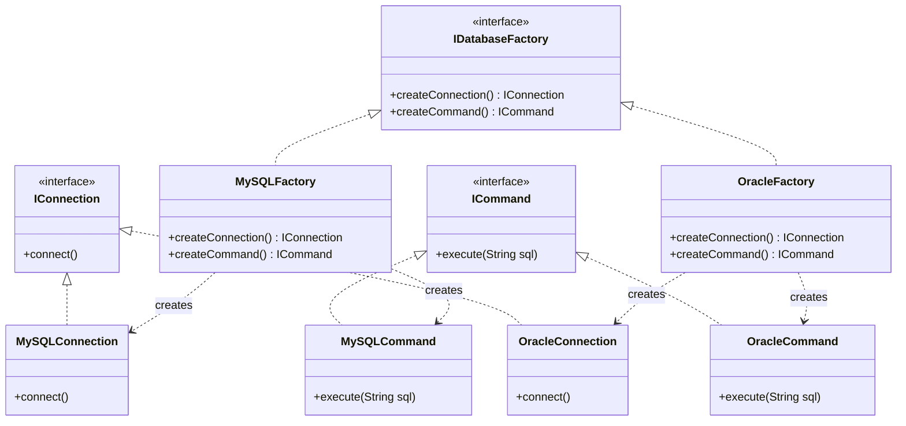

### 3.3.4 优缺点

| 优点 | 缺点 |
|------|------|
| 保证产品族的一致性（不会把 MySQL 连接和 Oracle 命令混搭） | 新增产品（如新增 ITransaction）需要修改所有工厂，违反 OCP |
| 切换产品族非常方便（只需更换工厂实例） | 类的数量增长快 |
| 客户端与具体产品解耦 | 当产品种类较多时，工厂接口会变得臃肿 |

---

## 3.4 三种工厂模式对比表

| 维度 | 简单工厂 | 工厂方法 | 抽象工厂 |
|------|---------|---------|---------|
| **复杂度** | 低 | 中 | 高 |
| **抽象层次** | 一个工厂类 | 一个抽象工厂 + 多个具体工厂 | 一个抽象工厂 + 多个具体工厂 |
| **产品数量** | 一种产品 | 一种产品 | **多种产品（产品族）** |
| **新增产品** | 修改工厂类（违反 OCP） | 新增工厂子类（遵循 OCP） | 修改抽象工厂（违反 OCP） |
| **新增产品族** | — | — | 新增工厂子类（遵循 OCP） |
| **适用场景** | 产品种类少且稳定 | 产品种类多，经常扩展 | 需要创建一系列相关产品 |
| **GOF 模式** | ❌ 不属于 | ✅ | ✅ |

---

## 3.5 Spring 中的工厂模式

### BeanFactory

`BeanFactory` 是 Spring 容器的根接口，它就是一个典型的**工厂模式**。

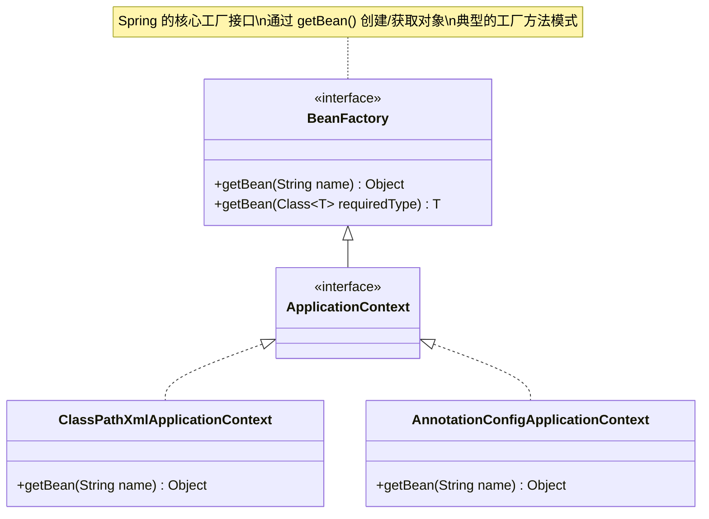

### FactoryBean

`FactoryBean` 是 Spring 提供的一种特殊 Bean，它本身是一个工厂，用于创建**复杂对象**：

```java
public interface FactoryBean<T> {
    T getObject() throws Exception;       // 创建对象
    Class<?> getObjectType();             // 返回对象类型
    default boolean isSingleton() { return true; } // 是否单例
}

// 示例：MyBatis 中的 SqlSessionFactoryBean
public class SqlSessionFactoryBean implements FactoryBean<SqlSessionFactory> {
    @Override
    public SqlSessionFactory getObject() throws Exception {
        // 复杂的创建逻辑...
        return new DefaultSqlSessionFactory(configuration);
    }
    
    @Override
    public Class<?> getObjectType() {
        return SqlSessionFactory.class;
    }
}
```

> **BeanFactory vs FactoryBean**：
> - `BeanFactory`：Spring 容器的顶层接口，是**管理 Bean 的工厂**
> - `FactoryBean`：一个 Bean 本身就是工厂，是**创建特定对象的工厂 Bean**

---

# 四、建造者模式（Builder）

> **定义**：将一个复杂对象的构建与其表示分离，使得同样的构建过程可以创建不同的表示。

## 4.1 什么时候用建造者模式

- 对象有**很多可选参数**（构造器参数爆炸问题）
- 对象的**创建过程复杂**（需要多步骤组装）
- 需要**不可变对象**（构建完成后不允许修改）

### 构造器参数爆炸问题

```java
// ❌ 参数过多的构造器 —— 可读性极差
public class Computer {
    public Computer(String cpu, String ram, String ssd, String gpu, 
                    String mainboard, String power, String cooler,
                    String case_, boolean hasWifi, boolean hasBluetooth) {
        // ...
    }
}

// 调用时根本分不清每个参数是什么
Computer pc = new Computer("i9-13900K", "64GB", "2TB", "RTX4090",
                           "Z790", "1000W", "360水冷", "全塔", true, true);
```

---

## 4.2 经典建造者模式（Director + Builder）

### 4.2.1 UML 类图

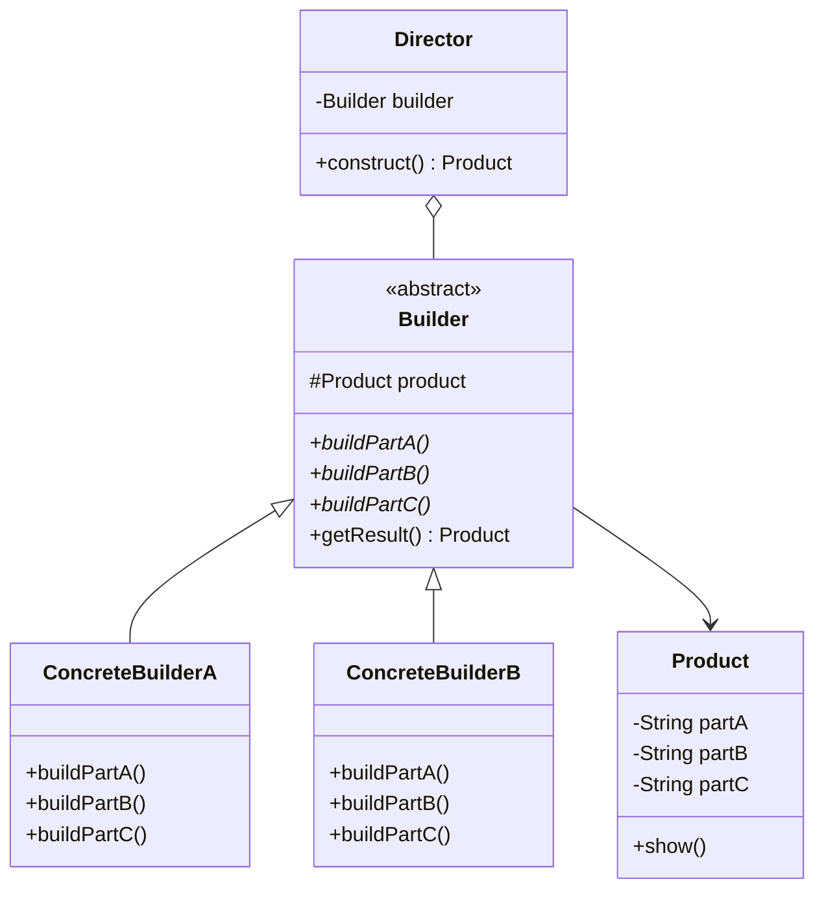

### 4.2.2 实现

```java
// 产品类
public class Computer {
    private String cpu;
    private String ram;
    private String ssd;
    private String gpu;
    
    public void setCpu(String cpu) { this.cpu = cpu; }
    public void setRam(String ram) { this.ram = ram; }
    public void setSsd(String ssd) { this.ssd = ssd; }
    public void setGpu(String gpu) { this.gpu = gpu; }
    
    @Override
    public String toString() {
        return "Computer{cpu='" + cpu + "', ram='" + ram + 
               "', ssd='" + ssd + "', gpu='" + gpu + "'}";
    }
}

// 抽象建造者
public abstract class ComputerBuilder {
    protected Computer computer = new Computer();
    
    public abstract void buildCPU();
    public abstract void buildRAM();
    public abstract void buildSSD();
    public abstract void buildGPU();
    
    public Computer getResult() {
        return computer;
    }
}

// 具体建造者A：游戏电脑
public class GamingComputerBuilder extends ComputerBuilder {
    @Override public void buildCPU() { computer.setCpu("i9-13900K"); }
    @Override public void buildRAM() { computer.setRam("64GB DDR5"); }
    @Override public void buildSSD() { computer.setSsd("2TB NVMe"); }
    @Override public void buildGPU() { computer.setGpu("RTX 4090"); }
}

// 具体建造者B：办公电脑
public class OfficeComputerBuilder extends ComputerBuilder {
    @Override public void buildCPU() { computer.setCpu("i5-13400"); }
    @Override public void buildRAM() { computer.setRam("16GB DDR4"); }
    @Override public void buildSSD() { computer.setSsd("512GB SSD"); }
    @Override public void buildGPU() { computer.setGpu("集成显卡"); }
}

// 指挥者（Director）
public class ComputerDirector {
    private ComputerBuilder builder;
    
    public ComputerDirector(ComputerBuilder builder) {
        this.builder = builder;
    }
    
    // 指挥构建过程
    public Computer construct() {
        builder.buildCPU();
        builder.buildRAM();
        builder.buildSSD();
        builder.buildGPU();
        return builder.getResult();
    }
}

// 使用
ComputerDirector director = new ComputerDirector(new GamingComputerBuilder());
Computer gamingPC = director.construct();
System.out.println(gamingPC);
// Computer{cpu='i9-13900K', ram='64GB DDR5', ssd='2TB NVMe', gpu='RTX 4090'}
```

---

## 4.3 链式建造者（Lombok @Builder 风格）⭐

实际开发中更常用的是**链式建造者**（也叫 Fluent Builder），不需要 Director：

```java
public class Computer {
    private final String cpu;       // final 保证不可变
    private final String ram;
    private final String ssd;
    private final String gpu;
    private final boolean hasWifi;
    private final boolean hasBluetooth;
    
    // 私有构造器，只能通过 Builder 创建
    private Computer(Builder builder) {
        this.cpu = builder.cpu;
        this.ram = builder.ram;
        this.ssd = builder.ssd;
        this.gpu = builder.gpu;
        this.hasWifi = builder.hasWifi;
        this.hasBluetooth = builder.hasBluetooth;
    }
    
    // 静态内部类 Builder
    public static class Builder {
        // 必须参数
        private final String cpu;
        private final String ram;
        
        // 可选参数（设置默认值）
        private String ssd = "256GB";
        private String gpu = "集成显卡";
        private boolean hasWifi = true;
        private boolean hasBluetooth = false;
        
        // 必须参数通过构造器传入
        public Builder(String cpu, String ram) {
            this.cpu = cpu;
            this.ram = ram;
        }
        
        // 每个 setter 返回 this，支持链式调用
        public Builder ssd(String ssd) {
            this.ssd = ssd;
            return this;
        }
        
        public Builder gpu(String gpu) {
            this.gpu = gpu;
            return this;
        }
        
        public Builder wifi(boolean hasWifi) {
            this.hasWifi = hasWifi;
            return this;
        }
        
        public Builder bluetooth(boolean hasBluetooth) {
            this.hasBluetooth = hasBluetooth;
            return this;
        }
        
        // 构建最终对象
        public Computer build() {
            // 可以在这里做参数校验
            return new Computer(this);
        }
    }
    
    @Override
    public String toString() {
        return "Computer{cpu='" + cpu + "', ram='" + ram + "', ssd='" + ssd +
               "', gpu='" + gpu + "', wifi=" + hasWifi + ", bluetooth=" + hasBluetooth + "}";
    }
}

// 使用（可读性极佳）
Computer gamingPC = new Computer.Builder("i9-13900K", "64GB DDR5")
        .ssd("2TB NVMe")
        .gpu("RTX 4090")
        .wifi(true)
        .bluetooth(true)
        .build();

Computer officePC = new Computer.Builder("i5-13400", "16GB DDR4")
        .build(); // 其他参数使用默认值
```

### 链式建造者的 UML 类图

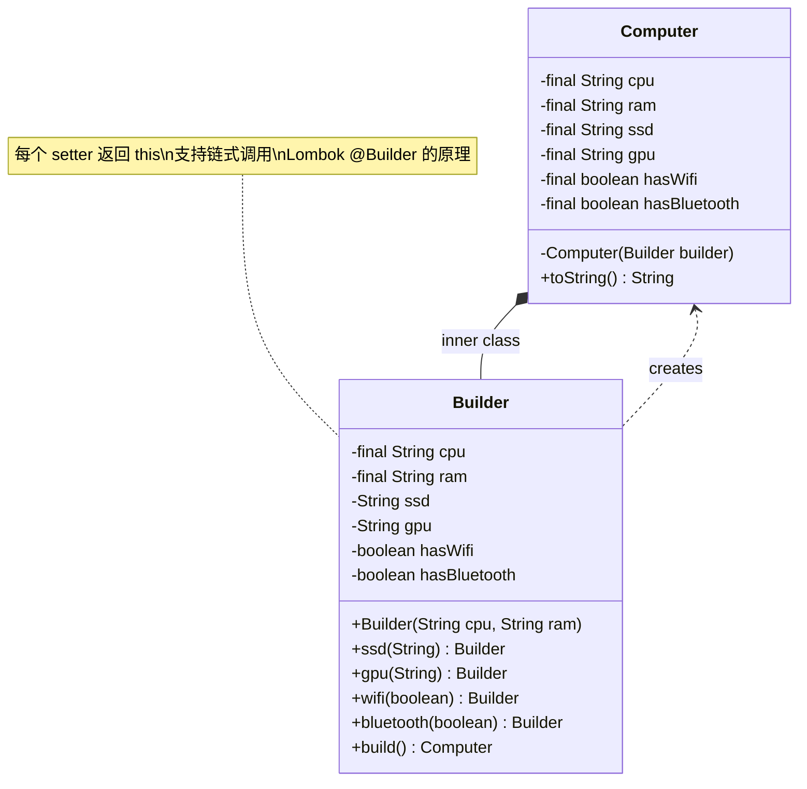

---

## 4.4 建造者 vs 工厂模式

| 维度 | 工厂模式 | 建造者模式 |
|------|---------|-----------|
| **关注点** | 创建**哪种**对象 | **如何**创建对象（构建步骤） |
| **产品复杂度** | 简单对象 | 复杂对象（多属性、多步骤） |
| **创建过程** | 一步完成 | 多步骤组装 |
| **产品差异** | 不同类型的对象 | 同一类型但配置不同的对象 |
| **客户端知道** | 产品类型即可 | 产品的各种配置细节 |

> **形象比喻**：
> - **工厂模式**像点菜：我要一份"鱼香肉丝"（指定类型，厨师做好端上来）
> - **建造者模式**像自助火锅：我要牛肉卷 + 虾滑 + 豆腐 + 金针菇...（自己选配料，一步步组装）

---

## 4.5 实际应用

### StringBuilder / StringBuffer

```java
// StringBuilder 就是典型的建造者模式
String result = new StringBuilder()
    .append("Hello")
    .append(" ")
    .append("World")
    .append("!")
    .toString();
```

### OkHttp Request

```java
Request request = new Request.Builder()
    .url("https://api.example.com/users")
    .addHeader("Authorization", "Bearer token")
    .addHeader("Content-Type", "application/json")
    .post(requestBody)
    .build();
```

### Guava ImmutableList

```java
ImmutableList<String> list = ImmutableList.<String>builder()
    .add("a")
    .add("b")
    .add("c")
    .build();
```

### Lombok @Builder

```java
// 使用 Lombok 注解，自动生成 Builder 代码
@Builder
@Data
public class User {
    private String name;
    private int age;
    private String email;
}

// 使用
User user = User.builder()
    .name("张三")
    .age(25)
    .email("zhangsan@example.com")
    .build();
```

### Spring Security 配置

```java
@Override
protected void configure(HttpSecurity http) throws Exception {
    http
        .authorizeRequests()
            .antMatchers("/public/**").permitAll()
            .antMatchers("/admin/**").hasRole("ADMIN")
            .anyRequest().authenticated()
        .and()
        .formLogin()
            .loginPage("/login")
            .permitAll()
        .and()
        .logout()
            .permitAll();
}
```

---

# 五、原型模式（Prototype）

> **定义**：用一个已经创建好的实例作为原型，通过复制（克隆）该原型对象来创建一个和原型一样的新对象。

## 5.1 什么时候用原型模式

- 创建对象的成本比较大（如需要 IO 操作、数据库访问、网络请求）
- 需要创建大量**相似但又不完全相同**的对象
- 对象的创建过程复杂（多层嵌套）

### UML 类图

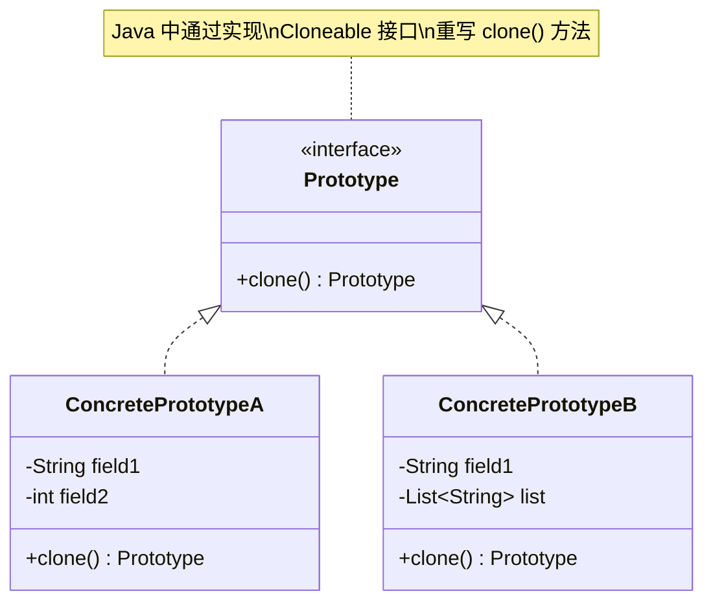

---

## 5.2 Cloneable 接口与 clone() 方法

Java 中实现原型模式通常使用 `Cloneable` 接口和 `Object.clone()` 方法：

```java
public class Sheep implements Cloneable {
    private String name;
    private int age;
    
    public Sheep(String name, int age) {
        this.name = name;
        this.age = age;
    }
    
    @Override
    public Sheep clone() {
        try {
            return (Sheep) super.clone();
        } catch (CloneNotSupportedException e) {
            throw new RuntimeException(e);
        }
    }
    
    @Override
    public String toString() {
        return "Sheep{name='" + name + "', age=" + age + "}";
    }
}

// 使用
Sheep dolly = new Sheep("多利", 3);
Sheep clone1 = dolly.clone();
Sheep clone2 = dolly.clone();

System.out.println(dolly);   // Sheep{name='多利', age=3}
System.out.println(clone1);  // Sheep{name='多利', age=3}
System.out.println(dolly == clone1); // false（不同对象）
```

> **注意**：如果没有实现 `Cloneable` 接口就调用 `clone()`，会抛出 `CloneNotSupportedException`。`Cloneable` 是一个**标记接口**（Marker Interface），它本身没有任何方法。

---

## 5.3 浅拷贝 vs 深拷贝 ⭐⭐⭐⭐

### 5.3.1 图解

```mermaid
graph TB
    subgraph "浅拷贝 Shallow Copy"
        A[原始对象<br/>name="张三"<br/>age=25] -->|clone| B[克隆对象<br/>name="张三"<br/>age=25]
        A -->|引用| C[Address 对象<br/>city="北京"]
        B -->|引用同一个| C
    end
    
    subgraph "深拷贝 Deep Copy"
        D[原始对象<br/>name="张三"<br/>age=25] -->|clone| E[克隆对象<br/>name="张三"<br/>age=25]
        D -->|引用| F[Address 对象<br/>city="北京"]
        E -->|引用新的| G[Address 对象(副本)<br/>city="北京"]
    end
    
    style C fill:#ffcdd2
    style F fill:#c8e6c9
    style G fill:#c8e6c9
```

### 5.3.2 浅拷贝详解

**浅拷贝**：`Object.clone()` 的默认行为。对于基本类型字段直接复制值，对于引用类型字段只复制引用（指向同一个对象）。

```java
public class Person implements Cloneable {
    private String name;
    private int age;
    private Address address; // 引用类型
    
    // 构造方法省略
    
    @Override
    public Person clone() {
        try {
            return (Person) super.clone(); // 浅拷贝
        } catch (CloneNotSupportedException e) {
            throw new RuntimeException(e);
        }
    }
}

public class Address {
    private String city;
    private String street;
    // getter/setter 省略
}

// 验证浅拷贝问题
Person p1 = new Person("张三", 25, new Address("北京", "长安街"));
Person p2 = p1.clone();

System.out.println(p1.getAddress() == p2.getAddress()); // true！指向同一个对象
p2.getAddress().setCity("上海"); // 修改克隆对象的地址
System.out.println(p1.getAddress().getCity()); // "上海"！原对象也被修改了！🚨
```

### 5.3.3 深拷贝详解

**深拷贝**：不仅复制对象本身，还递归复制所有引用类型字段指向的对象，使得原对象和克隆对象**完全独立**。

#### 方式一：重写 clone() 方法

```java
public class Person implements Cloneable {
    private String name;
    private int age;
    private Address address;
    
    @Override
    public Person clone() {
        try {
            Person cloned = (Person) super.clone();
            // 对引用类型字段也进行 clone
            cloned.address = this.address.clone();
            return cloned;
        } catch (CloneNotSupportedException e) {
            throw new RuntimeException(e);
        }
    }
}

public class Address implements Cloneable {
    private String city;
    private String street;
    
    @Override
    public Address clone() {
        try {
            return (Address) super.clone();
        } catch (CloneNotSupportedException e) {
            throw new RuntimeException(e);
        }
    }
}
```

> **问题**：如果对象嵌套层次很深（如 A → B → C → D），需要层层重写 clone()，非常麻烦。

#### 方式二：通过序列化实现深拷贝 ⭐

```java
import java.io.*;

public class DeepCopyUtil {
    /**
     * 通过序列化实现深拷贝
     * 要求对象及其所有引用的对象都实现 Serializable 接口
     */
    @SuppressWarnings("unchecked")
    public static <T extends Serializable> T deepCopy(T obj) {
        try {
            // 写入字节流
            ByteArrayOutputStream bos = new ByteArrayOutputStream();
            ObjectOutputStream oos = new ObjectOutputStream(bos);
            oos.writeObject(obj);
            oos.close();
            
            // 从字节流读取（创建新对象）
            ByteArrayInputStream bis = new ByteArrayInputStream(bos.toByteArray());
            ObjectInputStream ois = new ObjectInputStream(bis);
            T copy = (T) ois.readObject();
            ois.close();
            
            return copy;
        } catch (Exception e) {
            throw new RuntimeException("深拷贝失败", e);
        }
    }
}

// 使用
Person p1 = new Person("张三", 25, new Address("北京", "长安街"));
Person p2 = DeepCopyUtil.deepCopy(p1);
System.out.println(p1.getAddress() == p2.getAddress()); // false ✅ 完全独立
```

#### 方式三：通过 JSON 序列化

```java
import com.google.gson.Gson;

public class JsonDeepCopy {
    private static final Gson gson = new Gson();
    
    public static <T> T deepCopy(T obj, Class<T> clazz) {
        String json = gson.toJson(obj);
        return gson.fromJson(json, clazz);
    }
}

// 使用
Person p1 = new Person("张三", 25, new Address("北京", "长安街"));
Person p2 = JsonDeepCopy.deepCopy(p1, Person.class);
```

### 5.3.4 三种深拷贝方式对比

| 方式 | 优点 | 缺点 |
|------|------|------|
| **重写 clone()** | 性能最好，不需要额外依赖 | 嵌套层次深时很麻烦，容易遗漏 |
| **序列化** | 简单通用，不需要层层重写 | 需要实现 Serializable，性能稍差 |
| **JSON** | 最简单，不需要实现任何接口 | 需要第三方库（Gson/Jackson），性能最差，可能丢失类型信息 |

---

## 5.4 实际应用

### JDK 中的原型模式

- `Object.clone()` — Java 内置的克隆机制
- `ArrayList.clone()` — 返回一个浅拷贝
- `HashMap.clone()` — 返回一个浅拷贝
- `Date.clone()` — 返回一个独立的拷贝

### Spring 中的原型模式

```java
// Spring Bean 的 prototype 作用域
@Component
@Scope("prototype") // 每次 getBean 都会创建新实例
public class PrototypeBean {
    // ...
}

// 使用
ApplicationContext context = new AnnotationConfigApplicationContext(AppConfig.class);
PrototypeBean bean1 = context.getBean(PrototypeBean.class);
PrototypeBean bean2 = context.getBean(PrototypeBean.class);
System.out.println(bean1 == bean2); // false
```

> **注意**：Spring 的 `prototype` 作用域虽然叫"原型"，但它并不是通过 `clone()` 实现的，而是每次都调用构造方法创建新实例。这与 GOF 原型模式的"通过克隆创建"有所区别。

---

# 六、创建型模式在 Spring/JDK 中的应用总结

| 模式 | JDK 中的应用 | Spring 中的应用 |
|------|-------------|----------------|
| **单例** | `Runtime.getRuntime()` | Bean 默认 scope=singleton，`DefaultSingletonBeanRegistry` |
| **单例** | `System` 类（静态方法模拟单例） | `ApplicationContext` 单例容器 |
| **工厂方法** | `Collection.iterator()` 返回不同迭代器 | `BeanFactory.getBean()` |
| **工厂方法** | `NumberFormat.getInstance()` | `FactoryBean` 接口 |
| **工厂方法** | `Calendar.getInstance()` | `ProxyFactory` 创建代理对象 |
| **抽象工厂** | `DocumentBuilderFactory`（XML 解析） | 不同数据库的 `DataSource` 工厂 |
| **抽象工厂** | `TransformerFactory` | `AbstractFactoryBean` 系列 |
| **建造者** | `StringBuilder` / `StringBuffer` | `BeanDefinitionBuilder` |
| **建造者** | `Stream.Builder` | `UriComponentsBuilder` |
| **建造者** | `Locale.Builder` | `ResponseEntity.BodyBuilder` |
| **建造者** | — | Spring Security `HttpSecurity` 链式配置 |
| **原型** | `Object.clone()` | `scope="prototype"` 的 Bean |
| **原型** | `ArrayList.clone()` / `HashMap.clone()` | `@Scope("prototype")` |

### 关键总结

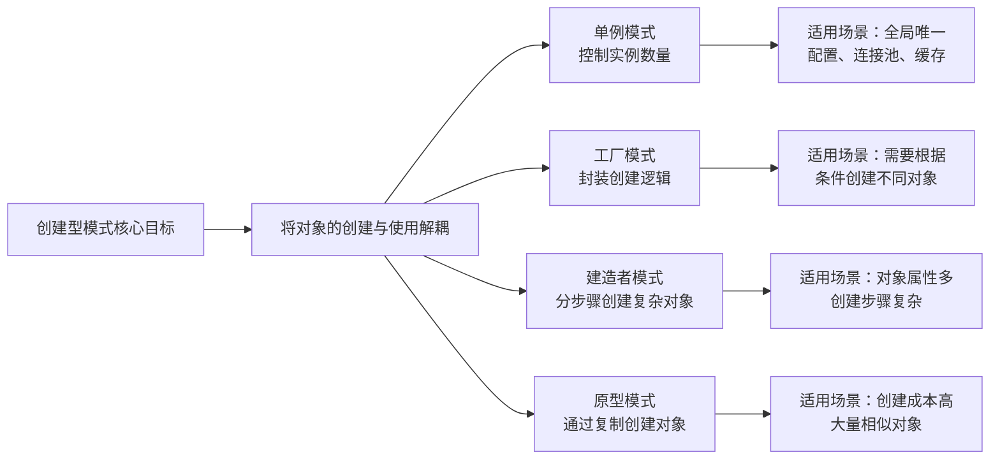

---

# 七、面试高频问题

## 题目 1：请列举你知道的设计模式，并说说在项目中用过哪些？

**参考答案**：

GOF 定义了 23 种设计模式，分为三类：
- **创建型**（5种）：单例、工厂方法、抽象工厂、建造者、原型
- **结构型**（7种）：适配器、桥接、组合、装饰器、外观、享元、代理
- **行为型**（11种）：模板方法、策略、观察者、责任链、命令、迭代器、中介者、备忘录、状态、访问者、解释器

项目中常用的：
1. **单例模式**：Spring Bean 默认单例，全局配置类
2. **工厂模式**：Spring 的 BeanFactory、各种 xxxFactory
3. **建造者模式**：Lombok @Builder、OkHttp Request 构建
4. **策略模式**：支付方式选择（微信/支付宝/银行卡）
5. **模板方法模式**：JdbcTemplate、RestTemplate
6. **观察者模式**：Spring 的事件机制（ApplicationEvent）
7. **代理模式**：Spring AOP（JDK 动态代理 / CGLIB）

---

## 题目 2：单例模式有几种实现方式？各自的优缺点？

**参考答案**：

主要有 7 种实现方式：

1. **饿汉式（静态常量）**：类加载时创建，线程安全，但不支持懒加载
2. **饿汉式（静态代码块）**：同上，可以做更多初始化逻辑
3. **懒汉式（线程不安全）**：多线程环境下可能创建多个实例，不推荐
4. **懒汉式（synchronized）**：线程安全但每次调用都加锁，性能差
5. **DCL 双重检查锁**：线程安全 + 懒加载 + 性能好，注意必须加 volatile
6. **静态内部类**：利用类加载机制实现懒加载和线程安全，推荐
7. **枚举**：最推荐，天然防反射、防序列化

---

## 题目 3：DCL 双重检查锁中为什么必须加 volatile？

**参考答案**：

因为 `instance = new Singleton()` 不是原子操作，在 JVM 层面分三步：
1. 分配内存空间
2. 初始化对象（调用构造方法）
3. 将 instance 指向分配的内存

由于**指令重排序**，步骤 2 和 3 可能被重排为 1→3→2。这样，线程A执行到步骤3时，instance 已经非 null，但对象尚未初始化。此时线程B在第一次检查时发现 instance != null，直接返回了一个**未完成初始化的对象**，导致 NPE 或不可预期的行为。

`volatile` 通过插入**内存屏障**，禁止指令重排序，保证步骤 1→2→3 的顺序执行。同时保证 instance 的修改对其他线程**立即可见**。

---

## 题目 4：如何破坏单例模式？如何防御？

**参考答案**：

**破坏方式一：反射**
- 通过 `Constructor.setAccessible(true)` 获取私有构造器，调用 `newInstance()` 创建新实例
- **防御**：在构造器中添加检查（如果实例已存在则抛出异常），或使用枚举（JVM 层面禁止反射创建枚举实例）

**破坏方式二：序列化**
- 对象序列化后再反序列化，会创建一个新的实例
- **防御**：添加 `readResolve()` 方法返回单例实例，或使用枚举（枚举的序列化由 JVM 特殊处理）

**最佳防御方案**：使用**枚举单例**，它从 JVM 层面同时防御了反射和序列化攻击。

---

## 题目 5：简单工厂、工厂方法、抽象工厂有什么区别？

**参考答案**：

| | 简单工厂 | 工厂方法 | 抽象工厂 |
|---|---------|---------|---------|
| **工厂数量** | 一个工厂类 | 多个工厂类 | 多个工厂类 |
| **产品数量** | 一种产品 | 一种产品 | 多种产品（产品族） |
| **扩展方式** | 修改工厂类 | 增加工厂子类 | 增加工厂子类 |
| **开闭原则** | 违反 | 遵循 | 新增产品族遵循，新增产品种类违反 |
| **复杂度** | 低 | 中 | 高 |

- **简单工厂**适合产品种类少且稳定的场景
- **工厂方法**适合产品种类经常变化，需要遵循开闭原则
- **抽象工厂**适合需要创建一系列相关产品（产品族）的场景

---

## 题目 6：建造者模式和工厂模式有什么区别？

**参考答案**：

- **工厂模式**关注的是**创建什么对象**（产品类型不同），一步到位
- **建造者模式**关注的是**如何创建对象**（创建步骤和配置不同），分步骤组装

举例：
- 工厂模式：造汽车 vs 造自行车 — 不同类型
- 建造者模式：造一辆汽车（选发动机、选轮胎、选内饰...） — 同类型不同配置

在实际开发中，建造者模式常用于解决"构造器参数爆炸"问题（如 Lombok 的 `@Builder`），而工厂模式常用于根据条件创建不同类型的对象。

---

## 题目 7：什么是浅拷贝和深拷贝？如何实现深拷贝？

**参考答案**：

**浅拷贝**：复制对象时，基本类型字段复制值，引用类型字段只复制引用（指向同一个对象）。Java 的 `Object.clone()` 默认是浅拷贝。

**深拷贝**：复制对象时，递归复制所有引用类型字段指向的对象，使原对象和克隆对象完全独立。

**深拷贝的实现方式**：
1. **重写 clone() 方法**：在 clone() 中对每个引用字段也调用 clone()，性能最好但嵌套深时很麻烦
2. **序列化**：将对象序列化为字节流再反序列化，简单通用但需要实现 Serializable
3. **JSON 转换**：先转 JSON 字符串再解析回来，最简单但性能最差，可能丢失类型信息

---

## 题目 8：Spring 中的单例和 GOF 单例有什么区别？

**参考答案**：

1. **作用范围不同**：
   - GOF 单例：一个 ClassLoader 中只有一个实例
   - Spring 单例：一个 IoC 容器中只有一个实例（多个容器可以有多个实例）

2. **实现方式不同**：
   - GOF 单例：私有构造器 + 静态方法（类自己控制创建）
   - Spring 单例：通过容器管理（注册表 + ConcurrentHashMap 缓存）

3. **创建控制不同**：
   - GOF 单例：类自己控制创建过程
   - Spring 单例：由 Spring 容器控制（控制反转 IoC）

---

## 题目 9：请说出 7 大设计原则？

**参考答案**：

1. **单一职责原则（SRP）**：一个类只负责一个职责
2. **开闭原则（OCP）**：对扩展开放，对修改关闭
3. **里氏替换原则（LSP）**：子类能替代父类，且不改变父类行为
4. **依赖倒置原则（DIP）**：依赖抽象而非具体实现
5. **接口隔离原则（ISP）**：接口要小而精，不要大而全
6. **迪米特法则（LoD）**：最少知识原则，只与直接朋友通信
7. **合成复用原则（CRP）**：优先使用组合/聚合，而非继承

其中**开闭原则**是最重要的，其他原则都是为了更好地实现开闭原则。

---

## 题目 10：说说你对开闭原则的理解？举个实际例子。

**参考答案**：

开闭原则的核心是**对扩展开放，对修改关闭**。当需求变化时，我们应该通过新增代码来实现新功能，而不是修改已有代码。

**实际例子**：支付系统

```java
// 违反开闭原则
public class PayService {
    public void pay(String type, double amount) {
        if ("wechat".equals(type)) { /* 微信支付 */ }
        else if ("alipay".equals(type)) { /* 支付宝支付 */ }
        // 新增银行卡支付需要修改此方法
    }
}

// 遵循开闭原则
public interface PayStrategy {
    void pay(double amount);
}

public class WechatPay implements PayStrategy { /* ... */ }
public class AlipayPay implements PayStrategy { /* ... */ }
// 新增银行卡支付：只需新增 BankCardPay 类，不修改任何已有代码
public class BankCardPay implements PayStrategy { /* ... */ }
```

Spring 中也大量运用了开闭原则，比如通过 `BeanPostProcessor`、`HandlerInterceptor` 等扩展点来扩展功能，而不是修改框架源码。

---

## 题目 11：枚举单例为什么能防止反射和序列化破坏？

**参考答案**：

**防反射**：
- 在 JDK 的 `Constructor.newInstance()` 源码中，有一个明确的检查：如果是枚举类型，直接抛出 `IllegalArgumentException("Cannot reflectively create enum objects")`
- 这是 JVM 层面的硬编码限制，无法绕过

**防序列化**：
- Java 对枚举的序列化做了特殊处理：序列化时只写入枚举常量的名字（name）
- 反序列化时通过 `Enum.valueOf()` 方法查找，返回的是已有的枚举常量，不会创建新实例
- 这是 Java 序列化规范中的特殊约定

这两个机制都是 JVM/Java 语言层面的保证，所以枚举单例是**最安全**的单例实现方式。

---

## 题目 12：什么是产品族和产品等级结构？抽象工厂适用于什么场景？

**参考答案**：

- **产品等级结构**：同一类产品的不同实现。例如：MySQL 数据库连接、Oracle 数据库连接、PostgreSQL 数据库连接 — 都是"数据库连接"这一产品等级
- **产品族**：同一品牌/平台下的一组不同产品。例如：MySQL 连接 + MySQL 命令 + MySQL 事务管理器 — 都属于 MySQL 产品族

**抽象工厂适用场景**：
当系统需要创建**一系列相关产品**（产品族），且这些产品必须配套使用时。例如：
- 跨数据库的 DAO 层（连接 + 命令 + 事务必须是同一数据库的）
- 跨平台 UI（按钮 + 文本框 + 下拉框必须是同一风格的）
- 多套换肤方案（背景 + 图标 + 字体必须是同一主题的）

抽象工厂的优势是**保证产品族的一致性**，不会出现混搭（如用 MySQL 连接执行 Oracle 命令）。

---

## 题目 13：在 Spring 中，BeanFactory 和 FactoryBean 有什么区别？

**参考答案**：

- **BeanFactory**：是 Spring 容器的**顶层接口**，定义了容器的基本功能（`getBean()`、`containsBean()` 等）。它是**管理所有 Bean 的工厂**。
  - 典型实现：`DefaultListableBeanFactory`、`ClassPathXmlApplicationContext`
  - 核心方法：`getBean(String name)` — 根据名称获取 Bean

- **FactoryBean**：是一个**特殊的 Bean**，它本身是一个工厂，用于创建复杂对象。实现 `FactoryBean<T>` 接口后，Spring 容器调用 `getObject()` 方法获取实际的 Bean。
  - 典型应用：MyBatis 的 `SqlSessionFactoryBean`、ProxyFactoryBean
  - 通过 `&` 前缀获取 FactoryBean 本身：`context.getBean("&myFactory")`

**一句话总结**：
- `BeanFactory` 是 Spring 容器本身（管理 Bean 的工厂）
- `FactoryBean` 是容器中的一个 Bean，但这个 Bean 自身就是一个工厂（创建特定对象的工厂 Bean）

---

## 题目 14：实际项目中你会如何选择创建型模式？

**参考答案**：

根据需求选择：

1. **需要全局唯一实例** → **单例模式**
   - 配置管理、连接池、日志记录器

2. **需要根据类型/条件创建不同对象** → **工厂模式**
   - 产品种类少且稳定 → 简单工厂
   - 产品种类多且经常扩展 → 工厂方法
   - 需要创建一系列配套产品 → 抽象工厂

3. **对象属性很多且有可选参数** → **建造者模式**
   - 构造器参数超过 4 个时考虑使用
   - 需要不可变对象时

4. **创建对象成本大且对象之间差异小** → **原型模式**
   - 批量创建相似对象
   - 对象创建需要大量 IO 或计算

在实际的 Spring 项目中，大部分创建逻辑都交给了 Spring 容器管理，开发者更多是通过配置来利用这些模式，而不是手动实现。

---

> **课件结束**。建议配合 `code/` 目录下的实验代码一起学习，动手实践效果更好。
