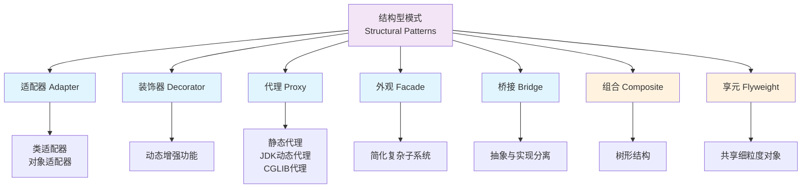
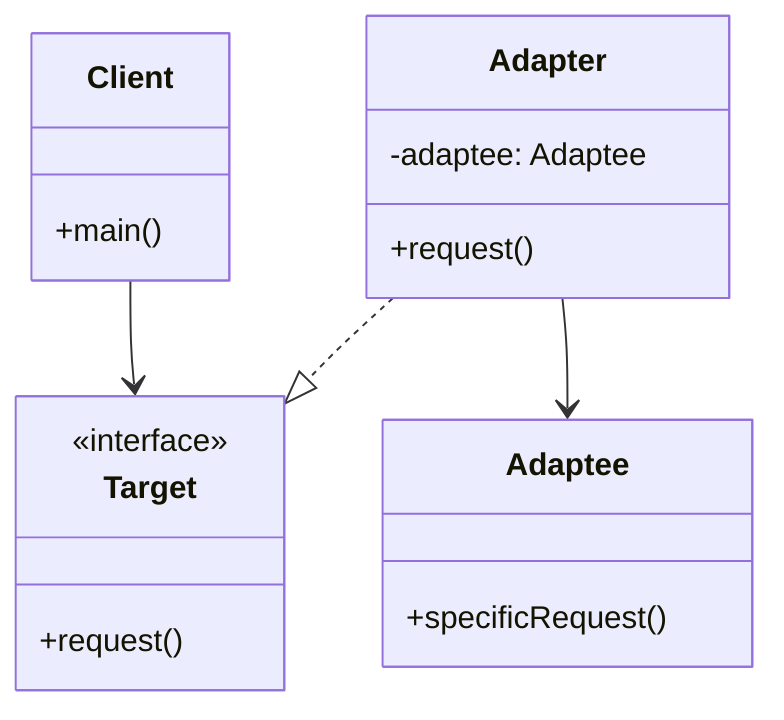
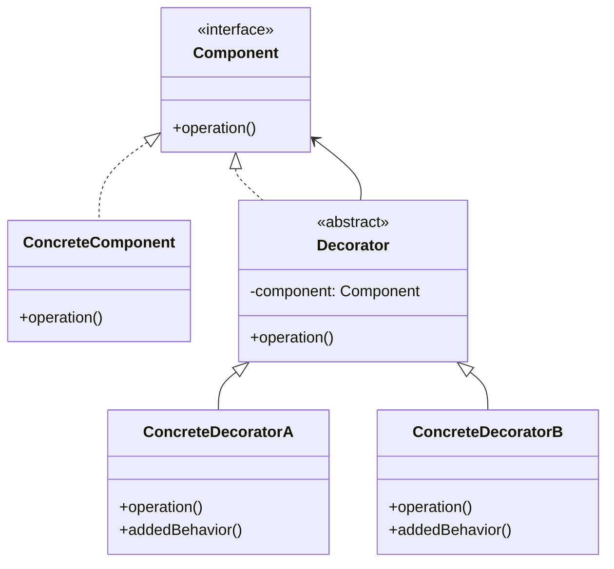
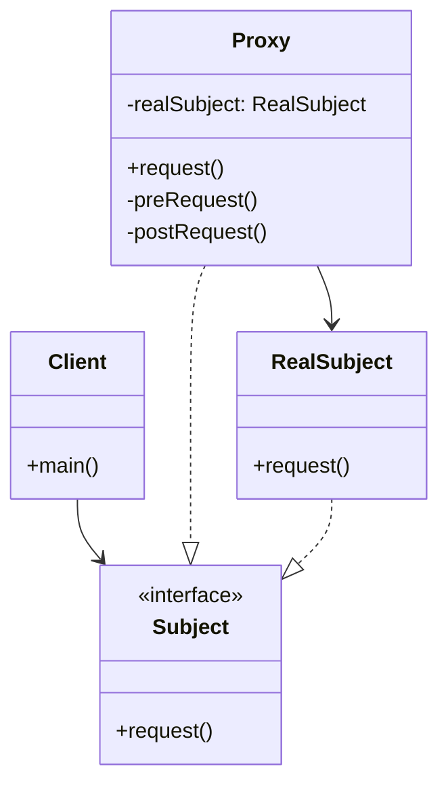
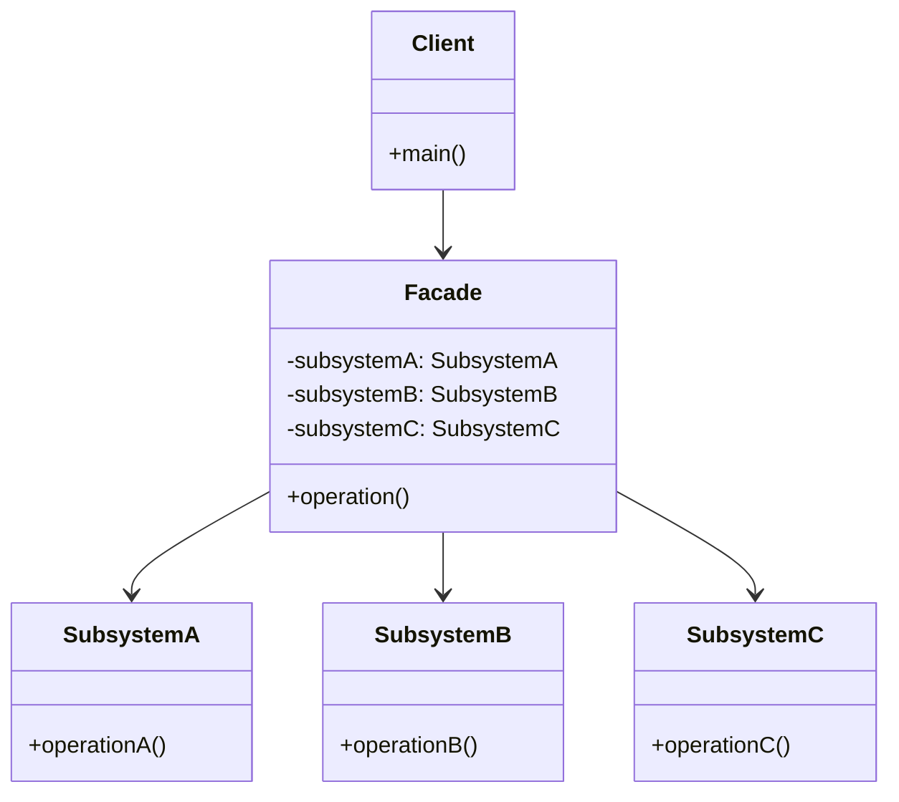
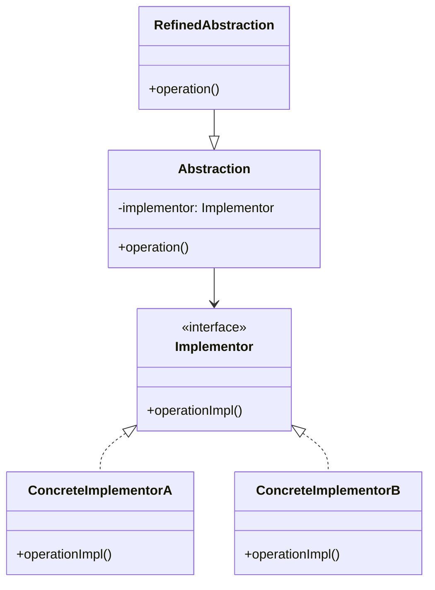
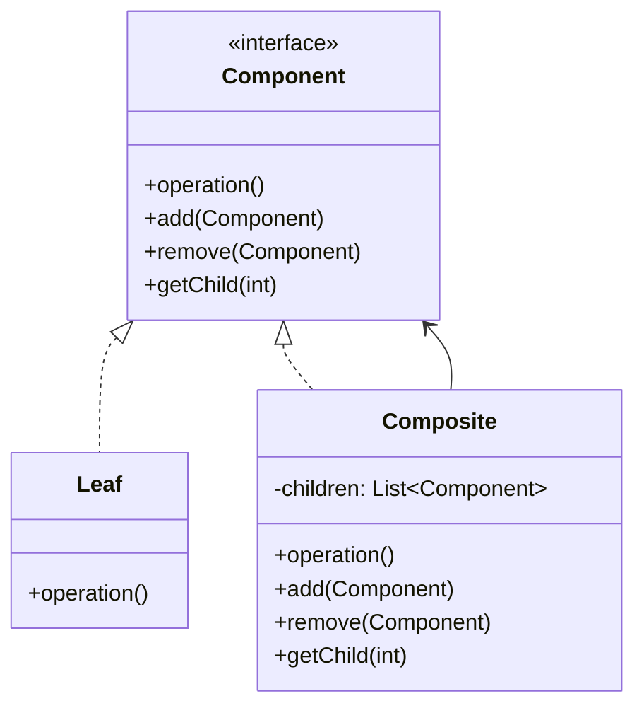
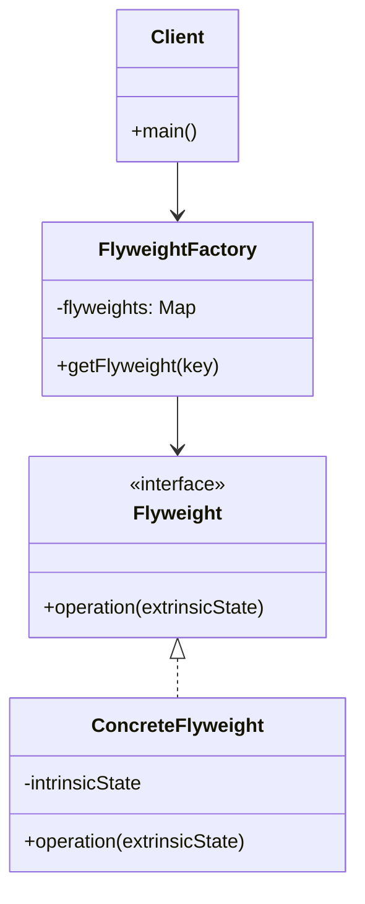

# 设计模式之结构型模式详解

> **学习目标**：深入理解 GOF 23 种设计模式中的 7 种结构型模式（适配器、装饰器、代理、外观、桥接、组合、享元），掌握结构型模式的核心思想，能在实际项目和面试中灵活运用。

---

## 目录

- [一、结构型模式概述](#一结构型模式概述)
  - [1.1 什么是结构型模式](#11-什么是结构型模式)
  - [1.2 结构型模式的核心思想](#12-结构型模式的核心思想)
  - [1.3 七种结构型模式概览](#13-七种结构型模式概览)
- [二、适配器模式（Adapter）](#二适配器模式adapter)
- [三、装饰器模式（Decorator）](#三装饰器模式decorator)
- [四、代理模式（Proxy）](#四代理模式proxy)
- [五、外观模式（Facade）](#五外观模式facade)
- [六、桥接模式（Bridge）](#六桥接模式bridge)
- [七、组合模式（Composite）](#七组合模式composite)
- [八、享元模式（Flyweight）](#八享元模式flyweight)
- [九、结构型模式在 Spring/JDK 中的应用总结](#九结构型模式在-springjdk-中的应用总结)
- [十、面试高频问题](#十面试高频问题)

---

# 一、结构型模式概述

## 1.1 什么是结构型模式

**结构型模式（Structural Pattern）** 关注如何**将类或对象组合成更大的结构**，以保持结构的灵活和高效。它描述了如何组合类和对象以获得新功能。

### 结构型模式的核心价值

1. **组合优于继承**：通过组合对象来扩展功能，而不是通过继承
2. **解耦**：将接口与实现分离，降低系统耦合度
3. **灵活性**：可以在运行时动态改变对象的结构和行为
4. **复用性**：通过组合已有对象，实现功能的复用

---

## 1.2 结构型模式的核心思想

**核心思想**：**"通过组合获得更大的结构"**

与创建型模式关注"如何创建对象"不同，结构型模式关注"如何组合对象"。

### 两种实现方式

| 方式 | 说明 | 示例模式 |
|------|------|----------|
| **类结构型模式** | 使用继承机制来组合接口或实现 | 适配器模式（类适配器） |
| **对象结构型模式** | 使用组合或聚合来组合对象 | 适配器模式（对象适配器）、装饰器、代理、外观、桥接、组合、享元 |

> **注意**：大多数结构型模式都是**对象结构型模式**，因为组合比继承更灵活。

---

## 1.3 七种结构型模式概览



### 七种模式对比

| 模式 | 核心目的 | 适用场景 | 重点掌握 |
|------|---------|----------|----------|
| **适配器** | 让不兼容的接口能够协同工作 | 需要使用现有类，但其接口不符合需求 | ⭐⭐⭐⭐⭐ |
| **装饰器** | 动态地给对象添加额外的职责 | 需要在不修改原类的情况下扩展功能 | ⭐⭐⭐⭐⭐ |
| **代理** | 为其他对象提供一种代理以控制对这个对象的访问 | 需要控制对象访问、延迟加载、AOP | ⭐⭐⭐⭐⭐ |
| **外观** | 为子系统中的一组接口提供一个统一的接口 | 简化复杂子系统的使用 | ⭐⭐⭐⭐ |
| **桥接** | 将抽象部分与实现部分分离，使它们可以独立变化 | 需要在多个维度上独立扩展 | ⭐⭐⭐⭐ |
| **组合** | 将对象组合成树形结构以表示"部分-整体"的层次结构 | 需要表示树形结构（如文件系统） | ⭐⭐⭐ |
| **享元** | 运用共享技术有效地支持大量细粒度的对象 | 需要创建大量相似对象（如字符、棋子） | ⭐⭐⭐ |

> **学习重点**：适配器、装饰器、代理是**面试高频**，必须深入掌握。外观和桥接也要理解。组合和享元了解即可。

---

# 二、适配器模式（Adapter）

## 2.1 什么是适配器模式

**适配器模式（Adapter Pattern）** 将一个类的接口转换成客户希望的另一个接口，使得原本由于接口不兼容而不能一起工作的类可以一起工作。

### 生活中的例子

- **电源适配器**：220V 交流电 → 5V 直流电（手机充电器）
- **转接头**：USB-A → USB-C
- **翻译器**：将一种语言翻译成另一种语言

### 适配器模式的结构



**角色说明**：

| 角色 | 说明 |
|------|------|
| **Target（目标接口）** | 客户期望的接口 |
| **Adaptee（适配者）** | 需要被适配的类（现有类，接口不兼容） |
| **Adapter（适配器）** | 将 Adaptee 的接口转换成 Target 接口 |
| **Client（客户端）** | 使用 Target 接口的类 |

---

## 2.2 适配器模式的两种实现方式

### 2.2.1 类适配器模式（使用继承）

**核心**：Adapter 继承 Adaptee，同时实现 Target 接口。

```java
// 目标接口
interface Target {
    void request();
}

// 适配者（现有类，接口不兼容）
class Adaptee {
    public void specificRequest() {
        System.out.println("适配者的方法被调用");
    }
}

// 类适配器（继承 Adaptee，实现 Target）
class ClassAdapter extends Adaptee implements Target {
    @Override
    public void request() {
        // 调用父类的方法
        specificRequest();
    }
}

// 客户端
public class Client {
    public static void main(String[] args) {
        Target target = new ClassAdapter();
        target.request(); // 输出：适配者的方法被调用
    }
}
```

**优点**：
- 代码简单，直接继承即可

**缺点**：
- 需要继承 Adaptee，如果 Adaptee 是类而不是接口，则无法使用
- 违反了组合优于继承的原则

---

### 2.2.2 对象适配器模式（使用组合）⭐ **推荐**

**核心**：Adapter 持有 Adaptee 的引用，实现 Target 接口。

```java
// 目标接口
interface Target {
    void request();
}

// 适配者
class Adaptee {
    public void specificRequest() {
        System.out.println("适配者的方法被调用");
    }
}

// 对象适配器（持有 Adaptee 引用，实现 Target）
class ObjectAdapter implements Target {
    private Adaptee adaptee;
    
    public ObjectAdapter(Adaptee adaptee) {
        this.adaptee = adaptee;
    }
    
    @Override
    public void request() {
        adaptee.specificRequest();
    }
}

// 客户端
public class Client {
    public static void main(String[] args) {
        Adaptee adaptee = new Adaptee();
        Target target = new ObjectAdapter(adaptee);
        target.request(); // 输出：适配者的方法被调用
    }
}
```

**优点**：
- ✅ 更灵活，可以适配 Adaptee 及其子类
- ✅ 符合组合优于继承的原则
- ✅ 可以适配多个 Adaptee

**缺点**：
- 需要额外创建一个 Adaptee 对象

> **推荐使用对象适配器模式**，因为它更灵活，符合设计原则。

---

## 2.3 实际应用场景

### 场景1：使用第三方库

```java
// 第三方库的接口（不兼容）
class ThirdPartyLogger {
    public void log(String message) {
        System.out.println("[ThirdParty] " + message);
    }
}

// 我们系统的日志接口
interface Logger {
    void info(String message);
    void error(String message);
}

// 适配器
class LoggerAdapter implements Logger {
    private ThirdPartyLogger thirdPartyLogger;
    
    public LoggerAdapter(ThirdPartyLogger logger) {
        this.thirdPartyLogger = logger;
    }
    
    @Override
    public void info(String message) {
        thirdPartyLogger.log("[INFO] " + message);
    }
    
    @Override
    public void error(String message) {
        thirdPartyLogger.log("[ERROR] " + message);
    }
}
```

### 场景2：JDK 中的适配器模式

**InputStreamReader** 是适配器模式的典型应用：

```java
// InputStreamReader 将字节流（InputStream）适配成字符流（Reader）
Reader reader = new InputStreamReader(new FileInputStream("file.txt"));
```

---

## 2.4 适配器模式 vs 装饰器模式 vs 代理模式

| 模式 | 目的 | 关注点 |
|------|------|--------|
| **适配器** | 转换接口，让不兼容的接口协同工作 | 接口转换 |
| **装饰器** | 动态增强功能，不改变接口 | 功能增强 |
| **代理** | 控制访问，不改变接口 | 访问控制 |

---

# 三、装饰器模式（Decorator）

## 3.1 什么是装饰器模式

**装饰器模式（Decorator Pattern）** 动态地给一个对象添加一些额外的职责。就增加功能来说，装饰器模式比生成子类更为灵活。

### 生活中的例子

- **咖啡加糖、加奶**：基础咖啡 + 糖装饰器 + 奶装饰器
- **游戏装备**：基础角色 + 武器装饰器 + 防具装饰器
- **Java I/O 流**：FileInputStream + BufferedInputStream + DataInputStream

### 装饰器模式的结构



**角色说明**：

| 角色 | 说明 |
|------|------|
| **Component（抽象组件）** | 定义对象的接口，可以动态添加职责 |
| **ConcreteComponent（具体组件）** | 定义具体的对象，可以给它添加职责 |
| **Decorator（抽象装饰器）** | 持有一个 Component 对象的引用，并实现 Component 接口 |
| **ConcreteDecorator（具体装饰器）** | 负责给 Component 添加额外的职责 |

---

## 3.2 装饰器模式实现

### 示例：咖啡加料系统

```java
// 抽象组件
interface Coffee {
    String getDescription();
    double getCost();
}

// 具体组件
class SimpleCoffee implements Coffee {
    @Override
    public String getDescription() {
        return "简单咖啡";
    }
    
    @Override
    public double getCost() {
        return 5.0;
    }
}

// 抽象装饰器
abstract class CoffeeDecorator implements Coffee {
    protected Coffee coffee;
    
    public CoffeeDecorator(Coffee coffee) {
        this.coffee = coffee;
    }
    
    @Override
    public String getDescription() {
        return coffee.getDescription();
    }
    
    @Override
    public double getCost() {
        return coffee.getCost();
    }
}

// 具体装饰器：加糖
class SugarDecorator extends CoffeeDecorator {
    public SugarDecorator(Coffee coffee) {
        super(coffee);
    }
    
    @Override
    public String getDescription() {
        return coffee.getDescription() + " + 糖";
    }
    
    @Override
    public double getCost() {
        return coffee.getCost() + 1.0;
    }
}

// 具体装饰器：加奶
class MilkDecorator extends CoffeeDecorator {
    public MilkDecorator(Coffee coffee) {
        super(coffee);
    }
    
    @Override
    public String getDescription() {
        return coffee.getDescription() + " + 奶";
    }
    
    @Override
    public double getCost() {
        return coffee.getCost() + 2.0;
    }
}

// 客户端
public class Client {
    public static void main(String[] args) {
        // 简单咖啡
        Coffee coffee = new SimpleCoffee();
        System.out.println(coffee.getDescription() + " 价格: " + coffee.getCost());
        
        // 加糖
        coffee = new SugarDecorator(coffee);
        System.out.println(coffee.getDescription() + " 价格: " + coffee.getCost());
        
        // 加糖 + 加奶
        coffee = new MilkDecorator(coffee);
        System.out.println(coffee.getDescription() + " 价格: " + coffee.getCost());
    }
}
```

**输出**：
```
简单咖啡 价格: 5.0
简单咖啡 + 糖 价格: 6.0
简单咖啡 + 糖 + 奶 价格: 8.0
```

---

## 3.3 装饰器模式 vs 继承

### 使用继承的问题

```java
// ❌ 使用继承：类爆炸
class Coffee {}
class SugarCoffee extends Coffee {}
class MilkCoffee extends Coffee {}
class SugarMilkCoffee extends Coffee {}
// ... 如果有 10 种调料，需要 2^10 = 1024 个类！
```

### 使用装饰器模式的优势

```java
// ✅ 使用装饰器：灵活组合
Coffee coffee = new SimpleCoffee();
coffee = new SugarDecorator(coffee);
coffee = new MilkDecorator(coffee);
// 可以任意组合，不需要创建新类
```

**装饰器模式的优势**：
- ✅ 比继承更灵活，可以动态组合功能
- ✅ 避免类爆炸（组合爆炸）
- ✅ 符合开闭原则（对扩展开放，对修改关闭）

---

## 3.4 装饰器模式 vs 代理模式

| 对比项 | 装饰器模式 | 代理模式 |
|--------|-----------|----------|
| **目的** | 增强功能 | 控制访问 |
| **关注点** | 功能增强 | 访问控制、延迟加载 |
| **关系** | 装饰器和被装饰对象是"is-a"关系 | 代理和被代理对象是"has-a"关系 |
| **调用时机** | 装饰器在调用前后都可以增强 | 代理通常在调用前/后进行控制 |

**关键区别**：
- **装饰器**：关注**增强功能**，可以多层嵌套
- **代理**：关注**控制访问**，通常只有一层

---

## 3.5 JDK 中的装饰器模式

**Java I/O 流** 是装饰器模式的经典应用：

```java
// 基础组件
InputStream inputStream = new FileInputStream("file.txt");

// 装饰器：添加缓冲功能
BufferedInputStream buffered = new BufferedInputStream(inputStream);

// 装饰器：添加数据读取功能
DataInputStream data = new DataInputStream(buffered);

// 可以继续嵌套装饰器
```

---

# 四、代理模式（Proxy）

## 4.1 什么是代理模式

**代理模式（Proxy Pattern）** 为其他对象提供一种代理以控制对这个对象的访问。

### 生活中的例子

- **房产中介**：代理房东，控制看房、签约等访问
- **明星经纪人**：代理明星，控制商业活动
- **VPN**：代理服务器，控制网络访问

### 代理模式的结构



**角色说明**：

| 角色 | 说明 |
|------|------|
| **Subject（抽象主题）** | 定义代理和真实对象的共同接口 |
| **RealSubject（真实主题）** | 定义代理所代表的真实对象 |
| **Proxy（代理）** | 持有真实对象的引用，控制对真实对象的访问 |

---

## 4.2 代理模式的三种实现方式

### 4.2.1 静态代理

**核心**：代理类在编译期就已经确定。

```java
// 抽象主题
interface Subject {
    void request();
}

// 真实主题
class RealSubject implements Subject {
    @Override
    public void request() {
        System.out.println("真实对象的请求");
    }
}

// 静态代理
class StaticProxy implements Subject {
    private RealSubject realSubject;
    
    public StaticProxy(RealSubject realSubject) {
        this.realSubject = realSubject;
    }
    
    @Override
    public void request() {
        preRequest();
        realSubject.request();
        postRequest();
    }
    
    private void preRequest() {
        System.out.println("代理：请求前处理");
    }
    
    private void postRequest() {
        System.out.println("代理：请求后处理");
    }
}

// 客户端
public class Client {
    public static void main(String[] args) {
        RealSubject realSubject = new RealSubject();
        Subject proxy = new StaticProxy(realSubject);
        proxy.request();
    }
}
```

**输出**：
```
代理：请求前处理
真实对象的请求
代理：请求后处理
```

**静态代理的缺点**：
- ❌ 需要为每个被代理类创建一个代理类，代码量大
- ❌ 如果接口方法很多，代理类会很臃肿

---

### 4.2.2 JDK 动态代理 ⭐ **重点**

**核心**：在运行时动态生成代理类，使用 `java.lang.reflect.Proxy` 和 `InvocationHandler`。

```java
import java.lang.reflect.InvocationHandler;
import java.lang.reflect.Method;
import java.lang.reflect.Proxy;

// 抽象主题
interface Subject {
    void request();
    void doSomething();
}

// 真实主题
class RealSubject implements Subject {
    @Override
    public void request() {
        System.out.println("真实对象的请求");
    }
    
    @Override
    public void doSomething() {
        System.out.println("真实对象做某事");
    }
}

// 动态代理处理器
class DynamicProxyHandler implements InvocationHandler {
    private Object target;
    
    public DynamicProxyHandler(Object target) {
        this.target = target;
    }
    
    @Override
    public Object invoke(Object proxy, Method method, Object[] args) throws Throwable {
        System.out.println("代理：调用方法前 - " + method.getName());
        Object result = method.invoke(target, args);
        System.out.println("代理：调用方法后 - " + method.getName());
        return result;
    }
}

// 客户端
public class Client {
    public static void main(String[] args) {
        RealSubject realSubject = new RealSubject();
        
        // 创建动态代理
        Subject proxy = (Subject) Proxy.newProxyInstance(
            realSubject.getClass().getClassLoader(),  // 类加载器
            realSubject.getClass().getInterfaces(),   // 接口数组
            new DynamicProxyHandler(realSubject)      // 调用处理器
        );
        
        proxy.request();
        proxy.doSomething();
    }
}
```

**输出**：
```
代理：调用方法前 - request
真实对象的请求
代理：调用方法后 - request
代理：调用方法前 - doSomething
真实对象做某事
代理：调用方法后 - doSomething
```

**JDK 动态代理的特点**：
- ✅ 只需要一个 `InvocationHandler`，可以代理所有接口
- ✅ 在运行时动态生成代理类
- ❌ **只能代理接口**，不能代理类（因为 Java 不支持多继承）

---

### 4.2.3 CGLIB 动态代理 ⭐ **重点**

**核心**：使用字节码技术，在运行时动态生成被代理类的子类。

**需要引入依赖**：
```xml
<dependency>
    <groupId>cglib</groupId>
    <artifactId>cglib</artifactId>
    <version>3.3.0</version>
</dependency>
```

```java
import net.sf.cglib.proxy.Enhancer;
import net.sf.cglib.proxy.MethodInterceptor;
import net.sf.cglib.proxy.MethodProxy;

// 真实主题（注意：不需要实现接口）
class RealSubject {
    public void request() {
        System.out.println("真实对象的请求");
    }
    
    public void doSomething() {
        System.out.println("真实对象做某事");
    }
}

// CGLIB 方法拦截器
class CglibProxyInterceptor implements MethodInterceptor {
    @Override
    public Object intercept(Object obj, Method method, Object[] args, MethodProxy proxy) throws Throwable {
        System.out.println("CGLIB代理：调用方法前 - " + method.getName());
        Object result = proxy.invokeSuper(obj, args);
        System.out.println("CGLIB代理：调用方法后 - " + method.getName());
        return result;
    }
}

// 客户端
public class Client {
    public static void main(String[] args) {
        Enhancer enhancer = new Enhancer();
        enhancer.setSuperclass(RealSubject.class);
        enhancer.setCallback(new CglibProxyInterceptor());
        
        RealSubject proxy = (RealSubject) enhancer.create();
        proxy.request();
        proxy.doSomething();
    }
}
```

**CGLIB 动态代理的特点**：
- ✅ **可以代理类**，不需要实现接口
- ✅ 在运行时动态生成代理类的子类
- ❌ 不能代理 final 类和方法（因为需要继承）

---

## 4.3 JDK 动态代理 vs CGLIB 动态代理

| 对比项 | JDK 动态代理 | CGLIB 动态代理 |
|--------|-------------|---------------|
| **原理** | 基于接口，使用反射 | 基于继承，使用字节码技术 |
| **代理对象** | 接口的实现类 | 类的子类 |
| **性能** | 较慢（反射调用） | 较快（直接调用） |
| **限制** | 只能代理接口 | 不能代理 final 类和方法 |
| **依赖** | JDK 自带 | 需要引入 CGLIB |

**Spring AOP 的选择**：
- 如果目标对象实现了接口，默认使用 **JDK 动态代理**
- 如果目标对象没有实现接口，使用 **CGLIB 动态代理**
- 可以通过配置强制使用 CGLIB：`@EnableAspectJAutoProxy(proxyTargetClass = true)`

---

## 4.4 代理模式的应用场景

### 场景1：延迟加载（Lazy Loading）

```java
class ImageProxy implements Image {
    private String filename;
    private RealImage realImage;
    
    public ImageProxy(String filename) {
        this.filename = filename;
    }
    
    @Override
    public void display() {
        if (realImage == null) {
            realImage = new RealImage(filename); // 延迟加载
        }
        realImage.display();
    }
}
```

### 场景2：访问控制

```java
class AccessProxy implements Database {
    private RealDatabase realDatabase;
    private String userRole;
    
    @Override
    public void query(String sql) {
        if ("admin".equals(userRole)) {
            realDatabase.query(sql);
        } else {
            throw new SecurityException("无权限访问");
        }
    }
}
```

### 场景3：Spring AOP

Spring AOP 就是基于代理模式实现的：
- 使用 JDK 动态代理或 CGLIB 动态代理
- 在方法调用前后添加横切逻辑（日志、事务、权限等）

---

# 五、外观模式（Facade）

## 5.1 什么是外观模式

**外观模式（Facade Pattern）** 为子系统中的一组接口提供一个统一的接口。外观模式定义了一个高层接口，这个接口使得这一子系统更加容易使用。

### 生活中的例子

- **医院前台**：统一处理挂号、缴费、取药等复杂流程
- **一键启动电脑**：封装了 BIOS、操作系统启动等复杂过程
- **API 网关**：为多个微服务提供统一的入口

### 外观模式的结构



**角色说明**：

| 角色 | 说明 |
|------|------|
| **Facade（外观）** | 为子系统提供一个统一的接口 |
| **Subsystem（子系统）** | 实现子系统的功能，处理 Facade 指派的任务 |

---

## 5.2 外观模式实现

### 示例：家庭影院系统

```java
// 子系统1：DVD 播放器
class DVDPlayer {
    public void on() {
        System.out.println("DVD 播放器打开");
    }
    
    public void play(String movie) {
        System.out.println("DVD 播放器播放: " + movie);
    }
    
    public void off() {
        System.out.println("DVD 播放器关闭");
    }
}

// 子系统2：投影仪
class Projector {
    public void on() {
        System.out.println("投影仪打开");
    }
    
    public void off() {
        System.out.println("投影仪关闭");
    }
}

// 子系统3：音响
class SoundSystem {
    public void on() {
        System.out.println("音响打开");
    }
    
    public void setVolume(int volume) {
        System.out.println("音响音量设置为: " + volume);
    }
    
    public void off() {
        System.out.println("音响关闭");
    }
}

// 外观：家庭影院
class HomeTheaterFacade {
    private DVDPlayer dvdPlayer;
    private Projector projector;
    private SoundSystem soundSystem;
    
    public HomeTheaterFacade(DVDPlayer dvd, Projector proj, SoundSystem sound) {
        this.dvdPlayer = dvd;
        this.projector = proj;
        this.soundSystem = sound;
    }
    
    // 一键看电影
    public void watchMovie(String movie) {
        System.out.println("准备看电影...");
        projector.on();
        dvdPlayer.on();
        soundSystem.on();
        soundSystem.setVolume(10);
        dvdPlayer.play(movie);
    }
    
    // 一键关闭
    public void endMovie() {
        System.out.println("关闭家庭影院...");
        dvdPlayer.off();
        projector.off();
        soundSystem.off();
    }
}

// 客户端
public class Client {
    public static void main(String[] args) {
        DVDPlayer dvd = new DVDPlayer();
        Projector projector = new Projector();
        SoundSystem sound = new SoundSystem();
        
        HomeTheaterFacade facade = new HomeTheaterFacade(dvd, projector, sound);
        facade.watchMovie("复仇者联盟");
        facade.endMovie();
    }
}
```

**输出**：
```
准备看电影...
投影仪打开
DVD 播放器打开
音响打开
音响音量设置为: 10
DVD 播放器播放: 复仇者联盟
关闭家庭影院...
DVD 播放器关闭
投影仪关闭
音响关闭
```

---

## 5.3 外观模式 vs 适配器模式

| 对比项 | 外观模式 | 适配器模式 |
|--------|---------|-----------|
| **目的** | 简化接口，提供统一入口 | 转换接口，让不兼容的接口协同工作 |
| **关注点** | 简化使用 | 接口转换 |
| **关系** | 外观是子系统的入口 | 适配器是接口的转换器 |

---

## 5.4 实际应用场景

### 场景1：API 网关

API 网关为多个微服务提供统一的入口，简化客户端的调用。

### 场景2：Spring MVC 的 DispatcherServlet

`DispatcherServlet` 作为前端控制器，统一处理请求，简化了 Spring MVC 的使用。

---

# 六、桥接模式（Bridge）

## 6.1 什么是桥接模式

**桥接模式（Bridge Pattern）** 将抽象部分与实现部分分离，使它们可以独立变化。

### 生活中的例子

- **遥控器和电视**：遥控器（抽象）可以控制不同品牌的电视（实现）
- **笔和颜色**：笔（抽象）可以使用不同颜色（实现）的墨水
- **操作系统和驱动程序**：操作系统（抽象）可以使用不同硬件（实现）的驱动

### 桥接模式的结构



**角色说明**：

| 角色 | 说明 |
|------|------|
| **Abstraction（抽象类）** | 定义抽象接口，持有 Implementor 的引用 |
| **RefinedAbstraction（扩充抽象类）** | 扩展 Abstraction 的接口 |
| **Implementor（实现类接口）** | 定义实现类的接口 |
| **ConcreteImplementor（具体实现类）** | 实现 Implementor 接口 |

---

## 6.2 桥接模式实现

### 示例：不同形状和颜色的图形

```java
// 实现类接口：颜色
interface Color {
    void applyColor();
}

// 具体实现类：红色
class RedColor implements Color {
    @Override
    public void applyColor() {
        System.out.print("红色");
    }
}

// 具体实现类：蓝色
class BlueColor implements Color {
    @Override
    public void applyColor() {
        System.out.print("蓝色");
    }
}

// 抽象类：形状
abstract class Shape {
    protected Color color;
    
    public Shape(Color color) {
        this.color = color;
    }
    
    abstract void draw();
}

// 扩充抽象类：圆形
class Circle extends Shape {
    public Circle(Color color) {
        super(color);
    }
    
    @Override
    void draw() {
        color.applyColor();
        System.out.println("圆形");
    }
}

// 扩充抽象类：矩形
class Rectangle extends Shape {
    public Rectangle(Color color) {
        super(color);
    }
    
    @Override
    void draw() {
        color.applyColor();
        System.out.println("矩形");
    }
}

// 客户端
public class Client {
    public static void main(String[] args) {
        // 红色圆形
        Shape redCircle = new Circle(new RedColor());
        redCircle.draw();
        
        // 蓝色矩形
        Shape blueRectangle = new Rectangle(new BlueColor());
        blueRectangle.draw();
    }
}
```

**输出**：
```
红色圆形
蓝色矩形
```

---

## 6.3 桥接模式的优势

**不使用桥接模式的问题**（类爆炸）：

```java
// ❌ 需要为每种组合创建类
class RedCircle {}
class BlueCircle {}
class RedRectangle {}
class BlueRectangle {}
// 如果有 3 种形状 × 5 种颜色 = 15 个类！
```

**使用桥接模式的优势**：

```java
// ✅ 只需要 3 + 5 = 8 个类
// 3 个形状类 + 5 个颜色类，可以任意组合
```

**桥接模式的核心价值**：
- ✅ 将抽象和实现分离，可以独立扩展
- ✅ 避免类爆炸（组合爆炸）
- ✅ 符合开闭原则

---

## 6.4 桥接模式 vs 适配器模式

| 对比项 | 桥接模式 | 适配器模式 |
|--------|---------|-----------|
| **目的** | 分离抽象和实现，使它们可以独立变化 | 转换接口，让不兼容的接口协同工作 |
| **使用时机** | 设计阶段，预先设计 | 已有系统，需要适配 |
| **关注点** | 结构设计 | 接口转换 |

---

# 七、组合模式（Composite）

## 7.1 什么是组合模式

**组合模式（Composite Pattern）** 将对象组合成树形结构以表示"部分-整体"的层次结构。组合模式使得用户对单个对象和组合对象的使用具有一致性。

### 生活中的例子

- **文件系统**：文件和文件夹都是文件系统的组成部分
- **组织架构**：部门和员工都是组织的组成部分
- **菜单系统**：菜单项和子菜单都是菜单的组成部分

### 组合模式的结构



---

## 7.2 组合模式实现（简要）

```java
// 抽象组件
interface Component {
    void operation();
}

// 叶子节点
class Leaf implements Component {
    private String name;
    
    public Leaf(String name) {
        this.name = name;
    }
    
    @Override
    public void operation() {
        System.out.println("叶子节点: " + name);
    }
}

// 组合节点
class Composite implements Component {
    private List<Component> children = new ArrayList<>();
    private String name;
    
    public Composite(String name) {
        this.name = name;
    }
    
    public void add(Component component) {
        children.add(component);
    }
    
    @Override
    public void operation() {
        System.out.println("组合节点: " + name);
        for (Component child : children) {
            child.operation();
        }
    }
}
```

> **注意**：组合模式了解即可，面试中较少涉及。

---

# 八、享元模式（Flyweight）

## 8.1 什么是享元模式

**享元模式（Flyweight Pattern）** 运用共享技术有效地支持大量细粒度的对象。

### 生活中的例子

- **围棋棋子**：黑子和白子可以共享，只需要存储位置信息
- **字符对象**：相同字符可以共享，只需要存储字符值
- **数据库连接池**：共享数据库连接，避免频繁创建和销毁

### 享元模式的结构



---

## 8.2 享元模式实现（简要）

```java
// 享元接口
interface Flyweight {
    void operation(String extrinsicState);
}

// 具体享元
class ConcreteFlyweight implements Flyweight {
    private String intrinsicState; // 内部状态（可共享）
    
    public ConcreteFlyweight(String intrinsicState) {
        this.intrinsicState = intrinsicState;
    }
    
    @Override
    public void operation(String extrinsicState) {
        System.out.println("内部状态: " + intrinsicState + ", 外部状态: " + extrinsicState);
    }
}

// 享元工厂
class FlyweightFactory {
    private Map<String, Flyweight> flyweights = new HashMap<>();
    
    public Flyweight getFlyweight(String key) {
        if (!flyweights.containsKey(key)) {
            flyweights.put(key, new ConcreteFlyweight(key));
        }
        return flyweights.get(key);
    }
}
```

> **注意**：享元模式了解即可，面试中较少涉及。

---

# 九、结构型模式在 Spring/JDK 中的应用总结

## 9.1 适配器模式

| 应用 | 说明 |
|------|------|
| **InputStreamReader** | 将字节流（InputStream）适配成字符流（Reader） |
| **Spring MVC HandlerAdapter** | 将不同的 Controller 适配成统一的 HandlerAdapter 接口 |

---

## 9.2 装饰器模式

| 应用 | 说明 |
|------|------|
| **Java I/O 流** | `BufferedInputStream`、`DataInputStream` 等都是装饰器 |
| **Java Collections** | `Collections.unmodifiableList()` 返回装饰器 |

---

## 9.3 代理模式

| 应用 | 说明 |
|------|------|
| **Spring AOP** | 使用 JDK 动态代理或 CGLIB 动态代理实现 AOP |
| **MyBatis** | Mapper 接口使用 JDK 动态代理实现 |
| **Spring 事务** | 通过代理实现事务管理 |

---

## 9.4 外观模式

| 应用 | 说明 |
|------|------|
| **Spring MVC DispatcherServlet** | 作为前端控制器，统一处理请求 |
| **SLF4J** | 为不同的日志框架提供统一的接口 |

---

## 9.5 桥接模式

| 应用 | 说明 |
|------|------|
| **JDBC 驱动** | JDBC 接口（抽象）和具体数据库驱动（实现）分离 |

---

# 十、面试高频问题

## 10.1 适配器模式相关

**Q1：什么是适配器模式？请举例说明。**

**A**：适配器模式将一个类的接口转换成客户希望的另一个接口。例如，`InputStreamReader` 将字节流适配成字符流。

---

**Q2：类适配器和对象适配器有什么区别？**

**A**：
- **类适配器**：使用继承，Adapter 继承 Adaptee 并实现 Target
- **对象适配器**：使用组合，Adapter 持有 Adaptee 的引用并实现 Target
- **推荐使用对象适配器**，因为更灵活，符合组合优于继承的原则

---

## 10.2 装饰器模式相关

**Q3：装饰器模式和继承有什么区别？**

**A**：
- **继承**：编译期确定，类爆炸问题（如果有 10 种调料，需要 2^10 个类）
- **装饰器**：运行期组合，灵活（可以任意组合，不需要创建新类）

---

**Q4：装饰器模式和代理模式有什么区别？**

**A**：
- **装饰器**：关注**增强功能**，可以多层嵌套
- **代理**：关注**控制访问**，通常只有一层

---

**Q5：Java I/O 流中哪些是装饰器模式？**

**A**：`BufferedInputStream`、`DataInputStream`、`BufferedOutputStream` 等都是装饰器，它们装饰了基础的 `InputStream`/`OutputStream`。

---

## 10.3 代理模式相关

**Q6：什么是代理模式？有哪些实现方式？**

**A**：代理模式为其他对象提供一种代理以控制对这个对象的访问。有三种实现方式：
1. **静态代理**：编译期确定代理类
2. **JDK 动态代理**：基于接口，使用反射
3. **CGLIB 动态代理**：基于继承，使用字节码技术

---

**Q7：JDK 动态代理和 CGLIB 动态代理有什么区别？**

**A**：

| 对比项 | JDK 动态代理 | CGLIB 动态代理 |
|--------|-------------|---------------|
| **原理** | 基于接口，使用反射 | 基于继承，使用字节码技术 |
| **代理对象** | 接口的实现类 | 类的子类 |
| **性能** | 较慢 | 较快 |
| **限制** | 只能代理接口 | 不能代理 final 类和方法 |

---

**Q8：Spring AOP 使用什么代理？**

**A**：
- 如果目标对象实现了接口，默认使用 **JDK 动态代理**
- 如果目标对象没有实现接口，使用 **CGLIB 动态代理**
- 可以通过配置强制使用 CGLIB：`@EnableAspectJAutoProxy(proxyTargetClass = true)`

---

**Q9：MyBatis 的 Mapper 接口是如何实现的？**

**A**：MyBatis 使用 JDK 动态代理为 Mapper 接口创建代理对象，在代理对象中调用 `SqlSession` 执行 SQL。

---

## 10.4 外观模式相关

**Q10：什么是外观模式？请举例说明。**

**A**：外观模式为子系统提供统一的接口。例如，Spring MVC 的 `DispatcherServlet` 作为前端控制器，统一处理请求。

---

## 10.5 综合问题

**Q11：设计模式中哪些模式使用了组合而不是继承？**

**A**：
- **适配器模式**（对象适配器）
- **装饰器模式**
- **代理模式**
- **外观模式**
- **桥接模式**

这些模式都体现了"组合优于继承"的设计原则。

---

**Q12：如何选择使用哪种结构型模式？**

**A**：
- **需要转换接口** → 适配器模式
- **需要动态增强功能** → 装饰器模式
- **需要控制访问** → 代理模式
- **需要简化复杂子系统** → 外观模式
- **需要分离抽象和实现** → 桥接模式

---

## 10.6 实战问题

**Q13：如何手写一个 JDK 动态代理？**

**A**：参考 [4.2.2 JDK 动态代理](#422-jdk-动态代理-重点) 的代码示例。

---

**Q14：如何手写一个 CGLIB 动态代理？**

**A**：参考 [4.2.3 CGLIB 动态代理](#423-cglib-动态代理-重点) 的代码示例。

---

## 学习检查清单

完成本课件学习后，你应该能够：

- [ ] 说出 7 种结构型模式及其核心思想
- [ ] 手写适配器模式（类适配器、对象适配器）
- [ ] 手写装饰器模式，并说明与继承、代理的区别
- [ ] 手写静态代理、JDK 动态代理、CGLIB 动态代理
- [ ] 说明 JDK 动态代理和 CGLIB 动态代理的区别
- [ ] 手写外观模式，并说明应用场景
- [ ] 手写桥接模式，并说明与适配器的区别
- [ ] 说出结构型模式在 Spring/JDK 中的应用
- [ ] 回答面试中的结构型模式相关问题

---

**恭喜！你已经掌握了结构型设计模式的核心内容！** 🎉

接下来，请完成 `03-实验与练习.md` 中的实验，并在 `02-学习笔记.md` 中记录你的学习心得。
