# 设计模式之结构型模式详解

> **学习目标**：深入理解 GOF 23 种设计模式中的 7 种结构型模式（适配器、桥接、组合、装饰器、外观、享元、代理），掌握它们在实际项目和面试中的应用场景，理解 Spring、JDK 中结构型模式的应用。

---

## 目录

- [一、结构型模式概述](#一结构型模式概述)
  - [1.1 什么是结构型模式](#11-什么是结构型模式)
  - [1.2 结构型模式的核心思想](#12-结构型模式的核心思想)
  - [1.3 七种结构型模式概览](#13-七种结构型模式概览)
- [二、适配器模式（Adapter）](#二适配器模式adapter)
- [三、桥接模式（Bridge）](#三桥接模式bridge)
- [四、组合模式（Composite）](#四组合模式composite)
- [五、装饰器模式（Decorator）](#五装饰器模式decorator)
- [六、外观模式（Facade）](#六外观模式facade)
- [七、享元模式（Flyweight）](#七享元模式flyweight)
- [八、代理模式（Proxy）](#八代理模式proxy)
- [九、结构型模式在 Spring/JDK 中的应用总结](#九结构型模式在-springjdk-中的应用总结)
- [十、面试高频问题](#十面试高频问题)

---

# 一、结构型模式概述

## 1.1 什么是结构型模式

**结构型模式（Structural Pattern）** 关注的是**类和对象的组合方式**，通过组合不同的类或对象来获得更大的结构，同时保持结构的灵活性和高效性。

> 结构型模式的核心是"**如何组合类和对象以获得更大的结构**"，而不是通过继承来扩展功能。

### 结构型模式的核心价值

1. **解耦**：将接口与实现分离，降低类之间的耦合度
2. **复用**：通过组合而非继承，提高代码复用性
3. **扩展**：在不修改现有代码的情况下，扩展系统功能
4. **简化**：通过外观模式等简化复杂子系统的使用

### 结构型模式 vs 创建型模式 vs 行为型模式

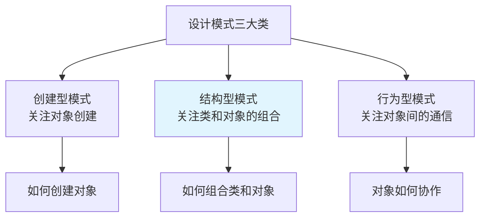

| 分类 | 关注点 | 核心问题 | 典型模式 |
|------|--------|----------|----------|
| **创建型** | 对象的创建过程 | 如何创建对象？ | 单例、工厂、建造者 |
| **结构型** | 类和对象的组合 | 如何组合类和对象？ | 适配器、代理、装饰器 |
| **行为型** | 对象之间的职责分配 | 对象如何协作？ | 观察者、策略、模板方法 |

---

## 1.2 结构型模式的核心思想

### 组合优于继承（Composition over Inheritance）

结构型模式普遍遵循"**组合优于继承**"的原则：

```java
// ❌ 继承方式（强耦合）
class Circle extends Shape {
    // 如果 Shape 改变，Circle 必须跟着改变
}

// ✅ 组合方式（弱耦合）
class Circle {
    private Shape shape; // 组合，而非继承
    // Shape 改变不影响 Circle
}
```

### 接口与实现分离

结构型模式通过**接口**来定义抽象，通过**实现类**来提供具体功能，实现接口与实现的解耦。

---

## 1.3 七种结构型模式概览

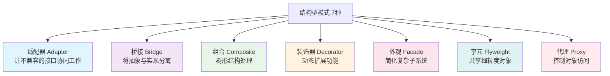

### 七种结构型模式对比表

| 模式 | 核心目的 | 适用场景 | 关键特点 |
|------|---------|---------|---------|
| **适配器** | 让不兼容的接口协同工作 | 需要使用现有类但接口不匹配 | 包装器、转换接口 |
| **桥接** | 将抽象与实现分离 | 避免类爆炸，多维度变化 | 组合替代继承 |
| **组合** | 树形结构处理 | 部分-整体层次结构 | 统一叶子节点和组合节点 |
| **装饰器** | 动态扩展功能 | 需要动态添加功能，避免类爆炸 | 包装器、链式调用 |
| **外观** | 简化复杂子系统 | 为复杂子系统提供统一接口 | 简化接口、隐藏复杂性 |
| **享元** | 共享细粒度对象 | 大量相似对象，内存优化 | 共享内部状态，外部状态分离 |
| **代理** | 控制对象访问 | 延迟加载、访问控制、增强功能 | 代理对象控制原对象访问 |

---

# 二、适配器模式（Adapter）

## 2.1 什么是适配器模式

> **定义**：将一个类的接口转换成客户希望的另一个接口。适配器模式使得原本由于接口不兼容而不能一起工作的类可以一起工作。

**生活中的例子**：电源适配器（220V → 5V）、转接头（USB-C → USB-A）

### UML 类图

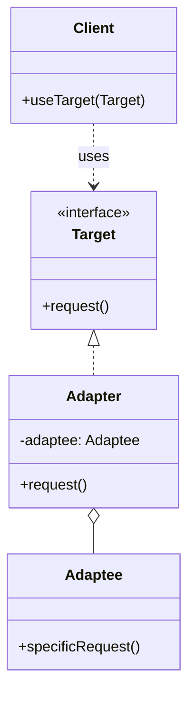

### 适配器模式的三种实现方式

1. **类适配器**：通过继承实现（Java 不支持多继承，不常用）
2. **对象适配器**：通过组合实现（推荐）
3. **接口适配器**：缺省适配器模式（为接口提供默认实现）

---

## 2.2 对象适配器（推荐）⭐⭐⭐

### 场景：使用第三方播放器

假设我们有一个音乐播放系统，需要支持多种播放器，但它们的接口不同：

```java
// 目标接口（我们系统需要的接口）
public interface MediaPlayer {
    void play(String audioType, String fileName);
}

// 已有的第三方播放器（不兼容的接口）
public class VlcPlayer {
    public void playVlc(String fileName) {
        System.out.println("VLC 播放器播放: " + fileName);
    }
}

public class Mp4Player {
    public void playMp4(String fileName) {
        System.out.println("MP4 播放器播放: " + fileName);
    }
}

// 适配器：将第三方播放器适配到我们的接口
public class MediaAdapter implements MediaPlayer {
    private VlcPlayer vlcPlayer;
    private Mp4Player mp4Player;
    
    public MediaAdapter(String audioType) {
        if ("vlc".equalsIgnoreCase(audioType)) {
            vlcPlayer = new VlcPlayer();
        } else if ("mp4".equalsIgnoreCase(audioType)) {
            mp4Player = new Mp4Player();
        }
    }
    
    @Override
    public void play(String audioType, String fileName) {
        if ("vlc".equalsIgnoreCase(audioType)) {
            vlcPlayer.playVlc(fileName);
        } else if ("mp4".equalsIgnoreCase(audioType)) {
            mp4Player.playMp4(fileName);
        }
    }
}

// 客户端使用
public class AudioPlayer implements MediaPlayer {
    private MediaAdapter adapter;
    
    @Override
    public void play(String audioType, String fileName) {
        if ("mp3".equalsIgnoreCase(audioType)) {
            System.out.println("内置 MP3 播放器播放: " + fileName);
        } else if ("vlc".equalsIgnoreCase(audioType) || "mp4".equalsIgnoreCase(audioType)) {
            adapter = new MediaAdapter(audioType);
            adapter.play(audioType, fileName);
        } else {
            System.out.println("不支持的格式: " + audioType);
        }
    }
}
```

---

## 2.3 类适配器（了解）

类适配器通过**继承**被适配者来实现适配，但 Java 不支持多继承，所以不常用：

```java
// 类适配器（Java 中不常用，因为不支持多继承）
public class ClassAdapter extends Adaptee implements Target {
    @Override
    public void request() {
        specificRequest(); // 调用父类方法
    }
}
```

---

## 2.4 接口适配器（缺省适配器模式）

为接口提供默认实现，子类只需实现需要的方法：

```java
// 接口（方法很多）
public interface WindowListener {
    void windowOpened(WindowEvent e);
    void windowClosing(WindowEvent e);
    void windowClosed(WindowEvent e);
    void windowIconified(WindowEvent e);
    void windowDeiconified(WindowEvent e);
    void windowActivated(WindowEvent e);
    void windowDeactivated(WindowEvent e);
}

// 缺省适配器（提供空实现）
public abstract class WindowAdapter implements WindowListener {
    @Override public void windowOpened(WindowEvent e) {}
    @Override public void windowClosing(WindowEvent e) {}
    @Override public void windowClosed(WindowEvent e) {}
    @Override public void windowIconified(WindowEvent e) {}
    @Override public void windowDeiconified(WindowEvent e) {}
    @Override public void windowActivated(WindowEvent e) {}
    @Override public void windowDeactivated(WindowEvent e) {}
}

// 子类只需实现需要的方法
public class MyWindowListener extends WindowAdapter {
    @Override
    public void windowClosing(WindowEvent e) {
        System.out.println("窗口关闭");
        System.exit(0);
    }
    // 其他方法使用父类的空实现
}
```

---

## 2.5 适配器模式优缺点

| 优点 | 缺点 |
|------|------|
| 让不兼容的接口协同工作 | 增加系统复杂度 |
| 提高类的复用性 | 过多使用会让系统变得混乱 |
| 符合开闭原则（对扩展开放） | 需要理解适配器的转换逻辑 |

---

## 2.6 实际应用

### JDK 中的应用

```java
// Arrays.asList() 返回的 List 是适配器
List<String> list = Arrays.asList("a", "b", "c");
// 这个 List 适配了数组，但修改会抛出 UnsupportedOperationException

// InputStreamReader 是适配器（字节流 → 字符流）
InputStream is = new FileInputStream("file.txt");
Reader reader = new InputStreamReader(is, "UTF-8"); // 适配器
```

### Spring 中的应用

```java
// Spring MVC 中的 HandlerAdapter
// 将不同类型的 Controller（@Controller、HttpRequestHandler 等）
// 适配到统一的 HandlerAdapter 接口
public interface HandlerAdapter {
    boolean supports(Object handler);
    ModelAndView handle(HttpServletRequest request, 
                       HttpServletResponse response, 
                       Object handler) throws Exception;
}
```

---

# 三、桥接模式（Bridge）

## 3.1 什么是桥接模式

> **定义**：将抽象与实现分离，使它们可以独立变化。桥接模式通过组合的方式，而不是继承的方式来实现抽象和实现的解耦。

**核心思想**：用**组合**替代**继承**，避免类爆炸。

### 问题场景：类爆炸

假设我们要设计一个图形系统，支持多种形状（圆形、矩形）和多种颜色（红色、蓝色、绿色）：

```java
// ❌ 使用继承：会产生类爆炸
// 需要 3 种形状 × 3 种颜色 = 9 个类
class RedCircle extends Circle { }
class BlueCircle extends Circle { }
class GreenCircle extends Circle { }
class RedRectangle extends Rectangle { }
class BlueRectangle extends Rectangle { }
// ... 还有 5 个类
// 如果新增一种颜色，需要新增 3 个类
// 如果新增一种形状，需要新增 3 个类
```

### UML 类图

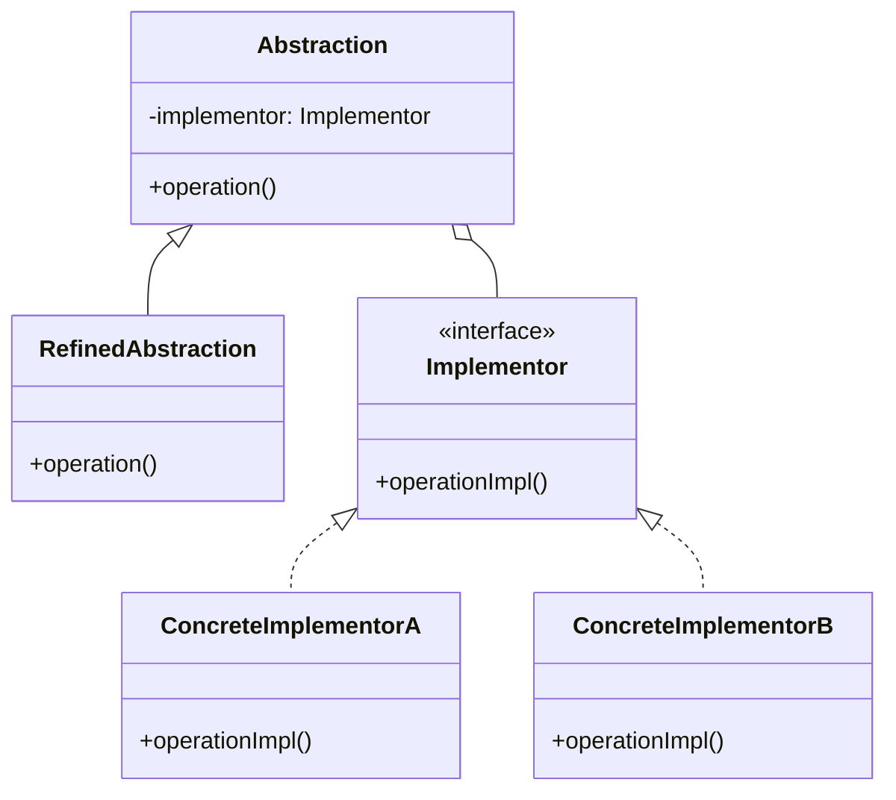

---

## 3.2 桥接模式实现

```java
// ===== 实现部分（颜色） =====
public interface Color {
    void applyColor();
}

public class Red implements Color {
    @Override
    public void applyColor() {
        System.out.print("红色");
    }
}

public class Blue implements Color {
    @Override
    public void applyColor() {
        System.out.print("蓝色");
    }
}

// ===== 抽象部分（形状） =====
public abstract class Shape {
    protected Color color; // 桥接：通过组合而非继承
    
    public Shape(Color color) {
        this.color = color;
    }
    
    public abstract void draw();
}

public class Circle extends Shape {
    public Circle(Color color) {
        super(color);
    }
    
    @Override
    public void draw() {
        System.out.print("画圆形，颜色：");
        color.applyColor();
        System.out.println();
    }
}

public class Rectangle extends Shape {
    public Rectangle(Color color) {
        super(color);
    }
    
    @Override
    public void draw() {
        System.out.print("画矩形，颜色：");
        color.applyColor();
        System.out.println();
    }
}

// ===== 使用 =====
public class Client {
    public static void main(String[] args) {
        // 红色圆形
        Shape redCircle = new Circle(new Red());
        redCircle.draw(); // 画圆形，颜色：红色
        
        // 蓝色矩形
        Shape blueRectangle = new Rectangle(new Blue());
        blueRectangle.draw(); // 画矩形，颜色：蓝色
        
        // 新增绿色圆形：只需新增 Green 类，不需要新增形状类
        Shape greenCircle = new Circle(new Green());
        greenCircle.draw();
    }
}
```

**优势**：
- 新增形状：只需新增形状类，不需要为每种颜色创建子类
- 新增颜色：只需新增颜色类，不需要为每种形状创建子类
- **避免了类爆炸**：3 种形状 × 3 种颜色 = 3 + 3 = 6 个类（而不是 9 个）

---

## 3.3 桥接模式 vs 继承

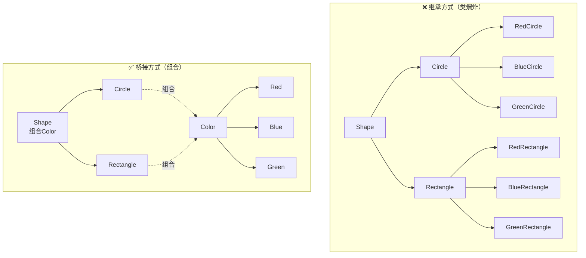

---

## 3.4 实际应用

### JDK 中的应用

```java
// JDBC 驱动就是桥接模式
// DriverManager（抽象）桥接了 Driver（实现）
Connection conn = DriverManager.getConnection("jdbc:mysql://...");
// MySQL Driver、Oracle Driver 等是不同实现
```

### Spring 中的应用

```java
// Spring 的 DataSource 桥接了不同的数据库连接实现
// DataSource（抽象）桥接了 DriverManagerDataSource、HikariDataSource 等（实现）
@Bean
public DataSource dataSource() {
    return new HikariDataSource(); // 可以切换为其他实现
}
```

---

# 四、组合模式（Composite）

## 4.1 什么是组合模式

> **定义**：将对象组合成树形结构以表示"部分-整体"的层次结构。组合模式使得用户对单个对象和组合对象的使用具有一致性。

**核心思想**：**统一叶子节点和组合节点**，让客户端以统一的方式处理单个对象和组合对象。

### 适用场景

- 文件系统（文件 + 文件夹）
- 组织架构（员工 + 部门）
- 菜单系统（菜单项 + 子菜单）
- UI 组件树（按钮 + 容器）

### UML 类图

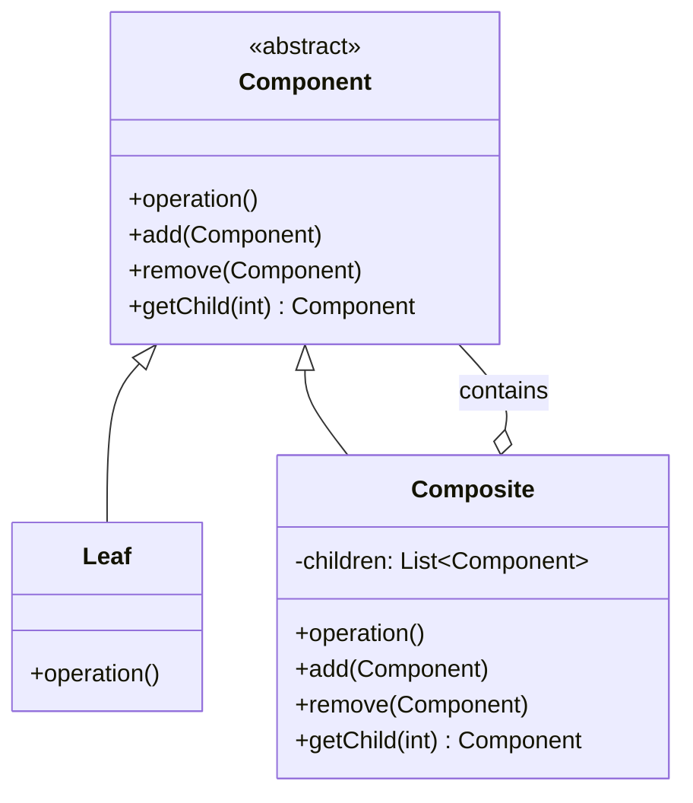

---

## 4.2 组合模式实现（文件系统示例）

```java
// ===== 抽象组件 =====
public abstract class FileSystemNode {
    protected String name;
    
    public FileSystemNode(String name) {
        this.name = name;
    }
    
    // 公共方法
    public abstract void display(int depth);
    
    // 组合节点的方法（叶子节点可以抛出异常或空实现）
    public void add(FileSystemNode node) {
        throw new UnsupportedOperationException("叶子节点不支持添加");
    }
    
    public void remove(FileSystemNode node) {
        throw new UnsupportedOperationException("叶子节点不支持删除");
    }
    
    public FileSystemNode getChild(int index) {
        throw new UnsupportedOperationException("叶子节点没有子节点");
    }
}

// ===== 叶子节点（文件） =====
public class File extends FileSystemNode {
    private long size;
    
    public File(String name, long size) {
        super(name);
        this.size = size;
    }
    
    @Override
    public void display(int depth) {
        String indent = "  ".repeat(depth);
        System.out.println(indent + "📄 " + name + " (" + size + " bytes)");
    }
}

// ===== 组合节点（文件夹） =====
public class Directory extends FileSystemNode {
    private List<FileSystemNode> children = new ArrayList<>();
    
    public Directory(String name) {
        super(name);
    }
    
    @Override
    public void display(int depth) {
        String indent = "  ".repeat(depth);
        System.out.println(indent + "📁 " + name);
        // 递归显示子节点
        for (FileSystemNode child : children) {
            child.display(depth + 1);
        }
    }
    
    @Override
    public void add(FileSystemNode node) {
        children.add(node);
    }
    
    @Override
    public void remove(FileSystemNode node) {
        children.remove(node);
    }
    
    @Override
    public FileSystemNode getChild(int index) {
        return children.get(index);
    }
}

// ===== 使用 =====
public class Client {
    public static void main(String[] args) {
        // 构建文件树
        Directory root = new Directory("根目录");
        
        Directory dir1 = new Directory("文档");
        dir1.add(new File("readme.txt", 1024));
        dir1.add(new File("notes.txt", 2048));
        
        Directory dir2 = new Directory("图片");
        dir2.add(new File("photo1.jpg", 512000));
        dir2.add(new File("photo2.jpg", 768000));
        
        root.add(dir1);
        root.add(dir2);
        root.add(new File("config.ini", 512));
        
        // 统一方式显示（客户端不需要区分文件和文件夹）
        root.display(0);
    }
}

// 输出：
// 📁 根目录
//   📁 文档
//     📄 readme.txt (1024 bytes)
//     📄 notes.txt (2048 bytes)
//   📁 图片
//     📄 photo1.jpg (512000 bytes)
//     📄 photo2.jpg (768000 bytes)
//   📄 config.ini (512 bytes)
```

---

## 4.3 组合模式的透明式 vs 安全式

### 透明式（上面的例子）

- **特点**：Component 定义了所有方法（包括 add、remove）
- **优点**：客户端可以统一处理，不需要判断是叶子还是组合
- **缺点**：叶子节点需要实现不需要的方法（抛出异常或空实现）

### 安全式

```java
// 安全式：Component 只定义公共方法，组合方法放在 Composite 中
public abstract class Component {
    public abstract void operation();
    // 不定义 add、remove 方法
}

public class Composite extends Component {
    private List<Component> children = new ArrayList<>();
    
    public void add(Component c) { children.add(c); }
    public void remove(Component c) { children.remove(c); }
    
    @Override
    public void operation() {
        for (Component child : children) {
            child.operation();
        }
    }
}

public class Leaf extends Component {
    @Override
    public void operation() {
        // 叶子节点的操作
    }
    // 不需要实现 add、remove
}
```

- **优点**：叶子节点不需要实现不需要的方法
- **缺点**：客户端需要判断是叶子还是组合，才能调用 add、remove

---

## 4.4 实际应用

### JDK 中的应用

```java
// java.awt.Container 和 Component 就是组合模式
Container panel = new JPanel();
panel.add(new JButton("按钮1")); // 添加组件
panel.add(new JLabel("标签1"));  // 添加组件
// Container 和 Component 都是 Component 的子类
```

### Spring 中的应用

```java
// Spring 的 BeanDefinition 可以包含子 BeanDefinition
// 形成树形结构
```

---

# 五、装饰器模式（Decorator）

## 5.1 什么是装饰器模式

> **定义**：动态地给一个对象添加一些额外的职责。就增加功能来说，装饰器模式比生成子类更为灵活。

**核心思想**：**包装器模式**，通过组合的方式动态扩展功能，避免类爆炸。

### 装饰器模式 vs 继承

```java
// ❌ 继承方式：类爆炸
class Coffee { }
class MilkCoffee extends Coffee { }
class SugarCoffee extends Coffee { }
class MilkSugarCoffee extends Coffee { } // 需要为每种组合创建类
// 如果有 3 种调料，需要 2^3 = 8 个类

// ✅ 装饰器方式：动态组合
class Coffee { }
class MilkDecorator extends CoffeeDecorator { } // 装饰器
class SugarDecorator extends CoffeeDecorator { } // 装饰器
// 可以任意组合，不需要为每种组合创建类
```

### UML 类图

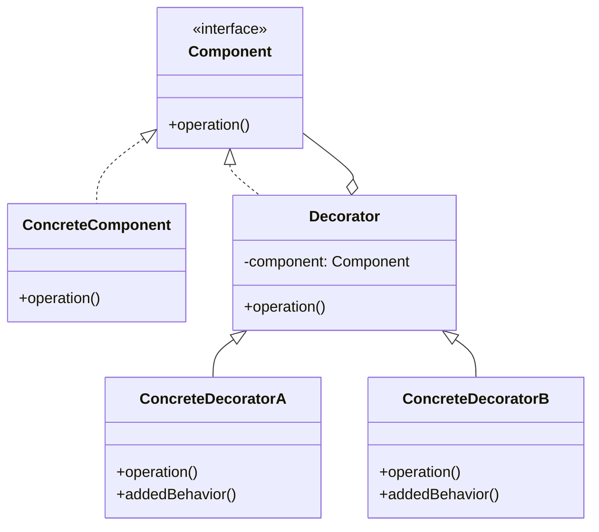

---

## 5.2 装饰器模式实现（咖啡加料示例）

```java
// ===== 抽象组件 =====
public interface Coffee {
    String getDescription();
    double getCost();
}

// ===== 具体组件 =====
public class SimpleCoffee implements Coffee {
    @Override
    public String getDescription() {
        return "普通咖啡";
    }
    
    @Override
    public double getCost() {
        return 5.0;
    }
}

// ===== 抽象装饰器 =====
public abstract class CoffeeDecorator implements Coffee {
    protected Coffee coffee; // 被装饰的对象
    
    public CoffeeDecorator(Coffee coffee) {
        this.coffee = coffee;
    }
    
    @Override
    public String getDescription() {
        return coffee.getDescription();
    }
    
    @Override
    public double getCost() {
        return coffee.getCost();
    }
}

// ===== 具体装饰器 =====
public class MilkDecorator extends CoffeeDecorator {
    public MilkDecorator(Coffee coffee) {
        super(coffee);
    }
    
    @Override
    public String getDescription() {
        return coffee.getDescription() + " + 牛奶";
    }
    
    @Override
    public double getCost() {
        return coffee.getCost() + 2.0;
    }
}

public class SugarDecorator extends CoffeeDecorator {
    public SugarDecorator(Coffee coffee) {
        super(coffee);
    }
    
    @Override
    public String getDescription() {
        return coffee.getDescription() + " + 糖";
    }
    
    @Override
    public double getCost() {
        return coffee.getCost() + 1.0;
    }
}

public class WhipDecorator extends CoffeeDecorator {
    public WhipDecorator(Coffee coffee) {
        super(coffee);
    }
    
    @Override
    public String getDescription() {
        return coffee.getDescription() + " + 奶油";
    }
    
    @Override
    public double getCost() {
        return coffee.getCost() + 3.0;
    }
}

// ===== 使用 =====
public class Client {
    public static void main(String[] args) {
        // 普通咖啡
        Coffee coffee = new SimpleCoffee();
        System.out.println(coffee.getDescription() + " = ¥" + coffee.getCost());
        // 输出：普通咖啡 = ¥5.0
        
        // 加牛奶
        coffee = new MilkDecorator(coffee);
        System.out.println(coffee.getDescription() + " = ¥" + coffee.getCost());
        // 输出：普通咖啡 + 牛奶 = ¥7.0
        
        // 再加糖
        coffee = new SugarDecorator(coffee);
        System.out.println(coffee.getDescription() + " = ¥" + coffee.getCost());
        // 输出：普通咖啡 + 牛奶 + 糖 = ¥8.0
        
        // 再加奶油
        coffee = new WhipDecorator(coffee);
        System.out.println(coffee.getDescription() + " = ¥" + coffee.getCost());
        // 输出：普通咖啡 + 牛奶 + 糖 + 奶油 = ¥11.0
        
        // 可以任意组合，不需要为每种组合创建类
    }
}
```

---

## 5.3 装饰器模式 vs 代理模式

| 维度 | 装饰器模式 | 代理模式 |
|------|-----------|---------|
| **目的** | 增强功能 | 控制访问 |
| **关注点** | 功能扩展 | 访问控制、延迟加载 |
| **关系** | 装饰器和被装饰者可以独立变化 | 代理和被代理者通常有固定关系 |
| **使用场景** | 动态添加功能 | 延迟加载、权限控制、日志记录 |

---

## 5.4 实际应用

### JDK 中的应用

```java
// java.io 包中的装饰器模式
// InputStream 是抽象组件
// FileInputStream 是具体组件
// BufferedInputStream、DataInputStream 是装饰器

InputStream is = new FileInputStream("file.txt");
is = new BufferedInputStream(is); // 装饰：添加缓冲功能
is = new DataInputStream(is);      // 装饰：添加数据读取功能
```

### Spring 中的应用

```java
// Spring AOP 中的装饰器模式
// 通过代理（装饰器）为 Bean 添加横切关注点（日志、事务等）
@Transactional
public class UserService {
    // 事务功能通过装饰器（代理）添加
}
```

---

# 六、外观模式（Facade）

## 6.1 什么是外观模式

> **定义**：为子系统中的一组接口提供一个统一的接口。外观模式定义了一个高层接口，这个接口使得这一子系统更加容易使用。

**核心思想**：**简化接口**，隐藏子系统的复杂性，提供一个简单的接口给客户端。

### 生活中的例子

- **遥控器**：一个遥控器控制电视、音响、空调等多个设备
- **一键启动**：汽车的一键启动按钮，背后涉及多个系统（发动机、电瓶、油路等）

### UML 类图

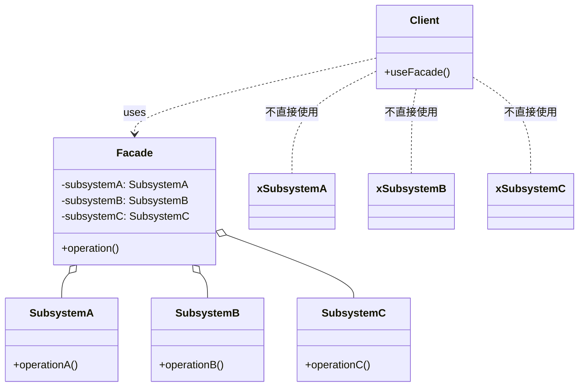

---

## 6.2 外观模式实现（家庭影院系统）

```java
// ===== 子系统组件 =====
public class DVDPlayer {
    public void on() { System.out.println("DVD 播放器打开"); }
    public void off() { System.out.println("DVD 播放器关闭"); }
    public void play(String movie) { System.out.println("播放电影: " + movie); }
    public void stop() { System.out.println("停止播放"); }
}

public class Projector {
    public void on() { System.out.println("投影仪打开"); }
    public void off() { System.out.println("投影仪关闭"); }
    public void wideScreenMode() { System.out.println("投影仪设置为宽屏模式"); }
}

public class SoundSystem {
    public void on() { System.out.println("音响系统打开"); }
    public void off() { System.out.println("音响系统关闭"); }
    public void setVolume(int level) { System.out.println("音量设置为: " + level); }
}

public class TheaterLights {
    public void on() { System.out.println("灯光打开"); }
    public void off() { System.out.println("灯光关闭"); }
    public void dim(int level) { System.out.println("灯光调暗到: " + level + "%"); }
}

// ===== 外观类（简化接口） =====
public class HomeTheaterFacade {
    private DVDPlayer dvdPlayer;
    private Projector projector;
    private SoundSystem soundSystem;
    private TheaterLights lights;
    
    public HomeTheaterFacade(DVDPlayer dvd, Projector proj, 
                             SoundSystem sound, TheaterLights lights) {
        this.dvdPlayer = dvd;
        this.projector = proj;
        this.soundSystem = sound;
        this.lights = lights;
    }
    
    // 一键看电影（简化了复杂的操作流程）
    public void watchMovie(String movie) {
        System.out.println("========== 准备看电影 ==========");
        lights.dim(10);              // 调暗灯光
        projector.on();              // 打开投影仪
        projector.wideScreenMode();  // 设置宽屏
        soundSystem.on();            // 打开音响
        soundSystem.setVolume(5);    // 设置音量
        dvdPlayer.on();              // 打开 DVD
        dvdPlayer.play(movie);       // 播放电影
        System.out.println("========== 开始观看 ==========");
    }
    
    // 一键结束
    public void endMovie() {
        System.out.println("========== 结束观看 ==========");
        dvdPlayer.stop();
        dvdPlayer.off();
        soundSystem.off();
        projector.off();
        lights.on();
        System.out.println("========== 已关闭所有设备 ==========");
    }
}

// ===== 使用 =====
public class Client {
    public static void main(String[] args) {
        // 创建子系统组件
        DVDPlayer dvd = new DVDPlayer();
        Projector projector = new Projector();
        SoundSystem sound = new SoundSystem();
        TheaterLights lights = new TheaterLights();
        
        // 创建外观
        HomeTheaterFacade facade = new HomeTheaterFacade(dvd, projector, sound, lights);
        
        // 客户端只需要调用简单的方法
        facade.watchMovie("复仇者联盟");
        // 输出：
        // ========== 准备看电影 ==========
        // 灯光调暗到: 10%
        // 投影仪打开
        // 投影仪设置为宽屏模式
        // 音响系统打开
        // 音量设置为: 5
        // DVD 播放器打开
        // 播放电影: 复仇者联盟
        // ========== 开始观看 ==========
        
        facade.endMovie();
    }
}
```

---

## 6.3 外观模式 vs 适配器模式

| 维度 | 外观模式 | 适配器模式 |
|------|---------|-----------|
| **目的** | 简化接口 | 转换接口 |
| **关注点** | 隐藏复杂性 | 接口兼容 |
| **关系** | 外观是子系统的简化接口 | 适配器是接口转换器 |
| **使用场景** | 为复杂子系统提供简单接口 | 让不兼容的接口协同工作 |

---

## 6.4 实际应用

### JDK 中的应用

```java
// java.net.URL 是外观模式
// 它封装了 URLConnection、URLStreamHandler 等复杂子系统
URL url = new URL("https://www.example.com");
URLConnection conn = url.openConnection(); // 简化了复杂的连接过程
```

### Spring 中的应用

```java
// Spring 的 JdbcTemplate 是外观模式
// 它封装了 Connection、Statement、ResultSet 等 JDBC 复杂操作
JdbcTemplate jdbcTemplate = new JdbcTemplate(dataSource);
jdbcTemplate.query("SELECT * FROM users", rowMapper); // 简化了 JDBC 操作
```

---

# 七、享元模式（Flyweight）

## 7.1 什么是享元模式

> **定义**：运用共享技术有效地支持大量细粒度的对象。

**核心思想**：**共享内部状态，分离外部状态**，减少对象数量，节省内存。

### 适用场景

- 系统中存在大量相似对象
- 这些对象的大部分状态可以共享
- 需要缓冲池的场景（如线程池、连接池）

### UML 类图

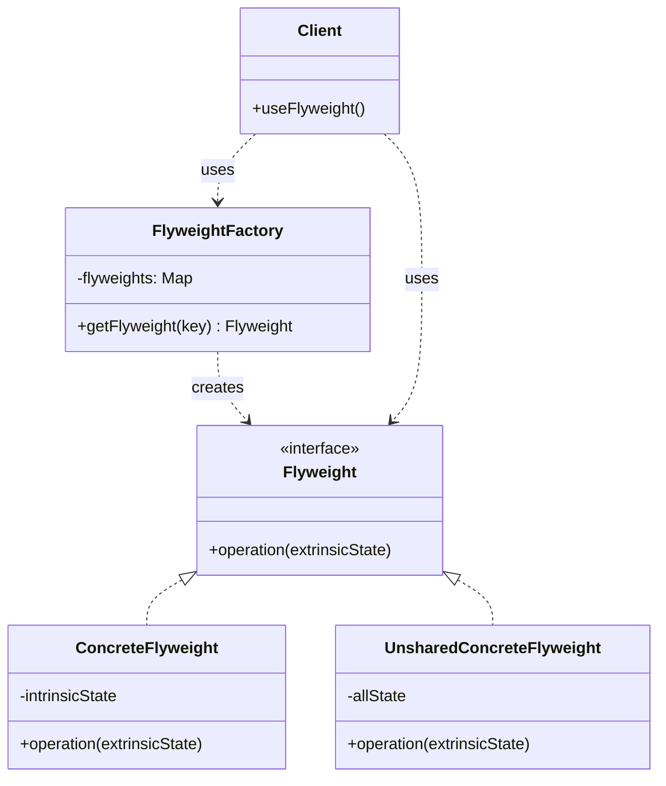

---

## 7.2 享元模式实现（围棋棋子示例）

围棋有 361 个位置，如果每个位置都创建一个棋子对象，会创建大量对象。但棋子只有两种：黑棋和白棋，可以共享。

```java
// ===== 享元接口 =====
public interface ChessPiece {
    void place(int x, int y); // x, y 是外部状态（位置）
}

// ===== 具体享元（共享内部状态：颜色） =====
public class BlackChessPiece implements ChessPiece {
    private final String color = "黑色"; // 内部状态（共享）
    
    @Override
    public void place(int x, int y) {
        System.out.println(color + "棋子放在 (" + x + ", " + y + ")");
    }
}

public class WhiteChessPiece implements ChessPiece {
    private final String color = "白色"; // 内部状态（共享）
    
    @Override
    public void place(int x, int y) {
        System.out.println(color + "棋子放在 (" + x + ", " + y + ")");
    }
}

// ===== 享元工厂 =====
public class ChessPieceFactory {
    private static final Map<String, ChessPiece> pieces = new HashMap<>();
    
    public static ChessPiece getChessPiece(String color) {
        ChessPiece piece = pieces.get(color);
        if (piece == null) {
            if ("黑色".equals(color)) {
                piece = new BlackChessPiece();
            } else if ("白色".equals(color)) {
                piece = new WhiteChessPiece();
            }
            pieces.put(color, piece);
            System.out.println("创建 " + color + " 棋子（享元对象）");
        }
        return piece;
    }
    
    public static int getPieceCount() {
        return pieces.size();
    }
}

// ===== 使用 =====
public class Client {
    public static void main(String[] args) {
        // 下 10 个黑棋
        for (int i = 0; i < 10; i++) {
            ChessPiece black = ChessPieceFactory.getChessPiece("黑色");
            black.place(i, i);
        }
        
        // 下 10 个白棋
        for (int i = 0; i < 10; i++) {
            ChessPiece white = ChessPieceFactory.getChessPiece("白色");
            white.place(i, 10 - i);
        }
        
        System.out.println("总共创建的棋子对象数: " + ChessPieceFactory.getPieceCount());
        // 输出：总共创建的棋子对象数: 2（只有 2 个对象，而不是 20 个）
    }
}
```

---

## 7.3 内部状态 vs 外部状态

| 状态类型 | 说明 | 示例 |
|---------|------|------|
| **内部状态（Intrinsic State）** | 可以共享的状态，存储在享元对象内部 | 棋子的颜色、字符的字体 |
| **外部状态（Extrinsic State）** | 不能共享的状态，由客户端传入 | 棋子的位置、字符的位置 |

---

## 7.4 实际应用

### JDK 中的应用

```java
// String 常量池就是享元模式
String s1 = "hello";
String s2 = "hello";
System.out.println(s1 == s2); // true（共享同一个对象）

// Integer 缓存（-128 到 127）
Integer i1 = 127;
Integer i2 = 127;
System.out.println(i1 == i2); // true（共享）

Integer i3 = 128;
Integer i4 = 128;
System.out.println(i3 == i4); // false（超出缓存范围）
```

### 实际项目中的应用

```java
// 线程池就是享元模式
// 线程对象可以复用（共享），任务参数是外部状态
ExecutorService executor = Executors.newFixedThreadPool(10);
for (int i = 0; i < 100; i++) {
    final int taskId = i; // 外部状态
    executor.submit(() -> {
        System.out.println("执行任务: " + taskId);
    });
}
// 只创建了 10 个线程对象，而不是 100 个
```

---

# 八、代理模式（Proxy）

## 8.1 什么是代理模式

> **定义**：为其他对象提供一种代理以控制对这个对象的访问。

**核心思想**：**控制访问**，在访问对象时引入一定程度的间接性。

### 代理模式的三种类型

1. **静态代理**：代理类在编译时确定
2. **动态代理**：代理类在运行时生成（JDK 动态代理、CGLIB）
3. **虚拟代理**：延迟加载（Lazy Loading）

### UML 类图

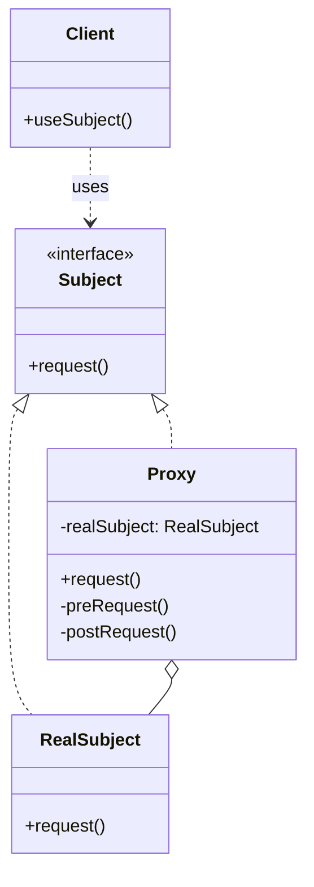

---

## 8.2 静态代理

```java
// ===== 接口 =====
public interface UserService {
    void saveUser(User user);
    void deleteUser(Long id);
}

// ===== 真实对象 =====
public class UserServiceImpl implements UserService {
    @Override
    public void saveUser(User user) {
        System.out.println("保存用户: " + user.getName());
        // 实际的保存逻辑
    }
    
    @Override
    public void deleteUser(Long id) {
        System.out.println("删除用户: " + id);
        // 实际的删除逻辑
    }
}

// ===== 代理对象 =====
public class UserServiceProxy implements UserService {
    private UserService target; // 被代理的对象
    
    public UserServiceProxy(UserService target) {
        this.target = target;
    }
    
    @Override
    public void saveUser(User user) {
        System.out.println("【代理】开始保存用户...");
        long start = System.currentTimeMillis();
        
        target.saveUser(user); // 调用真实对象的方法
        
        long end = System.currentTimeMillis();
        System.out.println("【代理】保存用户完成，耗时: " + (end - start) + "ms");
    }
    
    @Override
    public void deleteUser(Long id) {
        System.out.println("【代理】开始删除用户...");
        long start = System.currentTimeMillis();
        
        target.deleteUser(id); // 调用真实对象的方法
        
        long end = System.currentTimeMillis();
        System.out.println("【代理】删除用户完成，耗时: " + (end - start) + "ms");
    }
}

// ===== 使用 =====
public class Client {
    public static void main(String[] args) {
        UserService realService = new UserServiceImpl();
        UserService proxy = new UserServiceProxy(realService);
        
        proxy.saveUser(new User("张三"));
        // 输出：
        // 【代理】开始保存用户...
        // 保存用户: 张三
        // 【代理】保存用户完成，耗时: 2ms
    }
}
```

**静态代理的缺点**：
- 每个被代理类都需要一个代理类，类数量翻倍
- 如果接口方法很多，代理类代码冗余

---

## 8.3 JDK 动态代理 ⭐⭐⭐

JDK 动态代理通过 `Proxy` 类和 `InvocationHandler` 接口在运行时生成代理类：

```java
// ===== 接口 =====
public interface UserService {
    void saveUser(User user);
    void deleteUser(Long id);
}

// ===== 真实对象 =====
public class UserServiceImpl implements UserService {
    @Override
    public void saveUser(User user) {
        System.out.println("保存用户: " + user.getName());
    }
    
    @Override
    public void deleteUser(Long id) {
        System.out.println("删除用户: " + id);
    }
}

// ===== 动态代理处理器 =====
public class LogInvocationHandler implements InvocationHandler {
    private Object target; // 被代理的对象
    
    public LogInvocationHandler(Object target) {
        this.target = target;
    }
    
    @Override
    public Object invoke(Object proxy, Method method, Object[] args) throws Throwable {
        System.out.println("【动态代理】调用方法: " + method.getName());
        long start = System.currentTimeMillis();
        
        // 调用真实对象的方法
        Object result = method.invoke(target, args);
        
        long end = System.currentTimeMillis();
        System.out.println("【动态代理】方法执行完成，耗时: " + (end - start) + "ms");
        return result;
    }
}

// ===== 使用 =====
public class Client {
    public static void main(String[] args) {
        UserService realService = new UserServiceImpl();
        
        // 创建动态代理
        UserService proxy = (UserService) Proxy.newProxyInstance(
            realService.getClass().getClassLoader(),  // 类加载器
            realService.getClass().getInterfaces(),    // 接口数组
            new LogInvocationHandler(realService)      // 处理器
        );
        
        proxy.saveUser(new User("张三"));
        // 输出：
        // 【动态代理】调用方法: saveUser
        // 保存用户: 张三
        // 【动态代理】方法执行完成，耗时: 1ms
    }
}
```

**JDK 动态代理原理**：
1. 在运行时通过 `Proxy.newProxyInstance()` 生成代理类
2. 代理类实现目标接口，所有方法调用都转发到 `InvocationHandler.invoke()`
3. 代理类是在内存中动态生成的，不会生成 `.class` 文件

**JDK 动态代理的限制**：
- 只能代理实现了接口的类
- 如果类没有实现接口，无法使用 JDK 动态代理

---

## 8.4 CGLIB 动态代理 ⭐⭐⭐

CGLIB 通过**继承**目标类来创建代理，不需要接口：

```java
// ===== 目标类（没有接口） =====
public class UserService {
    public void saveUser(User user) {
        System.out.println("保存用户: " + user.getName());
    }
    
    public void deleteUser(Long id) {
        System.out.println("删除用户: " + id);
    }
}

// ===== CGLIB 方法拦截器 =====
public class LogMethodInterceptor implements MethodInterceptor {
    @Override
    public Object intercept(Object obj, Method method, Object[] args, 
                           MethodProxy proxy) throws Throwable {
        System.out.println("【CGLIB代理】调用方法: " + method.getName());
        long start = System.currentTimeMillis();
        
        // 调用父类（目标类）的方法
        Object result = proxy.invokeSuper(obj, args);
        
        long end = System.currentTimeMillis();
        System.out.println("【CGLIB代理】方法执行完成，耗时: " + (end - start) + "ms");
        return result;
    }
}

// ===== 使用 =====
public class Client {
    public static void main(String[] args) {
        // 创建 Enhancer
        Enhancer enhancer = new Enhancer();
        enhancer.setSuperclass(UserService.class); // 设置父类
        enhancer.setCallback(new LogMethodInterceptor()); // 设置回调
        
        // 创建代理对象
        UserService proxy = (UserService) enhancer.create();
        
        proxy.saveUser(new User("张三"));
        // 输出：
        // 【CGLIB代理】调用方法: saveUser
        // 保存用户: 张三
        // 【CGLIB代理】方法执行完成，耗时: 1ms
    }
}
```

**CGLIB 原理**：
- 通过继承目标类创建子类
- 子类重写父类方法，在方法中调用 `MethodInterceptor.intercept()`
- 需要引入 CGLIB 依赖

**CGLIB 的限制**：
- 不能代理 final 类和方法（因为需要继承）
- 性能略低于 JDK 动态代理（但差距很小）

---

## 8.5 JDK 动态代理 vs CGLIB

| 维度 | JDK 动态代理 | CGLIB |
|------|------------|-------|
| **实现方式** | 实现接口 | 继承类 |
| **要求** | 目标类必须实现接口 | 目标类不能是 final |
| **性能** | 略快（JDK 8+ 优化后） | 略慢（但差距很小） |
| **依赖** | JDK 自带 | 需要引入 CGLIB |
| **Spring 默认** | 有接口用 JDK | 无接口用 CGLIB |

---

## 8.6 代理模式的应用场景

### 1. 远程代理（Remote Proxy）

为远程对象提供本地代表：

```java
// RMI（Remote Method Invocation）就是远程代理
// 客户端调用远程对象就像调用本地对象一样
```

### 2. 虚拟代理（Virtual Proxy）

延迟加载大对象：

```java
public class ImageProxy implements Image {
    private String filename;
    private RealImage realImage; // 延迟加载
    
    public ImageProxy(String filename) {
        this.filename = filename;
    }
    
    @Override
    public void display() {
        if (realImage == null) {
            realImage = new RealImage(filename); // 真正需要时才加载
        }
        realImage.display();
    }
}
```

### 3. 保护代理（Protection Proxy）

控制对对象的访问权限：

```java
public class ProtectionProxy implements UserService {
    private UserService target;
    private User currentUser;
    
    public ProtectionProxy(UserService target, User currentUser) {
        this.target = target;
        this.currentUser = currentUser;
    }
    
    @Override
    public void deleteUser(Long id) {
        if (!currentUser.isAdmin()) {
            throw new SecurityException("无权限删除用户");
        }
        target.deleteUser(id);
    }
}
```

### 4. 智能引用（Smart Reference）

在访问对象时执行额外操作（如计数、日志）：

```java
// Spring AOP 就是智能引用
// 在方法调用前后执行日志、事务等操作
```

---

## 8.7 实际应用

### Spring AOP

Spring AOP 使用代理模式实现横切关注点：

```java
@Service
public class UserService {
    @Transactional
    public void saveUser(User user) {
        // 保存用户
    }
}

// Spring 会为 UserService 创建代理
// 在 saveUser() 调用前后添加事务管理
```

**Spring AOP 代理选择**：
- 如果 Bean 实现了接口 → 使用 JDK 动态代理
- 如果 Bean 没有实现接口 → 使用 CGLIB

### MyBatis

MyBatis 的 Mapper 接口就是通过 JDK 动态代理实现的：

```java
// Mapper 接口
public interface UserMapper {
    User selectById(Long id);
}

// MyBatis 在运行时为 Mapper 接口创建代理对象
// 代理对象将方法调用转换为 SQL 执行
```

---

# 九、结构型模式在 Spring/JDK 中的应用总结

| 模式 | JDK 中的应用 | Spring 中的应用 |
|------|-------------|----------------|
| **适配器** | `InputStreamReader`、`Arrays.asList()` | `HandlerAdapter`（MVC） |
| **桥接** | JDBC `DriverManager` | `DataSource` 桥接不同实现 |
| **组合** | `java.awt.Container` 和 `Component` | `BeanDefinition` 树形结构 |
| **装饰器** | `java.io` 包（`BufferedInputStream` 等） | Spring AOP（功能增强） |
| **外观** | `java.net.URL` | `JdbcTemplate`（简化 JDBC） |
| **享元** | `String` 常量池、`Integer` 缓存 | 线程池、连接池 |
| **代理** | `java.lang.reflect.Proxy` | Spring AOP（JDK/CGLIB） |

### 关键总结

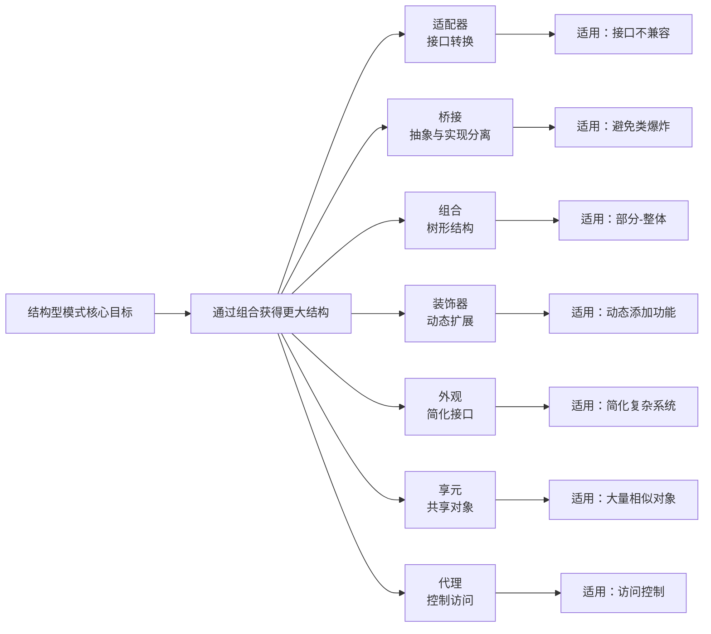

---

# 十、面试高频问题

## 题目 1：请说出 7 种结构型设计模式，并说说它们的区别？

**参考答案**：

7 种结构型模式：
1. **适配器模式**：让不兼容的接口协同工作
2. **桥接模式**：将抽象与实现分离，避免类爆炸
3. **组合模式**：树形结构，统一处理单个对象和组合对象
4. **装饰器模式**：动态扩展功能，避免类爆炸
5. **外观模式**：为复杂子系统提供简单接口
6. **享元模式**：共享细粒度对象，节省内存
7. **代理模式**：控制对象访问，延迟加载、权限控制

**区别**：
- **适配器**关注接口转换
- **桥接**关注抽象与实现分离
- **组合**关注树形结构
- **装饰器**关注功能扩展
- **外观**关注简化接口
- **享元**关注对象共享
- **代理**关注访问控制

---

## 题目 2：适配器模式和装饰器模式有什么区别？

**参考答案**：

| 维度 | 适配器模式 | 装饰器模式 |
|------|-----------|-----------|
| **目的** | 转换接口，让不兼容的接口协同工作 | 增强功能，动态添加职责 |
| **关系** | 适配器和被适配者通常没有继承关系 | 装饰器和被装饰者实现同一接口 |
| **使用场景** | 需要使用现有类但接口不匹配 | 需要动态添加功能 |
| **关注点** | 接口兼容性 | 功能扩展 |

**举例**：
- **适配器**：`InputStreamReader` 将字节流适配为字符流
- **装饰器**：`BufferedInputStream` 为 `InputStream` 添加缓冲功能

---

## 题目 3：代理模式和装饰器模式有什么区别？

**参考答案**：

| 维度 | 代理模式 | 装饰器模式 |
|------|---------|-----------|
| **目的** | 控制访问（延迟加载、权限控制） | 增强功能（添加新功能） |
| **关系** | 代理和被代理通常有固定关系 | 装饰器和被装饰者可以独立变化 |
| **关注点** | 访问控制 | 功能扩展 |
| **使用场景** | 延迟加载、权限控制、日志记录 | 动态添加功能 |

**关键区别**：
- **代理模式**：代理对象控制对原对象的访问，通常不改变原对象的功能
- **装饰器模式**：装饰器对象增强原对象的功能，添加新的职责

**举例**：
- **代理**：Spring AOP 代理控制方法调用（添加事务、日志）
- **装饰器**：`BufferedInputStream` 为 `InputStream` 添加缓冲功能

---

## 题目 4：JDK 动态代理和 CGLIB 有什么区别？

**参考答案**：

| 维度 | JDK 动态代理 | CGLIB |
|------|------------|-------|
| **实现方式** | 实现接口 | 继承类 |
| **要求** | 目标类必须实现接口 | 目标类不能是 final |
| **性能** | 略快（JDK 8+） | 略慢（但差距很小） |
| **依赖** | JDK 自带 | 需要引入 CGLIB |
| **原理** | 通过 `Proxy` 类生成代理类 | 通过继承生成子类 |

**Spring 的选择**：
- 如果 Bean 实现了接口 → 使用 JDK 动态代理
- 如果 Bean 没有实现接口 → 使用 CGLIB

**代码示例**：
```java
// JDK 动态代理
UserService proxy = (UserService) Proxy.newProxyInstance(...);

// CGLIB
UserService proxy = (UserService) enhancer.create();
```

---

## 题目 5：桥接模式和适配器模式有什么区别？

**参考答案**：

| 维度 | 桥接模式 | 适配器模式 |
|------|---------|-----------|
| **目的** | 将抽象与实现分离，避免类爆炸 | 让不兼容的接口协同工作 |
| **使用时机** | 设计阶段，预先设计 | 已有系统，需要集成 |
| **关注点** | 抽象与实现的解耦 | 接口转换 |
| **关系** | 抽象和实现可以独立变化 | 适配器适配已有接口 |

**关键区别**：
- **桥接模式**：在**设计阶段**使用，将抽象和实现分离，避免类爆炸
- **适配器模式**：在**已有系统**中使用，让不兼容的接口协同工作

**举例**：
- **桥接**：图形系统（形状 × 颜色），避免为每种组合创建类
- **适配器**：使用第三方播放器，但接口不匹配，需要适配

---

## 题目 6：组合模式和装饰器模式有什么区别？

**参考答案**：

| 维度 | 组合模式 | 装饰器模式 |
|------|---------|-----------|
| **目的** | 树形结构，统一处理单个对象和组合对象 | 动态扩展功能 |
| **结构** | 树形结构（部分-整体） | 链式结构（包装器链） |
| **关注点** | 对象组合 | 功能扩展 |
| **使用场景** | 文件系统、组织架构 | 动态添加功能 |

**关键区别**：
- **组合模式**：关注**对象组合**，形成树形结构，统一处理叶子节点和组合节点
- **装饰器模式**：关注**功能扩展**，形成链式结构，动态添加功能

**举例**：
- **组合**：文件系统（文件 + 文件夹），统一显示
- **装饰器**：咖啡加料（咖啡 + 牛奶 + 糖），动态组合

---

## 题目 7：享元模式的应用场景？String 常量池是享元模式吗？

**参考答案**：

**享元模式的应用场景**：
1. 系统中存在大量相似对象
2. 这些对象的大部分状态可以共享
3. 需要缓冲池的场景（线程池、连接池）

**String 常量池是享元模式**：
```java
String s1 = "hello";
String s2 = "hello";
System.out.println(s1 == s2); // true（共享同一个对象）
```

- `"hello"` 是内部状态（共享）
- 字符串对象被缓存在常量池中
- 相同的字符串字面量共享同一个对象

**其他享元模式的应用**：
- `Integer` 缓存（-128 到 127）
- 线程池（线程对象复用）
- 连接池（连接对象复用）

---

## 题目 8：Spring AOP 使用的是什么代理？如何选择？

**参考答案**：

**Spring AOP 的代理选择**：
1. **如果 Bean 实现了接口** → 使用 **JDK 动态代理**
2. **如果 Bean 没有实现接口** → 使用 **CGLIB**

**强制使用 CGLIB**：
```java
@EnableAspectJAutoProxy(proxyTargetClass = true)
```

**代码示例**：
```java
// 有接口 → JDK 动态代理
public interface UserService { }
@Service
public class UserServiceImpl implements UserService { }

// 无接口 → CGLIB
@Service
public class UserService { }
```

**为什么这样选择**：
- JDK 动态代理只能代理接口，性能略好
- CGLIB 可以代理类，但需要继承，不能代理 final 类

---

## 题目 9：外观模式和适配器模式有什么区别？

**参考答案**：

| 维度 | 外观模式 | 适配器模式 |
|------|---------|-----------|
| **目的** | 简化接口，隐藏复杂性 | 转换接口，让不兼容的接口协同工作 |
| **关注点** | 简化使用 | 接口兼容 |
| **关系** | 外观是子系统的简化接口 | 适配器是接口转换器 |
| **使用场景** | 为复杂子系统提供简单接口 | 让不兼容的接口协同工作 |

**关键区别**：
- **外观模式**：为**复杂子系统**提供**简单接口**，隐藏复杂性
- **适配器模式**：让**不兼容的接口**协同工作，转换接口

**举例**：
- **外观**：`JdbcTemplate` 简化 JDBC 操作
- **适配器**：`InputStreamReader` 将字节流适配为字符流

---

## 题目 10：实际项目中你用过哪些结构型模式？

**参考答案**：

**常用场景**：

1. **适配器模式**：
   - 集成第三方 SDK，接口不匹配时使用适配器
   - 系统升级，新旧接口兼容

2. **装饰器模式**：
   - Java IO 流（`BufferedInputStream`、`DataInputStream`）
   - 为功能动态添加增强（日志、缓存）

3. **代理模式**：
   - Spring AOP（事务、日志）
   - MyBatis Mapper 接口
   - RPC 框架（远程代理）

4. **外观模式**：
   - `JdbcTemplate` 简化 JDBC
   - 封装复杂子系统，提供简单接口

5. **享元模式**：
   - 线程池、连接池
   - 缓存常用对象

6. **组合模式**：
   - 菜单系统
   - 权限树

7. **桥接模式**：
   - 多维度变化的场景（避免类爆炸）

---

> **课件结束**。建议配合 `code/` 目录下的实验代码一起学习，动手实践效果更好。
